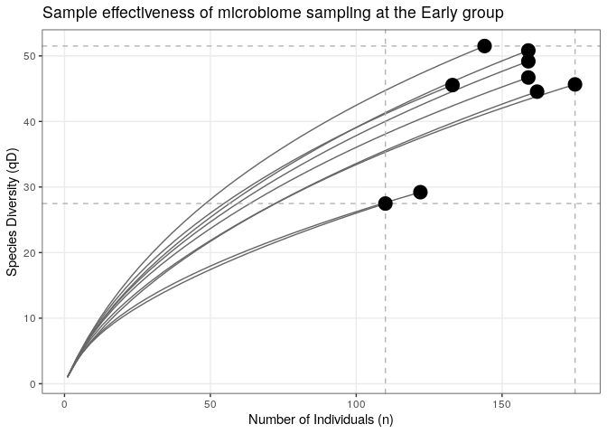

# Exploratory data analysis

## Show the OTU table

<div data-pagedtable="false">
  <script data-pagedtable-source type="application/json">
{"columns":[{"label":["OTU"],"name":[1],"type":["chr"],"align":["left"]},{"label":["F3D0"],"name":[2],"type":["int"],"align":["right"]},{"label":["F3D141"],"name":[3],"type":["int"],"align":["right"]},{"label":["F3D142"],"name":[4],"type":["int"],"align":["right"]},{"label":["F3D143"],"name":[5],"type":["int"],"align":["right"]},{"label":["F3D144"],"name":[6],"type":["int"],"align":["right"]},{"label":["F3D145"],"name":[7],"type":["int"],"align":["right"]},{"label":["F3D146"],"name":[8],"type":["int"],"align":["right"]},{"label":["F3D147"],"name":[9],"type":["int"],"align":["right"]},{"label":["F3D148"],"name":[10],"type":["int"],"align":["right"]},{"label":["F3D149"],"name":[11],"type":["int"],"align":["right"]},{"label":["F3D150"],"name":[12],"type":["int"],"align":["right"]},{"label":["F3D1"],"name":[13],"type":["int"],"align":["right"]},{"label":["F3D2"],"name":[14],"type":["int"],"align":["right"]},{"label":["F3D3"],"name":[15],"type":["int"],"align":["right"]},{"label":["F3D5"],"name":[16],"type":["int"],"align":["right"]},{"label":["F3D6"],"name":[17],"type":["int"],"align":["right"]},{"label":["F3D7"],"name":[18],"type":["int"],"align":["right"]},{"label":["F3D8"],"name":[19],"type":["int"],"align":["right"]},{"label":["F3D9"],"name":[20],"type":["int"],"align":["right"]}],"data":[{"1":"1059977 Streptococcus agalactiae","2":"0","3":"1","4":"0","5":"0","6":"0","7":"0","8":"0","9":"0","10":"0","11":"0","12":"0","13":"0","14":"0","15":"0","16":"0","17":"0","18":"0","19":"0","20":"0"},{"1":"1096270 Staphylococcus aureus","2":"0","3":"1","4":"1","5":"0","6":"0","7":"1","8":"0","9":"0","10":"0","11":"0","12":"0","13":"0","14":"0","15":"0","16":"0","17":"0","18":"0","19":"0","20":"0"},{"1":"1105663 Prauserella rugosa","2":"15","3":"3","4":"3","5":"2","6":"2","7":"8","8":"1","9":"14","10":"11","11":"5","12":"5","13":"2","14":"33","15":"5","16":"8","17":"2","18":"5","19":"3","20":"9"},{"1":"1107026 Streptomyces werraensis","2":"6","3":"3","4":"11","5":"2","6":"1","7":"2","8":"0","9":"7","10":"0","11":"3","12":"5","13":"10","14":"21","15":"5","16":"0","17":"24","18":"9","19":"9","20":"8"},{"1":"1110606 Collinsella aerofaciens","2":"89","3":"21","4":"2","5":"6","6":"10","7":"4","8":"3","9":"1","10":"10","11":"10","12":"2","13":"12","14":"39","15":"5","16":"10","17":"16","18":"7","19":"18","20":"15"},{"1":"1125725 Pseudoxanthomonas kalamensis","2":"0","3":"3","4":"8","5":"1","6":"9","7":"16","8":"10","9":"6","10":"10","11":"4","12":"7","13":"0","14":"0","15":"0","16":"0","17":"0","18":"2","19":"10","20":"4"},{"1":"1127637 Haererehalobacter salaria","2":"0","3":"0","4":"0","5":"0","6":"0","7":"0","8":"0","9":"0","10":"0","11":"0","12":"0","13":"1","14":"0","15":"0","16":"0","17":"1","18":"0","19":"1","20":"1"},{"1":"1127719 Oceaniserpentilla haliotis","2":"0","3":"1","4":"0","5":"1","6":"0","7":"0","8":"1","9":"3","10":"6","11":"6","12":"4","13":"4","14":"5","15":"2","16":"3","17":"0","18":"2","19":"2","20":"0"},{"1":"1131768 Carboxydothermus siderophilus","2":"0","3":"0","4":"0","5":"0","6":"1","7":"0","8":"0","9":"0","10":"0","11":"0","12":"0","13":"0","14":"0","15":"0","16":"0","17":"0","18":"0","19":"0","20":"0"},{"1":"131391 Bifidobacterium pseudolongum","2":"0","3":"0","4":"0","5":"0","6":"0","7":"0","8":"0","9":"0","10":"2","11":"0","12":"0","13":"0","14":"0","15":"0","16":"0","17":"0","18":"0","19":"0","20":"0"},{"1":"132913 Skermania piniformis","2":"2","3":"1","4":"1","5":"1","6":"0","7":"0","8":"1","9":"1","10":"1","11":"6","12":"3","13":"3","14":"30","15":"16","16":"11","17":"9","18":"1","19":"2","20":"2"},{"1":"14030 [Ruminococcus] gnavus","2":"7","3":"3","4":"2","5":"0","6":"1","7":"1","8":"0","9":"7","10":"6","11":"7","12":"1","13":"6","14":"31","15":"8","16":"1","17":"1","18":"2","19":"6","20":"10"},{"1":"143665 Pseudomonas nitroreducens","2":"0","3":"0","4":"0","5":"1","6":"0","7":"0","8":"0","9":"0","10":"0","11":"0","12":"0","13":"0","14":"0","15":"0","16":"0","17":"0","18":"0","19":"0","20":"0"},{"1":"15281 Enterococcus sulfureus","2":"0","3":"1","4":"0","5":"0","6":"0","7":"0","8":"0","9":"0","10":"0","11":"0","12":"0","13":"0","14":"0","15":"0","16":"0","17":"0","18":"0","19":"0","20":"0"},{"1":"1571244 Anoxybacillus kestanbolensis","2":"16","3":"10","4":"0","5":"2","6":"0","7":"2","8":"3","9":"9","10":"12","11":"4","12":"3","13":"3","14":"26","15":"12","16":"5","17":"3","18":"8","19":"3","20":"6"},{"1":"158494 Bacteroides barnesiae","2":"0","3":"0","4":"0","5":"0","6":"0","7":"0","8":"0","9":"0","10":"0","11":"1","12":"0","13":"0","14":"0","15":"0","16":"0","17":"0","18":"0","19":"0","20":"0"},{"1":"163130 Bacillus aurantiacus","2":"0","3":"2","4":"1","5":"1","6":"0","7":"1","8":"0","9":"0","10":"1","11":"5","12":"1","13":"0","14":"0","15":"0","16":"0","17":"0","18":"0","19":"0","20":"0"},{"1":"164066 Staphylococcus sciuri","2":"1","3":"8","4":"1","5":"6","6":"1","7":"1","8":"2","9":"7","10":"5","11":"18","12":"12","13":"0","14":"2","15":"1","16":"1","17":"2","18":"0","19":"0","20":"1"},{"1":"164719 [Ruminococcus] gnavus","2":"13","3":"0","4":"0","5":"0","6":"0","7":"0","8":"0","9":"1","10":"0","11":"0","12":"0","13":"10","14":"26","15":"2","16":"8","17":"1","18":"0","19":"1","20":"0"},{"1":"166292 Plesiomonas shigelloides","2":"28","3":"7","4":"3","5":"1","6":"2","7":"2","8":"14","9":"15","10":"8","11":"13","12":"8","13":"22","14":"40","15":"5","16":"12","17":"40","18":"4","19":"28","20":"36"},{"1":"1664540 Pseudoalteromonas porphyrae","2":"0","3":"1","4":"0","5":"0","6":"0","7":"0","8":"0","9":"0","10":"1","11":"0","12":"0","13":"0","14":"0","15":"0","16":"0","17":"0","18":"0","19":"0","20":"1"},{"1":"167717 Plesiomonas shigelloides","2":"0","3":"6","4":"1","5":"4","6":"12","7":"15","8":"10","9":"18","10":"13","11":"12","12":"0","13":"0","14":"1","15":"9","16":"1","17":"1","18":"1","19":"0","20":"2"},{"1":"168116 Xenorhabdus kozodoii","2":"0","3":"2","4":"1","5":"1","6":"6","7":"2","8":"1","9":"2","10":"4","11":"6","12":"4","13":"0","14":"0","15":"0","16":"2","17":"1","18":"0","19":"0","20":"2"},{"1":"170998 Staphylococcus sciuri","2":"64","3":"40","4":"27","5":"18","6":"41","7":"84","8":"29","9":"118","10":"112","11":"105","12":"40","13":"29","14":"175","15":"96","16":"41","17":"35","18":"21","19":"17","20":"36"},{"1":"1715972 Millettia pinnata","2":"0","3":"0","4":"0","5":"0","6":"0","7":"0","8":"0","9":"0","10":"1","11":"0","12":"0","13":"0","14":"0","15":"0","16":"0","17":"0","18":"0","19":"0","20":"0"},{"1":"173738 Cetobacterium somerae","2":"18","3":"0","4":"0","5":"0","6":"0","7":"0","8":"1","9":"0","10":"0","11":"0","12":"0","13":"9","14":"18","15":"7","16":"2","17":"8","18":"1","19":"2","20":"4"},{"1":"173827 Salinispora arenicola","2":"1","3":"1","4":"1","5":"0","6":"0","7":"2","8":"1","9":"13","10":"6","11":"3","12":"0","13":"3","14":"1","15":"0","16":"2","17":"5","18":"0","19":"1","20":"0"},{"1":"173845 Streptomyces ahygroscopicus","2":"9","3":"3","4":"1","5":"2","6":"2","7":"2","8":"3","9":"40","10":"9","11":"18","12":"4","13":"8","14":"13","15":"1","16":"5","17":"26","18":"0","19":"5","20":"11"},{"1":"174066 [Eubacterium] biforme","2":"0","3":"0","4":"0","5":"0","6":"0","7":"0","8":"1","9":"0","10":"0","11":"0","12":"1","13":"0","14":"0","15":"0","16":"0","17":"0","18":"0","19":"0","20":"0"},{"1":"174337 Akkermansia muciniphila","2":"18","3":"11","4":"4","5":"9","6":"1","7":"5","8":"17","9":"32","10":"16","11":"33","12":"31","13":"19","14":"72","15":"7","16":"17","17":"16","18":"9","19":"19","20":"29"},{"1":"174419 Coprococcus eutactus","2":"0","3":"0","4":"0","5":"0","6":"0","7":"0","8":"0","9":"2","10":"0","11":"0","12":"0","13":"0","14":"0","15":"0","16":"0","17":"0","18":"0","19":"0","20":"0"},{"1":"174439 Faecalibacterium prausnitzii","2":"26","3":"8","4":"3","5":"10","6":"15","7":"13","8":"33","9":"32","10":"12","11":"38","12":"24","13":"44","14":"130","15":"17","16":"39","17":"47","18":"11","19":"42","20":"62"},{"1":"174666 Arthrobacter oxydans","2":"26","3":"24","4":"10","5":"14","6":"5","7":"5","8":"30","9":"38","10":"48","11":"80","12":"28","13":"31","14":"42","15":"7","16":"9","17":"28","18":"12","19":"5","20":"16"},{"1":"175411 Faecalibacterium prausnitzii","2":"2","3":"1","4":"0","5":"0","6":"0","7":"0","8":"1","9":"0","10":"0","11":"0","12":"0","13":"7","14":"25","15":"5","16":"12","17":"28","18":"8","19":"9","20":"7"},{"1":"175791 Faecalibacterium prausnitzii","2":"4","3":"1","4":"0","5":"2","6":"1","7":"2","8":"2","9":"5","10":"5","11":"3","12":"3","13":"0","14":"4","15":"0","16":"1","17":"0","18":"0","19":"6","20":"6"},{"1":"176153 Faecalibacterium prausnitzii","2":"56","3":"80","4":"27","5":"34","6":"52","7":"99","8":"54","9":"495","10":"253","11":"203","12":"83","13":"9","14":"40","15":"17","16":"18","17":"13","18":"8","19":"6","20":"8"},{"1":"176858 [Ruminococcus] gnavus","2":"0","3":"1","4":"0","5":"0","6":"0","7":"0","8":"0","9":"2","10":"1","11":"1","12":"0","13":"1","14":"0","15":"0","16":"0","17":"0","18":"0","19":"1","20":"0"},{"1":"177016 Collinsella aerofaciens","2":"0","3":"2","4":"0","5":"2","6":"0","7":"1","8":"2","9":"8","10":"3","11":"3","12":"2","13":"3","14":"6","15":"2","16":"1","17":"2","18":"2","19":"4","20":"5"},{"1":"177620 Ruminococcus albus","2":"36","3":"80","4":"27","5":"56","6":"11","7":"11","8":"63","9":"72","10":"78","11":"234","12":"124","13":"14","14":"18","15":"1","16":"5","17":"5","18":"2","19":"5","20":"3"},{"1":"179340 Blautia producta","2":"0","3":"0","4":"0","5":"0","6":"0","7":"0","8":"0","9":"0","10":"0","11":"0","12":"0","13":"0","14":"0","15":"0","16":"0","17":"1","18":"0","19":"0","20":"0"},{"1":"179463 Streptomyces lanatus","2":"0","3":"1","4":"2","5":"0","6":"1","7":"4","8":"1","9":"20","10":"8","11":"2","12":"4","13":"0","14":"0","15":"0","16":"0","17":"1","18":"0","19":"0","20":"0"},{"1":"180797 Blautia obeum","2":"6","3":"2","4":"2","5":"2","6":"2","7":"3","8":"7","9":"6","10":"3","11":"8","12":"3","13":"12","14":"19","15":"18","16":"16","17":"26","18":"12","19":"35","20":"47"},{"1":"180959 Bacillus flexus","2":"9","3":"2","4":"3","5":"0","6":"1","7":"1","8":"3","9":"15","10":"1","11":"1","12":"2","13":"22","14":"45","15":"4","16":"19","17":"25","18":"18","19":"50","20":"97"},{"1":"182631 [Ruminococcus] gnavus","2":"0","3":"0","4":"0","5":"0","6":"0","7":"0","8":"0","9":"0","10":"0","11":"1","12":"0","13":"0","14":"0","15":"0","16":"0","17":"0","18":"0","19":"0","20":"0"},{"1":"182886 Bacteroides uniformis","2":"0","3":"0","4":"0","5":"1","6":"0","7":"3","8":"0","9":"2","10":"1","11":"2","12":"2","13":"0","14":"4","15":"4","16":"2","17":"12","18":"12","19":"12","20":"12"},{"1":"183088 Collinsella aerofaciens","2":"0","3":"0","4":"0","5":"0","6":"0","7":"0","8":"0","9":"0","10":"1","11":"0","12":"0","13":"0","14":"0","15":"0","16":"0","17":"0","18":"0","19":"0","20":"0"},{"1":"1833543 Bacteroides ovatus","2":"0","3":"1","4":"0","5":"0","6":"0","7":"0","8":"0","9":"1","10":"0","11":"2","12":"0","13":"0","14":"1","15":"2","16":"0","17":"0","18":"0","19":"1","20":"0"},{"1":"184536 [Ruminococcus] gnavus","2":"0","3":"0","4":"0","5":"0","6":"0","7":"0","8":"0","9":"2","10":"0","11":"3","12":"4","13":"0","14":"2","15":"0","16":"0","17":"0","18":"0","19":"0","20":"0"},{"1":"184897 Faecalibacterium prausnitzii","2":"1","3":"22","4":"2","5":"6","6":"10","7":"11","8":"36","9":"12","10":"5","11":"0","12":"0","13":"0","14":"0","15":"1","16":"1","17":"4","18":"1","19":"10","20":"12"},{"1":"185338 [Ruminococcus] gnavus","2":"0","3":"0","4":"0","5":"0","6":"0","7":"0","8":"1","9":"0","10":"0","11":"0","12":"0","13":"1","14":"0","15":"0","16":"0","17":"0","18":"0","19":"1","20":"0"},{"1":"185441 [Ruminococcus] gnavus","2":"1","3":"0","4":"1","5":"1","6":"1","7":"1","8":"0","9":"2","10":"1","11":"0","12":"0","13":"0","14":"0","15":"0","16":"1","17":"0","18":"0","19":"1","20":"0"},{"1":"186705 Akkermansia muciniphila","2":"16","3":"4","4":"2","5":"4","6":"2","7":"2","8":"2","9":"6","10":"2","11":"6","12":"4","13":"12","14":"23","15":"2","16":"6","17":"14","18":"2","19":"11","20":"12"},{"1":"186752 Dorea formicigenerans","2":"0","3":"0","4":"0","5":"0","6":"0","7":"0","8":"0","9":"0","10":"0","11":"0","12":"0","13":"0","14":"0","15":"0","16":"1","17":"0","18":"0","19":"0","20":"0"},{"1":"187703 [Ruminococcus] gnavus","2":"0","3":"6","4":"1","5":"4","6":"5","7":"7","8":"11","9":"3","10":"15","11":"28","12":"3","13":"0","14":"6","15":"0","16":"3","17":"7","18":"0","19":"1","20":"3"},{"1":"188090 [Ruminococcus] gnavus","2":"0","3":"0","4":"0","5":"0","6":"0","7":"0","8":"1","9":"0","10":"0","11":"1","12":"0","13":"0","14":"0","15":"0","16":"0","17":"0","18":"0","19":"0","20":"0"},{"1":"188369 Pseudomonas stutzeri","2":"1","3":"1","4":"0","5":"0","6":"0","7":"0","8":"0","9":"0","10":"3","11":"1","12":"0","13":"1","14":"3","15":"0","16":"0","17":"0","18":"0","19":"0","20":"0"},{"1":"189284 Prevotella copri","2":"2","3":"4","4":"1","5":"7","6":"0","7":"1","8":"4","9":"6","10":"4","11":"18","12":"8","13":"1","14":"17","15":"0","16":"6","17":"5","18":"1","19":"1","20":"9"},{"1":"189403 [Ruminococcus] gnavus","2":"68","3":"2","4":"4","5":"0","6":"3","7":"6","8":"36","9":"33","10":"7","11":"6","12":"5","13":"99","14":"198","15":"13","16":"48","17":"108","18":"44","19":"39","20":"48"},{"1":"190675 Faecalibacterium prausnitzii","2":"6","3":"0","4":"0","5":"0","6":"2","7":"0","8":"0","9":"0","10":"2","11":"0","12":"1","13":"4","14":"6","15":"1","16":"2","17":"1","18":"3","19":"1","20":"1"},{"1":"190698 Faecalibacterium prausnitzii","2":"20","3":"12","4":"2","5":"4","6":"2","7":"4","8":"14","9":"11","10":"19","11":"50","12":"21","13":"19","14":"43","15":"5","16":"6","17":"8","18":"2","19":"11","20":"5"},{"1":"191097 Faecalibacterium prausnitzii","2":"1","3":"0","4":"1","5":"0","6":"1","7":"0","8":"1","9":"3","10":"0","11":"1","12":"0","13":"4","14":"10","15":"1","16":"0","17":"4","18":"1","19":"3","20":"4"},{"1":"191258 Akkermansia muciniphila","2":"27","3":"56","4":"11","5":"21","6":"9","7":"17","8":"22","9":"42","10":"41","11":"145","12":"88","13":"33","14":"41","15":"9","16":"0","17":"21","18":"3","19":"8","20":"14"},{"1":"191319 Prevotella copri","2":"0","3":"4","4":"0","5":"7","6":"1","7":"3","8":"4","9":"4","10":"7","11":"17","12":"8","13":"1","14":"6","15":"9","16":"1","17":"3","18":"2","19":"2","20":"1"},{"1":"1918929 Zea luxurians","2":"0","3":"0","4":"0","5":"0","6":"0","7":"0","8":"0","9":"0","10":"1","11":"0","12":"0","13":"2","14":"3","15":"0","16":"0","17":"2","18":"0","19":"4","20":"1"},{"1":"192680 Lactobacillus ruminis","2":"0","3":"0","4":"0","5":"0","6":"0","7":"0","8":"0","9":"0","10":"0","11":"0","12":"0","13":"0","14":"0","15":"1","16":"0","17":"0","18":"0","19":"0","20":"0"},{"1":"192800 Faecalibacterium prausnitzii","2":"0","3":"0","4":"0","5":"0","6":"0","7":"0","8":"0","9":"0","10":"0","11":"0","12":"0","13":"0","14":"1","15":"0","16":"0","17":"0","18":"0","19":"0","20":"0"},{"1":"193014 Phormidium priestleyi","2":"0","3":"0","4":"0","5":"0","6":"0","7":"1","8":"0","9":"1","10":"0","11":"0","12":"0","13":"0","14":"0","15":"0","16":"0","17":"0","18":"0","19":"0","20":"0"},{"1":"193675 Sinorhizobium terangae","2":"3","3":"7","4":"3","5":"2","6":"1","7":"8","8":"17","9":"17","10":"5","11":"10","12":"9","13":"15","14":"36","15":"4","16":"11","17":"15","18":"5","19":"13","20":"20"},{"1":"194273 [Eubacterium] biforme","2":"11","3":"3","4":"0","5":"2","6":"2","7":"5","8":"4","9":"4","10":"4","11":"9","12":"4","13":"7","14":"3","15":"0","16":"1","17":"0","18":"2","19":"9","20":"6"},{"1":"194384 Blautia producta","2":"17","3":"28","4":"2","5":"4","6":"3","7":"2","8":"13","9":"24","10":"20","11":"25","12":"13","13":"34","14":"50","15":"10","16":"16","17":"22","18":"6","19":"23","20":"24"},{"1":"194489 Pseudomonas pseudoalcaligenes","2":"135","3":"268","4":"57","5":"70","6":"33","7":"95","8":"49","9":"61","10":"411","11":"420","12":"95","13":"150","14":"966","15":"303","16":"150","17":"194","18":"169","19":"221","20":"347"},{"1":"194689 Streptomyces netropsis","2":"1","3":"1","4":"0","5":"0","6":"0","7":"0","8":"1","9":"0","10":"0","11":"0","12":"0","13":"2","14":"0","15":"0","16":"0","17":"1","18":"0","19":"0","20":"0"},{"1":"195385 [Ruminococcus] gnavus","2":"5","3":"3","4":"1","5":"1","6":"6","7":"2","8":"1","9":"8","10":"8","11":"10","12":"7","13":"3","14":"7","15":"1","16":"7","17":"10","18":"5","19":"3","20":"7"},{"1":"195421 [Ruminococcus] gnavus","2":"2","3":"0","4":"0","5":"1","6":"2","7":"1","8":"6","9":"4","10":"6","11":"8","12":"1","13":"0","14":"0","15":"0","16":"0","17":"1","18":"0","19":"0","20":"1"},{"1":"195444 [Ruminococcus] gnavus","2":"0","3":"0","4":"0","5":"1","6":"0","7":"1","8":"1","9":"4","10":"1","11":"1","12":"0","13":"0","14":"0","15":"0","16":"0","17":"0","18":"0","19":"0","20":"0"},{"1":"195474 Lysinibacillus boronitolerans","2":"1","3":"0","4":"0","5":"0","6":"0","7":"1","8":"0","9":"1","10":"1","11":"1","12":"0","13":"1","14":"1","15":"0","16":"0","17":"0","18":"0","19":"1","20":"0"},{"1":"195877 Alcanivorax dieselolei","2":"0","3":"0","4":"0","5":"0","6":"0","7":"0","8":"0","9":"0","10":"0","11":"0","12":"0","13":"0","14":"0","15":"0","16":"0","17":"1","18":"0","19":"0","20":"0"},{"1":"196014 Collinsella aerofaciens","2":"669","3":"453","4":"272","5":"315","6":"508","7":"727","8":"417","9":"1737","10":"1298","11":"939","12":"296","13":"76","14":"147","15":"23","16":"20","17":"15","18":"9","19":"2","20":"4"},{"1":"196488 Faecalibacterium prausnitzii","2":"0","3":"0","4":"0","5":"0","6":"0","7":"0","8":"0","9":"0","10":"1","11":"0","12":"0","13":"0","14":"0","15":"0","16":"0","17":"0","18":"0","19":"0","20":"0"},{"1":"196664 Bacteroides uniformis","2":"0","3":"0","4":"0","5":"0","6":"0","7":"0","8":"1","9":"0","10":"0","11":"1","12":"1","13":"0","14":"0","15":"0","16":"0","17":"0","18":"0","19":"0","20":"0"},{"1":"197072 Bacteroides uniformis","2":"0","3":"3","4":"0","5":"0","6":"6","7":"5","8":"1","9":"14","10":"10","11":"6","12":"2","13":"0","14":"2","15":"0","16":"0","17":"2","18":"4","19":"0","20":"1"},{"1":"197361 Faecalibacterium prausnitzii","2":"1","3":"0","4":"0","5":"0","6":"0","7":"0","8":"0","9":"0","10":"0","11":"0","12":"0","13":"0","14":"0","15":"0","16":"0","17":"0","18":"0","19":"0","20":"0"},{"1":"197763 Prevotella copri","2":"4","3":"9","4":"6","5":"7","6":"3","7":"9","8":"1","9":"27","10":"17","11":"15","12":"3","13":"9","14":"21","15":"4","16":"4","17":"9","18":"1","19":"5","20":"6"},{"1":"197780 Pseudomonas veronii","2":"12","3":"0","4":"3","5":"0","6":"1","7":"1","8":"2","9":"7","10":"3","11":"0","12":"0","13":"14","14":"24","15":"5","16":"7","17":"10","18":"4","19":"8","20":"8"},{"1":"198054 [Eubacterium] dolichum","2":"0","3":"0","4":"0","5":"0","6":"0","7":"1","8":"0","9":"1","10":"0","11":"4","12":"0","13":"0","14":"0","15":"0","16":"0","17":"0","18":"0","19":"0","20":"0"},{"1":"198589 Bacillus halodurans","2":"0","3":"0","4":"0","5":"0","6":"0","7":"0","8":"0","9":"0","10":"0","11":"0","12":"0","13":"0","14":"1","15":"0","16":"0","17":"0","18":"0","19":"0","20":"0"},{"1":"198690 [Ruminococcus] gnavus","2":"0","3":"1","4":"0","5":"0","6":"0","7":"0","8":"0","9":"0","10":"1","11":"0","12":"0","13":"0","14":"0","15":"0","16":"0","17":"0","18":"1","19":"0","20":"0"},{"1":"199597 Paenibacillus amylolyticus","2":"3","3":"4","4":"1","5":"0","6":"1","7":"0","8":"2","9":"1","10":"4","11":"9","12":"2","13":"4","14":"7","15":"4","16":"7","17":"1","18":"2","19":"13","20":"9"},{"1":"199702 Faecalibacterium prausnitzii","2":"9","3":"9","4":"1","5":"3","6":"4","7":"5","8":"8","9":"8","10":"9","11":"20","12":"7","13":"22","14":"76","15":"16","16":"34","17":"36","18":"31","19":"37","20":"50"},{"1":"204086 Nocardiopsis lucentensis","2":"0","3":"0","4":"0","5":"0","6":"0","7":"0","8":"0","9":"1","10":"0","11":"0","12":"0","13":"0","14":"0","15":"0","16":"0","17":"0","18":"0","19":"0","20":"0"},{"1":"206290 Brevibacillus reuszeri","2":"0","3":"0","4":"0","5":"0","6":"0","7":"0","8":"0","9":"0","10":"0","11":"0","12":"0","13":"0","14":"0","15":"1","16":"0","17":"0","18":"0","19":"0","20":"0"},{"1":"207582 Faecalibacterium prausnitzii","2":"370","3":"306","4":"209","5":"202","6":"318","7":"519","8":"268","9":"1125","10":"749","11":"719","12":"287","13":"124","14":"424","15":"227","16":"150","17":"376","18":"250","19":"190","20":"273"},{"1":"208399 Trabulsiella farmeri","2":"1","3":"11","4":"6","5":"2","6":"8","7":"7","8":"5","9":"24","10":"26","11":"13","12":"7","13":"6","14":"41","15":"13","16":"7","17":"13","18":"12","19":"4","20":"6"},{"1":"208739 Faecalibacterium prausnitzii","2":"6","3":"9","4":"5","5":"6","6":"20","7":"19","8":"7","9":"46","10":"26","11":"15","12":"2","13":"0","14":"12","15":"1","16":"2","17":"1","18":"0","19":"0","20":"0"},{"1":"208861 Faecalibacterium prausnitzii","2":"0","3":"0","4":"0","5":"0","6":"1","7":"0","8":"0","9":"0","10":"0","11":"0","12":"0","13":"0","14":"0","15":"0","16":"0","17":"0","18":"0","19":"0","20":"0"},{"1":"210398 Leptospirillum ferrodiazotrophum","2":"548","3":"430","4":"273","5":"217","6":"398","7":"597","8":"300","9":"1440","10":"826","11":"851","12":"297","13":"391","14":"3376","15":"942","16":"303","17":"992","18":"631","19":"256","20":"483"},{"1":"211372 Bacteroides ovatus","2":"0","3":"0","4":"0","5":"0","6":"0","7":"0","8":"0","9":"0","10":"0","11":"0","12":"0","13":"0","14":"1","15":"0","16":"0","17":"0","18":"0","19":"0","20":"0"},{"1":"211478 Faecalibacterium prausnitzii","2":"19","3":"14","4":"11","5":"16","6":"16","7":"40","8":"14","9":"65","10":"31","11":"36","12":"9","13":"14","14":"135","15":"34","16":"8","17":"38","18":"24","19":"15","20":"25"},{"1":"214234 Faecalibacterium prausnitzii","2":"31","3":"139","4":"60","5":"81","6":"122","7":"157","8":"88","9":"635","10":"326","11":"334","12":"181","13":"57","14":"345","15":"248","16":"152","17":"156","18":"141","19":"91","20":"118"},{"1":"214827 Novosphingobium capsulatum","2":"8","3":"18","4":"2","5":"12","6":"4","7":"6","8":"10","9":"31","10":"30","11":"60","12":"20","13":"21","14":"69","15":"1","16":"6","17":"7","18":"8","19":"12","20":"16"},{"1":"215083 Herminiimonas arsenicoxydans","2":"5","3":"5","4":"0","5":"1","6":"1","7":"3","8":"1","9":"4","10":"3","11":"10","12":"0","13":"0","14":"6","15":"6","16":"6","17":"5","18":"9","19":"5","20":"10"},{"1":"2168897 Lactobacillus salivarius","2":"0","3":"0","4":"0","5":"0","6":"0","7":"0","8":"0","9":"1","10":"0","11":"0","12":"0","13":"0","14":"0","15":"0","16":"0","17":"0","18":"0","19":"0","20":"0"},{"1":"2169466 Bacteroides ovatus","2":"0","3":"0","4":"0","5":"0","6":"0","7":"0","8":"0","9":"0","10":"0","11":"0","12":"0","13":"0","14":"0","15":"0","16":"0","17":"2","18":"0","19":"0","20":"1"},{"1":"219149 Staphylococcus sciuri","2":"0","3":"0","4":"0","5":"0","6":"1","7":"5","8":"0","9":"0","10":"0","11":"0","12":"0","13":"0","14":"0","15":"0","16":"0","17":"0","18":"0","19":"0","20":"0"},{"1":"2316721 Anoxybacillus kestanbolensis","2":"6","3":"2","4":"0","5":"0","6":"2","7":"1","8":"2","9":"5","10":"3","11":"5","12":"5","13":"2","14":"7","15":"1","16":"4","17":"5","18":"0","19":"5","20":"7"},{"1":"233509 Pseudomonas stutzeri","2":"27","3":"41","4":"13","5":"12","6":"3","7":"23","8":"7","9":"10","10":"76","11":"78","12":"10","13":"31","14":"191","15":"53","16":"36","17":"46","18":"36","19":"42","20":"67"},{"1":"238208 Lysinibacillus boronitolerans","2":"0","3":"0","4":"0","5":"0","6":"0","7":"0","8":"0","9":"0","10":"0","11":"0","12":"0","13":"0","14":"0","15":"1","16":"0","17":"0","18":"0","19":"0","20":"0"},{"1":"2429140 Sphingomonas wittichii","2":"0","3":"0","4":"0","5":"0","6":"0","7":"2","8":"1","9":"1","10":"0","11":"3","12":"0","13":"0","14":"1","15":"1","16":"0","17":"0","18":"0","19":"0","20":"0"},{"1":"249229 Desulfovibrio mexicanus","2":"3","3":"1","4":"0","5":"0","6":"2","7":"2","8":"0","9":"4","10":"3","11":"2","12":"0","13":"15","14":"8","15":"0","16":"3","17":"6","18":"2","19":"3","20":"3"},{"1":"258553 Candidatus Methylacidiphilum","2":"9","3":"5","4":"7","5":"6","6":"0","7":"6","8":"15","9":"14","10":"12","11":"9","12":"4","13":"0","14":"3","15":"0","16":"0","17":"0","18":"0","19":"0","20":"0"},{"1":"258659 Desulfosporosinus meridiei","2":"0","3":"2","4":"0","5":"0","6":"2","7":"1","8":"2","9":"0","10":"2","11":"2","12":"1","13":"3","14":"8","15":"1","16":"5","17":"3","18":"1","19":"2","20":"5"},{"1":"258711 [Ruminococcus] gnavus","2":"8","3":"0","4":"0","5":"0","6":"0","7":"0","8":"0","9":"2","10":"0","11":"0","12":"0","13":"4","14":"11","15":"1","16":"2","17":"0","18":"0","19":"0","20":"1"},{"1":"258745 Microbacterium aurum","2":"3","3":"0","4":"1","5":"0","6":"0","7":"0","8":"0","9":"0","10":"0","11":"0","12":"0","13":"5","14":"0","15":"0","16":"0","17":"1","18":"0","19":"3","20":"2"},{"1":"259781 [Ruminococcus] gnavus","2":"0","3":"0","4":"0","5":"1","6":"0","7":"0","8":"0","9":"0","10":"0","11":"2","12":"0","13":"0","14":"0","15":"0","16":"0","17":"1","18":"0","19":"0","20":"5"},{"1":"259985 Methylibium petroleiphilum","2":"16","3":"2","4":"0","5":"1","6":"2","7":"1","8":"8","9":"6","10":"5","11":"2","12":"3","13":"5","14":"9","15":"1","16":"8","17":"2","18":"1","19":"3","20":"7"},{"1":"260088 [Ruminococcus] gnavus","2":"0","3":"0","4":"0","5":"0","6":"0","7":"0","8":"0","9":"0","10":"1","11":"0","12":"0","13":"0","14":"0","15":"0","16":"0","17":"0","18":"0","19":"0","20":"0"},{"1":"260529 [Ruminococcus] gnavus","2":"7","3":"2","4":"0","5":"0","6":"7","7":"5","8":"4","9":"1","10":"3","11":"11","12":"7","13":"3","14":"1","15":"1","16":"0","17":"0","18":"0","19":"0","20":"0"},{"1":"261798 Oscillatoria spongeliae","2":"1","3":"0","4":"0","5":"0","6":"0","7":"0","8":"1","9":"0","10":"0","11":"0","12":"0","13":"0","14":"0","15":"0","16":"0","17":"0","18":"0","19":"0","20":"0"},{"1":"262193 Brachymonas denitrificans","2":"44","3":"3","4":"4","5":"1","6":"1","7":"0","8":"5","9":"20","10":"5","11":"11","12":"5","13":"49","14":"141","15":"12","16":"49","17":"52","18":"15","19":"52","20":"97"},{"1":"262537 [Ruminococcus] gnavus","2":"2","3":"0","4":"0","5":"1","6":"0","7":"0","8":"0","9":"1","10":"0","11":"1","12":"0","13":"0","14":"0","15":"2","16":"0","17":"0","18":"1","19":"0","20":"0"},{"1":"262540 Bosea genosp.","2":"0","3":"2","4":"2","5":"0","6":"1","7":"3","8":"2","9":"4","10":"8","11":"8","12":"7","13":"1","14":"4","15":"1","16":"1","17":"1","18":"0","19":"3","20":"1"},{"1":"263138 [Ruminococcus] gnavus","2":"1","3":"26","4":"5","5":"7","6":"4","7":"4","8":"8","9":"25","10":"20","11":"67","12":"46","13":"3","14":"1","15":"0","16":"0","17":"1","18":"0","19":"0","20":"1"},{"1":"263193 Pseudomonas pseudoalcaligenes","2":"0","3":"2","4":"0","5":"0","6":"0","7":"0","8":"5","9":"2","10":"2","11":"4","12":"4","13":"0","14":"0","15":"0","16":"0","17":"1","18":"0","19":"2","20":"0"},{"1":"263327 [Ruminococcus] gnavus","2":"4","3":"0","4":"1","5":"0","6":"1","7":"0","8":"8","9":"8","10":"2","11":"4","12":"2","13":"5","14":"9","15":"2","16":"4","17":"4","18":"0","19":"3","20":"5"},{"1":"263449 Erwinia chrysanthemi","2":"72","3":"19","4":"6","5":"12","6":"16","7":"14","8":"21","9":"9","10":"8","11":"40","12":"27","13":"67","14":"75","15":"7","16":"40","17":"47","18":"9","19":"31","20":"40"},{"1":"263524 Ruminococcus flavefaciens","2":"0","3":"1","4":"0","5":"0","6":"0","7":"0","8":"1","9":"2","10":"2","11":"1","12":"1","13":"0","14":"1","15":"0","16":"4","17":"1","18":"0","19":"4","20":"4"},{"1":"264063 Streptomyces aureofaciens","2":"1","3":"0","4":"0","5":"0","6":"0","7":"0","8":"0","9":"0","10":"1","11":"0","12":"0","13":"3","14":"6","15":"0","16":"7","17":"8","18":"0","19":"2","20":"18"},{"1":"264702 Bacillus flexus","2":"1","3":"0","4":"0","5":"0","6":"0","7":"0","8":"1","9":"1","10":"1","11":"1","12":"2","13":"0","14":"0","15":"0","16":"0","17":"1","18":"0","19":"0","20":"1"},{"1":"265983 Brachymonas chironomi","2":"4","3":"0","4":"0","5":"0","6":"1","7":"0","8":"1","9":"0","10":"0","11":"0","12":"0","13":"3","14":"2","15":"0","16":"0","17":"2","18":"0","19":"1","20":"0"},{"1":"266186 Bacillus endophyticus","2":"3","3":"1","4":"0","5":"0","6":"0","7":"1","8":"2","9":"5","10":"1","11":"6","12":"2","13":"5","14":"0","15":"0","16":"1","17":"0","18":"0","19":"4","20":"2"},{"1":"267105 [Ruminococcus] gnavus","2":"18","3":"0","4":"0","5":"0","6":"0","7":"0","8":"0","9":"3","10":"0","11":"0","12":"0","13":"17","14":"16","15":"1","16":"7","17":"3","18":"0","19":"0","20":"0"},{"1":"267335 [Ruminococcus] gnavus","2":"1","3":"0","4":"0","5":"0","6":"0","7":"0","8":"0","9":"0","10":"0","11":"0","12":"0","13":"0","14":"0","15":"0","16":"0","17":"0","18":"1","19":"0","20":"0"},{"1":"267730 Sulfuricurvum kujiense","2":"0","3":"2","4":"0","5":"0","6":"0","7":"0","8":"1","9":"3","10":"0","11":"1","12":"5","13":"0","14":"0","15":"0","16":"1","17":"2","18":"2","19":"3","20":"11"},{"1":"268061 Sphingobacterium multivorum","2":"2","3":"0","4":"2","5":"1","6":"0","7":"0","8":"4","9":"3","10":"0","11":"2","12":"2","13":"2","14":"1","15":"0","16":"2","17":"3","18":"0","19":"3","20":"5"},{"1":"268395 Dietzia timorensis","2":"4","3":"10","4":"3","5":"8","6":"0","7":"2","8":"7","9":"33","10":"4","11":"16","12":"11","13":"15","14":"11","15":"3","16":"10","17":"8","18":"4","19":"12","20":"12"},{"1":"268463 Bartonella washoensis","2":"0","3":"0","4":"0","5":"0","6":"0","7":"0","8":"0","9":"0","10":"0","11":"0","12":"1","13":"0","14":"0","15":"0","16":"0","17":"0","18":"0","19":"0","20":"0"},{"1":"268628 Brachymonas denitrificans","2":"1","3":"3","4":"1","5":"1","6":"1","7":"2","8":"6","9":"1","10":"2","11":"2","12":"0","13":"14","14":"9","15":"1","16":"10","17":"4","18":"1","19":"7","20":"24"},{"1":"269774 Psychrobacter pulmonis","2":"0","3":"0","4":"0","5":"1","6":"2","7":"0","8":"4","9":"9","10":"19","11":"29","12":"8","13":"0","14":"0","15":"0","16":"0","17":"1","18":"0","19":"0","20":"0"},{"1":"269890 Desulfovibrio D168","2":"0","3":"0","4":"0","5":"0","6":"0","7":"1","8":"0","9":"0","10":"0","11":"0","12":"0","13":"0","14":"0","15":"0","16":"0","17":"0","18":"0","19":"0","20":"0"},{"1":"270081 [Ruminococcus] gnavus","2":"1","3":"0","4":"0","5":"0","6":"0","7":"0","8":"0","9":"1","10":"0","11":"0","12":"0","13":"1","14":"0","15":"0","16":"0","17":"0","18":"0","19":"0","20":"0"},{"1":"270202 Muricola jejuensis","2":"72","3":"15","4":"5","5":"8","6":"9","7":"7","8":"19","9":"24","10":"17","11":"51","12":"13","13":"48","14":"74","15":"15","16":"20","17":"38","18":"5","19":"43","20":"30"},{"1":"2704718 Gloeocapsopsis crepidinum","2":"4","3":"0","4":"0","5":"0","6":"0","7":"2","8":"0","9":"0","10":"1","11":"0","12":"0","13":"6","14":"3","15":"5","16":"0","17":"4","18":"1","19":"3","20":"1"},{"1":"270758 [Ruminococcus] gnavus","2":"0","3":"0","4":"0","5":"0","6":"0","7":"0","8":"1","9":"1","10":"0","11":"1","12":"1","13":"0","14":"1","15":"0","16":"0","17":"0","18":"0","19":"0","20":"0"},{"1":"270763 Pseudomonas viridiflava","2":"38","3":"5","4":"0","5":"1","6":"0","7":"1","8":"5","9":"7","10":"5","11":"18","12":"3","13":"33","14":"97","15":"13","16":"0","17":"2","18":"1","19":"2","20":"2"},{"1":"271191 [Ruminococcus] gnavus","2":"3","3":"0","4":"1","5":"0","6":"0","7":"0","8":"0","9":"0","10":"1","11":"4","12":"0","13":"16","14":"43","15":"1","16":"11","17":"13","18":"1","19":"8","20":"9"},{"1":"271782 Alloactinosynnema alba","2":"9","3":"1","4":"14","5":"8","6":"4","7":"1","8":"0","9":"24","10":"6","11":"16","12":"14","13":"26","14":"61","15":"12","16":"9","17":"74","18":"21","19":"27","20":"30"},{"1":"272189 Pseudomonas viridiflava","2":"13","3":"0","4":"6","5":"3","6":"4","7":"4","8":"12","9":"15","10":"6","11":"10","12":"4","13":"13","14":"29","15":"4","16":"1","17":"6","18":"2","19":"4","20":"8"},{"1":"272593 [Ruminococcus] gnavus","2":"5","3":"0","4":"2","5":"4","6":"4","7":"1","8":"4","9":"6","10":"2","11":"2","12":"1","13":"2","14":"12","15":"0","16":"1","17":"1","18":"0","19":"3","20":"6"},{"1":"272907 [Ruminococcus] gnavus","2":"1","3":"1","4":"1","5":"0","6":"0","7":"0","8":"1","9":"1","10":"1","11":"1","12":"1","13":"3","14":"5","15":"0","16":"1","17":"3","18":"3","19":"2","20":"14"},{"1":"2730947 Bacteroides barnesiae","2":"51","3":"10","4":"14","5":"15","6":"14","7":"17","8":"21","9":"33","10":"82","11":"34","12":"28","13":"23","14":"76","15":"14","16":"106","17":"63","18":"27","19":"52","20":"66"},{"1":"273179 [Ruminococcus] gnavus","2":"0","3":"1","4":"0","5":"0","6":"0","7":"0","8":"0","9":"0","10":"2","11":"0","12":"0","13":"1","14":"2","15":"0","16":"1","17":"0","18":"0","19":"0","20":"0"},{"1":"273232 Akkermansia muciniphila","2":"1","3":"0","4":"0","5":"0","6":"0","7":"0","8":"0","9":"0","10":"0","11":"0","12":"0","13":"0","14":"0","15":"0","16":"0","17":"0","18":"0","19":"0","20":"0"},{"1":"273413 [Ruminococcus] gnavus","2":"3","3":"0","4":"0","5":"0","6":"0","7":"1","8":"0","9":"0","10":"0","11":"0","12":"0","13":"1","14":"2","15":"0","16":"0","17":"0","18":"0","19":"0","20":"0"},{"1":"273601 Burkholderia gladioli","2":"2","3":"0","4":"1","5":"1","6":"0","7":"0","8":"0","9":"2","10":"1","11":"0","12":"0","13":"1","14":"3","15":"0","16":"1","17":"3","18":"0","19":"1","20":"2"},{"1":"273647 Gluconacetobacter rhaeticus","2":"21","3":"7","4":"12","5":"7","6":"8","7":"8","8":"8","9":"36","10":"8","11":"28","12":"18","13":"25","14":"39","15":"3","16":"17","17":"23","18":"13","19":"22","20":"46"},{"1":"273766 Veillonella parvula","2":"2","3":"0","4":"0","5":"0","6":"2","7":"1","8":"3","9":"0","10":"0","11":"2","12":"2","13":"6","14":"7","15":"0","16":"1","17":"6","18":"1","19":"2","20":"7"},{"1":"273776 [Ruminococcus] gnavus","2":"0","3":"0","4":"0","5":"0","6":"0","7":"0","8":"0","9":"0","10":"0","11":"0","12":"0","13":"0","14":"0","15":"0","16":"0","17":"1","18":"0","19":"1","20":"0"},{"1":"274491 [Ruminococcus] gnavus","2":"8","3":"0","4":"3","5":"2","6":"2","7":"7","8":"11","9":"7","10":"14","11":"20","12":"19","13":"12","14":"44","15":"2","16":"9","17":"10","18":"3","19":"11","20":"14"},{"1":"2748889 Veillonella dispar","2":"3","3":"1","4":"0","5":"0","6":"0","7":"0","8":"0","9":"0","10":"0","11":"0","12":"0","13":"1","14":"2","15":"0","16":"0","17":"1","18":"0","19":"0","20":"0"},{"1":"275268 Brachymonas denitrificans","2":"0","3":"0","4":"0","5":"0","6":"0","7":"0","8":"0","9":"1","10":"0","11":"2","12":"0","13":"2","14":"10","15":"0","16":"3","17":"4","18":"0","19":"3","20":"4"},{"1":"275651 Luteimonas mephitis","2":"1","3":"0","4":"0","5":"0","6":"0","7":"0","8":"1","9":"1","10":"0","11":"0","12":"0","13":"0","14":"1","15":"0","16":"0","17":"0","18":"0","19":"2","20":"0"},{"1":"275708 Pseudomonas veronii","2":"424","3":"308","4":"145","5":"185","6":"271","7":"487","8":"233","9":"859","10":"560","11":"696","12":"365","13":"200","14":"1121","15":"425","16":"263","17":"560","18":"407","19":"327","20":"457"},{"1":"276272 Serratia marcescens","2":"0","3":"0","4":"0","5":"0","6":"0","7":"0","8":"0","9":"1","10":"0","11":"0","12":"0","13":"1","14":"1","15":"0","16":"0","17":"0","18":"0","19":"2","20":"0"},{"1":"276567 Staphylococcus equorum","2":"2","3":"0","4":"0","5":"0","6":"1","7":"1","8":"1","9":"1","10":"0","11":"0","12":"2","13":"5","14":"10","15":"0","16":"2","17":"3","18":"3","19":"7","20":"1"},{"1":"276941 [Ruminococcus] gnavus","2":"0","3":"0","4":"1","5":"1","6":"0","7":"2","8":"8","9":"11","10":"5","11":"6","12":"5","13":"0","14":"1","15":"0","16":"0","17":"1","18":"0","19":"0","20":"0"},{"1":"277184 [Ruminococcus] gnavus","2":"0","3":"1","4":"0","5":"0","6":"0","7":"0","8":"1","9":"0","10":"0","11":"1","12":"1","13":"0","14":"1","15":"0","16":"0","17":"3","18":"0","19":"1","20":"0"},{"1":"277223 Pseudomonas viridiflava","2":"2","3":"0","4":"0","5":"0","6":"0","7":"0","8":"0","9":"0","10":"0","11":"0","12":"0","13":"6","14":"3","15":"0","16":"0","17":"1","18":"0","19":"6","20":"3"},{"1":"277484 Flavobacterium succinicans","2":"0","3":"0","4":"0","5":"0","6":"0","7":"0","8":"0","9":"0","10":"0","11":"0","12":"0","13":"0","14":"2","15":"1","16":"0","17":"0","18":"0","19":"0","20":"0"},{"1":"278643 Stenotrophomonas maltophilia","2":"3","3":"0","4":"0","5":"1","6":"1","7":"0","8":"6","9":"0","10":"1","11":"2","12":"3","13":"1","14":"8","15":"0","16":"2","17":"0","18":"0","19":"4","20":"2"},{"1":"2797563 [Ruminococcus] gnavus","2":"0","3":"6","4":"0","5":"1","6":"2","7":"3","8":"1","9":"2","10":"2","11":"8","12":"0","13":"0","14":"1","15":"0","16":"0","17":"1","18":"0","19":"0","20":"2"},{"1":"285908 Janthinobacterium lividum","2":"7","3":"0","4":"0","5":"1","6":"1","7":"2","8":"0","9":"0","10":"4","11":"1","12":"1","13":"7","14":"13","15":"1","16":"2","17":"5","18":"2","19":"5","20":"6"},{"1":"289622 Clostridium perfringens","2":"82","3":"5","4":"3","5":"2","6":"4","7":"8","8":"1","9":"15","10":"19","11":"7","12":"4","13":"0","14":"1","15":"0","16":"0","17":"0","18":"0","19":"0","20":"0"},{"1":"289983 Prevotella copri","2":"2","3":"6","4":"1","5":"5","6":"1","7":"2","8":"6","9":"4","10":"5","11":"19","12":"11","13":"0","14":"0","15":"0","16":"1","17":"0","18":"0","19":"1","20":"0"},{"1":"290799 Bacillus cereus","2":"0","3":"1","4":"1","5":"0","6":"0","7":"0","8":"0","9":"0","10":"0","11":"0","12":"0","13":"0","14":"0","15":"0","16":"0","17":"0","18":"0","19":"0","20":"0"},{"1":"293077 Akkermansia muciniphila","2":"1","3":"0","4":"0","5":"0","6":"0","7":"0","8":"0","9":"0","10":"0","11":"0","12":"0","13":"0","14":"0","15":"0","16":"0","17":"0","18":"0","19":"0","20":"0"},{"1":"301584 Fibrobacter succinogenes","2":"5","3":"7","4":"0","5":"1","6":"2","7":"1","8":"9","9":"11","10":"15","11":"32","12":"14","13":"71","14":"55","15":"11","16":"49","17":"23","18":"6","19":"16","20":"29"},{"1":"303076 [Ruminococcus] gnavus","2":"0","3":"0","4":"0","5":"0","6":"0","7":"0","8":"0","9":"0","10":"0","11":"0","12":"0","13":"0","14":"0","15":"0","16":"0","17":"0","18":"0","19":"0","20":"1"},{"1":"304047 Bacteroides acidifaciens","2":"0","3":"0","4":"0","5":"0","6":"0","7":"0","8":"0","9":"0","10":"2","11":"1","12":"0","13":"0","14":"1","15":"1","16":"0","17":"1","18":"1","19":"0","20":"2"},{"1":"3055791 Stenotrophomonas panacihumi","2":"1","3":"0","4":"0","5":"1","6":"0","7":"0","8":"1","9":"0","10":"0","11":"1","12":"1","13":"0","14":"1","15":"0","16":"0","17":"0","18":"0","19":"1","20":"0"},{"1":"305992 Carnobacterium viridans","2":"0","3":"0","4":"0","5":"0","6":"0","7":"0","8":"1","9":"0","10":"1","11":"1","12":"0","13":"0","14":"0","15":"0","16":"0","17":"1","18":"0","19":"0","20":"1"},{"1":"307376 [Ruminococcus] gnavus","2":"0","3":"0","4":"0","5":"0","6":"1","7":"1","8":"8","9":"12","10":"7","11":"28","12":"18","13":"0","14":"0","15":"0","16":"0","17":"0","18":"0","19":"0","20":"0"},{"1":"307541 Bacteroides plebeius","2":"18","3":"14","4":"11","5":"12","6":"22","7":"32","8":"11","9":"45","10":"29","11":"31","12":"21","13":"14","14":"54","15":"35","16":"10","17":"29","18":"20","19":"14","20":"20"},{"1":"308116 Bacteroides eggerthii","2":"1","3":"1","4":"0","5":"0","6":"2","7":"0","8":"0","9":"3","10":"0","11":"1","12":"0","13":"1","14":"6","15":"4","16":"4","17":"1","18":"2","19":"0","20":"0"},{"1":"308224 [Ruminococcus] gnavus","2":"0","3":"1","4":"0","5":"0","6":"0","7":"0","8":"0","9":"0","10":"1","11":"0","12":"0","13":"0","14":"0","15":"0","16":"0","17":"0","18":"0","19":"0","20":"0"},{"1":"310746 Bradyrhizobium elkanii","2":"216","3":"38","4":"5","5":"8","6":"12","7":"7","8":"14","9":"36","10":"17","11":"30","12":"8","13":"43","14":"109","15":"25","16":"30","17":"33","18":"9","19":"37","20":"25"},{"1":"311039 Microbacterium maritypicum","2":"18","3":"2","4":"0","5":"0","6":"2","7":"2","8":"6","9":"4","10":"2","11":"4","12":"2","13":"17","14":"30","15":"3","16":"2","17":"6","18":"0","19":"1","20":"2"},{"1":"311173 Helicobacter pullorum","2":"0","3":"2","4":"0","5":"0","6":"0","7":"0","8":"0","9":"0","10":"0","11":"1","12":"1","13":"0","14":"1","15":"0","16":"0","17":"0","18":"0","19":"1","20":"1"},{"1":"312048 Faecalibacterium prausnitzii","2":"11","3":"4","4":"1","5":"2","6":"3","7":"5","8":"7","9":"8","10":"17","11":"12","12":"4","13":"2","14":"24","15":"5","16":"20","17":"16","18":"9","19":"15","20":"30"},{"1":"313305 Leptospirillum ferrodiazotrophum","2":"4","3":"0","4":"0","5":"0","6":"0","7":"0","8":"1","9":"2","10":"2","11":"4","12":"5","13":"9","14":"4","15":"0","16":"2","17":"9","18":"0","19":"2","20":"12"},{"1":"316549 Bacteroides uniformis","2":"0","3":"8","4":"0","5":"2","6":"0","7":"2","8":"7","9":"6","10":"7","11":"27","12":"12","13":"0","14":"0","15":"0","16":"0","17":"0","18":"0","19":"0","20":"1"},{"1":"318047 Lactobacillus reuteri","2":"0","3":"0","4":"0","5":"0","6":"0","7":"0","8":"0","9":"0","10":"0","11":"0","12":"0","13":"0","14":"0","15":"1","16":"0","17":"0","18":"0","19":"0","20":"0"},{"1":"318182 [Ruminococcus] gnavus","2":"0","3":"0","4":"0","5":"0","6":"0","7":"0","8":"0","9":"0","10":"0","11":"0","12":"1","13":"1","14":"0","15":"0","16":"0","17":"1","18":"0","19":"0","20":"1"},{"1":"319214 [Ruminococcus] gnavus","2":"1","3":"0","4":"0","5":"0","6":"0","7":"0","8":"0","9":"0","10":"0","11":"0","12":"0","13":"0","14":"0","15":"0","16":"0","17":"0","18":"0","19":"0","20":"0"},{"1":"319238 Bradyrhizobium elkanii","2":"9","3":"0","4":"0","5":"0","6":"0","7":"0","8":"1","9":"2","10":"3","11":"1","12":"0","13":"3","14":"7","15":"0","16":"1","17":"2","18":"1","19":"5","20":"6"},{"1":"320373 [Ruminococcus] gnavus","2":"2","3":"0","4":"1","5":"0","6":"0","7":"0","8":"1","9":"0","10":"1","11":"0","12":"0","13":"0","14":"1","15":"0","16":"0","17":"1","18":"0","19":"1","20":"0"},{"1":"320841 Bacteroides acidifaciens","2":"0","3":"0","4":"0","5":"0","6":"0","7":"0","8":"0","9":"0","10":"0","11":"0","12":"1","13":"0","14":"0","15":"0","16":"0","17":"0","18":"0","19":"0","20":"0"},{"1":"321972 Bacteroides acidifaciens","2":"0","3":"0","4":"0","5":"0","6":"0","7":"0","8":"0","9":"0","10":"0","11":"0","12":"0","13":"0","14":"0","15":"1","16":"0","17":"0","18":"0","19":"0","20":"0"},{"1":"322094 Acinetobacter johnsonii","2":"40","3":"28","4":"4","5":"5","6":"9","7":"10","8":"26","9":"14","10":"17","11":"30","12":"15","13":"132","14":"90","15":"6","16":"40","17":"18","18":"7","19":"48","20":"84"},{"1":"322737 Lactobacillus agilis","2":"0","3":"0","4":"0","5":"0","6":"1","7":"0","8":"1","9":"6","10":"1","11":"0","12":"1","13":"0","14":"1","15":"0","16":"0","17":"5","18":"1","19":"0","20":"0"},{"1":"322904 [Ruminococcus] gnavus","2":"8","3":"0","4":"0","5":"0","6":"0","7":"0","8":"0","9":"3","10":"5","11":"3","12":"1","13":"2","14":"9","15":"2","16":"1","17":"2","18":"1","19":"3","20":"0"},{"1":"323557 Faecalibacterium prausnitzii","2":"4","3":"0","4":"0","5":"0","6":"0","7":"0","8":"0","9":"0","10":"0","11":"0","12":"0","13":"1","14":"2","15":"1","16":"0","17":"1","18":"0","19":"0","20":"2"},{"1":"323619 Prevotella copri","2":"0","3":"0","4":"0","5":"0","6":"0","7":"0","8":"0","9":"1","10":"0","11":"0","12":"0","13":"0","14":"0","15":"0","16":"0","17":"0","18":"0","19":"0","20":"0"},{"1":"3245667 Vitis vinifera","2":"0","3":"0","4":"0","5":"0","6":"0","7":"0","8":"0","9":"0","10":"0","11":"0","12":"0","13":"0","14":"0","15":"0","16":"0","17":"0","18":"0","19":"1","20":"0"},{"1":"325729 Bacteroides acidifaciens","2":"0","3":"0","4":"0","5":"0","6":"0","7":"0","8":"0","9":"1","10":"0","11":"0","12":"0","13":"0","14":"0","15":"0","16":"1","17":"0","18":"0","19":"0","20":"0"},{"1":"327852 Lactobacillus reuteri","2":"1","3":"0","4":"0","5":"0","6":"1","7":"2","8":"0","9":"3","10":"0","11":"1","12":"0","13":"0","14":"0","15":"2","16":"0","17":"0","18":"0","19":"1","20":"0"},{"1":"328755 Pleomorphomonas oryzae","2":"0","3":"0","4":"0","5":"0","6":"0","7":"0","8":"0","9":"2","10":"0","11":"0","12":"0","13":"0","14":"0","15":"0","16":"0","17":"0","18":"0","19":"0","20":"3"},{"1":"329660 Lactobacillus reuteri","2":"0","3":"0","4":"0","5":"0","6":"0","7":"0","8":"0","9":"1","10":"0","11":"0","12":"0","13":"0","14":"0","15":"0","16":"0","17":"0","18":"0","19":"0","20":"0"},{"1":"332301 Tatumella morbirosei","2":"0","3":"0","4":"0","5":"0","6":"0","7":"0","8":"4","9":"1","10":"0","11":"1","12":"1","13":"0","14":"0","15":"0","16":"1","17":"1","18":"0","19":"0","20":"2"},{"1":"333684 Lactobacillus reuteri","2":"0","3":"2","4":"0","5":"2","6":"4","7":"3","8":"0","9":"3","10":"6","11":"6","12":"0","13":"2","14":"0","15":"1","16":"0","17":"0","18":"0","19":"0","20":"1"},{"1":"334742 Bacillus muralis","2":"7","3":"1","4":"1","5":"0","6":"2","7":"1","8":"10","9":"7","10":"7","11":"11","12":"7","13":"4","14":"7","15":"0","16":"3","17":"12","18":"0","19":"5","20":"7"},{"1":"335167 Bacteroides acidifaciens","2":"6","3":"23","4":"2","5":"9","6":"11","7":"10","8":"10","9":"41","10":"19","11":"52","12":"43","13":"12","14":"86","15":"13","16":"29","17":"28","18":"9","19":"22","20":"28"},{"1":"335523 Bacteroides ovatus","2":"9","3":"6","4":"21","5":"11","6":"14","7":"23","8":"12","9":"54","10":"35","11":"31","12":"14","13":"6","14":"23","15":"32","16":"8","17":"35","18":"38","19":"18","20":"32"},{"1":"336731 Cupriavidus gilardii","2":"0","3":"0","4":"0","5":"0","6":"0","7":"0","8":"0","9":"0","10":"0","11":"0","12":"0","13":"0","14":"1","15":"1","16":"1","17":"0","18":"0","19":"1","20":"1"},{"1":"338852 Lactobacillus reuteri","2":"28","3":"35","4":"3","5":"8","6":"30","7":"26","8":"12","9":"117","10":"77","11":"116","12":"16","13":"40","14":"27","15":"100","16":"6","17":"23","18":"32","19":"92","20":"20"},{"1":"338916 Rhizobium giardinii","2":"0","3":"2","4":"0","5":"0","6":"0","7":"1","8":"1","9":"2","10":"1","11":"0","12":"1","13":"4","14":"2","15":"2","16":"1","17":"1","18":"0","19":"1","20":"2"},{"1":"339092 [Ruminococcus] gnavus","2":"0","3":"0","4":"0","5":"0","6":"0","7":"1","8":"10","9":"7","10":"8","11":"5","12":"3","13":"0","14":"0","15":"0","16":"17","17":"9","18":"3","19":"21","20":"29"},{"1":"3392853 [Ruminococcus] gnavus","2":"1","3":"0","4":"0","5":"1","6":"1","7":"2","8":"0","9":"2","10":"5","11":"0","12":"0","13":"1","14":"1","15":"0","16":"1","17":"2","18":"1","19":"1","20":"1"},{"1":"339350 Clostridium hiranonis","2":"6","3":"8","4":"0","5":"1","6":"0","7":"2","8":"3","9":"0","10":"1","11":"16","12":"8","13":"20","14":"17","15":"2","16":"1","17":"3","18":"2","19":"6","20":"2"},{"1":"340133 Acinetobacter johnsonii","2":"0","3":"3","4":"1","5":"0","6":"0","7":"3","8":"8","9":"5","10":"3","11":"3","12":"5","13":"0","14":"1","15":"0","16":"18","17":"11","18":"1","19":"16","20":"24"},{"1":"3401807 [Ruminococcus] gnavus","2":"0","3":"0","4":"0","5":"0","6":"0","7":"1","8":"1","9":"1","10":"1","11":"4","12":"2","13":"1","14":"0","15":"0","16":"2","17":"1","18":"0","19":"1","20":"0"},{"1":"340525 [Clostridium] glycolicum","2":"0","3":"1","4":"0","5":"0","6":"0","7":"0","8":"0","9":"0","10":"0","11":"0","12":"0","13":"0","14":"0","15":"0","16":"0","17":"0","18":"0","19":"0","20":"0"},{"1":"340644 Desulfovibrio mexicanus","2":"0","3":"1","4":"0","5":"0","6":"1","7":"2","8":"1","9":"0","10":"2","11":"1","12":"0","13":"0","14":"1","15":"0","16":"0","17":"0","18":"0","19":"0","20":"0"},{"1":"340716 Vibrio splendidus","2":"2","3":"0","4":"0","5":"0","6":"0","7":"1","8":"0","9":"5","10":"0","11":"0","12":"0","13":"0","14":"0","15":"0","16":"0","17":"0","18":"0","19":"0","20":"0"},{"1":"342072 Sphingobium xenophagum","2":"0","3":"0","4":"0","5":"0","6":"0","7":"0","8":"0","9":"0","10":"0","11":"0","12":"0","13":"0","14":"0","15":"0","16":"0","17":"0","18":"1","19":"0","20":"0"},{"1":"342403 Ruminococcus flavefaciens","2":"2","3":"0","4":"0","5":"0","6":"0","7":"1","8":"1","9":"0","10":"2","11":"3","12":"0","13":"0","14":"4","15":"1","16":"2","17":"1","18":"0","19":"1","20":"2"},{"1":"344398 Bacteroides plebeius","2":"87","3":"29","4":"9","5":"7","6":"10","7":"13","8":"24","9":"64","10":"44","11":"37","12":"19","13":"289","14":"344","15":"47","16":"78","17":"51","18":"35","19":"43","20":"92"},{"1":"344525 Bacteroides eggerthii","2":"2","3":"0","4":"0","5":"0","6":"0","7":"0","8":"0","9":"0","10":"0","11":"1","12":"1","13":"0","14":"0","15":"0","16":"0","17":"0","18":"0","19":"1","20":"0"},{"1":"345038 Helicobacter equorum","2":"0","3":"0","4":"0","5":"1","6":"0","7":"0","8":"0","9":"1","10":"0","11":"0","12":"0","13":"0","14":"1","15":"0","16":"0","17":"0","18":"0","19":"0","20":"2"},{"1":"347156 Acinetobacter johnsonii","2":"0","3":"1","4":"0","5":"0","6":"0","7":"0","8":"0","9":"0","10":"0","11":"0","12":"0","13":"0","14":"0","15":"0","16":"0","17":"0","18":"0","19":"0","20":"0"},{"1":"348772 [Ruminococcus] gnavus","2":"0","3":"0","4":"0","5":"0","6":"0","7":"0","8":"0","9":"0","10":"0","11":"0","12":"0","13":"0","14":"1","15":"0","16":"0","17":"0","18":"0","19":"0","20":"0"},{"1":"350391 Acinetobacter johnsonii","2":"60","3":"5","4":"4","5":"2","6":"2","7":"8","8":"8","9":"8","10":"9","11":"36","12":"9","13":"45","14":"143","15":"11","16":"11","17":"26","18":"7","19":"41","20":"22"},{"1":"352445 [Ruminococcus] gnavus","2":"0","3":"0","4":"1","5":"0","6":"0","7":"1","8":"0","9":"0","10":"0","11":"0","12":"0","13":"0","14":"0","15":"0","16":"0","17":"0","18":"0","19":"0","20":"0"},{"1":"353340 Bradyrhizobium elkanii","2":"0","3":"1","4":"0","5":"1","6":"0","7":"0","8":"0","9":"2","10":"1","11":"3","12":"5","13":"1","14":"6","15":"1","16":"2","17":"3","18":"0","19":"2","20":"3"},{"1":"355262 Bacteroides ovatus","2":"0","3":"0","4":"0","5":"0","6":"1","7":"0","8":"0","9":"1","10":"1","11":"1","12":"0","13":"0","14":"0","15":"0","16":"0","17":"0","18":"0","19":"0","20":"0"},{"1":"356403 Clostridium hiranonis","2":"5","3":"0","4":"0","5":"2","6":"0","7":"0","8":"2","9":"1","10":"0","11":"1","12":"1","13":"17","14":"30","15":"1","16":"5","17":"13","18":"1","19":"7","20":"8"},{"1":"356568 Methylotenera mobilis","2":"1","3":"0","4":"0","5":"0","6":"0","7":"0","8":"0","9":"0","10":"1","11":"0","12":"0","13":"1","14":"6","15":"0","16":"1","17":"2","18":"0","19":"0","20":"2"},{"1":"356625 Prevotella copri","2":"1","3":"6","4":"2","5":"3","6":"4","7":"2","8":"3","9":"1","10":"10","11":"16","12":"2","13":"0","14":"2","15":"0","16":"2","17":"3","18":"4","19":"9","20":"14"},{"1":"356655 Lactobacillus plantarum","2":"4","3":"15","4":"3","5":"9","6":"2","7":"3","8":"7","9":"2","10":"18","11":"28","12":"22","13":"2","14":"6","15":"0","16":"6","17":"2","18":"1","19":"2","20":"4"},{"1":"35880 Pseudomonas veronii","2":"0","3":"0","4":"0","5":"0","6":"0","7":"0","8":"0","9":"1","10":"0","11":"0","12":"0","13":"0","14":"0","15":"0","16":"0","17":"0","18":"0","19":"0","20":"0"},{"1":"3606814 Cocculus trilobus","2":"2","3":"0","4":"0","5":"0","6":"0","7":"1","8":"0","9":"0","10":"1","11":"0","12":"0","13":"6","14":"29","15":"2","16":"0","17":"20","18":"9","19":"22","20":"18"},{"1":"363436 [Ruminococcus] gnavus","2":"0","3":"0","4":"0","5":"0","6":"0","7":"0","8":"0","9":"0","10":"0","11":"0","12":"1","13":"0","14":"0","15":"0","16":"0","17":"0","18":"0","19":"0","20":"0"},{"1":"364334 Akkermansia muciniphila","2":"0","3":"0","4":"0","5":"0","6":"0","7":"0","8":"0","9":"0","10":"0","11":"0","12":"0","13":"0","14":"1","15":"0","16":"0","17":"0","18":"0","19":"0","20":"0"},{"1":"365331 Akkermansia muciniphila","2":"8","3":"0","4":"0","5":"0","6":"0","7":"0","8":"0","9":"0","10":"0","11":"0","12":"0","13":"0","14":"6","15":"0","16":"0","17":"0","18":"0","19":"0","20":"0"},{"1":"3694686 Parabacteroides distasonis","2":"0","3":"1","4":"0","5":"0","6":"0","7":"0","8":"1","9":"0","10":"0","11":"0","12":"0","13":"0","14":"0","15":"0","16":"0","17":"0","18":"0","19":"0","20":"0"},{"1":"3696710 Blautia producta","2":"0","3":"0","4":"0","5":"0","6":"0","7":"0","8":"0","9":"0","10":"0","11":"0","12":"0","13":"2","14":"4","15":"2","16":"1","17":"0","18":"1","19":"1","20":"2"},{"1":"372096 Staphylococcus epidermidis","2":"4","3":"0","4":"0","5":"0","6":"0","7":"0","8":"2","9":"2","10":"0","11":"0","12":"0","13":"1","14":"5","15":"0","16":"0","17":"0","18":"0","19":"0","20":"1"},{"1":"383971 [Ruminococcus] gnavus","2":"2","3":"1","4":"0","5":"0","6":"1","7":"1","8":"2","9":"1","10":"2","11":"0","12":"0","13":"2","14":"0","15":"0","16":"1","17":"0","18":"0","19":"1","20":"2"},{"1":"391286 Stenotrophomonas maltophilia","2":"0","3":"0","4":"3","5":"1","6":"1","7":"0","8":"0","9":"2","10":"5","11":"2","12":"0","13":"0","14":"0","15":"0","16":"0","17":"0","18":"0","19":"0","20":"0"},{"1":"3998428 Propionibacterium acnes","2":"0","3":"1","4":"0","5":"0","6":"0","7":"0","8":"0","9":"1","10":"2","11":"0","12":"0","13":"0","14":"0","15":"1","16":"0","17":"0","18":"2","19":"0","20":"2"},{"1":"411486 Lactobacillus reuteri","2":"0","3":"0","4":"0","5":"0","6":"0","7":"0","8":"0","9":"0","10":"1","11":"0","12":"0","13":"0","14":"0","15":"0","16":"0","17":"0","18":"0","19":"0","20":"1"},{"1":"4115286 Bifidobacterium pseudolongum","2":"3","3":"1","4":"2","5":"1","6":"2","7":"0","8":"0","9":"1","10":"9","11":"2","12":"0","13":"0","14":"0","15":"0","16":"0","17":"0","18":"0","19":"0","20":"0"},{"1":"422910 Simplicispira limi","2":"38","3":"7","4":"72","5":"29","6":"8","7":"16","8":"4","9":"110","10":"11","11":"57","12":"40","13":"82","14":"235","15":"69","16":"38","17":"305","18":"78","19":"102","20":"132"},{"1":"428705 Staphylococcus equorum","2":"12","3":"1","4":"3","5":"6","6":"2","7":"5","8":"13","9":"14","10":"7","11":"6","12":"3","13":"10","14":"29","15":"0","16":"10","17":"8","18":"1","19":"13","20":"20"},{"1":"430096 Acinetobacter johnsonii","2":"0","3":"0","4":"0","5":"0","6":"0","7":"0","8":"1","9":"2","10":"1","11":"1","12":"1","13":"0","14":"1","15":"0","16":"0","17":"0","18":"0","19":"0","20":"0"},{"1":"4329220 Kosmotoga mrcj","2":"0","3":"0","4":"0","5":"1","6":"0","7":"1","8":"0","9":"0","10":"0","11":"0","12":"0","13":"0","14":"0","15":"0","16":"0","17":"0","18":"0","19":"0","20":"0"},{"1":"4337223 Bacteroides ovatus","2":"0","3":"0","4":"0","5":"1","6":"1","7":"1","8":"0","9":"0","10":"1","11":"2","12":"0","13":"0","14":"0","15":"0","16":"0","17":"2","18":"0","19":"0","20":"0"},{"1":"4341595 Listeria monocytogenes","2":"0","3":"0","4":"0","5":"1","6":"0","7":"0","8":"0","9":"0","10":"0","11":"0","12":"0","13":"0","14":"0","15":"0","16":"0","17":"0","18":"0","19":"0","20":"0"},{"1":"4345272 Capnocytophaga ochracea","2":"1","3":"3","4":"0","5":"4","6":"1","7":"1","8":"2","9":"2","10":"4","11":"9","12":"3","13":"1","14":"14","15":"1","16":"2","17":"2","18":"0","19":"4","20":"4"},{"1":"4348519 Akkermansia muciniphila","2":"0","3":"0","4":"1","5":"0","6":"0","7":"0","8":"0","9":"0","10":"0","11":"0","12":"0","13":"0","14":"0","15":"0","16":"0","17":"0","18":"0","19":"0","20":"0"},{"1":"4348778 Anoxybacillus kestanbolensis","2":"0","3":"0","4":"0","5":"0","6":"0","7":"0","8":"0","9":"0","10":"0","11":"0","12":"0","13":"0","14":"0","15":"0","16":"0","17":"1","18":"1","19":"1","20":"1"},{"1":"4356342 [Ruminococcus] gnavus","2":"0","3":"0","4":"0","5":"1","6":"0","7":"0","8":"1","9":"0","10":"1","11":"6","12":"1","13":"0","14":"1","15":"0","16":"0","17":"0","18":"0","19":"0","20":"0"},{"1":"4357324 Asticcacaulis biprosthecium","2":"0","3":"0","4":"0","5":"0","6":"0","7":"1","8":"0","9":"4","10":"0","11":"3","12":"0","13":"1","14":"8","15":"2","16":"1","17":"2","18":"0","19":"4","20":"4"},{"1":"435754 Propionibacterium acnes","2":"0","3":"0","4":"0","5":"0","6":"0","7":"0","8":"0","9":"0","10":"1","11":"0","12":"0","13":"0","14":"1","15":"0","16":"0","17":"0","18":"0","19":"0","20":"0"},{"1":"4364241 [Ruminococcus] gnavus","2":"1","3":"0","4":"1","5":"1","6":"2","7":"1","8":"4","9":"1","10":"7","11":"5","12":"10","13":"2","14":"7","15":"0","16":"0","17":"4","18":"0","19":"1","20":"0"},{"1":"4366577 Brevibacillus reuszeri","2":"0","3":"0","4":"0","5":"0","6":"0","7":"0","8":"0","9":"0","10":"0","11":"0","12":"0","13":"0","14":"4","15":"0","16":"0","17":"0","18":"1","19":"0","20":"0"},{"1":"4367060 Enterococcus casseliflavus","2":"160","3":"200","4":"191","5":"111","6":"125","7":"354","8":"189","9":"515","10":"484","11":"446","12":"176","13":"131","14":"349","15":"428","16":"140","17":"481","18":"496","19":"544","20":"599"},{"1":"4379248 Lactobacillus acidipiscis","2":"0","3":"0","4":"0","5":"0","6":"0","7":"0","8":"0","9":"0","10":"0","11":"2","12":"1","13":"0","14":"2","15":"0","16":"0","17":"1","18":"0","19":"1","20":"1"},{"1":"4381677 Desulfosporosinus meridiei","2":"0","3":"0","4":"0","5":"0","6":"0","7":"0","8":"0","9":"0","10":"0","11":"0","12":"0","13":"0","14":"0","15":"0","16":"0","17":"0","18":"0","19":"0","20":"1"},{"1":"4390336 Bacteroides fragilis","2":"0","3":"0","4":"0","5":"0","6":"0","7":"0","8":"0","9":"0","10":"1","11":"0","12":"0","13":"0","14":"0","15":"0","16":"0","17":"0","18":"0","19":"0","20":"0"},{"1":"439423 Stenotrophomonas geniculata","2":"0","3":"0","4":"0","5":"0","6":"0","7":"0","8":"0","9":"0","10":"0","11":"1","12":"0","13":"0","14":"0","15":"0","16":"0","17":"0","18":"0","19":"0","20":"0"},{"1":"4401405 Xanthomonas campestris","2":"0","3":"1","4":"0","5":"2","6":"1","7":"5","8":"0","9":"0","10":"0","11":"0","12":"0","13":"0","14":"0","15":"0","16":"0","17":"0","18":"0","19":"0","20":"0"},{"1":"4407193 Faecalibacterium prausnitzii","2":"1","3":"3","4":"4","5":"2","6":"0","7":"3","8":"2","9":"6","10":"15","11":"9","12":"1","13":"0","14":"0","15":"0","16":"0","17":"4","18":"0","19":"1","20":"1"},{"1":"4419615 Lysinibacillus boronitolerans","2":"1","3":"0","4":"4","5":"0","6":"0","7":"1","8":"0","9":"0","10":"1","11":"0","12":"0","13":"0","14":"0","15":"2","16":"0","17":"1","18":"0","19":"8","20":"1"},{"1":"4422548 Serratia plymuthica","2":"1","3":"0","4":"0","5":"0","6":"1","7":"0","8":"1","9":"0","10":"0","11":"1","12":"0","13":"1","14":"2","15":"1","16":"0","17":"0","18":"0","19":"1","20":"0"},{"1":"4423978 Weissella oryzae","2":"0","3":"0","4":"0","5":"0","6":"0","7":"0","8":"0","9":"0","10":"0","11":"0","12":"0","13":"0","14":"1","15":"0","16":"0","17":"0","18":"0","19":"0","20":"0"},{"1":"4424252 Parabacteroides distasonis","2":"0","3":"0","4":"0","5":"0","6":"0","7":"0","8":"0","9":"0","10":"0","11":"1","12":"0","13":"0","14":"0","15":"0","16":"0","17":"0","18":"0","19":"0","20":"0"},{"1":"4432437 Catenuloplanes indicus","2":"0","3":"0","4":"0","5":"0","6":"0","7":"0","8":"0","9":"0","10":"0","11":"0","12":"1","13":"0","14":"0","15":"0","16":"0","17":"0","18":"0","19":"0","20":"0"},{"1":"4432853 Faecalibacterium prausnitzii","2":"0","3":"27","4":"18","5":"15","6":"11","7":"11","8":"6","9":"42","10":"72","11":"32","12":"12","13":"0","14":"0","15":"0","16":"0","17":"0","18":"0","19":"0","20":"0"},{"1":"4436187 Stenotrophomonas rhizophila","2":"0","3":"0","4":"0","5":"0","6":"0","7":"0","8":"0","9":"0","10":"0","11":"0","12":"0","13":"1","14":"0","15":"0","16":"0","17":"0","18":"0","19":"0","20":"0"},{"1":"4440404 Neisseria cinerea","2":"0","3":"0","4":"1","5":"0","6":"2","7":"4","8":"0","9":"0","10":"0","11":"0","12":"0","13":"0","14":"0","15":"0","16":"0","17":"0","18":"0","19":"0","20":"0"},{"1":"4454062 Escherichia coli","2":"0","3":"2","4":"0","5":"0","6":"0","7":"0","8":"0","9":"0","10":"0","11":"0","12":"0","13":"0","14":"0","15":"0","16":"0","17":"0","18":"0","19":"0","20":"0"},{"1":"4455063 Haererehalobacter salaria","2":"0","3":"0","4":"0","5":"0","6":"0","7":"1","8":"0","9":"1","10":"1","11":"3","12":"1","13":"0","14":"0","15":"0","16":"0","17":"0","18":"0","19":"0","20":"0"},{"1":"4457603 Dorea formicigenerans","2":"0","3":"1","4":"0","5":"0","6":"0","7":"0","8":"0","9":"0","10":"0","11":"0","12":"0","13":"0","14":"0","15":"0","16":"0","17":"0","18":"0","19":"0","20":"0"},{"1":"4458958 Anoxybacillus kestanbolensis","2":"1","3":"0","4":"0","5":"0","6":"0","7":"0","8":"0","9":"0","10":"0","11":"0","12":"0","13":"0","14":"0","15":"0","16":"0","17":"0","18":"0","19":"0","20":"0"},{"1":"4462474 Paracoccus zeaxanthinifaciens","2":"0","3":"1","4":"0","5":"0","6":"0","7":"0","8":"0","9":"0","10":"0","11":"0","12":"0","13":"0","14":"0","15":"0","16":"0","17":"0","18":"0","19":"0","20":"0"},{"1":"4462747 Rothia aeria","2":"1","3":"0","4":"0","5":"0","6":"0","7":"0","8":"0","9":"1","10":"0","11":"0","12":"0","13":"1","14":"2","15":"1","16":"0","17":"1","18":"1","19":"1","20":"2"},{"1":"460937 Macrococcus caseolyticus","2":"0","3":"0","4":"0","5":"0","6":"1","7":"0","8":"0","9":"1","10":"0","11":"0","12":"0","13":"0","14":"0","15":"0","16":"0","17":"0","18":"0","19":"0","20":"0"},{"1":"463449 Corynebacterium aurimucosum","2":"0","3":"0","4":"1","5":"0","6":"0","7":"0","8":"0","9":"0","10":"0","11":"0","12":"0","13":"1","14":"0","15":"0","16":"0","17":"2","18":"0","19":"0","20":"1"},{"1":"512129 Clostridium bowmanii","2":"0","3":"0","4":"0","5":"0","6":"0","7":"0","8":"0","9":"0","10":"0","11":"0","12":"0","13":"0","14":"0","15":"0","16":"0","17":"0","18":"0","19":"1","20":"0"},{"1":"519290 Bifidobacterium pseudolongum","2":"1","3":"0","4":"0","5":"0","6":"0","7":"0","8":"0","9":"0","10":"2","11":"0","12":"0","13":"0","14":"0","15":"0","16":"0","17":"0","18":"0","19":"0","20":"0"},{"1":"549754 Actinomadura vinacea","2":"9","3":"97","4":"28","5":"46","6":"178","7":"217","8":"112","9":"307","10":"260","11":"311","12":"45","13":"64","14":"33","15":"107","16":"43","17":"29","18":"10","19":"12","20":"19"},{"1":"582190 Paracoccus aminovorans","2":"5","3":"36","4":"5","5":"8","6":"47","7":"55","8":"32","9":"86","10":"73","11":"90","12":"8","13":"21","14":"11","15":"22","16":"12","17":"10","18":"0","19":"3","20":"3"},{"1":"593810 Lactobacillus reuteri","2":"9","3":"6","4":"0","5":"2","6":"6","7":"4","8":"1","9":"14","10":"20","11":"15","12":"2","13":"9","14":"1","15":"14","16":"0","17":"3","18":"4","19":"13","20":"3"},{"1":"594044 Bifidobacterium longum","2":"0","3":"0","4":"0","5":"0","6":"0","7":"0","8":"0","9":"0","10":"0","11":"1","12":"0","13":"0","14":"0","15":"0","16":"0","17":"0","18":"0","19":"0","20":"0"},{"1":"729112 Sphingomonas wittichii","2":"0","3":"0","4":"0","5":"0","6":"0","7":"0","8":"0","9":"0","10":"0","11":"1","12":"0","13":"1","14":"0","15":"1","16":"0","17":"1","18":"0","19":"1","20":"0"},{"1":"756221 Lactobacillus vaginalis","2":"0","3":"1","4":"0","5":"0","6":"0","7":"1","8":"0","9":"0","10":"0","11":"0","12":"0","13":"0","14":"0","15":"0","16":"0","17":"0","18":"0","19":"0","20":"0"},{"1":"758055 Bifidobacterium longum","2":"19","3":"14","4":"21","5":"7","6":"18","7":"5","8":"5","9":"19","10":"57","11":"24","12":"19","13":"0","14":"4","15":"15","16":"0","17":"0","18":"0","19":"0","20":"0"},{"1":"820749 Haemophilus parasuis","2":"0","3":"0","4":"0","5":"0","6":"0","7":"0","8":"0","9":"0","10":"0","11":"1","12":"0","13":"0","14":"0","15":"0","16":"0","17":"0","18":"0","19":"0","20":"0"},{"1":"824875 Microbacterium chocolatum","2":"0","3":"0","4":"0","5":"0","6":"0","7":"2","8":"0","9":"0","10":"1","11":"2","12":"0","13":"0","14":"0","15":"0","16":"0","17":"0","18":"0","19":"0","20":"1"},{"1":"855573 Staphylococcus aureus","2":"2","3":"1","4":"0","5":"0","6":"0","7":"1","8":"0","9":"7","10":"3","11":"2","12":"3","13":"4","14":"4","15":"1","16":"1","17":"2","18":"0","19":"1","20":"0"},{"1":"867346 Haemophilus parainfluenzae","2":"16","3":"0","4":"0","5":"0","6":"0","7":"0","8":"0","9":"0","10":"6","11":"3","12":"2","13":"0","14":"1","15":"0","16":"0","17":"0","18":"0","19":"0","20":"0"},{"1":"888219 Sphingomonas wittichii","2":"0","3":"0","4":"0","5":"0","6":"0","7":"0","8":"0","9":"0","10":"0","11":"0","12":"0","13":"0","14":"0","15":"0","16":"0","17":"0","18":"0","19":"1","20":"0"},{"1":"944672 Enterobacter ludwigii","2":"1","3":"0","4":"0","5":"0","6":"0","7":"0","8":"0","9":"0","10":"0","11":"0","12":"0","13":"0","14":"0","15":"0","16":"0","17":"0","18":"0","19":"0","20":"0"},{"1":"953256 Nocardioides plantarum","2":"0","3":"1","4":"1","5":"0","6":"0","7":"1","8":"0","9":"0","10":"0","11":"0","12":"0","13":"0","14":"0","15":"0","16":"0","17":"0","18":"0","19":"0","20":"0"},{"1":"961722 Propionibacterium acnes","2":"5","3":"0","4":"0","5":"0","6":"0","7":"2","8":"1","9":"5","10":"1","11":"1","12":"1","13":"2","14":"4","15":"1","16":"3","17":"4","18":"2","19":"3","20":"2"},{"1":"97245 Actinomadura vinacea","2":"3","3":"0","4":"0","5":"0","6":"0","7":"0","8":"0","9":"1","10":"2","11":"1","12":"0","13":"0","14":"0","15":"0","16":"0","17":"0","18":"0","19":"0","20":"0"},{"1":"975413 Propionibacterium acnes","2":"0","3":"0","4":"0","5":"0","6":"1","7":"0","8":"0","9":"0","10":"0","11":"0","12":"0","13":"0","14":"0","15":"0","16":"0","17":"0","18":"0","19":"0","20":"0"},{"1":"981108 Veillonella dispar","2":"0","3":"0","4":"0","5":"0","6":"0","7":"1","8":"0","9":"0","10":"0","11":"0","12":"0","13":"0","14":"0","15":"0","16":"0","17":"0","18":"0","19":"0","20":"0"},{"1":"990071 Staphylococcus aureus","2":"2","3":"0","4":"1","5":"0","6":"0","7":"0","8":"1","9":"0","10":"0","11":"0","12":"0","13":"0","14":"0","15":"0","16":"1","17":"0","18":"0","19":"1","20":"0"}],"options":{"columns":{"min":{},"max":[10]},"rows":{"min":[25],"max":[25]},"pages":{}}}
  </script>
</div>


## Show the experimental design

<div data-pagedtable="false">
  <script data-pagedtable-source type="application/json">
{"columns":[{"label":["group"],"name":[1],"type":["chr"],"align":["left"]},{"label":["dpw"],"name":[2],"type":["int"],"align":["right"]},{"label":["time"],"name":[3],"type":["chr"],"align":["left"]}],"data":[{"1":"F3D0","2":"0","3":"Early"},{"1":"F3D1","2":"1","3":"Early"},{"1":"F3D2","2":"2","3":"Early"},{"1":"F3D3","2":"3","3":"Early"},{"1":"F3D5","2":"5","3":"Early"},{"1":"F3D6","2":"6","3":"Early"},{"1":"F3D7","2":"7","3":"Early"},{"1":"F3D8","2":"8","3":"Early"},{"1":"F3D9","2":"9","3":"Early"},{"1":"F3D141","2":"141","3":"Late"},{"1":"F3D142","2":"142","3":"Late"},{"1":"F3D143","2":"143","3":"Late"},{"1":"F3D144","2":"144","3":"Late"},{"1":"F3D145","2":"145","3":"Late"},{"1":"F3D146","2":"146","3":"Late"},{"1":"F3D147","2":"147","3":"Late"},{"1":"F3D148","2":"148","3":"Late"},{"1":"F3D149","2":"149","3":"Late"},{"1":"F3D150","2":"150","3":"Late"}],"options":{"columns":{"min":{},"max":[10]},"rows":{"min":[20],"max":[20]},"pages":{}}}
  </script>
</div>


## Show the taxonomy table

<div data-pagedtable="false">
  <script data-pagedtable-source type="application/json">
{"columns":[{"label":["X"],"name":[1],"type":["chr"],"align":["left"]},{"label":["Domain"],"name":[2],"type":["chr"],"align":["left"]},{"label":["Phylum"],"name":[3],"type":["chr"],"align":["left"]},{"label":["Class"],"name":[4],"type":["chr"],"align":["left"]},{"label":["Order"],"name":[5],"type":["chr"],"align":["left"]},{"label":["Family"],"name":[6],"type":["chr"],"align":["left"]},{"label":["Genus"],"name":[7],"type":["chr"],"align":["left"]},{"label":["Species"],"name":[8],"type":["chr"],"align":["left"]}],"data":[{"1":"322904 [Ruminococcus] gnavus","2":"Bacteria","3":"Firmicutes","4":"Clostridia","5":"Clostridiales","6":"Lachnospiraceae","7":"[Ruminococcus]","8":"[Ruminococcus] gnavus"},{"1":"2169466 Bacteroides ovatus","2":"Bacteria","3":"Bacteroidetes","4":"Bacteroidia","5":"Bacteroidales","6":"Bacteroidaceae","7":"Bacteroides","8":"Bacteroides ovatus"},{"1":"268463 Bartonella washoensis","2":"Bacteria","3":"Proteobacteria","4":"Alphaproteobacteria","5":"Rhizobiales","6":"Bartonellaceae","7":"Bartonella","8":"Bartonella washoensis"},{"1":"198054 [Eubacterium] dolichum","2":"Bacteria","3":"Firmicutes","4":"Erysipelotrichi","5":"Erysipelotrichales","6":"Erysipelotrichaceae","7":"[Eubacterium]","8":"[Eubacterium] dolichum"},{"1":"944672 Enterobacter ludwigii","2":"Bacteria","3":"Proteobacteria","4":"Gammaproteobacteria","5":"Enterobacteriales","6":"Enterobacteriaceae","7":"Enterobacter","8":"Enterobacter ludwigii"},{"1":"266186 Bacillus endophyticus","2":"Bacteria","3":"Firmicutes","4":"Bacilli","5":"Bacillales","6":"Bacillaceae","7":"Bacillus","8":"Bacillus endophyticus"},{"1":"273232 Akkermansia muciniphila","2":"Bacteria","3":"Verrucomicrobia","4":"Verrucomicrobiae","5":"Verrucomicrobiales","6":"Verrucomicrobiaceae","7":"Akkermansia","8":"Akkermansia muciniphila"},{"1":"174419 Coprococcus eutactus","2":"Bacteria","3":"Firmicutes","4":"Clostridia","5":"Clostridiales","6":"Lachnospiraceae","7":"Coprococcus","8":"Coprococcus eutactus"},{"1":"274491 [Ruminococcus] gnavus","2":"Bacteria","3":"Firmicutes","4":"Clostridia","5":"Clostridiales","6":"Lachnospiraceae","7":"[Ruminococcus]","8":"[Ruminococcus] gnavus"},{"1":"339092 [Ruminococcus] gnavus","2":"Bacteria","3":"Firmicutes","4":"Clostridia","5":"Clostridiales","6":"Lachnospiraceae","7":"[Ruminococcus]","8":"[Ruminococcus] gnavus"},{"1":"2748889 Veillonella dispar","2":"Bacteria","3":"Firmicutes","4":"Clostridia","5":"Clostridiales","6":"Veillonellaceae","7":"Veillonella","8":"Veillonella dispar"},{"1":"267335 [Ruminococcus] gnavus","2":"Bacteria","3":"Firmicutes","4":"Clostridia","5":"Clostridiales","6":"Lachnospiraceae","7":"[Ruminococcus]","8":"[Ruminococcus] gnavus"},{"1":"422910 Simplicispira limi","2":"Bacteria","3":"Proteobacteria","4":"Betaproteobacteria","5":"Burkholderiales","6":"Comamonadaceae","7":"Simplicispira","8":"Simplicispira limi"},{"1":"271782 Alloactinosynnema alba","2":"Bacteria","3":"Actinobacteria","4":"Actinobacteria","5":"Actinomycetales","6":"Actinosynnemataceae","7":"Alloactinosynnema","8":"Alloactinosynnema alba"},{"1":"348772 [Ruminococcus] gnavus","2":"Bacteria","3":"Firmicutes","4":"Clostridia","5":"Clostridiales","6":"Lachnospiraceae","7":"[Ruminococcus]","8":"[Ruminococcus] gnavus"},{"1":"208861 Faecalibacterium prausnitzii","2":"Bacteria","3":"Firmicutes","4":"Clostridia","5":"Clostridiales","6":"Ruminococcaceae","7":"Faecalibacterium","8":"Faecalibacterium prausnitzii"},{"1":"195444 [Ruminococcus] gnavus","2":"Bacteria","3":"Firmicutes","4":"Clostridia","5":"Clostridiales","6":"Lachnospiraceae","7":"[Ruminococcus]","8":"[Ruminococcus] gnavus"},{"1":"278643 Stenotrophomonas maltophilia","2":"Bacteria","3":"Proteobacteria","4":"Gammaproteobacteria","5":"Xanthomonadales","6":"Xanthomonadaceae","7":"Stenotrophomonas","8":"Stenotrophomonas maltophilia"},{"1":"233509 Pseudomonas stutzeri","2":"Bacteria","3":"Proteobacteria","4":"Gammaproteobacteria","5":"Pseudomonadales","6":"Pseudomonadaceae","7":"Pseudomonas","8":"Pseudomonas stutzeri"},{"1":"4436187 Stenotrophomonas rhizophila","2":"Bacteria","3":"Proteobacteria","4":"Gammaproteobacteria","5":"Xanthomonadales","6":"Xanthomonadaceae","7":"Stenotrophomonas","8":"Stenotrophomonas rhizophila"},{"1":"344398 Bacteroides plebeius","2":"Bacteria","3":"Bacteroidetes","4":"Bacteroidia","5":"Bacteroidales","6":"Bacteroidaceae","7":"Bacteroides","8":"Bacteroides plebeius"},{"1":"173738 Cetobacterium somerae","2":"Bacteria","3":"Fusobacteria","4":"Fusobacteriia","5":"Fusobacteriales","6":"Fusobacteriaceae","7":"Cetobacterium","8":"Cetobacterium somerae"},{"1":"1127719 Oceaniserpentilla haliotis","2":"Bacteria","3":"Proteobacteria","4":"Gammaproteobacteria","5":"Oceanospirillales","6":"Oceanospirillaceae","7":"Oceaniserpentilla","8":"Oceaniserpentilla haliotis"},{"1":"189284 Prevotella copri","2":"Bacteria","3":"Bacteroidetes","4":"Bacteroidia","5":"Bacteroidales","6":"Prevotellaceae","7":"Prevotella","8":"Prevotella copri"},{"1":"340525 [Clostridium] glycolicum","2":"Bacteria","3":"Firmicutes","4":"Clostridia","5":"Clostridiales","6":"Peptostreptococcaceae","7":"[Clostridium]","8":"[Clostridium] glycolicum"},{"1":"342403 Ruminococcus flavefaciens","2":"Bacteria","3":"Firmicutes","4":"Clostridia","5":"Clostridiales","6":"Ruminococcaceae","7":"Ruminococcus","8":"Ruminococcus flavefaciens"},{"1":"174666 Arthrobacter oxydans","2":"Bacteria","3":"Actinobacteria","4":"Actinobacteria","5":"Actinomycetales","6":"Micrococcaceae","7":"Arthrobacter","8":"Arthrobacter oxydans"},{"1":"258745 Microbacterium aurum","2":"Bacteria","3":"Actinobacteria","4":"Actinobacteria","5":"Actinomycetales","6":"Microbacteriaceae","7":"Microbacterium","8":"Microbacterium aurum"},{"1":"175411 Faecalibacterium prausnitzii","2":"Bacteria","3":"Firmicutes","4":"Clostridia","5":"Clostridiales","6":"Ruminococcaceae","7":"Faecalibacterium","8":"Faecalibacterium prausnitzii"},{"1":"347156 Acinetobacter johnsonii","2":"Bacteria","3":"Proteobacteria","4":"Gammaproteobacteria","5":"Pseudomonadales","6":"Moraxellaceae","7":"Acinetobacter","8":"Acinetobacter johnsonii"},{"1":"167717 Plesiomonas shigelloides","2":"Bacteria","3":"Proteobacteria","4":"Gammaproteobacteria","5":"Enterobacteriales","6":"Enterobacteriaceae","7":"Plesiomonas","8":"Plesiomonas shigelloides"},{"1":"4348778 Anoxybacillus kestanbolensis","2":"Bacteria","3":"Firmicutes","4":"Bacilli","5":"Bacillales","6":"Bacillaceae","7":"Anoxybacillus","8":"Anoxybacillus kestanbolensis"},{"1":"168116 Xenorhabdus kozodoii","2":"Bacteria","3":"Proteobacteria","4":"Gammaproteobacteria","5":"Enterobacteriales","6":"Enterobacteriaceae","7":"Xenorhabdus","8":"Xenorhabdus kozodoii"},{"1":"268395 Dietzia timorensis","2":"Bacteria","3":"Actinobacteria","4":"Actinobacteria","5":"Actinomycetales","6":"Dietziaceae","7":"Dietzia","8":"Dietzia timorensis"},{"1":"342072 Sphingobium xenophagum","2":"Bacteria","3":"Proteobacteria","4":"Alphaproteobacteria","5":"Sphingomonadales","6":"Sphingomonadaceae","7":"Sphingobium","8":"Sphingobium xenophagum"},{"1":"261798 Oscillatoria spongeliae","2":"Bacteria","3":"Cyanobacteria","4":"Oscillatoriophycideae","5":"Oscillatoriales","6":"Phormidiaceae","7":"Oscillatoria","8":"Oscillatoria spongeliae"},{"1":"303076 [Ruminococcus] gnavus","2":"Bacteria","3":"Firmicutes","4":"Clostridia","5":"Clostridiales","6":"Lachnospiraceae","7":"[Ruminococcus]","8":"[Ruminococcus] gnavus"},{"1":"350391 Acinetobacter johnsonii","2":"Bacteria","3":"Proteobacteria","4":"Gammaproteobacteria","5":"Pseudomonadales","6":"Moraxellaceae","7":"Acinetobacter","8":"Acinetobacter johnsonii"},{"1":"4357324 Asticcacaulis biprosthecium","2":"Bacteria","3":"Proteobacteria","4":"Alphaproteobacteria","5":"Caulobacterales","6":"Caulobacteraceae","7":"Asticcacaulis","8":"Asticcacaulis biprosthecium"},{"1":"4348519 Akkermansia muciniphila","2":"Bacteria","3":"Verrucomicrobia","4":"Verrucomicrobiae","5":"Verrucomicrobiales","6":"Verrucomicrobiaceae","7":"Akkermansia","8":"Akkermansia muciniphila"},{"1":"340644 Desulfovibrio mexicanus","2":"Bacteria","3":"Proteobacteria","4":"Deltaproteobacteria","5":"Desulfovibrionales","6":"Desulfovibrionaceae","7":"Desulfovibrio","8":"Desulfovibrio mexicanus"},{"1":"196664 Bacteroides uniformis","2":"Bacteria","3":"Bacteroidetes","4":"Bacteroidia","5":"Bacteroidales","6":"Bacteroidaceae","7":"Bacteroides","8":"Bacteroides uniformis"},{"1":"195421 [Ruminococcus] gnavus","2":"Bacteria","3":"Firmicutes","4":"Clostridia","5":"Clostridiales","6":"Lachnospiraceae","7":"[Ruminococcus]","8":"[Ruminococcus] gnavus"},{"1":"158494 Bacteroides barnesiae","2":"Bacteria","3":"Bacteroidetes","4":"Bacteroidia","5":"Bacteroidales","6":"Bacteroidaceae","7":"Bacteroides","8":"Bacteroides barnesiae"},{"1":"4401405 Xanthomonas campestris","2":"Bacteria","3":"Proteobacteria","4":"Gammaproteobacteria","5":"Xanthomonadales","6":"Xanthomonadaceae","7":"Xanthomonas","8":"Xanthomonas campestris"},{"1":"176858 [Ruminococcus] gnavus","2":"Bacteria","3":"Firmicutes","4":"Clostridia","5":"Clostridiales","6":"Lachnospiraceae","7":"[Ruminococcus]","8":"[Ruminococcus] gnavus"},{"1":"249229 Desulfovibrio mexicanus","2":"Bacteria","3":"Proteobacteria","4":"Deltaproteobacteria","5":"Desulfovibrionales","6":"Desulfovibrionaceae","7":"Desulfovibrio","8":"Desulfovibrio mexicanus"},{"1":"268628 Brachymonas denitrificans","2":"Bacteria","3":"Proteobacteria","4":"Betaproteobacteria","5":"Burkholderiales","6":"Comamonadaceae","7":"Brachymonas","8":"Brachymonas denitrificans"},{"1":"184536 [Ruminococcus] gnavus","2":"Bacteria","3":"Firmicutes","4":"Clostridia","5":"Clostridiales","6":"Lachnospiraceae","7":"[Ruminococcus]","8":"[Ruminococcus] gnavus"},{"1":"192680 Lactobacillus ruminis","2":"Bacteria","3":"Firmicutes","4":"Bacilli","5":"Lactobacillales","6":"Lactobacillaceae","7":"Lactobacillus","8":"Lactobacillus ruminis"},{"1":"824875 Microbacterium chocolatum","2":"Bacteria","3":"Actinobacteria","4":"Actinobacteria","5":"Actinomycetales","6":"Microbacteriaceae","7":"Microbacterium","8":"Microbacterium chocolatum"},{"1":"372096 Staphylococcus epidermidis","2":"Bacteria","3":"Firmicutes","4":"Bacilli","5":"Bacillales","6":"Staphylococcaceae","7":"Staphylococcus","8":"Staphylococcus epidermidis"},{"1":"259781 [Ruminococcus] gnavus","2":"Bacteria","3":"Firmicutes","4":"Clostridia","5":"Clostridiales","6":"Lachnospiraceae","7":"[Ruminococcus]","8":"[Ruminococcus] gnavus"},{"1":"194273 [Eubacterium] biforme","2":"Bacteria","3":"Firmicutes","4":"Erysipelotrichi","5":"Erysipelotrichales","6":"Erysipelotrichaceae","7":"[Eubacterium]","8":"[Eubacterium] biforme"},{"1":"214827 Novosphingobium capsulatum","2":"Bacteria","3":"Proteobacteria","4":"Alphaproteobacteria","5":"Sphingomonadales","6":"Sphingomonadaceae","7":"Novosphingobium","8":"Novosphingobium capsulatum"},{"1":"285908 Janthinobacterium lividum","2":"Bacteria","3":"Proteobacteria","4":"Betaproteobacteria","5":"Burkholderiales","6":"Oxalobacteraceae","7":"Janthinobacterium","8":"Janthinobacterium lividum"},{"1":"316549 Bacteroides uniformis","2":"Bacteria","3":"Bacteroidetes","4":"Bacteroidia","5":"Bacteroidales","6":"Bacteroidaceae","7":"Bacteroides","8":"Bacteroides uniformis"},{"1":"188090 [Ruminococcus] gnavus","2":"Bacteria","3":"Firmicutes","4":"Clostridia","5":"Clostridiales","6":"Lachnospiraceae","7":"[Ruminococcus]","8":"[Ruminococcus] gnavus"},{"1":"184897 Faecalibacterium prausnitzii","2":"Bacteria","3":"Firmicutes","4":"Clostridia","5":"Clostridiales","6":"Ruminococcaceae","7":"Faecalibacterium","8":"Faecalibacterium prausnitzii"},{"1":"273601 Burkholderia gladioli","2":"Bacteria","3":"Proteobacteria","4":"Betaproteobacteria","5":"Burkholderiales","6":"Burkholderiaceae","7":"Burkholderia","8":"Burkholderia gladioli"},{"1":"191319 Prevotella copri","2":"Bacteria","3":"Bacteroidetes","4":"Bacteroidia","5":"Bacteroidales","6":"Prevotellaceae","7":"Prevotella","8":"Prevotella copri"},{"1":"198690 [Ruminococcus] gnavus","2":"Bacteria","3":"Firmicutes","4":"Clostridia","5":"Clostridiales","6":"Lachnospiraceae","7":"[Ruminococcus]","8":"[Ruminococcus] gnavus"},{"1":"3392853 [Ruminococcus] gnavus","2":"Bacteria","3":"Firmicutes","4":"Clostridia","5":"Clostridiales","6":"Lachnospiraceae","7":"[Ruminococcus]","8":"[Ruminococcus] gnavus"},{"1":"290799 Bacillus cereus","2":"Bacteria","3":"Firmicutes","4":"Bacilli","5":"Bacillales","6":"Bacillaceae","7":"Bacillus","8":"Bacillus cereus"},{"1":"193675 Sinorhizobium terangae","2":"Bacteria","3":"Proteobacteria","4":"Alphaproteobacteria","5":"Rhizobiales","6":"Rhizobiaceae","7":"Sinorhizobium","8":"Sinorhizobium terangae"},{"1":"593810 Lactobacillus reuteri","2":"Bacteria","3":"Firmicutes","4":"Bacilli","5":"Lactobacillales","6":"Lactobacillaceae","7":"Lactobacillus","8":"Lactobacillus reuteri"},{"1":"97245 Actinomadura vinacea","2":"Bacteria","3":"Actinobacteria","4":"Actinobacteria","5":"Actinomycetales","6":"Thermomonosporaceae","7":"Actinomadura","8":"Actinomadura vinacea"},{"1":"463449 Corynebacterium aurimucosum","2":"Bacteria","3":"Actinobacteria","4":"Actinobacteria","5":"Actinomycetales","6":"Corynebacteriaceae","7":"Corynebacterium","8":"Corynebacterium aurimucosum"},{"1":"1571244 Anoxybacillus kestanbolensis","2":"Bacteria","3":"Firmicutes","4":"Bacilli","5":"Bacillales","6":"Bacillaceae","7":"Anoxybacillus","8":"Anoxybacillus kestanbolensis"},{"1":"364334 Akkermansia muciniphila","2":"Bacteria","3":"Verrucomicrobia","4":"Verrucomicrobiae","5":"Verrucomicrobiales","6":"Verrucomicrobiaceae","7":"Akkermansia","8":"Akkermansia muciniphila"},{"1":"207582 Faecalibacterium prausnitzii","2":"Bacteria","3":"Firmicutes","4":"Clostridia","5":"Clostridiales","6":"Ruminococcaceae","7":"Faecalibacterium","8":"Faecalibacterium prausnitzii"},{"1":"263138 [Ruminococcus] gnavus","2":"Bacteria","3":"Firmicutes","4":"Clostridia","5":"Clostridiales","6":"Lachnospiraceae","7":"[Ruminococcus]","8":"[Ruminococcus] gnavus"},{"1":"2168897 Lactobacillus salivarius","2":"Bacteria","3":"Firmicutes","4":"Bacilli","5":"Lactobacillales","6":"Lactobacillaceae","7":"Lactobacillus","8":"Lactobacillus salivarius"},{"1":"258659 Desulfosporosinus meridiei","2":"Bacteria","3":"Firmicutes","4":"Clostridia","5":"Clostridiales","6":"Peptococcaceae","7":"Desulfosporosinus","8":"Desulfosporosinus meridiei"},{"1":"260529 [Ruminococcus] gnavus","2":"Bacteria","3":"Firmicutes","4":"Clostridia","5":"Clostridiales","6":"Lachnospiraceae","7":"[Ruminococcus]","8":"[Ruminococcus] gnavus"},{"1":"173845 Streptomyces ahygroscopicus","2":"Bacteria","3":"Actinobacteria","4":"Actinobacteria","5":"Actinomycetales","6":"Streptomycetaceae","7":"Streptomyces","8":"Streptomyces ahygroscopicus"},{"1":"131391 Bifidobacterium pseudolongum","2":"Bacteria","3":"Actinobacteria","4":"Actinobacteria","5":"Bifidobacteriales","6":"Bifidobacteriaceae","7":"Bifidobacterium","8":"Bifidobacterium pseudolongum"},{"1":"170998 Staphylococcus sciuri","2":"Bacteria","3":"Firmicutes","4":"Bacilli","5":"Bacillales","6":"Staphylococcaceae","7":"Staphylococcus","8":"Staphylococcus sciuri"},{"1":"344525 Bacteroides eggerthii","2":"Bacteria","3":"Bacteroidetes","4":"Bacteroidia","5":"Bacteroidales","6":"Bacteroidaceae","7":"Bacteroides","8":"Bacteroides eggerthii"},{"1":"271191 [Ruminococcus] gnavus","2":"Bacteria","3":"Firmicutes","4":"Clostridia","5":"Clostridiales","6":"Lachnospiraceae","7":"[Ruminococcus]","8":"[Ruminococcus] gnavus"},{"1":"356403 Clostridium hiranonis","2":"Bacteria","3":"Firmicutes","4":"Clostridia","5":"Clostridiales","6":"Clostridiaceae","7":"Clostridium","8":"Clostridium hiranonis"},{"1":"301584 Fibrobacter succinogenes","2":"Bacteria","3":"Fibrobacteres","4":"Fibrobacteria","5":"Fibrobacterales","6":"Fibrobacteraceae","7":"Fibrobacter","8":"Fibrobacter succinogenes"},{"1":"174066 [Eubacterium] biforme","2":"Bacteria","3":"Firmicutes","4":"Erysipelotrichi","5":"Erysipelotrichales","6":"Erysipelotrichaceae","7":"[Eubacterium]","8":"[Eubacterium] biforme"},{"1":"35880 Pseudomonas veronii","2":"Bacteria","3":"Proteobacteria","4":"Gammaproteobacteria","5":"Pseudomonadales","6":"Pseudomonadaceae","7":"Pseudomonas","8":"Pseudomonas veronii"},{"1":"318047 Lactobacillus reuteri","2":"Bacteria","3":"Firmicutes","4":"Bacilli","5":"Lactobacillales","6":"Lactobacillaceae","7":"Lactobacillus","8":"Lactobacillus reuteri"},{"1":"1833543 Bacteroides ovatus","2":"Bacteria","3":"Bacteroidetes","4":"Bacteroidia","5":"Bacteroidales","6":"Bacteroidaceae","7":"Bacteroides","8":"Bacteroides ovatus"},{"1":"328755 Pleomorphomonas oryzae","2":"Bacteria","3":"Proteobacteria","4":"Alphaproteobacteria","5":"Rhizobiales","6":"Methylocystaceae","7":"Pleomorphomonas","8":"Pleomorphomonas oryzae"},{"1":"319214 [Ruminococcus] gnavus","2":"Bacteria","3":"Firmicutes","4":"Clostridia","5":"Clostridiales","6":"Lachnospiraceae","7":"[Ruminococcus]","8":"[Ruminococcus] gnavus"},{"1":"340133 Acinetobacter johnsonii","2":"Bacteria","3":"Proteobacteria","4":"Gammaproteobacteria","5":"Pseudomonadales","6":"Moraxellaceae","7":"Acinetobacter","8":"Acinetobacter johnsonii"},{"1":"4462474 Paracoccus zeaxanthinifaciens","2":"Bacteria","3":"Proteobacteria","4":"Alphaproteobacteria","5":"Rhodobacterales","6":"Rhodobacteraceae","7":"Paracoccus","8":"Paracoccus zeaxanthinifaciens"},{"1":"4440404 Neisseria cinerea","2":"Bacteria","3":"Proteobacteria","4":"Betaproteobacteria","5":"Neisseriales","6":"Neisseriaceae","7":"Neisseria","8":"Neisseria cinerea"},{"1":"166292 Plesiomonas shigelloides","2":"Bacteria","3":"Proteobacteria","4":"Gammaproteobacteria","5":"Enterobacteriales","6":"Enterobacteriaceae","7":"Plesiomonas","8":"Plesiomonas shigelloides"},{"1":"308224 [Ruminococcus] gnavus","2":"Bacteria","3":"Firmicutes","4":"Clostridia","5":"Clostridiales","6":"Lachnospiraceae","7":"[Ruminococcus]","8":"[Ruminococcus] gnavus"},{"1":"263193 Pseudomonas pseudoalcaligenes","2":"Bacteria","3":"Proteobacteria","4":"Gammaproteobacteria","5":"Pseudomonadales","6":"Pseudomonadaceae","7":"Pseudomonas","8":"Pseudomonas pseudoalcaligenes"},{"1":"219149 Staphylococcus sciuri","2":"Bacteria","3":"Firmicutes","4":"Bacilli","5":"Bacillales","6":"Staphylococcaceae","7":"Staphylococcus","8":"Staphylococcus sciuri"},{"1":"355262 Bacteroides ovatus","2":"Bacteria","3":"Bacteroidetes","4":"Bacteroidia","5":"Bacteroidales","6":"Bacteroidaceae","7":"Bacteroides","8":"Bacteroides ovatus"},{"1":"4341595 Listeria monocytogenes","2":"Bacteria","3":"Firmicutes","4":"Bacilli","5":"Bacillales","6":"Listeriaceae","7":"Listeria","8":"Listeria monocytogenes"},{"1":"264702 Bacillus flexus","2":"Bacteria","3":"Firmicutes","4":"Bacilli","5":"Bacillales","6":"Bacillaceae","7":"Bacillus","8":"Bacillus flexus"},{"1":"195474 Lysinibacillus boronitolerans","2":"Bacteria","3":"Firmicutes","4":"Bacilli","5":"Bacillales","6":"Planococcaceae","7":"Lysinibacillus","8":"Lysinibacillus boronitolerans"},{"1":"2730947 Bacteroides barnesiae","2":"Bacteria","3":"Bacteroidetes","4":"Bacteroidia","5":"Bacteroidales","6":"Bacteroidaceae","7":"Bacteroides","8":"Bacteroides barnesiae"},{"1":"3401807 [Ruminococcus] gnavus","2":"Bacteria","3":"Firmicutes","4":"Clostridia","5":"Clostridiales","6":"Lachnospiraceae","7":"[Ruminococcus]","8":"[Ruminococcus] gnavus"},{"1":"208399 Trabulsiella farmeri","2":"Bacteria","3":"Proteobacteria","4":"Gammaproteobacteria","5":"Enterobacteriales","6":"Enterobacteriaceae","7":"Trabulsiella","8":"Trabulsiella farmeri"},{"1":"259985 Methylibium petroleiphilum","2":"Bacteria","3":"Proteobacteria","4":"Betaproteobacteria","5":"Burkholderiales","6":"Comamonadaceae","7":"Methylibium","8":"Methylibium petroleiphilum"},{"1":"549754 Actinomadura vinacea","2":"Bacteria","3":"Actinobacteria","4":"Actinobacteria","5":"Actinomycetales","6":"Thermomonosporaceae","7":"Actinomadura","8":"Actinomadura vinacea"},{"1":"975413 Propionibacterium acnes","2":"Bacteria","3":"Actinobacteria","4":"Actinobacteria","5":"Actinomycetales","6":"Propionibacteriaceae","7":"Propionibacterium","8":"Propionibacterium acnes"},{"1":"3696710 Blautia producta","2":"Bacteria","3":"Firmicutes","4":"Clostridia","5":"Clostridiales","6":"Lachnospiraceae","7":"Blautia","8":"Blautia producta"},{"1":"214234 Faecalibacterium prausnitzii","2":"Bacteria","3":"Firmicutes","4":"Clostridia","5":"Clostridiales","6":"Ruminococcaceae","7":"Faecalibacterium","8":"Faecalibacterium prausnitzii"},{"1":"3245667 Vitis vinifera","2":"Bacteria","3":"Proteobacteria","4":"Alphaproteobacteria","5":"Rickettsiales","6":"mitochondria","7":"Vitis","8":"Vitis vinifera"},{"1":"338916 Rhizobium giardinii","2":"Bacteria","3":"Proteobacteria","4":"Alphaproteobacteria","5":"Rhizobiales","6":"Rhizobiaceae","7":"Rhizobium","8":"Rhizobium giardinii"},{"1":"338852 Lactobacillus reuteri","2":"Bacteria","3":"Firmicutes","4":"Bacilli","5":"Lactobacillales","6":"Lactobacillaceae","7":"Lactobacillus","8":"Lactobacillus reuteri"},{"1":"1059977 Streptococcus agalactiae","2":"Bacteria","3":"Firmicutes","4":"Bacilli","5":"Lactobacillales","6":"Streptococcaceae","7":"Streptococcus","8":"Streptococcus agalactiae"},{"1":"164066 Staphylococcus sciuri","2":"Bacteria","3":"Firmicutes","4":"Bacilli","5":"Bacillales","6":"Staphylococcaceae","7":"Staphylococcus","8":"Staphylococcus sciuri"},{"1":"258553 Candidatus Methylacidiphilum","2":"Bacteria","3":"Verrucomicrobia","4":"[Methylacidiphilae]","5":"Methylacidiphilales","6":"Methylacidiphilaceae","7":"Candidatus","8":"Methylacidiphilum"},{"1":"Methylacidiphilum infernorum","2":"","3":"","4":"","5":"","6":"","7":"","8":""},{"1":"204086 Nocardiopsis lucentensis","2":"Bacteria","3":"Actinobacteria","4":"Actinobacteria","5":"Actinomycetales","6":"Nocardiopsaceae","7":"Nocardiopsis","8":"Nocardiopsis lucentensis"},{"1":"2429140 Sphingomonas wittichii","2":"Bacteria","3":"Proteobacteria","4":"Alphaproteobacteria","5":"Sphingomonadales","6":"Sphingomonadaceae","7":"Sphingomonas","8":"Sphingomonas wittichii"},{"1":"313305 Leptospirillum ferrodiazotrophum","2":"Bacteria","3":"Nitrospirae","4":"Nitrospira","5":"Nitrospirales","6":"[Leptospirillaceae]","7":"Leptospirillum","8":"Leptospirillum ferrodiazotrophum"},{"1":"353340 Bradyrhizobium elkanii","2":"Bacteria","3":"Proteobacteria","4":"Alphaproteobacteria","5":"Rhizobiales","6":"Bradyrhizobiaceae","7":"Bradyrhizobium","8":"Bradyrhizobium elkanii"},{"1":"263449 Erwinia chrysanthemi","2":"Bacteria","3":"Proteobacteria","4":"Gammaproteobacteria","5":"Enterobacteriales","6":"Enterobacteriaceae","7":"Erwinia","8":"Erwinia chrysanthemi"},{"1":"276567 Staphylococcus equorum","2":"Bacteria","3":"Firmicutes","4":"Bacilli","5":"Bacillales","6":"Staphylococcaceae","7":"Staphylococcus","8":"Staphylococcus equorum"},{"1":"269774 Psychrobacter pulmonis","2":"Bacteria","3":"Proteobacteria","4":"Gammaproteobacteria","5":"Pseudomonadales","6":"Moraxellaceae","7":"Psychrobacter","8":"Psychrobacter pulmonis"},{"1":"311039 Microbacterium maritypicum","2":"Bacteria","3":"Actinobacteria","4":"Actinobacteria","5":"Actinomycetales","6":"Microbacteriaceae","7":"Microbacterium","8":"Microbacterium maritypicum"},{"1":"4423978 Weissella oryzae","2":"Bacteria","3":"Firmicutes","4":"Bacilli","5":"Lactobacillales","6":"Leuconostocaceae","7":"Weissella","8":"Weissella oryzae"},{"1":"1096270 Staphylococcus aureus","2":"Bacteria","3":"Firmicutes","4":"Bacilli","5":"Bacillales","6":"Staphylococcaceae","7":"Staphylococcus","8":"Staphylococcus aureus"},{"1":"336731 Cupriavidus gilardii","2":"Bacteria","3":"Proteobacteria","4":"Betaproteobacteria","5":"Burkholderiales","6":"Oxalobacteraceae","7":"Cupriavidus","8":"Cupriavidus gilardii"},{"1":"273776 [Ruminococcus] gnavus","2":"Bacteria","3":"Firmicutes","4":"Clostridia","5":"Clostridiales","6":"Lachnospiraceae","7":"[Ruminococcus]","8":"[Ruminococcus] gnavus"},{"1":"4457603 Dorea formicigenerans","2":"Bacteria","3":"Firmicutes","4":"Clostridia","5":"Clostridiales","6":"Lachnospiraceae","7":"Dorea","8":"Dorea formicigenerans"},{"1":"4432437 Catenuloplanes indicus","2":"Bacteria","3":"Actinobacteria","4":"Actinobacteria","5":"Actinomycetales","6":"Micromonosporaceae","7":"Catenuloplanes","8":"Catenuloplanes indicus"},{"1":"867346 Haemophilus parainfluenzae","2":"Bacteria","3":"Proteobacteria","4":"Gammaproteobacteria","5":"Pasteurellales","6":"Pasteurellaceae","7":"Haemophilus","8":"Haemophilus parainfluenzae"},{"1":"194689 Streptomyces netropsis","2":"Bacteria","3":"Actinobacteria","4":"Actinobacteria","5":"Actinomycetales","6":"Streptomycetaceae","7":"Streptomyces","8":"Streptomyces netropsis"},{"1":"2704718 Gloeocapsopsis crepidinum","2":"Bacteria","3":"Cyanobacteria","4":"Oscillatoriophycideae","5":"Chroococcales","6":"Xenococcaceae","7":"Gloeocapsopsis","8":"Gloeocapsopsis crepidinum"},{"1":"196488 Faecalibacterium prausnitzii","2":"Bacteria","3":"Firmicutes","4":"Clostridia","5":"Clostridiales","6":"Ruminococcaceae","7":"Faecalibacterium","8":"Faecalibacterium prausnitzii"},{"1":"428705 Staphylococcus equorum","2":"Bacteria","3":"Firmicutes","4":"Bacilli","5":"Bacillales","6":"Staphylococcaceae","7":"Staphylococcus","8":"Staphylococcus equorum"},{"1":"194384 Blautia producta","2":"Bacteria","3":"Firmicutes","4":"Clostridia","5":"Clostridiales","6":"Lachnospiraceae","7":"Blautia","8":"Blautia producta"},{"1":"4390336 Bacteroides fragilis","2":"Bacteria","3":"Bacteroidetes","4":"Bacteroidia","5":"Bacteroidales","6":"Bacteroidaceae","7":"Bacteroides","8":"Bacteroides fragilis"},{"1":"186752 Dorea formicigenerans","2":"Bacteria","3":"Firmicutes","4":"Clostridia","5":"Clostridiales","6":"Lachnospiraceae","7":"Dorea","8":"Dorea formicigenerans"},{"1":"238208 Lysinibacillus boronitolerans","2":"Bacteria","3":"Firmicutes","4":"Bacilli","5":"Bacillales","6":"Planococcaceae","7":"Lysinibacillus","8":"Lysinibacillus boronitolerans"},{"1":"180797 Blautia obeum","2":"Bacteria","3":"Firmicutes","4":"Clostridia","5":"Clostridiales","6":"Lachnospiraceae","7":"Blautia","8":"Blautia obeum"},{"1":"186705 Akkermansia muciniphila","2":"Bacteria","3":"Verrucomicrobia","4":"Verrucomicrobiae","5":"Verrucomicrobiales","6":"Verrucomicrobiaceae","7":"Akkermansia","8":"Akkermansia muciniphila"},{"1":"961722 Propionibacterium acnes","2":"Bacteria","3":"Actinobacteria","4":"Actinobacteria","5":"Actinomycetales","6":"Propionibacteriaceae","7":"Propionibacterium","8":"Propionibacterium acnes"},{"1":"189403 [Ruminococcus] gnavus","2":"Bacteria","3":"Firmicutes","4":"Clostridia","5":"Clostridiales","6":"Lachnospiraceae","7":"[Ruminococcus]","8":"[Ruminococcus] gnavus"},{"1":"3694686 Parabacteroides distasonis","2":"Bacteria","3":"Bacteroidetes","4":"Bacteroidia","5":"Bacteroidales","6":"Porphyromonadaceae","7":"Parabacteroides","8":"Parabacteroides distasonis"},{"1":"3998428 Propionibacterium acnes","2":"Bacteria","3":"Actinobacteria","4":"Actinobacteria","5":"Actinomycetales","6":"Propionibacteriaceae","7":"Propionibacterium","8":"Propionibacterium acnes"},{"1":"1110606 Collinsella aerofaciens","2":"Bacteria","3":"Actinobacteria","4":"Coriobacteriia","5":"Coriobacteriales","6":"Coriobacteriaceae","7":"Collinsella","8":"Collinsella aerofaciens"},{"1":"262193 Brachymonas denitrificans","2":"Bacteria","3":"Proteobacteria","4":"Betaproteobacteria","5":"Burkholderiales","6":"Comamonadaceae","7":"Brachymonas","8":"Brachymonas denitrificans"},{"1":"262540 Bosea genosp.","2":"Bacteria","3":"Proteobacteria","4":"Alphaproteobacteria","5":"Rhizobiales","6":"Bradyrhizobiaceae","7":"Bosea","8":"Bosea genosp."},{"1":"307541 Bacteroides plebeius","2":"Bacteria","3":"Bacteroidetes","4":"Bacteroidia","5":"Bacteroidales","6":"Bacteroidaceae","7":"Bacteroides","8":"Bacteroides plebeius"},{"1":"319238 Bradyrhizobium elkanii","2":"Bacteria","3":"Proteobacteria","4":"Alphaproteobacteria","5":"Rhizobiales","6":"Bradyrhizobiaceae","7":"Bradyrhizobium","8":"Bradyrhizobium elkanii"},{"1":"334742 Bacillus muralis","2":"Bacteria","3":"Firmicutes","4":"Bacilli","5":"Bacillales","6":"Bacillaceae","7":"Bacillus","8":"Bacillus muralis"},{"1":"197072 Bacteroides uniformis","2":"Bacteria","3":"Bacteroidetes","4":"Bacteroidia","5":"Bacteroidales","6":"Bacteroidaceae","7":"Bacteroides","8":"Bacteroides uniformis"},{"1":"143665 Pseudomonas nitroreducens","2":"Bacteria","3":"Proteobacteria","4":"Gammaproteobacteria","5":"Pseudomonadales","6":"Pseudomonadaceae","7":"Pseudomonas","8":"Pseudomonas nitroreducens"},{"1":"188369 Pseudomonas stutzeri","2":"Bacteria","3":"Proteobacteria","4":"Gammaproteobacteria","5":"Pseudomonadales","6":"Pseudomonadaceae","7":"Pseudomonas","8":"Pseudomonas stutzeri"},{"1":"332301 Tatumella morbirosei","2":"Bacteria","3":"Proteobacteria","4":"Gammaproteobacteria","5":"Enterobacteriales","6":"Enterobacteriaceae","7":"Tatumella","8":"Tatumella morbirosei"},{"1":"180959 Bacillus flexus","2":"Bacteria","3":"Firmicutes","4":"Bacilli","5":"Bacillales","6":"Bacillaceae","7":"Bacillus","8":"Bacillus flexus"},{"1":"269890 Desulfovibrio D168","2":"Bacteria","3":"Proteobacteria","4":"Deltaproteobacteria","5":"Desulfovibrionales","6":"Desulfovibrionaceae","7":"Desulfovibrio","8":"Desulfovibrio D168"},{"1":"356625 Prevotella copri","2":"Bacteria","3":"Bacteroidetes","4":"Bacteroidia","5":"Bacteroidales","6":"Prevotellaceae","7":"Prevotella","8":"Prevotella copri"},{"1":"1715972 Millettia pinnata","2":"Bacteria","3":"Proteobacteria","4":"Alphaproteobacteria","5":"Rickettsiales","6":"mitochondria","7":"Millettia","8":"Millettia pinnata"},{"1":"335523 Bacteroides ovatus","2":"Bacteria","3":"Bacteroidetes","4":"Bacteroidia","5":"Bacteroidales","6":"Bacteroidaceae","7":"Bacteroides","8":"Bacteroides ovatus"},{"1":"179463 Streptomyces lanatus","2":"Bacteria","3":"Actinobacteria","4":"Actinobacteria","5":"Actinomycetales","6":"Streptomycetaceae","7":"Streptomyces","8":"Streptomyces lanatus"},{"1":"275708 Pseudomonas veronii","2":"Bacteria","3":"Proteobacteria","4":"Gammaproteobacteria","5":"Pseudomonadales","6":"Pseudomonadaceae","7":"Pseudomonas","8":"Pseudomonas veronii"},{"1":"179340 Blautia producta","2":"Bacteria","3":"Firmicutes","4":"Clostridia","5":"Clostridiales","6":"Lachnospiraceae","7":"Blautia","8":"Blautia producta"},{"1":"329660 Lactobacillus reuteri","2":"Bacteria","3":"Firmicutes","4":"Bacilli","5":"Lactobacillales","6":"Lactobacillaceae","7":"Lactobacillus","8":"Lactobacillus reuteri"},{"1":"391286 Stenotrophomonas maltophilia","2":"Bacteria","3":"Proteobacteria","4":"Gammaproteobacteria","5":"Xanthomonadales","6":"Xanthomonadaceae","7":"Stenotrophomonas","8":"Stenotrophomonas maltophilia"},{"1":"182631 [Ruminococcus] gnavus","2":"Bacteria","3":"Firmicutes","4":"Clostridia","5":"Clostridiales","6":"Lachnospiraceae","7":"[Ruminococcus]","8":"[Ruminococcus] gnavus"},{"1":"304047 Bacteroides acidifaciens","2":"Bacteria","3":"Bacteroidetes","4":"Bacteroidia","5":"Bacteroidales","6":"Bacteroidaceae","7":"Bacteroides","8":"Bacteroides acidifaciens"},{"1":"177016 Collinsella aerofaciens","2":"Bacteria","3":"Actinobacteria","4":"Coriobacteriia","5":"Coriobacteriales","6":"Coriobacteriaceae","7":"Collinsella","8":"Collinsella aerofaciens"},{"1":"888219 Sphingomonas wittichii","2":"Bacteria","3":"Proteobacteria","4":"Alphaproteobacteria","5":"Sphingomonadales","6":"Sphingomonadaceae","7":"Sphingomonas","8":"Sphingomonas wittichii"},{"1":"270081 [Ruminococcus] gnavus","2":"Bacteria","3":"Firmicutes","4":"Clostridia","5":"Clostridiales","6":"Lachnospiraceae","7":"[Ruminococcus]","8":"[Ruminococcus] gnavus"},{"1":"193014 Phormidium priestleyi","2":"Bacteria","3":"Cyanobacteria","4":"Synechococcophycideae","5":"Pseudanabaenales","6":"Pseudanabaenaceae","7":"Phormidium","8":"Phormidium priestleyi"},{"1":"4419615 Lysinibacillus boronitolerans","2":"Bacteria","3":"Firmicutes","4":"Bacilli","5":"Bacillales","6":"Planococcaceae","7":"Lysinibacillus","8":"Lysinibacillus boronitolerans"},{"1":"191097 Faecalibacterium prausnitzii","2":"Bacteria","3":"Firmicutes","4":"Clostridia","5":"Clostridiales","6":"Ruminococcaceae","7":"Faecalibacterium","8":"Faecalibacterium prausnitzii"},{"1":"194489 Pseudomonas pseudoalcaligenes","2":"Bacteria","3":"Proteobacteria","4":"Gammaproteobacteria","5":"Pseudomonadales","6":"Pseudomonadaceae","7":"Pseudomonas","8":"Pseudomonas pseudoalcaligenes"},{"1":"275268 Brachymonas denitrificans","2":"Bacteria","3":"Proteobacteria","4":"Betaproteobacteria","5":"Burkholderiales","6":"Comamonadaceae","7":"Brachymonas","8":"Brachymonas denitrificans"},{"1":"264063 Streptomyces aureofaciens","2":"Bacteria","3":"Actinobacteria","4":"Actinobacteria","5":"Actinomycetales","6":"Streptomycetaceae","7":"Streptomyces","8":"Streptomyces aureofaciens"},{"1":"163130 Bacillus aurantiacus","2":"Bacteria","3":"Firmicutes","4":"Bacilli","5":"Bacillales","6":"Bacillaceae","7":"Bacillus","8":"Bacillus aurantiacus"},{"1":"582190 Paracoccus aminovorans","2":"Bacteria","3":"Proteobacteria","4":"Alphaproteobacteria","5":"Rhodobacterales","6":"Rhodobacteraceae","7":"Paracoccus","8":"Paracoccus aminovorans"},{"1":"211372 Bacteroides ovatus","2":"Bacteria","3":"Bacteroidetes","4":"Bacteroidia","5":"Bacteroidales","6":"Bacteroidaceae","7":"Bacteroides","8":"Bacteroides ovatus"},{"1":"4367060 Enterococcus casseliflavus","2":"Bacteria","3":"Firmicutes","4":"Bacilli","5":"Lactobacillales","6":"Enterococcaceae","7":"Enterococcus","8":"Enterococcus casseliflavus"},{"1":"185441 [Ruminococcus] gnavus","2":"Bacteria","3":"Firmicutes","4":"Clostridia","5":"Clostridiales","6":"Lachnospiraceae","7":"[Ruminococcus]","8":"[Ruminococcus] gnavus"},{"1":"258711 [Ruminococcus] gnavus","2":"Bacteria","3":"Firmicutes","4":"Clostridia","5":"Clostridiales","6":"Lachnospiraceae","7":"[Ruminococcus]","8":"[Ruminococcus] gnavus"},{"1":"308116 Bacteroides eggerthii","2":"Bacteria","3":"Bacteroidetes","4":"Bacteroidia","5":"Bacteroidales","6":"Bacteroidaceae","7":"Bacteroides","8":"Bacteroides eggerthii"},{"1":"594044 Bifidobacterium longum","2":"Bacteria","3":"Actinobacteria","4":"Actinobacteria","5":"Bifidobacteriales","6":"Bifidobacteriaceae","7":"Bifidobacterium","8":"Bifidobacterium longum"},{"1":"3055791 Stenotrophomonas panacihumi","2":"Bacteria","3":"Proteobacteria","4":"Gammaproteobacteria","5":"Xanthomonadales","6":"Xanthomonadaceae","7":"Stenotrophomonas","8":"Stenotrophomonas panacihumi"},{"1":"1105663 Prauserella rugosa","2":"Bacteria","3":"Actinobacteria","4":"Actinobacteria","5":"Actinomycetales","6":"Pseudonocardiaceae","7":"Prauserella","8":"Prauserella rugosa"},{"1":"435754 Propionibacterium acnes","2":"Bacteria","3":"Actinobacteria","4":"Actinobacteria","5":"Actinomycetales","6":"Propionibacteriaceae","7":"Propionibacterium","8":"Propionibacterium acnes"},{"1":"183088 Collinsella aerofaciens","2":"Bacteria","3":"Actinobacteria","4":"Coriobacteriia","5":"Coriobacteriales","6":"Coriobacteriaceae","7":"Collinsella","8":"Collinsella aerofaciens"},{"1":"363436 [Ruminococcus] gnavus","2":"Bacteria","3":"Firmicutes","4":"Clostridia","5":"Clostridiales","6":"Lachnospiraceae","7":"[Ruminococcus]","8":"[Ruminococcus] gnavus"},{"1":"333684 Lactobacillus reuteri","2":"Bacteria","3":"Firmicutes","4":"Bacilli","5":"Lactobacillales","6":"Lactobacillaceae","7":"Lactobacillus","8":"Lactobacillus reuteri"},{"1":"356655 Lactobacillus plantarum","2":"Bacteria","3":"Firmicutes","4":"Bacilli","5":"Lactobacillales","6":"Lactobacillaceae","7":"Lactobacillus","8":"Lactobacillus plantarum"},{"1":"411486 Lactobacillus reuteri","2":"Bacteria","3":"Firmicutes","4":"Bacilli","5":"Lactobacillales","6":"Lactobacillaceae","7":"Lactobacillus","8":"Lactobacillus reuteri"},{"1":"321972 Bacteroides acidifaciens","2":"Bacteria","3":"Bacteroidetes","4":"Bacteroidia","5":"Bacteroidales","6":"Bacteroidaceae","7":"Bacteroides","8":"Bacteroides acidifaciens"},{"1":"2797563 [Ruminococcus] gnavus","2":"Bacteria","3":"Firmicutes","4":"Clostridia","5":"Clostridiales","6":"Lachnospiraceae","7":"[Ruminococcus]","8":"[Ruminococcus] gnavus"},{"1":"265983 Brachymonas chironomi","2":"Bacteria","3":"Proteobacteria","4":"Betaproteobacteria","5":"Burkholderiales","6":"Comamonadaceae","7":"Brachymonas","8":"Brachymonas chironomi"},{"1":"307376 [Ruminococcus] gnavus","2":"Bacteria","3":"Firmicutes","4":"Clostridia","5":"Clostridiales","6":"Lachnospiraceae","7":"[Ruminococcus]","8":"[Ruminococcus] gnavus"},{"1":"310746 Bradyrhizobium elkanii","2":"Bacteria","3":"Proteobacteria","4":"Alphaproteobacteria","5":"Rhizobiales","6":"Bradyrhizobiaceae","7":"Bradyrhizobium","8":"Bradyrhizobium elkanii"},{"1":"1131768 Carboxydothermus siderophilus","2":"Bacteria","3":"Firmicutes","4":"Clostridia","5":"Thermoanaerobacterales","6":"Thermoanaerobacteraceae","7":"Carboxydothermus","8":"Carboxydothermus siderophilus"},{"1":"293077 Akkermansia muciniphila","2":"Bacteria","3":"Verrucomicrobia","4":"Verrucomicrobiae","5":"Verrucomicrobiales","6":"Verrucomicrobiaceae","7":"Akkermansia","8":"Akkermansia muciniphila"},{"1":"4337223 Bacteroides ovatus","2":"Bacteria","3":"Bacteroidetes","4":"Bacteroidia","5":"Bacteroidales","6":"Bacteroidaceae","7":"Bacteroides","8":"Bacteroides ovatus"},{"1":"4345272 Capnocytophaga ochracea","2":"Bacteria","3":"Bacteroidetes","4":"Flavobacteriia","5":"Flavobacteriales","6":"Flavobacteriaceae","7":"Capnocytophaga","8":"Capnocytophaga ochracea"},{"1":"325729 Bacteroides acidifaciens","2":"Bacteria","3":"Bacteroidetes","4":"Bacteroidia","5":"Bacteroidales","6":"Bacteroidaceae","7":"Bacteroides","8":"Bacteroides acidifaciens"},{"1":"270758 [Ruminococcus] gnavus","2":"Bacteria","3":"Firmicutes","4":"Clostridia","5":"Clostridiales","6":"Lachnospiraceae","7":"[Ruminococcus]","8":"[Ruminococcus] gnavus"},{"1":"195385 [Ruminococcus] gnavus","2":"Bacteria","3":"Firmicutes","4":"Clostridia","5":"Clostridiales","6":"Lachnospiraceae","7":"[Ruminococcus]","8":"[Ruminococcus] gnavus"},{"1":"4115286 Bifidobacterium pseudolongum","2":"Bacteria","3":"Actinobacteria","4":"Actinobacteria","5":"Bifidobacteriales","6":"Bifidobacteriaceae","7":"Bifidobacterium","8":"Bifidobacterium pseudolongum"},{"1":"275651 Luteimonas mephitis","2":"Bacteria","3":"Proteobacteria","4":"Gammaproteobacteria","5":"Xanthomonadales","6":"Xanthomonadaceae","7":"Luteimonas","8":"Luteimonas mephitis"},{"1":"519290 Bifidobacterium pseudolongum","2":"Bacteria","3":"Actinobacteria","4":"Actinobacteria","5":"Bifidobacteriales","6":"Bifidobacteriaceae","7":"Bifidobacterium","8":"Bifidobacterium pseudolongum"},{"1":"4366577 Brevibacillus reuszeri","2":"Bacteria","3":"Firmicutes","4":"Bacilli","5":"Bacillales","6":"Paenibacillaceae","7":"Brevibacillus","8":"Brevibacillus reuszeri"},{"1":"365331 Akkermansia muciniphila","2":"Bacteria","3":"Verrucomicrobia","4":"Verrucomicrobiae","5":"Verrucomicrobiales","6":"Verrucomicrobiaceae","7":"Akkermansia","8":"Akkermansia muciniphila"},{"1":"273766 Veillonella parvula","2":"Bacteria","3":"Firmicutes","4":"Clostridia","5":"Clostridiales","6":"Veillonellaceae","7":"Veillonella","8":"Veillonella parvula"},{"1":"320841 Bacteroides acidifaciens","2":"Bacteria","3":"Bacteroidetes","4":"Bacteroidia","5":"Bacteroidales","6":"Bacteroidaceae","7":"Bacteroides","8":"Bacteroides acidifaciens"},{"1":"345038 Helicobacter equorum","2":"Bacteria","3":"Proteobacteria","4":"Epsilonproteobacteria","5":"Campylobacterales","6":"Helicobacteraceae","7":"Helicobacter","8":"Helicobacter equorum"},{"1":"176153 Faecalibacterium prausnitzii","2":"Bacteria","3":"Firmicutes","4":"Clostridia","5":"Clostridiales","6":"Ruminococcaceae","7":"Faecalibacterium","8":"Faecalibacterium prausnitzii"},{"1":"953256 Nocardioides plantarum","2":"Bacteria","3":"Actinobacteria","4":"Actinobacteria","5":"Actinomycetales","6":"Nocardioidaceae","7":"Nocardioides","8":"Nocardioides plantarum"},{"1":"132913 Skermania piniformis","2":"Bacteria","3":"Actinobacteria","4":"Actinobacteria","5":"Actinomycetales","6":"Nocardiaceae","7":"Skermania","8":"Skermania piniformis"},{"1":"208739 Faecalibacterium prausnitzii","2":"Bacteria","3":"Firmicutes","4":"Clostridia","5":"Clostridiales","6":"Ruminococcaceae","7":"Faecalibacterium","8":"Faecalibacterium prausnitzii"},{"1":"1125725 Pseudoxanthomonas kalamensis","2":"Bacteria","3":"Proteobacteria","4":"Gammaproteobacteria","5":"Xanthomonadales","6":"Xanthomonadaceae","7":"Pseudoxanthomonas","8":"Pseudoxanthomonas kalamensis"},{"1":"175791 Faecalibacterium prausnitzii","2":"Bacteria","3":"Firmicutes","4":"Clostridia","5":"Clostridiales","6":"Ruminococcaceae","7":"Faecalibacterium","8":"Faecalibacterium prausnitzii"},{"1":"263524 Ruminococcus flavefaciens","2":"Bacteria","3":"Firmicutes","4":"Clostridia","5":"Clostridiales","6":"Ruminococcaceae","7":"Ruminococcus","8":"Ruminococcus flavefaciens"},{"1":"322737 Lactobacillus agilis","2":"Bacteria","3":"Firmicutes","4":"Bacilli","5":"Lactobacillales","6":"Lactobacillaceae","7":"Lactobacillus","8":"Lactobacillus agilis"},{"1":"192800 Faecalibacterium prausnitzii","2":"Bacteria","3":"Firmicutes","4":"Clostridia","5":"Clostridiales","6":"Ruminococcaceae","7":"Faecalibacterium","8":"Faecalibacterium prausnitzii"},{"1":"439423 Stenotrophomonas geniculata","2":"Bacteria","3":"Proteobacteria","4":"Gammaproteobacteria","5":"Xanthomonadales","6":"Xanthomonadaceae","7":"Stenotrophomonas","8":"Stenotrophomonas geniculata"},{"1":"289622 Clostridium perfringens","2":"Bacteria","3":"Firmicutes","4":"Clostridia","5":"Clostridiales","6":"Clostridiaceae","7":"Clostridium","8":"Clostridium perfringens"},{"1":"262537 [Ruminococcus] gnavus","2":"Bacteria","3":"Firmicutes","4":"Clostridia","5":"Clostridiales","6":"Lachnospiraceae","7":"[Ruminococcus]","8":"[Ruminococcus] gnavus"},{"1":"4379248 Lactobacillus acidipiscis","2":"Bacteria","3":"Firmicutes","4":"Bacilli","5":"Lactobacillales","6":"Lactobacillaceae","7":"Lactobacillus","8":"Lactobacillus acidipiscis"},{"1":"756221 Lactobacillus vaginalis","2":"Bacteria","3":"Firmicutes","4":"Bacilli","5":"Lactobacillales","6":"Lactobacillaceae","7":"Lactobacillus","8":"Lactobacillus vaginalis"},{"1":"267730 Sulfuricurvum kujiense","2":"Bacteria","3":"Proteobacteria","4":"Epsilonproteobacteria","5":"Campylobacterales","6":"Helicobacteraceae","7":"Sulfuricurvum","8":"Sulfuricurvum kujiense"},{"1":"273179 [Ruminococcus] gnavus","2":"Bacteria","3":"Firmicutes","4":"Clostridia","5":"Clostridiales","6":"Lachnospiraceae","7":"[Ruminococcus]","8":"[Ruminococcus] gnavus"},{"1":"311173 Helicobacter pullorum","2":"Bacteria","3":"Proteobacteria","4":"Epsilonproteobacteria","5":"Campylobacterales","6":"Helicobacteraceae","7":"Helicobacter","8":"Helicobacter pullorum"},{"1":"305992 Carnobacterium viridans","2":"Bacteria","3":"Firmicutes","4":"Bacilli","5":"Lactobacillales","6":"Carnobacteriaceae","7":"Carnobacterium","8":"Carnobacterium viridans"},{"1":"1107026 Streptomyces werraensis","2":"Bacteria","3":"Actinobacteria","4":"Actinobacteria","5":"Actinomycetales","6":"Streptomycetaceae","7":"Streptomyces","8":"Streptomyces werraensis"},{"1":"339350 Clostridium hiranonis","2":"Bacteria","3":"Firmicutes","4":"Clostridia","5":"Clostridiales","6":"Clostridiaceae","7":"Clostridium","8":"Clostridium hiranonis"},{"1":"190675 Faecalibacterium prausnitzii","2":"Bacteria","3":"Firmicutes","4":"Clostridia","5":"Clostridiales","6":"Ruminococcaceae","7":"Faecalibacterium","8":"Faecalibacterium prausnitzii"},{"1":"4329220 Kosmotoga mrcj","2":"Bacteria","3":"Thermotogae","4":"Thermotogae","5":"Thermotogales","6":"Thermotogaceae","7":"Kosmotoga","8":"Kosmotoga mrcj"},{"1":"272907 [Ruminococcus] gnavus","2":"Bacteria","3":"Firmicutes","4":"Clostridia","5":"Clostridiales","6":"Lachnospiraceae","7":"[Ruminococcus]","8":"[Ruminococcus] gnavus"},{"1":"327852 Lactobacillus reuteri","2":"Bacteria","3":"Firmicutes","4":"Bacilli","5":"Lactobacillales","6":"Lactobacillaceae","7":"Lactobacillus","8":"Lactobacillus reuteri"},{"1":"4462747 Rothia aeria","2":"Bacteria","3":"Actinobacteria","4":"Actinobacteria","5":"Actinomycetales","6":"Micrococcaceae","7":"Rothia","8":"Rothia aeria"},{"1":"215083 Herminiimonas arsenicoxydans","2":"Bacteria","3":"Proteobacteria","4":"Betaproteobacteria","5":"Burkholderiales","6":"Oxalobacteraceae","7":"Herminiimonas","8":"Herminiimonas arsenicoxydans"},{"1":"4356342 [Ruminococcus] gnavus","2":"Bacteria","3":"Firmicutes","4":"Clostridia","5":"Clostridiales","6":"Lachnospiraceae","7":"[Ruminococcus]","8":"[Ruminococcus] gnavus"},{"1":"312048 Faecalibacterium prausnitzii","2":"Bacteria","3":"Firmicutes","4":"Clostridia","5":"Clostridiales","6":"Ruminococcaceae","7":"Faecalibacterium","8":"Faecalibacterium prausnitzii"},{"1":"164719 [Ruminococcus] gnavus","2":"Bacteria","3":"Firmicutes","4":"Clostridia","5":"Clostridiales","6":"Lachnospiraceae","7":"[Ruminococcus]","8":"[Ruminococcus] gnavus"},{"1":"356568 Methylotenera mobilis","2":"Bacteria","3":"Proteobacteria","4":"Betaproteobacteria","5":"Methylophilales","6":"Methylophilaceae","7":"Methylotenera","8":"Methylotenera mobilis"},{"1":"173827 Salinispora arenicola","2":"Bacteria","3":"Actinobacteria","4":"Actinobacteria","5":"Actinomycetales","6":"Micromonosporaceae","7":"Salinispora","8":"Salinispora arenicola"},{"1":"277184 [Ruminococcus] gnavus","2":"Bacteria","3":"Firmicutes","4":"Clostridia","5":"Clostridiales","6":"Lachnospiraceae","7":"[Ruminococcus]","8":"[Ruminococcus] gnavus"},{"1":"277223 Pseudomonas viridiflava","2":"Bacteria","3":"Proteobacteria","4":"Gammaproteobacteria","5":"Pseudomonadales","6":"Pseudomonadaceae","7":"Pseudomonas","8":"Pseudomonas viridiflava"},{"1":"267105 [Ruminococcus] gnavus","2":"Bacteria","3":"Firmicutes","4":"Clostridia","5":"Clostridiales","6":"Lachnospiraceae","7":"[Ruminococcus]","8":"[Ruminococcus] gnavus"},{"1":"276941 [Ruminococcus] gnavus","2":"Bacteria","3":"Firmicutes","4":"Clostridia","5":"Clostridiales","6":"Lachnospiraceae","7":"[Ruminococcus]","8":"[Ruminococcus] gnavus"},{"1":"4424252 Parabacteroides distasonis","2":"Bacteria","3":"Bacteroidetes","4":"Bacteroidia","5":"Bacteroidales","6":"Porphyromonadaceae","7":"Parabacteroides","8":"Parabacteroides distasonis"},{"1":"990071 Staphylococcus aureus","2":"Bacteria","3":"Firmicutes","4":"Bacilli","5":"Bacillales","6":"Staphylococcaceae","7":"Staphylococcus","8":"Staphylococcus aureus"},{"1":"4364241 [Ruminococcus] gnavus","2":"Bacteria","3":"Firmicutes","4":"Clostridia","5":"Clostridiales","6":"Lachnospiraceae","7":"[Ruminococcus]","8":"[Ruminococcus] gnavus"},{"1":"211478 Faecalibacterium prausnitzii","2":"Bacteria","3":"Firmicutes","4":"Clostridia","5":"Clostridiales","6":"Ruminococcaceae","7":"Faecalibacterium","8":"Faecalibacterium prausnitzii"},{"1":"272593 [Ruminococcus] gnavus","2":"Bacteria","3":"Firmicutes","4":"Clostridia","5":"Clostridiales","6":"Lachnospiraceae","7":"[Ruminococcus]","8":"[Ruminococcus] gnavus"},{"1":"273647 Gluconacetobacter rhaeticus","2":"Bacteria","3":"Proteobacteria","4":"Alphaproteobacteria","5":"Rhodospirillales","6":"Acetobacteraceae","7":"Gluconacetobacter","8":"Gluconacetobacter rhaeticus"},{"1":"191258 Akkermansia muciniphila","2":"Bacteria","3":"Verrucomicrobia","4":"Verrucomicrobiae","5":"Verrucomicrobiales","6":"Verrucomicrobiaceae","7":"Akkermansia","8":"Akkermansia muciniphila"},{"1":"335167 Bacteroides acidifaciens","2":"Bacteria","3":"Bacteroidetes","4":"Bacteroidia","5":"Bacteroidales","6":"Bacteroidaceae","7":"Bacteroides","8":"Bacteroides acidifaciens"},{"1":"197763 Prevotella copri","2":"Bacteria","3":"Bacteroidetes","4":"Bacteroidia","5":"Bacteroidales","6":"Prevotellaceae","7":"Prevotella","8":"Prevotella copri"},{"1":"1127637 Haererehalobacter salaria","2":"Bacteria","3":"Proteobacteria","4":"Gammaproteobacteria","5":"Oceanospirillales","6":"Halomonadaceae","7":"Haererehalobacter","8":"Haererehalobacter salaria"},{"1":"174439 Faecalibacterium prausnitzii","2":"Bacteria","3":"Firmicutes","4":"Clostridia","5":"Clostridiales","6":"Ruminococcaceae","7":"Faecalibacterium","8":"Faecalibacterium prausnitzii"},{"1":"190698 Faecalibacterium prausnitzii","2":"Bacteria","3":"Firmicutes","4":"Clostridia","5":"Clostridiales","6":"Ruminococcaceae","7":"Faecalibacterium","8":"Faecalibacterium prausnitzii"},{"1":"4454062 Escherichia coli","2":"Bacteria","3":"Proteobacteria","4":"Gammaproteobacteria","5":"Enterobacteriales","6":"Enterobacteriaceae","7":"Escherichia","8":"Escherichia coli"},{"1":"182886 Bacteroides uniformis","2":"Bacteria","3":"Bacteroidetes","4":"Bacteroidia","5":"Bacteroidales","6":"Bacteroidaceae","7":"Bacteroides","8":"Bacteroides uniformis"},{"1":"272189 Pseudomonas viridiflava","2":"Bacteria","3":"Proteobacteria","4":"Gammaproteobacteria","5":"Pseudomonadales","6":"Pseudomonadaceae","7":"Pseudomonas","8":"Pseudomonas viridiflava"},{"1":"4455063 Haererehalobacter salaria","2":"Bacteria","3":"Proteobacteria","4":"Gammaproteobacteria","5":"Oceanospirillales","6":"Halomonadaceae","7":"Haererehalobacter","8":"Haererehalobacter salaria"},{"1":"177620 Ruminococcus albus","2":"Bacteria","3":"Firmicutes","4":"Clostridia","5":"Clostridiales","6":"Ruminococcaceae","7":"Ruminococcus","8":"Ruminococcus albus"},{"1":"210398 Leptospirillum ferrodiazotrophum","2":"Bacteria","3":"Nitrospirae","4":"Nitrospira","5":"Nitrospirales","6":"[Leptospirillaceae]","7":"Leptospirillum","8":"Leptospirillum ferrodiazotrophum"},{"1":"199702 Faecalibacterium prausnitzii","2":"Bacteria","3":"Firmicutes","4":"Clostridia","5":"Clostridiales","6":"Ruminococcaceae","7":"Faecalibacterium","8":"Faecalibacterium prausnitzii"},{"1":"729112 Sphingomonas wittichii","2":"Bacteria","3":"Proteobacteria","4":"Alphaproteobacteria","5":"Sphingomonadales","6":"Sphingomonadaceae","7":"Sphingomonas","8":"Sphingomonas wittichii"},{"1":"981108 Veillonella dispar","2":"Bacteria","3":"Firmicutes","4":"Clostridia","5":"Clostridiales","6":"Veillonellaceae","7":"Veillonella","8":"Veillonella dispar"},{"1":"199597 Paenibacillus amylolyticus","2":"Bacteria","3":"Firmicutes","4":"Bacilli","5":"Bacillales","6":"Paenibacillaceae","7":"Paenibacillus","8":"Paenibacillus amylolyticus"},{"1":"855573 Staphylococcus aureus","2":"Bacteria","3":"Firmicutes","4":"Bacilli","5":"Bacillales","6":"Staphylococcaceae","7":"Staphylococcus","8":"Staphylococcus aureus"},{"1":"15281 Enterococcus sulfureus","2":"Bacteria","3":"Firmicutes","4":"Bacilli","5":"Lactobacillales","6":"Enterococcaceae","7":"Enterococcus","8":"Enterococcus sulfureus"},{"1":"197780 Pseudomonas veronii","2":"Bacteria","3":"Proteobacteria","4":"Gammaproteobacteria","5":"Pseudomonadales","6":"Pseudomonadaceae","7":"Pseudomonas","8":"Pseudomonas veronii"},{"1":"512129 Clostridium bowmanii","2":"Bacteria","3":"Firmicutes","4":"Clostridia","5":"Clostridiales","6":"Clostridiaceae","7":"Clostridium","8":"Clostridium bowmanii"},{"1":"383971 [Ruminococcus] gnavus","2":"Bacteria","3":"Firmicutes","4":"Clostridia","5":"Clostridiales","6":"Lachnospiraceae","7":"[Ruminococcus]","8":"[Ruminococcus] gnavus"},{"1":"4422548 Serratia plymuthica","2":"Bacteria","3":"Proteobacteria","4":"Gammaproteobacteria","5":"Enterobacteriales","6":"Enterobacteriaceae","7":"Serratia","8":"Serratia plymuthica"},{"1":"197361 Faecalibacterium prausnitzii","2":"Bacteria","3":"Firmicutes","4":"Clostridia","5":"Clostridiales","6":"Ruminococcaceae","7":"Faecalibacterium","8":"Faecalibacterium prausnitzii"},{"1":"340716 Vibrio splendidus","2":"Bacteria","3":"Proteobacteria","4":"Gammaproteobacteria","5":"Vibrionales","6":"Vibrionaceae","7":"Vibrio","8":"Vibrio splendidus"},{"1":"196014 Collinsella aerofaciens","2":"Bacteria","3":"Actinobacteria","4":"Coriobacteriia","5":"Coriobacteriales","6":"Coriobacteriaceae","7":"Collinsella","8":"Collinsella aerofaciens"},{"1":"352445 [Ruminococcus] gnavus","2":"Bacteria","3":"Firmicutes","4":"Clostridia","5":"Clostridiales","6":"Lachnospiraceae","7":"[Ruminococcus]","8":"[Ruminococcus] gnavus"},{"1":"820749 Haemophilus parasuis","2":"Bacteria","3":"Proteobacteria","4":"Gammaproteobacteria","5":"Pasteurellales","6":"Pasteurellaceae","7":"Haemophilus","8":"Haemophilus parasuis"},{"1":"187703 [Ruminococcus] gnavus","2":"Bacteria","3":"Firmicutes","4":"Clostridia","5":"Clostridiales","6":"Lachnospiraceae","7":"[Ruminococcus]","8":"[Ruminococcus] gnavus"},{"1":"4458958 Anoxybacillus kestanbolensis","2":"Bacteria","3":"Firmicutes","4":"Bacilli","5":"Bacillales","6":"Bacillaceae","7":"Anoxybacillus","8":"Anoxybacillus kestanbolensis"},{"1":"320373 [Ruminococcus] gnavus","2":"Bacteria","3":"Firmicutes","4":"Clostridia","5":"Clostridiales","6":"Lachnospiraceae","7":"[Ruminococcus]","8":"[Ruminococcus] gnavus"},{"1":"270202 Muricola jejuensis","2":"Bacteria","3":"Bacteroidetes","4":"Flavobacteriia","5":"Flavobacteriales","6":"Flavobacteriaceae","7":"Muricola","8":"Muricola jejuensis"},{"1":"1664540 Pseudoalteromonas porphyrae","2":"Bacteria","3":"Proteobacteria","4":"Gammaproteobacteria","5":"Vibrionales","6":"Pseudoalteromonadaceae","7":"Pseudoalteromonas","8":"Pseudoalteromonas porphyrae"},{"1":"174337 Akkermansia muciniphila","2":"Bacteria","3":"Verrucomicrobia","4":"Verrucomicrobiae","5":"Verrucomicrobiales","6":"Verrucomicrobiaceae","7":"Akkermansia","8":"Akkermansia muciniphila"},{"1":"277484 Flavobacterium succinicans","2":"Bacteria","3":"Bacteroidetes","4":"Flavobacteriia","5":"Flavobacteriales","6":"Flavobacteriaceae","7":"Flavobacterium","8":"Flavobacterium succinicans"},{"1":"260088 [Ruminococcus] gnavus","2":"Bacteria","3":"Firmicutes","4":"Clostridia","5":"Clostridiales","6":"Lachnospiraceae","7":"[Ruminococcus]","8":"[Ruminococcus] gnavus"},{"1":"206290 Brevibacillus reuszeri","2":"Bacteria","3":"Firmicutes","4":"Bacilli","5":"Bacillales","6":"Paenibacillaceae","7":"Brevibacillus","8":"Brevibacillus reuszeri"},{"1":"323619 Prevotella copri","2":"Bacteria","3":"Bacteroidetes","4":"Bacteroidia","5":"Bacteroidales","6":"Prevotellaceae","7":"Prevotella","8":"Prevotella copri"},{"1":"276272 Serratia marcescens","2":"Bacteria","3":"Proteobacteria","4":"Gammaproteobacteria","5":"Enterobacteriales","6":"Enterobacteriaceae","7":"Serratia","8":"Serratia marcescens"},{"1":"14030 [Ruminococcus] gnavus","2":"Bacteria","3":"Firmicutes","4":"Clostridia","5":"Clostridiales","6":"Lachnospiraceae","7":"[Ruminococcus]","8":"[Ruminococcus] gnavus"},{"1":"4407193 Faecalibacterium prausnitzii","2":"Bacteria","3":"Firmicutes","4":"Clostridia","5":"Clostridiales","6":"Ruminococcaceae","7":"Faecalibacterium","8":"Faecalibacterium prausnitzii"},{"1":"460937 Macrococcus caseolyticus","2":"Bacteria","3":"Firmicutes","4":"Bacilli","5":"Bacillales","6":"Staphylococcaceae","7":"Macrococcus","8":"Macrococcus caseolyticus"},{"1":"289983 Prevotella copri","2":"Bacteria","3":"Bacteroidetes","4":"Bacteroidia","5":"Bacteroidales","6":"Prevotellaceae","7":"Prevotella","8":"Prevotella copri"},{"1":"3606814 Cocculus trilobus","2":"Bacteria","3":"Proteobacteria","4":"Alphaproteobacteria","5":"Rickettsiales","6":"mitochondria","7":"Cocculus","8":"Cocculus trilobus"},{"1":"4381677 Desulfosporosinus meridiei","2":"Bacteria","3":"Firmicutes","4":"Clostridia","5":"Clostridiales","6":"Peptococcaceae","7":"Desulfosporosinus","8":"Desulfosporosinus meridiei"},{"1":"2316721 Anoxybacillus kestanbolensis","2":"Bacteria","3":"Firmicutes","4":"Bacilli","5":"Bacillales","6":"Bacillaceae","7":"Anoxybacillus","8":"Anoxybacillus kestanbolensis"},{"1":"758055 Bifidobacterium longum","2":"Bacteria","3":"Actinobacteria","4":"Actinobacteria","5":"Bifidobacteriales","6":"Bifidobacteriaceae","7":"Bifidobacterium","8":"Bifidobacterium longum"},{"1":"270763 Pseudomonas viridiflava","2":"Bacteria","3":"Proteobacteria","4":"Gammaproteobacteria","5":"Pseudomonadales","6":"Pseudomonadaceae","7":"Pseudomonas","8":"Pseudomonas viridiflava"},{"1":"273413 [Ruminococcus] gnavus","2":"Bacteria","3":"Firmicutes","4":"Clostridia","5":"Clostridiales","6":"Lachnospiraceae","7":"[Ruminococcus]","8":"[Ruminococcus] gnavus"},{"1":"430096 Acinetobacter johnsonii","2":"Bacteria","3":"Proteobacteria","4":"Gammaproteobacteria","5":"Pseudomonadales","6":"Moraxellaceae","7":"Acinetobacter","8":"Acinetobacter johnsonii"},{"1":"318182 [Ruminococcus] gnavus","2":"Bacteria","3":"Firmicutes","4":"Clostridia","5":"Clostridiales","6":"Lachnospiraceae","7":"[Ruminococcus]","8":"[Ruminococcus] gnavus"},{"1":"268061 Sphingobacterium multivorum","2":"Bacteria","3":"Bacteroidetes","4":"Sphingobacteriia","5":"Sphingobacteriales","6":"Sphingobacteriaceae","7":"Sphingobacterium","8":"Sphingobacterium multivorum"},{"1":"263327 [Ruminococcus] gnavus","2":"Bacteria","3":"Firmicutes","4":"Clostridia","5":"Clostridiales","6":"Lachnospiraceae","7":"[Ruminococcus]","8":"[Ruminococcus] gnavus"},{"1":"323557 Faecalibacterium prausnitzii","2":"Bacteria","3":"Firmicutes","4":"Clostridia","5":"Clostridiales","6":"Ruminococcaceae","7":"Faecalibacterium","8":"Faecalibacterium prausnitzii"},{"1":"195877 Alcanivorax dieselolei","2":"Bacteria","3":"Proteobacteria","4":"Gammaproteobacteria","5":"Oceanospirillales","6":"Alcanivoracaceae","7":"Alcanivorax","8":"Alcanivorax dieselolei"},{"1":"322094 Acinetobacter johnsonii","2":"Bacteria","3":"Proteobacteria","4":"Gammaproteobacteria","5":"Pseudomonadales","6":"Moraxellaceae","7":"Acinetobacter","8":"Acinetobacter johnsonii"},{"1":"1918929 Zea luxurians","2":"Bacteria","3":"Proteobacteria","4":"Alphaproteobacteria","5":"Rickettsiales","6":"mitochondria","7":"Zea","8":"Zea luxurians"},{"1":"4432853 Faecalibacterium prausnitzii","2":"Bacteria","3":"Firmicutes","4":"Clostridia","5":"Clostridiales","6":"Ruminococcaceae","7":"Faecalibacterium","8":"Faecalibacterium prausnitzii"},{"1":"198589 Bacillus halodurans","2":"Bacteria","3":"Firmicutes","4":"Bacilli","5":"Bacillales","6":"Bacillaceae","7":"Bacillus","8":"Bacillus halodurans"},{"1":"185338 [Ruminococcus] gnavus","2":"Bacteria","3":"Firmicutes","4":"Clostridia","5":"Clostridiales","6":"Lachnospiraceae","7":"[Ruminococcus]","8":"[Ruminococcus] gnavus"}],"options":{"columns":{"min":{},"max":[10]},"rows":{"min":[20],"max":[20]},"pages":{}}}
  </script>
</div>


## List the 50th most abundant bacterial OTUs


<div data-pagedtable="false">
  <script data-pagedtable-source type="application/json">
{"columns":[{"label":["OTU"],"name":[1],"type":["chr"],"align":["left"]},{"label":["count"],"name":[2],"type":["int"],"align":["right"]},{"label":["group"],"name":[3],"type":["chr"],"align":["left"]},{"label":["dpw"],"name":[4],"type":["int"],"align":["right"]},{"label":["time"],"name":[5],"type":["chr"],"align":["left"]},{"label":["tooltip"],"name":[6],"type":["chr"],"align":["left"]}],"data":[{"1":"210398 Leptospirillum ferrodiazotrophum","2":"3376","3":"F3D2","4":"2","5":"Early","6":"210398 Leptospirillum ferrodiazotrophum | 3376"},{"1":"196014 Collinsella aerofaciens","2":"1737","3":"F3D147","4":"147","5":"Late","6":"196014 Collinsella aerofaciens | 1737"},{"1":"210398 Leptospirillum ferrodiazotrophum","2":"1440","3":"F3D147","4":"147","5":"Late","6":"210398 Leptospirillum ferrodiazotrophum | 1440"},{"1":"196014 Collinsella aerofaciens","2":"1298","3":"F3D148","4":"148","5":"Late","6":"196014 Collinsella aerofaciens | 1298"},{"1":"207582 Faecalibacterium prausnitzii","2":"1125","3":"F3D147","4":"147","5":"Late","6":"207582 Faecalibacterium prausnitzii | 1125"},{"1":"275708 Pseudomonas veronii","2":"1121","3":"F3D2","4":"2","5":"Early","6":"275708 Pseudomonas veronii | 1121"},{"1":"210398 Leptospirillum ferrodiazotrophum","2":"992","3":"F3D6","4":"6","5":"Early","6":"210398 Leptospirillum ferrodiazotrophum | 992"},{"1":"194489 Pseudomonas pseudoalcaligenes","2":"966","3":"F3D2","4":"2","5":"Early","6":"194489 Pseudomonas pseudoalcaligenes | 966"},{"1":"210398 Leptospirillum ferrodiazotrophum","2":"942","3":"F3D3","4":"3","5":"Early","6":"210398 Leptospirillum ferrodiazotrophum | 942"},{"1":"196014 Collinsella aerofaciens","2":"939","3":"F3D149","4":"149","5":"Late","6":"196014 Collinsella aerofaciens | 939"},{"1":"275708 Pseudomonas veronii","2":"859","3":"F3D147","4":"147","5":"Late","6":"275708 Pseudomonas veronii | 859"},{"1":"210398 Leptospirillum ferrodiazotrophum","2":"851","3":"F3D149","4":"149","5":"Late","6":"210398 Leptospirillum ferrodiazotrophum | 851"},{"1":"210398 Leptospirillum ferrodiazotrophum","2":"826","3":"F3D148","4":"148","5":"Late","6":"210398 Leptospirillum ferrodiazotrophum | 826"},{"1":"207582 Faecalibacterium prausnitzii","2":"749","3":"F3D148","4":"148","5":"Late","6":"207582 Faecalibacterium prausnitzii | 749"},{"1":"196014 Collinsella aerofaciens","2":"727","3":"F3D145","4":"145","5":"Late","6":"196014 Collinsella aerofaciens | 727"},{"1":"207582 Faecalibacterium prausnitzii","2":"719","3":"F3D149","4":"149","5":"Late","6":"207582 Faecalibacterium prausnitzii | 719"},{"1":"275708 Pseudomonas veronii","2":"696","3":"F3D149","4":"149","5":"Late","6":"275708 Pseudomonas veronii | 696"},{"1":"196014 Collinsella aerofaciens","2":"669","3":"F3D0","4":"0","5":"Early","6":"196014 Collinsella aerofaciens | 669"},{"1":"214234 Faecalibacterium prausnitzii","2":"635","3":"F3D147","4":"147","5":"Late","6":"214234 Faecalibacterium prausnitzii | 635"},{"1":"210398 Leptospirillum ferrodiazotrophum","2":"631","3":"F3D7","4":"7","5":"Early","6":"210398 Leptospirillum ferrodiazotrophum | 631"},{"1":"4367060 Enterococcus casseliflavus","2":"599","3":"F3D9","4":"9","5":"Early","6":"4367060 Enterococcus casseliflavus | 599"},{"1":"210398 Leptospirillum ferrodiazotrophum","2":"597","3":"F3D145","4":"145","5":"Late","6":"210398 Leptospirillum ferrodiazotrophum | 597"},{"1":"275708 Pseudomonas veronii","2":"560","3":"F3D148","4":"148","5":"Late","6":"275708 Pseudomonas veronii | 560"},{"1":"275708 Pseudomonas veronii","2":"560","3":"F3D6","4":"6","5":"Early","6":"275708 Pseudomonas veronii | 560"},{"1":"210398 Leptospirillum ferrodiazotrophum","2":"548","3":"F3D0","4":"0","5":"Early","6":"210398 Leptospirillum ferrodiazotrophum | 548"},{"1":"4367060 Enterococcus casseliflavus","2":"544","3":"F3D8","4":"8","5":"Early","6":"4367060 Enterococcus casseliflavus | 544"},{"1":"207582 Faecalibacterium prausnitzii","2":"519","3":"F3D145","4":"145","5":"Late","6":"207582 Faecalibacterium prausnitzii | 519"},{"1":"4367060 Enterococcus casseliflavus","2":"515","3":"F3D147","4":"147","5":"Late","6":"4367060 Enterococcus casseliflavus | 515"},{"1":"196014 Collinsella aerofaciens","2":"508","3":"F3D144","4":"144","5":"Late","6":"196014 Collinsella aerofaciens | 508"},{"1":"4367060 Enterococcus casseliflavus","2":"496","3":"F3D7","4":"7","5":"Early","6":"4367060 Enterococcus casseliflavus | 496"},{"1":"176153 Faecalibacterium prausnitzii","2":"495","3":"F3D147","4":"147","5":"Late","6":"176153 Faecalibacterium prausnitzii | 495"},{"1":"275708 Pseudomonas veronii","2":"487","3":"F3D145","4":"145","5":"Late","6":"275708 Pseudomonas veronii | 487"},{"1":"4367060 Enterococcus casseliflavus","2":"484","3":"F3D148","4":"148","5":"Late","6":"4367060 Enterococcus casseliflavus | 484"},{"1":"210398 Leptospirillum ferrodiazotrophum","2":"483","3":"F3D9","4":"9","5":"Early","6":"210398 Leptospirillum ferrodiazotrophum | 483"},{"1":"4367060 Enterococcus casseliflavus","2":"481","3":"F3D6","4":"6","5":"Early","6":"4367060 Enterococcus casseliflavus | 481"},{"1":"275708 Pseudomonas veronii","2":"457","3":"F3D9","4":"9","5":"Early","6":"275708 Pseudomonas veronii | 457"},{"1":"196014 Collinsella aerofaciens","2":"453","3":"F3D141","4":"141","5":"Late","6":"196014 Collinsella aerofaciens | 453"},{"1":"4367060 Enterococcus casseliflavus","2":"446","3":"F3D149","4":"149","5":"Late","6":"4367060 Enterococcus casseliflavus | 446"},{"1":"210398 Leptospirillum ferrodiazotrophum","2":"430","3":"F3D141","4":"141","5":"Late","6":"210398 Leptospirillum ferrodiazotrophum | 430"},{"1":"4367060 Enterococcus casseliflavus","2":"428","3":"F3D3","4":"3","5":"Early","6":"4367060 Enterococcus casseliflavus | 428"},{"1":"275708 Pseudomonas veronii","2":"425","3":"F3D3","4":"3","5":"Early","6":"275708 Pseudomonas veronii | 425"},{"1":"275708 Pseudomonas veronii","2":"424","3":"F3D0","4":"0","5":"Early","6":"275708 Pseudomonas veronii | 424"},{"1":"207582 Faecalibacterium prausnitzii","2":"424","3":"F3D2","4":"2","5":"Early","6":"207582 Faecalibacterium prausnitzii | 424"},{"1":"194489 Pseudomonas pseudoalcaligenes","2":"420","3":"F3D149","4":"149","5":"Late","6":"194489 Pseudomonas pseudoalcaligenes | 420"},{"1":"196014 Collinsella aerofaciens","2":"417","3":"F3D146","4":"146","5":"Late","6":"196014 Collinsella aerofaciens | 417"},{"1":"194489 Pseudomonas pseudoalcaligenes","2":"411","3":"F3D148","4":"148","5":"Late","6":"194489 Pseudomonas pseudoalcaligenes | 411"},{"1":"275708 Pseudomonas veronii","2":"407","3":"F3D7","4":"7","5":"Early","6":"275708 Pseudomonas veronii | 407"},{"1":"210398 Leptospirillum ferrodiazotrophum","2":"398","3":"F3D144","4":"144","5":"Late","6":"210398 Leptospirillum ferrodiazotrophum | 398"},{"1":"210398 Leptospirillum ferrodiazotrophum","2":"391","3":"F3D1","4":"1","5":"Early","6":"210398 Leptospirillum ferrodiazotrophum | 391"},{"1":"207582 Faecalibacterium prausnitzii","2":"376","3":"F3D6","4":"6","5":"Early","6":"207582 Faecalibacterium prausnitzii | 376"},{"1":"207582 Faecalibacterium prausnitzii","2":"370","3":"F3D0","4":"0","5":"Early","6":"207582 Faecalibacterium prausnitzii | 370"},{"1":"275708 Pseudomonas veronii","2":"365","3":"F3D150","4":"150","5":"Late","6":"275708 Pseudomonas veronii | 365"},{"1":"4367060 Enterococcus casseliflavus","2":"354","3":"F3D145","4":"145","5":"Late","6":"4367060 Enterococcus casseliflavus | 354"},{"1":"4367060 Enterococcus casseliflavus","2":"349","3":"F3D2","4":"2","5":"Early","6":"4367060 Enterococcus casseliflavus | 349"},{"1":"194489 Pseudomonas pseudoalcaligenes","2":"347","3":"F3D9","4":"9","5":"Early","6":"194489 Pseudomonas pseudoalcaligenes | 347"},{"1":"214234 Faecalibacterium prausnitzii","2":"345","3":"F3D2","4":"2","5":"Early","6":"214234 Faecalibacterium prausnitzii | 345"},{"1":"344398 Bacteroides plebeius","2":"344","3":"F3D2","4":"2","5":"Early","6":"344398 Bacteroides plebeius | 344"},{"1":"214234 Faecalibacterium prausnitzii","2":"334","3":"F3D149","4":"149","5":"Late","6":"214234 Faecalibacterium prausnitzii | 334"},{"1":"275708 Pseudomonas veronii","2":"327","3":"F3D8","4":"8","5":"Early","6":"275708 Pseudomonas veronii | 327"},{"1":"214234 Faecalibacterium prausnitzii","2":"326","3":"F3D148","4":"148","5":"Late","6":"214234 Faecalibacterium prausnitzii | 326"},{"1":"207582 Faecalibacterium prausnitzii","2":"318","3":"F3D144","4":"144","5":"Late","6":"207582 Faecalibacterium prausnitzii | 318"},{"1":"196014 Collinsella aerofaciens","2":"315","3":"F3D143","4":"143","5":"Late","6":"196014 Collinsella aerofaciens | 315"},{"1":"549754 Actinomadura vinacea","2":"311","3":"F3D149","4":"149","5":"Late","6":"549754 Actinomadura vinacea | 311"},{"1":"275708 Pseudomonas veronii","2":"308","3":"F3D141","4":"141","5":"Late","6":"275708 Pseudomonas veronii | 308"},{"1":"549754 Actinomadura vinacea","2":"307","3":"F3D147","4":"147","5":"Late","6":"549754 Actinomadura vinacea | 307"},{"1":"207582 Faecalibacterium prausnitzii","2":"306","3":"F3D141","4":"141","5":"Late","6":"207582 Faecalibacterium prausnitzii | 306"},{"1":"422910 Simplicispira limi","2":"305","3":"F3D6","4":"6","5":"Early","6":"422910 Simplicispira limi | 305"},{"1":"194489 Pseudomonas pseudoalcaligenes","2":"303","3":"F3D3","4":"3","5":"Early","6":"194489 Pseudomonas pseudoalcaligenes | 303"},{"1":"210398 Leptospirillum ferrodiazotrophum","2":"303","3":"F3D5","4":"5","5":"Early","6":"210398 Leptospirillum ferrodiazotrophum | 303"},{"1":"210398 Leptospirillum ferrodiazotrophum","2":"300","3":"F3D146","4":"146","5":"Late","6":"210398 Leptospirillum ferrodiazotrophum | 300"},{"1":"210398 Leptospirillum ferrodiazotrophum","2":"297","3":"F3D150","4":"150","5":"Late","6":"210398 Leptospirillum ferrodiazotrophum | 297"},{"1":"196014 Collinsella aerofaciens","2":"296","3":"F3D150","4":"150","5":"Late","6":"196014 Collinsella aerofaciens | 296"},{"1":"344398 Bacteroides plebeius","2":"289","3":"F3D1","4":"1","5":"Early","6":"344398 Bacteroides plebeius | 289"},{"1":"207582 Faecalibacterium prausnitzii","2":"287","3":"F3D150","4":"150","5":"Late","6":"207582 Faecalibacterium prausnitzii | 287"},{"1":"210398 Leptospirillum ferrodiazotrophum","2":"273","3":"F3D142","4":"142","5":"Late","6":"210398 Leptospirillum ferrodiazotrophum | 273"},{"1":"207582 Faecalibacterium prausnitzii","2":"273","3":"F3D9","4":"9","5":"Early","6":"207582 Faecalibacterium prausnitzii | 273"},{"1":"196014 Collinsella aerofaciens","2":"272","3":"F3D142","4":"142","5":"Late","6":"196014 Collinsella aerofaciens | 272"},{"1":"275708 Pseudomonas veronii","2":"271","3":"F3D144","4":"144","5":"Late","6":"275708 Pseudomonas veronii | 271"},{"1":"194489 Pseudomonas pseudoalcaligenes","2":"268","3":"F3D141","4":"141","5":"Late","6":"194489 Pseudomonas pseudoalcaligenes | 268"},{"1":"207582 Faecalibacterium prausnitzii","2":"268","3":"F3D146","4":"146","5":"Late","6":"207582 Faecalibacterium prausnitzii | 268"},{"1":"275708 Pseudomonas veronii","2":"263","3":"F3D5","4":"5","5":"Early","6":"275708 Pseudomonas veronii | 263"},{"1":"549754 Actinomadura vinacea","2":"260","3":"F3D148","4":"148","5":"Late","6":"549754 Actinomadura vinacea | 260"},{"1":"210398 Leptospirillum ferrodiazotrophum","2":"256","3":"F3D8","4":"8","5":"Early","6":"210398 Leptospirillum ferrodiazotrophum | 256"},{"1":"176153 Faecalibacterium prausnitzii","2":"253","3":"F3D148","4":"148","5":"Late","6":"176153 Faecalibacterium prausnitzii | 253"},{"1":"207582 Faecalibacterium prausnitzii","2":"250","3":"F3D7","4":"7","5":"Early","6":"207582 Faecalibacterium prausnitzii | 250"},{"1":"214234 Faecalibacterium prausnitzii","2":"248","3":"F3D3","4":"3","5":"Early","6":"214234 Faecalibacterium prausnitzii | 248"},{"1":"422910 Simplicispira limi","2":"235","3":"F3D2","4":"2","5":"Early","6":"422910 Simplicispira limi | 235"},{"1":"177620 Ruminococcus albus","2":"234","3":"F3D149","4":"149","5":"Late","6":"177620 Ruminococcus albus | 234"},{"1":"275708 Pseudomonas veronii","2":"233","3":"F3D146","4":"146","5":"Late","6":"275708 Pseudomonas veronii | 233"},{"1":"207582 Faecalibacterium prausnitzii","2":"227","3":"F3D3","4":"3","5":"Early","6":"207582 Faecalibacterium prausnitzii | 227"},{"1":"194489 Pseudomonas pseudoalcaligenes","2":"221","3":"F3D8","4":"8","5":"Early","6":"194489 Pseudomonas pseudoalcaligenes | 221"},{"1":"210398 Leptospirillum ferrodiazotrophum","2":"217","3":"F3D143","4":"143","5":"Late","6":"210398 Leptospirillum ferrodiazotrophum | 217"},{"1":"549754 Actinomadura vinacea","2":"217","3":"F3D145","4":"145","5":"Late","6":"549754 Actinomadura vinacea | 217"},{"1":"310746 Bradyrhizobium elkanii","2":"216","3":"F3D0","4":"0","5":"Early","6":"310746 Bradyrhizobium elkanii | 216"},{"1":"207582 Faecalibacterium prausnitzii","2":"209","3":"F3D142","4":"142","5":"Late","6":"207582 Faecalibacterium prausnitzii | 209"},{"1":"176153 Faecalibacterium prausnitzii","2":"203","3":"F3D149","4":"149","5":"Late","6":"176153 Faecalibacterium prausnitzii | 203"},{"1":"207582 Faecalibacterium prausnitzii","2":"202","3":"F3D143","4":"143","5":"Late","6":"207582 Faecalibacterium prausnitzii | 202"},{"1":"4367060 Enterococcus casseliflavus","2":"200","3":"F3D141","4":"141","5":"Late","6":"4367060 Enterococcus casseliflavus | 200"},{"1":"275708 Pseudomonas veronii","2":"200","3":"F3D1","4":"1","5":"Early","6":"275708 Pseudomonas veronii | 200"},{"1":"189403 [Ruminococcus] gnavus","2":"198","3":"F3D2","4":"2","5":"Early","6":"189403 [Ruminococcus] gnavus | 198"},{"1":"194489 Pseudomonas pseudoalcaligenes","2":"194","3":"F3D6","4":"6","5":"Early","6":"194489 Pseudomonas pseudoalcaligenes | 194"},{"1":"4367060 Enterococcus casseliflavus","2":"191","3":"F3D142","4":"142","5":"Late","6":"4367060 Enterococcus casseliflavus | 191"},{"1":"233509 Pseudomonas stutzeri","2":"191","3":"F3D2","4":"2","5":"Early","6":"233509 Pseudomonas stutzeri | 191"},{"1":"207582 Faecalibacterium prausnitzii","2":"190","3":"F3D8","4":"8","5":"Early","6":"207582 Faecalibacterium prausnitzii | 190"},{"1":"4367060 Enterococcus casseliflavus","2":"189","3":"F3D146","4":"146","5":"Late","6":"4367060 Enterococcus casseliflavus | 189"},{"1":"275708 Pseudomonas veronii","2":"185","3":"F3D143","4":"143","5":"Late","6":"275708 Pseudomonas veronii | 185"},{"1":"214234 Faecalibacterium prausnitzii","2":"181","3":"F3D150","4":"150","5":"Late","6":"214234 Faecalibacterium prausnitzii | 181"},{"1":"549754 Actinomadura vinacea","2":"178","3":"F3D144","4":"144","5":"Late","6":"549754 Actinomadura vinacea | 178"},{"1":"4367060 Enterococcus casseliflavus","2":"176","3":"F3D150","4":"150","5":"Late","6":"4367060 Enterococcus casseliflavus | 176"},{"1":"170998 Staphylococcus sciuri","2":"175","3":"F3D2","4":"2","5":"Early","6":"170998 Staphylococcus sciuri | 175"},{"1":"194489 Pseudomonas pseudoalcaligenes","2":"169","3":"F3D7","4":"7","5":"Early","6":"194489 Pseudomonas pseudoalcaligenes | 169"},{"1":"4367060 Enterococcus casseliflavus","2":"160","3":"F3D0","4":"0","5":"Early","6":"4367060 Enterococcus casseliflavus | 160"},{"1":"214234 Faecalibacterium prausnitzii","2":"157","3":"F3D145","4":"145","5":"Late","6":"214234 Faecalibacterium prausnitzii | 157"},{"1":"214234 Faecalibacterium prausnitzii","2":"156","3":"F3D6","4":"6","5":"Early","6":"214234 Faecalibacterium prausnitzii | 156"},{"1":"214234 Faecalibacterium prausnitzii","2":"152","3":"F3D5","4":"5","5":"Early","6":"214234 Faecalibacterium prausnitzii | 152"},{"1":"194489 Pseudomonas pseudoalcaligenes","2":"150","3":"F3D1","4":"1","5":"Early","6":"194489 Pseudomonas pseudoalcaligenes | 150"},{"1":"194489 Pseudomonas pseudoalcaligenes","2":"150","3":"F3D5","4":"5","5":"Early","6":"194489 Pseudomonas pseudoalcaligenes | 150"},{"1":"207582 Faecalibacterium prausnitzii","2":"150","3":"F3D5","4":"5","5":"Early","6":"207582 Faecalibacterium prausnitzii | 150"},{"1":"196014 Collinsella aerofaciens","2":"147","3":"F3D2","4":"2","5":"Early","6":"196014 Collinsella aerofaciens | 147"},{"1":"275708 Pseudomonas veronii","2":"145","3":"F3D142","4":"142","5":"Late","6":"275708 Pseudomonas veronii | 145"},{"1":"191258 Akkermansia muciniphila","2":"145","3":"F3D149","4":"149","5":"Late","6":"191258 Akkermansia muciniphila | 145"},{"1":"350391 Acinetobacter johnsonii","2":"143","3":"F3D2","4":"2","5":"Early","6":"350391 Acinetobacter johnsonii | 143"},{"1":"262193 Brachymonas denitrificans","2":"141","3":"F3D2","4":"2","5":"Early","6":"262193 Brachymonas denitrificans | 141"},{"1":"214234 Faecalibacterium prausnitzii","2":"141","3":"F3D7","4":"7","5":"Early","6":"214234 Faecalibacterium prausnitzii | 141"},{"1":"4367060 Enterococcus casseliflavus","2":"140","3":"F3D5","4":"5","5":"Early","6":"4367060 Enterococcus casseliflavus | 140"},{"1":"214234 Faecalibacterium prausnitzii","2":"139","3":"F3D141","4":"141","5":"Late","6":"214234 Faecalibacterium prausnitzii | 139"},{"1":"194489 Pseudomonas pseudoalcaligenes","2":"135","3":"F3D0","4":"0","5":"Early","6":"194489 Pseudomonas pseudoalcaligenes | 135"},{"1":"211478 Faecalibacterium prausnitzii","2":"135","3":"F3D2","4":"2","5":"Early","6":"211478 Faecalibacterium prausnitzii | 135"},{"1":"322094 Acinetobacter johnsonii","2":"132","3":"F3D1","4":"1","5":"Early","6":"322094 Acinetobacter johnsonii | 132"},{"1":"422910 Simplicispira limi","2":"132","3":"F3D9","4":"9","5":"Early","6":"422910 Simplicispira limi | 132"},{"1":"4367060 Enterococcus casseliflavus","2":"131","3":"F3D1","4":"1","5":"Early","6":"4367060 Enterococcus casseliflavus | 131"},{"1":"174439 Faecalibacterium prausnitzii","2":"130","3":"F3D2","4":"2","5":"Early","6":"174439 Faecalibacterium prausnitzii | 130"},{"1":"4367060 Enterococcus casseliflavus","2":"125","3":"F3D144","4":"144","5":"Late","6":"4367060 Enterococcus casseliflavus | 125"},{"1":"177620 Ruminococcus albus","2":"124","3":"F3D150","4":"150","5":"Late","6":"177620 Ruminococcus albus | 124"},{"1":"207582 Faecalibacterium prausnitzii","2":"124","3":"F3D1","4":"1","5":"Early","6":"207582 Faecalibacterium prausnitzii | 124"},{"1":"214234 Faecalibacterium prausnitzii","2":"122","3":"F3D144","4":"144","5":"Late","6":"214234 Faecalibacterium prausnitzii | 122"},{"1":"170998 Staphylococcus sciuri","2":"118","3":"F3D147","4":"147","5":"Late","6":"170998 Staphylococcus sciuri | 118"},{"1":"214234 Faecalibacterium prausnitzii","2":"118","3":"F3D9","4":"9","5":"Early","6":"214234 Faecalibacterium prausnitzii | 118"},{"1":"338852 Lactobacillus reuteri","2":"117","3":"F3D147","4":"147","5":"Late","6":"338852 Lactobacillus reuteri | 117"},{"1":"338852 Lactobacillus reuteri","2":"116","3":"F3D149","4":"149","5":"Late","6":"338852 Lactobacillus reuteri | 116"},{"1":"549754 Actinomadura vinacea","2":"112","3":"F3D146","4":"146","5":"Late","6":"549754 Actinomadura vinacea | 112"},{"1":"170998 Staphylococcus sciuri","2":"112","3":"F3D148","4":"148","5":"Late","6":"170998 Staphylococcus sciuri | 112"},{"1":"4367060 Enterococcus casseliflavus","2":"111","3":"F3D143","4":"143","5":"Late","6":"4367060 Enterococcus casseliflavus | 111"},{"1":"422910 Simplicispira limi","2":"110","3":"F3D147","4":"147","5":"Late","6":"422910 Simplicispira limi | 110"},{"1":"310746 Bradyrhizobium elkanii","2":"109","3":"F3D2","4":"2","5":"Early","6":"310746 Bradyrhizobium elkanii | 109"},{"1":"189403 [Ruminococcus] gnavus","2":"108","3":"F3D6","4":"6","5":"Early","6":"189403 [Ruminococcus] gnavus | 108"},{"1":"549754 Actinomadura vinacea","2":"107","3":"F3D3","4":"3","5":"Early","6":"549754 Actinomadura vinacea | 107"},{"1":"2730947 Bacteroides barnesiae","2":"106","3":"F3D5","4":"5","5":"Early","6":"2730947 Bacteroides barnesiae | 106"},{"1":"170998 Staphylococcus sciuri","2":"105","3":"F3D149","4":"149","5":"Late","6":"170998 Staphylococcus sciuri | 105"},{"1":"422910 Simplicispira limi","2":"102","3":"F3D8","4":"8","5":"Early","6":"422910 Simplicispira limi | 102"},{"1":"338852 Lactobacillus reuteri","2":"100","3":"F3D3","4":"3","5":"Early","6":"338852 Lactobacillus reuteri | 100"},{"1":"176153 Faecalibacterium prausnitzii","2":"99","3":"F3D145","4":"145","5":"Late","6":"176153 Faecalibacterium prausnitzii | 99"},{"1":"189403 [Ruminococcus] gnavus","2":"99","3":"F3D1","4":"1","5":"Early","6":"189403 [Ruminococcus] gnavus | 99"},{"1":"549754 Actinomadura vinacea","2":"97","3":"F3D141","4":"141","5":"Late","6":"549754 Actinomadura vinacea | 97"},{"1":"270763 Pseudomonas viridiflava","2":"97","3":"F3D2","4":"2","5":"Early","6":"270763 Pseudomonas viridiflava | 97"},{"1":"180959 Bacillus flexus","2":"97","3":"F3D9","4":"9","5":"Early","6":"180959 Bacillus flexus | 97"},{"1":"262193 Brachymonas denitrificans","2":"97","3":"F3D9","4":"9","5":"Early","6":"262193 Brachymonas denitrificans | 97"},{"1":"170998 Staphylococcus sciuri","2":"96","3":"F3D3","4":"3","5":"Early","6":"170998 Staphylococcus sciuri | 96"},{"1":"194489 Pseudomonas pseudoalcaligenes","2":"95","3":"F3D145","4":"145","5":"Late","6":"194489 Pseudomonas pseudoalcaligenes | 95"},{"1":"194489 Pseudomonas pseudoalcaligenes","2":"95","3":"F3D150","4":"150","5":"Late","6":"194489 Pseudomonas pseudoalcaligenes | 95"},{"1":"338852 Lactobacillus reuteri","2":"92","3":"F3D8","4":"8","5":"Early","6":"338852 Lactobacillus reuteri | 92"},{"1":"344398 Bacteroides plebeius","2":"92","3":"F3D9","4":"9","5":"Early","6":"344398 Bacteroides plebeius | 92"},{"1":"214234 Faecalibacterium prausnitzii","2":"91","3":"F3D8","4":"8","5":"Early","6":"214234 Faecalibacterium prausnitzii | 91"},{"1":"582190 Paracoccus aminovorans","2":"90","3":"F3D149","4":"149","5":"Late","6":"582190 Paracoccus aminovorans | 90"},{"1":"322094 Acinetobacter johnsonii","2":"90","3":"F3D2","4":"2","5":"Early","6":"322094 Acinetobacter johnsonii | 90"},{"1":"1110606 Collinsella aerofaciens","2":"89","3":"F3D0","4":"0","5":"Early","6":"1110606 Collinsella aerofaciens | 89"},{"1":"214234 Faecalibacterium prausnitzii","2":"88","3":"F3D146","4":"146","5":"Late","6":"214234 Faecalibacterium prausnitzii | 88"},{"1":"191258 Akkermansia muciniphila","2":"88","3":"F3D150","4":"150","5":"Late","6":"191258 Akkermansia muciniphila | 88"},{"1":"344398 Bacteroides plebeius","2":"87","3":"F3D0","4":"0","5":"Early","6":"344398 Bacteroides plebeius | 87"},{"1":"582190 Paracoccus aminovorans","2":"86","3":"F3D147","4":"147","5":"Late","6":"582190 Paracoccus aminovorans | 86"},{"1":"335167 Bacteroides acidifaciens","2":"86","3":"F3D2","4":"2","5":"Early","6":"335167 Bacteroides acidifaciens | 86"},{"1":"170998 Staphylococcus sciuri","2":"84","3":"F3D145","4":"145","5":"Late","6":"170998 Staphylococcus sciuri | 84"},{"1":"322094 Acinetobacter johnsonii","2":"84","3":"F3D9","4":"9","5":"Early","6":"322094 Acinetobacter johnsonii | 84"},{"1":"176153 Faecalibacterium prausnitzii","2":"83","3":"F3D150","4":"150","5":"Late","6":"176153 Faecalibacterium prausnitzii | 83"},{"1":"289622 Clostridium perfringens","2":"82","3":"F3D0","4":"0","5":"Early","6":"289622 Clostridium perfringens | 82"},{"1":"2730947 Bacteroides barnesiae","2":"82","3":"F3D148","4":"148","5":"Late","6":"2730947 Bacteroides barnesiae | 82"},{"1":"422910 Simplicispira limi","2":"82","3":"F3D1","4":"1","5":"Early","6":"422910 Simplicispira limi | 82"},{"1":"214234 Faecalibacterium prausnitzii","2":"81","3":"F3D143","4":"143","5":"Late","6":"214234 Faecalibacterium prausnitzii | 81"},{"1":"176153 Faecalibacterium prausnitzii","2":"80","3":"F3D141","4":"141","5":"Late","6":"176153 Faecalibacterium prausnitzii | 80"},{"1":"177620 Ruminococcus albus","2":"80","3":"F3D141","4":"141","5":"Late","6":"177620 Ruminococcus albus | 80"},{"1":"174666 Arthrobacter oxydans","2":"80","3":"F3D149","4":"149","5":"Late","6":"174666 Arthrobacter oxydans | 80"},{"1":"177620 Ruminococcus albus","2":"78","3":"F3D148","4":"148","5":"Late","6":"177620 Ruminococcus albus | 78"},{"1":"233509 Pseudomonas stutzeri","2":"78","3":"F3D149","4":"149","5":"Late","6":"233509 Pseudomonas stutzeri | 78"},{"1":"344398 Bacteroides plebeius","2":"78","3":"F3D5","4":"5","5":"Early","6":"344398 Bacteroides plebeius | 78"},{"1":"422910 Simplicispira limi","2":"78","3":"F3D7","4":"7","5":"Early","6":"422910 Simplicispira limi | 78"},{"1":"338852 Lactobacillus reuteri","2":"77","3":"F3D148","4":"148","5":"Late","6":"338852 Lactobacillus reuteri | 77"},{"1":"233509 Pseudomonas stutzeri","2":"76","3":"F3D148","4":"148","5":"Late","6":"233509 Pseudomonas stutzeri | 76"},{"1":"196014 Collinsella aerofaciens","2":"76","3":"F3D1","4":"1","5":"Early","6":"196014 Collinsella aerofaciens | 76"},{"1":"199702 Faecalibacterium prausnitzii","2":"76","3":"F3D2","4":"2","5":"Early","6":"199702 Faecalibacterium prausnitzii | 76"},{"1":"2730947 Bacteroides barnesiae","2":"76","3":"F3D2","4":"2","5":"Early","6":"2730947 Bacteroides barnesiae | 76"},{"1":"263449 Erwinia chrysanthemi","2":"75","3":"F3D2","4":"2","5":"Early","6":"263449 Erwinia chrysanthemi | 75"},{"1":"270202 Muricola jejuensis","2":"74","3":"F3D2","4":"2","5":"Early","6":"270202 Muricola jejuensis | 74"},{"1":"271782 Alloactinosynnema alba","2":"74","3":"F3D6","4":"6","5":"Early","6":"271782 Alloactinosynnema alba | 74"},{"1":"582190 Paracoccus aminovorans","2":"73","3":"F3D148","4":"148","5":"Late","6":"582190 Paracoccus aminovorans | 73"},{"1":"263449 Erwinia chrysanthemi","2":"72","3":"F3D0","4":"0","5":"Early","6":"263449 Erwinia chrysanthemi | 72"},{"1":"270202 Muricola jejuensis","2":"72","3":"F3D0","4":"0","5":"Early","6":"270202 Muricola jejuensis | 72"},{"1":"422910 Simplicispira limi","2":"72","3":"F3D142","4":"142","5":"Late","6":"422910 Simplicispira limi | 72"},{"1":"177620 Ruminococcus albus","2":"72","3":"F3D147","4":"147","5":"Late","6":"177620 Ruminococcus albus | 72"},{"1":"4432853 Faecalibacterium prausnitzii","2":"72","3":"F3D148","4":"148","5":"Late","6":"4432853 Faecalibacterium prausnitzii | 72"},{"1":"174337 Akkermansia muciniphila","2":"72","3":"F3D2","4":"2","5":"Early","6":"174337 Akkermansia muciniphila | 72"},{"1":"301584 Fibrobacter succinogenes","2":"71","3":"F3D1","4":"1","5":"Early","6":"301584 Fibrobacter succinogenes | 71"},{"1":"194489 Pseudomonas pseudoalcaligenes","2":"70","3":"F3D143","4":"143","5":"Late","6":"194489 Pseudomonas pseudoalcaligenes | 70"},{"1":"214827 Novosphingobium capsulatum","2":"69","3":"F3D2","4":"2","5":"Early","6":"214827 Novosphingobium capsulatum | 69"},{"1":"422910 Simplicispira limi","2":"69","3":"F3D3","4":"3","5":"Early","6":"422910 Simplicispira limi | 69"},{"1":"189403 [Ruminococcus] gnavus","2":"68","3":"F3D0","4":"0","5":"Early","6":"189403 [Ruminococcus] gnavus | 68"},{"1":"263138 [Ruminococcus] gnavus","2":"67","3":"F3D149","4":"149","5":"Late","6":"263138 [Ruminococcus] gnavus | 67"},{"1":"263449 Erwinia chrysanthemi","2":"67","3":"F3D1","4":"1","5":"Early","6":"263449 Erwinia chrysanthemi | 67"},{"1":"233509 Pseudomonas stutzeri","2":"67","3":"F3D9","4":"9","5":"Early","6":"233509 Pseudomonas stutzeri | 67"},{"1":"2730947 Bacteroides barnesiae","2":"66","3":"F3D9","4":"9","5":"Early","6":"2730947 Bacteroides barnesiae | 66"},{"1":"211478 Faecalibacterium prausnitzii","2":"65","3":"F3D147","4":"147","5":"Late","6":"211478 Faecalibacterium prausnitzii | 65"},{"1":"170998 Staphylococcus sciuri","2":"64","3":"F3D0","4":"0","5":"Early","6":"170998 Staphylococcus sciuri | 64"},{"1":"344398 Bacteroides plebeius","2":"64","3":"F3D147","4":"147","5":"Late","6":"344398 Bacteroides plebeius | 64"},{"1":"549754 Actinomadura vinacea","2":"64","3":"F3D1","4":"1","5":"Early","6":"549754 Actinomadura vinacea | 64"},{"1":"177620 Ruminococcus albus","2":"63","3":"F3D146","4":"146","5":"Late","6":"177620 Ruminococcus albus | 63"},{"1":"2730947 Bacteroides barnesiae","2":"63","3":"F3D6","4":"6","5":"Early","6":"2730947 Bacteroides barnesiae | 63"},{"1":"174439 Faecalibacterium prausnitzii","2":"62","3":"F3D9","4":"9","5":"Early","6":"174439 Faecalibacterium prausnitzii | 62"},{"1":"194489 Pseudomonas pseudoalcaligenes","2":"61","3":"F3D147","4":"147","5":"Late","6":"194489 Pseudomonas pseudoalcaligenes | 61"},{"1":"271782 Alloactinosynnema alba","2":"61","3":"F3D2","4":"2","5":"Early","6":"271782 Alloactinosynnema alba | 61"},{"1":"350391 Acinetobacter johnsonii","2":"60","3":"F3D0","4":"0","5":"Early","6":"350391 Acinetobacter johnsonii | 60"},{"1":"214234 Faecalibacterium prausnitzii","2":"60","3":"F3D142","4":"142","5":"Late","6":"214234 Faecalibacterium prausnitzii | 60"},{"1":"214827 Novosphingobium capsulatum","2":"60","3":"F3D149","4":"149","5":"Late","6":"214827 Novosphingobium capsulatum | 60"},{"1":"194489 Pseudomonas pseudoalcaligenes","2":"57","3":"F3D142","4":"142","5":"Late","6":"194489 Pseudomonas pseudoalcaligenes | 57"},{"1":"758055 Bifidobacterium longum","2":"57","3":"F3D148","4":"148","5":"Late","6":"758055 Bifidobacterium longum | 57"},{"1":"422910 Simplicispira limi","2":"57","3":"F3D149","4":"149","5":"Late","6":"422910 Simplicispira limi | 57"},{"1":"214234 Faecalibacterium prausnitzii","2":"57","3":"F3D1","4":"1","5":"Early","6":"214234 Faecalibacterium prausnitzii | 57"},{"1":"176153 Faecalibacterium prausnitzii","2":"56","3":"F3D0","4":"0","5":"Early","6":"176153 Faecalibacterium prausnitzii | 56"},{"1":"191258 Akkermansia muciniphila","2":"56","3":"F3D141","4":"141","5":"Late","6":"191258 Akkermansia muciniphila | 56"},{"1":"177620 Ruminococcus albus","2":"56","3":"F3D143","4":"143","5":"Late","6":"177620 Ruminococcus albus | 56"},{"1":"582190 Paracoccus aminovorans","2":"55","3":"F3D145","4":"145","5":"Late","6":"582190 Paracoccus aminovorans | 55"},{"1":"301584 Fibrobacter succinogenes","2":"55","3":"F3D2","4":"2","5":"Early","6":"301584 Fibrobacter succinogenes | 55"},{"1":"176153 Faecalibacterium prausnitzii","2":"54","3":"F3D146","4":"146","5":"Late","6":"176153 Faecalibacterium prausnitzii | 54"},{"1":"335523 Bacteroides ovatus","2":"54","3":"F3D147","4":"147","5":"Late","6":"335523 Bacteroides ovatus | 54"},{"1":"307541 Bacteroides plebeius","2":"54","3":"F3D2","4":"2","5":"Early","6":"307541 Bacteroides plebeius | 54"},{"1":"233509 Pseudomonas stutzeri","2":"53","3":"F3D3","4":"3","5":"Early","6":"233509 Pseudomonas stutzeri | 53"},{"1":"176153 Faecalibacterium prausnitzii","2":"52","3":"F3D144","4":"144","5":"Late","6":"176153 Faecalibacterium prausnitzii | 52"},{"1":"335167 Bacteroides acidifaciens","2":"52","3":"F3D149","4":"149","5":"Late","6":"335167 Bacteroides acidifaciens | 52"},{"1":"262193 Brachymonas denitrificans","2":"52","3":"F3D6","4":"6","5":"Early","6":"262193 Brachymonas denitrificans | 52"},{"1":"262193 Brachymonas denitrificans","2":"52","3":"F3D8","4":"8","5":"Early","6":"262193 Brachymonas denitrificans | 52"},{"1":"2730947 Bacteroides barnesiae","2":"52","3":"F3D8","4":"8","5":"Early","6":"2730947 Bacteroides barnesiae | 52"},{"1":"2730947 Bacteroides barnesiae","2":"51","3":"F3D0","4":"0","5":"Early","6":"2730947 Bacteroides barnesiae | 51"},{"1":"270202 Muricola jejuensis","2":"51","3":"F3D149","4":"149","5":"Late","6":"270202 Muricola jejuensis | 51"},{"1":"344398 Bacteroides plebeius","2":"51","3":"F3D6","4":"6","5":"Early","6":"344398 Bacteroides plebeius | 51"},{"1":"190698 Faecalibacterium prausnitzii","2":"50","3":"F3D149","4":"149","5":"Late","6":"190698 Faecalibacterium prausnitzii | 50"},{"1":"194384 Blautia producta","2":"50","3":"F3D2","4":"2","5":"Early","6":"194384 Blautia producta | 50"},{"1":"180959 Bacillus flexus","2":"50","3":"F3D8","4":"8","5":"Early","6":"180959 Bacillus flexus | 50"},{"1":"199702 Faecalibacterium prausnitzii","2":"50","3":"F3D9","4":"9","5":"Early","6":"199702 Faecalibacterium prausnitzii | 50"},{"1":"194489 Pseudomonas pseudoalcaligenes","2":"49","3":"F3D146","4":"146","5":"Late","6":"194489 Pseudomonas pseudoalcaligenes | 49"},{"1":"262193 Brachymonas denitrificans","2":"49","3":"F3D1","4":"1","5":"Early","6":"262193 Brachymonas denitrificans | 49"},{"1":"262193 Brachymonas denitrificans","2":"49","3":"F3D5","4":"5","5":"Early","6":"262193 Brachymonas denitrificans | 49"},{"1":"301584 Fibrobacter succinogenes","2":"49","3":"F3D5","4":"5","5":"Early","6":"301584 Fibrobacter succinogenes | 49"},{"1":"174666 Arthrobacter oxydans","2":"48","3":"F3D148","4":"148","5":"Late","6":"174666 Arthrobacter oxydans | 48"},{"1":"270202 Muricola jejuensis","2":"48","3":"F3D1","4":"1","5":"Early","6":"270202 Muricola jejuensis | 48"},{"1":"189403 [Ruminococcus] gnavus","2":"48","3":"F3D5","4":"5","5":"Early","6":"189403 [Ruminococcus] gnavus | 48"},{"1":"322094 Acinetobacter johnsonii","2":"48","3":"F3D8","4":"8","5":"Early","6":"322094 Acinetobacter johnsonii | 48"},{"1":"189403 [Ruminococcus] gnavus","2":"48","3":"F3D9","4":"9","5":"Early","6":"189403 [Ruminococcus] gnavus | 48"},{"1":"582190 Paracoccus aminovorans","2":"47","3":"F3D144","4":"144","5":"Late","6":"582190 Paracoccus aminovorans | 47"},{"1":"344398 Bacteroides plebeius","2":"47","3":"F3D3","4":"3","5":"Early","6":"344398 Bacteroides plebeius | 47"},{"1":"174439 Faecalibacterium prausnitzii","2":"47","3":"F3D6","4":"6","5":"Early","6":"174439 Faecalibacterium prausnitzii | 47"},{"1":"263449 Erwinia chrysanthemi","2":"47","3":"F3D6","4":"6","5":"Early","6":"263449 Erwinia chrysanthemi | 47"},{"1":"180797 Blautia obeum","2":"47","3":"F3D9","4":"9","5":"Early","6":"180797 Blautia obeum | 47"},{"1":"549754 Actinomadura vinacea","2":"46","3":"F3D143","4":"143","5":"Late","6":"549754 Actinomadura vinacea | 46"},{"1":"208739 Faecalibacterium prausnitzii","2":"46","3":"F3D147","4":"147","5":"Late","6":"208739 Faecalibacterium prausnitzii | 46"},{"1":"263138 [Ruminococcus] gnavus","2":"46","3":"F3D150","4":"150","5":"Late","6":"263138 [Ruminococcus] gnavus | 46"},{"1":"233509 Pseudomonas stutzeri","2":"46","3":"F3D6","4":"6","5":"Early","6":"233509 Pseudomonas stutzeri | 46"},{"1":"273647 Gluconacetobacter rhaeticus","2":"46","3":"F3D9","4":"9","5":"Early","6":"273647 Gluconacetobacter rhaeticus | 46"},{"1":"307541 Bacteroides plebeius","2":"45","3":"F3D147","4":"147","5":"Late","6":"307541 Bacteroides plebeius | 45"},{"1":"549754 Actinomadura vinacea","2":"45","3":"F3D150","4":"150","5":"Late","6":"549754 Actinomadura vinacea | 45"},{"1":"350391 Acinetobacter johnsonii","2":"45","3":"F3D1","4":"1","5":"Early","6":"350391 Acinetobacter johnsonii | 45"},{"1":"180959 Bacillus flexus","2":"45","3":"F3D2","4":"2","5":"Early","6":"180959 Bacillus flexus | 45"},{"1":"262193 Brachymonas denitrificans","2":"44","3":"F3D0","4":"0","5":"Early","6":"262193 Brachymonas denitrificans | 44"},{"1":"344398 Bacteroides plebeius","2":"44","3":"F3D148","4":"148","5":"Late","6":"344398 Bacteroides plebeius | 44"},{"1":"174439 Faecalibacterium prausnitzii","2":"44","3":"F3D1","4":"1","5":"Early","6":"174439 Faecalibacterium prausnitzii | 44"},{"1":"274491 [Ruminococcus] gnavus","2":"44","3":"F3D2","4":"2","5":"Early","6":"274491 [Ruminococcus] gnavus | 44"},{"1":"189403 [Ruminococcus] gnavus","2":"44","3":"F3D7","4":"7","5":"Early","6":"189403 [Ruminococcus] gnavus | 44"},{"1":"335167 Bacteroides acidifaciens","2":"43","3":"F3D150","4":"150","5":"Late","6":"335167 Bacteroides acidifaciens | 43"},{"1":"310746 Bradyrhizobium elkanii","2":"43","3":"F3D1","4":"1","5":"Early","6":"310746 Bradyrhizobium elkanii | 43"},{"1":"190698 Faecalibacterium prausnitzii","2":"43","3":"F3D2","4":"2","5":"Early","6":"190698 Faecalibacterium prausnitzii | 43"},{"1":"271191 [Ruminococcus] gnavus","2":"43","3":"F3D2","4":"2","5":"Early","6":"271191 [Ruminococcus] gnavus | 43"},{"1":"549754 Actinomadura vinacea","2":"43","3":"F3D5","4":"5","5":"Early","6":"549754 Actinomadura vinacea | 43"},{"1":"270202 Muricola jejuensis","2":"43","3":"F3D8","4":"8","5":"Early","6":"270202 Muricola jejuensis | 43"},{"1":"344398 Bacteroides plebeius","2":"43","3":"F3D8","4":"8","5":"Early","6":"344398 Bacteroides plebeius | 43"},{"1":"191258 Akkermansia muciniphila","2":"42","3":"F3D147","4":"147","5":"Late","6":"191258 Akkermansia muciniphila | 42"},{"1":"4432853 Faecalibacterium prausnitzii","2":"42","3":"F3D147","4":"147","5":"Late","6":"4432853 Faecalibacterium prausnitzii | 42"},{"1":"174666 Arthrobacter oxydans","2":"42","3":"F3D2","4":"2","5":"Early","6":"174666 Arthrobacter oxydans | 42"},{"1":"174439 Faecalibacterium prausnitzii","2":"42","3":"F3D8","4":"8","5":"Early","6":"174439 Faecalibacterium prausnitzii | 42"},{"1":"233509 Pseudomonas stutzeri","2":"42","3":"F3D8","4":"8","5":"Early","6":"233509 Pseudomonas stutzeri | 42"},{"1":"233509 Pseudomonas stutzeri","2":"41","3":"F3D141","4":"141","5":"Late","6":"233509 Pseudomonas stutzeri | 41"},{"1":"170998 Staphylococcus sciuri","2":"41","3":"F3D144","4":"144","5":"Late","6":"170998 Staphylococcus sciuri | 41"},{"1":"335167 Bacteroides acidifaciens","2":"41","3":"F3D147","4":"147","5":"Late","6":"335167 Bacteroides acidifaciens | 41"},{"1":"191258 Akkermansia muciniphila","2":"41","3":"F3D148","4":"148","5":"Late","6":"191258 Akkermansia muciniphila | 41"},{"1":"191258 Akkermansia muciniphila","2":"41","3":"F3D2","4":"2","5":"Early","6":"191258 Akkermansia muciniphila | 41"},{"1":"208399 Trabulsiella farmeri","2":"41","3":"F3D2","4":"2","5":"Early","6":"208399 Trabulsiella farmeri | 41"},{"1":"170998 Staphylococcus sciuri","2":"41","3":"F3D5","4":"5","5":"Early","6":"170998 Staphylococcus sciuri | 41"},{"1":"350391 Acinetobacter johnsonii","2":"41","3":"F3D8","4":"8","5":"Early","6":"350391 Acinetobacter johnsonii | 41"},{"1":"322094 Acinetobacter johnsonii","2":"40","3":"F3D0","4":"0","5":"Early","6":"322094 Acinetobacter johnsonii | 40"},{"1":"170998 Staphylococcus sciuri","2":"40","3":"F3D141","4":"141","5":"Late","6":"170998 Staphylococcus sciuri | 40"},{"1":"211478 Faecalibacterium prausnitzii","2":"40","3":"F3D145","4":"145","5":"Late","6":"211478 Faecalibacterium prausnitzii | 40"},{"1":"173845 Streptomyces ahygroscopicus","2":"40","3":"F3D147","4":"147","5":"Late","6":"173845 Streptomyces ahygroscopicus | 40"},{"1":"263449 Erwinia chrysanthemi","2":"40","3":"F3D149","4":"149","5":"Late","6":"263449 Erwinia chrysanthemi | 40"},{"1":"170998 Staphylococcus sciuri","2":"40","3":"F3D150","4":"150","5":"Late","6":"170998 Staphylococcus sciuri | 40"},{"1":"422910 Simplicispira limi","2":"40","3":"F3D150","4":"150","5":"Late","6":"422910 Simplicispira limi | 40"},{"1":"338852 Lactobacillus reuteri","2":"40","3":"F3D1","4":"1","5":"Early","6":"338852 Lactobacillus reuteri | 40"},{"1":"166292 Plesiomonas shigelloides","2":"40","3":"F3D2","4":"2","5":"Early","6":"166292 Plesiomonas shigelloides | 40"},{"1":"176153 Faecalibacterium prausnitzii","2":"40","3":"F3D2","4":"2","5":"Early","6":"176153 Faecalibacterium prausnitzii | 40"},{"1":"263449 Erwinia chrysanthemi","2":"40","3":"F3D5","4":"5","5":"Early","6":"263449 Erwinia chrysanthemi | 40"},{"1":"322094 Acinetobacter johnsonii","2":"40","3":"F3D5","4":"5","5":"Early","6":"322094 Acinetobacter johnsonii | 40"},{"1":"166292 Plesiomonas shigelloides","2":"40","3":"F3D6","4":"6","5":"Early","6":"166292 Plesiomonas shigelloides | 40"},{"1":"263449 Erwinia chrysanthemi","2":"40","3":"F3D9","4":"9","5":"Early","6":"263449 Erwinia chrysanthemi | 40"},{"1":"1110606 Collinsella aerofaciens","2":"39","3":"F3D2","4":"2","5":"Early","6":"1110606 Collinsella aerofaciens | 39"},{"1":"273647 Gluconacetobacter rhaeticus","2":"39","3":"F3D2","4":"2","5":"Early","6":"273647 Gluconacetobacter rhaeticus | 39"},{"1":"174439 Faecalibacterium prausnitzii","2":"39","3":"F3D5","4":"5","5":"Early","6":"174439 Faecalibacterium prausnitzii | 39"},{"1":"189403 [Ruminococcus] gnavus","2":"39","3":"F3D8","4":"8","5":"Early","6":"189403 [Ruminococcus] gnavus | 39"},{"1":"270763 Pseudomonas viridiflava","2":"38","3":"F3D0","4":"0","5":"Early","6":"270763 Pseudomonas viridiflava | 38"},{"1":"422910 Simplicispira limi","2":"38","3":"F3D0","4":"0","5":"Early","6":"422910 Simplicispira limi | 38"},{"1":"310746 Bradyrhizobium elkanii","2":"38","3":"F3D141","4":"141","5":"Late","6":"310746 Bradyrhizobium elkanii | 38"},{"1":"174666 Arthrobacter oxydans","2":"38","3":"F3D147","4":"147","5":"Late","6":"174666 Arthrobacter oxydans | 38"},{"1":"174439 Faecalibacterium prausnitzii","2":"38","3":"F3D149","4":"149","5":"Late","6":"174439 Faecalibacterium prausnitzii | 38"},{"1":"422910 Simplicispira limi","2":"38","3":"F3D5","4":"5","5":"Early","6":"422910 Simplicispira limi | 38"},{"1":"211478 Faecalibacterium prausnitzii","2":"38","3":"F3D6","4":"6","5":"Early","6":"211478 Faecalibacterium prausnitzii | 38"},{"1":"270202 Muricola jejuensis","2":"38","3":"F3D6","4":"6","5":"Early","6":"270202 Muricola jejuensis | 38"},{"1":"335523 Bacteroides ovatus","2":"38","3":"F3D7","4":"7","5":"Early","6":"335523 Bacteroides ovatus | 38"},{"1":"344398 Bacteroides plebeius","2":"37","3":"F3D149","4":"149","5":"Late","6":"344398 Bacteroides plebeius | 37"},{"1":"199702 Faecalibacterium prausnitzii","2":"37","3":"F3D8","4":"8","5":"Early","6":"199702 Faecalibacterium prausnitzii | 37"},{"1":"310746 Bradyrhizobium elkanii","2":"37","3":"F3D8","4":"8","5":"Early","6":"310746 Bradyrhizobium elkanii | 37"},{"1":"177620 Ruminococcus albus","2":"36","3":"F3D0","4":"0","5":"Early","6":"177620 Ruminococcus albus | 36"},{"1":"582190 Paracoccus aminovorans","2":"36","3":"F3D141","4":"141","5":"Late","6":"582190 Paracoccus aminovorans | 36"},{"1":"184897 Faecalibacterium prausnitzii","2":"36","3":"F3D146","4":"146","5":"Late","6":"184897 Faecalibacterium prausnitzii | 36"},{"1":"189403 [Ruminococcus] gnavus","2":"36","3":"F3D146","4":"146","5":"Late","6":"189403 [Ruminococcus] gnavus | 36"},{"1":"273647 Gluconacetobacter rhaeticus","2":"36","3":"F3D147","4":"147","5":"Late","6":"273647 Gluconacetobacter rhaeticus | 36"},{"1":"310746 Bradyrhizobium elkanii","2":"36","3":"F3D147","4":"147","5":"Late","6":"310746 Bradyrhizobium elkanii | 36"},{"1":"211478 Faecalibacterium prausnitzii","2":"36","3":"F3D149","4":"149","5":"Late","6":"211478 Faecalibacterium prausnitzii | 36"},{"1":"350391 Acinetobacter johnsonii","2":"36","3":"F3D149","4":"149","5":"Late","6":"350391 Acinetobacter johnsonii | 36"},{"1":"193675 Sinorhizobium terangae","2":"36","3":"F3D2","4":"2","5":"Early","6":"193675 Sinorhizobium terangae | 36"},{"1":"233509 Pseudomonas stutzeri","2":"36","3":"F3D5","4":"5","5":"Early","6":"233509 Pseudomonas stutzeri | 36"},{"1":"199702 Faecalibacterium prausnitzii","2":"36","3":"F3D6","4":"6","5":"Early","6":"199702 Faecalibacterium prausnitzii | 36"},{"1":"233509 Pseudomonas stutzeri","2":"36","3":"F3D7","4":"7","5":"Early","6":"233509 Pseudomonas stutzeri | 36"},{"1":"166292 Plesiomonas shigelloides","2":"36","3":"F3D9","4":"9","5":"Early","6":"166292 Plesiomonas shigelloides | 36"},{"1":"170998 Staphylococcus sciuri","2":"36","3":"F3D9","4":"9","5":"Early","6":"170998 Staphylococcus sciuri | 36"},{"1":"338852 Lactobacillus reuteri","2":"35","3":"F3D141","4":"141","5":"Late","6":"338852 Lactobacillus reuteri | 35"},{"1":"335523 Bacteroides ovatus","2":"35","3":"F3D148","4":"148","5":"Late","6":"335523 Bacteroides ovatus | 35"},{"1":"307541 Bacteroides plebeius","2":"35","3":"F3D3","4":"3","5":"Early","6":"307541 Bacteroides plebeius | 35"},{"1":"170998 Staphylococcus sciuri","2":"35","3":"F3D6","4":"6","5":"Early","6":"170998 Staphylococcus sciuri | 35"},{"1":"335523 Bacteroides ovatus","2":"35","3":"F3D6","4":"6","5":"Early","6":"335523 Bacteroides ovatus | 35"},{"1":"344398 Bacteroides plebeius","2":"35","3":"F3D7","4":"7","5":"Early","6":"344398 Bacteroides plebeius | 35"},{"1":"180797 Blautia obeum","2":"35","3":"F3D8","4":"8","5":"Early","6":"180797 Blautia obeum | 35"},{"1":"176153 Faecalibacterium prausnitzii","2":"34","3":"F3D143","4":"143","5":"Late","6":"176153 Faecalibacterium prausnitzii | 34"},{"1":"2730947 Bacteroides barnesiae","2":"34","3":"F3D149","4":"149","5":"Late","6":"2730947 Bacteroides barnesiae | 34"},{"1":"194384 Blautia producta","2":"34","3":"F3D1","4":"1","5":"Early","6":"194384 Blautia producta | 34"},{"1":"211478 Faecalibacterium prausnitzii","2":"34","3":"F3D3","4":"3","5":"Early","6":"211478 Faecalibacterium prausnitzii | 34"},{"1":"199702 Faecalibacterium prausnitzii","2":"34","3":"F3D5","4":"5","5":"Early","6":"199702 Faecalibacterium prausnitzii | 34"},{"1":"194489 Pseudomonas pseudoalcaligenes","2":"33","3":"F3D144","4":"144","5":"Late","6":"194489 Pseudomonas pseudoalcaligenes | 33"},{"1":"174439 Faecalibacterium prausnitzii","2":"33","3":"F3D146","4":"146","5":"Late","6":"174439 Faecalibacterium prausnitzii | 33"},{"1":"189403 [Ruminococcus] gnavus","2":"33","3":"F3D147","4":"147","5":"Late","6":"189403 [Ruminococcus] gnavus | 33"},{"1":"268395 Dietzia timorensis","2":"33","3":"F3D147","4":"147","5":"Late","6":"268395 Dietzia timorensis | 33"},{"1":"2730947 Bacteroides barnesiae","2":"33","3":"F3D147","4":"147","5":"Late","6":"2730947 Bacteroides barnesiae | 33"},{"1":"174337 Akkermansia muciniphila","2":"33","3":"F3D149","4":"149","5":"Late","6":"174337 Akkermansia muciniphila | 33"},{"1":"191258 Akkermansia muciniphila","2":"33","3":"F3D1","4":"1","5":"Early","6":"191258 Akkermansia muciniphila | 33"},{"1":"270763 Pseudomonas viridiflava","2":"33","3":"F3D1","4":"1","5":"Early","6":"270763 Pseudomonas viridiflava | 33"},{"1":"1105663 Prauserella rugosa","2":"33","3":"F3D2","4":"2","5":"Early","6":"1105663 Prauserella rugosa | 33"},{"1":"549754 Actinomadura vinacea","2":"33","3":"F3D2","4":"2","5":"Early","6":"549754 Actinomadura vinacea | 33"},{"1":"310746 Bradyrhizobium elkanii","2":"33","3":"F3D6","4":"6","5":"Early","6":"310746 Bradyrhizobium elkanii | 33"},{"1":"307541 Bacteroides plebeius","2":"32","3":"F3D145","4":"145","5":"Late","6":"307541 Bacteroides plebeius | 32"},{"1":"582190 Paracoccus aminovorans","2":"32","3":"F3D146","4":"146","5":"Late","6":"582190 Paracoccus aminovorans | 32"},{"1":"174337 Akkermansia muciniphila","2":"32","3":"F3D147","4":"147","5":"Late","6":"174337 Akkermansia muciniphila | 32"},{"1":"174439 Faecalibacterium prausnitzii","2":"32","3":"F3D147","4":"147","5":"Late","6":"174439 Faecalibacterium prausnitzii | 32"},{"1":"301584 Fibrobacter succinogenes","2":"32","3":"F3D149","4":"149","5":"Late","6":"301584 Fibrobacter succinogenes | 32"},{"1":"4432853 Faecalibacterium prausnitzii","2":"32","3":"F3D149","4":"149","5":"Late","6":"4432853 Faecalibacterium prausnitzii | 32"},{"1":"335523 Bacteroides ovatus","2":"32","3":"F3D3","4":"3","5":"Early","6":"335523 Bacteroides ovatus | 32"},{"1":"338852 Lactobacillus reuteri","2":"32","3":"F3D7","4":"7","5":"Early","6":"338852 Lactobacillus reuteri | 32"},{"1":"335523 Bacteroides ovatus","2":"32","3":"F3D9","4":"9","5":"Early","6":"335523 Bacteroides ovatus | 32"},{"1":"214234 Faecalibacterium prausnitzii","2":"31","3":"F3D0","4":"0","5":"Early","6":"214234 Faecalibacterium prausnitzii | 31"},{"1":"214827 Novosphingobium capsulatum","2":"31","3":"F3D147","4":"147","5":"Late","6":"214827 Novosphingobium capsulatum | 31"},{"1":"211478 Faecalibacterium prausnitzii","2":"31","3":"F3D148","4":"148","5":"Late","6":"211478 Faecalibacterium prausnitzii | 31"},{"1":"307541 Bacteroides plebeius","2":"31","3":"F3D149","4":"149","5":"Late","6":"307541 Bacteroides plebeius | 31"},{"1":"335523 Bacteroides ovatus","2":"31","3":"F3D149","4":"149","5":"Late","6":"335523 Bacteroides ovatus | 31"},{"1":"174337 Akkermansia muciniphila","2":"31","3":"F3D150","4":"150","5":"Late","6":"174337 Akkermansia muciniphila | 31"},{"1":"174666 Arthrobacter oxydans","2":"31","3":"F3D1","4":"1","5":"Early","6":"174666 Arthrobacter oxydans | 31"},{"1":"233509 Pseudomonas stutzeri","2":"31","3":"F3D1","4":"1","5":"Early","6":"233509 Pseudomonas stutzeri | 31"},{"1":"14030 [Ruminococcus] gnavus","2":"31","3":"F3D2","4":"2","5":"Early","6":"14030 [Ruminococcus] gnavus | 31"},{"1":"199702 Faecalibacterium prausnitzii","2":"31","3":"F3D7","4":"7","5":"Early","6":"199702 Faecalibacterium prausnitzii | 31"},{"1":"263449 Erwinia chrysanthemi","2":"31","3":"F3D8","4":"8","5":"Early","6":"263449 Erwinia chrysanthemi | 31"},{"1":"338852 Lactobacillus reuteri","2":"30","3":"F3D144","4":"144","5":"Late","6":"338852 Lactobacillus reuteri | 30"},{"1":"174666 Arthrobacter oxydans","2":"30","3":"F3D146","4":"146","5":"Late","6":"174666 Arthrobacter oxydans | 30"},{"1":"214827 Novosphingobium capsulatum","2":"30","3":"F3D148","4":"148","5":"Late","6":"214827 Novosphingobium capsulatum | 30"},{"1":"310746 Bradyrhizobium elkanii","2":"30","3":"F3D149","4":"149","5":"Late","6":"310746 Bradyrhizobium elkanii | 30"},{"1":"322094 Acinetobacter johnsonii","2":"30","3":"F3D149","4":"149","5":"Late","6":"322094 Acinetobacter johnsonii | 30"},{"1":"132913 Skermania piniformis","2":"30","3":"F3D2","4":"2","5":"Early","6":"132913 Skermania piniformis | 30"},{"1":"311039 Microbacterium maritypicum","2":"30","3":"F3D2","4":"2","5":"Early","6":"311039 Microbacterium maritypicum | 30"},{"1":"356403 Clostridium hiranonis","2":"30","3":"F3D2","4":"2","5":"Early","6":"356403 Clostridium hiranonis | 30"},{"1":"310746 Bradyrhizobium elkanii","2":"30","3":"F3D5","4":"5","5":"Early","6":"310746 Bradyrhizobium elkanii | 30"},{"1":"270202 Muricola jejuensis","2":"30","3":"F3D9","4":"9","5":"Early","6":"270202 Muricola jejuensis | 30"},{"1":"271782 Alloactinosynnema alba","2":"30","3":"F3D9","4":"9","5":"Early","6":"271782 Alloactinosynnema alba | 30"},{"1":"312048 Faecalibacterium prausnitzii","2":"30","3":"F3D9","4":"9","5":"Early","6":"312048 Faecalibacterium prausnitzii | 30"},{"1":"344398 Bacteroides plebeius","2":"29","3":"F3D141","4":"141","5":"Late","6":"344398 Bacteroides plebeius | 29"},{"1":"422910 Simplicispira limi","2":"29","3":"F3D143","4":"143","5":"Late","6":"422910 Simplicispira limi | 29"},{"1":"170998 Staphylococcus sciuri","2":"29","3":"F3D146","4":"146","5":"Late","6":"170998 Staphylococcus sciuri | 29"},{"1":"307541 Bacteroides plebeius","2":"29","3":"F3D148","4":"148","5":"Late","6":"307541 Bacteroides plebeius | 29"},{"1":"269774 Psychrobacter pulmonis","2":"29","3":"F3D149","4":"149","5":"Late","6":"269774 Psychrobacter pulmonis | 29"},{"1":"170998 Staphylococcus sciuri","2":"29","3":"F3D1","4":"1","5":"Early","6":"170998 Staphylococcus sciuri | 29"},{"1":"272189 Pseudomonas viridiflava","2":"29","3":"F3D2","4":"2","5":"Early","6":"272189 Pseudomonas viridiflava | 29"},{"1":"3606814 Cocculus trilobus","2":"29","3":"F3D2","4":"2","5":"Early","6":"3606814 Cocculus trilobus | 29"},{"1":"335167 Bacteroides acidifaciens","2":"29","3":"F3D5","4":"5","5":"Early","6":"335167 Bacteroides acidifaciens | 29"},{"1":"307541 Bacteroides plebeius","2":"29","3":"F3D6","4":"6","5":"Early","6":"307541 Bacteroides plebeius | 29"},{"1":"549754 Actinomadura vinacea","2":"29","3":"F3D6","4":"6","5":"Early","6":"549754 Actinomadura vinacea | 29"},{"1":"174337 Akkermansia muciniphila","2":"29","3":"F3D9","4":"9","5":"Early","6":"174337 Akkermansia muciniphila | 29"},{"1":"301584 Fibrobacter succinogenes","2":"29","3":"F3D9","4":"9","5":"Early","6":"301584 Fibrobacter succinogenes | 29"},{"1":"339092 [Ruminococcus] gnavus","2":"29","3":"F3D9","4":"9","5":"Early","6":"339092 [Ruminococcus] gnavus | 29"},{"1":"166292 Plesiomonas shigelloides","2":"28","3":"F3D0","4":"0","5":"Early","6":"166292 Plesiomonas shigelloides | 28"},{"1":"338852 Lactobacillus reuteri","2":"28","3":"F3D0","4":"0","5":"Early","6":"338852 Lactobacillus reuteri | 28"},{"1":"194384 Blautia producta","2":"28","3":"F3D141","4":"141","5":"Late","6":"194384 Blautia producta | 28"},{"1":"322094 Acinetobacter johnsonii","2":"28","3":"F3D141","4":"141","5":"Late","6":"322094 Acinetobacter johnsonii | 28"},{"1":"549754 Actinomadura vinacea","2":"28","3":"F3D142","4":"142","5":"Late","6":"549754 Actinomadura vinacea | 28"},{"1":"187703 [Ruminococcus] gnavus","2":"28","3":"F3D149","4":"149","5":"Late","6":"187703 [Ruminococcus] gnavus | 28"},{"1":"273647 Gluconacetobacter rhaeticus","2":"28","3":"F3D149","4":"149","5":"Late","6":"273647 Gluconacetobacter rhaeticus | 28"},{"1":"307376 [Ruminococcus] gnavus","2":"28","3":"F3D149","4":"149","5":"Late","6":"307376 [Ruminococcus] gnavus | 28"},{"1":"356655 Lactobacillus plantarum","2":"28","3":"F3D149","4":"149","5":"Late","6":"356655 Lactobacillus plantarum | 28"},{"1":"174666 Arthrobacter oxydans","2":"28","3":"F3D150","4":"150","5":"Late","6":"174666 Arthrobacter oxydans | 28"},{"1":"2730947 Bacteroides barnesiae","2":"28","3":"F3D150","4":"150","5":"Late","6":"2730947 Bacteroides barnesiae | 28"},{"1":"174666 Arthrobacter oxydans","2":"28","3":"F3D6","4":"6","5":"Early","6":"174666 Arthrobacter oxydans | 28"},{"1":"175411 Faecalibacterium prausnitzii","2":"28","3":"F3D6","4":"6","5":"Early","6":"175411 Faecalibacterium prausnitzii | 28"},{"1":"335167 Bacteroides acidifaciens","2":"28","3":"F3D6","4":"6","5":"Early","6":"335167 Bacteroides acidifaciens | 28"},{"1":"166292 Plesiomonas shigelloides","2":"28","3":"F3D8","4":"8","5":"Early","6":"166292 Plesiomonas shigelloides | 28"},{"1":"335167 Bacteroides acidifaciens","2":"28","3":"F3D9","4":"9","5":"Early","6":"335167 Bacteroides acidifaciens | 28"},{"1":"191258 Akkermansia muciniphila","2":"27","3":"F3D0","4":"0","5":"Early","6":"191258 Akkermansia muciniphila | 27"},{"1":"233509 Pseudomonas stutzeri","2":"27","3":"F3D0","4":"0","5":"Early","6":"233509 Pseudomonas stutzeri | 27"},{"1":"4432853 Faecalibacterium prausnitzii","2":"27","3":"F3D141","4":"141","5":"Late","6":"4432853 Faecalibacterium prausnitzii | 27"},{"1":"170998 Staphylococcus sciuri","2":"27","3":"F3D142","4":"142","5":"Late","6":"170998 Staphylococcus sciuri | 27"},{"1":"176153 Faecalibacterium prausnitzii","2":"27","3":"F3D142","4":"142","5":"Late","6":"176153 Faecalibacterium prausnitzii | 27"},{"1":"177620 Ruminococcus albus","2":"27","3":"F3D142","4":"142","5":"Late","6":"177620 Ruminococcus albus | 27"},{"1":"197763 Prevotella copri","2":"27","3":"F3D147","4":"147","5":"Late","6":"197763 Prevotella copri | 27"},{"1":"316549 Bacteroides uniformis","2":"27","3":"F3D149","4":"149","5":"Late","6":"316549 Bacteroides uniformis | 27"},{"1":"263449 Erwinia chrysanthemi","2":"27","3":"F3D150","4":"150","5":"Late","6":"263449 Erwinia chrysanthemi | 27"},{"1":"2730947 Bacteroides barnesiae","2":"27","3":"F3D7","4":"7","5":"Early","6":"2730947 Bacteroides barnesiae | 27"},{"1":"271782 Alloactinosynnema alba","2":"27","3":"F3D8","4":"8","5":"Early","6":"271782 Alloactinosynnema alba | 27"},{"1":"174439 Faecalibacterium prausnitzii","2":"26","3":"F3D0","4":"0","5":"Early","6":"174439 Faecalibacterium prausnitzii | 26"},{"1":"174666 Arthrobacter oxydans","2":"26","3":"F3D0","4":"0","5":"Early","6":"174666 Arthrobacter oxydans | 26"},{"1":"263138 [Ruminococcus] gnavus","2":"26","3":"F3D141","4":"141","5":"Late","6":"263138 [Ruminococcus] gnavus | 26"},{"1":"338852 Lactobacillus reuteri","2":"26","3":"F3D145","4":"145","5":"Late","6":"338852 Lactobacillus reuteri | 26"},{"1":"322094 Acinetobacter johnsonii","2":"26","3":"F3D146","4":"146","5":"Late","6":"322094 Acinetobacter johnsonii | 26"},{"1":"208399 Trabulsiella farmeri","2":"26","3":"F3D148","4":"148","5":"Late","6":"208399 Trabulsiella farmeri | 26"},{"1":"208739 Faecalibacterium prausnitzii","2":"26","3":"F3D148","4":"148","5":"Late","6":"208739 Faecalibacterium prausnitzii | 26"},{"1":"271782 Alloactinosynnema alba","2":"26","3":"F3D1","4":"1","5":"Early","6":"271782 Alloactinosynnema alba | 26"},{"1":"173845 Streptomyces ahygroscopicus","2":"26","3":"F3D6","4":"6","5":"Early","6":"173845 Streptomyces ahygroscopicus | 26"},{"1":"180797 Blautia obeum","2":"26","3":"F3D6","4":"6","5":"Early","6":"180797 Blautia obeum | 26"},{"1":"350391 Acinetobacter johnsonii","2":"26","3":"F3D6","4":"6","5":"Early","6":"350391 Acinetobacter johnsonii | 26"},{"1":"263138 [Ruminococcus] gnavus","2":"25","3":"F3D147","4":"147","5":"Late","6":"263138 [Ruminococcus] gnavus | 25"},{"1":"194384 Blautia producta","2":"25","3":"F3D149","4":"149","5":"Late","6":"194384 Blautia producta | 25"},{"1":"273647 Gluconacetobacter rhaeticus","2":"25","3":"F3D1","4":"1","5":"Early","6":"273647 Gluconacetobacter rhaeticus | 25"},{"1":"310746 Bradyrhizobium elkanii","2":"25","3":"F3D3","4":"3","5":"Early","6":"310746 Bradyrhizobium elkanii | 25"},{"1":"180959 Bacillus flexus","2":"25","3":"F3D6","4":"6","5":"Early","6":"180959 Bacillus flexus | 25"},{"1":"211478 Faecalibacterium prausnitzii","2":"25","3":"F3D9","4":"9","5":"Early","6":"211478 Faecalibacterium prausnitzii | 25"},{"1":"310746 Bradyrhizobium elkanii","2":"25","3":"F3D9","4":"9","5":"Early","6":"310746 Bradyrhizobium elkanii | 25"},{"1":"174666 Arthrobacter oxydans","2":"24","3":"F3D141","4":"141","5":"Late","6":"174666 Arthrobacter oxydans | 24"},{"1":"344398 Bacteroides plebeius","2":"24","3":"F3D146","4":"146","5":"Late","6":"344398 Bacteroides plebeius | 24"},{"1":"194384 Blautia producta","2":"24","3":"F3D147","4":"147","5":"Late","6":"194384 Blautia producta | 24"},{"1":"208399 Trabulsiella farmeri","2":"24","3":"F3D147","4":"147","5":"Late","6":"208399 Trabulsiella farmeri | 24"},{"1":"270202 Muricola jejuensis","2":"24","3":"F3D147","4":"147","5":"Late","6":"270202 Muricola jejuensis | 24"},{"1":"271782 Alloactinosynnema alba","2":"24","3":"F3D147","4":"147","5":"Late","6":"271782 Alloactinosynnema alba | 24"},{"1":"758055 Bifidobacterium longum","2":"24","3":"F3D149","4":"149","5":"Late","6":"758055 Bifidobacterium longum | 24"},{"1":"174439 Faecalibacterium prausnitzii","2":"24","3":"F3D150","4":"150","5":"Late","6":"174439 Faecalibacterium prausnitzii | 24"},{"1":"1107026 Streptomyces werraensis","2":"24","3":"F3D6","4":"6","5":"Early","6":"1107026 Streptomyces werraensis | 24"},{"1":"211478 Faecalibacterium prausnitzii","2":"24","3":"F3D7","4":"7","5":"Early","6":"211478 Faecalibacterium prausnitzii | 24"},{"1":"194384 Blautia producta","2":"24","3":"F3D9","4":"9","5":"Early","6":"194384 Blautia producta | 24"},{"1":"268628 Brachymonas denitrificans","2":"24","3":"F3D9","4":"9","5":"Early","6":"268628 Brachymonas denitrificans | 24"},{"1":"340133 Acinetobacter johnsonii","2":"24","3":"F3D9","4":"9","5":"Early","6":"340133 Acinetobacter johnsonii | 24"},{"1":"335167 Bacteroides acidifaciens","2":"23","3":"F3D141","4":"141","5":"Late","6":"335167 Bacteroides acidifaciens | 23"},{"1":"233509 Pseudomonas stutzeri","2":"23","3":"F3D145","4":"145","5":"Late","6":"233509 Pseudomonas stutzeri | 23"},{"1":"335523 Bacteroides ovatus","2":"23","3":"F3D145","4":"145","5":"Late","6":"335523 Bacteroides ovatus | 23"},{"1":"2730947 Bacteroides barnesiae","2":"23","3":"F3D1","4":"1","5":"Early","6":"2730947 Bacteroides barnesiae | 23"},{"1":"196014 Collinsella aerofaciens","2":"23","3":"F3D3","4":"3","5":"Early","6":"196014 Collinsella aerofaciens | 23"},{"1":"273647 Gluconacetobacter rhaeticus","2":"23","3":"F3D6","4":"6","5":"Early","6":"273647 Gluconacetobacter rhaeticus | 23"},{"1":"301584 Fibrobacter succinogenes","2":"23","3":"F3D6","4":"6","5":"Early","6":"301584 Fibrobacter succinogenes | 23"},{"1":"338852 Lactobacillus reuteri","2":"23","3":"F3D6","4":"6","5":"Early","6":"338852 Lactobacillus reuteri | 23"},{"1":"194384 Blautia producta","2":"23","3":"F3D8","4":"8","5":"Early","6":"194384 Blautia producta | 23"},{"1":"184897 Faecalibacterium prausnitzii","2":"22","3":"F3D141","4":"141","5":"Late","6":"184897 Faecalibacterium prausnitzii | 22"},{"1":"307541 Bacteroides plebeius","2":"22","3":"F3D144","4":"144","5":"Late","6":"307541 Bacteroides plebeius | 22"},{"1":"191258 Akkermansia muciniphila","2":"22","3":"F3D146","4":"146","5":"Late","6":"191258 Akkermansia muciniphila | 22"},{"1":"356655 Lactobacillus plantarum","2":"22","3":"F3D150","4":"150","5":"Late","6":"356655 Lactobacillus plantarum | 22"},{"1":"166292 Plesiomonas shigelloides","2":"22","3":"F3D1","4":"1","5":"Early","6":"166292 Plesiomonas shigelloides | 22"},{"1":"180959 Bacillus flexus","2":"22","3":"F3D1","4":"1","5":"Early","6":"180959 Bacillus flexus | 22"},{"1":"199702 Faecalibacterium prausnitzii","2":"22","3":"F3D1","4":"1","5":"Early","6":"199702 Faecalibacterium prausnitzii | 22"},{"1":"582190 Paracoccus aminovorans","2":"22","3":"F3D3","4":"3","5":"Early","6":"582190 Paracoccus aminovorans | 22"},{"1":"194384 Blautia producta","2":"22","3":"F3D6","4":"6","5":"Early","6":"194384 Blautia producta | 22"},{"1":"273647 Gluconacetobacter rhaeticus","2":"22","3":"F3D8","4":"8","5":"Early","6":"273647 Gluconacetobacter rhaeticus | 22"},{"1":"335167 Bacteroides acidifaciens","2":"22","3":"F3D8","4":"8","5":"Early","6":"335167 Bacteroides acidifaciens | 22"},{"1":"3606814 Cocculus trilobus","2":"22","3":"F3D8","4":"8","5":"Early","6":"3606814 Cocculus trilobus | 22"},{"1":"350391 Acinetobacter johnsonii","2":"22","3":"F3D9","4":"9","5":"Early","6":"350391 Acinetobacter johnsonii | 22"},{"1":"273647 Gluconacetobacter rhaeticus","2":"21","3":"F3D0","4":"0","5":"Early","6":"273647 Gluconacetobacter rhaeticus | 21"},{"1":"1110606 Collinsella aerofaciens","2":"21","3":"F3D141","4":"141","5":"Late","6":"1110606 Collinsella aerofaciens | 21"},{"1":"335523 Bacteroides ovatus","2":"21","3":"F3D142","4":"142","5":"Late","6":"335523 Bacteroides ovatus | 21"},{"1":"758055 Bifidobacterium longum","2":"21","3":"F3D142","4":"142","5":"Late","6":"758055 Bifidobacterium longum | 21"},{"1":"191258 Akkermansia muciniphila","2":"21","3":"F3D143","4":"143","5":"Late","6":"191258 Akkermansia muciniphila | 21"},{"1":"263449 Erwinia chrysanthemi","2":"21","3":"F3D146","4":"146","5":"Late","6":"263449 Erwinia chrysanthemi | 21"},{"1":"2730947 Bacteroides barnesiae","2":"21","3":"F3D146","4":"146","5":"Late","6":"2730947 Bacteroides barnesiae | 21"},{"1":"190698 Faecalibacterium prausnitzii","2":"21","3":"F3D150","4":"150","5":"Late","6":"190698 Faecalibacterium prausnitzii | 21"},{"1":"307541 Bacteroides plebeius","2":"21","3":"F3D150","4":"150","5":"Late","6":"307541 Bacteroides plebeius | 21"},{"1":"214827 Novosphingobium capsulatum","2":"21","3":"F3D1","4":"1","5":"Early","6":"214827 Novosphingobium capsulatum | 21"},{"1":"582190 Paracoccus aminovorans","2":"21","3":"F3D1","4":"1","5":"Early","6":"582190 Paracoccus aminovorans | 21"},{"1":"191258 Akkermansia muciniphila","2":"21","3":"F3D6","4":"6","5":"Early","6":"191258 Akkermansia muciniphila | 21"},{"1":"170998 Staphylococcus sciuri","2":"21","3":"F3D7","4":"7","5":"Early","6":"170998 Staphylococcus sciuri | 21"},{"1":"271782 Alloactinosynnema alba","2":"21","3":"F3D7","4":"7","5":"Early","6":"271782 Alloactinosynnema alba | 21"},{"1":"339092 [Ruminococcus] gnavus","2":"21","3":"F3D8","4":"8","5":"Early","6":"339092 [Ruminococcus] gnavus | 21"},{"1":"190698 Faecalibacterium prausnitzii","2":"20","3":"F3D0","4":"0","5":"Early","6":"190698 Faecalibacterium prausnitzii | 20"},{"1":"208739 Faecalibacterium prausnitzii","2":"20","3":"F3D144","4":"144","5":"Late","6":"208739 Faecalibacterium prausnitzii | 20"},{"1":"179463 Streptomyces lanatus","2":"20","3":"F3D147","4":"147","5":"Late","6":"179463 Streptomyces lanatus | 20"},{"1":"262193 Brachymonas denitrificans","2":"20","3":"F3D147","4":"147","5":"Late","6":"262193 Brachymonas denitrificans | 20"},{"1":"194384 Blautia producta","2":"20","3":"F3D148","4":"148","5":"Late","6":"194384 Blautia producta | 20"},{"1":"263138 [Ruminococcus] gnavus","2":"20","3":"F3D148","4":"148","5":"Late","6":"263138 [Ruminococcus] gnavus | 20"},{"1":"593810 Lactobacillus reuteri","2":"20","3":"F3D148","4":"148","5":"Late","6":"593810 Lactobacillus reuteri | 20"},{"1":"199702 Faecalibacterium prausnitzii","2":"20","3":"F3D149","4":"149","5":"Late","6":"199702 Faecalibacterium prausnitzii | 20"},{"1":"274491 [Ruminococcus] gnavus","2":"20","3":"F3D149","4":"149","5":"Late","6":"274491 [Ruminococcus] gnavus | 20"},{"1":"214827 Novosphingobium capsulatum","2":"20","3":"F3D150","4":"150","5":"Late","6":"214827 Novosphingobium capsulatum | 20"},{"1":"339350 Clostridium hiranonis","2":"20","3":"F3D1","4":"1","5":"Early","6":"339350 Clostridium hiranonis | 20"},{"1":"196014 Collinsella aerofaciens","2":"20","3":"F3D5","4":"5","5":"Early","6":"196014 Collinsella aerofaciens | 20"},{"1":"270202 Muricola jejuensis","2":"20","3":"F3D5","4":"5","5":"Early","6":"270202 Muricola jejuensis | 20"},{"1":"312048 Faecalibacterium prausnitzii","2":"20","3":"F3D5","4":"5","5":"Early","6":"312048 Faecalibacterium prausnitzii | 20"},{"1":"3606814 Cocculus trilobus","2":"20","3":"F3D6","4":"6","5":"Early","6":"3606814 Cocculus trilobus | 20"},{"1":"307541 Bacteroides plebeius","2":"20","3":"F3D7","4":"7","5":"Early","6":"307541 Bacteroides plebeius | 20"},{"1":"193675 Sinorhizobium terangae","2":"20","3":"F3D9","4":"9","5":"Early","6":"193675 Sinorhizobium terangae | 20"},{"1":"307541 Bacteroides plebeius","2":"20","3":"F3D9","4":"9","5":"Early","6":"307541 Bacteroides plebeius | 20"},{"1":"338852 Lactobacillus reuteri","2":"20","3":"F3D9","4":"9","5":"Early","6":"338852 Lactobacillus reuteri | 20"},{"1":"428705 Staphylococcus equorum","2":"20","3":"F3D9","4":"9","5":"Early","6":"428705 Staphylococcus equorum | 20"},{"1":"211478 Faecalibacterium prausnitzii","2":"19","3":"F3D0","4":"0","5":"Early","6":"211478 Faecalibacterium prausnitzii | 19"},{"1":"758055 Bifidobacterium longum","2":"19","3":"F3D0","4":"0","5":"Early","6":"758055 Bifidobacterium longum | 19"},{"1":"263449 Erwinia chrysanthemi","2":"19","3":"F3D141","4":"141","5":"Late","6":"263449 Erwinia chrysanthemi | 19"},{"1":"208739 Faecalibacterium prausnitzii","2":"19","3":"F3D145","4":"145","5":"Late","6":"208739 Faecalibacterium prausnitzii | 19"},{"1":"270202 Muricola jejuensis","2":"19","3":"F3D146","4":"146","5":"Late","6":"270202 Muricola jejuensis | 19"},{"1":"758055 Bifidobacterium longum","2":"19","3":"F3D147","4":"147","5":"Late","6":"758055 Bifidobacterium longum | 19"},{"1":"190698 Faecalibacterium prausnitzii","2":"19","3":"F3D148","4":"148","5":"Late","6":"190698 Faecalibacterium prausnitzii | 19"},{"1":"269774 Psychrobacter pulmonis","2":"19","3":"F3D148","4":"148","5":"Late","6":"269774 Psychrobacter pulmonis | 19"},{"1":"289622 Clostridium perfringens","2":"19","3":"F3D148","4":"148","5":"Late","6":"289622 Clostridium perfringens | 19"},{"1":"335167 Bacteroides acidifaciens","2":"19","3":"F3D148","4":"148","5":"Late","6":"335167 Bacteroides acidifaciens | 19"},{"1":"289983 Prevotella copri","2":"19","3":"F3D149","4":"149","5":"Late","6":"289983 Prevotella copri | 19"},{"1":"274491 [Ruminococcus] gnavus","2":"19","3":"F3D150","4":"150","5":"Late","6":"274491 [Ruminococcus] gnavus | 19"},{"1":"344398 Bacteroides plebeius","2":"19","3":"F3D150","4":"150","5":"Late","6":"344398 Bacteroides plebeius | 19"},{"1":"758055 Bifidobacterium longum","2":"19","3":"F3D150","4":"150","5":"Late","6":"758055 Bifidobacterium longum | 19"},{"1":"174337 Akkermansia muciniphila","2":"19","3":"F3D1","4":"1","5":"Early","6":"174337 Akkermansia muciniphila | 19"},{"1":"190698 Faecalibacterium prausnitzii","2":"19","3":"F3D1","4":"1","5":"Early","6":"190698 Faecalibacterium prausnitzii | 19"},{"1":"180959 Bacillus flexus","2":"19","3":"F3D5","4":"5","5":"Early","6":"180959 Bacillus flexus | 19"},{"1":"174337 Akkermansia muciniphila","2":"19","3":"F3D8","4":"8","5":"Early","6":"174337 Akkermansia muciniphila | 19"},{"1":"549754 Actinomadura vinacea","2":"19","3":"F3D9","4":"9","5":"Early","6":"549754 Actinomadura vinacea | 19"},{"1":"173738 Cetobacterium somerae","2":"18","3":"F3D0","4":"0","5":"Early","6":"173738 Cetobacterium somerae | 18"},{"1":"174337 Akkermansia muciniphila","2":"18","3":"F3D0","4":"0","5":"Early","6":"174337 Akkermansia muciniphila | 18"},{"1":"267105 [Ruminococcus] gnavus","2":"18","3":"F3D0","4":"0","5":"Early","6":"267105 [Ruminococcus] gnavus | 18"},{"1":"307541 Bacteroides plebeius","2":"18","3":"F3D0","4":"0","5":"Early","6":"307541 Bacteroides plebeius | 18"},{"1":"311039 Microbacterium maritypicum","2":"18","3":"F3D0","4":"0","5":"Early","6":"311039 Microbacterium maritypicum | 18"},{"1":"214827 Novosphingobium capsulatum","2":"18","3":"F3D141","4":"141","5":"Late","6":"214827 Novosphingobium capsulatum | 18"},{"1":"4432853 Faecalibacterium prausnitzii","2":"18","3":"F3D142","4":"142","5":"Late","6":"4432853 Faecalibacterium prausnitzii | 18"},{"1":"170998 Staphylococcus sciuri","2":"18","3":"F3D143","4":"143","5":"Late","6":"170998 Staphylococcus sciuri | 18"},{"1":"758055 Bifidobacterium longum","2":"18","3":"F3D144","4":"144","5":"Late","6":"758055 Bifidobacterium longum | 18"},{"1":"167717 Plesiomonas shigelloides","2":"18","3":"F3D147","4":"147","5":"Late","6":"167717 Plesiomonas shigelloides | 18"},{"1":"356655 Lactobacillus plantarum","2":"18","3":"F3D148","4":"148","5":"Late","6":"356655 Lactobacillus plantarum | 18"},{"1":"164066 Staphylococcus sciuri","2":"18","3":"F3D149","4":"149","5":"Late","6":"164066 Staphylococcus sciuri | 18"},{"1":"173845 Streptomyces ahygroscopicus","2":"18","3":"F3D149","4":"149","5":"Late","6":"173845 Streptomyces ahygroscopicus | 18"},{"1":"189284 Prevotella copri","2":"18","3":"F3D149","4":"149","5":"Late","6":"189284 Prevotella copri | 18"},{"1":"270763 Pseudomonas viridiflava","2":"18","3":"F3D149","4":"149","5":"Late","6":"270763 Pseudomonas viridiflava | 18"},{"1":"273647 Gluconacetobacter rhaeticus","2":"18","3":"F3D150","4":"150","5":"Late","6":"273647 Gluconacetobacter rhaeticus | 18"},{"1":"307376 [Ruminococcus] gnavus","2":"18","3":"F3D150","4":"150","5":"Late","6":"307376 [Ruminococcus] gnavus | 18"},{"1":"180797 Blautia obeum","2":"18","3":"F3D3","4":"3","5":"Early","6":"180797 Blautia obeum | 18"},{"1":"176153 Faecalibacterium prausnitzii","2":"18","3":"F3D5","4":"5","5":"Early","6":"176153 Faecalibacterium prausnitzii | 18"},{"1":"340133 Acinetobacter johnsonii","2":"18","3":"F3D5","4":"5","5":"Early","6":"340133 Acinetobacter johnsonii | 18"},{"1":"322094 Acinetobacter johnsonii","2":"18","3":"F3D6","4":"6","5":"Early","6":"322094 Acinetobacter johnsonii | 18"},{"1":"180959 Bacillus flexus","2":"18","3":"F3D7","4":"7","5":"Early","6":"180959 Bacillus flexus | 18"},{"1":"1110606 Collinsella aerofaciens","2":"18","3":"F3D8","4":"8","5":"Early","6":"1110606 Collinsella aerofaciens | 18"},{"1":"335523 Bacteroides ovatus","2":"18","3":"F3D8","4":"8","5":"Early","6":"335523 Bacteroides ovatus | 18"},{"1":"264063 Streptomyces aureofaciens","2":"18","3":"F3D9","4":"9","5":"Early","6":"264063 Streptomyces aureofaciens | 18"},{"1":"3606814 Cocculus trilobus","2":"18","3":"F3D9","4":"9","5":"Early","6":"3606814 Cocculus trilobus | 18"},{"1":"194384 Blautia producta","2":"17","3":"F3D0","4":"0","5":"Early","6":"194384 Blautia producta | 17"},{"1":"191258 Akkermansia muciniphila","2":"17","3":"F3D145","4":"145","5":"Late","6":"191258 Akkermansia muciniphila | 17"},{"1":"2730947 Bacteroides barnesiae","2":"17","3":"F3D145","4":"145","5":"Late","6":"2730947 Bacteroides barnesiae | 17"},{"1":"174337 Akkermansia muciniphila","2":"17","3":"F3D146","4":"146","5":"Late","6":"174337 Akkermansia muciniphila | 17"},{"1":"193675 Sinorhizobium terangae","2":"17","3":"F3D146","4":"146","5":"Late","6":"193675 Sinorhizobium terangae | 17"},{"1":"193675 Sinorhizobium terangae","2":"17","3":"F3D147","4":"147","5":"Late","6":"193675 Sinorhizobium terangae | 17"},{"1":"197763 Prevotella copri","2":"17","3":"F3D148","4":"148","5":"Late","6":"197763 Prevotella copri | 17"},{"1":"270202 Muricola jejuensis","2":"17","3":"F3D148","4":"148","5":"Late","6":"270202 Muricola jejuensis | 17"},{"1":"310746 Bradyrhizobium elkanii","2":"17","3":"F3D148","4":"148","5":"Late","6":"310746 Bradyrhizobium elkanii | 17"},{"1":"312048 Faecalibacterium prausnitzii","2":"17","3":"F3D148","4":"148","5":"Late","6":"312048 Faecalibacterium prausnitzii | 17"},{"1":"322094 Acinetobacter johnsonii","2":"17","3":"F3D148","4":"148","5":"Late","6":"322094 Acinetobacter johnsonii | 17"},{"1":"267105 [Ruminococcus] gnavus","2":"17","3":"F3D1","4":"1","5":"Early","6":"267105 [Ruminococcus] gnavus | 17"},{"1":"311039 Microbacterium maritypicum","2":"17","3":"F3D1","4":"1","5":"Early","6":"311039 Microbacterium maritypicum | 17"},{"1":"356403 Clostridium hiranonis","2":"17","3":"F3D1","4":"1","5":"Early","6":"356403 Clostridium hiranonis | 17"},{"1":"174439 Faecalibacterium prausnitzii","2":"17","3":"F3D3","4":"3","5":"Early","6":"174439 Faecalibacterium prausnitzii | 17"},{"1":"176153 Faecalibacterium prausnitzii","2":"17","3":"F3D3","4":"3","5":"Early","6":"176153 Faecalibacterium prausnitzii | 17"},{"1":"174337 Akkermansia muciniphila","2":"17","3":"F3D5","4":"5","5":"Early","6":"174337 Akkermansia muciniphila | 17"},{"1":"273647 Gluconacetobacter rhaeticus","2":"17","3":"F3D5","4":"5","5":"Early","6":"273647 Gluconacetobacter rhaeticus | 17"},{"1":"339092 [Ruminococcus] gnavus","2":"17","3":"F3D5","4":"5","5":"Early","6":"339092 [Ruminococcus] gnavus | 17"},{"1":"170998 Staphylococcus sciuri","2":"17","3":"F3D8","4":"8","5":"Early","6":"170998 Staphylococcus sciuri | 17"},{"1":"1571244 Anoxybacillus kestanbolensis","2":"16","3":"F3D0","4":"0","5":"Early","6":"1571244 Anoxybacillus kestanbolensis | 16"},{"1":"186705 Akkermansia muciniphila","2":"16","3":"F3D0","4":"0","5":"Early","6":"186705 Akkermansia muciniphila | 16"},{"1":"259985 Methylibium petroleiphilum","2":"16","3":"F3D0","4":"0","5":"Early","6":"259985 Methylibium petroleiphilum | 16"},{"1":"867346 Haemophilus parainfluenzae","2":"16","3":"F3D0","4":"0","5":"Early","6":"867346 Haemophilus parainfluenzae | 16"},{"1":"211478 Faecalibacterium prausnitzii","2":"16","3":"F3D143","4":"143","5":"Late","6":"211478 Faecalibacterium prausnitzii | 16"},{"1":"211478 Faecalibacterium prausnitzii","2":"16","3":"F3D144","4":"144","5":"Late","6":"211478 Faecalibacterium prausnitzii | 16"},{"1":"263449 Erwinia chrysanthemi","2":"16","3":"F3D144","4":"144","5":"Late","6":"263449 Erwinia chrysanthemi | 16"},{"1":"1125725 Pseudoxanthomonas kalamensis","2":"16","3":"F3D145","4":"145","5":"Late","6":"1125725 Pseudoxanthomonas kalamensis | 16"},{"1":"422910 Simplicispira limi","2":"16","3":"F3D145","4":"145","5":"Late","6":"422910 Simplicispira limi | 16"},{"1":"174337 Akkermansia muciniphila","2":"16","3":"F3D148","4":"148","5":"Late","6":"174337 Akkermansia muciniphila | 16"},{"1":"338852 Lactobacillus reuteri","2":"16","3":"F3D150","4":"150","5":"Late","6":"338852 Lactobacillus reuteri | 16"},{"1":"271191 [Ruminococcus] gnavus","2":"16","3":"F3D1","4":"1","5":"Early","6":"271191 [Ruminococcus] gnavus | 16"},{"1":"132913 Skermania piniformis","2":"16","3":"F3D3","4":"3","5":"Early","6":"132913 Skermania piniformis | 16"},{"1":"199702 Faecalibacterium prausnitzii","2":"16","3":"F3D3","4":"3","5":"Early","6":"199702 Faecalibacterium prausnitzii | 16"},{"1":"180797 Blautia obeum","2":"16","3":"F3D5","4":"5","5":"Early","6":"180797 Blautia obeum | 16"},{"1":"194384 Blautia producta","2":"16","3":"F3D5","4":"5","5":"Early","6":"194384 Blautia producta | 16"},{"1":"1110606 Collinsella aerofaciens","2":"16","3":"F3D6","4":"6","5":"Early","6":"1110606 Collinsella aerofaciens | 16"},{"1":"174337 Akkermansia muciniphila","2":"16","3":"F3D6","4":"6","5":"Early","6":"174337 Akkermansia muciniphila | 16"},{"1":"312048 Faecalibacterium prausnitzii","2":"16","3":"F3D6","4":"6","5":"Early","6":"312048 Faecalibacterium prausnitzii | 16"},{"1":"301584 Fibrobacter succinogenes","2":"16","3":"F3D8","4":"8","5":"Early","6":"301584 Fibrobacter succinogenes | 16"},{"1":"340133 Acinetobacter johnsonii","2":"16","3":"F3D8","4":"8","5":"Early","6":"340133 Acinetobacter johnsonii | 16"},{"1":"174666 Arthrobacter oxydans","2":"16","3":"F3D9","4":"9","5":"Early","6":"174666 Arthrobacter oxydans | 16"},{"1":"214827 Novosphingobium capsulatum","2":"16","3":"F3D9","4":"9","5":"Early","6":"214827 Novosphingobium capsulatum | 16"},{"1":"1105663 Prauserella rugosa","2":"15","3":"F3D0","4":"0","5":"Early","6":"1105663 Prauserella rugosa | 15"},{"1":"270202 Muricola jejuensis","2":"15","3":"F3D141","4":"141","5":"Late","6":"270202 Muricola jejuensis | 15"},{"1":"356655 Lactobacillus plantarum","2":"15","3":"F3D141","4":"141","5":"Late","6":"356655 Lactobacillus plantarum | 15"},{"1":"2730947 Bacteroides barnesiae","2":"15","3":"F3D143","4":"143","5":"Late","6":"2730947 Bacteroides barnesiae | 15"},{"1":"4432853 Faecalibacterium prausnitzii","2":"15","3":"F3D143","4":"143","5":"Late","6":"4432853 Faecalibacterium prausnitzii | 15"},{"1":"174439 Faecalibacterium prausnitzii","2":"15","3":"F3D144","4":"144","5":"Late","6":"174439 Faecalibacterium prausnitzii | 15"},{"1":"167717 Plesiomonas shigelloides","2":"15","3":"F3D145","4":"145","5":"Late","6":"167717 Plesiomonas shigelloides | 15"},{"1":"258553 Candidatus Methylacidiphilum","2":"15","3":"F3D146","4":"146","5":"Late","6":"258553 Candidatus Methylacidiphilum | 15"},{"1":"166292 Plesiomonas shigelloides","2":"15","3":"F3D147","4":"147","5":"Late","6":"166292 Plesiomonas shigelloides | 15"},{"1":"180959 Bacillus flexus","2":"15","3":"F3D147","4":"147","5":"Late","6":"180959 Bacillus flexus | 15"},{"1":"272189 Pseudomonas viridiflava","2":"15","3":"F3D147","4":"147","5":"Late","6":"272189 Pseudomonas viridiflava | 15"},{"1":"289622 Clostridium perfringens","2":"15","3":"F3D147","4":"147","5":"Late","6":"289622 Clostridium perfringens | 15"},{"1":"187703 [Ruminococcus] gnavus","2":"15","3":"F3D148","4":"148","5":"Late","6":"187703 [Ruminococcus] gnavus | 15"},{"1":"301584 Fibrobacter succinogenes","2":"15","3":"F3D148","4":"148","5":"Late","6":"301584 Fibrobacter succinogenes | 15"},{"1":"4407193 Faecalibacterium prausnitzii","2":"15","3":"F3D148","4":"148","5":"Late","6":"4407193 Faecalibacterium prausnitzii | 15"},{"1":"322094 Acinetobacter johnsonii","2":"15","3":"F3D150","4":"150","5":"Late","6":"322094 Acinetobacter johnsonii | 15"},{"1":"193675 Sinorhizobium terangae","2":"15","3":"F3D1","4":"1","5":"Early","6":"193675 Sinorhizobium terangae | 15"},{"1":"249229 Desulfovibrio mexicanus","2":"15","3":"F3D1","4":"1","5":"Early","6":"249229 Desulfovibrio mexicanus | 15"},{"1":"268395 Dietzia timorensis","2":"15","3":"F3D1","4":"1","5":"Early","6":"268395 Dietzia timorensis | 15"},{"1":"270202 Muricola jejuensis","2":"15","3":"F3D3","4":"3","5":"Early","6":"270202 Muricola jejuensis | 15"},{"1":"758055 Bifidobacterium longum","2":"15","3":"F3D3","4":"3","5":"Early","6":"758055 Bifidobacterium longum | 15"},{"1":"193675 Sinorhizobium terangae","2":"15","3":"F3D6","4":"6","5":"Early","6":"193675 Sinorhizobium terangae | 15"},{"1":"196014 Collinsella aerofaciens","2":"15","3":"F3D6","4":"6","5":"Early","6":"196014 Collinsella aerofaciens | 15"},{"1":"262193 Brachymonas denitrificans","2":"15","3":"F3D7","4":"7","5":"Early","6":"262193 Brachymonas denitrificans | 15"},{"1":"211478 Faecalibacterium prausnitzii","2":"15","3":"F3D8","4":"8","5":"Early","6":"211478 Faecalibacterium prausnitzii | 15"},{"1":"312048 Faecalibacterium prausnitzii","2":"15","3":"F3D8","4":"8","5":"Early","6":"312048 Faecalibacterium prausnitzii | 15"},{"1":"1110606 Collinsella aerofaciens","2":"15","3":"F3D9","4":"9","5":"Early","6":"1110606 Collinsella aerofaciens | 15"},{"1":"211478 Faecalibacterium prausnitzii","2":"14","3":"F3D141","4":"141","5":"Late","6":"211478 Faecalibacterium prausnitzii | 14"},{"1":"307541 Bacteroides plebeius","2":"14","3":"F3D141","4":"141","5":"Late","6":"307541 Bacteroides plebeius | 14"},{"1":"758055 Bifidobacterium longum","2":"14","3":"F3D141","4":"141","5":"Late","6":"758055 Bifidobacterium longum | 14"},{"1":"271782 Alloactinosynnema alba","2":"14","3":"F3D142","4":"142","5":"Late","6":"271782 Alloactinosynnema alba | 14"},{"1":"2730947 Bacteroides barnesiae","2":"14","3":"F3D142","4":"142","5":"Late","6":"2730947 Bacteroides barnesiae | 14"},{"1":"174666 Arthrobacter oxydans","2":"14","3":"F3D143","4":"143","5":"Late","6":"174666 Arthrobacter oxydans | 14"},{"1":"2730947 Bacteroides barnesiae","2":"14","3":"F3D144","4":"144","5":"Late","6":"2730947 Bacteroides barnesiae | 14"},{"1":"335523 Bacteroides ovatus","2":"14","3":"F3D144","4":"144","5":"Late","6":"335523 Bacteroides ovatus | 14"},{"1":"263449 Erwinia chrysanthemi","2":"14","3":"F3D145","4":"145","5":"Late","6":"263449 Erwinia chrysanthemi | 14"},{"1":"166292 Plesiomonas shigelloides","2":"14","3":"F3D146","4":"146","5":"Late","6":"166292 Plesiomonas shigelloides | 14"},{"1":"190698 Faecalibacterium prausnitzii","2":"14","3":"F3D146","4":"146","5":"Late","6":"190698 Faecalibacterium prausnitzii | 14"},{"1":"211478 Faecalibacterium prausnitzii","2":"14","3":"F3D146","4":"146","5":"Late","6":"211478 Faecalibacterium prausnitzii | 14"},{"1":"310746 Bradyrhizobium elkanii","2":"14","3":"F3D146","4":"146","5":"Late","6":"310746 Bradyrhizobium elkanii | 14"},{"1":"1105663 Prauserella rugosa","2":"14","3":"F3D147","4":"147","5":"Late","6":"1105663 Prauserella rugosa | 14"},{"1":"197072 Bacteroides uniformis","2":"14","3":"F3D147","4":"147","5":"Late","6":"197072 Bacteroides uniformis | 14"},{"1":"258553 Candidatus Methylacidiphilum","2":"14","3":"F3D147","4":"147","5":"Late","6":"258553 Candidatus Methylacidiphilum | 14"},{"1":"274491 [Ruminococcus] gnavus","2":"14","3":"F3D148","4":"148","5":"Late","6":"274491 [Ruminococcus] gnavus | 14"},{"1":"271782 Alloactinosynnema alba","2":"14","3":"F3D150","4":"150","5":"Late","6":"271782 Alloactinosynnema alba | 14"},{"1":"301584 Fibrobacter succinogenes","2":"14","3":"F3D150","4":"150","5":"Late","6":"301584 Fibrobacter succinogenes | 14"},{"1":"335523 Bacteroides ovatus","2":"14","3":"F3D150","4":"150","5":"Late","6":"335523 Bacteroides ovatus | 14"},{"1":"177620 Ruminococcus albus","2":"14","3":"F3D1","4":"1","5":"Early","6":"177620 Ruminococcus albus | 14"},{"1":"197780 Pseudomonas veronii","2":"14","3":"F3D1","4":"1","5":"Early","6":"197780 Pseudomonas veronii | 14"},{"1":"211478 Faecalibacterium prausnitzii","2":"14","3":"F3D1","4":"1","5":"Early","6":"211478 Faecalibacterium prausnitzii | 14"},{"1":"268628 Brachymonas denitrificans","2":"14","3":"F3D1","4":"1","5":"Early","6":"268628 Brachymonas denitrificans | 14"},{"1":"307541 Bacteroides plebeius","2":"14","3":"F3D1","4":"1","5":"Early","6":"307541 Bacteroides plebeius | 14"},{"1":"2730947 Bacteroides barnesiae","2":"14","3":"F3D3","4":"3","5":"Early","6":"2730947 Bacteroides barnesiae | 14"},{"1":"593810 Lactobacillus reuteri","2":"14","3":"F3D3","4":"3","5":"Early","6":"593810 Lactobacillus reuteri | 14"},{"1":"186705 Akkermansia muciniphila","2":"14","3":"F3D6","4":"6","5":"Early","6":"186705 Akkermansia muciniphila | 14"},{"1":"307541 Bacteroides plebeius","2":"14","3":"F3D8","4":"8","5":"Early","6":"307541 Bacteroides plebeius | 14"},{"1":"191258 Akkermansia muciniphila","2":"14","3":"F3D9","4":"9","5":"Early","6":"191258 Akkermansia muciniphila | 14"},{"1":"272907 [Ruminococcus] gnavus","2":"14","3":"F3D9","4":"9","5":"Early","6":"272907 [Ruminococcus] gnavus | 14"},{"1":"274491 [Ruminococcus] gnavus","2":"14","3":"F3D9","4":"9","5":"Early","6":"274491 [Ruminococcus] gnavus | 14"},{"1":"356625 Prevotella copri","2":"14","3":"F3D9","4":"9","5":"Early","6":"356625 Prevotella copri | 14"},{"1":"164719 [Ruminococcus] gnavus","2":"13","3":"F3D0","4":"0","5":"Early","6":"164719 [Ruminococcus] gnavus | 13"},{"1":"272189 Pseudomonas viridiflava","2":"13","3":"F3D0","4":"0","5":"Early","6":"272189 Pseudomonas viridiflava | 13"},{"1":"233509 Pseudomonas stutzeri","2":"13","3":"F3D142","4":"142","5":"Late","6":"233509 Pseudomonas stutzeri | 13"},{"1":"174439 Faecalibacterium prausnitzii","2":"13","3":"F3D145","4":"145","5":"Late","6":"174439 Faecalibacterium prausnitzii | 13"},{"1":"344398 Bacteroides plebeius","2":"13","3":"F3D145","4":"145","5":"Late","6":"344398 Bacteroides plebeius | 13"},{"1":"194384 Blautia producta","2":"13","3":"F3D146","4":"146","5":"Late","6":"194384 Blautia producta | 13"},{"1":"428705 Staphylococcus equorum","2":"13","3":"F3D146","4":"146","5":"Late","6":"428705 Staphylococcus equorum | 13"},{"1":"167717 Plesiomonas shigelloides","2":"13","3":"F3D148","4":"148","5":"Late","6":"167717 Plesiomonas shigelloides | 13"},{"1":"194384 Blautia producta","2":"13","3":"F3D150","4":"150","5":"Late","6":"194384 Blautia producta | 13"},{"1":"270202 Muricola jejuensis","2":"13","3":"F3D150","4":"150","5":"Late","6":"270202 Muricola jejuensis | 13"},{"1":"272189 Pseudomonas viridiflava","2":"13","3":"F3D1","4":"1","5":"Early","6":"272189 Pseudomonas viridiflava | 13"},{"1":"189403 [Ruminococcus] gnavus","2":"13","3":"F3D3","4":"3","5":"Early","6":"189403 [Ruminococcus] gnavus | 13"},{"1":"208399 Trabulsiella farmeri","2":"13","3":"F3D3","4":"3","5":"Early","6":"208399 Trabulsiella farmeri | 13"},{"1":"270763 Pseudomonas viridiflava","2":"13","3":"F3D3","4":"3","5":"Early","6":"270763 Pseudomonas viridiflava | 13"},{"1":"335167 Bacteroides acidifaciens","2":"13","3":"F3D3","4":"3","5":"Early","6":"335167 Bacteroides acidifaciens | 13"},{"1":"176153 Faecalibacterium prausnitzii","2":"13","3":"F3D6","4":"6","5":"Early","6":"176153 Faecalibacterium prausnitzii | 13"},{"1":"208399 Trabulsiella farmeri","2":"13","3":"F3D6","4":"6","5":"Early","6":"208399 Trabulsiella farmeri | 13"},{"1":"271191 [Ruminococcus] gnavus","2":"13","3":"F3D6","4":"6","5":"Early","6":"271191 [Ruminococcus] gnavus | 13"},{"1":"356403 Clostridium hiranonis","2":"13","3":"F3D6","4":"6","5":"Early","6":"356403 Clostridium hiranonis | 13"},{"1":"273647 Gluconacetobacter rhaeticus","2":"13","3":"F3D7","4":"7","5":"Early","6":"273647 Gluconacetobacter rhaeticus | 13"},{"1":"193675 Sinorhizobium terangae","2":"13","3":"F3D8","4":"8","5":"Early","6":"193675 Sinorhizobium terangae | 13"},{"1":"199597 Paenibacillus amylolyticus","2":"13","3":"F3D8","4":"8","5":"Early","6":"199597 Paenibacillus amylolyticus | 13"},{"1":"428705 Staphylococcus equorum","2":"13","3":"F3D8","4":"8","5":"Early","6":"428705 Staphylococcus equorum | 13"},{"1":"593810 Lactobacillus reuteri","2":"13","3":"F3D8","4":"8","5":"Early","6":"593810 Lactobacillus reuteri | 13"},{"1":"197780 Pseudomonas veronii","2":"12","3":"F3D0","4":"0","5":"Early","6":"197780 Pseudomonas veronii | 12"},{"1":"428705 Staphylococcus equorum","2":"12","3":"F3D0","4":"0","5":"Early","6":"428705 Staphylococcus equorum | 12"},{"1":"190698 Faecalibacterium prausnitzii","2":"12","3":"F3D141","4":"141","5":"Late","6":"190698 Faecalibacterium prausnitzii | 12"},{"1":"273647 Gluconacetobacter rhaeticus","2":"12","3":"F3D142","4":"142","5":"Late","6":"273647 Gluconacetobacter rhaeticus | 12"},{"1":"214827 Novosphingobium capsulatum","2":"12","3":"F3D143","4":"143","5":"Late","6":"214827 Novosphingobium capsulatum | 12"},{"1":"233509 Pseudomonas stutzeri","2":"12","3":"F3D143","4":"143","5":"Late","6":"233509 Pseudomonas stutzeri | 12"},{"1":"263449 Erwinia chrysanthemi","2":"12","3":"F3D143","4":"143","5":"Late","6":"263449 Erwinia chrysanthemi | 12"},{"1":"307541 Bacteroides plebeius","2":"12","3":"F3D143","4":"143","5":"Late","6":"307541 Bacteroides plebeius | 12"},{"1":"167717 Plesiomonas shigelloides","2":"12","3":"F3D144","4":"144","5":"Late","6":"167717 Plesiomonas shigelloides | 12"},{"1":"310746 Bradyrhizobium elkanii","2":"12","3":"F3D144","4":"144","5":"Late","6":"310746 Bradyrhizobium elkanii | 12"},{"1":"272189 Pseudomonas viridiflava","2":"12","3":"F3D146","4":"146","5":"Late","6":"272189 Pseudomonas viridiflava | 12"},{"1":"335523 Bacteroides ovatus","2":"12","3":"F3D146","4":"146","5":"Late","6":"335523 Bacteroides ovatus | 12"},{"1":"338852 Lactobacillus reuteri","2":"12","3":"F3D146","4":"146","5":"Late","6":"338852 Lactobacillus reuteri | 12"},{"1":"1571244 Anoxybacillus kestanbolensis","2":"12","3":"F3D148","4":"148","5":"Late","6":"1571244 Anoxybacillus kestanbolensis | 12"},{"1":"174439 Faecalibacterium prausnitzii","2":"12","3":"F3D148","4":"148","5":"Late","6":"174439 Faecalibacterium prausnitzii | 12"},{"1":"258553 Candidatus Methylacidiphilum","2":"12","3":"F3D148","4":"148","5":"Late","6":"258553 Candidatus Methylacidiphilum | 12"},{"1":"164066 Staphylococcus sciuri","2":"12","3":"F3D150","4":"150","5":"Late","6":"164066 Staphylococcus sciuri | 12"},{"1":"316549 Bacteroides uniformis","2":"12","3":"F3D150","4":"150","5":"Late","6":"316549 Bacteroides uniformis | 12"},{"1":"4432853 Faecalibacterium prausnitzii","2":"12","3":"F3D150","4":"150","5":"Late","6":"4432853 Faecalibacterium prausnitzii | 12"},{"1":"1571244 Anoxybacillus kestanbolensis","2":"12","3":"F3D3","4":"3","5":"Early","6":"1571244 Anoxybacillus kestanbolensis | 12"},{"1":"262193 Brachymonas denitrificans","2":"12","3":"F3D3","4":"3","5":"Early","6":"262193 Brachymonas denitrificans | 12"},{"1":"271782 Alloactinosynnema alba","2":"12","3":"F3D3","4":"3","5":"Early","6":"271782 Alloactinosynnema alba | 12"},{"1":"166292 Plesiomonas shigelloides","2":"12","3":"F3D5","4":"5","5":"Early","6":"166292 Plesiomonas shigelloides | 12"},{"1":"175411 Faecalibacterium prausnitzii","2":"12","3":"F3D5","4":"5","5":"Early","6":"175411 Faecalibacterium prausnitzii | 12"},{"1":"582190 Paracoccus aminovorans","2":"12","3":"F3D5","4":"5","5":"Early","6":"582190 Paracoccus aminovorans | 12"},{"1":"182886 Bacteroides uniformis","2":"12","3":"F3D6","4":"6","5":"Early","6":"182886 Bacteroides uniformis | 12"},{"1":"174666 Arthrobacter oxydans","2":"12","3":"F3D7","4":"7","5":"Early","6":"174666 Arthrobacter oxydans | 12"},{"1":"180797 Blautia obeum","2":"12","3":"F3D7","4":"7","5":"Early","6":"180797 Blautia obeum | 12"},{"1":"182886 Bacteroides uniformis","2":"12","3":"F3D7","4":"7","5":"Early","6":"182886 Bacteroides uniformis | 12"},{"1":"208399 Trabulsiella farmeri","2":"12","3":"F3D7","4":"7","5":"Early","6":"208399 Trabulsiella farmeri | 12"},{"1":"182886 Bacteroides uniformis","2":"12","3":"F3D8","4":"8","5":"Early","6":"182886 Bacteroides uniformis | 12"},{"1":"214827 Novosphingobium capsulatum","2":"12","3":"F3D8","4":"8","5":"Early","6":"214827 Novosphingobium capsulatum | 12"},{"1":"268395 Dietzia timorensis","2":"12","3":"F3D8","4":"8","5":"Early","6":"268395 Dietzia timorensis | 12"},{"1":"549754 Actinomadura vinacea","2":"12","3":"F3D8","4":"8","5":"Early","6":"549754 Actinomadura vinacea | 12"},{"1":"182886 Bacteroides uniformis","2":"12","3":"F3D9","4":"9","5":"Early","6":"182886 Bacteroides uniformis | 12"},{"1":"194273 [Eubacterium] biforme","2":"11","3":"F3D0","4":"0","5":"Early","6":"194273 [Eubacterium] biforme | 11"},{"1":"312048 Faecalibacterium prausnitzii","2":"11","3":"F3D0","4":"0","5":"Early","6":"312048 Faecalibacterium prausnitzii | 11"},{"1":"174337 Akkermansia muciniphila","2":"11","3":"F3D141","4":"141","5":"Late","6":"174337 Akkermansia muciniphila | 11"},{"1":"208399 Trabulsiella farmeri","2":"11","3":"F3D141","4":"141","5":"Late","6":"208399 Trabulsiella farmeri | 11"},{"1":"1107026 Streptomyces werraensis","2":"11","3":"F3D142","4":"142","5":"Late","6":"1107026 Streptomyces werraensis | 11"},{"1":"191258 Akkermansia muciniphila","2":"11","3":"F3D142","4":"142","5":"Late","6":"191258 Akkermansia muciniphila | 11"},{"1":"211478 Faecalibacterium prausnitzii","2":"11","3":"F3D142","4":"142","5":"Late","6":"211478 Faecalibacterium prausnitzii | 11"},{"1":"307541 Bacteroides plebeius","2":"11","3":"F3D142","4":"142","5":"Late","6":"307541 Bacteroides plebeius | 11"},{"1":"335523 Bacteroides ovatus","2":"11","3":"F3D143","4":"143","5":"Late","6":"335523 Bacteroides ovatus | 11"},{"1":"177620 Ruminococcus albus","2":"11","3":"F3D144","4":"144","5":"Late","6":"177620 Ruminococcus albus | 11"},{"1":"335167 Bacteroides acidifaciens","2":"11","3":"F3D144","4":"144","5":"Late","6":"335167 Bacteroides acidifaciens | 11"},{"1":"4432853 Faecalibacterium prausnitzii","2":"11","3":"F3D144","4":"144","5":"Late","6":"4432853 Faecalibacterium prausnitzii | 11"},{"1":"177620 Ruminococcus albus","2":"11","3":"F3D145","4":"145","5":"Late","6":"177620 Ruminococcus albus | 11"},{"1":"184897 Faecalibacterium prausnitzii","2":"11","3":"F3D145","4":"145","5":"Late","6":"184897 Faecalibacterium prausnitzii | 11"},{"1":"4432853 Faecalibacterium prausnitzii","2":"11","3":"F3D145","4":"145","5":"Late","6":"4432853 Faecalibacterium prausnitzii | 11"},{"1":"187703 [Ruminococcus] gnavus","2":"11","3":"F3D146","4":"146","5":"Late","6":"187703 [Ruminococcus] gnavus | 11"},{"1":"274491 [Ruminococcus] gnavus","2":"11","3":"F3D146","4":"146","5":"Late","6":"274491 [Ruminococcus] gnavus | 11"},{"1":"307541 Bacteroides plebeius","2":"11","3":"F3D146","4":"146","5":"Late","6":"307541 Bacteroides plebeius | 11"},{"1":"1105663 Prauserella rugosa","2":"11","3":"F3D148","4":"148","5":"Late","6":"1105663 Prauserella rugosa | 11"},{"1":"422910 Simplicispira limi","2":"11","3":"F3D148","4":"148","5":"Late","6":"422910 Simplicispira limi | 11"},{"1":"268395 Dietzia timorensis","2":"11","3":"F3D150","4":"150","5":"Late","6":"268395 Dietzia timorensis | 11"},{"1":"289983 Prevotella copri","2":"11","3":"F3D150","4":"150","5":"Late","6":"289983 Prevotella copri | 11"},{"1":"301584 Fibrobacter succinogenes","2":"11","3":"F3D3","4":"3","5":"Early","6":"301584 Fibrobacter succinogenes | 11"},{"1":"350391 Acinetobacter johnsonii","2":"11","3":"F3D3","4":"3","5":"Early","6":"350391 Acinetobacter johnsonii | 11"},{"1":"132913 Skermania piniformis","2":"11","3":"F3D5","4":"5","5":"Early","6":"132913 Skermania piniformis | 11"},{"1":"193675 Sinorhizobium terangae","2":"11","3":"F3D5","4":"5","5":"Early","6":"193675 Sinorhizobium terangae | 11"},{"1":"271191 [Ruminococcus] gnavus","2":"11","3":"F3D5","4":"5","5":"Early","6":"271191 [Ruminococcus] gnavus | 11"},{"1":"350391 Acinetobacter johnsonii","2":"11","3":"F3D5","4":"5","5":"Early","6":"350391 Acinetobacter johnsonii | 11"},{"1":"174439 Faecalibacterium prausnitzii","2":"11","3":"F3D7","4":"7","5":"Early","6":"174439 Faecalibacterium prausnitzii | 11"},{"1":"186705 Akkermansia muciniphila","2":"11","3":"F3D8","4":"8","5":"Early","6":"186705 Akkermansia muciniphila | 11"},{"1":"190698 Faecalibacterium prausnitzii","2":"11","3":"F3D8","4":"8","5":"Early","6":"190698 Faecalibacterium prausnitzii | 11"},{"1":"274491 [Ruminococcus] gnavus","2":"11","3":"F3D8","4":"8","5":"Early","6":"274491 [Ruminococcus] gnavus | 11"},{"1":"1571244 Anoxybacillus kestanbolensis","2":"10","3":"F3D141","4":"141","5":"Late","6":"1571244 Anoxybacillus kestanbolensis | 10"},{"1":"268395 Dietzia timorensis","2":"10","3":"F3D141","4":"141","5":"Late","6":"268395 Dietzia timorensis | 10"},{"1":"2730947 Bacteroides barnesiae","2":"10","3":"F3D141","4":"141","5":"Late","6":"2730947 Bacteroides barnesiae | 10"},{"1":"174666 Arthrobacter oxydans","2":"10","3":"F3D142","4":"142","5":"Late","6":"174666 Arthrobacter oxydans | 10"},{"1":"174439 Faecalibacterium prausnitzii","2":"10","3":"F3D143","4":"143","5":"Late","6":"174439 Faecalibacterium prausnitzii | 10"},{"1":"1110606 Collinsella aerofaciens","2":"10","3":"F3D144","4":"144","5":"Late","6":"1110606 Collinsella aerofaciens | 10"},{"1":"184897 Faecalibacterium prausnitzii","2":"10","3":"F3D144","4":"144","5":"Late","6":"184897 Faecalibacterium prausnitzii | 10"},{"1":"344398 Bacteroides plebeius","2":"10","3":"F3D144","4":"144","5":"Late","6":"344398 Bacteroides plebeius | 10"},{"1":"322094 Acinetobacter johnsonii","2":"10","3":"F3D145","4":"145","5":"Late","6":"322094 Acinetobacter johnsonii | 10"},{"1":"335167 Bacteroides acidifaciens","2":"10","3":"F3D145","4":"145","5":"Late","6":"335167 Bacteroides acidifaciens | 10"},{"1":"1125725 Pseudoxanthomonas kalamensis","2":"10","3":"F3D146","4":"146","5":"Late","6":"1125725 Pseudoxanthomonas kalamensis | 10"},{"1":"167717 Plesiomonas shigelloides","2":"10","3":"F3D146","4":"146","5":"Late","6":"167717 Plesiomonas shigelloides | 10"},{"1":"214827 Novosphingobium capsulatum","2":"10","3":"F3D146","4":"146","5":"Late","6":"214827 Novosphingobium capsulatum | 10"},{"1":"334742 Bacillus muralis","2":"10","3":"F3D146","4":"146","5":"Late","6":"334742 Bacillus muralis | 10"},{"1":"335167 Bacteroides acidifaciens","2":"10","3":"F3D146","4":"146","5":"Late","6":"335167 Bacteroides acidifaciens | 10"},{"1":"339092 [Ruminococcus] gnavus","2":"10","3":"F3D146","4":"146","5":"Late","6":"339092 [Ruminococcus] gnavus | 10"},{"1":"233509 Pseudomonas stutzeri","2":"10","3":"F3D150","4":"150","5":"Late","6":"233509 Pseudomonas stutzeri | 10"},{"1":"4364241 [Ruminococcus] gnavus","2":"10","3":"F3D150","4":"150","5":"Late","6":"4364241 [Ruminococcus] gnavus | 10"},{"1":"194384 Blautia producta","2":"10","3":"F3D3","4":"3","5":"Early","6":"194384 Blautia producta | 10"},{"1":"1110606 Collinsella aerofaciens","2":"10","3":"F3D5","4":"5","5":"Early","6":"1110606 Collinsella aerofaciens | 10"},{"1":"268395 Dietzia timorensis","2":"10","3":"F3D5","4":"5","5":"Early","6":"268395 Dietzia timorensis | 10"},{"1":"268628 Brachymonas denitrificans","2":"10","3":"F3D5","4":"5","5":"Early","6":"268628 Brachymonas denitrificans | 10"},{"1":"307541 Bacteroides plebeius","2":"10","3":"F3D5","4":"5","5":"Early","6":"307541 Bacteroides plebeius | 10"},{"1":"428705 Staphylococcus equorum","2":"10","3":"F3D5","4":"5","5":"Early","6":"428705 Staphylococcus equorum | 10"},{"1":"549754 Actinomadura vinacea","2":"10","3":"F3D7","4":"7","5":"Early","6":"549754 Actinomadura vinacea | 10"},{"1":"1125725 Pseudoxanthomonas kalamensis","2":"10","3":"F3D8","4":"8","5":"Early","6":"1125725 Pseudoxanthomonas kalamensis | 10"},{"1":"197763 Prevotella copri","2":"9","3":"F3D141","4":"141","5":"Late","6":"197763 Prevotella copri | 9"},{"1":"199702 Faecalibacterium prausnitzii","2":"9","3":"F3D141","4":"141","5":"Late","6":"199702 Faecalibacterium prausnitzii | 9"},{"1":"208739 Faecalibacterium prausnitzii","2":"9","3":"F3D141","4":"141","5":"Late","6":"208739 Faecalibacterium prausnitzii | 9"},{"1":"344398 Bacteroides plebeius","2":"9","3":"F3D142","4":"142","5":"Late","6":"344398 Bacteroides plebeius | 9"},{"1":"174337 Akkermansia muciniphila","2":"9","3":"F3D143","4":"143","5":"Late","6":"174337 Akkermansia muciniphila | 9"},{"1":"335167 Bacteroides acidifaciens","2":"9","3":"F3D143","4":"143","5":"Late","6":"335167 Bacteroides acidifaciens | 9"},{"1":"356655 Lactobacillus plantarum","2":"9","3":"F3D143","4":"143","5":"Late","6":"356655 Lactobacillus plantarum | 9"},{"1":"1125725 Pseudoxanthomonas kalamensis","2":"9","3":"F3D144","4":"144","5":"Late","6":"1125725 Pseudoxanthomonas kalamensis | 9"},{"1":"191258 Akkermansia muciniphila","2":"9","3":"F3D144","4":"144","5":"Late","6":"191258 Akkermansia muciniphila | 9"},{"1":"270202 Muricola jejuensis","2":"9","3":"F3D144","4":"144","5":"Late","6":"270202 Muricola jejuensis | 9"},{"1":"322094 Acinetobacter johnsonii","2":"9","3":"F3D144","4":"144","5":"Late","6":"322094 Acinetobacter johnsonii | 9"},{"1":"197763 Prevotella copri","2":"9","3":"F3D145","4":"145","5":"Late","6":"197763 Prevotella copri | 9"},{"1":"301584 Fibrobacter succinogenes","2":"9","3":"F3D146","4":"146","5":"Late","6":"301584 Fibrobacter succinogenes | 9"},{"1":"193675 Sinorhizobium terangae","2":"9","3":"F3D150","4":"150","5":"Late","6":"193675 Sinorhizobium terangae | 9"},{"1":"211478 Faecalibacterium prausnitzii","2":"9","3":"F3D150","4":"150","5":"Late","6":"211478 Faecalibacterium prausnitzii | 9"},{"1":"350391 Acinetobacter johnsonii","2":"9","3":"F3D150","4":"150","5":"Late","6":"350391 Acinetobacter johnsonii | 9"},{"1":"167717 Plesiomonas shigelloides","2":"9","3":"F3D3","4":"3","5":"Early","6":"167717 Plesiomonas shigelloides | 9"},{"1":"191258 Akkermansia muciniphila","2":"9","3":"F3D3","4":"3","5":"Early","6":"191258 Akkermansia muciniphila | 9"},{"1":"191319 Prevotella copri","2":"9","3":"F3D3","4":"3","5":"Early","6":"191319 Prevotella copri | 9"},{"1":"174666 Arthrobacter oxydans","2":"9","3":"F3D5","4":"5","5":"Early","6":"174666 Arthrobacter oxydans | 9"},{"1":"271782 Alloactinosynnema alba","2":"9","3":"F3D5","4":"5","5":"Early","6":"271782 Alloactinosynnema alba | 9"},{"1":"274491 [Ruminococcus] gnavus","2":"9","3":"F3D5","4":"5","5":"Early","6":"274491 [Ruminococcus] gnavus | 9"},{"1":"1107026 Streptomyces werraensis","2":"9","3":"F3D7","4":"7","5":"Early","6":"1107026 Streptomyces werraensis | 9"},{"1":"174337 Akkermansia muciniphila","2":"9","3":"F3D7","4":"7","5":"Early","6":"174337 Akkermansia muciniphila | 9"},{"1":"196014 Collinsella aerofaciens","2":"9","3":"F3D7","4":"7","5":"Early","6":"196014 Collinsella aerofaciens | 9"},{"1":"215083 Herminiimonas arsenicoxydans","2":"9","3":"F3D7","4":"7","5":"Early","6":"215083 Herminiimonas arsenicoxydans | 9"},{"1":"263449 Erwinia chrysanthemi","2":"9","3":"F3D7","4":"7","5":"Early","6":"263449 Erwinia chrysanthemi | 9"},{"1":"310746 Bradyrhizobium elkanii","2":"9","3":"F3D7","4":"7","5":"Early","6":"310746 Bradyrhizobium elkanii | 9"},{"1":"312048 Faecalibacterium prausnitzii","2":"9","3":"F3D7","4":"7","5":"Early","6":"312048 Faecalibacterium prausnitzii | 9"},{"1":"335167 Bacteroides acidifaciens","2":"9","3":"F3D7","4":"7","5":"Early","6":"335167 Bacteroides acidifaciens | 9"},{"1":"3606814 Cocculus trilobus","2":"9","3":"F3D7","4":"7","5":"Early","6":"3606814 Cocculus trilobus | 9"},{"1":"164066 Staphylococcus sciuri","2":"8","3":"F3D141","4":"141","5":"Late","6":"164066 Staphylococcus sciuri | 8"},{"1":"174439 Faecalibacterium prausnitzii","2":"8","3":"F3D141","4":"141","5":"Late","6":"174439 Faecalibacterium prausnitzii | 8"},{"1":"316549 Bacteroides uniformis","2":"8","3":"F3D141","4":"141","5":"Late","6":"316549 Bacteroides uniformis | 8"},{"1":"339350 Clostridium hiranonis","2":"8","3":"F3D141","4":"141","5":"Late","6":"339350 Clostridium hiranonis | 8"},{"1":"1125725 Pseudoxanthomonas kalamensis","2":"8","3":"F3D142","4":"142","5":"Late","6":"1125725 Pseudoxanthomonas kalamensis | 8"},{"1":"268395 Dietzia timorensis","2":"8","3":"F3D143","4":"143","5":"Late","6":"268395 Dietzia timorensis | 8"},{"1":"270202 Muricola jejuensis","2":"8","3":"F3D143","4":"143","5":"Late","6":"270202 Muricola jejuensis | 8"},{"1":"271782 Alloactinosynnema alba","2":"8","3":"F3D143","4":"143","5":"Late","6":"271782 Alloactinosynnema alba | 8"},{"1":"310746 Bradyrhizobium elkanii","2":"8","3":"F3D143","4":"143","5":"Late","6":"310746 Bradyrhizobium elkanii | 8"},{"1":"338852 Lactobacillus reuteri","2":"8","3":"F3D143","4":"143","5":"Late","6":"338852 Lactobacillus reuteri | 8"},{"1":"582190 Paracoccus aminovorans","2":"8","3":"F3D143","4":"143","5":"Late","6":"582190 Paracoccus aminovorans | 8"},{"1":"208399 Trabulsiella farmeri","2":"8","3":"F3D144","4":"144","5":"Late","6":"208399 Trabulsiella farmeri | 8"},{"1":"273647 Gluconacetobacter rhaeticus","2":"8","3":"F3D144","4":"144","5":"Late","6":"273647 Gluconacetobacter rhaeticus | 8"},{"1":"422910 Simplicispira limi","2":"8","3":"F3D144","4":"144","5":"Late","6":"422910 Simplicispira limi | 8"},{"1":"1105663 Prauserella rugosa","2":"8","3":"F3D145","4":"145","5":"Late","6":"1105663 Prauserella rugosa | 8"},{"1":"193675 Sinorhizobium terangae","2":"8","3":"F3D145","4":"145","5":"Late","6":"193675 Sinorhizobium terangae | 8"},{"1":"273647 Gluconacetobacter rhaeticus","2":"8","3":"F3D145","4":"145","5":"Late","6":"273647 Gluconacetobacter rhaeticus | 8"},{"1":"289622 Clostridium perfringens","2":"8","3":"F3D145","4":"145","5":"Late","6":"289622 Clostridium perfringens | 8"},{"1":"350391 Acinetobacter johnsonii","2":"8","3":"F3D145","4":"145","5":"Late","6":"350391 Acinetobacter johnsonii | 8"},{"1":"199702 Faecalibacterium prausnitzii","2":"8","3":"F3D146","4":"146","5":"Late","6":"199702 Faecalibacterium prausnitzii | 8"},{"1":"259985 Methylibium petroleiphilum","2":"8","3":"F3D146","4":"146","5":"Late","6":"259985 Methylibium petroleiphilum | 8"},{"1":"263138 [Ruminococcus] gnavus","2":"8","3":"F3D146","4":"146","5":"Late","6":"263138 [Ruminococcus] gnavus | 8"},{"1":"263327 [Ruminococcus] gnavus","2":"8","3":"F3D146","4":"146","5":"Late","6":"263327 [Ruminococcus] gnavus | 8"},{"1":"273647 Gluconacetobacter rhaeticus","2":"8","3":"F3D146","4":"146","5":"Late","6":"273647 Gluconacetobacter rhaeticus | 8"},{"1":"276941 [Ruminococcus] gnavus","2":"8","3":"F3D146","4":"146","5":"Late","6":"276941 [Ruminococcus] gnavus | 8"},{"1":"166292 Plesiomonas shigelloides","2":"8","3":"F3D150","4":"150","5":"Late","6":"166292 Plesiomonas shigelloides | 8"},{"1":"189284 Prevotella copri","2":"8","3":"F3D150","4":"150","5":"Late","6":"189284 Prevotella copri | 8"},{"1":"191319 Prevotella copri","2":"8","3":"F3D150","4":"150","5":"Late","6":"191319 Prevotella copri | 8"},{"1":"269774 Psychrobacter pulmonis","2":"8","3":"F3D150","4":"150","5":"Late","6":"269774 Psychrobacter pulmonis | 8"},{"1":"14030 [Ruminococcus] gnavus","2":"8","3":"F3D3","4":"3","5":"Early","6":"14030 [Ruminococcus] gnavus | 8"},{"1":"1105663 Prauserella rugosa","2":"8","3":"F3D5","4":"5","5":"Early","6":"1105663 Prauserella rugosa | 8"},{"1":"164719 [Ruminococcus] gnavus","2":"8","3":"F3D5","4":"5","5":"Early","6":"164719 [Ruminococcus] gnavus | 8"},{"1":"211478 Faecalibacterium prausnitzii","2":"8","3":"F3D5","4":"5","5":"Early","6":"211478 Faecalibacterium prausnitzii | 8"},{"1":"1571244 Anoxybacillus kestanbolensis","2":"8","3":"F3D7","4":"7","5":"Early","6":"1571244 Anoxybacillus kestanbolensis | 8"},{"1":"175411 Faecalibacterium prausnitzii","2":"8","3":"F3D7","4":"7","5":"Early","6":"175411 Faecalibacterium prausnitzii | 8"},{"1":"176153 Faecalibacterium prausnitzii","2":"8","3":"F3D7","4":"7","5":"Early","6":"176153 Faecalibacterium prausnitzii | 8"},{"1":"214827 Novosphingobium capsulatum","2":"8","3":"F3D7","4":"7","5":"Early","6":"214827 Novosphingobium capsulatum | 8"},{"1":"166292 Plesiomonas shigelloides","2":"7","3":"F3D141","4":"141","5":"Late","6":"166292 Plesiomonas shigelloides | 7"},{"1":"193675 Sinorhizobium terangae","2":"7","3":"F3D141","4":"141","5":"Late","6":"193675 Sinorhizobium terangae | 7"},{"1":"273647 Gluconacetobacter rhaeticus","2":"7","3":"F3D141","4":"141","5":"Late","6":"273647 Gluconacetobacter rhaeticus | 7"},{"1":"301584 Fibrobacter succinogenes","2":"7","3":"F3D141","4":"141","5":"Late","6":"301584 Fibrobacter succinogenes | 7"},{"1":"422910 Simplicispira limi","2":"7","3":"F3D141","4":"141","5":"Late","6":"422910 Simplicispira limi | 7"},{"1":"258553 Candidatus Methylacidiphilum","2":"7","3":"F3D142","4":"142","5":"Late","6":"258553 Candidatus Methylacidiphilum | 7"},{"1":"189284 Prevotella copri","2":"7","3":"F3D143","4":"143","5":"Late","6":"189284 Prevotella copri | 7"},{"1":"191319 Prevotella copri","2":"7","3":"F3D143","4":"143","5":"Late","6":"191319 Prevotella copri | 7"},{"1":"197763 Prevotella copri","2":"7","3":"F3D143","4":"143","5":"Late","6":"197763 Prevotella copri | 7"},{"1":"263138 [Ruminococcus] gnavus","2":"7","3":"F3D143","4":"143","5":"Late","6":"263138 [Ruminococcus] gnavus | 7"},{"1":"273647 Gluconacetobacter rhaeticus","2":"7","3":"F3D143","4":"143","5":"Late","6":"273647 Gluconacetobacter rhaeticus | 7"},{"1":"344398 Bacteroides plebeius","2":"7","3":"F3D143","4":"143","5":"Late","6":"344398 Bacteroides plebeius | 7"},{"1":"758055 Bifidobacterium longum","2":"7","3":"F3D143","4":"143","5":"Late","6":"758055 Bifidobacterium longum | 7"},{"1":"260529 [Ruminococcus] gnavus","2":"7","3":"F3D144","4":"144","5":"Late","6":"260529 [Ruminococcus] gnavus | 7"},{"1":"187703 [Ruminococcus] gnavus","2":"7","3":"F3D145","4":"145","5":"Late","6":"187703 [Ruminococcus] gnavus | 7"},{"1":"208399 Trabulsiella farmeri","2":"7","3":"F3D145","4":"145","5":"Late","6":"208399 Trabulsiella farmeri | 7"},{"1":"270202 Muricola jejuensis","2":"7","3":"F3D145","4":"145","5":"Late","6":"270202 Muricola jejuensis | 7"},{"1":"274491 [Ruminococcus] gnavus","2":"7","3":"F3D145","4":"145","5":"Late","6":"274491 [Ruminococcus] gnavus | 7"},{"1":"310746 Bradyrhizobium elkanii","2":"7","3":"F3D145","4":"145","5":"Late","6":"310746 Bradyrhizobium elkanii | 7"},{"1":"173738 Cetobacterium somerae","2":"7","3":"F3D3","4":"3","5":"Early","6":"173738 Cetobacterium somerae | 7"},{"1":"174337 Akkermansia muciniphila","2":"7","3":"F3D3","4":"3","5":"Early","6":"174337 Akkermansia muciniphila | 7"},{"1":"174666 Arthrobacter oxydans","2":"7","3":"F3D3","4":"3","5":"Early","6":"174666 Arthrobacter oxydans | 7"},{"1":"263449 Erwinia chrysanthemi","2":"7","3":"F3D3","4":"3","5":"Early","6":"263449 Erwinia chrysanthemi | 7"},{"1":"1110606 Collinsella aerofaciens","2":"7","3":"F3D7","4":"7","5":"Early","6":"1110606 Collinsella aerofaciens | 7"},{"1":"322094 Acinetobacter johnsonii","2":"7","3":"F3D7","4":"7","5":"Early","6":"322094 Acinetobacter johnsonii | 7"},{"1":"350391 Acinetobacter johnsonii","2":"7","3":"F3D7","4":"7","5":"Early","6":"350391 Acinetobacter johnsonii | 7"},{"1":"197763 Prevotella copri","2":"6","3":"F3D142","4":"142","5":"Late","6":"197763 Prevotella copri | 6"},{"1":"208399 Trabulsiella farmeri","2":"6","3":"F3D142","4":"142","5":"Late","6":"208399 Trabulsiella farmeri | 6"},{"1":"263449 Erwinia chrysanthemi","2":"6","3":"F3D142","4":"142","5":"Late","6":"263449 Erwinia chrysanthemi | 6"},{"1":"272189 Pseudomonas viridiflava","2":"6","3":"F3D142","4":"142","5":"Late","6":"272189 Pseudomonas viridiflava | 6"},{"1":"1110606 Collinsella aerofaciens","2":"6","3":"F3D143","4":"143","5":"Late","6":"1110606 Collinsella aerofaciens | 6"},{"1":"164066 Staphylococcus sciuri","2":"6","3":"F3D143","4":"143","5":"Late","6":"164066 Staphylococcus sciuri | 6"},{"1":"184897 Faecalibacterium prausnitzii","2":"6","3":"F3D143","4":"143","5":"Late","6":"184897 Faecalibacterium prausnitzii | 6"},{"1":"208739 Faecalibacterium prausnitzii","2":"6","3":"F3D143","4":"143","5":"Late","6":"208739 Faecalibacterium prausnitzii | 6"},{"1":"258553 Candidatus Methylacidiphilum","2":"6","3":"F3D143","4":"143","5":"Late","6":"258553 Candidatus Methylacidiphilum | 6"},{"1":"428705 Staphylococcus equorum","2":"6","3":"F3D143","4":"143","5":"Late","6":"428705 Staphylococcus equorum | 6"},{"1":"168116 Xenorhabdus kozodoii","2":"6","3":"F3D144","4":"144","5":"Late","6":"168116 Xenorhabdus kozodoii | 6"},{"1":"195385 [Ruminococcus] gnavus","2":"6","3":"F3D144","4":"144","5":"Late","6":"195385 [Ruminococcus] gnavus | 6"},{"1":"197072 Bacteroides uniformis","2":"6","3":"F3D144","4":"144","5":"Late","6":"197072 Bacteroides uniformis | 6"},{"1":"593810 Lactobacillus reuteri","2":"6","3":"F3D144","4":"144","5":"Late","6":"593810 Lactobacillus reuteri | 6"},{"1":"189403 [Ruminococcus] gnavus","2":"6","3":"F3D145","4":"145","5":"Late","6":"189403 [Ruminococcus] gnavus | 6"},{"1":"214827 Novosphingobium capsulatum","2":"6","3":"F3D145","4":"145","5":"Late","6":"214827 Novosphingobium capsulatum | 6"},{"1":"258553 Candidatus Methylacidiphilum","2":"6","3":"F3D145","4":"145","5":"Late","6":"258553 Candidatus Methylacidiphilum | 6"},{"1":"215083 Herminiimonas arsenicoxydans","2":"6","3":"F3D3","4":"3","5":"Early","6":"215083 Herminiimonas arsenicoxydans | 6"},{"1":"322094 Acinetobacter johnsonii","2":"6","3":"F3D3","4":"3","5":"Early","6":"322094 Acinetobacter johnsonii | 6"},{"1":"194384 Blautia producta","2":"6","3":"F3D7","4":"7","5":"Early","6":"194384 Blautia producta | 6"},{"1":"301584 Fibrobacter succinogenes","2":"6","3":"F3D7","4":"7","5":"Early","6":"301584 Fibrobacter succinogenes | 6"},{"1":"208739 Faecalibacterium prausnitzii","2":"5","3":"F3D142","4":"142","5":"Late","6":"208739 Faecalibacterium prausnitzii | 5"},{"1":"263138 [Ruminococcus] gnavus","2":"5","3":"F3D142","4":"142","5":"Late","6":"263138 [Ruminococcus] gnavus | 5"},{"1":"270202 Muricola jejuensis","2":"5","3":"F3D142","4":"142","5":"Late","6":"270202 Muricola jejuensis | 5"},{"1":"310746 Bradyrhizobium elkanii","2":"5","3":"F3D142","4":"142","5":"Late","6":"310746 Bradyrhizobium elkanii | 5"},{"1":"582190 Paracoccus aminovorans","2":"5","3":"F3D142","4":"142","5":"Late","6":"582190 Paracoccus aminovorans | 5"},{"1":"289983 Prevotella copri","2":"5","3":"F3D143","4":"143","5":"Late","6":"289983 Prevotella copri | 5"},{"1":"322094 Acinetobacter johnsonii","2":"5","3":"F3D143","4":"143","5":"Late","6":"322094 Acinetobacter johnsonii | 5"},{"1":"174666 Arthrobacter oxydans","2":"5","3":"F3D144","4":"144","5":"Late","6":"174666 Arthrobacter oxydans | 5"},{"1":"187703 [Ruminococcus] gnavus","2":"5","3":"F3D144","4":"144","5":"Late","6":"187703 [Ruminococcus] gnavus | 5"},{"1":"174337 Akkermansia muciniphila","2":"5","3":"F3D145","4":"145","5":"Late","6":"174337 Akkermansia muciniphila | 5"},{"1":"174666 Arthrobacter oxydans","2":"5","3":"F3D145","4":"145","5":"Late","6":"174666 Arthrobacter oxydans | 5"},{"1":"194273 [Eubacterium] biforme","2":"5","3":"F3D145","4":"145","5":"Late","6":"194273 [Eubacterium] biforme | 5"},{"1":"197072 Bacteroides uniformis","2":"5","3":"F3D145","4":"145","5":"Late","6":"197072 Bacteroides uniformis | 5"},{"1":"199702 Faecalibacterium prausnitzii","2":"5","3":"F3D145","4":"145","5":"Late","6":"199702 Faecalibacterium prausnitzii | 5"},{"1":"219149 Staphylococcus sciuri","2":"5","3":"F3D145","4":"145","5":"Late","6":"219149 Staphylococcus sciuri | 5"},{"1":"1105663 Prauserella rugosa","2":"5","3":"F3D3","4":"3","5":"Early","6":"1105663 Prauserella rugosa | 5"},{"1":"1107026 Streptomyces werraensis","2":"5","3":"F3D3","4":"3","5":"Early","6":"1107026 Streptomyces werraensis | 5"},{"1":"1110606 Collinsella aerofaciens","2":"5","3":"F3D3","4":"3","5":"Early","6":"1110606 Collinsella aerofaciens | 5"},{"1":"1105663 Prauserella rugosa","2":"5","3":"F3D7","4":"7","5":"Early","6":"1105663 Prauserella rugosa | 5"},{"1":"193675 Sinorhizobium terangae","2":"5","3":"F3D7","4":"7","5":"Early","6":"193675 Sinorhizobium terangae | 5"},{"1":"195385 [Ruminococcus] gnavus","2":"5","3":"F3D7","4":"7","5":"Early","6":"195385 [Ruminococcus] gnavus | 5"},{"1":"270202 Muricola jejuensis","2":"5","3":"F3D7","4":"7","5":"Early","6":"270202 Muricola jejuensis | 5"},{"1":"174337 Akkermansia muciniphila","2":"4","3":"F3D142","4":"142","5":"Late","6":"174337 Akkermansia muciniphila | 4"},{"1":"189403 [Ruminococcus] gnavus","2":"4","3":"F3D142","4":"142","5":"Late","6":"189403 [Ruminococcus] gnavus | 4"},{"1":"262193 Brachymonas denitrificans","2":"4","3":"F3D142","4":"142","5":"Late","6":"262193 Brachymonas denitrificans | 4"},{"1":"322094 Acinetobacter johnsonii","2":"4","3":"F3D142","4":"142","5":"Late","6":"322094 Acinetobacter johnsonii | 4"},{"1":"350391 Acinetobacter johnsonii","2":"4","3":"F3D142","4":"142","5":"Late","6":"350391 Acinetobacter johnsonii | 4"},{"1":"4407193 Faecalibacterium prausnitzii","2":"4","3":"F3D142","4":"142","5":"Late","6":"4407193 Faecalibacterium prausnitzii | 4"},{"1":"4419615 Lysinibacillus boronitolerans","2":"4","3":"F3D142","4":"142","5":"Late","6":"4419615 Lysinibacillus boronitolerans | 4"},{"1":"167717 Plesiomonas shigelloides","2":"4","3":"F3D143","4":"143","5":"Late","6":"167717 Plesiomonas shigelloides | 4"},{"1":"186705 Akkermansia muciniphila","2":"4","3":"F3D143","4":"143","5":"Late","6":"186705 Akkermansia muciniphila | 4"},{"1":"187703 [Ruminococcus] gnavus","2":"4","3":"F3D143","4":"143","5":"Late","6":"187703 [Ruminococcus] gnavus | 4"},{"1":"199702 Faecalibacterium prausnitzii","2":"4","3":"F3D144","4":"144","5":"Late","6":"199702 Faecalibacterium prausnitzii | 4"},{"1":"214827 Novosphingobium capsulatum","2":"4","3":"F3D144","4":"144","5":"Late","6":"214827 Novosphingobium capsulatum | 4"},{"1":"263138 [Ruminococcus] gnavus","2":"4","3":"F3D144","4":"144","5":"Late","6":"263138 [Ruminococcus] gnavus | 4"},{"1":"271782 Alloactinosynnema alba","2":"4","3":"F3D144","4":"144","5":"Late","6":"271782 Alloactinosynnema alba | 4"},{"1":"272189 Pseudomonas viridiflava","2":"4","3":"F3D144","4":"144","5":"Late","6":"272189 Pseudomonas viridiflava | 4"},{"1":"272593 [Ruminococcus] gnavus","2":"4","3":"F3D144","4":"144","5":"Late","6":"272593 [Ruminococcus] gnavus | 4"},{"1":"289622 Clostridium perfringens","2":"4","3":"F3D144","4":"144","5":"Late","6":"289622 Clostridium perfringens | 4"},{"1":"333684 Lactobacillus reuteri","2":"4","3":"F3D144","4":"144","5":"Late","6":"333684 Lactobacillus reuteri | 4"},{"1":"166292 Plesiomonas shigelloides","2":"4","3":"F3D7","4":"7","5":"Early","6":"166292 Plesiomonas shigelloides | 4"},{"1":"1105663 Prauserella rugosa","2":"3","3":"F3D142","4":"142","5":"Late","6":"1105663 Prauserella rugosa | 3"},{"1":"166292 Plesiomonas shigelloides","2":"3","3":"F3D142","4":"142","5":"Late","6":"166292 Plesiomonas shigelloides | 3"},{"1":"174439 Faecalibacterium prausnitzii","2":"3","3":"F3D142","4":"142","5":"Late","6":"174439 Faecalibacterium prausnitzii | 3"},{"1":"180959 Bacillus flexus","2":"3","3":"F3D142","4":"142","5":"Late","6":"180959 Bacillus flexus | 3"},{"1":"193675 Sinorhizobium terangae","2":"3","3":"F3D142","4":"142","5":"Late","6":"193675 Sinorhizobium terangae | 3"},{"1":"197780 Pseudomonas veronii","2":"3","3":"F3D142","4":"142","5":"Late","6":"197780 Pseudomonas veronii | 3"},{"1":"268395 Dietzia timorensis","2":"3","3":"F3D142","4":"142","5":"Late","6":"268395 Dietzia timorensis | 3"}],"options":{"columns":{"min":{},"max":[10]},"rows":{"min":[25],"max":[25]},"pages":{}}}
  </script>
</div>


## Plot the 50th most abundant bacterial OTUs

<!--html_preserve--><div id="htmlwidget-f39bce53121792cf8f71" style="width:1344px;height:1344px;" class="girafe html-widget"></div>
<script type="application/json" data-for="htmlwidget-f39bce53121792cf8f71">{"x":{"html":"<?xml version=\"1.0\" encoding=\"UTF-8\"?>\n<svg xmlns='http://www.w3.org/2000/svg' xmlns:xlink='http://www.w3.org/1999/xlink' id='svg_10ffb7dc-e6ed-4220-a855-12b6daa69e06' viewBox='0 0 1152.00 1008.00'>\n  <g>\n    <defs>\n      <clipPath id='svg_10ffb7dc-e6ed-4220-a855-12b6daa69e06_cl_1'>\n        <rect x='0.00' y='0.00' width='1152.00' height='1008.00'/>\n      <\/clipPath>\n    <\/defs>\n    <rect x='0.00' y='0.00' width='1152.00' height='1008.00' id='svg_10ffb7dc-e6ed-4220-a855-12b6daa69e06_el_1' clip-path='url(#svg_10ffb7dc-e6ed-4220-a855-12b6daa69e06_cl_1)' fill='#FFFFFF' fill-opacity='1' stroke='#FFFFFF' stroke-opacity='1' stroke-width='0.75' stroke-linejoin='round' stroke-linecap='round'/>\n    <defs>\n      <clipPath id='svg_10ffb7dc-e6ed-4220-a855-12b6daa69e06_cl_2'>\n        <rect x='0.00' y='0.00' width='1152.00' height='1008.00'/>\n      <\/clipPath>\n    <\/defs>\n    <rect x='0.00' y='-0.00' width='1152.00' height='1008.00' id='svg_10ffb7dc-e6ed-4220-a855-12b6daa69e06_el_2' clip-path='url(#svg_10ffb7dc-e6ed-4220-a855-12b6daa69e06_cl_2)' fill='#FFFFFF' fill-opacity='1' stroke='#FFFFFF' stroke-opacity='1' stroke-width='1.07' stroke-linejoin='round' stroke-linecap='round'/>\n    <defs>\n      <clipPath id='svg_10ffb7dc-e6ed-4220-a855-12b6daa69e06_cl_3'>\n        <rect x='46.49' y='40.34' width='527.69' height='516.60'/>\n      <\/clipPath>\n    <\/defs>\n    <rect x='46.49' y='40.34' width='527.69' height='516.60' id='svg_10ffb7dc-e6ed-4220-a855-12b6daa69e06_el_3' clip-path='url(#svg_10ffb7dc-e6ed-4220-a855-12b6daa69e06_cl_3)' fill='#FFFFFF' fill-opacity='1' stroke='none'/>\n    <line x1='305.59' y1='556.94' x2='305.59' y2='40.34' id='svg_10ffb7dc-e6ed-4220-a855-12b6daa69e06_el_4' clip-path='url(#svg_10ffb7dc-e6ed-4220-a855-12b6daa69e06_cl_3)' stroke='#B3B3B3' stroke-opacity='1' stroke-width='1.07' stroke-linejoin='round' stroke-linecap='butt' fill='#B3B3B3' fill-opacity='1'/>\n    <line x1='540.70' y1='556.94' x2='540.70' y2='40.34' id='svg_10ffb7dc-e6ed-4220-a855-12b6daa69e06_el_5' clip-path='url(#svg_10ffb7dc-e6ed-4220-a855-12b6daa69e06_cl_3)' stroke='#B3B3B3' stroke-opacity='1' stroke-width='1.07' stroke-linejoin='round' stroke-linecap='butt' fill='#B3B3B3' fill-opacity='1'/>\n    <rect x='191.84' y='497.98' width='31.46' height='50.54' id='svg_10ffb7dc-e6ed-4220-a855-12b6daa69e06_el_6' clip-path='url(#svg_10ffb7dc-e6ed-4220-a855-12b6daa69e06_cl_3)' fill='#31688E' fill-opacity='1' stroke='#FFFFFF' stroke-opacity='1' stroke-width='0.21' stroke-linejoin='miter' stroke-linecap='square' title='196014 Collinsella aerofaciens | 669'/>\n    <rect x='148.11' y='497.98' width='25.77' height='50.54' id='svg_10ffb7dc-e6ed-4220-a855-12b6daa69e06_el_7' clip-path='url(#svg_10ffb7dc-e6ed-4220-a855-12b6daa69e06_cl_3)' fill='#297B8E' fill-opacity='1' stroke='#FFFFFF' stroke-opacity='1' stroke-width='0.21' stroke-linejoin='miter' stroke-linecap='square' title='210398 Leptospirillum ferrodiazotrophum | 548'/>\n    <rect x='108.33' y='497.98' width='19.94' height='50.54' id='svg_10ffb7dc-e6ed-4220-a855-12b6daa69e06_el_8' clip-path='url(#svg_10ffb7dc-e6ed-4220-a855-12b6daa69e06_cl_3)' fill='#38B977' fill-opacity='1' stroke='#FFFFFF' stroke-opacity='1' stroke-width='0.21' stroke-linejoin='miter' stroke-linecap='square' title='275708 Pseudomonas veronii | 424'/>\n    <rect x='173.88' y='497.98' width='17.40' height='50.54' id='svg_10ffb7dc-e6ed-4220-a855-12b6daa69e06_el_9' clip-path='url(#svg_10ffb7dc-e6ed-4220-a855-12b6daa69e06_cl_3)' fill='#2B748E' fill-opacity='1' stroke='#FFFFFF' stroke-opacity='1' stroke-width='0.21' stroke-linejoin='miter' stroke-linecap='square' title='207582 Faecalibacterium prausnitzii | 370'/>\n    <rect x='93.47' y='497.98' width='10.16' height='50.54' id='svg_10ffb7dc-e6ed-4220-a855-12b6daa69e06_el_10' clip-path='url(#svg_10ffb7dc-e6ed-4220-a855-12b6daa69e06_cl_3)' fill='#56C667' fill-opacity='1' stroke='#FFFFFF' stroke-opacity='1' stroke-width='0.21' stroke-linejoin='miter' stroke-linecap='square' title='310746 Bradyrhizobium elkanii | 216'/>\n    <rect x='72.13' y='497.98' width='7.52' height='50.54' id='svg_10ffb7dc-e6ed-4220-a855-12b6daa69e06_el_11' clip-path='url(#svg_10ffb7dc-e6ed-4220-a855-12b6daa69e06_cl_3)' fill='#D0E11C' fill-opacity='1' stroke='#FFFFFF' stroke-opacity='1' stroke-width='0.21' stroke-linejoin='miter' stroke-linecap='square' title='4367060 Enterococcus casseliflavus | 160'/>\n    <rect x='223.30' y='497.98' width='6.35' height='50.54' id='svg_10ffb7dc-e6ed-4220-a855-12b6daa69e06_el_12' clip-path='url(#svg_10ffb7dc-e6ed-4220-a855-12b6daa69e06_cl_3)' fill='#32648E' fill-opacity='1' stroke='#FFFFFF' stroke-opacity='1' stroke-width='0.21' stroke-linejoin='miter' stroke-linecap='square' title='194489 Pseudomonas pseudoalcaligenes | 135'/>\n    <rect x='251.28' y='497.98' width='4.18' height='50.54' id='svg_10ffb7dc-e6ed-4220-a855-12b6daa69e06_el_13' clip-path='url(#svg_10ffb7dc-e6ed-4220-a855-12b6daa69e06_cl_3)' fill='#46075B' fill-opacity='1' stroke='#FFFFFF' stroke-opacity='1' stroke-width='0.21' stroke-linejoin='miter' stroke-linecap='square' title='1110606 Collinsella aerofaciens | 89'/>\n    <rect x='84.82' y='497.98' width='4.09' height='50.54' id='svg_10ffb7dc-e6ed-4220-a855-12b6daa69e06_el_14' clip-path='url(#svg_10ffb7dc-e6ed-4220-a855-12b6daa69e06_cl_3)' fill='#9BD93C' fill-opacity='1' stroke='#FFFFFF' stroke-opacity='1' stroke-width='0.21' stroke-linejoin='miter' stroke-linecap='square' title='344398 Bacteroides plebeius | 87'/>\n    <rect x='104.48' y='497.98' width='3.86' height='50.54' id='svg_10ffb7dc-e6ed-4220-a855-12b6daa69e06_el_15' clip-path='url(#svg_10ffb7dc-e6ed-4220-a855-12b6daa69e06_cl_3)' fill='#40BD72' fill-opacity='1' stroke='#FFFFFF' stroke-opacity='1' stroke-width='0.21' stroke-linejoin='miter' stroke-linecap='square' title='289622 Clostridium perfringens | 82'/>\n    <rect x='138.29' y='497.98' width='3.39' height='50.54' id='svg_10ffb7dc-e6ed-4220-a855-12b6daa69e06_el_16' clip-path='url(#svg_10ffb7dc-e6ed-4220-a855-12b6daa69e06_cl_3)' fill='#1F988B' fill-opacity='1' stroke='#FFFFFF' stroke-opacity='1' stroke-width='0.21' stroke-linejoin='miter' stroke-linecap='square' title='263449 Erwinia chrysanthemi | 72'/>\n    <rect x='134.05' y='497.98' width='3.39' height='50.54' id='svg_10ffb7dc-e6ed-4220-a855-12b6daa69e06_el_17' clip-path='url(#svg_10ffb7dc-e6ed-4220-a855-12b6daa69e06_cl_3)' fill='#21A585' fill-opacity='1' stroke='#FFFFFF' stroke-opacity='1' stroke-width='0.21' stroke-linejoin='miter' stroke-linecap='square' title='270202 Muricola jejuensis | 72'/>\n    <rect x='233.18' y='497.98' width='3.20' height='50.54' id='svg_10ffb7dc-e6ed-4220-a855-12b6daa69e06_el_18' clip-path='url(#svg_10ffb7dc-e6ed-4220-a855-12b6daa69e06_cl_3)' fill='#3A538B' fill-opacity='1' stroke='#FFFFFF' stroke-opacity='1' stroke-width='0.21' stroke-linejoin='miter' stroke-linecap='square' title='189403 [Ruminococcus] gnavus | 68'/>\n    <rect x='245.59' y='497.98' width='3.01' height='50.54' id='svg_10ffb7dc-e6ed-4220-a855-12b6daa69e06_el_19' clip-path='url(#svg_10ffb7dc-e6ed-4220-a855-12b6daa69e06_cl_3)' fill='#482677' fill-opacity='1' stroke='#FFFFFF' stroke-opacity='1' stroke-width='0.21' stroke-linejoin='miter' stroke-linecap='square' title='170998 Staphylococcus sciuri | 64'/>\n    <rect x='82.00' y='497.98' width='2.82' height='50.54' id='svg_10ffb7dc-e6ed-4220-a855-12b6daa69e06_el_20' clip-path='url(#svg_10ffb7dc-e6ed-4220-a855-12b6daa69e06_cl_3)' fill='#A0DA39' fill-opacity='1' stroke='#FFFFFF' stroke-opacity='1' stroke-width='0.21' stroke-linejoin='miter' stroke-linecap='square' title='350391 Acinetobacter johnsonii | 60'/>\n    <rect x='238.82' y='497.98' width='2.63' height='50.54' id='svg_10ffb7dc-e6ed-4220-a855-12b6daa69e06_el_21' clip-path='url(#svg_10ffb7dc-e6ed-4220-a855-12b6daa69e06_cl_3)' fill='#443A83' fill-opacity='1' stroke='#FFFFFF' stroke-opacity='1' stroke-width='0.21' stroke-linejoin='miter' stroke-linecap='square' title='176153 Faecalibacterium prausnitzii | 56'/>\n    <rect x='129.26' y='497.98' width='2.40' height='50.54' id='svg_10ffb7dc-e6ed-4220-a855-12b6daa69e06_el_22' clip-path='url(#svg_10ffb7dc-e6ed-4220-a855-12b6daa69e06_cl_3)' fill='#2EB47C' fill-opacity='1' stroke='#FFFFFF' stroke-opacity='1' stroke-width='0.21' stroke-linejoin='miter' stroke-linecap='square' title='2730947 Bacteroides barnesiae | 51'/>\n    <rect x='141.67' y='497.98' width='2.07' height='50.54' id='svg_10ffb7dc-e6ed-4220-a855-12b6daa69e06_el_23' clip-path='url(#svg_10ffb7dc-e6ed-4220-a855-12b6daa69e06_cl_3)' fill='#20928C' fill-opacity='1' stroke='#FFFFFF' stroke-opacity='1' stroke-width='0.21' stroke-linejoin='miter' stroke-linecap='square' title='262193 Brachymonas denitrificans | 44'/>\n    <rect x='90.23' y='497.98' width='1.88' height='50.54' id='svg_10ffb7dc-e6ed-4220-a855-12b6daa69e06_el_24' clip-path='url(#svg_10ffb7dc-e6ed-4220-a855-12b6daa69e06_cl_3)' fill='#69CD5B' fill-opacity='1' stroke='#FFFFFF' stroke-opacity='1' stroke-width='0.21' stroke-linejoin='miter' stroke-linecap='square' title='322094 Acinetobacter johnsonii | 40'/>\n    <rect x='132.27' y='497.98' width='1.79' height='50.54' id='svg_10ffb7dc-e6ed-4220-a855-12b6daa69e06_el_25' clip-path='url(#svg_10ffb7dc-e6ed-4220-a855-12b6daa69e06_cl_3)' fill='#22A785' fill-opacity='1' stroke='#FFFFFF' stroke-opacity='1' stroke-width='0.21' stroke-linejoin='miter' stroke-linecap='square' title='270763 Pseudomonas viridiflava | 38'/>\n    <rect x='80.21' y='497.98' width='1.79' height='50.54' id='svg_10ffb7dc-e6ed-4220-a855-12b6daa69e06_el_26' clip-path='url(#svg_10ffb7dc-e6ed-4220-a855-12b6daa69e06_cl_3)' fill='#BEDF26' fill-opacity='1' stroke='#FFFFFF' stroke-opacity='1' stroke-width='0.21' stroke-linejoin='miter' stroke-linecap='square' title='422910 Simplicispira limi | 38'/>\n    <rect x='237.13' y='497.98' width='1.69' height='50.54' id='svg_10ffb7dc-e6ed-4220-a855-12b6daa69e06_el_27' clip-path='url(#svg_10ffb7dc-e6ed-4220-a855-12b6daa69e06_cl_3)' fill='#433D84' fill-opacity='1' stroke='#FFFFFF' stroke-opacity='1' stroke-width='0.21' stroke-linejoin='miter' stroke-linecap='square' title='177620 Ruminococcus albus | 36'/>\n    <rect x='145.76' y='497.98' width='1.46' height='50.54' id='svg_10ffb7dc-e6ed-4220-a855-12b6daa69e06_el_28' clip-path='url(#svg_10ffb7dc-e6ed-4220-a855-12b6daa69e06_cl_3)' fill='#27808E' fill-opacity='1' stroke='#FFFFFF' stroke-opacity='1' stroke-width='0.21' stroke-linejoin='miter' stroke-linecap='square' title='214234 Faecalibacterium prausnitzii | 31'/>\n    <rect x='248.60' y='497.98' width='1.32' height='50.54' id='svg_10ffb7dc-e6ed-4220-a855-12b6daa69e06_el_29' clip-path='url(#svg_10ffb7dc-e6ed-4220-a855-12b6daa69e06_cl_3)' fill='#481D6F' fill-opacity='1' stroke='#FFFFFF' stroke-opacity='1' stroke-width='0.21' stroke-linejoin='miter' stroke-linecap='square' title='166292 Plesiomonas shigelloides | 28'/>\n    <rect x='88.91' y='497.98' width='1.32' height='50.54' id='svg_10ffb7dc-e6ed-4220-a855-12b6daa69e06_el_30' clip-path='url(#svg_10ffb7dc-e6ed-4220-a855-12b6daa69e06_cl_3)' fill='#84D44B' fill-opacity='1' stroke='#FFFFFF' stroke-opacity='1' stroke-width='0.21' stroke-linejoin='miter' stroke-linecap='square' title='338852 Lactobacillus reuteri | 28'/>\n    <rect x='230.97' y='497.98' width='1.27' height='50.54' id='svg_10ffb7dc-e6ed-4220-a855-12b6daa69e06_el_31' clip-path='url(#svg_10ffb7dc-e6ed-4220-a855-12b6daa69e06_cl_3)' fill='#38588C' fill-opacity='1' stroke='#FFFFFF' stroke-opacity='1' stroke-width='0.21' stroke-linejoin='miter' stroke-linecap='square' title='191258 Akkermansia muciniphila | 27'/>\n    <rect x='144.49' y='497.98' width='1.27' height='50.54' id='svg_10ffb7dc-e6ed-4220-a855-12b6daa69e06_el_32' clip-path='url(#svg_10ffb7dc-e6ed-4220-a855-12b6daa69e06_cl_3)' fill='#23888E' fill-opacity='1' stroke='#FFFFFF' stroke-opacity='1' stroke-width='0.21' stroke-linejoin='miter' stroke-linecap='square' title='233509 Pseudomonas stutzeri | 27'/>\n    <rect x='242.67' y='497.98' width='1.22' height='50.54' id='svg_10ffb7dc-e6ed-4220-a855-12b6daa69e06_el_33' clip-path='url(#svg_10ffb7dc-e6ed-4220-a855-12b6daa69e06_cl_3)' fill='#46327E' fill-opacity='1' stroke='#FFFFFF' stroke-opacity='1' stroke-width='0.21' stroke-linejoin='miter' stroke-linecap='square' title='174439 Faecalibacterium prausnitzii | 26'/>\n    <rect x='241.45' y='497.98' width='1.22' height='50.54' id='svg_10ffb7dc-e6ed-4220-a855-12b6daa69e06_el_34' clip-path='url(#svg_10ffb7dc-e6ed-4220-a855-12b6daa69e06_cl_3)' fill='#463480' fill-opacity='1' stroke='#FFFFFF' stroke-opacity='1' stroke-width='0.21' stroke-linejoin='miter' stroke-linecap='square' title='174666 Arthrobacter oxydans | 26'/>\n    <rect x='128.27' y='497.98' width='0.99' height='50.54' id='svg_10ffb7dc-e6ed-4220-a855-12b6daa69e06_el_35' clip-path='url(#svg_10ffb7dc-e6ed-4220-a855-12b6daa69e06_cl_3)' fill='#32B67A' fill-opacity='1' stroke='#FFFFFF' stroke-opacity='1' stroke-width='0.21' stroke-linejoin='miter' stroke-linecap='square' title='273647 Gluconacetobacter rhaeticus | 21'/>\n    <rect x='232.24' y='497.98' width='0.94' height='50.54' id='svg_10ffb7dc-e6ed-4220-a855-12b6daa69e06_el_36' clip-path='url(#svg_10ffb7dc-e6ed-4220-a855-12b6daa69e06_cl_3)' fill='#39558C' fill-opacity='1' stroke='#FFFFFF' stroke-opacity='1' stroke-width='0.21' stroke-linejoin='miter' stroke-linecap='square' title='190698 Faecalibacterium prausnitzii | 20'/>\n    <rect x='147.22' y='497.98' width='0.89' height='50.54' id='svg_10ffb7dc-e6ed-4220-a855-12b6daa69e06_el_37' clip-path='url(#svg_10ffb7dc-e6ed-4220-a855-12b6daa69e06_cl_3)' fill='#287D8E' fill-opacity='1' stroke='#FFFFFF' stroke-opacity='1' stroke-width='0.21' stroke-linejoin='miter' stroke-linecap='square' title='211478 Faecalibacterium prausnitzii | 19'/>\n    <rect x='71.23' y='497.98' width='0.89' height='50.54' id='svg_10ffb7dc-e6ed-4220-a855-12b6daa69e06_el_38' clip-path='url(#svg_10ffb7dc-e6ed-4220-a855-12b6daa69e06_cl_3)' fill='#F7E621' fill-opacity='1' stroke='#FFFFFF' stroke-opacity='1' stroke-width='0.21' stroke-linejoin='miter' stroke-linecap='square' title='758055 Bifidobacterium longum | 19'/>\n    <rect x='244.74' y='497.98' width='0.85' height='50.54' id='svg_10ffb7dc-e6ed-4220-a855-12b6daa69e06_el_39' clip-path='url(#svg_10ffb7dc-e6ed-4220-a855-12b6daa69e06_cl_3)' fill='#482979' fill-opacity='1' stroke='#FFFFFF' stroke-opacity='1' stroke-width='0.21' stroke-linejoin='miter' stroke-linecap='square' title='173738 Cetobacterium somerae | 18'/>\n    <rect x='243.90' y='497.98' width='0.85' height='50.54' id='svg_10ffb7dc-e6ed-4220-a855-12b6daa69e06_el_40' clip-path='url(#svg_10ffb7dc-e6ed-4220-a855-12b6daa69e06_cl_3)' fill='#472F7D' fill-opacity='1' stroke='#FFFFFF' stroke-opacity='1' stroke-width='0.21' stroke-linejoin='miter' stroke-linecap='square' title='174337 Akkermansia muciniphila | 18'/>\n    <rect x='137.44' y='497.98' width='0.85' height='50.54' id='svg_10ffb7dc-e6ed-4220-a855-12b6daa69e06_el_41' clip-path='url(#svg_10ffb7dc-e6ed-4220-a855-12b6daa69e06_cl_3)' fill='#1E9D89' fill-opacity='1' stroke='#FFFFFF' stroke-opacity='1' stroke-width='0.21' stroke-linejoin='miter' stroke-linecap='square' title='267105 [Ruminococcus] gnavus | 18'/>\n    <rect x='103.63' y='497.98' width='0.85' height='50.54' id='svg_10ffb7dc-e6ed-4220-a855-12b6daa69e06_el_42' clip-path='url(#svg_10ffb7dc-e6ed-4220-a855-12b6daa69e06_cl_3)' fill='#51C569' fill-opacity='1' stroke='#FFFFFF' stroke-opacity='1' stroke-width='0.21' stroke-linejoin='miter' stroke-linecap='square' title='307541 Bacteroides plebeius | 18'/>\n    <rect x='92.63' y='497.98' width='0.85' height='50.54' id='svg_10ffb7dc-e6ed-4220-a855-12b6daa69e06_el_43' clip-path='url(#svg_10ffb7dc-e6ed-4220-a855-12b6daa69e06_cl_3)' fill='#5AC864' fill-opacity='1' stroke='#FFFFFF' stroke-opacity='1' stroke-width='0.21' stroke-linejoin='miter' stroke-linecap='square' title='311039 Microbacterium maritypicum | 18'/>\n    <rect x='229.65' y='497.98' width='0.80' height='50.54' id='svg_10ffb7dc-e6ed-4220-a855-12b6daa69e06_el_44' clip-path='url(#svg_10ffb7dc-e6ed-4220-a855-12b6daa69e06_cl_3)' fill='#34618D' fill-opacity='1' stroke='#FFFFFF' stroke-opacity='1' stroke-width='0.21' stroke-linejoin='miter' stroke-linecap='square' title='194384 Blautia producta | 17'/>\n    <rect x='250.53' y='497.98' width='0.75' height='50.54' id='svg_10ffb7dc-e6ed-4220-a855-12b6daa69e06_el_45' clip-path='url(#svg_10ffb7dc-e6ed-4220-a855-12b6daa69e06_cl_3)' fill='#481568' fill-opacity='1' stroke='#FFFFFF' stroke-opacity='1' stroke-width='0.21' stroke-linejoin='miter' stroke-linecap='square' title='1571244 Anoxybacillus kestanbolensis | 16'/>\n    <rect x='236.37' y='497.98' width='0.75' height='50.54' id='svg_10ffb7dc-e6ed-4220-a855-12b6daa69e06_el_46' clip-path='url(#svg_10ffb7dc-e6ed-4220-a855-12b6daa69e06_cl_3)' fill='#3E4C8A' fill-opacity='1' stroke='#FFFFFF' stroke-opacity='1' stroke-width='0.21' stroke-linejoin='miter' stroke-linecap='square' title='186705 Akkermansia muciniphila | 16'/>\n    <rect x='143.74' y='497.98' width='0.75' height='50.54' id='svg_10ffb7dc-e6ed-4220-a855-12b6daa69e06_el_47' clip-path='url(#svg_10ffb7dc-e6ed-4220-a855-12b6daa69e06_cl_3)' fill='#218E8D' fill-opacity='1' stroke='#FFFFFF' stroke-opacity='1' stroke-width='0.21' stroke-linejoin='miter' stroke-linecap='square' title='259985 Methylibium petroleiphilum | 16'/>\n    <rect x='70.48' y='497.98' width='0.75' height='50.54' id='svg_10ffb7dc-e6ed-4220-a855-12b6daa69e06_el_48' clip-path='url(#svg_10ffb7dc-e6ed-4220-a855-12b6daa69e06_cl_3)' fill='#FDE725' fill-opacity='1' stroke='#FFFFFF' stroke-opacity='1' stroke-width='0.21' stroke-linejoin='miter' stroke-linecap='square' title='867346 Haemophilus parainfluenzae | 16'/>\n    <rect x='255.46' y='497.98' width='0.71' height='50.54' id='svg_10ffb7dc-e6ed-4220-a855-12b6daa69e06_el_49' clip-path='url(#svg_10ffb7dc-e6ed-4220-a855-12b6daa69e06_cl_3)' fill='#440154' fill-opacity='1' stroke='#FFFFFF' stroke-opacity='1' stroke-width='0.21' stroke-linejoin='miter' stroke-linecap='square' title='1105663 Prauserella rugosa | 15'/>\n    <rect x='249.92' y='497.98' width='0.61' height='50.54' id='svg_10ffb7dc-e6ed-4220-a855-12b6daa69e06_el_50' clip-path='url(#svg_10ffb7dc-e6ed-4220-a855-12b6daa69e06_cl_3)' fill='#481B6D' fill-opacity='1' stroke='#FFFFFF' stroke-opacity='1' stroke-width='0.21' stroke-linejoin='miter' stroke-linecap='square' title='164719 [Ruminococcus] gnavus | 13'/>\n    <rect x='131.66' y='497.98' width='0.61' height='50.54' id='svg_10ffb7dc-e6ed-4220-a855-12b6daa69e06_el_51' clip-path='url(#svg_10ffb7dc-e6ed-4220-a855-12b6daa69e06_cl_3)' fill='#27AD81' fill-opacity='1' stroke='#FFFFFF' stroke-opacity='1' stroke-width='0.21' stroke-linejoin='miter' stroke-linecap='square' title='272189 Pseudomonas viridiflava | 13'/>\n    <rect x='191.28' y='497.98' width='0.56' height='50.54' id='svg_10ffb7dc-e6ed-4220-a855-12b6daa69e06_el_52' clip-path='url(#svg_10ffb7dc-e6ed-4220-a855-12b6daa69e06_cl_3)' fill='#2E6F8E' fill-opacity='1' stroke='#FFFFFF' stroke-opacity='1' stroke-width='0.21' stroke-linejoin='miter' stroke-linecap='square' title='197780 Pseudomonas veronii | 12'/>\n    <rect x='79.65' y='497.98' width='0.56' height='50.54' id='svg_10ffb7dc-e6ed-4220-a855-12b6daa69e06_el_53' clip-path='url(#svg_10ffb7dc-e6ed-4220-a855-12b6daa69e06_cl_3)' fill='#C4E022' fill-opacity='1' stroke='#FFFFFF' stroke-opacity='1' stroke-width='0.21' stroke-linejoin='miter' stroke-linecap='square' title='428705 Staphylococcus equorum | 12'/>\n    <rect x='230.45' y='497.98' width='0.52' height='50.54' id='svg_10ffb7dc-e6ed-4220-a855-12b6daa69e06_el_54' clip-path='url(#svg_10ffb7dc-e6ed-4220-a855-12b6daa69e06_cl_3)' fill='#355F8D' fill-opacity='1' stroke='#FFFFFF' stroke-opacity='1' stroke-width='0.21' stroke-linejoin='miter' stroke-linecap='square' title='194273 [Eubacterium] biforme | 11'/>\n    <rect x='92.11' y='497.98' width='0.52' height='50.54' id='svg_10ffb7dc-e6ed-4220-a855-12b6daa69e06_el_55' clip-path='url(#svg_10ffb7dc-e6ed-4220-a855-12b6daa69e06_cl_3)' fill='#5FC961' fill-opacity='1' stroke='#FFFFFF' stroke-opacity='1' stroke-width='0.21' stroke-linejoin='miter' stroke-linecap='square' title='312048 Faecalibacterium prausnitzii | 11'/>\n    <rect x='149.01' y='441.83' width='18.39' height='50.54' id='svg_10ffb7dc-e6ed-4220-a855-12b6daa69e06_el_56' clip-path='url(#svg_10ffb7dc-e6ed-4220-a855-12b6daa69e06_cl_3)' fill='#297B8E' fill-opacity='1' stroke='#FFFFFF' stroke-opacity='1' stroke-width='0.21' stroke-linejoin='miter' stroke-linecap='square' title='210398 Leptospirillum ferrodiazotrophum | 391'/>\n    <rect x='87.41' y='441.83' width='13.59' height='50.54' id='svg_10ffb7dc-e6ed-4220-a855-12b6daa69e06_el_57' clip-path='url(#svg_10ffb7dc-e6ed-4220-a855-12b6daa69e06_cl_3)' fill='#9BD93C' fill-opacity='1' stroke='#FFFFFF' stroke-opacity='1' stroke-width='0.21' stroke-linejoin='miter' stroke-linecap='square' title='344398 Bacteroides plebeius | 289'/>\n    <rect x='116.84' y='441.83' width='9.40' height='50.54' id='svg_10ffb7dc-e6ed-4220-a855-12b6daa69e06_el_58' clip-path='url(#svg_10ffb7dc-e6ed-4220-a855-12b6daa69e06_cl_3)' fill='#38B977' fill-opacity='1' stroke='#FFFFFF' stroke-opacity='1' stroke-width='0.21' stroke-linejoin='miter' stroke-linecap='square' title='275708 Pseudomonas veronii | 200'/>\n    <rect x='178.49' y='441.83' width='7.05' height='50.54' id='svg_10ffb7dc-e6ed-4220-a855-12b6daa69e06_el_59' clip-path='url(#svg_10ffb7dc-e6ed-4220-a855-12b6daa69e06_cl_3)' fill='#32648E' fill-opacity='1' stroke='#FFFFFF' stroke-opacity='1' stroke-width='0.21' stroke-linejoin='miter' stroke-linecap='square' title='194489 Pseudomonas pseudoalcaligenes | 150'/>\n    <rect x='103.82' y='441.83' width='6.21' height='50.54' id='svg_10ffb7dc-e6ed-4220-a855-12b6daa69e06_el_60' clip-path='url(#svg_10ffb7dc-e6ed-4220-a855-12b6daa69e06_cl_3)' fill='#69CD5B' fill-opacity='1' stroke='#FFFFFF' stroke-opacity='1' stroke-width='0.21' stroke-linejoin='miter' stroke-linecap='square' title='322094 Acinetobacter johnsonii | 132'/>\n    <rect x='74.48' y='441.83' width='6.16' height='50.54' id='svg_10ffb7dc-e6ed-4220-a855-12b6daa69e06_el_61' clip-path='url(#svg_10ffb7dc-e6ed-4220-a855-12b6daa69e06_cl_3)' fill='#D0E11C' fill-opacity='1' stroke='#FFFFFF' stroke-opacity='1' stroke-width='0.21' stroke-linejoin='miter' stroke-linecap='square' title='4367060 Enterococcus casseliflavus | 131'/>\n    <rect x='167.39' y='441.83' width='5.83' height='50.54' id='svg_10ffb7dc-e6ed-4220-a855-12b6daa69e06_el_62' clip-path='url(#svg_10ffb7dc-e6ed-4220-a855-12b6daa69e06_cl_3)' fill='#2B748E' fill-opacity='1' stroke='#FFFFFF' stroke-opacity='1' stroke-width='0.21' stroke-linejoin='miter' stroke-linecap='square' title='207582 Faecalibacterium prausnitzii | 124'/>\n    <rect x='190.29' y='441.83' width='4.66' height='50.54' id='svg_10ffb7dc-e6ed-4220-a855-12b6daa69e06_el_63' clip-path='url(#svg_10ffb7dc-e6ed-4220-a855-12b6daa69e06_cl_3)' fill='#3A538B' fill-opacity='1' stroke='#FFFFFF' stroke-opacity='1' stroke-width='0.21' stroke-linejoin='miter' stroke-linecap='square' title='189403 [Ruminococcus] gnavus | 99'/>\n    <rect x='80.64' y='441.83' width='3.86' height='50.54' id='svg_10ffb7dc-e6ed-4220-a855-12b6daa69e06_el_64' clip-path='url(#svg_10ffb7dc-e6ed-4220-a855-12b6daa69e06_cl_3)' fill='#BEDF26' fill-opacity='1' stroke='#FFFFFF' stroke-opacity='1' stroke-width='0.21' stroke-linejoin='miter' stroke-linecap='square' title='422910 Simplicispira limi | 82'/>\n    <rect x='174.92' y='441.83' width='3.57' height='50.54' id='svg_10ffb7dc-e6ed-4220-a855-12b6daa69e06_el_65' clip-path='url(#svg_10ffb7dc-e6ed-4220-a855-12b6daa69e06_cl_3)' fill='#31688E' fill-opacity='1' stroke='#FFFFFF' stroke-opacity='1' stroke-width='0.21' stroke-linejoin='miter' stroke-linecap='square' title='196014 Collinsella aerofaciens | 76'/>\n    <rect x='113.50' y='441.83' width='3.34' height='50.54' id='svg_10ffb7dc-e6ed-4220-a855-12b6daa69e06_el_66' clip-path='url(#svg_10ffb7dc-e6ed-4220-a855-12b6daa69e06_cl_3)' fill='#48C16E' fill-opacity='1' stroke='#FFFFFF' stroke-opacity='1' stroke-width='0.21' stroke-linejoin='miter' stroke-linecap='square' title='301584 Fibrobacter succinogenes | 71'/>\n    <rect x='137.06' y='441.83' width='3.15' height='50.54' id='svg_10ffb7dc-e6ed-4220-a855-12b6daa69e06_el_67' clip-path='url(#svg_10ffb7dc-e6ed-4220-a855-12b6daa69e06_cl_3)' fill='#1F988B' fill-opacity='1' stroke='#FFFFFF' stroke-opacity='1' stroke-width='0.21' stroke-linejoin='miter' stroke-linecap='square' title='263449 Erwinia chrysanthemi | 67'/>\n    <rect x='71.47' y='441.83' width='3.01' height='50.54' id='svg_10ffb7dc-e6ed-4220-a855-12b6daa69e06_el_68' clip-path='url(#svg_10ffb7dc-e6ed-4220-a855-12b6daa69e06_cl_3)' fill='#E7E419' fill-opacity='1' stroke='#FFFFFF' stroke-opacity='1' stroke-width='0.21' stroke-linejoin='miter' stroke-linecap='square' title='549754 Actinomadura vinacea | 64'/>\n    <rect x='145.67' y='441.83' width='2.68' height='50.54' id='svg_10ffb7dc-e6ed-4220-a855-12b6daa69e06_el_69' clip-path='url(#svg_10ffb7dc-e6ed-4220-a855-12b6daa69e06_cl_3)' fill='#27808E' fill-opacity='1' stroke='#FFFFFF' stroke-opacity='1' stroke-width='0.21' stroke-linejoin='miter' stroke-linecap='square' title='214234 Faecalibacterium prausnitzii | 57'/>\n    <rect x='140.21' y='441.83' width='2.30' height='50.54' id='svg_10ffb7dc-e6ed-4220-a855-12b6daa69e06_el_70' clip-path='url(#svg_10ffb7dc-e6ed-4220-a855-12b6daa69e06_cl_3)' fill='#20928C' fill-opacity='1' stroke='#FFFFFF' stroke-opacity='1' stroke-width='0.21' stroke-linejoin='miter' stroke-linecap='square' title='262193 Brachymonas denitrificans | 49'/>\n    <rect x='132.64' y='441.83' width='2.26' height='50.54' id='svg_10ffb7dc-e6ed-4220-a855-12b6daa69e06_el_71' clip-path='url(#svg_10ffb7dc-e6ed-4220-a855-12b6daa69e06_cl_3)' fill='#21A585' fill-opacity='1' stroke='#FFFFFF' stroke-opacity='1' stroke-width='0.21' stroke-linejoin='miter' stroke-linecap='square' title='270202 Muricola jejuensis | 48'/>\n    <rect x='85.29' y='441.83' width='2.12' height='50.54' id='svg_10ffb7dc-e6ed-4220-a855-12b6daa69e06_el_72' clip-path='url(#svg_10ffb7dc-e6ed-4220-a855-12b6daa69e06_cl_3)' fill='#A0DA39' fill-opacity='1' stroke='#FFFFFF' stroke-opacity='1' stroke-width='0.21' stroke-linejoin='miter' stroke-linecap='square' title='350391 Acinetobacter johnsonii | 45'/>\n    <rect x='198.10' y='441.83' width='2.07' height='50.54' id='svg_10ffb7dc-e6ed-4220-a855-12b6daa69e06_el_73' clip-path='url(#svg_10ffb7dc-e6ed-4220-a855-12b6daa69e06_cl_3)' fill='#46327E' fill-opacity='1' stroke='#FFFFFF' stroke-opacity='1' stroke-width='0.21' stroke-linejoin='miter' stroke-linecap='square' title='174439 Faecalibacterium prausnitzii | 44'/>\n    <rect x='110.82' y='441.83' width='2.02' height='50.54' id='svg_10ffb7dc-e6ed-4220-a855-12b6daa69e06_el_74' clip-path='url(#svg_10ffb7dc-e6ed-4220-a855-12b6daa69e06_cl_3)' fill='#56C667' fill-opacity='1' stroke='#FFFFFF' stroke-opacity='1' stroke-width='0.21' stroke-linejoin='miter' stroke-linecap='square' title='310746 Bradyrhizobium elkanii | 43'/>\n    <rect x='101.94' y='441.83' width='1.88' height='50.54' id='svg_10ffb7dc-e6ed-4220-a855-12b6daa69e06_el_75' clip-path='url(#svg_10ffb7dc-e6ed-4220-a855-12b6daa69e06_cl_3)' fill='#84D44B' fill-opacity='1' stroke='#FFFFFF' stroke-opacity='1' stroke-width='0.21' stroke-linejoin='miter' stroke-linecap='square' title='338852 Lactobacillus reuteri | 40'/>\n    <rect x='185.54' y='441.83' width='1.60' height='50.54' id='svg_10ffb7dc-e6ed-4220-a855-12b6daa69e06_el_76' clip-path='url(#svg_10ffb7dc-e6ed-4220-a855-12b6daa69e06_cl_3)' fill='#34618D' fill-opacity='1' stroke='#FFFFFF' stroke-opacity='1' stroke-width='0.21' stroke-linejoin='miter' stroke-linecap='square' title='194384 Blautia producta | 34'/>\n    <rect x='187.85' y='441.83' width='1.55' height='50.54' id='svg_10ffb7dc-e6ed-4220-a855-12b6daa69e06_el_77' clip-path='url(#svg_10ffb7dc-e6ed-4220-a855-12b6daa69e06_cl_3)' fill='#38588C' fill-opacity='1' stroke='#FFFFFF' stroke-opacity='1' stroke-width='0.21' stroke-linejoin='miter' stroke-linecap='square' title='191258 Akkermansia muciniphila | 33'/>\n    <rect x='131.09' y='441.83' width='1.55' height='50.54' id='svg_10ffb7dc-e6ed-4220-a855-12b6daa69e06_el_78' clip-path='url(#svg_10ffb7dc-e6ed-4220-a855-12b6daa69e06_cl_3)' fill='#22A785' fill-opacity='1' stroke='#FFFFFF' stroke-opacity='1' stroke-width='0.21' stroke-linejoin='miter' stroke-linecap='square' title='270763 Pseudomonas viridiflava | 33'/>\n    <rect x='196.64' y='441.83' width='1.46' height='50.54' id='svg_10ffb7dc-e6ed-4220-a855-12b6daa69e06_el_79' clip-path='url(#svg_10ffb7dc-e6ed-4220-a855-12b6daa69e06_cl_3)' fill='#463480' fill-opacity='1' stroke='#FFFFFF' stroke-opacity='1' stroke-width='0.21' stroke-linejoin='miter' stroke-linecap='square' title='174666 Arthrobacter oxydans | 31'/>\n    <rect x='143.22' y='441.83' width='1.46' height='50.54' id='svg_10ffb7dc-e6ed-4220-a855-12b6daa69e06_el_80' clip-path='url(#svg_10ffb7dc-e6ed-4220-a855-12b6daa69e06_cl_3)' fill='#23888E' fill-opacity='1' stroke='#FFFFFF' stroke-opacity='1' stroke-width='0.21' stroke-linejoin='miter' stroke-linecap='square' title='233509 Pseudomonas stutzeri | 31'/>\n    <rect x='201.06' y='441.83' width='1.36' height='50.54' id='svg_10ffb7dc-e6ed-4220-a855-12b6daa69e06_el_81' clip-path='url(#svg_10ffb7dc-e6ed-4220-a855-12b6daa69e06_cl_3)' fill='#482677' fill-opacity='1' stroke='#FFFFFF' stroke-opacity='1' stroke-width='0.21' stroke-linejoin='miter' stroke-linecap='square' title='170998 Staphylococcus sciuri | 29'/>\n    <rect x='129.12' y='441.83' width='1.22' height='50.54' id='svg_10ffb7dc-e6ed-4220-a855-12b6daa69e06_el_82' clip-path='url(#svg_10ffb7dc-e6ed-4220-a855-12b6daa69e06_cl_3)' fill='#25AC82' fill-opacity='1' stroke='#FFFFFF' stroke-opacity='1' stroke-width='0.21' stroke-linejoin='miter' stroke-linecap='square' title='271782 Alloactinosynnema alba | 26'/>\n    <rect x='126.25' y='441.83' width='1.18' height='50.54' id='svg_10ffb7dc-e6ed-4220-a855-12b6daa69e06_el_83' clip-path='url(#svg_10ffb7dc-e6ed-4220-a855-12b6daa69e06_cl_3)' fill='#32B67A' fill-opacity='1' stroke='#FFFFFF' stroke-opacity='1' stroke-width='0.21' stroke-linejoin='miter' stroke-linecap='square' title='273647 Gluconacetobacter rhaeticus | 25'/>\n    <rect x='127.42' y='441.83' width='1.08' height='50.54' id='svg_10ffb7dc-e6ed-4220-a855-12b6daa69e06_el_84' clip-path='url(#svg_10ffb7dc-e6ed-4220-a855-12b6daa69e06_cl_3)' fill='#2EB47C' fill-opacity='1' stroke='#FFFFFF' stroke-opacity='1' stroke-width='0.21' stroke-linejoin='miter' stroke-linecap='square' title='2730947 Bacteroides barnesiae | 23'/>\n    <rect x='202.42' y='441.83' width='1.03' height='50.54' id='svg_10ffb7dc-e6ed-4220-a855-12b6daa69e06_el_85' clip-path='url(#svg_10ffb7dc-e6ed-4220-a855-12b6daa69e06_cl_3)' fill='#481D6F' fill-opacity='1' stroke='#FFFFFF' stroke-opacity='1' stroke-width='0.21' stroke-linejoin='miter' stroke-linecap='square' title='166292 Plesiomonas shigelloides | 22'/>\n    <rect x='194.95' y='441.83' width='1.03' height='50.54' id='svg_10ffb7dc-e6ed-4220-a855-12b6daa69e06_el_86' clip-path='url(#svg_10ffb7dc-e6ed-4220-a855-12b6daa69e06_cl_3)' fill='#414587' fill-opacity='1' stroke='#FFFFFF' stroke-opacity='1' stroke-width='0.21' stroke-linejoin='miter' stroke-linecap='square' title='180959 Bacillus flexus | 22'/>\n    <rect x='173.22' y='441.83' width='1.03' height='50.54' id='svg_10ffb7dc-e6ed-4220-a855-12b6daa69e06_el_87' clip-path='url(#svg_10ffb7dc-e6ed-4220-a855-12b6daa69e06_cl_3)' fill='#2C728E' fill-opacity='1' stroke='#FFFFFF' stroke-opacity='1' stroke-width='0.21' stroke-linejoin='miter' stroke-linecap='square' title='199702 Faecalibacterium prausnitzii | 22'/>\n    <rect x='144.68' y='441.83' width='0.99' height='50.54' id='svg_10ffb7dc-e6ed-4220-a855-12b6daa69e06_el_88' clip-path='url(#svg_10ffb7dc-e6ed-4220-a855-12b6daa69e06_cl_3)' fill='#26828E' fill-opacity='1' stroke='#FFFFFF' stroke-opacity='1' stroke-width='0.21' stroke-linejoin='miter' stroke-linecap='square' title='214827 Novosphingobium capsulatum | 21'/>\n    <rect x='70.48' y='441.83' width='0.99' height='50.54' id='svg_10ffb7dc-e6ed-4220-a855-12b6daa69e06_el_89' clip-path='url(#svg_10ffb7dc-e6ed-4220-a855-12b6daa69e06_cl_3)' fill='#EDE51B' fill-opacity='1' stroke='#FFFFFF' stroke-opacity='1' stroke-width='0.21' stroke-linejoin='miter' stroke-linecap='square' title='582190 Paracoccus aminovorans | 21'/>\n    <rect x='101.00' y='441.83' width='0.94' height='50.54' id='svg_10ffb7dc-e6ed-4220-a855-12b6daa69e06_el_90' clip-path='url(#svg_10ffb7dc-e6ed-4220-a855-12b6daa69e06_cl_3)' fill='#8FD744' fill-opacity='1' stroke='#FFFFFF' stroke-opacity='1' stroke-width='0.21' stroke-linejoin='miter' stroke-linecap='square' title='339350 Clostridium hiranonis | 20'/>\n    <rect x='200.17' y='441.83' width='0.89' height='50.54' id='svg_10ffb7dc-e6ed-4220-a855-12b6daa69e06_el_91' clip-path='url(#svg_10ffb7dc-e6ed-4220-a855-12b6daa69e06_cl_3)' fill='#472F7D' fill-opacity='1' stroke='#FFFFFF' stroke-opacity='1' stroke-width='0.21' stroke-linejoin='miter' stroke-linecap='square' title='174337 Akkermansia muciniphila | 19'/>\n    <rect x='189.40' y='441.83' width='0.89' height='50.54' id='svg_10ffb7dc-e6ed-4220-a855-12b6daa69e06_el_92' clip-path='url(#svg_10ffb7dc-e6ed-4220-a855-12b6daa69e06_cl_3)' fill='#39558C' fill-opacity='1' stroke='#FFFFFF' stroke-opacity='1' stroke-width='0.21' stroke-linejoin='miter' stroke-linecap='square' title='190698 Faecalibacterium prausnitzii | 19'/>\n    <rect x='136.26' y='441.83' width='0.80' height='50.54' id='svg_10ffb7dc-e6ed-4220-a855-12b6daa69e06_el_93' clip-path='url(#svg_10ffb7dc-e6ed-4220-a855-12b6daa69e06_cl_3)' fill='#1E9D89' fill-opacity='1' stroke='#FFFFFF' stroke-opacity='1' stroke-width='0.21' stroke-linejoin='miter' stroke-linecap='square' title='267105 [Ruminococcus] gnavus | 17'/>\n    <rect x='110.02' y='441.83' width='0.80' height='50.54' id='svg_10ffb7dc-e6ed-4220-a855-12b6daa69e06_el_94' clip-path='url(#svg_10ffb7dc-e6ed-4220-a855-12b6daa69e06_cl_3)' fill='#5AC864' fill-opacity='1' stroke='#FFFFFF' stroke-opacity='1' stroke-width='0.21' stroke-linejoin='miter' stroke-linecap='square' title='311039 Microbacterium maritypicum | 17'/>\n    <rect x='84.49' y='441.83' width='0.80' height='50.54' id='svg_10ffb7dc-e6ed-4220-a855-12b6daa69e06_el_95' clip-path='url(#svg_10ffb7dc-e6ed-4220-a855-12b6daa69e06_cl_3)' fill='#A6DB35' fill-opacity='1' stroke='#FFFFFF' stroke-opacity='1' stroke-width='0.21' stroke-linejoin='miter' stroke-linecap='square' title='356403 Clostridium hiranonis | 17'/>\n    <rect x='130.34' y='441.83' width='0.75' height='50.54' id='svg_10ffb7dc-e6ed-4220-a855-12b6daa69e06_el_96' clip-path='url(#svg_10ffb7dc-e6ed-4220-a855-12b6daa69e06_cl_3)' fill='#23A983' fill-opacity='1' stroke='#FFFFFF' stroke-opacity='1' stroke-width='0.21' stroke-linejoin='miter' stroke-linecap='square' title='271191 [Ruminococcus] gnavus | 16'/>\n    <rect x='187.14' y='441.83' width='0.71' height='50.54' id='svg_10ffb7dc-e6ed-4220-a855-12b6daa69e06_el_97' clip-path='url(#svg_10ffb7dc-e6ed-4220-a855-12b6daa69e06_cl_3)' fill='#365D8D' fill-opacity='1' stroke='#FFFFFF' stroke-opacity='1' stroke-width='0.21' stroke-linejoin='miter' stroke-linecap='square' title='193675 Sinorhizobium terangae | 15'/>\n    <rect x='142.52' y='441.83' width='0.71' height='50.54' id='svg_10ffb7dc-e6ed-4220-a855-12b6daa69e06_el_98' clip-path='url(#svg_10ffb7dc-e6ed-4220-a855-12b6daa69e06_cl_3)' fill='#238A8D' fill-opacity='1' stroke='#FFFFFF' stroke-opacity='1' stroke-width='0.21' stroke-linejoin='miter' stroke-linecap='square' title='249229 Desulfovibrio mexicanus | 15'/>\n    <rect x='135.56' y='441.83' width='0.71' height='50.54' id='svg_10ffb7dc-e6ed-4220-a855-12b6daa69e06_el_99' clip-path='url(#svg_10ffb7dc-e6ed-4220-a855-12b6daa69e06_cl_3)' fill='#1F9F88' fill-opacity='1' stroke='#FFFFFF' stroke-opacity='1' stroke-width='0.21' stroke-linejoin='miter' stroke-linecap='square' title='268395 Dietzia timorensis | 15'/>\n    <rect x='195.98' y='441.83' width='0.66' height='50.54' id='svg_10ffb7dc-e6ed-4220-a855-12b6daa69e06_el_100' clip-path='url(#svg_10ffb7dc-e6ed-4220-a855-12b6daa69e06_cl_3)' fill='#433D84' fill-opacity='1' stroke='#FFFFFF' stroke-opacity='1' stroke-width='0.21' stroke-linejoin='miter' stroke-linecap='square' title='177620 Ruminococcus albus | 14'/>\n    <rect x='174.26' y='441.83' width='0.66' height='50.54' id='svg_10ffb7dc-e6ed-4220-a855-12b6daa69e06_el_101' clip-path='url(#svg_10ffb7dc-e6ed-4220-a855-12b6daa69e06_cl_3)' fill='#2E6F8E' fill-opacity='1' stroke='#FFFFFF' stroke-opacity='1' stroke-width='0.21' stroke-linejoin='miter' stroke-linecap='square' title='197780 Pseudomonas veronii | 14'/>\n    <rect x='148.35' y='441.83' width='0.66' height='50.54' id='svg_10ffb7dc-e6ed-4220-a855-12b6daa69e06_el_102' clip-path='url(#svg_10ffb7dc-e6ed-4220-a855-12b6daa69e06_cl_3)' fill='#287D8E' fill-opacity='1' stroke='#FFFFFF' stroke-opacity='1' stroke-width='0.21' stroke-linejoin='miter' stroke-linecap='square' title='211478 Faecalibacterium prausnitzii | 14'/>\n    <rect x='134.90' y='441.83' width='0.66' height='50.54' id='svg_10ffb7dc-e6ed-4220-a855-12b6daa69e06_el_103' clip-path='url(#svg_10ffb7dc-e6ed-4220-a855-12b6daa69e06_cl_3)' fill='#1FA188' fill-opacity='1' stroke='#FFFFFF' stroke-opacity='1' stroke-width='0.21' stroke-linejoin='miter' stroke-linecap='square' title='268628 Brachymonas denitrificans | 14'/>\n    <rect x='112.85' y='441.83' width='0.66' height='50.54' id='svg_10ffb7dc-e6ed-4220-a855-12b6daa69e06_el_104' clip-path='url(#svg_10ffb7dc-e6ed-4220-a855-12b6daa69e06_cl_3)' fill='#51C569' fill-opacity='1' stroke='#FFFFFF' stroke-opacity='1' stroke-width='0.21' stroke-linejoin='miter' stroke-linecap='square' title='307541 Bacteroides plebeius | 14'/>\n    <rect x='128.50' y='441.83' width='0.61' height='50.54' id='svg_10ffb7dc-e6ed-4220-a855-12b6daa69e06_el_105' clip-path='url(#svg_10ffb7dc-e6ed-4220-a855-12b6daa69e06_cl_3)' fill='#27AD81' fill-opacity='1' stroke='#FFFFFF' stroke-opacity='1' stroke-width='0.21' stroke-linejoin='miter' stroke-linecap='square' title='272189 Pseudomonas viridiflava | 13'/>\n    <rect x='264.54' y='385.68' width='158.75' height='50.54' id='svg_10ffb7dc-e6ed-4220-a855-12b6daa69e06_el_106' clip-path='url(#svg_10ffb7dc-e6ed-4220-a855-12b6daa69e06_cl_3)' fill='#297B8E' fill-opacity='1' stroke='#FFFFFF' stroke-opacity='1' stroke-width='0.21' stroke-linejoin='miter' stroke-linecap='square' title='210398 Leptospirillum ferrodiazotrophum | 3376'/>\n    <rect x='145.10' y='385.68' width='52.71' height='50.54' id='svg_10ffb7dc-e6ed-4220-a855-12b6daa69e06_el_107' clip-path='url(#svg_10ffb7dc-e6ed-4220-a855-12b6daa69e06_cl_3)' fill='#38B977' fill-opacity='1' stroke='#FFFFFF' stroke-opacity='1' stroke-width='0.21' stroke-linejoin='miter' stroke-linecap='square' title='275708 Pseudomonas veronii | 1121'/>\n    <rect x='455.64' y='385.68' width='45.42' height='50.54' id='svg_10ffb7dc-e6ed-4220-a855-12b6daa69e06_el_108' clip-path='url(#svg_10ffb7dc-e6ed-4220-a855-12b6daa69e06_cl_3)' fill='#32648E' fill-opacity='1' stroke='#FFFFFF' stroke-opacity='1' stroke-width='0.21' stroke-linejoin='miter' stroke-linecap='square' title='194489 Pseudomonas pseudoalcaligenes | 966'/>\n    <rect x='425.21' y='385.68' width='19.94' height='50.54' id='svg_10ffb7dc-e6ed-4220-a855-12b6daa69e06_el_109' clip-path='url(#svg_10ffb7dc-e6ed-4220-a855-12b6daa69e06_cl_3)' fill='#2B748E' fill-opacity='1' stroke='#FFFFFF' stroke-opacity='1' stroke-width='0.21' stroke-linejoin='miter' stroke-linecap='square' title='207582 Faecalibacterium prausnitzii | 424'/>\n    <rect x='72.03' y='385.68' width='16.41' height='50.54' id='svg_10ffb7dc-e6ed-4220-a855-12b6daa69e06_el_110' clip-path='url(#svg_10ffb7dc-e6ed-4220-a855-12b6daa69e06_cl_3)' fill='#D0E11C' fill-opacity='1' stroke='#FFFFFF' stroke-opacity='1' stroke-width='0.21' stroke-linejoin='miter' stroke-linecap='square' title='4367060 Enterococcus casseliflavus | 349'/>\n    <rect x='241.97' y='385.68' width='16.22' height='50.54' id='svg_10ffb7dc-e6ed-4220-a855-12b6daa69e06_el_111' clip-path='url(#svg_10ffb7dc-e6ed-4220-a855-12b6daa69e06_cl_3)' fill='#27808E' fill-opacity='1' stroke='#FFFFFF' stroke-opacity='1' stroke-width='0.21' stroke-linejoin='miter' stroke-linecap='square' title='214234 Faecalibacterium prausnitzii | 345'/>\n    <rect x='108.99' y='385.68' width='16.18' height='50.54' id='svg_10ffb7dc-e6ed-4220-a855-12b6daa69e06_el_112' clip-path='url(#svg_10ffb7dc-e6ed-4220-a855-12b6daa69e06_cl_3)' fill='#9BD93C' fill-opacity='1' stroke='#FFFFFF' stroke-opacity='1' stroke-width='0.21' stroke-linejoin='miter' stroke-linecap='square' title='344398 Bacteroides plebeius | 344'/>\n    <rect x='88.44' y='385.68' width='11.05' height='50.54' id='svg_10ffb7dc-e6ed-4220-a855-12b6daa69e06_el_113' clip-path='url(#svg_10ffb7dc-e6ed-4220-a855-12b6daa69e06_cl_3)' fill='#BEDF26' fill-opacity='1' stroke='#FFFFFF' stroke-opacity='1' stroke-width='0.21' stroke-linejoin='miter' stroke-linecap='square' title='422910 Simplicispira limi | 235'/>\n    <rect x='509.05' y='385.68' width='9.31' height='50.54' id='svg_10ffb7dc-e6ed-4220-a855-12b6daa69e06_el_114' clip-path='url(#svg_10ffb7dc-e6ed-4220-a855-12b6daa69e06_cl_3)' fill='#3A538B' fill-opacity='1' stroke='#FFFFFF' stroke-opacity='1' stroke-width='0.21' stroke-linejoin='miter' stroke-linecap='square' title='189403 [Ruminococcus] gnavus | 198'/>\n    <rect x='229.74' y='385.68' width='8.98' height='50.54' id='svg_10ffb7dc-e6ed-4220-a855-12b6daa69e06_el_115' clip-path='url(#svg_10ffb7dc-e6ed-4220-a855-12b6daa69e06_cl_3)' fill='#23888E' fill-opacity='1' stroke='#FFFFFF' stroke-opacity='1' stroke-width='0.21' stroke-linejoin='miter' stroke-linecap='square' title='233509 Pseudomonas stutzeri | 191'/>\n    <rect x='533.84' y='385.68' width='8.23' height='50.54' id='svg_10ffb7dc-e6ed-4220-a855-12b6daa69e06_el_116' clip-path='url(#svg_10ffb7dc-e6ed-4220-a855-12b6daa69e06_cl_3)' fill='#482677' fill-opacity='1' stroke='#FFFFFF' stroke-opacity='1' stroke-width='0.21' stroke-linejoin='miter' stroke-linecap='square' title='170998 Staphylococcus sciuri | 175'/>\n    <rect x='448.73' y='385.68' width='6.91' height='50.54' id='svg_10ffb7dc-e6ed-4220-a855-12b6daa69e06_el_117' clip-path='url(#svg_10ffb7dc-e6ed-4220-a855-12b6daa69e06_cl_3)' fill='#31688E' fill-opacity='1' stroke='#FFFFFF' stroke-opacity='1' stroke-width='0.21' stroke-linejoin='miter' stroke-linecap='square' title='196014 Collinsella aerofaciens | 147'/>\n    <rect x='102.27' y='385.68' width='6.72' height='50.54' id='svg_10ffb7dc-e6ed-4220-a855-12b6daa69e06_el_118' clip-path='url(#svg_10ffb7dc-e6ed-4220-a855-12b6daa69e06_cl_3)' fill='#A0DA39' fill-opacity='1' stroke='#FFFFFF' stroke-opacity='1' stroke-width='0.21' stroke-linejoin='miter' stroke-linecap='square' title='350391 Acinetobacter johnsonii | 143'/>\n    <rect x='223.11' y='385.68' width='6.63' height='50.54' id='svg_10ffb7dc-e6ed-4220-a855-12b6daa69e06_el_119' clip-path='url(#svg_10ffb7dc-e6ed-4220-a855-12b6daa69e06_cl_3)' fill='#20928C' fill-opacity='1' stroke='#FFFFFF' stroke-opacity='1' stroke-width='0.21' stroke-linejoin='miter' stroke-linecap='square' title='262193 Brachymonas denitrificans | 141'/>\n    <rect x='258.19' y='385.68' width='6.35' height='50.54' id='svg_10ffb7dc-e6ed-4220-a855-12b6daa69e06_el_120' clip-path='url(#svg_10ffb7dc-e6ed-4220-a855-12b6daa69e06_cl_3)' fill='#287D8E' fill-opacity='1' stroke='#FFFFFF' stroke-opacity='1' stroke-width='0.21' stroke-linejoin='miter' stroke-linecap='square' title='211478 Faecalibacterium prausnitzii | 135'/>\n    <rect x='524.34' y='385.68' width='6.11' height='50.54' id='svg_10ffb7dc-e6ed-4220-a855-12b6daa69e06_el_121' clip-path='url(#svg_10ffb7dc-e6ed-4220-a855-12b6daa69e06_cl_3)' fill='#46327E' fill-opacity='1' stroke='#FFFFFF' stroke-opacity='1' stroke-width='0.21' stroke-linejoin='miter' stroke-linecap='square' title='174439 Faecalibacterium prausnitzii | 130'/>\n    <rect x='134.85' y='385.68' width='5.13' height='50.54' id='svg_10ffb7dc-e6ed-4220-a855-12b6daa69e06_el_122' clip-path='url(#svg_10ffb7dc-e6ed-4220-a855-12b6daa69e06_cl_3)' fill='#56C667' fill-opacity='1' stroke='#FFFFFF' stroke-opacity='1' stroke-width='0.21' stroke-linejoin='miter' stroke-linecap='square' title='310746 Bradyrhizobium elkanii | 109'/>\n    <rect x='211.55' y='385.68' width='4.56' height='50.54' id='svg_10ffb7dc-e6ed-4220-a855-12b6daa69e06_el_123' clip-path='url(#svg_10ffb7dc-e6ed-4220-a855-12b6daa69e06_cl_3)' fill='#22A785' fill-opacity='1' stroke='#FFFFFF' stroke-opacity='1' stroke-width='0.21' stroke-linejoin='miter' stroke-linecap='square' title='270763 Pseudomonas viridiflava | 97'/>\n    <rect x='129.21' y='385.68' width='4.23' height='50.54' id='svg_10ffb7dc-e6ed-4220-a855-12b6daa69e06_el_124' clip-path='url(#svg_10ffb7dc-e6ed-4220-a855-12b6daa69e06_cl_3)' fill='#69CD5B' fill-opacity='1' stroke='#FFFFFF' stroke-opacity='1' stroke-width='0.21' stroke-linejoin='miter' stroke-linecap='square' title='322094 Acinetobacter johnsonii | 90'/>\n    <rect x='125.17' y='385.68' width='4.04' height='50.54' id='svg_10ffb7dc-e6ed-4220-a855-12b6daa69e06_el_125' clip-path='url(#svg_10ffb7dc-e6ed-4220-a855-12b6daa69e06_cl_3)' fill='#79D152' fill-opacity='1' stroke='#FFFFFF' stroke-opacity='1' stroke-width='0.21' stroke-linejoin='miter' stroke-linecap='square' title='335167 Bacteroides acidifaciens | 86'/>\n    <rect x='445.15' y='385.68' width='3.57' height='50.54' id='svg_10ffb7dc-e6ed-4220-a855-12b6daa69e06_el_126' clip-path='url(#svg_10ffb7dc-e6ed-4220-a855-12b6daa69e06_cl_3)' fill='#2C728E' fill-opacity='1' stroke='#FFFFFF' stroke-opacity='1' stroke-width='0.21' stroke-linejoin='miter' stroke-linecap='square' title='199702 Faecalibacterium prausnitzii | 76'/>\n    <rect x='201.72' y='385.68' width='3.57' height='50.54' id='svg_10ffb7dc-e6ed-4220-a855-12b6daa69e06_el_127' clip-path='url(#svg_10ffb7dc-e6ed-4220-a855-12b6daa69e06_cl_3)' fill='#2EB47C' fill-opacity='1' stroke='#FFFFFF' stroke-opacity='1' stroke-width='0.21' stroke-linejoin='miter' stroke-linecap='square' title='2730947 Bacteroides barnesiae | 76'/>\n    <rect x='219.59' y='385.68' width='3.53' height='50.54' id='svg_10ffb7dc-e6ed-4220-a855-12b6daa69e06_el_128' clip-path='url(#svg_10ffb7dc-e6ed-4220-a855-12b6daa69e06_cl_3)' fill='#1F988B' fill-opacity='1' stroke='#FFFFFF' stroke-opacity='1' stroke-width='0.21' stroke-linejoin='miter' stroke-linecap='square' title='263449 Erwinia chrysanthemi | 75'/>\n    <rect x='216.11' y='385.68' width='3.48' height='50.54' id='svg_10ffb7dc-e6ed-4220-a855-12b6daa69e06_el_129' clip-path='url(#svg_10ffb7dc-e6ed-4220-a855-12b6daa69e06_cl_3)' fill='#21A585' fill-opacity='1' stroke='#FFFFFF' stroke-opacity='1' stroke-width='0.21' stroke-linejoin='miter' stroke-linecap='square' title='270202 Muricola jejuensis | 74'/>\n    <rect x='530.45' y='385.68' width='3.39' height='50.54' id='svg_10ffb7dc-e6ed-4220-a855-12b6daa69e06_el_130' clip-path='url(#svg_10ffb7dc-e6ed-4220-a855-12b6daa69e06_cl_3)' fill='#472F7D' fill-opacity='1' stroke='#FFFFFF' stroke-opacity='1' stroke-width='0.21' stroke-linejoin='miter' stroke-linecap='square' title='174337 Akkermansia muciniphila | 72'/>\n    <rect x='238.72' y='385.68' width='3.24' height='50.54' id='svg_10ffb7dc-e6ed-4220-a855-12b6daa69e06_el_131' clip-path='url(#svg_10ffb7dc-e6ed-4220-a855-12b6daa69e06_cl_3)' fill='#26828E' fill-opacity='1' stroke='#FFFFFF' stroke-opacity='1' stroke-width='0.21' stroke-linejoin='miter' stroke-linecap='square' title='214827 Novosphingobium capsulatum | 69'/>\n    <rect x='206.66' y='385.68' width='2.87' height='50.54' id='svg_10ffb7dc-e6ed-4220-a855-12b6daa69e06_el_132' clip-path='url(#svg_10ffb7dc-e6ed-4220-a855-12b6daa69e06_cl_3)' fill='#25AC82' fill-opacity='1' stroke='#FFFFFF' stroke-opacity='1' stroke-width='0.21' stroke-linejoin='miter' stroke-linecap='square' title='271782 Alloactinosynnema alba | 61'/>\n    <rect x='142.52' y='385.68' width='2.59' height='50.54' id='svg_10ffb7dc-e6ed-4220-a855-12b6daa69e06_el_133' clip-path='url(#svg_10ffb7dc-e6ed-4220-a855-12b6daa69e06_cl_3)' fill='#48C16E' fill-opacity='1' stroke='#FFFFFF' stroke-opacity='1' stroke-width='0.21' stroke-linejoin='miter' stroke-linecap='square' title='301584 Fibrobacter succinogenes | 55'/>\n    <rect x='139.98' y='385.68' width='2.54' height='50.54' id='svg_10ffb7dc-e6ed-4220-a855-12b6daa69e06_el_134' clip-path='url(#svg_10ffb7dc-e6ed-4220-a855-12b6daa69e06_cl_3)' fill='#51C569' fill-opacity='1' stroke='#FFFFFF' stroke-opacity='1' stroke-width='0.21' stroke-linejoin='miter' stroke-linecap='square' title='307541 Bacteroides plebeius | 54'/>\n    <rect x='501.06' y='385.68' width='2.35' height='50.54' id='svg_10ffb7dc-e6ed-4220-a855-12b6daa69e06_el_135' clip-path='url(#svg_10ffb7dc-e6ed-4220-a855-12b6daa69e06_cl_3)' fill='#34618D' fill-opacity='1' stroke='#FFFFFF' stroke-opacity='1' stroke-width='0.21' stroke-linejoin='miter' stroke-linecap='square' title='194384 Blautia producta | 50'/>\n    <rect x='518.36' y='385.68' width='2.12' height='50.54' id='svg_10ffb7dc-e6ed-4220-a855-12b6daa69e06_el_136' clip-path='url(#svg_10ffb7dc-e6ed-4220-a855-12b6daa69e06_cl_3)' fill='#414587' fill-opacity='1' stroke='#FFFFFF' stroke-opacity='1' stroke-width='0.21' stroke-linejoin='miter' stroke-linecap='square' title='180959 Bacillus flexus | 45'/>\n    <rect x='197.82' y='385.68' width='2.07' height='50.54' id='svg_10ffb7dc-e6ed-4220-a855-12b6daa69e06_el_137' clip-path='url(#svg_10ffb7dc-e6ed-4220-a855-12b6daa69e06_cl_3)' fill='#35B779' fill-opacity='1' stroke='#FFFFFF' stroke-opacity='1' stroke-width='0.21' stroke-linejoin='miter' stroke-linecap='square' title='274491 [Ruminococcus] gnavus | 44'/>\n    <rect x='507.03' y='385.68' width='2.02' height='50.54' id='svg_10ffb7dc-e6ed-4220-a855-12b6daa69e06_el_138' clip-path='url(#svg_10ffb7dc-e6ed-4220-a855-12b6daa69e06_cl_3)' fill='#39558C' fill-opacity='1' stroke='#FFFFFF' stroke-opacity='1' stroke-width='0.21' stroke-linejoin='miter' stroke-linecap='square' title='190698 Faecalibacterium prausnitzii | 43'/>\n    <rect x='209.52' y='385.68' width='2.02' height='50.54' id='svg_10ffb7dc-e6ed-4220-a855-12b6daa69e06_el_139' clip-path='url(#svg_10ffb7dc-e6ed-4220-a855-12b6daa69e06_cl_3)' fill='#23A983' fill-opacity='1' stroke='#FFFFFF' stroke-opacity='1' stroke-width='0.21' stroke-linejoin='miter' stroke-linecap='square' title='271191 [Ruminococcus] gnavus | 43'/>\n    <rect x='522.36' y='385.68' width='1.97' height='50.54' id='svg_10ffb7dc-e6ed-4220-a855-12b6daa69e06_el_140' clip-path='url(#svg_10ffb7dc-e6ed-4220-a855-12b6daa69e06_cl_3)' fill='#463480' fill-opacity='1' stroke='#FFFFFF' stroke-opacity='1' stroke-width='0.21' stroke-linejoin='miter' stroke-linecap='square' title='174666 Arthrobacter oxydans | 42'/>\n    <rect x='505.10' y='385.68' width='1.93' height='50.54' id='svg_10ffb7dc-e6ed-4220-a855-12b6daa69e06_el_141' clip-path='url(#svg_10ffb7dc-e6ed-4220-a855-12b6daa69e06_cl_3)' fill='#38588C' fill-opacity='1' stroke='#FFFFFF' stroke-opacity='1' stroke-width='0.21' stroke-linejoin='miter' stroke-linecap='square' title='191258 Akkermansia muciniphila | 41'/>\n    <rect x='423.29' y='385.68' width='1.93' height='50.54' id='svg_10ffb7dc-e6ed-4220-a855-12b6daa69e06_el_142' clip-path='url(#svg_10ffb7dc-e6ed-4220-a855-12b6daa69e06_cl_3)' fill='#2A778E' fill-opacity='1' stroke='#FFFFFF' stroke-opacity='1' stroke-width='0.21' stroke-linejoin='miter' stroke-linecap='square' title='208399 Trabulsiella farmeri | 41'/>\n    <rect x='542.06' y='385.68' width='1.88' height='50.54' id='svg_10ffb7dc-e6ed-4220-a855-12b6daa69e06_el_143' clip-path='url(#svg_10ffb7dc-e6ed-4220-a855-12b6daa69e06_cl_3)' fill='#481D6F' fill-opacity='1' stroke='#FFFFFF' stroke-opacity='1' stroke-width='0.21' stroke-linejoin='miter' stroke-linecap='square' title='166292 Plesiomonas shigelloides | 40'/>\n    <rect x='520.48' y='385.68' width='1.88' height='50.54' id='svg_10ffb7dc-e6ed-4220-a855-12b6daa69e06_el_144' clip-path='url(#svg_10ffb7dc-e6ed-4220-a855-12b6daa69e06_cl_3)' fill='#443A83' fill-opacity='1' stroke='#FFFFFF' stroke-opacity='1' stroke-width='0.21' stroke-linejoin='miter' stroke-linecap='square' title='176153 Faecalibacterium prausnitzii | 40'/>\n    <rect x='546.81' y='385.68' width='1.83' height='50.54' id='svg_10ffb7dc-e6ed-4220-a855-12b6daa69e06_el_145' clip-path='url(#svg_10ffb7dc-e6ed-4220-a855-12b6daa69e06_cl_3)' fill='#46075B' fill-opacity='1' stroke='#FFFFFF' stroke-opacity='1' stroke-width='0.21' stroke-linejoin='miter' stroke-linecap='square' title='1110606 Collinsella aerofaciens | 39'/>\n    <rect x='199.88' y='385.68' width='1.83' height='50.54' id='svg_10ffb7dc-e6ed-4220-a855-12b6daa69e06_el_146' clip-path='url(#svg_10ffb7dc-e6ed-4220-a855-12b6daa69e06_cl_3)' fill='#32B67A' fill-opacity='1' stroke='#FFFFFF' stroke-opacity='1' stroke-width='0.21' stroke-linejoin='miter' stroke-linecap='square' title='273647 Gluconacetobacter rhaeticus | 39'/>\n    <rect x='503.41' y='385.68' width='1.69' height='50.54' id='svg_10ffb7dc-e6ed-4220-a855-12b6daa69e06_el_147' clip-path='url(#svg_10ffb7dc-e6ed-4220-a855-12b6daa69e06_cl_3)' fill='#365D8D' fill-opacity='1' stroke='#FFFFFF' stroke-opacity='1' stroke-width='0.21' stroke-linejoin='miter' stroke-linecap='square' title='193675 Sinorhizobium terangae | 36'/>\n    <rect x='548.65' y='385.68' width='1.55' height='50.54' id='svg_10ffb7dc-e6ed-4220-a855-12b6daa69e06_el_148' clip-path='url(#svg_10ffb7dc-e6ed-4220-a855-12b6daa69e06_cl_3)' fill='#440154' fill-opacity='1' stroke='#FFFFFF' stroke-opacity='1' stroke-width='0.21' stroke-linejoin='miter' stroke-linecap='square' title='1105663 Prauserella rugosa | 33'/>\n    <rect x='70.48' y='385.68' width='1.55' height='50.54' id='svg_10ffb7dc-e6ed-4220-a855-12b6daa69e06_el_149' clip-path='url(#svg_10ffb7dc-e6ed-4220-a855-12b6daa69e06_cl_3)' fill='#E7E419' fill-opacity='1' stroke='#FFFFFF' stroke-opacity='1' stroke-width='0.21' stroke-linejoin='miter' stroke-linecap='square' title='549754 Actinomadura vinacea | 33'/>\n    <rect x='543.94' y='385.68' width='1.46' height='50.54' id='svg_10ffb7dc-e6ed-4220-a855-12b6daa69e06_el_150' clip-path='url(#svg_10ffb7dc-e6ed-4220-a855-12b6daa69e06_cl_3)' fill='#471164' fill-opacity='1' stroke='#FFFFFF' stroke-opacity='1' stroke-width='0.21' stroke-linejoin='miter' stroke-linecap='square' title='14030 [Ruminococcus] gnavus | 31'/>\n    <rect x='545.40' y='385.68' width='1.41' height='50.54' id='svg_10ffb7dc-e6ed-4220-a855-12b6daa69e06_el_151' clip-path='url(#svg_10ffb7dc-e6ed-4220-a855-12b6daa69e06_cl_3)' fill='#470E61' fill-opacity='1' stroke='#FFFFFF' stroke-opacity='1' stroke-width='0.21' stroke-linejoin='miter' stroke-linecap='square' title='132913 Skermania piniformis | 30'/>\n    <rect x='133.44' y='385.68' width='1.41' height='50.54' id='svg_10ffb7dc-e6ed-4220-a855-12b6daa69e06_el_152' clip-path='url(#svg_10ffb7dc-e6ed-4220-a855-12b6daa69e06_cl_3)' fill='#5AC864' fill-opacity='1' stroke='#FFFFFF' stroke-opacity='1' stroke-width='0.21' stroke-linejoin='miter' stroke-linecap='square' title='311039 Microbacterium maritypicum | 30'/>\n    <rect x='100.86' y='385.68' width='1.41' height='50.54' id='svg_10ffb7dc-e6ed-4220-a855-12b6daa69e06_el_153' clip-path='url(#svg_10ffb7dc-e6ed-4220-a855-12b6daa69e06_cl_3)' fill='#A6DB35' fill-opacity='1' stroke='#FFFFFF' stroke-opacity='1' stroke-width='0.21' stroke-linejoin='miter' stroke-linecap='square' title='356403 Clostridium hiranonis | 30'/>\n    <rect x='205.29' y='385.68' width='1.36' height='50.54' id='svg_10ffb7dc-e6ed-4220-a855-12b6daa69e06_el_154' clip-path='url(#svg_10ffb7dc-e6ed-4220-a855-12b6daa69e06_cl_3)' fill='#27AD81' fill-opacity='1' stroke='#FFFFFF' stroke-opacity='1' stroke-width='0.21' stroke-linejoin='miter' stroke-linecap='square' title='272189 Pseudomonas viridiflava | 29'/>\n    <rect x='99.49' y='385.68' width='1.36' height='50.54' id='svg_10ffb7dc-e6ed-4220-a855-12b6daa69e06_el_155' clip-path='url(#svg_10ffb7dc-e6ed-4220-a855-12b6daa69e06_cl_3)' fill='#B8DE29' fill-opacity='1' stroke='#FFFFFF' stroke-opacity='1' stroke-width='0.21' stroke-linejoin='miter' stroke-linecap='square' title='3606814 Cocculus trilobus | 29'/>\n    <rect x='153.90' y='329.52' width='44.29' height='50.54' id='svg_10ffb7dc-e6ed-4220-a855-12b6daa69e06_el_156' clip-path='url(#svg_10ffb7dc-e6ed-4220-a855-12b6daa69e06_cl_3)' fill='#297B8E' fill-opacity='1' stroke='#FFFFFF' stroke-opacity='1' stroke-width='0.21' stroke-linejoin='miter' stroke-linecap='square' title='210398 Leptospirillum ferrodiazotrophum | 942'/>\n    <rect x='77.91' y='329.52' width='20.13' height='50.54' id='svg_10ffb7dc-e6ed-4220-a855-12b6daa69e06_el_157' clip-path='url(#svg_10ffb7dc-e6ed-4220-a855-12b6daa69e06_cl_3)' fill='#D0E11C' fill-opacity='1' stroke='#FFFFFF' stroke-opacity='1' stroke-width='0.21' stroke-linejoin='miter' stroke-linecap='square' title='4367060 Enterococcus casseliflavus | 428'/>\n    <rect x='114.45' y='329.52' width='19.98' height='50.54' id='svg_10ffb7dc-e6ed-4220-a855-12b6daa69e06_el_158' clip-path='url(#svg_10ffb7dc-e6ed-4220-a855-12b6daa69e06_cl_3)' fill='#38B977' fill-opacity='1' stroke='#FFFFFF' stroke-opacity='1' stroke-width='0.21' stroke-linejoin='miter' stroke-linecap='square' title='275708 Pseudomonas veronii | 425'/>\n    <rect x='211.31' y='329.52' width='14.25' height='50.54' id='svg_10ffb7dc-e6ed-4220-a855-12b6daa69e06_el_159' clip-path='url(#svg_10ffb7dc-e6ed-4220-a855-12b6daa69e06_cl_3)' fill='#32648E' fill-opacity='1' stroke='#FFFFFF' stroke-opacity='1' stroke-width='0.21' stroke-linejoin='miter' stroke-linecap='square' title='194489 Pseudomonas pseudoalcaligenes | 303'/>\n    <rect x='140.64' y='329.52' width='11.66' height='50.54' id='svg_10ffb7dc-e6ed-4220-a855-12b6daa69e06_el_160' clip-path='url(#svg_10ffb7dc-e6ed-4220-a855-12b6daa69e06_cl_3)' fill='#27808E' fill-opacity='1' stroke='#FFFFFF' stroke-opacity='1' stroke-width='0.21' stroke-linejoin='miter' stroke-linecap='square' title='214234 Faecalibacterium prausnitzii | 248'/>\n    <rect x='198.80' y='329.52' width='10.67' height='50.54' id='svg_10ffb7dc-e6ed-4220-a855-12b6daa69e06_el_161' clip-path='url(#svg_10ffb7dc-e6ed-4220-a855-12b6daa69e06_cl_3)' fill='#2B748E' fill-opacity='1' stroke='#FFFFFF' stroke-opacity='1' stroke-width='0.21' stroke-linejoin='miter' stroke-linecap='square' title='207582 Faecalibacterium prausnitzii | 227'/>\n    <rect x='72.88' y='329.52' width='5.03' height='50.54' id='svg_10ffb7dc-e6ed-4220-a855-12b6daa69e06_el_162' clip-path='url(#svg_10ffb7dc-e6ed-4220-a855-12b6daa69e06_cl_3)' fill='#E7E419' fill-opacity='1' stroke='#FFFFFF' stroke-opacity='1' stroke-width='0.21' stroke-linejoin='miter' stroke-linecap='square' title='549754 Actinomadura vinacea | 107'/>\n    <rect x='104.01' y='329.52' width='4.70' height='50.54' id='svg_10ffb7dc-e6ed-4220-a855-12b6daa69e06_el_163' clip-path='url(#svg_10ffb7dc-e6ed-4220-a855-12b6daa69e06_cl_3)' fill='#84D44B' fill-opacity='1' stroke='#FFFFFF' stroke-opacity='1' stroke-width='0.21' stroke-linejoin='miter' stroke-linecap='square' title='338852 Lactobacillus reuteri | 100'/>\n    <rect x='230.92' y='329.52' width='4.51' height='50.54' id='svg_10ffb7dc-e6ed-4220-a855-12b6daa69e06_el_164' clip-path='url(#svg_10ffb7dc-e6ed-4220-a855-12b6daa69e06_cl_3)' fill='#482677' fill-opacity='1' stroke='#FFFFFF' stroke-opacity='1' stroke-width='0.21' stroke-linejoin='miter' stroke-linecap='square' title='170998 Staphylococcus sciuri | 96'/>\n    <rect x='98.03' y='329.52' width='3.24' height='50.54' id='svg_10ffb7dc-e6ed-4220-a855-12b6daa69e06_el_165' clip-path='url(#svg_10ffb7dc-e6ed-4220-a855-12b6daa69e06_cl_3)' fill='#BEDF26' fill-opacity='1' stroke='#FFFFFF' stroke-opacity='1' stroke-width='0.21' stroke-linejoin='miter' stroke-linecap='square' title='422910 Simplicispira limi | 69'/>\n    <rect x='137.86' y='329.52' width='2.49' height='50.54' id='svg_10ffb7dc-e6ed-4220-a855-12b6daa69e06_el_166' clip-path='url(#svg_10ffb7dc-e6ed-4220-a855-12b6daa69e06_cl_3)' fill='#23888E' fill-opacity='1' stroke='#FFFFFF' stroke-opacity='1' stroke-width='0.21' stroke-linejoin='miter' stroke-linecap='square' title='233509 Pseudomonas stutzeri | 53'/>\n    <rect x='101.80' y='329.52' width='2.21' height='50.54' id='svg_10ffb7dc-e6ed-4220-a855-12b6daa69e06_el_167' clip-path='url(#svg_10ffb7dc-e6ed-4220-a855-12b6daa69e06_cl_3)' fill='#9BD93C' fill-opacity='1' stroke='#FFFFFF' stroke-opacity='1' stroke-width='0.21' stroke-linejoin='miter' stroke-linecap='square' title='344398 Bacteroides plebeius | 47'/>\n    <rect x='112.28' y='329.52' width='1.65' height='50.54' id='svg_10ffb7dc-e6ed-4220-a855-12b6daa69e06_el_168' clip-path='url(#svg_10ffb7dc-e6ed-4220-a855-12b6daa69e06_cl_3)' fill='#51C569' fill-opacity='1' stroke='#FFFFFF' stroke-opacity='1' stroke-width='0.21' stroke-linejoin='miter' stroke-linecap='square' title='307541 Bacteroides plebeius | 35'/>\n    <rect x='152.30' y='329.52' width='1.60' height='50.54' id='svg_10ffb7dc-e6ed-4220-a855-12b6daa69e06_el_169' clip-path='url(#svg_10ffb7dc-e6ed-4220-a855-12b6daa69e06_cl_3)' fill='#287D8E' fill-opacity='1' stroke='#FFFFFF' stroke-opacity='1' stroke-width='0.21' stroke-linejoin='miter' stroke-linecap='square' title='211478 Faecalibacterium prausnitzii | 34'/>\n    <rect x='108.71' y='329.52' width='1.50' height='50.54' id='svg_10ffb7dc-e6ed-4220-a855-12b6daa69e06_el_170' clip-path='url(#svg_10ffb7dc-e6ed-4220-a855-12b6daa69e06_cl_3)' fill='#7ED34E' fill-opacity='1' stroke='#FFFFFF' stroke-opacity='1' stroke-width='0.21' stroke-linejoin='miter' stroke-linecap='square' title='335523 Bacteroides ovatus | 32'/>\n    <rect x='111.11' y='329.52' width='1.18' height='50.54' id='svg_10ffb7dc-e6ed-4220-a855-12b6daa69e06_el_171' clip-path='url(#svg_10ffb7dc-e6ed-4220-a855-12b6daa69e06_cl_3)' fill='#56C667' fill-opacity='1' stroke='#FFFFFF' stroke-opacity='1' stroke-width='0.21' stroke-linejoin='miter' stroke-linecap='square' title='310746 Bradyrhizobium elkanii | 25'/>\n    <rect x='210.23' y='329.52' width='1.08' height='50.54' id='svg_10ffb7dc-e6ed-4220-a855-12b6daa69e06_el_172' clip-path='url(#svg_10ffb7dc-e6ed-4220-a855-12b6daa69e06_cl_3)' fill='#31688E' fill-opacity='1' stroke='#FFFFFF' stroke-opacity='1' stroke-width='0.21' stroke-linejoin='miter' stroke-linecap='square' title='196014 Collinsella aerofaciens | 23'/>\n    <rect x='71.84' y='329.52' width='1.03' height='50.54' id='svg_10ffb7dc-e6ed-4220-a855-12b6daa69e06_el_173' clip-path='url(#svg_10ffb7dc-e6ed-4220-a855-12b6daa69e06_cl_3)' fill='#EDE51B' fill-opacity='1' stroke='#FFFFFF' stroke-opacity='1' stroke-width='0.21' stroke-linejoin='miter' stroke-linecap='square' title='582190 Paracoccus aminovorans | 22'/>\n    <rect x='227.49' y='329.52' width='0.85' height='50.54' id='svg_10ffb7dc-e6ed-4220-a855-12b6daa69e06_el_174' clip-path='url(#svg_10ffb7dc-e6ed-4220-a855-12b6daa69e06_cl_3)' fill='#424186' fill-opacity='1' stroke='#FFFFFF' stroke-opacity='1' stroke-width='0.21' stroke-linejoin='miter' stroke-linecap='square' title='180797 Blautia obeum | 18'/>\n    <rect x='229.46' y='329.52' width='0.80' height='50.54' id='svg_10ffb7dc-e6ed-4220-a855-12b6daa69e06_el_175' clip-path='url(#svg_10ffb7dc-e6ed-4220-a855-12b6daa69e06_cl_3)' fill='#46327E' fill-opacity='1' stroke='#FFFFFF' stroke-opacity='1' stroke-width='0.21' stroke-linejoin='miter' stroke-linecap='square' title='174439 Faecalibacterium prausnitzii | 17'/>\n    <rect x='228.33' y='329.52' width='0.80' height='50.54' id='svg_10ffb7dc-e6ed-4220-a855-12b6daa69e06_el_176' clip-path='url(#svg_10ffb7dc-e6ed-4220-a855-12b6daa69e06_cl_3)' fill='#443A83' fill-opacity='1' stroke='#FFFFFF' stroke-opacity='1' stroke-width='0.21' stroke-linejoin='miter' stroke-linecap='square' title='176153 Faecalibacterium prausnitzii | 17'/>\n    <rect x='236.80' y='329.52' width='0.75' height='50.54' id='svg_10ffb7dc-e6ed-4220-a855-12b6daa69e06_el_177' clip-path='url(#svg_10ffb7dc-e6ed-4220-a855-12b6daa69e06_cl_3)' fill='#470E61' fill-opacity='1' stroke='#FFFFFF' stroke-opacity='1' stroke-width='0.21' stroke-linejoin='miter' stroke-linecap='square' title='132913 Skermania piniformis | 16'/>\n    <rect x='209.48' y='329.52' width='0.75' height='50.54' id='svg_10ffb7dc-e6ed-4220-a855-12b6daa69e06_el_178' clip-path='url(#svg_10ffb7dc-e6ed-4220-a855-12b6daa69e06_cl_3)' fill='#2C728E' fill-opacity='1' stroke='#FFFFFF' stroke-opacity='1' stroke-width='0.21' stroke-linejoin='miter' stroke-linecap='square' title='199702 Faecalibacterium prausnitzii | 16'/>\n    <rect x='136.26' y='329.52' width='0.71' height='50.54' id='svg_10ffb7dc-e6ed-4220-a855-12b6daa69e06_el_179' clip-path='url(#svg_10ffb7dc-e6ed-4220-a855-12b6daa69e06_cl_3)' fill='#21A585' fill-opacity='1' stroke='#FFFFFF' stroke-opacity='1' stroke-width='0.21' stroke-linejoin='miter' stroke-linecap='square' title='270202 Muricola jejuensis | 15'/>\n    <rect x='70.48' y='329.52' width='0.71' height='50.54' id='svg_10ffb7dc-e6ed-4220-a855-12b6daa69e06_el_180' clip-path='url(#svg_10ffb7dc-e6ed-4220-a855-12b6daa69e06_cl_3)' fill='#F7E621' fill-opacity='1' stroke='#FFFFFF' stroke-opacity='1' stroke-width='0.21' stroke-linejoin='miter' stroke-linecap='square' title='758055 Bifidobacterium longum | 15'/>\n    <rect x='134.43' y='329.52' width='0.66' height='50.54' id='svg_10ffb7dc-e6ed-4220-a855-12b6daa69e06_el_181' clip-path='url(#svg_10ffb7dc-e6ed-4220-a855-12b6daa69e06_cl_3)' fill='#2EB47C' fill-opacity='1' stroke='#FFFFFF' stroke-opacity='1' stroke-width='0.21' stroke-linejoin='miter' stroke-linecap='square' title='2730947 Bacteroides barnesiae | 14'/>\n    <rect x='71.18' y='329.52' width='0.66' height='50.54' id='svg_10ffb7dc-e6ed-4220-a855-12b6daa69e06_el_182' clip-path='url(#svg_10ffb7dc-e6ed-4220-a855-12b6daa69e06_cl_3)' fill='#F3E61D' fill-opacity='1' stroke='#FFFFFF' stroke-opacity='1' stroke-width='0.21' stroke-linejoin='miter' stroke-linecap='square' title='593810 Lactobacillus reuteri | 14'/>\n    <rect x='226.87' y='329.52' width='0.61' height='50.54' id='svg_10ffb7dc-e6ed-4220-a855-12b6daa69e06_el_183' clip-path='url(#svg_10ffb7dc-e6ed-4220-a855-12b6daa69e06_cl_3)' fill='#3A538B' fill-opacity='1' stroke='#FFFFFF' stroke-opacity='1' stroke-width='0.21' stroke-linejoin='miter' stroke-linecap='square' title='189403 [Ruminococcus] gnavus | 13'/>\n    <rect x='198.19' y='329.52' width='0.61' height='50.54' id='svg_10ffb7dc-e6ed-4220-a855-12b6daa69e06_el_184' clip-path='url(#svg_10ffb7dc-e6ed-4220-a855-12b6daa69e06_cl_3)' fill='#2A778E' fill-opacity='1' stroke='#FFFFFF' stroke-opacity='1' stroke-width='0.21' stroke-linejoin='miter' stroke-linecap='square' title='208399 Trabulsiella farmeri | 13'/>\n    <rect x='135.65' y='329.52' width='0.61' height='50.54' id='svg_10ffb7dc-e6ed-4220-a855-12b6daa69e06_el_185' clip-path='url(#svg_10ffb7dc-e6ed-4220-a855-12b6daa69e06_cl_3)' fill='#22A785' fill-opacity='1' stroke='#FFFFFF' stroke-opacity='1' stroke-width='0.21' stroke-linejoin='miter' stroke-linecap='square' title='270763 Pseudomonas viridiflava | 13'/>\n    <rect x='110.21' y='329.52' width='0.61' height='50.54' id='svg_10ffb7dc-e6ed-4220-a855-12b6daa69e06_el_186' clip-path='url(#svg_10ffb7dc-e6ed-4220-a855-12b6daa69e06_cl_3)' fill='#79D152' fill-opacity='1' stroke='#FFFFFF' stroke-opacity='1' stroke-width='0.21' stroke-linejoin='miter' stroke-linecap='square' title='335167 Bacteroides acidifaciens | 13'/>\n    <rect x='235.86' y='329.52' width='0.56' height='50.54' id='svg_10ffb7dc-e6ed-4220-a855-12b6daa69e06_el_187' clip-path='url(#svg_10ffb7dc-e6ed-4220-a855-12b6daa69e06_cl_3)' fill='#481568' fill-opacity='1' stroke='#FFFFFF' stroke-opacity='1' stroke-width='0.21' stroke-linejoin='miter' stroke-linecap='square' title='1571244 Anoxybacillus kestanbolensis | 12'/>\n    <rect x='137.30' y='329.52' width='0.56' height='50.54' id='svg_10ffb7dc-e6ed-4220-a855-12b6daa69e06_el_188' clip-path='url(#svg_10ffb7dc-e6ed-4220-a855-12b6daa69e06_cl_3)' fill='#20928C' fill-opacity='1' stroke='#FFFFFF' stroke-opacity='1' stroke-width='0.21' stroke-linejoin='miter' stroke-linecap='square' title='262193 Brachymonas denitrificans | 12'/>\n    <rect x='135.09' y='329.52' width='0.56' height='50.54' id='svg_10ffb7dc-e6ed-4220-a855-12b6daa69e06_el_189' clip-path='url(#svg_10ffb7dc-e6ed-4220-a855-12b6daa69e06_cl_3)' fill='#25AC82' fill-opacity='1' stroke='#FFFFFF' stroke-opacity='1' stroke-width='0.21' stroke-linejoin='miter' stroke-linecap='square' title='271782 Alloactinosynnema alba | 12'/>\n    <rect x='113.93' y='329.52' width='0.52' height='50.54' id='svg_10ffb7dc-e6ed-4220-a855-12b6daa69e06_el_190' clip-path='url(#svg_10ffb7dc-e6ed-4220-a855-12b6daa69e06_cl_3)' fill='#48C16E' fill-opacity='1' stroke='#FFFFFF' stroke-opacity='1' stroke-width='0.21' stroke-linejoin='miter' stroke-linecap='square' title='301584 Fibrobacter succinogenes | 11'/>\n    <rect x='101.28' y='329.52' width='0.52' height='50.54' id='svg_10ffb7dc-e6ed-4220-a855-12b6daa69e06_el_191' clip-path='url(#svg_10ffb7dc-e6ed-4220-a855-12b6daa69e06_cl_3)' fill='#A0DA39' fill-opacity='1' stroke='#FFFFFF' stroke-opacity='1' stroke-width='0.21' stroke-linejoin='miter' stroke-linecap='square' title='350391 Acinetobacter johnsonii | 11'/>\n    <rect x='225.56' y='329.52' width='0.47' height='50.54' id='svg_10ffb7dc-e6ed-4220-a855-12b6daa69e06_el_192' clip-path='url(#svg_10ffb7dc-e6ed-4220-a855-12b6daa69e06_cl_3)' fill='#34618D' fill-opacity='1' stroke='#FFFFFF' stroke-opacity='1' stroke-width='0.21' stroke-linejoin='miter' stroke-linecap='square' title='194384 Blautia producta | 10'/>\n    <rect x='235.43' y='329.52' width='0.42' height='50.54' id='svg_10ffb7dc-e6ed-4220-a855-12b6daa69e06_el_193' clip-path='url(#svg_10ffb7dc-e6ed-4220-a855-12b6daa69e06_cl_3)' fill='#482072' fill-opacity='1' stroke='#FFFFFF' stroke-opacity='1' stroke-width='0.21' stroke-linejoin='miter' stroke-linecap='square' title='167717 Plesiomonas shigelloides | 9'/>\n    <rect x='226.45' y='329.52' width='0.42' height='50.54' id='svg_10ffb7dc-e6ed-4220-a855-12b6daa69e06_el_194' clip-path='url(#svg_10ffb7dc-e6ed-4220-a855-12b6daa69e06_cl_3)' fill='#38588C' fill-opacity='1' stroke='#FFFFFF' stroke-opacity='1' stroke-width='0.21' stroke-linejoin='miter' stroke-linecap='square' title='191258 Akkermansia muciniphila | 9'/>\n    <rect x='226.03' y='329.52' width='0.42' height='50.54' id='svg_10ffb7dc-e6ed-4220-a855-12b6daa69e06_el_195' clip-path='url(#svg_10ffb7dc-e6ed-4220-a855-12b6daa69e06_cl_3)' fill='#375B8D' fill-opacity='1' stroke='#FFFFFF' stroke-opacity='1' stroke-width='0.21' stroke-linejoin='miter' stroke-linecap='square' title='191319 Prevotella copri | 9'/>\n    <rect x='236.42' y='329.52' width='0.38' height='50.54' id='svg_10ffb7dc-e6ed-4220-a855-12b6daa69e06_el_196' clip-path='url(#svg_10ffb7dc-e6ed-4220-a855-12b6daa69e06_cl_3)' fill='#471164' fill-opacity='1' stroke='#FFFFFF' stroke-opacity='1' stroke-width='0.21' stroke-linejoin='miter' stroke-linecap='square' title='14030 [Ruminococcus] gnavus | 8'/>\n    <rect x='230.59' y='329.52' width='0.33' height='50.54' id='svg_10ffb7dc-e6ed-4220-a855-12b6daa69e06_el_197' clip-path='url(#svg_10ffb7dc-e6ed-4220-a855-12b6daa69e06_cl_3)' fill='#482979' fill-opacity='1' stroke='#FFFFFF' stroke-opacity='1' stroke-width='0.21' stroke-linejoin='miter' stroke-linecap='square' title='173738 Cetobacterium somerae | 7'/>\n    <rect x='230.26' y='329.52' width='0.33' height='50.54' id='svg_10ffb7dc-e6ed-4220-a855-12b6daa69e06_el_198' clip-path='url(#svg_10ffb7dc-e6ed-4220-a855-12b6daa69e06_cl_3)' fill='#472F7D' fill-opacity='1' stroke='#FFFFFF' stroke-opacity='1' stroke-width='0.21' stroke-linejoin='miter' stroke-linecap='square' title='174337 Akkermansia muciniphila | 7'/>\n    <rect x='229.13' y='329.52' width='0.33' height='50.54' id='svg_10ffb7dc-e6ed-4220-a855-12b6daa69e06_el_199' clip-path='url(#svg_10ffb7dc-e6ed-4220-a855-12b6daa69e06_cl_3)' fill='#463480' fill-opacity='1' stroke='#FFFFFF' stroke-opacity='1' stroke-width='0.21' stroke-linejoin='miter' stroke-linecap='square' title='174666 Arthrobacter oxydans | 7'/>\n    <rect x='136.97' y='329.52' width='0.33' height='50.54' id='svg_10ffb7dc-e6ed-4220-a855-12b6daa69e06_el_200' clip-path='url(#svg_10ffb7dc-e6ed-4220-a855-12b6daa69e06_cl_3)' fill='#1F988B' fill-opacity='1' stroke='#FFFFFF' stroke-opacity='1' stroke-width='0.21' stroke-linejoin='miter' stroke-linecap='square' title='263449 Erwinia chrysanthemi | 7'/>\n    <rect x='140.35' y='329.52' width='0.28' height='50.54' id='svg_10ffb7dc-e6ed-4220-a855-12b6daa69e06_el_201' clip-path='url(#svg_10ffb7dc-e6ed-4220-a855-12b6daa69e06_cl_3)' fill='#25838E' fill-opacity='1' stroke='#FFFFFF' stroke-opacity='1' stroke-width='0.21' stroke-linejoin='miter' stroke-linecap='square' title='215083 Herminiimonas arsenicoxydans | 6'/>\n    <rect x='110.82' y='329.52' width='0.28' height='50.54' id='svg_10ffb7dc-e6ed-4220-a855-12b6daa69e06_el_202' clip-path='url(#svg_10ffb7dc-e6ed-4220-a855-12b6daa69e06_cl_3)' fill='#69CD5B' fill-opacity='1' stroke='#FFFFFF' stroke-opacity='1' stroke-width='0.21' stroke-linejoin='miter' stroke-linecap='square' title='322094 Acinetobacter johnsonii | 6'/>\n    <rect x='238.02' y='329.52' width='0.24' height='50.54' id='svg_10ffb7dc-e6ed-4220-a855-12b6daa69e06_el_203' clip-path='url(#svg_10ffb7dc-e6ed-4220-a855-12b6daa69e06_cl_3)' fill='#440154' fill-opacity='1' stroke='#FFFFFF' stroke-opacity='1' stroke-width='0.21' stroke-linejoin='miter' stroke-linecap='square' title='1105663 Prauserella rugosa | 5'/>\n    <rect x='237.78' y='329.52' width='0.24' height='50.54' id='svg_10ffb7dc-e6ed-4220-a855-12b6daa69e06_el_204' clip-path='url(#svg_10ffb7dc-e6ed-4220-a855-12b6daa69e06_cl_3)' fill='#450457' fill-opacity='1' stroke='#FFFFFF' stroke-opacity='1' stroke-width='0.21' stroke-linejoin='miter' stroke-linecap='square' title='1107026 Streptomyces werraensis | 5'/>\n    <rect x='237.55' y='329.52' width='0.24' height='50.54' id='svg_10ffb7dc-e6ed-4220-a855-12b6daa69e06_el_205' clip-path='url(#svg_10ffb7dc-e6ed-4220-a855-12b6daa69e06_cl_3)' fill='#46075B' fill-opacity='1' stroke='#FFFFFF' stroke-opacity='1' stroke-width='0.21' stroke-linejoin='miter' stroke-linecap='square' title='1110606 Collinsella aerofaciens | 5'/>\n    <rect x='130.90' y='273.37' width='14.25' height='50.54' id='svg_10ffb7dc-e6ed-4220-a855-12b6daa69e06_el_206' clip-path='url(#svg_10ffb7dc-e6ed-4220-a855-12b6daa69e06_cl_3)' fill='#297B8E' fill-opacity='1' stroke='#FFFFFF' stroke-opacity='1' stroke-width='0.21' stroke-linejoin='miter' stroke-linecap='square' title='210398 Leptospirillum ferrodiazotrophum | 303'/>\n    <rect x='96.11' y='273.37' width='12.37' height='50.54' id='svg_10ffb7dc-e6ed-4220-a855-12b6daa69e06_el_207' clip-path='url(#svg_10ffb7dc-e6ed-4220-a855-12b6daa69e06_cl_3)' fill='#38B977' fill-opacity='1' stroke='#FFFFFF' stroke-opacity='1' stroke-width='0.21' stroke-linejoin='miter' stroke-linecap='square' title='275708 Pseudomonas veronii | 263'/>\n    <rect x='123.38' y='273.37' width='7.15' height='50.54' id='svg_10ffb7dc-e6ed-4220-a855-12b6daa69e06_el_208' clip-path='url(#svg_10ffb7dc-e6ed-4220-a855-12b6daa69e06_cl_3)' fill='#27808E' fill-opacity='1' stroke='#FFFFFF' stroke-opacity='1' stroke-width='0.21' stroke-linejoin='miter' stroke-linecap='square' title='214234 Faecalibacterium prausnitzii | 152'/>\n    <rect x='154.74' y='273.37' width='7.05' height='50.54' id='svg_10ffb7dc-e6ed-4220-a855-12b6daa69e06_el_209' clip-path='url(#svg_10ffb7dc-e6ed-4220-a855-12b6daa69e06_cl_3)' fill='#32648E' fill-opacity='1' stroke='#FFFFFF' stroke-opacity='1' stroke-width='0.21' stroke-linejoin='miter' stroke-linecap='square' title='194489 Pseudomonas pseudoalcaligenes | 150'/>\n    <rect x='145.15' y='273.37' width='7.05' height='50.54' id='svg_10ffb7dc-e6ed-4220-a855-12b6daa69e06_el_210' clip-path='url(#svg_10ffb7dc-e6ed-4220-a855-12b6daa69e06_cl_3)' fill='#2B748E' fill-opacity='1' stroke='#FFFFFF' stroke-opacity='1' stroke-width='0.21' stroke-linejoin='miter' stroke-linecap='square' title='207582 Faecalibacterium prausnitzii | 150'/>\n    <rect x='73.07' y='273.37' width='6.58' height='50.54' id='svg_10ffb7dc-e6ed-4220-a855-12b6daa69e06_el_211' clip-path='url(#svg_10ffb7dc-e6ed-4220-a855-12b6daa69e06_cl_3)' fill='#D0E11C' fill-opacity='1' stroke='#FFFFFF' stroke-opacity='1' stroke-width='0.21' stroke-linejoin='miter' stroke-linecap='square' title='4367060 Enterococcus casseliflavus | 140'/>\n    <rect x='109.70' y='273.37' width='4.98' height='50.54' id='svg_10ffb7dc-e6ed-4220-a855-12b6daa69e06_el_212' clip-path='url(#svg_10ffb7dc-e6ed-4220-a855-12b6daa69e06_cl_3)' fill='#2EB47C' fill-opacity='1' stroke='#FFFFFF' stroke-opacity='1' stroke-width='0.21' stroke-linejoin='miter' stroke-linecap='square' title='2730947 Bacteroides barnesiae | 106'/>\n    <rect x='82.42' y='273.37' width='3.67' height='50.54' id='svg_10ffb7dc-e6ed-4220-a855-12b6daa69e06_el_213' clip-path='url(#svg_10ffb7dc-e6ed-4220-a855-12b6daa69e06_cl_3)' fill='#9BD93C' fill-opacity='1' stroke='#FFFFFF' stroke-opacity='1' stroke-width='0.21' stroke-linejoin='miter' stroke-linecap='square' title='344398 Bacteroides plebeius | 78'/>\n    <rect x='119.38' y='273.37' width='2.30' height='50.54' id='svg_10ffb7dc-e6ed-4220-a855-12b6daa69e06_el_214' clip-path='url(#svg_10ffb7dc-e6ed-4220-a855-12b6daa69e06_cl_3)' fill='#20928C' fill-opacity='1' stroke='#FFFFFF' stroke-opacity='1' stroke-width='0.21' stroke-linejoin='miter' stroke-linecap='square' title='262193 Brachymonas denitrificans | 49'/>\n    <rect x='93.80' y='273.37' width='2.30' height='50.54' id='svg_10ffb7dc-e6ed-4220-a855-12b6daa69e06_el_215' clip-path='url(#svg_10ffb7dc-e6ed-4220-a855-12b6daa69e06_cl_3)' fill='#48C16E' fill-opacity='1' stroke='#FFFFFF' stroke-opacity='1' stroke-width='0.21' stroke-linejoin='miter' stroke-linecap='square' title='301584 Fibrobacter succinogenes | 49'/>\n    <rect x='163.07' y='273.37' width='2.26' height='50.54' id='svg_10ffb7dc-e6ed-4220-a855-12b6daa69e06_el_216' clip-path='url(#svg_10ffb7dc-e6ed-4220-a855-12b6daa69e06_cl_3)' fill='#3A538B' fill-opacity='1' stroke='#FFFFFF' stroke-opacity='1' stroke-width='0.21' stroke-linejoin='miter' stroke-linecap='square' title='189403 [Ruminococcus] gnavus | 48'/>\n    <rect x='71.04' y='273.37' width='2.02' height='50.54' id='svg_10ffb7dc-e6ed-4220-a855-12b6daa69e06_el_217' clip-path='url(#svg_10ffb7dc-e6ed-4220-a855-12b6daa69e06_cl_3)' fill='#E7E419' fill-opacity='1' stroke='#FFFFFF' stroke-opacity='1' stroke-width='0.21' stroke-linejoin='miter' stroke-linecap='square' title='549754 Actinomadura vinacea | 43'/>\n    <rect x='171.44' y='273.37' width='1.93' height='50.54' id='svg_10ffb7dc-e6ed-4220-a855-12b6daa69e06_el_218' clip-path='url(#svg_10ffb7dc-e6ed-4220-a855-12b6daa69e06_cl_3)' fill='#482677' fill-opacity='1' stroke='#FFFFFF' stroke-opacity='1' stroke-width='0.21' stroke-linejoin='miter' stroke-linecap='square' title='170998 Staphylococcus sciuri | 41'/>\n    <rect x='117.50' y='273.37' width='1.88' height='50.54' id='svg_10ffb7dc-e6ed-4220-a855-12b6daa69e06_el_219' clip-path='url(#svg_10ffb7dc-e6ed-4220-a855-12b6daa69e06_cl_3)' fill='#1F988B' fill-opacity='1' stroke='#FFFFFF' stroke-opacity='1' stroke-width='0.21' stroke-linejoin='miter' stroke-linecap='square' title='263449 Erwinia chrysanthemi | 40'/>\n    <rect x='89.10' y='273.37' width='1.88' height='50.54' id='svg_10ffb7dc-e6ed-4220-a855-12b6daa69e06_el_220' clip-path='url(#svg_10ffb7dc-e6ed-4220-a855-12b6daa69e06_cl_3)' fill='#69CD5B' fill-opacity='1' stroke='#FFFFFF' stroke-opacity='1' stroke-width='0.21' stroke-linejoin='miter' stroke-linecap='square' title='322094 Acinetobacter johnsonii | 40'/>\n    <rect x='168.80' y='273.37' width='1.83' height='50.54' id='svg_10ffb7dc-e6ed-4220-a855-12b6daa69e06_el_221' clip-path='url(#svg_10ffb7dc-e6ed-4220-a855-12b6daa69e06_cl_3)' fill='#46327E' fill-opacity='1' stroke='#FFFFFF' stroke-opacity='1' stroke-width='0.21' stroke-linejoin='miter' stroke-linecap='square' title='174439 Faecalibacterium prausnitzii | 39'/>\n    <rect x='80.12' y='273.37' width='1.79' height='50.54' id='svg_10ffb7dc-e6ed-4220-a855-12b6daa69e06_el_222' clip-path='url(#svg_10ffb7dc-e6ed-4220-a855-12b6daa69e06_cl_3)' fill='#BEDF26' fill-opacity='1' stroke='#FFFFFF' stroke-opacity='1' stroke-width='0.21' stroke-linejoin='miter' stroke-linecap='square' title='422910 Simplicispira limi | 38'/>\n    <rect x='121.69' y='273.37' width='1.69' height='50.54' id='svg_10ffb7dc-e6ed-4220-a855-12b6daa69e06_el_223' clip-path='url(#svg_10ffb7dc-e6ed-4220-a855-12b6daa69e06_cl_3)' fill='#23888E' fill-opacity='1' stroke='#FFFFFF' stroke-opacity='1' stroke-width='0.21' stroke-linejoin='miter' stroke-linecap='square' title='233509 Pseudomonas stutzeri | 36'/>\n    <rect x='152.20' y='273.37' width='1.60' height='50.54' id='svg_10ffb7dc-e6ed-4220-a855-12b6daa69e06_el_224' clip-path='url(#svg_10ffb7dc-e6ed-4220-a855-12b6daa69e06_cl_3)' fill='#2C728E' fill-opacity='1' stroke='#FFFFFF' stroke-opacity='1' stroke-width='0.21' stroke-linejoin='miter' stroke-linecap='square' title='199702 Faecalibacterium prausnitzii | 34'/>\n    <rect x='91.92' y='273.37' width='1.41' height='50.54' id='svg_10ffb7dc-e6ed-4220-a855-12b6daa69e06_el_225' clip-path='url(#svg_10ffb7dc-e6ed-4220-a855-12b6daa69e06_cl_3)' fill='#56C667' fill-opacity='1' stroke='#FFFFFF' stroke-opacity='1' stroke-width='0.21' stroke-linejoin='miter' stroke-linecap='square' title='310746 Bradyrhizobium elkanii | 30'/>\n    <rect x='87.74' y='273.37' width='1.36' height='50.54' id='svg_10ffb7dc-e6ed-4220-a855-12b6daa69e06_el_226' clip-path='url(#svg_10ffb7dc-e6ed-4220-a855-12b6daa69e06_cl_3)' fill='#79D152' fill-opacity='1' stroke='#FFFFFF' stroke-opacity='1' stroke-width='0.21' stroke-linejoin='miter' stroke-linecap='square' title='335167 Bacteroides acidifaciens | 29'/>\n    <rect x='153.80' y='273.37' width='0.94' height='50.54' id='svg_10ffb7dc-e6ed-4220-a855-12b6daa69e06_el_227' clip-path='url(#svg_10ffb7dc-e6ed-4220-a855-12b6daa69e06_cl_3)' fill='#31688E' fill-opacity='1' stroke='#FFFFFF' stroke-opacity='1' stroke-width='0.21' stroke-linejoin='miter' stroke-linecap='square' title='196014 Collinsella aerofaciens | 20'/>\n    <rect x='115.62' y='273.37' width='0.94' height='50.54' id='svg_10ffb7dc-e6ed-4220-a855-12b6daa69e06_el_228' clip-path='url(#svg_10ffb7dc-e6ed-4220-a855-12b6daa69e06_cl_3)' fill='#21A585' fill-opacity='1' stroke='#FFFFFF' stroke-opacity='1' stroke-width='0.21' stroke-linejoin='miter' stroke-linecap='square' title='270202 Muricola jejuensis | 20'/>\n    <rect x='90.98' y='273.37' width='0.94' height='50.54' id='svg_10ffb7dc-e6ed-4220-a855-12b6daa69e06_el_229' clip-path='url(#svg_10ffb7dc-e6ed-4220-a855-12b6daa69e06_cl_3)' fill='#5FC961' fill-opacity='1' stroke='#FFFFFF' stroke-opacity='1' stroke-width='0.21' stroke-linejoin='miter' stroke-linecap='square' title='312048 Faecalibacterium prausnitzii | 20'/>\n    <rect x='165.32' y='273.37' width='0.89' height='50.54' id='svg_10ffb7dc-e6ed-4220-a855-12b6daa69e06_el_230' clip-path='url(#svg_10ffb7dc-e6ed-4220-a855-12b6daa69e06_cl_3)' fill='#414587' fill-opacity='1' stroke='#FFFFFF' stroke-opacity='1' stroke-width='0.21' stroke-linejoin='miter' stroke-linecap='square' title='180959 Bacillus flexus | 19'/>\n    <rect x='166.97' y='273.37' width='0.85' height='50.54' id='svg_10ffb7dc-e6ed-4220-a855-12b6daa69e06_el_231' clip-path='url(#svg_10ffb7dc-e6ed-4220-a855-12b6daa69e06_cl_3)' fill='#443A83' fill-opacity='1' stroke='#FFFFFF' stroke-opacity='1' stroke-width='0.21' stroke-linejoin='miter' stroke-linecap='square' title='176153 Faecalibacterium prausnitzii | 18'/>\n    <rect x='86.09' y='273.37' width='0.85' height='50.54' id='svg_10ffb7dc-e6ed-4220-a855-12b6daa69e06_el_232' clip-path='url(#svg_10ffb7dc-e6ed-4220-a855-12b6daa69e06_cl_3)' fill='#94D840' fill-opacity='1' stroke='#FFFFFF' stroke-opacity='1' stroke-width='0.21' stroke-linejoin='miter' stroke-linecap='square' title='340133 Acinetobacter johnsonii | 18'/>\n    <rect x='170.64' y='273.37' width='0.80' height='50.54' id='svg_10ffb7dc-e6ed-4220-a855-12b6daa69e06_el_233' clip-path='url(#svg_10ffb7dc-e6ed-4220-a855-12b6daa69e06_cl_3)' fill='#472F7D' fill-opacity='1' stroke='#FFFFFF' stroke-opacity='1' stroke-width='0.21' stroke-linejoin='miter' stroke-linecap='square' title='174337 Akkermansia muciniphila | 17'/>\n    <rect x='108.90' y='273.37' width='0.80' height='50.54' id='svg_10ffb7dc-e6ed-4220-a855-12b6daa69e06_el_234' clip-path='url(#svg_10ffb7dc-e6ed-4220-a855-12b6daa69e06_cl_3)' fill='#32B67A' fill-opacity='1' stroke='#FFFFFF' stroke-opacity='1' stroke-width='0.21' stroke-linejoin='miter' stroke-linecap='square' title='273647 Gluconacetobacter rhaeticus | 17'/>\n    <rect x='86.94' y='273.37' width='0.80' height='50.54' id='svg_10ffb7dc-e6ed-4220-a855-12b6daa69e06_el_235' clip-path='url(#svg_10ffb7dc-e6ed-4220-a855-12b6daa69e06_cl_3)' fill='#8AD548' fill-opacity='1' stroke='#FFFFFF' stroke-opacity='1' stroke-width='0.21' stroke-linejoin='miter' stroke-linecap='square' title='339092 [Ruminococcus] gnavus | 17'/>\n    <rect x='166.22' y='273.37' width='0.75' height='50.54' id='svg_10ffb7dc-e6ed-4220-a855-12b6daa69e06_el_236' clip-path='url(#svg_10ffb7dc-e6ed-4220-a855-12b6daa69e06_cl_3)' fill='#424186' fill-opacity='1' stroke='#FFFFFF' stroke-opacity='1' stroke-width='0.21' stroke-linejoin='miter' stroke-linecap='square' title='180797 Blautia obeum | 16'/>\n    <rect x='161.80' y='273.37' width='0.75' height='50.54' id='svg_10ffb7dc-e6ed-4220-a855-12b6daa69e06_el_237' clip-path='url(#svg_10ffb7dc-e6ed-4220-a855-12b6daa69e06_cl_3)' fill='#34618D' fill-opacity='1' stroke='#FFFFFF' stroke-opacity='1' stroke-width='0.21' stroke-linejoin='miter' stroke-linecap='square' title='194384 Blautia producta | 16'/>\n    <rect x='173.36' y='273.37' width='0.56' height='50.54' id='svg_10ffb7dc-e6ed-4220-a855-12b6daa69e06_el_238' clip-path='url(#svg_10ffb7dc-e6ed-4220-a855-12b6daa69e06_cl_3)' fill='#481D6F' fill-opacity='1' stroke='#FFFFFF' stroke-opacity='1' stroke-width='0.21' stroke-linejoin='miter' stroke-linecap='square' title='166292 Plesiomonas shigelloides | 12'/>\n    <rect x='167.82' y='273.37' width='0.56' height='50.54' id='svg_10ffb7dc-e6ed-4220-a855-12b6daa69e06_el_239' clip-path='url(#svg_10ffb7dc-e6ed-4220-a855-12b6daa69e06_cl_3)' fill='#453781' fill-opacity='1' stroke='#FFFFFF' stroke-opacity='1' stroke-width='0.21' stroke-linejoin='miter' stroke-linecap='square' title='175411 Faecalibacterium prausnitzii | 12'/>\n    <rect x='70.48' y='273.37' width='0.56' height='50.54' id='svg_10ffb7dc-e6ed-4220-a855-12b6daa69e06_el_240' clip-path='url(#svg_10ffb7dc-e6ed-4220-a855-12b6daa69e06_cl_3)' fill='#EDE51B' fill-opacity='1' stroke='#FFFFFF' stroke-opacity='1' stroke-width='0.21' stroke-linejoin='miter' stroke-linecap='square' title='582190 Paracoccus aminovorans | 12'/>\n    <rect x='174.30' y='273.37' width='0.52' height='50.54' id='svg_10ffb7dc-e6ed-4220-a855-12b6daa69e06_el_241' clip-path='url(#svg_10ffb7dc-e6ed-4220-a855-12b6daa69e06_cl_3)' fill='#470E61' fill-opacity='1' stroke='#FFFFFF' stroke-opacity='1' stroke-width='0.21' stroke-linejoin='miter' stroke-linecap='square' title='132913 Skermania piniformis | 11'/>\n    <rect x='162.55' y='273.37' width='0.52' height='50.54' id='svg_10ffb7dc-e6ed-4220-a855-12b6daa69e06_el_242' clip-path='url(#svg_10ffb7dc-e6ed-4220-a855-12b6daa69e06_cl_3)' fill='#365D8D' fill-opacity='1' stroke='#FFFFFF' stroke-opacity='1' stroke-width='0.21' stroke-linejoin='miter' stroke-linecap='square' title='193675 Sinorhizobium terangae | 11'/>\n    <rect x='115.10' y='273.37' width='0.52' height='50.54' id='svg_10ffb7dc-e6ed-4220-a855-12b6daa69e06_el_243' clip-path='url(#svg_10ffb7dc-e6ed-4220-a855-12b6daa69e06_cl_3)' fill='#23A983' fill-opacity='1' stroke='#FFFFFF' stroke-opacity='1' stroke-width='0.21' stroke-linejoin='miter' stroke-linecap='square' title='271191 [Ruminococcus] gnavus | 11'/>\n    <rect x='81.91' y='273.37' width='0.52' height='50.54' id='svg_10ffb7dc-e6ed-4220-a855-12b6daa69e06_el_244' clip-path='url(#svg_10ffb7dc-e6ed-4220-a855-12b6daa69e06_cl_3)' fill='#A0DA39' fill-opacity='1' stroke='#FFFFFF' stroke-opacity='1' stroke-width='0.21' stroke-linejoin='miter' stroke-linecap='square' title='350391 Acinetobacter johnsonii | 11'/>\n    <rect x='174.82' y='273.37' width='0.47' height='50.54' id='svg_10ffb7dc-e6ed-4220-a855-12b6daa69e06_el_245' clip-path='url(#svg_10ffb7dc-e6ed-4220-a855-12b6daa69e06_cl_3)' fill='#46075B' fill-opacity='1' stroke='#FFFFFF' stroke-opacity='1' stroke-width='0.21' stroke-linejoin='miter' stroke-linecap='square' title='1110606 Collinsella aerofaciens | 10'/>\n    <rect x='117.03' y='273.37' width='0.47' height='50.54' id='svg_10ffb7dc-e6ed-4220-a855-12b6daa69e06_el_246' clip-path='url(#svg_10ffb7dc-e6ed-4220-a855-12b6daa69e06_cl_3)' fill='#1F9F88' fill-opacity='1' stroke='#FFFFFF' stroke-opacity='1' stroke-width='0.21' stroke-linejoin='miter' stroke-linecap='square' title='268395 Dietzia timorensis | 10'/>\n    <rect x='116.56' y='273.37' width='0.47' height='50.54' id='svg_10ffb7dc-e6ed-4220-a855-12b6daa69e06_el_247' clip-path='url(#svg_10ffb7dc-e6ed-4220-a855-12b6daa69e06_cl_3)' fill='#1FA188' fill-opacity='1' stroke='#FFFFFF' stroke-opacity='1' stroke-width='0.21' stroke-linejoin='miter' stroke-linecap='square' title='268628 Brachymonas denitrificans | 10'/>\n    <rect x='93.33' y='273.37' width='0.47' height='50.54' id='svg_10ffb7dc-e6ed-4220-a855-12b6daa69e06_el_248' clip-path='url(#svg_10ffb7dc-e6ed-4220-a855-12b6daa69e06_cl_3)' fill='#51C569' fill-opacity='1' stroke='#FFFFFF' stroke-opacity='1' stroke-width='0.21' stroke-linejoin='miter' stroke-linecap='square' title='307541 Bacteroides plebeius | 10'/>\n    <rect x='79.65' y='273.37' width='0.47' height='50.54' id='svg_10ffb7dc-e6ed-4220-a855-12b6daa69e06_el_249' clip-path='url(#svg_10ffb7dc-e6ed-4220-a855-12b6daa69e06_cl_3)' fill='#C4E022' fill-opacity='1' stroke='#FFFFFF' stroke-opacity='1' stroke-width='0.21' stroke-linejoin='miter' stroke-linecap='square' title='428705 Staphylococcus equorum | 10'/>\n    <rect x='168.38' y='273.37' width='0.42' height='50.54' id='svg_10ffb7dc-e6ed-4220-a855-12b6daa69e06_el_250' clip-path='url(#svg_10ffb7dc-e6ed-4220-a855-12b6daa69e06_cl_3)' fill='#463480' fill-opacity='1' stroke='#FFFFFF' stroke-opacity='1' stroke-width='0.21' stroke-linejoin='miter' stroke-linecap='square' title='174666 Arthrobacter oxydans | 9'/>\n    <rect x='114.68' y='273.37' width='0.42' height='50.54' id='svg_10ffb7dc-e6ed-4220-a855-12b6daa69e06_el_251' clip-path='url(#svg_10ffb7dc-e6ed-4220-a855-12b6daa69e06_cl_3)' fill='#25AC82' fill-opacity='1' stroke='#FFFFFF' stroke-opacity='1' stroke-width='0.21' stroke-linejoin='miter' stroke-linecap='square' title='271782 Alloactinosynnema alba | 9'/>\n    <rect x='108.47' y='273.37' width='0.42' height='50.54' id='svg_10ffb7dc-e6ed-4220-a855-12b6daa69e06_el_252' clip-path='url(#svg_10ffb7dc-e6ed-4220-a855-12b6daa69e06_cl_3)' fill='#35B779' fill-opacity='1' stroke='#FFFFFF' stroke-opacity='1' stroke-width='0.21' stroke-linejoin='miter' stroke-linecap='square' title='274491 [Ruminococcus] gnavus | 9'/>\n    <rect x='175.29' y='273.37' width='0.38' height='50.54' id='svg_10ffb7dc-e6ed-4220-a855-12b6daa69e06_el_253' clip-path='url(#svg_10ffb7dc-e6ed-4220-a855-12b6daa69e06_cl_3)' fill='#440154' fill-opacity='1' stroke='#FFFFFF' stroke-opacity='1' stroke-width='0.21' stroke-linejoin='miter' stroke-linecap='square' title='1105663 Prauserella rugosa | 8'/>\n    <rect x='173.93' y='273.37' width='0.38' height='50.54' id='svg_10ffb7dc-e6ed-4220-a855-12b6daa69e06_el_254' clip-path='url(#svg_10ffb7dc-e6ed-4220-a855-12b6daa69e06_cl_3)' fill='#481B6D' fill-opacity='1' stroke='#FFFFFF' stroke-opacity='1' stroke-width='0.21' stroke-linejoin='miter' stroke-linecap='square' title='164719 [Ruminococcus] gnavus | 8'/>\n    <rect x='130.53' y='273.37' width='0.38' height='50.54' id='svg_10ffb7dc-e6ed-4220-a855-12b6daa69e06_el_255' clip-path='url(#svg_10ffb7dc-e6ed-4220-a855-12b6daa69e06_cl_3)' fill='#287D8E' fill-opacity='1' stroke='#FFFFFF' stroke-opacity='1' stroke-width='0.21' stroke-linejoin='miter' stroke-linecap='square' title='211478 Faecalibacterium prausnitzii | 8'/>\n    <rect x='175.81' y='217.22' width='46.65' height='50.54' id='svg_10ffb7dc-e6ed-4220-a855-12b6daa69e06_el_256' clip-path='url(#svg_10ffb7dc-e6ed-4220-a855-12b6daa69e06_cl_3)' fill='#297B8E' fill-opacity='1' stroke='#FFFFFF' stroke-opacity='1' stroke-width='0.21' stroke-linejoin='miter' stroke-linecap='square' title='210398 Leptospirillum ferrodiazotrophum | 992'/>\n    <rect x='123.61' y='217.22' width='26.33' height='50.54' id='svg_10ffb7dc-e6ed-4220-a855-12b6daa69e06_el_257' clip-path='url(#svg_10ffb7dc-e6ed-4220-a855-12b6daa69e06_cl_3)' fill='#38B977' fill-opacity='1' stroke='#FFFFFF' stroke-opacity='1' stroke-width='0.21' stroke-linejoin='miter' stroke-linecap='square' title='275708 Pseudomonas veronii | 560'/>\n    <rect x='71.84' y='217.22' width='22.62' height='50.54' id='svg_10ffb7dc-e6ed-4220-a855-12b6daa69e06_el_258' clip-path='url(#svg_10ffb7dc-e6ed-4220-a855-12b6daa69e06_cl_3)' fill='#D0E11C' fill-opacity='1' stroke='#FFFFFF' stroke-opacity='1' stroke-width='0.21' stroke-linejoin='miter' stroke-linecap='square' title='4367060 Enterococcus casseliflavus | 481'/>\n    <rect x='223.07' y='217.22' width='17.68' height='50.54' id='svg_10ffb7dc-e6ed-4220-a855-12b6daa69e06_el_259' clip-path='url(#svg_10ffb7dc-e6ed-4220-a855-12b6daa69e06_cl_3)' fill='#2B748E' fill-opacity='1' stroke='#FFFFFF' stroke-opacity='1' stroke-width='0.21' stroke-linejoin='miter' stroke-linecap='square' title='207582 Faecalibacterium prausnitzii | 376'/>\n    <rect x='94.46' y='217.22' width='14.34' height='50.54' id='svg_10ffb7dc-e6ed-4220-a855-12b6daa69e06_el_260' clip-path='url(#svg_10ffb7dc-e6ed-4220-a855-12b6daa69e06_cl_3)' fill='#BEDF26' fill-opacity='1' stroke='#FFFFFF' stroke-opacity='1' stroke-width='0.21' stroke-linejoin='miter' stroke-linecap='square' title='422910 Simplicispira limi | 305'/>\n    <rect x='243.14' y='217.22' width='9.12' height='50.54' id='svg_10ffb7dc-e6ed-4220-a855-12b6daa69e06_el_261' clip-path='url(#svg_10ffb7dc-e6ed-4220-a855-12b6daa69e06_cl_3)' fill='#32648E' fill-opacity='1' stroke='#FFFFFF' stroke-opacity='1' stroke-width='0.21' stroke-linejoin='miter' stroke-linecap='square' title='194489 Pseudomonas pseudoalcaligenes | 194'/>\n    <rect x='166.69' y='217.22' width='7.34' height='50.54' id='svg_10ffb7dc-e6ed-4220-a855-12b6daa69e06_el_262' clip-path='url(#svg_10ffb7dc-e6ed-4220-a855-12b6daa69e06_cl_3)' fill='#27808E' fill-opacity='1' stroke='#FFFFFF' stroke-opacity='1' stroke-width='0.21' stroke-linejoin='miter' stroke-linecap='square' title='214234 Faecalibacterium prausnitzii | 156'/>\n    <rect x='254.99' y='217.22' width='5.08' height='50.54' id='svg_10ffb7dc-e6ed-4220-a855-12b6daa69e06_el_263' clip-path='url(#svg_10ffb7dc-e6ed-4220-a855-12b6daa69e06_cl_3)' fill='#3A538B' fill-opacity='1' stroke='#FFFFFF' stroke-opacity='1' stroke-width='0.21' stroke-linejoin='miter' stroke-linecap='square' title='189403 [Ruminococcus] gnavus | 108'/>\n    <rect x='153.99' y='217.22' width='3.48' height='50.54' id='svg_10ffb7dc-e6ed-4220-a855-12b6daa69e06_el_264' clip-path='url(#svg_10ffb7dc-e6ed-4220-a855-12b6daa69e06_cl_3)' fill='#25AC82' fill-opacity='1' stroke='#FFFFFF' stroke-opacity='1' stroke-width='0.21' stroke-linejoin='miter' stroke-linecap='square' title='271782 Alloactinosynnema alba | 74'/>\n    <rect x='151.03' y='217.22' width='2.96' height='50.54' id='svg_10ffb7dc-e6ed-4220-a855-12b6daa69e06_el_265' clip-path='url(#svg_10ffb7dc-e6ed-4220-a855-12b6daa69e06_cl_3)' fill='#2EB47C' fill-opacity='1' stroke='#FFFFFF' stroke-opacity='1' stroke-width='0.21' stroke-linejoin='miter' stroke-linecap='square' title='2730947 Bacteroides barnesiae | 63'/>\n    <rect x='162.08' y='217.22' width='2.45' height='50.54' id='svg_10ffb7dc-e6ed-4220-a855-12b6daa69e06_el_266' clip-path='url(#svg_10ffb7dc-e6ed-4220-a855-12b6daa69e06_cl_3)' fill='#20928C' fill-opacity='1' stroke='#FFFFFF' stroke-opacity='1' stroke-width='0.21' stroke-linejoin='miter' stroke-linecap='square' title='262193 Brachymonas denitrificans | 52'/>\n    <rect x='111.58' y='217.22' width='2.40' height='50.54' id='svg_10ffb7dc-e6ed-4220-a855-12b6daa69e06_el_267' clip-path='url(#svg_10ffb7dc-e6ed-4220-a855-12b6daa69e06_cl_3)' fill='#9BD93C' fill-opacity='1' stroke='#FFFFFF' stroke-opacity='1' stroke-width='0.21' stroke-linejoin='miter' stroke-linecap='square' title='344398 Bacteroides plebeius | 51'/>\n    <rect x='266.94' y='217.22' width='2.21' height='50.54' id='svg_10ffb7dc-e6ed-4220-a855-12b6daa69e06_el_268' clip-path='url(#svg_10ffb7dc-e6ed-4220-a855-12b6daa69e06_cl_3)' fill='#46327E' fill-opacity='1' stroke='#FFFFFF' stroke-opacity='1' stroke-width='0.21' stroke-linejoin='miter' stroke-linecap='square' title='174439 Faecalibacterium prausnitzii | 47'/>\n    <rect x='159.87' y='217.22' width='2.21' height='50.54' id='svg_10ffb7dc-e6ed-4220-a855-12b6daa69e06_el_269' clip-path='url(#svg_10ffb7dc-e6ed-4220-a855-12b6daa69e06_cl_3)' fill='#1F988B' fill-opacity='1' stroke='#FFFFFF' stroke-opacity='1' stroke-width='0.21' stroke-linejoin='miter' stroke-linecap='square' title='263449 Erwinia chrysanthemi | 47'/>\n    <rect x='164.52' y='217.22' width='2.16' height='50.54' id='svg_10ffb7dc-e6ed-4220-a855-12b6daa69e06_el_270' clip-path='url(#svg_10ffb7dc-e6ed-4220-a855-12b6daa69e06_cl_3)' fill='#23888E' fill-opacity='1' stroke='#FFFFFF' stroke-opacity='1' stroke-width='0.21' stroke-linejoin='miter' stroke-linecap='square' title='233509 Pseudomonas stutzeri | 46'/>\n    <rect x='272.77' y='217.22' width='1.88' height='50.54' id='svg_10ffb7dc-e6ed-4220-a855-12b6daa69e06_el_271' clip-path='url(#svg_10ffb7dc-e6ed-4220-a855-12b6daa69e06_cl_3)' fill='#481D6F' fill-opacity='1' stroke='#FFFFFF' stroke-opacity='1' stroke-width='0.21' stroke-linejoin='miter' stroke-linecap='square' title='166292 Plesiomonas shigelloides | 40'/>\n    <rect x='174.02' y='217.22' width='1.79' height='50.54' id='svg_10ffb7dc-e6ed-4220-a855-12b6daa69e06_el_272' clip-path='url(#svg_10ffb7dc-e6ed-4220-a855-12b6daa69e06_cl_3)' fill='#287D8E' fill-opacity='1' stroke='#FFFFFF' stroke-opacity='1' stroke-width='0.21' stroke-linejoin='miter' stroke-linecap='square' title='211478 Faecalibacterium prausnitzii | 38'/>\n    <rect x='158.08' y='217.22' width='1.79' height='50.54' id='svg_10ffb7dc-e6ed-4220-a855-12b6daa69e06_el_273' clip-path='url(#svg_10ffb7dc-e6ed-4220-a855-12b6daa69e06_cl_3)' fill='#21A585' fill-opacity='1' stroke='#FFFFFF' stroke-opacity='1' stroke-width='0.21' stroke-linejoin='miter' stroke-linecap='square' title='270202 Muricola jejuensis | 38'/>\n    <rect x='240.75' y='217.22' width='1.69' height='50.54' id='svg_10ffb7dc-e6ed-4220-a855-12b6daa69e06_el_274' clip-path='url(#svg_10ffb7dc-e6ed-4220-a855-12b6daa69e06_cl_3)' fill='#2C728E' fill-opacity='1' stroke='#FFFFFF' stroke-opacity='1' stroke-width='0.21' stroke-linejoin='miter' stroke-linecap='square' title='199702 Faecalibacterium prausnitzii | 36'/>\n    <rect x='271.12' y='217.22' width='1.65' height='50.54' id='svg_10ffb7dc-e6ed-4220-a855-12b6daa69e06_el_275' clip-path='url(#svg_10ffb7dc-e6ed-4220-a855-12b6daa69e06_cl_3)' fill='#482677' fill-opacity='1' stroke='#FFFFFF' stroke-opacity='1' stroke-width='0.21' stroke-linejoin='miter' stroke-linecap='square' title='170998 Staphylococcus sciuri | 35'/>\n    <rect x='115.06' y='217.22' width='1.65' height='50.54' id='svg_10ffb7dc-e6ed-4220-a855-12b6daa69e06_el_276' clip-path='url(#svg_10ffb7dc-e6ed-4220-a855-12b6daa69e06_cl_3)' fill='#7ED34E' fill-opacity='1' stroke='#FFFFFF' stroke-opacity='1' stroke-width='0.21' stroke-linejoin='miter' stroke-linecap='square' title='335523 Bacteroides ovatus | 35'/>\n    <rect x='119.62' y='217.22' width='1.55' height='50.54' id='svg_10ffb7dc-e6ed-4220-a855-12b6daa69e06_el_277' clip-path='url(#svg_10ffb7dc-e6ed-4220-a855-12b6daa69e06_cl_3)' fill='#56C667' fill-opacity='1' stroke='#FFFFFF' stroke-opacity='1' stroke-width='0.21' stroke-linejoin='miter' stroke-linecap='square' title='310746 Bradyrhizobium elkanii | 33'/>\n    <rect x='121.17' y='217.22' width='1.36' height='50.54' id='svg_10ffb7dc-e6ed-4220-a855-12b6daa69e06_el_278' clip-path='url(#svg_10ffb7dc-e6ed-4220-a855-12b6daa69e06_cl_3)' fill='#51C569' fill-opacity='1' stroke='#FFFFFF' stroke-opacity='1' stroke-width='0.21' stroke-linejoin='miter' stroke-linecap='square' title='307541 Bacteroides plebeius | 29'/>\n    <rect x='70.48' y='217.22' width='1.36' height='50.54' id='svg_10ffb7dc-e6ed-4220-a855-12b6daa69e06_el_279' clip-path='url(#svg_10ffb7dc-e6ed-4220-a855-12b6daa69e06_cl_3)' fill='#E7E419' fill-opacity='1' stroke='#FFFFFF' stroke-opacity='1' stroke-width='0.21' stroke-linejoin='miter' stroke-linecap='square' title='549754 Actinomadura vinacea | 29'/>\n    <rect x='265.62' y='217.22' width='1.32' height='50.54' id='svg_10ffb7dc-e6ed-4220-a855-12b6daa69e06_el_280' clip-path='url(#svg_10ffb7dc-e6ed-4220-a855-12b6daa69e06_cl_3)' fill='#463480' fill-opacity='1' stroke='#FFFFFF' stroke-opacity='1' stroke-width='0.21' stroke-linejoin='miter' stroke-linecap='square' title='174666 Arthrobacter oxydans | 28'/>\n    <rect x='264.30' y='217.22' width='1.32' height='50.54' id='svg_10ffb7dc-e6ed-4220-a855-12b6daa69e06_el_281' clip-path='url(#svg_10ffb7dc-e6ed-4220-a855-12b6daa69e06_cl_3)' fill='#453781' fill-opacity='1' stroke='#FFFFFF' stroke-opacity='1' stroke-width='0.21' stroke-linejoin='miter' stroke-linecap='square' title='175411 Faecalibacterium prausnitzii | 28'/>\n    <rect x='116.70' y='217.22' width='1.32' height='50.54' id='svg_10ffb7dc-e6ed-4220-a855-12b6daa69e06_el_282' clip-path='url(#svg_10ffb7dc-e6ed-4220-a855-12b6daa69e06_cl_3)' fill='#79D152' fill-opacity='1' stroke='#FFFFFF' stroke-opacity='1' stroke-width='0.21' stroke-linejoin='miter' stroke-linecap='square' title='335167 Bacteroides acidifaciens | 28'/>\n    <rect x='269.90' y='217.22' width='1.22' height='50.54' id='svg_10ffb7dc-e6ed-4220-a855-12b6daa69e06_el_283' clip-path='url(#svg_10ffb7dc-e6ed-4220-a855-12b6daa69e06_cl_3)' fill='#472C7A' fill-opacity='1' stroke='#FFFFFF' stroke-opacity='1' stroke-width='0.21' stroke-linejoin='miter' stroke-linecap='square' title='173845 Streptomyces ahygroscopicus | 26'/>\n    <rect x='262.47' y='217.22' width='1.22' height='50.54' id='svg_10ffb7dc-e6ed-4220-a855-12b6daa69e06_el_284' clip-path='url(#svg_10ffb7dc-e6ed-4220-a855-12b6daa69e06_cl_3)' fill='#424186' fill-opacity='1' stroke='#FFFFFF' stroke-opacity='1' stroke-width='0.21' stroke-linejoin='miter' stroke-linecap='square' title='180797 Blautia obeum | 26'/>\n    <rect x='110.35' y='217.22' width='1.22' height='50.54' id='svg_10ffb7dc-e6ed-4220-a855-12b6daa69e06_el_285' clip-path='url(#svg_10ffb7dc-e6ed-4220-a855-12b6daa69e06_cl_3)' fill='#A0DA39' fill-opacity='1' stroke='#FFFFFF' stroke-opacity='1' stroke-width='0.21' stroke-linejoin='miter' stroke-linecap='square' title='350391 Acinetobacter johnsonii | 26'/>\n    <rect x='261.30' y='217.22' width='1.18' height='50.54' id='svg_10ffb7dc-e6ed-4220-a855-12b6daa69e06_el_286' clip-path='url(#svg_10ffb7dc-e6ed-4220-a855-12b6daa69e06_cl_3)' fill='#414587' fill-opacity='1' stroke='#FFFFFF' stroke-opacity='1' stroke-width='0.21' stroke-linejoin='miter' stroke-linecap='square' title='180959 Bacillus flexus | 25'/>\n    <rect x='275.40' y='217.22' width='1.13' height='50.54' id='svg_10ffb7dc-e6ed-4220-a855-12b6daa69e06_el_287' clip-path='url(#svg_10ffb7dc-e6ed-4220-a855-12b6daa69e06_cl_3)' fill='#450457' fill-opacity='1' stroke='#FFFFFF' stroke-opacity='1' stroke-width='0.21' stroke-linejoin='miter' stroke-linecap='square' title='1107026 Streptomyces werraensis | 24'/>\n    <rect x='149.95' y='217.22' width='1.08' height='50.54' id='svg_10ffb7dc-e6ed-4220-a855-12b6daa69e06_el_288' clip-path='url(#svg_10ffb7dc-e6ed-4220-a855-12b6daa69e06_cl_3)' fill='#32B67A' fill-opacity='1' stroke='#FFFFFF' stroke-opacity='1' stroke-width='0.21' stroke-linejoin='miter' stroke-linecap='square' title='273647 Gluconacetobacter rhaeticus | 23'/>\n    <rect x='122.53' y='217.22' width='1.08' height='50.54' id='svg_10ffb7dc-e6ed-4220-a855-12b6daa69e06_el_289' clip-path='url(#svg_10ffb7dc-e6ed-4220-a855-12b6daa69e06_cl_3)' fill='#48C16E' fill-opacity='1' stroke='#FFFFFF' stroke-opacity='1' stroke-width='0.21' stroke-linejoin='miter' stroke-linecap='square' title='301584 Fibrobacter succinogenes | 23'/>\n    <rect x='113.97' y='217.22' width='1.08' height='50.54' id='svg_10ffb7dc-e6ed-4220-a855-12b6daa69e06_el_290' clip-path='url(#svg_10ffb7dc-e6ed-4220-a855-12b6daa69e06_cl_3)' fill='#84D44B' fill-opacity='1' stroke='#FFFFFF' stroke-opacity='1' stroke-width='0.21' stroke-linejoin='miter' stroke-linecap='square' title='338852 Lactobacillus reuteri | 23'/>\n    <rect x='252.27' y='217.22' width='1.03' height='50.54' id='svg_10ffb7dc-e6ed-4220-a855-12b6daa69e06_el_291' clip-path='url(#svg_10ffb7dc-e6ed-4220-a855-12b6daa69e06_cl_3)' fill='#34618D' fill-opacity='1' stroke='#FFFFFF' stroke-opacity='1' stroke-width='0.21' stroke-linejoin='miter' stroke-linecap='square' title='194384 Blautia producta | 22'/>\n    <rect x='254.01' y='217.22' width='0.99' height='50.54' id='svg_10ffb7dc-e6ed-4220-a855-12b6daa69e06_el_292' clip-path='url(#svg_10ffb7dc-e6ed-4220-a855-12b6daa69e06_cl_3)' fill='#38588C' fill-opacity='1' stroke='#FFFFFF' stroke-opacity='1' stroke-width='0.21' stroke-linejoin='miter' stroke-linecap='square' title='191258 Akkermansia muciniphila | 21'/>\n    <rect x='108.80' y='217.22' width='0.94' height='50.54' id='svg_10ffb7dc-e6ed-4220-a855-12b6daa69e06_el_293' clip-path='url(#svg_10ffb7dc-e6ed-4220-a855-12b6daa69e06_cl_3)' fill='#B8DE29' fill-opacity='1' stroke='#FFFFFF' stroke-opacity='1' stroke-width='0.21' stroke-linejoin='miter' stroke-linecap='square' title='3606814 Cocculus trilobus | 20'/>\n    <rect x='118.02' y='217.22' width='0.85' height='50.54' id='svg_10ffb7dc-e6ed-4220-a855-12b6daa69e06_el_294' clip-path='url(#svg_10ffb7dc-e6ed-4220-a855-12b6daa69e06_cl_3)' fill='#69CD5B' fill-opacity='1' stroke='#FFFFFF' stroke-opacity='1' stroke-width='0.21' stroke-linejoin='miter' stroke-linecap='square' title='322094 Acinetobacter johnsonii | 18'/>\n    <rect x='274.65' y='217.22' width='0.75' height='50.54' id='svg_10ffb7dc-e6ed-4220-a855-12b6daa69e06_el_295' clip-path='url(#svg_10ffb7dc-e6ed-4220-a855-12b6daa69e06_cl_3)' fill='#46075B' fill-opacity='1' stroke='#FFFFFF' stroke-opacity='1' stroke-width='0.21' stroke-linejoin='miter' stroke-linecap='square' title='1110606 Collinsella aerofaciens | 16'/>\n    <rect x='269.15' y='217.22' width='0.75' height='50.54' id='svg_10ffb7dc-e6ed-4220-a855-12b6daa69e06_el_296' clip-path='url(#svg_10ffb7dc-e6ed-4220-a855-12b6daa69e06_cl_3)' fill='#472F7D' fill-opacity='1' stroke='#FFFFFF' stroke-opacity='1' stroke-width='0.21' stroke-linejoin='miter' stroke-linecap='square' title='174337 Akkermansia muciniphila | 16'/>\n    <rect x='118.87' y='217.22' width='0.75' height='50.54' id='svg_10ffb7dc-e6ed-4220-a855-12b6daa69e06_el_297' clip-path='url(#svg_10ffb7dc-e6ed-4220-a855-12b6daa69e06_cl_3)' fill='#5FC961' fill-opacity='1' stroke='#FFFFFF' stroke-opacity='1' stroke-width='0.21' stroke-linejoin='miter' stroke-linecap='square' title='312048 Faecalibacterium prausnitzii | 16'/>\n    <rect x='253.30' y='217.22' width='0.71' height='50.54' id='svg_10ffb7dc-e6ed-4220-a855-12b6daa69e06_el_298' clip-path='url(#svg_10ffb7dc-e6ed-4220-a855-12b6daa69e06_cl_3)' fill='#365D8D' fill-opacity='1' stroke='#FFFFFF' stroke-opacity='1' stroke-width='0.21' stroke-linejoin='miter' stroke-linecap='square' title='193675 Sinorhizobium terangae | 15'/>\n    <rect x='242.44' y='217.22' width='0.71' height='50.54' id='svg_10ffb7dc-e6ed-4220-a855-12b6daa69e06_el_299' clip-path='url(#svg_10ffb7dc-e6ed-4220-a855-12b6daa69e06_cl_3)' fill='#31688E' fill-opacity='1' stroke='#FFFFFF' stroke-opacity='1' stroke-width='0.21' stroke-linejoin='miter' stroke-linecap='square' title='196014 Collinsella aerofaciens | 15'/>\n    <rect x='260.07' y='217.22' width='0.66' height='50.54' id='svg_10ffb7dc-e6ed-4220-a855-12b6daa69e06_el_300' clip-path='url(#svg_10ffb7dc-e6ed-4220-a855-12b6daa69e06_cl_3)' fill='#3E4C8A' fill-opacity='1' stroke='#FFFFFF' stroke-opacity='1' stroke-width='0.21' stroke-linejoin='miter' stroke-linecap='square' title='186705 Akkermansia muciniphila | 14'/>\n    <rect x='263.69' y='217.22' width='0.61' height='50.54' id='svg_10ffb7dc-e6ed-4220-a855-12b6daa69e06_el_301' clip-path='url(#svg_10ffb7dc-e6ed-4220-a855-12b6daa69e06_cl_3)' fill='#443A83' fill-opacity='1' stroke='#FFFFFF' stroke-opacity='1' stroke-width='0.21' stroke-linejoin='miter' stroke-linecap='square' title='176153 Faecalibacterium prausnitzii | 13'/>\n    <rect x='222.45' y='217.22' width='0.61' height='50.54' id='svg_10ffb7dc-e6ed-4220-a855-12b6daa69e06_el_302' clip-path='url(#svg_10ffb7dc-e6ed-4220-a855-12b6daa69e06_cl_3)' fill='#2A778E' fill-opacity='1' stroke='#FFFFFF' stroke-opacity='1' stroke-width='0.21' stroke-linejoin='miter' stroke-linecap='square' title='208399 Trabulsiella farmeri | 13'/>\n    <rect x='157.47' y='217.22' width='0.61' height='50.54' id='svg_10ffb7dc-e6ed-4220-a855-12b6daa69e06_el_303' clip-path='url(#svg_10ffb7dc-e6ed-4220-a855-12b6daa69e06_cl_3)' fill='#23A983' fill-opacity='1' stroke='#FFFFFF' stroke-opacity='1' stroke-width='0.21' stroke-linejoin='miter' stroke-linecap='square' title='271191 [Ruminococcus] gnavus | 13'/>\n    <rect x='109.74' y='217.22' width='0.61' height='50.54' id='svg_10ffb7dc-e6ed-4220-a855-12b6daa69e06_el_304' clip-path='url(#svg_10ffb7dc-e6ed-4220-a855-12b6daa69e06_cl_3)' fill='#A6DB35' fill-opacity='1' stroke='#FFFFFF' stroke-opacity='1' stroke-width='0.21' stroke-linejoin='miter' stroke-linecap='square' title='356403 Clostridium hiranonis | 13'/>\n    <rect x='260.73' y='217.22' width='0.56' height='50.54' id='svg_10ffb7dc-e6ed-4220-a855-12b6daa69e06_el_305' clip-path='url(#svg_10ffb7dc-e6ed-4220-a855-12b6daa69e06_cl_3)' fill='#3F4788' fill-opacity='1' stroke='#FFFFFF' stroke-opacity='1' stroke-width='0.21' stroke-linejoin='miter' stroke-linecap='square' title='182886 Bacteroides uniformis | 12'/>\n    <rect x='140.07' y='161.07' width='29.67' height='50.54' id='svg_10ffb7dc-e6ed-4220-a855-12b6daa69e06_el_306' clip-path='url(#svg_10ffb7dc-e6ed-4220-a855-12b6daa69e06_cl_3)' fill='#297B8E' fill-opacity='1' stroke='#FFFFFF' stroke-opacity='1' stroke-width='0.21' stroke-linejoin='miter' stroke-linecap='square' title='210398 Leptospirillum ferrodiazotrophum | 631'/>\n    <rect x='70.95' y='161.07' width='23.32' height='50.54' id='svg_10ffb7dc-e6ed-4220-a855-12b6daa69e06_el_307' clip-path='url(#svg_10ffb7dc-e6ed-4220-a855-12b6daa69e06_cl_3)' fill='#D0E11C' fill-opacity='1' stroke='#FFFFFF' stroke-opacity='1' stroke-width='0.21' stroke-linejoin='miter' stroke-linecap='square' title='4367060 Enterococcus casseliflavus | 496'/>\n    <rect x='106.45' y='161.07' width='19.14' height='50.54' id='svg_10ffb7dc-e6ed-4220-a855-12b6daa69e06_el_308' clip-path='url(#svg_10ffb7dc-e6ed-4220-a855-12b6daa69e06_cl_3)' fill='#38B977' fill-opacity='1' stroke='#FFFFFF' stroke-opacity='1' stroke-width='0.21' stroke-linejoin='miter' stroke-linecap='square' title='275708 Pseudomonas veronii | 407'/>\n    <rect x='170.31' y='161.07' width='11.76' height='50.54' id='svg_10ffb7dc-e6ed-4220-a855-12b6daa69e06_el_309' clip-path='url(#svg_10ffb7dc-e6ed-4220-a855-12b6daa69e06_cl_3)' fill='#2B748E' fill-opacity='1' stroke='#FFFFFF' stroke-opacity='1' stroke-width='0.21' stroke-linejoin='miter' stroke-linecap='square' title='207582 Faecalibacterium prausnitzii | 250'/>\n    <rect x='184.18' y='161.07' width='7.95' height='50.54' id='svg_10ffb7dc-e6ed-4220-a855-12b6daa69e06_el_310' clip-path='url(#svg_10ffb7dc-e6ed-4220-a855-12b6daa69e06_cl_3)' fill='#32648E' fill-opacity='1' stroke='#FFFFFF' stroke-opacity='1' stroke-width='0.21' stroke-linejoin='miter' stroke-linecap='square' title='194489 Pseudomonas pseudoalcaligenes | 169'/>\n    <rect x='132.31' y='161.07' width='6.63' height='50.54' id='svg_10ffb7dc-e6ed-4220-a855-12b6daa69e06_el_311' clip-path='url(#svg_10ffb7dc-e6ed-4220-a855-12b6daa69e06_cl_3)' fill='#27808E' fill-opacity='1' stroke='#FFFFFF' stroke-opacity='1' stroke-width='0.21' stroke-linejoin='miter' stroke-linecap='square' title='214234 Faecalibacterium prausnitzii | 141'/>\n    <rect x='94.27' y='161.07' width='3.67' height='50.54' id='svg_10ffb7dc-e6ed-4220-a855-12b6daa69e06_el_312' clip-path='url(#svg_10ffb7dc-e6ed-4220-a855-12b6daa69e06_cl_3)' fill='#BEDF26' fill-opacity='1' stroke='#FFFFFF' stroke-opacity='1' stroke-width='0.21' stroke-linejoin='miter' stroke-linecap='square' title='422910 Simplicispira limi | 78'/>\n    <rect x='192.64' y='161.07' width='2.07' height='50.54' id='svg_10ffb7dc-e6ed-4220-a855-12b6daa69e06_el_313' clip-path='url(#svg_10ffb7dc-e6ed-4220-a855-12b6daa69e06_cl_3)' fill='#3A538B' fill-opacity='1' stroke='#FFFFFF' stroke-opacity='1' stroke-width='0.21' stroke-linejoin='miter' stroke-linecap='square' title='189403 [Ruminococcus] gnavus | 44'/>\n    <rect x='101.84' y='161.07' width='1.79' height='50.54' id='svg_10ffb7dc-e6ed-4220-a855-12b6daa69e06_el_314' clip-path='url(#svg_10ffb7dc-e6ed-4220-a855-12b6daa69e06_cl_3)' fill='#7ED34E' fill-opacity='1' stroke='#FFFFFF' stroke-opacity='1' stroke-width='0.21' stroke-linejoin='miter' stroke-linecap='square' title='335523 Bacteroides ovatus | 38'/>\n    <rect x='129.82' y='161.07' width='1.69' height='50.54' id='svg_10ffb7dc-e6ed-4220-a855-12b6daa69e06_el_315' clip-path='url(#svg_10ffb7dc-e6ed-4220-a855-12b6daa69e06_cl_3)' fill='#23888E' fill-opacity='1' stroke='#FFFFFF' stroke-opacity='1' stroke-width='0.21' stroke-linejoin='miter' stroke-linecap='square' title='233509 Pseudomonas stutzeri | 36'/>\n    <rect x='98.69' y='161.07' width='1.65' height='50.54' id='svg_10ffb7dc-e6ed-4220-a855-12b6daa69e06_el_316' clip-path='url(#svg_10ffb7dc-e6ed-4220-a855-12b6daa69e06_cl_3)' fill='#9BD93C' fill-opacity='1' stroke='#FFFFFF' stroke-opacity='1' stroke-width='0.21' stroke-linejoin='miter' stroke-linecap='square' title='344398 Bacteroides plebeius | 35'/>\n    <rect x='100.34' y='161.07' width='1.50' height='50.54' id='svg_10ffb7dc-e6ed-4220-a855-12b6daa69e06_el_317' clip-path='url(#svg_10ffb7dc-e6ed-4220-a855-12b6daa69e06_cl_3)' fill='#84D44B' fill-opacity='1' stroke='#FFFFFF' stroke-opacity='1' stroke-width='0.21' stroke-linejoin='miter' stroke-linecap='square' title='338852 Lactobacillus reuteri | 32'/>\n    <rect x='182.06' y='161.07' width='1.46' height='50.54' id='svg_10ffb7dc-e6ed-4220-a855-12b6daa69e06_el_318' clip-path='url(#svg_10ffb7dc-e6ed-4220-a855-12b6daa69e06_cl_3)' fill='#2C728E' fill-opacity='1' stroke='#FFFFFF' stroke-opacity='1' stroke-width='0.21' stroke-linejoin='miter' stroke-linecap='square' title='199702 Faecalibacterium prausnitzii | 31'/>\n    <rect x='126.20' y='161.07' width='1.27' height='50.54' id='svg_10ffb7dc-e6ed-4220-a855-12b6daa69e06_el_319' clip-path='url(#svg_10ffb7dc-e6ed-4220-a855-12b6daa69e06_cl_3)' fill='#2EB47C' fill-opacity='1' stroke='#FFFFFF' stroke-opacity='1' stroke-width='0.21' stroke-linejoin='miter' stroke-linecap='square' title='2730947 Bacteroides barnesiae | 27'/>\n    <rect x='138.94' y='161.07' width='1.13' height='50.54' id='svg_10ffb7dc-e6ed-4220-a855-12b6daa69e06_el_320' clip-path='url(#svg_10ffb7dc-e6ed-4220-a855-12b6daa69e06_cl_3)' fill='#287D8E' fill-opacity='1' stroke='#FFFFFF' stroke-opacity='1' stroke-width='0.21' stroke-linejoin='miter' stroke-linecap='square' title='211478 Faecalibacterium prausnitzii | 24'/>\n    <rect x='198.94' y='161.07' width='0.99' height='50.54' id='svg_10ffb7dc-e6ed-4220-a855-12b6daa69e06_el_321' clip-path='url(#svg_10ffb7dc-e6ed-4220-a855-12b6daa69e06_cl_3)' fill='#482677' fill-opacity='1' stroke='#FFFFFF' stroke-opacity='1' stroke-width='0.21' stroke-linejoin='miter' stroke-linecap='square' title='170998 Staphylococcus sciuri | 21'/>\n    <rect x='127.47' y='161.07' width='0.99' height='50.54' id='svg_10ffb7dc-e6ed-4220-a855-12b6daa69e06_el_322' clip-path='url(#svg_10ffb7dc-e6ed-4220-a855-12b6daa69e06_cl_3)' fill='#25AC82' fill-opacity='1' stroke='#FFFFFF' stroke-opacity='1' stroke-width='0.21' stroke-linejoin='miter' stroke-linecap='square' title='271782 Alloactinosynnema alba | 21'/>\n    <rect x='105.23' y='161.07' width='0.94' height='50.54' id='svg_10ffb7dc-e6ed-4220-a855-12b6daa69e06_el_323' clip-path='url(#svg_10ffb7dc-e6ed-4220-a855-12b6daa69e06_cl_3)' fill='#51C569' fill-opacity='1' stroke='#FFFFFF' stroke-opacity='1' stroke-width='0.21' stroke-linejoin='miter' stroke-linecap='square' title='307541 Bacteroides plebeius | 20'/>\n    <rect x='195.28' y='161.07' width='0.85' height='50.54' id='svg_10ffb7dc-e6ed-4220-a855-12b6daa69e06_el_324' clip-path='url(#svg_10ffb7dc-e6ed-4220-a855-12b6daa69e06_cl_3)' fill='#414587' fill-opacity='1' stroke='#FFFFFF' stroke-opacity='1' stroke-width='0.21' stroke-linejoin='miter' stroke-linecap='square' title='180959 Bacillus flexus | 18'/>\n    <rect x='129.12' y='161.07' width='0.71' height='50.54' id='svg_10ffb7dc-e6ed-4220-a855-12b6daa69e06_el_325' clip-path='url(#svg_10ffb7dc-e6ed-4220-a855-12b6daa69e06_cl_3)' fill='#20928C' fill-opacity='1' stroke='#FFFFFF' stroke-opacity='1' stroke-width='0.21' stroke-linejoin='miter' stroke-linecap='square' title='262193 Brachymonas denitrificans | 15'/>\n    <rect x='125.59' y='161.07' width='0.61' height='50.54' id='svg_10ffb7dc-e6ed-4220-a855-12b6daa69e06_el_326' clip-path='url(#svg_10ffb7dc-e6ed-4220-a855-12b6daa69e06_cl_3)' fill='#32B67A' fill-opacity='1' stroke='#FFFFFF' stroke-opacity='1' stroke-width='0.21' stroke-linejoin='miter' stroke-linecap='square' title='273647 Gluconacetobacter rhaeticus | 13'/>\n    <rect x='197.44' y='161.07' width='0.56' height='50.54' id='svg_10ffb7dc-e6ed-4220-a855-12b6daa69e06_el_327' clip-path='url(#svg_10ffb7dc-e6ed-4220-a855-12b6daa69e06_cl_3)' fill='#463480' fill-opacity='1' stroke='#FFFFFF' stroke-opacity='1' stroke-width='0.21' stroke-linejoin='miter' stroke-linecap='square' title='174666 Arthrobacter oxydans | 12'/>\n    <rect x='196.12' y='161.07' width='0.56' height='50.54' id='svg_10ffb7dc-e6ed-4220-a855-12b6daa69e06_el_328' clip-path='url(#svg_10ffb7dc-e6ed-4220-a855-12b6daa69e06_cl_3)' fill='#424186' fill-opacity='1' stroke='#FFFFFF' stroke-opacity='1' stroke-width='0.21' stroke-linejoin='miter' stroke-linecap='square' title='180797 Blautia obeum | 12'/>\n    <rect x='194.71' y='161.07' width='0.56' height='50.54' id='svg_10ffb7dc-e6ed-4220-a855-12b6daa69e06_el_329' clip-path='url(#svg_10ffb7dc-e6ed-4220-a855-12b6daa69e06_cl_3)' fill='#3F4788' fill-opacity='1' stroke='#FFFFFF' stroke-opacity='1' stroke-width='0.21' stroke-linejoin='miter' stroke-linecap='square' title='182886 Bacteroides uniformis | 12'/>\n    <rect x='169.74' y='161.07' width='0.56' height='50.54' id='svg_10ffb7dc-e6ed-4220-a855-12b6daa69e06_el_330' clip-path='url(#svg_10ffb7dc-e6ed-4220-a855-12b6daa69e06_cl_3)' fill='#2A778E' fill-opacity='1' stroke='#FFFFFF' stroke-opacity='1' stroke-width='0.21' stroke-linejoin='miter' stroke-linecap='square' title='208399 Trabulsiella farmeri | 12'/>\n    <rect x='198.00' y='161.07' width='0.52' height='50.54' id='svg_10ffb7dc-e6ed-4220-a855-12b6daa69e06_el_331' clip-path='url(#svg_10ffb7dc-e6ed-4220-a855-12b6daa69e06_cl_3)' fill='#46327E' fill-opacity='1' stroke='#FFFFFF' stroke-opacity='1' stroke-width='0.21' stroke-linejoin='miter' stroke-linecap='square' title='174439 Faecalibacterium prausnitzii | 11'/>\n    <rect x='70.48' y='161.07' width='0.47' height='50.54' id='svg_10ffb7dc-e6ed-4220-a855-12b6daa69e06_el_332' clip-path='url(#svg_10ffb7dc-e6ed-4220-a855-12b6daa69e06_cl_3)' fill='#E7E419' fill-opacity='1' stroke='#FFFFFF' stroke-opacity='1' stroke-width='0.21' stroke-linejoin='miter' stroke-linecap='square' title='549754 Actinomadura vinacea | 10'/>\n    <rect x='200.82' y='161.07' width='0.42' height='50.54' id='svg_10ffb7dc-e6ed-4220-a855-12b6daa69e06_el_333' clip-path='url(#svg_10ffb7dc-e6ed-4220-a855-12b6daa69e06_cl_3)' fill='#450457' fill-opacity='1' stroke='#FFFFFF' stroke-opacity='1' stroke-width='0.21' stroke-linejoin='miter' stroke-linecap='square' title='1107026 Streptomyces werraensis | 9'/>\n    <rect x='198.52' y='161.07' width='0.42' height='50.54' id='svg_10ffb7dc-e6ed-4220-a855-12b6daa69e06_el_334' clip-path='url(#svg_10ffb7dc-e6ed-4220-a855-12b6daa69e06_cl_3)' fill='#472F7D' fill-opacity='1' stroke='#FFFFFF' stroke-opacity='1' stroke-width='0.21' stroke-linejoin='miter' stroke-linecap='square' title='174337 Akkermansia muciniphila | 9'/>\n    <rect x='183.52' y='161.07' width='0.42' height='50.54' id='svg_10ffb7dc-e6ed-4220-a855-12b6daa69e06_el_335' clip-path='url(#svg_10ffb7dc-e6ed-4220-a855-12b6daa69e06_cl_3)' fill='#31688E' fill-opacity='1' stroke='#FFFFFF' stroke-opacity='1' stroke-width='0.21' stroke-linejoin='miter' stroke-linecap='square' title='196014 Collinsella aerofaciens | 9'/>\n    <rect x='131.51' y='161.07' width='0.42' height='50.54' id='svg_10ffb7dc-e6ed-4220-a855-12b6daa69e06_el_336' clip-path='url(#svg_10ffb7dc-e6ed-4220-a855-12b6daa69e06_cl_3)' fill='#25838E' fill-opacity='1' stroke='#FFFFFF' stroke-opacity='1' stroke-width='0.21' stroke-linejoin='miter' stroke-linecap='square' title='215083 Herminiimonas arsenicoxydans | 9'/>\n    <rect x='128.69' y='161.07' width='0.42' height='50.54' id='svg_10ffb7dc-e6ed-4220-a855-12b6daa69e06_el_337' clip-path='url(#svg_10ffb7dc-e6ed-4220-a855-12b6daa69e06_cl_3)' fill='#1F988B' fill-opacity='1' stroke='#FFFFFF' stroke-opacity='1' stroke-width='0.21' stroke-linejoin='miter' stroke-linecap='square' title='263449 Erwinia chrysanthemi | 9'/>\n    <rect x='104.81' y='161.07' width='0.42' height='50.54' id='svg_10ffb7dc-e6ed-4220-a855-12b6daa69e06_el_338' clip-path='url(#svg_10ffb7dc-e6ed-4220-a855-12b6daa69e06_cl_3)' fill='#56C667' fill-opacity='1' stroke='#FFFFFF' stroke-opacity='1' stroke-width='0.21' stroke-linejoin='miter' stroke-linecap='square' title='310746 Bradyrhizobium elkanii | 9'/>\n    <rect x='104.38' y='161.07' width='0.42' height='50.54' id='svg_10ffb7dc-e6ed-4220-a855-12b6daa69e06_el_339' clip-path='url(#svg_10ffb7dc-e6ed-4220-a855-12b6daa69e06_cl_3)' fill='#5FC961' fill-opacity='1' stroke='#FFFFFF' stroke-opacity='1' stroke-width='0.21' stroke-linejoin='miter' stroke-linecap='square' title='312048 Faecalibacterium prausnitzii | 9'/>\n    <rect x='103.63' y='161.07' width='0.42' height='50.54' id='svg_10ffb7dc-e6ed-4220-a855-12b6daa69e06_el_340' clip-path='url(#svg_10ffb7dc-e6ed-4220-a855-12b6daa69e06_cl_3)' fill='#79D152' fill-opacity='1' stroke='#FFFFFF' stroke-opacity='1' stroke-width='0.21' stroke-linejoin='miter' stroke-linecap='square' title='335167 Bacteroides acidifaciens | 9'/>\n    <rect x='97.94' y='161.07' width='0.42' height='50.54' id='svg_10ffb7dc-e6ed-4220-a855-12b6daa69e06_el_341' clip-path='url(#svg_10ffb7dc-e6ed-4220-a855-12b6daa69e06_cl_3)' fill='#B8DE29' fill-opacity='1' stroke='#FFFFFF' stroke-opacity='1' stroke-width='0.21' stroke-linejoin='miter' stroke-linecap='square' title='3606814 Cocculus trilobus | 9'/>\n    <rect x='200.12' y='161.07' width='0.38' height='50.54' id='svg_10ffb7dc-e6ed-4220-a855-12b6daa69e06_el_342' clip-path='url(#svg_10ffb7dc-e6ed-4220-a855-12b6daa69e06_cl_3)' fill='#481568' fill-opacity='1' stroke='#FFFFFF' stroke-opacity='1' stroke-width='0.21' stroke-linejoin='miter' stroke-linecap='square' title='1571244 Anoxybacillus kestanbolensis | 8'/>\n    <rect x='197.06' y='161.07' width='0.38' height='50.54' id='svg_10ffb7dc-e6ed-4220-a855-12b6daa69e06_el_343' clip-path='url(#svg_10ffb7dc-e6ed-4220-a855-12b6daa69e06_cl_3)' fill='#453781' fill-opacity='1' stroke='#FFFFFF' stroke-opacity='1' stroke-width='0.21' stroke-linejoin='miter' stroke-linecap='square' title='175411 Faecalibacterium prausnitzii | 8'/>\n    <rect x='196.69' y='161.07' width='0.38' height='50.54' id='svg_10ffb7dc-e6ed-4220-a855-12b6daa69e06_el_344' clip-path='url(#svg_10ffb7dc-e6ed-4220-a855-12b6daa69e06_cl_3)' fill='#443A83' fill-opacity='1' stroke='#FFFFFF' stroke-opacity='1' stroke-width='0.21' stroke-linejoin='miter' stroke-linecap='square' title='176153 Faecalibacterium prausnitzii | 8'/>\n    <rect x='131.94' y='161.07' width='0.38' height='50.54' id='svg_10ffb7dc-e6ed-4220-a855-12b6daa69e06_el_345' clip-path='url(#svg_10ffb7dc-e6ed-4220-a855-12b6daa69e06_cl_3)' fill='#26828E' fill-opacity='1' stroke='#FFFFFF' stroke-opacity='1' stroke-width='0.21' stroke-linejoin='miter' stroke-linecap='square' title='214827 Novosphingobium capsulatum | 8'/>\n    <rect x='200.50' y='161.07' width='0.33' height='50.54' id='svg_10ffb7dc-e6ed-4220-a855-12b6daa69e06_el_346' clip-path='url(#svg_10ffb7dc-e6ed-4220-a855-12b6daa69e06_cl_3)' fill='#46075B' fill-opacity='1' stroke='#FFFFFF' stroke-opacity='1' stroke-width='0.21' stroke-linejoin='miter' stroke-linecap='square' title='1110606 Collinsella aerofaciens | 7'/>\n    <rect x='104.05' y='161.07' width='0.33' height='50.54' id='svg_10ffb7dc-e6ed-4220-a855-12b6daa69e06_el_347' clip-path='url(#svg_10ffb7dc-e6ed-4220-a855-12b6daa69e06_cl_3)' fill='#69CD5B' fill-opacity='1' stroke='#FFFFFF' stroke-opacity='1' stroke-width='0.21' stroke-linejoin='miter' stroke-linecap='square' title='322094 Acinetobacter johnsonii | 7'/>\n    <rect x='98.36' y='161.07' width='0.33' height='50.54' id='svg_10ffb7dc-e6ed-4220-a855-12b6daa69e06_el_348' clip-path='url(#svg_10ffb7dc-e6ed-4220-a855-12b6daa69e06_cl_3)' fill='#A0DA39' fill-opacity='1' stroke='#FFFFFF' stroke-opacity='1' stroke-width='0.21' stroke-linejoin='miter' stroke-linecap='square' title='350391 Acinetobacter johnsonii | 7'/>\n    <rect x='192.13' y='161.07' width='0.28' height='50.54' id='svg_10ffb7dc-e6ed-4220-a855-12b6daa69e06_el_349' clip-path='url(#svg_10ffb7dc-e6ed-4220-a855-12b6daa69e06_cl_3)' fill='#34618D' fill-opacity='1' stroke='#FFFFFF' stroke-opacity='1' stroke-width='0.21' stroke-linejoin='miter' stroke-linecap='square' title='194384 Blautia producta | 6'/>\n    <rect x='106.17' y='161.07' width='0.28' height='50.54' id='svg_10ffb7dc-e6ed-4220-a855-12b6daa69e06_el_350' clip-path='url(#svg_10ffb7dc-e6ed-4220-a855-12b6daa69e06_cl_3)' fill='#48C16E' fill-opacity='1' stroke='#FFFFFF' stroke-opacity='1' stroke-width='0.21' stroke-linejoin='miter' stroke-linecap='square' title='301584 Fibrobacter succinogenes | 6'/>\n    <rect x='201.25' y='161.07' width='0.24' height='50.54' id='svg_10ffb7dc-e6ed-4220-a855-12b6daa69e06_el_351' clip-path='url(#svg_10ffb7dc-e6ed-4220-a855-12b6daa69e06_cl_3)' fill='#440154' fill-opacity='1' stroke='#FFFFFF' stroke-opacity='1' stroke-width='0.21' stroke-linejoin='miter' stroke-linecap='square' title='1105663 Prauserella rugosa | 5'/>\n    <rect x='192.41' y='161.07' width='0.24' height='50.54' id='svg_10ffb7dc-e6ed-4220-a855-12b6daa69e06_el_352' clip-path='url(#svg_10ffb7dc-e6ed-4220-a855-12b6daa69e06_cl_3)' fill='#365D8D' fill-opacity='1' stroke='#FFFFFF' stroke-opacity='1' stroke-width='0.21' stroke-linejoin='miter' stroke-linecap='square' title='193675 Sinorhizobium terangae | 5'/>\n    <rect x='183.94' y='161.07' width='0.24' height='50.54' id='svg_10ffb7dc-e6ed-4220-a855-12b6daa69e06_el_353' clip-path='url(#svg_10ffb7dc-e6ed-4220-a855-12b6daa69e06_cl_3)' fill='#31668E' fill-opacity='1' stroke='#FFFFFF' stroke-opacity='1' stroke-width='0.21' stroke-linejoin='miter' stroke-linecap='square' title='195385 [Ruminococcus] gnavus | 5'/>\n    <rect x='128.46' y='161.07' width='0.24' height='50.54' id='svg_10ffb7dc-e6ed-4220-a855-12b6daa69e06_el_354' clip-path='url(#svg_10ffb7dc-e6ed-4220-a855-12b6daa69e06_cl_3)' fill='#21A585' fill-opacity='1' stroke='#FFFFFF' stroke-opacity='1' stroke-width='0.21' stroke-linejoin='miter' stroke-linecap='square' title='270202 Muricola jejuensis | 5'/>\n    <rect x='199.93' y='161.07' width='0.19' height='50.54' id='svg_10ffb7dc-e6ed-4220-a855-12b6daa69e06_el_355' clip-path='url(#svg_10ffb7dc-e6ed-4220-a855-12b6daa69e06_cl_3)' fill='#481D6F' fill-opacity='1' stroke='#FFFFFF' stroke-opacity='1' stroke-width='0.21' stroke-linejoin='miter' stroke-linecap='square' title='166292 Plesiomonas shigelloides | 4'/>\n    <rect x='71.65' y='104.92' width='25.58' height='50.54' id='svg_10ffb7dc-e6ed-4220-a855-12b6daa69e06_el_356' clip-path='url(#svg_10ffb7dc-e6ed-4220-a855-12b6daa69e06_cl_3)' fill='#D0E11C' fill-opacity='1' stroke='#FFFFFF' stroke-opacity='1' stroke-width='0.21' stroke-linejoin='miter' stroke-linecap='square' title='4367060 Enterococcus casseliflavus | 544'/>\n    <rect x='121.69' y='104.92' width='15.38' height='50.54' id='svg_10ffb7dc-e6ed-4220-a855-12b6daa69e06_el_357' clip-path='url(#svg_10ffb7dc-e6ed-4220-a855-12b6daa69e06_cl_3)' fill='#38B977' fill-opacity='1' stroke='#FFFFFF' stroke-opacity='1' stroke-width='0.21' stroke-linejoin='miter' stroke-linecap='square' title='275708 Pseudomonas veronii | 327'/>\n    <rect x='156.34' y='104.92' width='12.04' height='50.54' id='svg_10ffb7dc-e6ed-4220-a855-12b6daa69e06_el_358' clip-path='url(#svg_10ffb7dc-e6ed-4220-a855-12b6daa69e06_cl_3)' fill='#297B8E' fill-opacity='1' stroke='#FFFFFF' stroke-opacity='1' stroke-width='0.21' stroke-linejoin='miter' stroke-linecap='square' title='210398 Leptospirillum ferrodiazotrophum | 256'/>\n    <rect x='179.66' y='104.92' width='10.39' height='50.54' id='svg_10ffb7dc-e6ed-4220-a855-12b6daa69e06_el_359' clip-path='url(#svg_10ffb7dc-e6ed-4220-a855-12b6daa69e06_cl_3)' fill='#32648E' fill-opacity='1' stroke='#FFFFFF' stroke-opacity='1' stroke-width='0.21' stroke-linejoin='miter' stroke-linecap='square' title='194489 Pseudomonas pseudoalcaligenes | 221'/>\n    <rect x='168.38' y='104.92' width='8.93' height='50.54' id='svg_10ffb7dc-e6ed-4220-a855-12b6daa69e06_el_360' clip-path='url(#svg_10ffb7dc-e6ed-4220-a855-12b6daa69e06_cl_3)' fill='#2B748E' fill-opacity='1' stroke='#FFFFFF' stroke-opacity='1' stroke-width='0.21' stroke-linejoin='miter' stroke-linecap='square' title='207582 Faecalibacterium prausnitzii | 190'/>\n    <rect x='97.85' y='104.92' width='4.80' height='50.54' id='svg_10ffb7dc-e6ed-4220-a855-12b6daa69e06_el_361' clip-path='url(#svg_10ffb7dc-e6ed-4220-a855-12b6daa69e06_cl_3)' fill='#BEDF26' fill-opacity='1' stroke='#FFFFFF' stroke-opacity='1' stroke-width='0.21' stroke-linejoin='miter' stroke-linecap='square' title='422910 Simplicispira limi | 102'/>\n    <rect x='109.37' y='104.92' width='4.33' height='50.54' id='svg_10ffb7dc-e6ed-4220-a855-12b6daa69e06_el_362' clip-path='url(#svg_10ffb7dc-e6ed-4220-a855-12b6daa69e06_cl_3)' fill='#84D44B' fill-opacity='1' stroke='#FFFFFF' stroke-opacity='1' stroke-width='0.21' stroke-linejoin='miter' stroke-linecap='square' title='338852 Lactobacillus reuteri | 92'/>\n    <rect x='151.36' y='104.92' width='4.28' height='50.54' id='svg_10ffb7dc-e6ed-4220-a855-12b6daa69e06_el_363' clip-path='url(#svg_10ffb7dc-e6ed-4220-a855-12b6daa69e06_cl_3)' fill='#27808E' fill-opacity='1' stroke='#FFFFFF' stroke-opacity='1' stroke-width='0.21' stroke-linejoin='miter' stroke-linecap='square' title='214234 Faecalibacterium prausnitzii | 91'/>\n    <rect x='146.37' y='104.92' width='2.45' height='50.54' id='svg_10ffb7dc-e6ed-4220-a855-12b6daa69e06_el_364' clip-path='url(#svg_10ffb7dc-e6ed-4220-a855-12b6daa69e06_cl_3)' fill='#20928C' fill-opacity='1' stroke='#FFFFFF' stroke-opacity='1' stroke-width='0.21' stroke-linejoin='miter' stroke-linecap='square' title='262193 Brachymonas denitrificans | 52'/>\n    <rect x='138.61' y='104.92' width='2.45' height='50.54' id='svg_10ffb7dc-e6ed-4220-a855-12b6daa69e06_el_365' clip-path='url(#svg_10ffb7dc-e6ed-4220-a855-12b6daa69e06_cl_3)' fill='#2EB47C' fill-opacity='1' stroke='#FFFFFF' stroke-opacity='1' stroke-width='0.21' stroke-linejoin='miter' stroke-linecap='square' title='2730947 Bacteroides barnesiae | 52'/>\n    <rect x='195.18' y='104.92' width='2.35' height='50.54' id='svg_10ffb7dc-e6ed-4220-a855-12b6daa69e06_el_366' clip-path='url(#svg_10ffb7dc-e6ed-4220-a855-12b6daa69e06_cl_3)' fill='#414587' fill-opacity='1' stroke='#FFFFFF' stroke-opacity='1' stroke-width='0.21' stroke-linejoin='miter' stroke-linecap='square' title='180959 Bacillus flexus | 50'/>\n    <rect x='115.57' y='104.92' width='2.26' height='50.54' id='svg_10ffb7dc-e6ed-4220-a855-12b6daa69e06_el_367' clip-path='url(#svg_10ffb7dc-e6ed-4220-a855-12b6daa69e06_cl_3)' fill='#69CD5B' fill-opacity='1' stroke='#FFFFFF' stroke-opacity='1' stroke-width='0.21' stroke-linejoin='miter' stroke-linecap='square' title='322094 Acinetobacter johnsonii | 48'/>\n    <rect x='142.33' y='104.92' width='2.02' height='50.54' id='svg_10ffb7dc-e6ed-4220-a855-12b6daa69e06_el_368' clip-path='url(#svg_10ffb7dc-e6ed-4220-a855-12b6daa69e06_cl_3)' fill='#21A585' fill-opacity='1' stroke='#FFFFFF' stroke-opacity='1' stroke-width='0.21' stroke-linejoin='miter' stroke-linecap='square' title='270202 Muricola jejuensis | 43'/>\n    <rect x='105.60' y='104.92' width='2.02' height='50.54' id='svg_10ffb7dc-e6ed-4220-a855-12b6daa69e06_el_369' clip-path='url(#svg_10ffb7dc-e6ed-4220-a855-12b6daa69e06_cl_3)' fill='#9BD93C' fill-opacity='1' stroke='#FFFFFF' stroke-opacity='1' stroke-width='0.21' stroke-linejoin='miter' stroke-linecap='square' title='344398 Bacteroides plebeius | 43'/>\n    <rect x='199.18' y='104.92' width='1.97' height='50.54' id='svg_10ffb7dc-e6ed-4220-a855-12b6daa69e06_el_370' clip-path='url(#svg_10ffb7dc-e6ed-4220-a855-12b6daa69e06_cl_3)' fill='#46327E' fill-opacity='1' stroke='#FFFFFF' stroke-opacity='1' stroke-width='0.21' stroke-linejoin='miter' stroke-linecap='square' title='174439 Faecalibacterium prausnitzii | 42'/>\n    <rect x='148.82' y='104.92' width='1.97' height='50.54' id='svg_10ffb7dc-e6ed-4220-a855-12b6daa69e06_el_371' clip-path='url(#svg_10ffb7dc-e6ed-4220-a855-12b6daa69e06_cl_3)' fill='#23888E' fill-opacity='1' stroke='#FFFFFF' stroke-opacity='1' stroke-width='0.21' stroke-linejoin='miter' stroke-linecap='square' title='233509 Pseudomonas stutzeri | 42'/>\n    <rect x='103.68' y='104.92' width='1.93' height='50.54' id='svg_10ffb7dc-e6ed-4220-a855-12b6daa69e06_el_372' clip-path='url(#svg_10ffb7dc-e6ed-4220-a855-12b6daa69e06_cl_3)' fill='#A0DA39' fill-opacity='1' stroke='#FFFFFF' stroke-opacity='1' stroke-width='0.21' stroke-linejoin='miter' stroke-linecap='square' title='350391 Acinetobacter johnsonii | 41'/>\n    <rect x='192.27' y='104.92' width='1.83' height='50.54' id='svg_10ffb7dc-e6ed-4220-a855-12b6daa69e06_el_373' clip-path='url(#svg_10ffb7dc-e6ed-4220-a855-12b6daa69e06_cl_3)' fill='#3A538B' fill-opacity='1' stroke='#FFFFFF' stroke-opacity='1' stroke-width='0.21' stroke-linejoin='miter' stroke-linecap='square' title='189403 [Ruminococcus] gnavus | 39'/>\n    <rect x='177.31' y='104.92' width='1.74' height='50.54' id='svg_10ffb7dc-e6ed-4220-a855-12b6daa69e06_el_374' clip-path='url(#svg_10ffb7dc-e6ed-4220-a855-12b6daa69e06_cl_3)' fill='#2C728E' fill-opacity='1' stroke='#FFFFFF' stroke-opacity='1' stroke-width='0.21' stroke-linejoin='miter' stroke-linecap='square' title='199702 Faecalibacterium prausnitzii | 37'/>\n    <rect x='118.54' y='104.92' width='1.74' height='50.54' id='svg_10ffb7dc-e6ed-4220-a855-12b6daa69e06_el_375' clip-path='url(#svg_10ffb7dc-e6ed-4220-a855-12b6daa69e06_cl_3)' fill='#56C667' fill-opacity='1' stroke='#FFFFFF' stroke-opacity='1' stroke-width='0.21' stroke-linejoin='miter' stroke-linecap='square' title='310746 Bradyrhizobium elkanii | 37'/>\n    <rect x='197.53' y='104.92' width='1.65' height='50.54' id='svg_10ffb7dc-e6ed-4220-a855-12b6daa69e06_el_376' clip-path='url(#svg_10ffb7dc-e6ed-4220-a855-12b6daa69e06_cl_3)' fill='#424186' fill-opacity='1' stroke='#FFFFFF' stroke-opacity='1' stroke-width='0.21' stroke-linejoin='miter' stroke-linecap='square' title='180797 Blautia obeum | 35'/>\n    <rect x='144.92' y='104.92' width='1.46' height='50.54' id='svg_10ffb7dc-e6ed-4220-a855-12b6daa69e06_el_377' clip-path='url(#svg_10ffb7dc-e6ed-4220-a855-12b6daa69e06_cl_3)' fill='#1F988B' fill-opacity='1' stroke='#FFFFFF' stroke-opacity='1' stroke-width='0.21' stroke-linejoin='miter' stroke-linecap='square' title='263449 Erwinia chrysanthemi | 31'/>\n    <rect x='202.85' y='104.92' width='1.32' height='50.54' id='svg_10ffb7dc-e6ed-4220-a855-12b6daa69e06_el_378' clip-path='url(#svg_10ffb7dc-e6ed-4220-a855-12b6daa69e06_cl_3)' fill='#481D6F' fill-opacity='1' stroke='#FFFFFF' stroke-opacity='1' stroke-width='0.21' stroke-linejoin='miter' stroke-linecap='square' title='166292 Plesiomonas shigelloides | 28'/>\n    <rect x='141.06' y='104.92' width='1.27' height='50.54' id='svg_10ffb7dc-e6ed-4220-a855-12b6daa69e06_el_379' clip-path='url(#svg_10ffb7dc-e6ed-4220-a855-12b6daa69e06_cl_3)' fill='#25AC82' fill-opacity='1' stroke='#FFFFFF' stroke-opacity='1' stroke-width='0.21' stroke-linejoin='miter' stroke-linecap='square' title='271782 Alloactinosynnema alba | 27'/>\n    <rect x='190.06' y='104.92' width='1.08' height='50.54' id='svg_10ffb7dc-e6ed-4220-a855-12b6daa69e06_el_380' clip-path='url(#svg_10ffb7dc-e6ed-4220-a855-12b6daa69e06_cl_3)' fill='#34618D' fill-opacity='1' stroke='#FFFFFF' stroke-opacity='1' stroke-width='0.21' stroke-linejoin='miter' stroke-linecap='square' title='194384 Blautia producta | 23'/>\n    <rect x='137.58' y='104.92' width='1.03' height='50.54' id='svg_10ffb7dc-e6ed-4220-a855-12b6daa69e06_el_381' clip-path='url(#svg_10ffb7dc-e6ed-4220-a855-12b6daa69e06_cl_3)' fill='#32B67A' fill-opacity='1' stroke='#FFFFFF' stroke-opacity='1' stroke-width='0.21' stroke-linejoin='miter' stroke-linecap='square' title='273647 Gluconacetobacter rhaeticus | 22'/>\n    <rect x='114.54' y='104.92' width='1.03' height='50.54' id='svg_10ffb7dc-e6ed-4220-a855-12b6daa69e06_el_382' clip-path='url(#svg_10ffb7dc-e6ed-4220-a855-12b6daa69e06_cl_3)' fill='#79D152' fill-opacity='1' stroke='#FFFFFF' stroke-opacity='1' stroke-width='0.21' stroke-linejoin='miter' stroke-linecap='square' title='335167 Bacteroides acidifaciens | 22'/>\n    <rect x='102.64' y='104.92' width='1.03' height='50.54' id='svg_10ffb7dc-e6ed-4220-a855-12b6daa69e06_el_383' clip-path='url(#svg_10ffb7dc-e6ed-4220-a855-12b6daa69e06_cl_3)' fill='#B8DE29' fill-opacity='1' stroke='#FFFFFF' stroke-opacity='1' stroke-width='0.21' stroke-linejoin='miter' stroke-linecap='square' title='3606814 Cocculus trilobus | 22'/>\n    <rect x='108.38' y='104.92' width='0.99' height='50.54' id='svg_10ffb7dc-e6ed-4220-a855-12b6daa69e06_el_384' clip-path='url(#svg_10ffb7dc-e6ed-4220-a855-12b6daa69e06_cl_3)' fill='#8AD548' fill-opacity='1' stroke='#FFFFFF' stroke-opacity='1' stroke-width='0.21' stroke-linejoin='miter' stroke-linecap='square' title='339092 [Ruminococcus] gnavus | 21'/>\n    <rect x='201.15' y='104.92' width='0.89' height='50.54' id='svg_10ffb7dc-e6ed-4220-a855-12b6daa69e06_el_385' clip-path='url(#svg_10ffb7dc-e6ed-4220-a855-12b6daa69e06_cl_3)' fill='#472F7D' fill-opacity='1' stroke='#FFFFFF' stroke-opacity='1' stroke-width='0.21' stroke-linejoin='miter' stroke-linecap='square' title='174337 Akkermansia muciniphila | 19'/>\n    <rect x='204.63' y='104.92' width='0.85' height='50.54' id='svg_10ffb7dc-e6ed-4220-a855-12b6daa69e06_el_386' clip-path='url(#svg_10ffb7dc-e6ed-4220-a855-12b6daa69e06_cl_3)' fill='#46075B' fill-opacity='1' stroke='#FFFFFF' stroke-opacity='1' stroke-width='0.21' stroke-linejoin='miter' stroke-linecap='square' title='1110606 Collinsella aerofaciens | 18'/>\n    <rect x='113.69' y='104.92' width='0.85' height='50.54' id='svg_10ffb7dc-e6ed-4220-a855-12b6daa69e06_el_387' clip-path='url(#svg_10ffb7dc-e6ed-4220-a855-12b6daa69e06_cl_3)' fill='#7ED34E' fill-opacity='1' stroke='#FFFFFF' stroke-opacity='1' stroke-width='0.21' stroke-linejoin='miter' stroke-linecap='square' title='335523 Bacteroides ovatus | 18'/>\n    <rect x='202.05' y='104.92' width='0.80' height='50.54' id='svg_10ffb7dc-e6ed-4220-a855-12b6daa69e06_el_388' clip-path='url(#svg_10ffb7dc-e6ed-4220-a855-12b6daa69e06_cl_3)' fill='#482677' fill-opacity='1' stroke='#FFFFFF' stroke-opacity='1' stroke-width='0.21' stroke-linejoin='miter' stroke-linecap='square' title='170998 Staphylococcus sciuri | 17'/>\n    <rect x='120.93' y='104.92' width='0.75' height='50.54' id='svg_10ffb7dc-e6ed-4220-a855-12b6daa69e06_el_389' clip-path='url(#svg_10ffb7dc-e6ed-4220-a855-12b6daa69e06_cl_3)' fill='#48C16E' fill-opacity='1' stroke='#FFFFFF' stroke-opacity='1' stroke-width='0.21' stroke-linejoin='miter' stroke-linecap='square' title='301584 Fibrobacter succinogenes | 16'/>\n    <rect x='107.63' y='104.92' width='0.75' height='50.54' id='svg_10ffb7dc-e6ed-4220-a855-12b6daa69e06_el_390' clip-path='url(#svg_10ffb7dc-e6ed-4220-a855-12b6daa69e06_cl_3)' fill='#94D840' fill-opacity='1' stroke='#FFFFFF' stroke-opacity='1' stroke-width='0.21' stroke-linejoin='miter' stroke-linecap='square' title='340133 Acinetobacter johnsonii | 16'/>\n    <rect x='155.64' y='104.92' width='0.71' height='50.54' id='svg_10ffb7dc-e6ed-4220-a855-12b6daa69e06_el_391' clip-path='url(#svg_10ffb7dc-e6ed-4220-a855-12b6daa69e06_cl_3)' fill='#287D8E' fill-opacity='1' stroke='#FFFFFF' stroke-opacity='1' stroke-width='0.21' stroke-linejoin='miter' stroke-linecap='square' title='211478 Faecalibacterium prausnitzii | 15'/>\n    <rect x='117.83' y='104.92' width='0.71' height='50.54' id='svg_10ffb7dc-e6ed-4220-a855-12b6daa69e06_el_392' clip-path='url(#svg_10ffb7dc-e6ed-4220-a855-12b6daa69e06_cl_3)' fill='#5FC961' fill-opacity='1' stroke='#FFFFFF' stroke-opacity='1' stroke-width='0.21' stroke-linejoin='miter' stroke-linecap='square' title='312048 Faecalibacterium prausnitzii | 15'/>\n    <rect x='120.28' y='104.92' width='0.66' height='50.54' id='svg_10ffb7dc-e6ed-4220-a855-12b6daa69e06_el_393' clip-path='url(#svg_10ffb7dc-e6ed-4220-a855-12b6daa69e06_cl_3)' fill='#51C569' fill-opacity='1' stroke='#FFFFFF' stroke-opacity='1' stroke-width='0.21' stroke-linejoin='miter' stroke-linecap='square' title='307541 Bacteroides plebeius | 14'/>\n    <rect x='191.14' y='104.92' width='0.61' height='50.54' id='svg_10ffb7dc-e6ed-4220-a855-12b6daa69e06_el_394' clip-path='url(#svg_10ffb7dc-e6ed-4220-a855-12b6daa69e06_cl_3)' fill='#365D8D' fill-opacity='1' stroke='#FFFFFF' stroke-opacity='1' stroke-width='0.21' stroke-linejoin='miter' stroke-linecap='square' title='193675 Sinorhizobium terangae | 13'/>\n    <rect x='179.05' y='104.92' width='0.61' height='50.54' id='svg_10ffb7dc-e6ed-4220-a855-12b6daa69e06_el_395' clip-path='url(#svg_10ffb7dc-e6ed-4220-a855-12b6daa69e06_cl_3)' fill='#2D718E' fill-opacity='1' stroke='#FFFFFF' stroke-opacity='1' stroke-width='0.21' stroke-linejoin='miter' stroke-linecap='square' title='199597 Paenibacillus amylolyticus | 13'/>\n    <rect x='97.23' y='104.92' width='0.61' height='50.54' id='svg_10ffb7dc-e6ed-4220-a855-12b6daa69e06_el_396' clip-path='url(#svg_10ffb7dc-e6ed-4220-a855-12b6daa69e06_cl_3)' fill='#C4E022' fill-opacity='1' stroke='#FFFFFF' stroke-opacity='1' stroke-width='0.21' stroke-linejoin='miter' stroke-linecap='square' title='428705 Staphylococcus equorum | 13'/>\n    <rect x='70.48' y='104.92' width='0.61' height='50.54' id='svg_10ffb7dc-e6ed-4220-a855-12b6daa69e06_el_397' clip-path='url(#svg_10ffb7dc-e6ed-4220-a855-12b6daa69e06_cl_3)' fill='#F3E61D' fill-opacity='1' stroke='#FFFFFF' stroke-opacity='1' stroke-width='0.21' stroke-linejoin='miter' stroke-linecap='square' title='593810 Lactobacillus reuteri | 13'/>\n    <rect x='194.62' y='104.92' width='0.56' height='50.54' id='svg_10ffb7dc-e6ed-4220-a855-12b6daa69e06_el_398' clip-path='url(#svg_10ffb7dc-e6ed-4220-a855-12b6daa69e06_cl_3)' fill='#3F4788' fill-opacity='1' stroke='#FFFFFF' stroke-opacity='1' stroke-width='0.21' stroke-linejoin='miter' stroke-linecap='square' title='182886 Bacteroides uniformis | 12'/>\n    <rect x='150.79' y='104.92' width='0.56' height='50.54' id='svg_10ffb7dc-e6ed-4220-a855-12b6daa69e06_el_399' clip-path='url(#svg_10ffb7dc-e6ed-4220-a855-12b6daa69e06_cl_3)' fill='#26828E' fill-opacity='1' stroke='#FFFFFF' stroke-opacity='1' stroke-width='0.21' stroke-linejoin='miter' stroke-linecap='square' title='214827 Novosphingobium capsulatum | 12'/>\n    <rect x='144.35' y='104.92' width='0.56' height='50.54' id='svg_10ffb7dc-e6ed-4220-a855-12b6daa69e06_el_400' clip-path='url(#svg_10ffb7dc-e6ed-4220-a855-12b6daa69e06_cl_3)' fill='#1F9F88' fill-opacity='1' stroke='#FFFFFF' stroke-opacity='1' stroke-width='0.21' stroke-linejoin='miter' stroke-linecap='square' title='268395 Dietzia timorensis | 12'/>\n    <rect x='71.09' y='104.92' width='0.56' height='50.54' id='svg_10ffb7dc-e6ed-4220-a855-12b6daa69e06_el_401' clip-path='url(#svg_10ffb7dc-e6ed-4220-a855-12b6daa69e06_cl_3)' fill='#E7E419' fill-opacity='1' stroke='#FFFFFF' stroke-opacity='1' stroke-width='0.21' stroke-linejoin='miter' stroke-linecap='square' title='549754 Actinomadura vinacea | 12'/>\n    <rect x='194.10' y='104.92' width='0.52' height='50.54' id='svg_10ffb7dc-e6ed-4220-a855-12b6daa69e06_el_402' clip-path='url(#svg_10ffb7dc-e6ed-4220-a855-12b6daa69e06_cl_3)' fill='#3E4C8A' fill-opacity='1' stroke='#FFFFFF' stroke-opacity='1' stroke-width='0.21' stroke-linejoin='miter' stroke-linecap='square' title='186705 Akkermansia muciniphila | 11'/>\n    <rect x='191.75' y='104.92' width='0.52' height='50.54' id='svg_10ffb7dc-e6ed-4220-a855-12b6daa69e06_el_403' clip-path='url(#svg_10ffb7dc-e6ed-4220-a855-12b6daa69e06_cl_3)' fill='#39558C' fill-opacity='1' stroke='#FFFFFF' stroke-opacity='1' stroke-width='0.21' stroke-linejoin='miter' stroke-linecap='square' title='190698 Faecalibacterium prausnitzii | 11'/>\n    <rect x='137.06' y='104.92' width='0.52' height='50.54' id='svg_10ffb7dc-e6ed-4220-a855-12b6daa69e06_el_404' clip-path='url(#svg_10ffb7dc-e6ed-4220-a855-12b6daa69e06_cl_3)' fill='#35B779' fill-opacity='1' stroke='#FFFFFF' stroke-opacity='1' stroke-width='0.21' stroke-linejoin='miter' stroke-linecap='square' title='274491 [Ruminococcus] gnavus | 11'/>\n    <rect x='204.16' y='104.92' width='0.47' height='50.54' id='svg_10ffb7dc-e6ed-4220-a855-12b6daa69e06_el_405' clip-path='url(#svg_10ffb7dc-e6ed-4220-a855-12b6daa69e06_cl_3)' fill='#460B5E' fill-opacity='1' stroke='#FFFFFF' stroke-opacity='1' stroke-width='0.21' stroke-linejoin='miter' stroke-linecap='square' title='1125725 Pseudoxanthomonas kalamensis | 10'/>\n    <rect x='71.37' y='48.76' width='28.17' height='50.54' id='svg_10ffb7dc-e6ed-4220-a855-12b6daa69e06_el_406' clip-path='url(#svg_10ffb7dc-e6ed-4220-a855-12b6daa69e06_cl_3)' fill='#D0E11C' fill-opacity='1' stroke='#FFFFFF' stroke-opacity='1' stroke-width='0.21' stroke-linejoin='miter' stroke-linecap='square' title='4367060 Enterococcus casseliflavus | 599'/>\n    <rect x='178.58' y='48.76' width='22.71' height='50.54' id='svg_10ffb7dc-e6ed-4220-a855-12b6daa69e06_el_407' clip-path='url(#svg_10ffb7dc-e6ed-4220-a855-12b6daa69e06_cl_3)' fill='#297B8E' fill-opacity='1' stroke='#FFFFFF' stroke-opacity='1' stroke-width='0.21' stroke-linejoin='miter' stroke-linecap='square' title='210398 Leptospirillum ferrodiazotrophum | 483'/>\n    <rect x='128.65' y='48.76' width='21.49' height='50.54' id='svg_10ffb7dc-e6ed-4220-a855-12b6daa69e06_el_408' clip-path='url(#svg_10ffb7dc-e6ed-4220-a855-12b6daa69e06_cl_3)' fill='#38B977' fill-opacity='1' stroke='#FFFFFF' stroke-opacity='1' stroke-width='0.21' stroke-linejoin='miter' stroke-linecap='square' title='275708 Pseudomonas veronii | 457'/>\n    <rect x='216.48' y='48.76' width='16.32' height='50.54' id='svg_10ffb7dc-e6ed-4220-a855-12b6daa69e06_el_409' clip-path='url(#svg_10ffb7dc-e6ed-4220-a855-12b6daa69e06_cl_3)' fill='#32648E' fill-opacity='1' stroke='#FFFFFF' stroke-opacity='1' stroke-width='0.21' stroke-linejoin='miter' stroke-linecap='square' title='194489 Pseudomonas pseudoalcaligenes | 347'/>\n    <rect x='201.29' y='48.76' width='12.84' height='50.54' id='svg_10ffb7dc-e6ed-4220-a855-12b6daa69e06_el_410' clip-path='url(#svg_10ffb7dc-e6ed-4220-a855-12b6daa69e06_cl_3)' fill='#2B748E' fill-opacity='1' stroke='#FFFFFF' stroke-opacity='1' stroke-width='0.21' stroke-linejoin='miter' stroke-linecap='square' title='207582 Faecalibacterium prausnitzii | 273'/>\n    <rect x='100.48' y='48.76' width='6.21' height='50.54' id='svg_10ffb7dc-e6ed-4220-a855-12b6daa69e06_el_411' clip-path='url(#svg_10ffb7dc-e6ed-4220-a855-12b6daa69e06_cl_3)' fill='#BEDF26' fill-opacity='1' stroke='#FFFFFF' stroke-opacity='1' stroke-width='0.21' stroke-linejoin='miter' stroke-linecap='square' title='422910 Simplicispira limi | 132'/>\n    <rect x='171.86' y='48.76' width='5.55' height='50.54' id='svg_10ffb7dc-e6ed-4220-a855-12b6daa69e06_el_412' clip-path='url(#svg_10ffb7dc-e6ed-4220-a855-12b6daa69e06_cl_3)' fill='#27808E' fill-opacity='1' stroke='#FFFFFF' stroke-opacity='1' stroke-width='0.21' stroke-linejoin='miter' stroke-linecap='square' title='214234 Faecalibacterium prausnitzii | 118'/>\n    <rect x='238.35' y='48.76' width='4.56' height='50.54' id='svg_10ffb7dc-e6ed-4220-a855-12b6daa69e06_el_413' clip-path='url(#svg_10ffb7dc-e6ed-4220-a855-12b6daa69e06_cl_3)' fill='#414587' fill-opacity='1' stroke='#FFFFFF' stroke-opacity='1' stroke-width='0.21' stroke-linejoin='miter' stroke-linecap='square' title='180959 Bacillus flexus | 97'/>\n    <rect x='163.40' y='48.76' width='4.56' height='50.54' id='svg_10ffb7dc-e6ed-4220-a855-12b6daa69e06_el_414' clip-path='url(#svg_10ffb7dc-e6ed-4220-a855-12b6daa69e06_cl_3)' fill='#20928C' fill-opacity='1' stroke='#FFFFFF' stroke-opacity='1' stroke-width='0.21' stroke-linejoin='miter' stroke-linecap='square' title='262193 Brachymonas denitrificans | 97'/>\n    <rect x='109.23' y='48.76' width='4.33' height='50.54' id='svg_10ffb7dc-e6ed-4220-a855-12b6daa69e06_el_415' clip-path='url(#svg_10ffb7dc-e6ed-4220-a855-12b6daa69e06_cl_3)' fill='#9BD93C' fill-opacity='1' stroke='#FFFFFF' stroke-opacity='1' stroke-width='0.21' stroke-linejoin='miter' stroke-linecap='square' title='344398 Bacteroides plebeius | 92'/>\n    <rect x='119.81' y='48.76' width='3.95' height='50.54' id='svg_10ffb7dc-e6ed-4220-a855-12b6daa69e06_el_416' clip-path='url(#svg_10ffb7dc-e6ed-4220-a855-12b6daa69e06_cl_3)' fill='#69CD5B' fill-opacity='1' stroke='#FFFFFF' stroke-opacity='1' stroke-width='0.21' stroke-linejoin='miter' stroke-linecap='square' title='322094 Acinetobacter johnsonii | 84'/>\n    <rect x='167.96' y='48.76' width='3.15' height='50.54' id='svg_10ffb7dc-e6ed-4220-a855-12b6daa69e06_el_417' clip-path='url(#svg_10ffb7dc-e6ed-4220-a855-12b6daa69e06_cl_3)' fill='#23888E' fill-opacity='1' stroke='#FFFFFF' stroke-opacity='1' stroke-width='0.21' stroke-linejoin='miter' stroke-linecap='square' title='233509 Pseudomonas stutzeri | 67'/>\n    <rect x='152.96' y='48.76' width='3.10' height='50.54' id='svg_10ffb7dc-e6ed-4220-a855-12b6daa69e06_el_418' clip-path='url(#svg_10ffb7dc-e6ed-4220-a855-12b6daa69e06_cl_3)' fill='#2EB47C' fill-opacity='1' stroke='#FFFFFF' stroke-opacity='1' stroke-width='0.21' stroke-linejoin='miter' stroke-linecap='square' title='2730947 Bacteroides barnesiae | 66'/>\n    <rect x='245.87' y='48.76' width='2.92' height='50.54' id='svg_10ffb7dc-e6ed-4220-a855-12b6daa69e06_el_419' clip-path='url(#svg_10ffb7dc-e6ed-4220-a855-12b6daa69e06_cl_3)' fill='#46327E' fill-opacity='1' stroke='#FFFFFF' stroke-opacity='1' stroke-width='0.21' stroke-linejoin='miter' stroke-linecap='square' title='174439 Faecalibacterium prausnitzii | 62'/>\n    <rect x='214.13' y='48.76' width='2.35' height='50.54' id='svg_10ffb7dc-e6ed-4220-a855-12b6daa69e06_el_420' clip-path='url(#svg_10ffb7dc-e6ed-4220-a855-12b6daa69e06_cl_3)' fill='#2C728E' fill-opacity='1' stroke='#FFFFFF' stroke-opacity='1' stroke-width='0.21' stroke-linejoin='miter' stroke-linecap='square' title='199702 Faecalibacterium prausnitzii | 50'/>\n    <rect x='235.53' y='48.76' width='2.26' height='50.54' id='svg_10ffb7dc-e6ed-4220-a855-12b6daa69e06_el_421' clip-path='url(#svg_10ffb7dc-e6ed-4220-a855-12b6daa69e06_cl_3)' fill='#3A538B' fill-opacity='1' stroke='#FFFFFF' stroke-opacity='1' stroke-width='0.21' stroke-linejoin='miter' stroke-linecap='square' title='189403 [Ruminococcus] gnavus | 48'/>\n    <rect x='242.91' y='48.76' width='2.21' height='50.54' id='svg_10ffb7dc-e6ed-4220-a855-12b6daa69e06_el_422' clip-path='url(#svg_10ffb7dc-e6ed-4220-a855-12b6daa69e06_cl_3)' fill='#424186' fill-opacity='1' stroke='#FFFFFF' stroke-opacity='1' stroke-width='0.21' stroke-linejoin='miter' stroke-linecap='square' title='180797 Blautia obeum | 47'/>\n    <rect x='150.79' y='48.76' width='2.16' height='50.54' id='svg_10ffb7dc-e6ed-4220-a855-12b6daa69e06_el_423' clip-path='url(#svg_10ffb7dc-e6ed-4220-a855-12b6daa69e06_cl_3)' fill='#32B67A' fill-opacity='1' stroke='#FFFFFF' stroke-opacity='1' stroke-width='0.21' stroke-linejoin='miter' stroke-linecap='square' title='273647 Gluconacetobacter rhaeticus | 46'/>\n    <rect x='161.51' y='48.76' width='1.88' height='50.54' id='svg_10ffb7dc-e6ed-4220-a855-12b6daa69e06_el_424' clip-path='url(#svg_10ffb7dc-e6ed-4220-a855-12b6daa69e06_cl_3)' fill='#1F988B' fill-opacity='1' stroke='#FFFFFF' stroke-opacity='1' stroke-width='0.21' stroke-linejoin='miter' stroke-linecap='square' title='263449 Erwinia chrysanthemi | 40'/>\n    <rect x='251.84' y='48.76' width='1.69' height='50.54' id='svg_10ffb7dc-e6ed-4220-a855-12b6daa69e06_el_425' clip-path='url(#svg_10ffb7dc-e6ed-4220-a855-12b6daa69e06_cl_3)' fill='#481D6F' fill-opacity='1' stroke='#FFFFFF' stroke-opacity='1' stroke-width='0.21' stroke-linejoin='miter' stroke-linecap='square' title='166292 Plesiomonas shigelloides | 36'/>\n    <rect x='250.15' y='48.76' width='1.69' height='50.54' id='svg_10ffb7dc-e6ed-4220-a855-12b6daa69e06_el_426' clip-path='url(#svg_10ffb7dc-e6ed-4220-a855-12b6daa69e06_cl_3)' fill='#482677' fill-opacity='1' stroke='#FFFFFF' stroke-opacity='1' stroke-width='0.21' stroke-linejoin='miter' stroke-linecap='square' title='170998 Staphylococcus sciuri | 36'/>\n    <rect x='116.98' y='48.76' width='1.50' height='50.54' id='svg_10ffb7dc-e6ed-4220-a855-12b6daa69e06_el_427' clip-path='url(#svg_10ffb7dc-e6ed-4220-a855-12b6daa69e06_cl_3)' fill='#7ED34E' fill-opacity='1' stroke='#FFFFFF' stroke-opacity='1' stroke-width='0.21' stroke-linejoin='miter' stroke-linecap='square' title='335523 Bacteroides ovatus | 32'/>\n    <rect x='158.13' y='48.76' width='1.41' height='50.54' id='svg_10ffb7dc-e6ed-4220-a855-12b6daa69e06_el_428' clip-path='url(#svg_10ffb7dc-e6ed-4220-a855-12b6daa69e06_cl_3)' fill='#21A585' fill-opacity='1' stroke='#FFFFFF' stroke-opacity='1' stroke-width='0.21' stroke-linejoin='miter' stroke-linecap='square' title='270202 Muricola jejuensis | 30'/>\n    <rect x='156.72' y='48.76' width='1.41' height='50.54' id='svg_10ffb7dc-e6ed-4220-a855-12b6daa69e06_el_429' clip-path='url(#svg_10ffb7dc-e6ed-4220-a855-12b6daa69e06_cl_3)' fill='#25AC82' fill-opacity='1' stroke='#FFFFFF' stroke-opacity='1' stroke-width='0.21' stroke-linejoin='miter' stroke-linecap='square' title='271782 Alloactinosynnema alba | 30'/>\n    <rect x='123.76' y='48.76' width='1.41' height='50.54' id='svg_10ffb7dc-e6ed-4220-a855-12b6daa69e06_el_430' clip-path='url(#svg_10ffb7dc-e6ed-4220-a855-12b6daa69e06_cl_3)' fill='#5FC961' fill-opacity='1' stroke='#FFFFFF' stroke-opacity='1' stroke-width='0.21' stroke-linejoin='miter' stroke-linecap='square' title='312048 Faecalibacterium prausnitzii | 30'/>\n    <rect x='248.79' y='48.76' width='1.36' height='50.54' id='svg_10ffb7dc-e6ed-4220-a855-12b6daa69e06_el_431' clip-path='url(#svg_10ffb7dc-e6ed-4220-a855-12b6daa69e06_cl_3)' fill='#472F7D' fill-opacity='1' stroke='#FFFFFF' stroke-opacity='1' stroke-width='0.21' stroke-linejoin='miter' stroke-linecap='square' title='174337 Akkermansia muciniphila | 29'/>\n    <rect x='127.28' y='48.76' width='1.36' height='50.54' id='svg_10ffb7dc-e6ed-4220-a855-12b6daa69e06_el_432' clip-path='url(#svg_10ffb7dc-e6ed-4220-a855-12b6daa69e06_cl_3)' fill='#48C16E' fill-opacity='1' stroke='#FFFFFF' stroke-opacity='1' stroke-width='0.21' stroke-linejoin='miter' stroke-linecap='square' title='301584 Fibrobacter succinogenes | 29'/>\n    <rect x='114.68' y='48.76' width='1.36' height='50.54' id='svg_10ffb7dc-e6ed-4220-a855-12b6daa69e06_el_433' clip-path='url(#svg_10ffb7dc-e6ed-4220-a855-12b6daa69e06_cl_3)' fill='#8AD548' fill-opacity='1' stroke='#FFFFFF' stroke-opacity='1' stroke-width='0.21' stroke-linejoin='miter' stroke-linecap='square' title='339092 [Ruminococcus] gnavus | 29'/>\n    <rect x='118.49' y='48.76' width='1.32' height='50.54' id='svg_10ffb7dc-e6ed-4220-a855-12b6daa69e06_el_434' clip-path='url(#svg_10ffb7dc-e6ed-4220-a855-12b6daa69e06_cl_3)' fill='#79D152' fill-opacity='1' stroke='#FFFFFF' stroke-opacity='1' stroke-width='0.21' stroke-linejoin='miter' stroke-linecap='square' title='335167 Bacteroides acidifaciens | 28'/>\n    <rect x='177.41' y='48.76' width='1.18' height='50.54' id='svg_10ffb7dc-e6ed-4220-a855-12b6daa69e06_el_435' clip-path='url(#svg_10ffb7dc-e6ed-4220-a855-12b6daa69e06_cl_3)' fill='#287D8E' fill-opacity='1' stroke='#FFFFFF' stroke-opacity='1' stroke-width='0.21' stroke-linejoin='miter' stroke-linecap='square' title='211478 Faecalibacterium prausnitzii | 25'/>\n    <rect x='125.17' y='48.76' width='1.18' height='50.54' id='svg_10ffb7dc-e6ed-4220-a855-12b6daa69e06_el_436' clip-path='url(#svg_10ffb7dc-e6ed-4220-a855-12b6daa69e06_cl_3)' fill='#56C667' fill-opacity='1' stroke='#FFFFFF' stroke-opacity='1' stroke-width='0.21' stroke-linejoin='miter' stroke-linecap='square' title='310746 Bradyrhizobium elkanii | 25'/>\n    <rect x='232.80' y='48.76' width='1.13' height='50.54' id='svg_10ffb7dc-e6ed-4220-a855-12b6daa69e06_el_437' clip-path='url(#svg_10ffb7dc-e6ed-4220-a855-12b6daa69e06_cl_3)' fill='#34618D' fill-opacity='1' stroke='#FFFFFF' stroke-opacity='1' stroke-width='0.21' stroke-linejoin='miter' stroke-linecap='square' title='194384 Blautia producta | 24'/>\n    <rect x='159.54' y='48.76' width='1.13' height='50.54' id='svg_10ffb7dc-e6ed-4220-a855-12b6daa69e06_el_438' clip-path='url(#svg_10ffb7dc-e6ed-4220-a855-12b6daa69e06_cl_3)' fill='#1FA188' fill-opacity='1' stroke='#FFFFFF' stroke-opacity='1' stroke-width='0.21' stroke-linejoin='miter' stroke-linecap='square' title='268628 Brachymonas denitrificans | 24'/>\n    <rect x='113.55' y='48.76' width='1.13' height='50.54' id='svg_10ffb7dc-e6ed-4220-a855-12b6daa69e06_el_439' clip-path='url(#svg_10ffb7dc-e6ed-4220-a855-12b6daa69e06_cl_3)' fill='#94D840' fill-opacity='1' stroke='#FFFFFF' stroke-opacity='1' stroke-width='0.21' stroke-linejoin='miter' stroke-linecap='square' title='340133 Acinetobacter johnsonii | 24'/>\n    <rect x='108.19' y='48.76' width='1.03' height='50.54' id='svg_10ffb7dc-e6ed-4220-a855-12b6daa69e06_el_440' clip-path='url(#svg_10ffb7dc-e6ed-4220-a855-12b6daa69e06_cl_3)' fill='#A0DA39' fill-opacity='1' stroke='#FFFFFF' stroke-opacity='1' stroke-width='0.21' stroke-linejoin='miter' stroke-linecap='square' title='350391 Acinetobacter johnsonii | 22'/>\n    <rect x='233.93' y='48.76' width='0.94' height='50.54' id='svg_10ffb7dc-e6ed-4220-a855-12b6daa69e06_el_441' clip-path='url(#svg_10ffb7dc-e6ed-4220-a855-12b6daa69e06_cl_3)' fill='#365D8D' fill-opacity='1' stroke='#FFFFFF' stroke-opacity='1' stroke-width='0.21' stroke-linejoin='miter' stroke-linecap='square' title='193675 Sinorhizobium terangae | 20'/>\n    <rect x='126.34' y='48.76' width='0.94' height='50.54' id='svg_10ffb7dc-e6ed-4220-a855-12b6daa69e06_el_442' clip-path='url(#svg_10ffb7dc-e6ed-4220-a855-12b6daa69e06_cl_3)' fill='#51C569' fill-opacity='1' stroke='#FFFFFF' stroke-opacity='1' stroke-width='0.21' stroke-linejoin='miter' stroke-linecap='square' title='307541 Bacteroides plebeius | 20'/>\n    <rect x='116.04' y='48.76' width='0.94' height='50.54' id='svg_10ffb7dc-e6ed-4220-a855-12b6daa69e06_el_443' clip-path='url(#svg_10ffb7dc-e6ed-4220-a855-12b6daa69e06_cl_3)' fill='#84D44B' fill-opacity='1' stroke='#FFFFFF' stroke-opacity='1' stroke-width='0.21' stroke-linejoin='miter' stroke-linecap='square' title='338852 Lactobacillus reuteri | 20'/>\n    <rect x='99.54' y='48.76' width='0.94' height='50.54' id='svg_10ffb7dc-e6ed-4220-a855-12b6daa69e06_el_444' clip-path='url(#svg_10ffb7dc-e6ed-4220-a855-12b6daa69e06_cl_3)' fill='#C4E022' fill-opacity='1' stroke='#FFFFFF' stroke-opacity='1' stroke-width='0.21' stroke-linejoin='miter' stroke-linecap='square' title='428705 Staphylococcus equorum | 20'/>\n    <rect x='70.48' y='48.76' width='0.89' height='50.54' id='svg_10ffb7dc-e6ed-4220-a855-12b6daa69e06_el_445' clip-path='url(#svg_10ffb7dc-e6ed-4220-a855-12b6daa69e06_cl_3)' fill='#E7E419' fill-opacity='1' stroke='#FFFFFF' stroke-opacity='1' stroke-width='0.21' stroke-linejoin='miter' stroke-linecap='square' title='549754 Actinomadura vinacea | 19'/>\n    <rect x='160.67' y='48.76' width='0.85' height='50.54' id='svg_10ffb7dc-e6ed-4220-a855-12b6daa69e06_el_446' clip-path='url(#svg_10ffb7dc-e6ed-4220-a855-12b6daa69e06_cl_3)' fill='#1E9B8A' fill-opacity='1' stroke='#FFFFFF' stroke-opacity='1' stroke-width='0.21' stroke-linejoin='miter' stroke-linecap='square' title='264063 Streptomyces aureofaciens | 18'/>\n    <rect x='106.69' y='48.76' width='0.85' height='50.54' id='svg_10ffb7dc-e6ed-4220-a855-12b6daa69e06_el_447' clip-path='url(#svg_10ffb7dc-e6ed-4220-a855-12b6daa69e06_cl_3)' fill='#B8DE29' fill-opacity='1' stroke='#FFFFFF' stroke-opacity='1' stroke-width='0.21' stroke-linejoin='miter' stroke-linecap='square' title='3606814 Cocculus trilobus | 18'/>\n    <rect x='245.12' y='48.76' width='0.75' height='50.54' id='svg_10ffb7dc-e6ed-4220-a855-12b6daa69e06_el_448' clip-path='url(#svg_10ffb7dc-e6ed-4220-a855-12b6daa69e06_cl_3)' fill='#463480' fill-opacity='1' stroke='#FFFFFF' stroke-opacity='1' stroke-width='0.21' stroke-linejoin='miter' stroke-linecap='square' title='174666 Arthrobacter oxydans | 16'/>\n    <rect x='171.11' y='48.76' width='0.75' height='50.54' id='svg_10ffb7dc-e6ed-4220-a855-12b6daa69e06_el_449' clip-path='url(#svg_10ffb7dc-e6ed-4220-a855-12b6daa69e06_cl_3)' fill='#26828E' fill-opacity='1' stroke='#FFFFFF' stroke-opacity='1' stroke-width='0.21' stroke-linejoin='miter' stroke-linecap='square' title='214827 Novosphingobium capsulatum | 16'/>\n    <rect x='253.54' y='48.76' width='0.71' height='50.54' id='svg_10ffb7dc-e6ed-4220-a855-12b6daa69e06_el_450' clip-path='url(#svg_10ffb7dc-e6ed-4220-a855-12b6daa69e06_cl_3)' fill='#46075B' fill-opacity='1' stroke='#FFFFFF' stroke-opacity='1' stroke-width='0.21' stroke-linejoin='miter' stroke-linecap='square' title='1110606 Collinsella aerofaciens | 15'/>\n    <rect x='234.87' y='48.76' width='0.66' height='50.54' id='svg_10ffb7dc-e6ed-4220-a855-12b6daa69e06_el_451' clip-path='url(#svg_10ffb7dc-e6ed-4220-a855-12b6daa69e06_cl_3)' fill='#38588C' fill-opacity='1' stroke='#FFFFFF' stroke-opacity='1' stroke-width='0.21' stroke-linejoin='miter' stroke-linecap='square' title='191258 Akkermansia muciniphila | 14'/>\n    <rect x='156.06' y='48.76' width='0.66' height='50.54' id='svg_10ffb7dc-e6ed-4220-a855-12b6daa69e06_el_452' clip-path='url(#svg_10ffb7dc-e6ed-4220-a855-12b6daa69e06_cl_3)' fill='#2CB17E' fill-opacity='1' stroke='#FFFFFF' stroke-opacity='1' stroke-width='0.21' stroke-linejoin='miter' stroke-linecap='square' title='272907 [Ruminococcus] gnavus | 14'/>\n    <rect x='150.13' y='48.76' width='0.66' height='50.54' id='svg_10ffb7dc-e6ed-4220-a855-12b6daa69e06_el_453' clip-path='url(#svg_10ffb7dc-e6ed-4220-a855-12b6daa69e06_cl_3)' fill='#35B779' fill-opacity='1' stroke='#FFFFFF' stroke-opacity='1' stroke-width='0.21' stroke-linejoin='miter' stroke-linecap='square' title='274491 [Ruminococcus] gnavus | 14'/>\n    <rect x='107.53' y='48.76' width='0.66' height='50.54' id='svg_10ffb7dc-e6ed-4220-a855-12b6daa69e06_el_454' clip-path='url(#svg_10ffb7dc-e6ed-4220-a855-12b6daa69e06_cl_3)' fill='#ACDC31' fill-opacity='1' stroke='#FFFFFF' stroke-opacity='1' stroke-width='0.21' stroke-linejoin='miter' stroke-linecap='square' title='356625 Prevotella copri | 14'/>\n    <rect x='237.78' y='48.76' width='0.56' height='50.54' id='svg_10ffb7dc-e6ed-4220-a855-12b6daa69e06_el_455' clip-path='url(#svg_10ffb7dc-e6ed-4220-a855-12b6daa69e06_cl_3)' fill='#3F4788' fill-opacity='1' stroke='#FFFFFF' stroke-opacity='1' stroke-width='0.21' stroke-linejoin='miter' stroke-linecap='square' title='182886 Bacteroides uniformis | 12'/>\n    <defs>\n      <clipPath id='svg_10ffb7dc-e6ed-4220-a855-12b6daa69e06_cl_4'>\n        <rect x='0.00' y='0.00' width='1152.00' height='1008.00'/>\n      <\/clipPath>\n    <\/defs>\n    <defs>\n      <clipPath id='svg_10ffb7dc-e6ed-4220-a855-12b6daa69e06_cl_5'>\n        <rect x='618.83' y='40.34' width='527.69' height='516.60'/>\n      <\/clipPath>\n    <\/defs>\n    <rect x='618.83' y='40.34' width='527.69' height='516.60' id='svg_10ffb7dc-e6ed-4220-a855-12b6daa69e06_el_456' clip-path='url(#svg_10ffb7dc-e6ed-4220-a855-12b6daa69e06_cl_5)' fill='#FFFFFF' fill-opacity='1' stroke='none'/>\n    <line x1='882.67' y1='556.94' x2='882.67' y2='40.34' id='svg_10ffb7dc-e6ed-4220-a855-12b6daa69e06_el_457' clip-path='url(#svg_10ffb7dc-e6ed-4220-a855-12b6daa69e06_cl_5)' stroke='#B3B3B3' stroke-opacity='1' stroke-width='1.07' stroke-linejoin='round' stroke-linecap='butt' fill='#B3B3B3' fill-opacity='1'/>\n    <line x1='1122.53' y1='556.94' x2='1122.53' y2='40.34' id='svg_10ffb7dc-e6ed-4220-a855-12b6daa69e06_el_458' clip-path='url(#svg_10ffb7dc-e6ed-4220-a855-12b6daa69e06_cl_5)' stroke='#B3B3B3' stroke-opacity='1' stroke-width='1.07' stroke-linejoin='round' stroke-linecap='butt' fill='#B3B3B3' fill-opacity='1'/>\n    <rect x='737.18' y='503.76' width='21.73' height='45.58' id='svg_10ffb7dc-e6ed-4220-a855-12b6daa69e06_el_459' clip-path='url(#svg_10ffb7dc-e6ed-4220-a855-12b6daa69e06_cl_5)' fill='#31688E' fill-opacity='1' stroke='#FFFFFF' stroke-opacity='1' stroke-width='0.21' stroke-linejoin='miter' stroke-linecap='square' title='196014 Collinsella aerofaciens | 453'/>\n    <rect x='700.05' y='503.76' width='20.63' height='45.58' id='svg_10ffb7dc-e6ed-4220-a855-12b6daa69e06_el_460' clip-path='url(#svg_10ffb7dc-e6ed-4220-a855-12b6daa69e06_cl_5)' fill='#297B8E' fill-opacity='1' stroke='#FFFFFF' stroke-opacity='1' stroke-width='0.21' stroke-linejoin='miter' stroke-linecap='square' title='210398 Leptospirillum ferrodiazotrophum | 430'/>\n    <rect x='670.93' y='503.76' width='14.78' height='45.58' id='svg_10ffb7dc-e6ed-4220-a855-12b6daa69e06_el_461' clip-path='url(#svg_10ffb7dc-e6ed-4220-a855-12b6daa69e06_cl_5)' fill='#38B977' fill-opacity='1' stroke='#FFFFFF' stroke-opacity='1' stroke-width='0.21' stroke-linejoin='miter' stroke-linecap='square' title='275708 Pseudomonas veronii | 308'/>\n    <rect x='721.63' y='503.76' width='14.68' height='45.58' id='svg_10ffb7dc-e6ed-4220-a855-12b6daa69e06_el_462' clip-path='url(#svg_10ffb7dc-e6ed-4220-a855-12b6daa69e06_cl_5)' fill='#2B748E' fill-opacity='1' stroke='#FFFFFF' stroke-opacity='1' stroke-width='0.21' stroke-linejoin='miter' stroke-linecap='square' title='207582 Faecalibacterium prausnitzii | 306'/>\n    <rect x='758.91' y='503.76' width='12.86' height='45.58' id='svg_10ffb7dc-e6ed-4220-a855-12b6daa69e06_el_463' clip-path='url(#svg_10ffb7dc-e6ed-4220-a855-12b6daa69e06_cl_5)' fill='#32648E' fill-opacity='1' stroke='#FFFFFF' stroke-opacity='1' stroke-width='0.21' stroke-linejoin='miter' stroke-linecap='square' title='194489 Pseudomonas pseudoalcaligenes | 268'/>\n    <rect x='651.16' y='503.76' width='9.59' height='45.58' id='svg_10ffb7dc-e6ed-4220-a855-12b6daa69e06_el_464' clip-path='url(#svg_10ffb7dc-e6ed-4220-a855-12b6daa69e06_cl_5)' fill='#D0E11C' fill-opacity='1' stroke='#FFFFFF' stroke-opacity='1' stroke-width='0.21' stroke-linejoin='miter' stroke-linecap='square' title='4367060 Enterococcus casseliflavus | 200'/>\n    <rect x='692.71' y='503.76' width='6.67' height='45.58' id='svg_10ffb7dc-e6ed-4220-a855-12b6daa69e06_el_465' clip-path='url(#svg_10ffb7dc-e6ed-4220-a855-12b6daa69e06_cl_5)' fill='#27808E' fill-opacity='1' stroke='#FFFFFF' stroke-opacity='1' stroke-width='0.21' stroke-linejoin='miter' stroke-linecap='square' title='214234 Faecalibacterium prausnitzii | 139'/>\n    <rect x='645.21' y='503.76' width='4.65' height='45.58' id='svg_10ffb7dc-e6ed-4220-a855-12b6daa69e06_el_466' clip-path='url(#svg_10ffb7dc-e6ed-4220-a855-12b6daa69e06_cl_5)' fill='#E7E419' fill-opacity='1' stroke='#FFFFFF' stroke-opacity='1' stroke-width='0.21' stroke-linejoin='miter' stroke-linecap='square' title='549754 Actinomadura vinacea | 97'/>\n    <rect x='781.60' y='503.76' width='3.84' height='45.58' id='svg_10ffb7dc-e6ed-4220-a855-12b6daa69e06_el_467' clip-path='url(#svg_10ffb7dc-e6ed-4220-a855-12b6daa69e06_cl_5)' fill='#443A83' fill-opacity='1' stroke='#FFFFFF' stroke-opacity='1' stroke-width='0.21' stroke-linejoin='miter' stroke-linecap='square' title='176153 Faecalibacterium prausnitzii | 80'/>\n    <rect x='777.76' y='503.76' width='3.84' height='45.58' id='svg_10ffb7dc-e6ed-4220-a855-12b6daa69e06_el_468' clip-path='url(#svg_10ffb7dc-e6ed-4220-a855-12b6daa69e06_cl_5)' fill='#433D84' fill-opacity='1' stroke='#FFFFFF' stroke-opacity='1' stroke-width='0.21' stroke-linejoin='miter' stroke-linecap='square' title='177620 Ruminococcus albus | 80'/>\n    <rect x='773.44' y='503.76' width='2.69' height='45.58' id='svg_10ffb7dc-e6ed-4220-a855-12b6daa69e06_el_469' clip-path='url(#svg_10ffb7dc-e6ed-4220-a855-12b6daa69e06_cl_5)' fill='#38588C' fill-opacity='1' stroke='#FFFFFF' stroke-opacity='1' stroke-width='0.21' stroke-linejoin='miter' stroke-linecap='square' title='191258 Akkermansia muciniphila | 56'/>\n    <rect x='689.88' y='503.76' width='1.97' height='45.58' id='svg_10ffb7dc-e6ed-4220-a855-12b6daa69e06_el_470' clip-path='url(#svg_10ffb7dc-e6ed-4220-a855-12b6daa69e06_cl_5)' fill='#23888E' fill-opacity='1' stroke='#FFFFFF' stroke-opacity='1' stroke-width='0.21' stroke-linejoin='miter' stroke-linecap='square' title='233509 Pseudomonas stutzeri | 41'/>\n    <rect x='787.50' y='503.76' width='1.92' height='45.58' id='svg_10ffb7dc-e6ed-4220-a855-12b6daa69e06_el_471' clip-path='url(#svg_10ffb7dc-e6ed-4220-a855-12b6daa69e06_cl_5)' fill='#482677' fill-opacity='1' stroke='#FFFFFF' stroke-opacity='1' stroke-width='0.21' stroke-linejoin='miter' stroke-linecap='square' title='170998 Staphylococcus sciuri | 40'/>\n    <rect x='668.10' y='503.76' width='1.82' height='45.58' id='svg_10ffb7dc-e6ed-4220-a855-12b6daa69e06_el_472' clip-path='url(#svg_10ffb7dc-e6ed-4220-a855-12b6daa69e06_cl_5)' fill='#56C667' fill-opacity='1' stroke='#FFFFFF' stroke-opacity='1' stroke-width='0.21' stroke-linejoin='miter' stroke-linecap='square' title='310746 Bradyrhizobium elkanii | 38'/>\n    <rect x='643.49' y='503.76' width='1.73' height='45.58' id='svg_10ffb7dc-e6ed-4220-a855-12b6daa69e06_el_473' clip-path='url(#svg_10ffb7dc-e6ed-4220-a855-12b6daa69e06_cl_5)' fill='#EDE51B' fill-opacity='1' stroke='#FFFFFF' stroke-opacity='1' stroke-width='0.21' stroke-linejoin='miter' stroke-linecap='square' title='582190 Paracoccus aminovorans | 36'/>\n    <rect x='663.59' y='503.76' width='1.68' height='45.58' id='svg_10ffb7dc-e6ed-4220-a855-12b6daa69e06_el_474' clip-path='url(#svg_10ffb7dc-e6ed-4220-a855-12b6daa69e06_cl_5)' fill='#84D44B' fill-opacity='1' stroke='#FFFFFF' stroke-opacity='1' stroke-width='0.21' stroke-linejoin='miter' stroke-linecap='square' title='338852 Lactobacillus reuteri | 35'/>\n    <rect x='661.81' y='503.76' width='1.39' height='45.58' id='svg_10ffb7dc-e6ed-4220-a855-12b6daa69e06_el_475' clip-path='url(#svg_10ffb7dc-e6ed-4220-a855-12b6daa69e06_cl_5)' fill='#9BD93C' fill-opacity='1' stroke='#FFFFFF' stroke-opacity='1' stroke-width='0.21' stroke-linejoin='miter' stroke-linecap='square' title='344398 Bacteroides plebeius | 29'/>\n    <rect x='771.76' y='503.76' width='1.34' height='45.58' id='svg_10ffb7dc-e6ed-4220-a855-12b6daa69e06_el_476' clip-path='url(#svg_10ffb7dc-e6ed-4220-a855-12b6daa69e06_cl_5)' fill='#34618D' fill-opacity='1' stroke='#FFFFFF' stroke-opacity='1' stroke-width='0.21' stroke-linejoin='miter' stroke-linecap='square' title='194384 Blautia producta | 28'/>\n    <rect x='666.37' y='503.76' width='1.34' height='45.58' id='svg_10ffb7dc-e6ed-4220-a855-12b6daa69e06_el_477' clip-path='url(#svg_10ffb7dc-e6ed-4220-a855-12b6daa69e06_cl_5)' fill='#69CD5B' fill-opacity='1' stroke='#FFFFFF' stroke-opacity='1' stroke-width='0.21' stroke-linejoin='miter' stroke-linecap='square' title='322094 Acinetobacter johnsonii | 28'/>\n    <rect x='649.87' y='503.76' width='1.30' height='45.58' id='svg_10ffb7dc-e6ed-4220-a855-12b6daa69e06_el_478' clip-path='url(#svg_10ffb7dc-e6ed-4220-a855-12b6daa69e06_cl_5)' fill='#E1E418' fill-opacity='1' stroke='#FFFFFF' stroke-opacity='1' stroke-width='0.21' stroke-linejoin='miter' stroke-linecap='square' title='4432853 Faecalibacterium prausnitzii | 27'/>\n    <rect x='688.63' y='503.76' width='1.25' height='45.58' id='svg_10ffb7dc-e6ed-4220-a855-12b6daa69e06_el_479' clip-path='url(#svg_10ffb7dc-e6ed-4220-a855-12b6daa69e06_cl_5)' fill='#1F948C' fill-opacity='1' stroke='#FFFFFF' stroke-opacity='1' stroke-width='0.21' stroke-linejoin='miter' stroke-linecap='square' title='263138 [Ruminococcus] gnavus | 26'/>\n    <rect x='785.44' y='503.76' width='1.15' height='45.58' id='svg_10ffb7dc-e6ed-4220-a855-12b6daa69e06_el_480' clip-path='url(#svg_10ffb7dc-e6ed-4220-a855-12b6daa69e06_cl_5)' fill='#463480' fill-opacity='1' stroke='#FFFFFF' stroke-opacity='1' stroke-width='0.21' stroke-linejoin='miter' stroke-linecap='square' title='174666 Arthrobacter oxydans | 24'/>\n    <rect x='665.27' y='503.76' width='1.10' height='45.58' id='svg_10ffb7dc-e6ed-4220-a855-12b6daa69e06_el_481' clip-path='url(#svg_10ffb7dc-e6ed-4220-a855-12b6daa69e06_cl_5)' fill='#79D152' fill-opacity='1' stroke='#FFFFFF' stroke-opacity='1' stroke-width='0.21' stroke-linejoin='miter' stroke-linecap='square' title='335167 Bacteroides acidifaciens | 23'/>\n    <rect x='776.70' y='503.76' width='1.06' height='45.58' id='svg_10ffb7dc-e6ed-4220-a855-12b6daa69e06_el_482' clip-path='url(#svg_10ffb7dc-e6ed-4220-a855-12b6daa69e06_cl_5)' fill='#3E4989' fill-opacity='1' stroke='#FFFFFF' stroke-opacity='1' stroke-width='0.21' stroke-linejoin='miter' stroke-linecap='square' title='184897 Faecalibacterium prausnitzii | 22'/>\n    <rect x='790.62' y='503.76' width='1.01' height='45.58' id='svg_10ffb7dc-e6ed-4220-a855-12b6daa69e06_el_483' clip-path='url(#svg_10ffb7dc-e6ed-4220-a855-12b6daa69e06_cl_5)' fill='#46075B' fill-opacity='1' stroke='#FFFFFF' stroke-opacity='1' stroke-width='0.21' stroke-linejoin='miter' stroke-linecap='square' title='1110606 Collinsella aerofaciens | 21'/>\n    <rect x='687.72' y='503.76' width='0.91' height='45.58' id='svg_10ffb7dc-e6ed-4220-a855-12b6daa69e06_el_484' clip-path='url(#svg_10ffb7dc-e6ed-4220-a855-12b6daa69e06_cl_5)' fill='#1F988B' fill-opacity='1' stroke='#FFFFFF' stroke-opacity='1' stroke-width='0.21' stroke-linejoin='miter' stroke-linecap='square' title='263449 Erwinia chrysanthemi | 19'/>\n    <rect x='691.84' y='503.76' width='0.86' height='45.58' id='svg_10ffb7dc-e6ed-4220-a855-12b6daa69e06_el_485' clip-path='url(#svg_10ffb7dc-e6ed-4220-a855-12b6daa69e06_cl_5)' fill='#26828E' fill-opacity='1' stroke='#FFFFFF' stroke-opacity='1' stroke-width='0.21' stroke-linejoin='miter' stroke-linecap='square' title='214827 Novosphingobium capsulatum | 18'/>\n    <rect x='686.52' y='503.76' width='0.72' height='45.58' id='svg_10ffb7dc-e6ed-4220-a855-12b6daa69e06_el_486' clip-path='url(#svg_10ffb7dc-e6ed-4220-a855-12b6daa69e06_cl_5)' fill='#21A585' fill-opacity='1' stroke='#FFFFFF' stroke-opacity='1' stroke-width='0.21' stroke-linejoin='miter' stroke-linecap='square' title='270202 Muricola jejuensis | 15'/>\n    <rect x='661.09' y='503.76' width='0.72' height='45.58' id='svg_10ffb7dc-e6ed-4220-a855-12b6daa69e06_el_487' clip-path='url(#svg_10ffb7dc-e6ed-4220-a855-12b6daa69e06_cl_5)' fill='#B2DD2D' fill-opacity='1' stroke='#FFFFFF' stroke-opacity='1' stroke-width='0.21' stroke-linejoin='miter' stroke-linecap='square' title='356655 Lactobacillus plantarum | 15'/>\n    <rect x='699.37' y='503.76' width='0.67' height='45.58' id='svg_10ffb7dc-e6ed-4220-a855-12b6daa69e06_el_488' clip-path='url(#svg_10ffb7dc-e6ed-4220-a855-12b6daa69e06_cl_5)' fill='#287D8E' fill-opacity='1' stroke='#FFFFFF' stroke-opacity='1' stroke-width='0.21' stroke-linejoin='miter' stroke-linecap='square' title='211478 Faecalibacterium prausnitzii | 14'/>\n    <rect x='669.92' y='503.76' width='0.67' height='45.58' id='svg_10ffb7dc-e6ed-4220-a855-12b6daa69e06_el_489' clip-path='url(#svg_10ffb7dc-e6ed-4220-a855-12b6daa69e06_cl_5)' fill='#51C569' fill-opacity='1' stroke='#FFFFFF' stroke-opacity='1' stroke-width='0.21' stroke-linejoin='miter' stroke-linecap='square' title='307541 Bacteroides plebeius | 14'/>\n    <rect x='642.82' y='503.76' width='0.67' height='45.58' id='svg_10ffb7dc-e6ed-4220-a855-12b6daa69e06_el_490' clip-path='url(#svg_10ffb7dc-e6ed-4220-a855-12b6daa69e06_cl_5)' fill='#F7E621' fill-opacity='1' stroke='#FFFFFF' stroke-opacity='1' stroke-width='0.21' stroke-linejoin='miter' stroke-linecap='square' title='758055 Bifidobacterium longum | 14'/>\n    <rect x='776.13' y='503.76' width='0.58' height='45.58' id='svg_10ffb7dc-e6ed-4220-a855-12b6daa69e06_el_491' clip-path='url(#svg_10ffb7dc-e6ed-4220-a855-12b6daa69e06_cl_5)' fill='#39558C' fill-opacity='1' stroke='#FFFFFF' stroke-opacity='1' stroke-width='0.21' stroke-linejoin='miter' stroke-linecap='square' title='190698 Faecalibacterium prausnitzii | 12'/>\n    <rect x='786.97' y='503.76' width='0.53' height='45.58' id='svg_10ffb7dc-e6ed-4220-a855-12b6daa69e06_el_492' clip-path='url(#svg_10ffb7dc-e6ed-4220-a855-12b6daa69e06_cl_5)' fill='#472F7D' fill-opacity='1' stroke='#FFFFFF' stroke-opacity='1' stroke-width='0.21' stroke-linejoin='miter' stroke-linecap='square' title='174337 Akkermansia muciniphila | 11'/>\n    <rect x='721.11' y='503.76' width='0.53' height='45.58' id='svg_10ffb7dc-e6ed-4220-a855-12b6daa69e06_el_493' clip-path='url(#svg_10ffb7dc-e6ed-4220-a855-12b6daa69e06_cl_5)' fill='#2A778E' fill-opacity='1' stroke='#FFFFFF' stroke-opacity='1' stroke-width='0.21' stroke-linejoin='miter' stroke-linecap='square' title='208399 Trabulsiella farmeri | 11'/>\n    <rect x='790.14' y='503.76' width='0.48' height='45.58' id='svg_10ffb7dc-e6ed-4220-a855-12b6daa69e06_el_494' clip-path='url(#svg_10ffb7dc-e6ed-4220-a855-12b6daa69e06_cl_5)' fill='#481568' fill-opacity='1' stroke='#FFFFFF' stroke-opacity='1' stroke-width='0.21' stroke-linejoin='miter' stroke-linecap='square' title='1571244 Anoxybacillus kestanbolensis | 10'/>\n    <rect x='687.24' y='503.76' width='0.48' height='45.58' id='svg_10ffb7dc-e6ed-4220-a855-12b6daa69e06_el_495' clip-path='url(#svg_10ffb7dc-e6ed-4220-a855-12b6daa69e06_cl_5)' fill='#1F9F88' fill-opacity='1' stroke='#FFFFFF' stroke-opacity='1' stroke-width='0.21' stroke-linejoin='miter' stroke-linecap='square' title='268395 Dietzia timorensis | 10'/>\n    <rect x='686.04' y='503.76' width='0.48' height='45.58' id='svg_10ffb7dc-e6ed-4220-a855-12b6daa69e06_el_496' clip-path='url(#svg_10ffb7dc-e6ed-4220-a855-12b6daa69e06_cl_5)' fill='#2EB47C' fill-opacity='1' stroke='#FFFFFF' stroke-opacity='1' stroke-width='0.21' stroke-linejoin='miter' stroke-linecap='square' title='2730947 Bacteroides barnesiae | 10'/>\n    <rect x='736.74' y='503.76' width='0.43' height='45.58' id='svg_10ffb7dc-e6ed-4220-a855-12b6daa69e06_el_497' clip-path='url(#svg_10ffb7dc-e6ed-4220-a855-12b6daa69e06_cl_5)' fill='#2F6C8E' fill-opacity='1' stroke='#FFFFFF' stroke-opacity='1' stroke-width='0.21' stroke-linejoin='miter' stroke-linecap='square' title='197763 Prevotella copri | 9'/>\n    <rect x='736.31' y='503.76' width='0.43' height='45.58' id='svg_10ffb7dc-e6ed-4220-a855-12b6daa69e06_el_498' clip-path='url(#svg_10ffb7dc-e6ed-4220-a855-12b6daa69e06_cl_5)' fill='#2C728E' fill-opacity='1' stroke='#FFFFFF' stroke-opacity='1' stroke-width='0.21' stroke-linejoin='miter' stroke-linecap='square' title='199702 Faecalibacterium prausnitzii | 9'/>\n    <rect x='720.67' y='503.76' width='0.43' height='45.58' id='svg_10ffb7dc-e6ed-4220-a855-12b6daa69e06_el_499' clip-path='url(#svg_10ffb7dc-e6ed-4220-a855-12b6daa69e06_cl_5)' fill='#29798E' fill-opacity='1' stroke='#FFFFFF' stroke-opacity='1' stroke-width='0.21' stroke-linejoin='miter' stroke-linecap='square' title='208739 Faecalibacterium prausnitzii | 9'/>\n    <rect x='789.75' y='503.76' width='0.38' height='45.58' id='svg_10ffb7dc-e6ed-4220-a855-12b6daa69e06_el_500' clip-path='url(#svg_10ffb7dc-e6ed-4220-a855-12b6daa69e06_cl_5)' fill='#48186A' fill-opacity='1' stroke='#FFFFFF' stroke-opacity='1' stroke-width='0.21' stroke-linejoin='miter' stroke-linecap='square' title='164066 Staphylococcus sciuri | 8'/>\n    <rect x='786.59' y='503.76' width='0.38' height='45.58' id='svg_10ffb7dc-e6ed-4220-a855-12b6daa69e06_el_501' clip-path='url(#svg_10ffb7dc-e6ed-4220-a855-12b6daa69e06_cl_5)' fill='#46327E' fill-opacity='1' stroke='#FFFFFF' stroke-opacity='1' stroke-width='0.21' stroke-linejoin='miter' stroke-linecap='square' title='174439 Faecalibacterium prausnitzii | 8'/>\n    <rect x='667.71' y='503.76' width='0.38' height='45.58' id='svg_10ffb7dc-e6ed-4220-a855-12b6daa69e06_el_502' clip-path='url(#svg_10ffb7dc-e6ed-4220-a855-12b6daa69e06_cl_5)' fill='#64CB5F' fill-opacity='1' stroke='#FFFFFF' stroke-opacity='1' stroke-width='0.21' stroke-linejoin='miter' stroke-linecap='square' title='316549 Bacteroides uniformis | 8'/>\n    <rect x='663.20' y='503.76' width='0.38' height='45.58' id='svg_10ffb7dc-e6ed-4220-a855-12b6daa69e06_el_503' clip-path='url(#svg_10ffb7dc-e6ed-4220-a855-12b6daa69e06_cl_5)' fill='#8FD744' fill-opacity='1' stroke='#FFFFFF' stroke-opacity='1' stroke-width='0.21' stroke-linejoin='miter' stroke-linecap='square' title='339350 Clostridium hiranonis | 8'/>\n    <rect x='789.42' y='503.76' width='0.34' height='45.58' id='svg_10ffb7dc-e6ed-4220-a855-12b6daa69e06_el_504' clip-path='url(#svg_10ffb7dc-e6ed-4220-a855-12b6daa69e06_cl_5)' fill='#481D6F' fill-opacity='1' stroke='#FFFFFF' stroke-opacity='1' stroke-width='0.21' stroke-linejoin='miter' stroke-linecap='square' title='166292 Plesiomonas shigelloides | 7'/>\n    <rect x='773.11' y='503.76' width='0.34' height='45.58' id='svg_10ffb7dc-e6ed-4220-a855-12b6daa69e06_el_505' clip-path='url(#svg_10ffb7dc-e6ed-4220-a855-12b6daa69e06_cl_5)' fill='#365D8D' fill-opacity='1' stroke='#FFFFFF' stroke-opacity='1' stroke-width='0.21' stroke-linejoin='miter' stroke-linecap='square' title='193675 Sinorhizobium terangae | 7'/>\n    <rect x='685.70' y='503.76' width='0.34' height='45.58' id='svg_10ffb7dc-e6ed-4220-a855-12b6daa69e06_el_506' clip-path='url(#svg_10ffb7dc-e6ed-4220-a855-12b6daa69e06_cl_5)' fill='#32B67A' fill-opacity='1' stroke='#FFFFFF' stroke-opacity='1' stroke-width='0.21' stroke-linejoin='miter' stroke-linecap='square' title='273647 Gluconacetobacter rhaeticus | 7'/>\n    <rect x='670.59' y='503.76' width='0.34' height='45.58' id='svg_10ffb7dc-e6ed-4220-a855-12b6daa69e06_el_507' clip-path='url(#svg_10ffb7dc-e6ed-4220-a855-12b6daa69e06_cl_5)' fill='#48C16E' fill-opacity='1' stroke='#FFFFFF' stroke-opacity='1' stroke-width='0.21' stroke-linejoin='miter' stroke-linecap='square' title='301584 Fibrobacter succinogenes | 7'/>\n    <rect x='660.76' y='503.76' width='0.34' height='45.58' id='svg_10ffb7dc-e6ed-4220-a855-12b6daa69e06_el_508' clip-path='url(#svg_10ffb7dc-e6ed-4220-a855-12b6daa69e06_cl_5)' fill='#BEDF26' fill-opacity='1' stroke='#FFFFFF' stroke-opacity='1' stroke-width='0.21' stroke-linejoin='miter' stroke-linecap='square' title='422910 Simplicispira limi | 7'/>\n    <rect x='676.49' y='453.11' width='13.10' height='45.58' id='svg_10ffb7dc-e6ed-4220-a855-12b6daa69e06_el_509' clip-path='url(#svg_10ffb7dc-e6ed-4220-a855-12b6daa69e06_cl_5)' fill='#297B8E' fill-opacity='1' stroke='#FFFFFF' stroke-opacity='1' stroke-width='0.21' stroke-linejoin='miter' stroke-linecap='square' title='210398 Leptospirillum ferrodiazotrophum | 273'/>\n    <rect x='700.57' y='453.11' width='13.05' height='45.58' id='svg_10ffb7dc-e6ed-4220-a855-12b6daa69e06_el_510' clip-path='url(#svg_10ffb7dc-e6ed-4220-a855-12b6daa69e06_cl_5)' fill='#31688E' fill-opacity='1' stroke='#FFFFFF' stroke-opacity='1' stroke-width='0.21' stroke-linejoin='miter' stroke-linecap='square' title='196014 Collinsella aerofaciens | 272'/>\n    <rect x='690.12' y='453.11' width='10.03' height='45.58' id='svg_10ffb7dc-e6ed-4220-a855-12b6daa69e06_el_511' clip-path='url(#svg_10ffb7dc-e6ed-4220-a855-12b6daa69e06_cl_5)' fill='#2B748E' fill-opacity='1' stroke='#FFFFFF' stroke-opacity='1' stroke-width='0.21' stroke-linejoin='miter' stroke-linecap='square' title='207582 Faecalibacterium prausnitzii | 209'/>\n    <rect x='646.65' y='453.11' width='9.16' height='45.58' id='svg_10ffb7dc-e6ed-4220-a855-12b6daa69e06_el_512' clip-path='url(#svg_10ffb7dc-e6ed-4220-a855-12b6daa69e06_cl_5)' fill='#D0E11C' fill-opacity='1' stroke='#FFFFFF' stroke-opacity='1' stroke-width='0.21' stroke-linejoin='miter' stroke-linecap='square' title='4367060 Enterococcus casseliflavus | 191'/>\n    <rect x='661.86' y='453.11' width='6.96' height='45.58' id='svg_10ffb7dc-e6ed-4220-a855-12b6daa69e06_el_513' clip-path='url(#svg_10ffb7dc-e6ed-4220-a855-12b6daa69e06_cl_5)' fill='#38B977' fill-opacity='1' stroke='#FFFFFF' stroke-opacity='1' stroke-width='0.21' stroke-linejoin='miter' stroke-linecap='square' title='275708 Pseudomonas veronii | 145'/>\n    <rect x='655.82' y='453.11' width='3.45' height='45.58' id='svg_10ffb7dc-e6ed-4220-a855-12b6daa69e06_el_514' clip-path='url(#svg_10ffb7dc-e6ed-4220-a855-12b6daa69e06_cl_5)' fill='#BEDF26' fill-opacity='1' stroke='#FFFFFF' stroke-opacity='1' stroke-width='0.21' stroke-linejoin='miter' stroke-linecap='square' title='422910 Simplicispira limi | 72'/>\n    <rect x='673.09' y='453.11' width='2.88' height='45.58' id='svg_10ffb7dc-e6ed-4220-a855-12b6daa69e06_el_515' clip-path='url(#svg_10ffb7dc-e6ed-4220-a855-12b6daa69e06_cl_5)' fill='#27808E' fill-opacity='1' stroke='#FFFFFF' stroke-opacity='1' stroke-width='0.21' stroke-linejoin='miter' stroke-linecap='square' title='214234 Faecalibacterium prausnitzii | 60'/>\n    <rect x='713.62' y='453.11' width='2.73' height='45.58' id='svg_10ffb7dc-e6ed-4220-a855-12b6daa69e06_el_516' clip-path='url(#svg_10ffb7dc-e6ed-4220-a855-12b6daa69e06_cl_5)' fill='#32648E' fill-opacity='1' stroke='#FFFFFF' stroke-opacity='1' stroke-width='0.21' stroke-linejoin='miter' stroke-linecap='square' title='194489 Pseudomonas pseudoalcaligenes | 57'/>\n    <rect x='644.06' y='453.11' width='1.34' height='45.58' id='svg_10ffb7dc-e6ed-4220-a855-12b6daa69e06_el_517' clip-path='url(#svg_10ffb7dc-e6ed-4220-a855-12b6daa69e06_cl_5)' fill='#E7E419' fill-opacity='1' stroke='#FFFFFF' stroke-opacity='1' stroke-width='0.21' stroke-linejoin='miter' stroke-linecap='square' title='549754 Actinomadura vinacea | 28'/>\n    <rect x='720.77' y='453.11' width='1.30' height='45.58' id='svg_10ffb7dc-e6ed-4220-a855-12b6daa69e06_el_518' clip-path='url(#svg_10ffb7dc-e6ed-4220-a855-12b6daa69e06_cl_5)' fill='#482677' fill-opacity='1' stroke='#FFFFFF' stroke-opacity='1' stroke-width='0.21' stroke-linejoin='miter' stroke-linecap='square' title='170998 Staphylococcus sciuri | 27'/>\n    <rect x='718.66' y='453.11' width='1.30' height='45.58' id='svg_10ffb7dc-e6ed-4220-a855-12b6daa69e06_el_519' clip-path='url(#svg_10ffb7dc-e6ed-4220-a855-12b6daa69e06_cl_5)' fill='#443A83' fill-opacity='1' stroke='#FFFFFF' stroke-opacity='1' stroke-width='0.21' stroke-linejoin='miter' stroke-linecap='square' title='176153 Faecalibacterium prausnitzii | 27'/>\n    <rect x='717.36' y='453.11' width='1.30' height='45.58' id='svg_10ffb7dc-e6ed-4220-a855-12b6daa69e06_el_520' clip-path='url(#svg_10ffb7dc-e6ed-4220-a855-12b6daa69e06_cl_5)' fill='#433D84' fill-opacity='1' stroke='#FFFFFF' stroke-opacity='1' stroke-width='0.21' stroke-linejoin='miter' stroke-linecap='square' title='177620 Ruminococcus albus | 27'/>\n    <rect x='659.89' y='453.11' width='1.01' height='45.58' id='svg_10ffb7dc-e6ed-4220-a855-12b6daa69e06_el_521' clip-path='url(#svg_10ffb7dc-e6ed-4220-a855-12b6daa69e06_cl_5)' fill='#7ED34E' fill-opacity='1' stroke='#FFFFFF' stroke-opacity='1' stroke-width='0.21' stroke-linejoin='miter' stroke-linecap='square' title='335523 Bacteroides ovatus | 21'/>\n    <rect x='642.82' y='453.11' width='1.01' height='45.58' id='svg_10ffb7dc-e6ed-4220-a855-12b6daa69e06_el_522' clip-path='url(#svg_10ffb7dc-e6ed-4220-a855-12b6daa69e06_cl_5)' fill='#F7E621' fill-opacity='1' stroke='#FFFFFF' stroke-opacity='1' stroke-width='0.21' stroke-linejoin='miter' stroke-linecap='square' title='758055 Bifidobacterium longum | 21'/>\n    <rect x='645.41' y='453.11' width='0.86' height='45.58' id='svg_10ffb7dc-e6ed-4220-a855-12b6daa69e06_el_523' clip-path='url(#svg_10ffb7dc-e6ed-4220-a855-12b6daa69e06_cl_5)' fill='#E1E418' fill-opacity='1' stroke='#FFFFFF' stroke-opacity='1' stroke-width='0.21' stroke-linejoin='miter' stroke-linecap='square' title='4432853 Faecalibacterium prausnitzii | 18'/>\n    <rect x='670.35' y='453.11' width='0.67' height='45.58' id='svg_10ffb7dc-e6ed-4220-a855-12b6daa69e06_el_524' clip-path='url(#svg_10ffb7dc-e6ed-4220-a855-12b6daa69e06_cl_5)' fill='#25AC82' fill-opacity='1' stroke='#FFFFFF' stroke-opacity='1' stroke-width='0.21' stroke-linejoin='miter' stroke-linecap='square' title='271782 Alloactinosynnema alba | 14'/>\n    <rect x='669.39' y='453.11' width='0.67' height='45.58' id='svg_10ffb7dc-e6ed-4220-a855-12b6daa69e06_el_525' clip-path='url(#svg_10ffb7dc-e6ed-4220-a855-12b6daa69e06_cl_5)' fill='#2EB47C' fill-opacity='1' stroke='#FFFFFF' stroke-opacity='1' stroke-width='0.21' stroke-linejoin='miter' stroke-linecap='square' title='2730947 Bacteroides barnesiae | 14'/>\n    <rect x='672.46' y='453.11' width='0.62' height='45.58' id='svg_10ffb7dc-e6ed-4220-a855-12b6daa69e06_el_526' clip-path='url(#svg_10ffb7dc-e6ed-4220-a855-12b6daa69e06_cl_5)' fill='#23888E' fill-opacity='1' stroke='#FFFFFF' stroke-opacity='1' stroke-width='0.21' stroke-linejoin='miter' stroke-linecap='square' title='233509 Pseudomonas stutzeri | 13'/>\n    <rect x='668.82' y='453.11' width='0.58' height='45.58' id='svg_10ffb7dc-e6ed-4220-a855-12b6daa69e06_el_527' clip-path='url(#svg_10ffb7dc-e6ed-4220-a855-12b6daa69e06_cl_5)' fill='#32B67A' fill-opacity='1' stroke='#FFFFFF' stroke-opacity='1' stroke-width='0.21' stroke-linejoin='miter' stroke-linecap='square' title='273647 Gluconacetobacter rhaeticus | 12'/>\n    <rect x='722.59' y='453.11' width='0.53' height='45.58' id='svg_10ffb7dc-e6ed-4220-a855-12b6daa69e06_el_528' clip-path='url(#svg_10ffb7dc-e6ed-4220-a855-12b6daa69e06_cl_5)' fill='#450457' fill-opacity='1' stroke='#FFFFFF' stroke-opacity='1' stroke-width='0.21' stroke-linejoin='miter' stroke-linecap='square' title='1107026 Streptomyces werraensis | 11'/>\n    <rect x='716.50' y='453.11' width='0.53' height='45.58' id='svg_10ffb7dc-e6ed-4220-a855-12b6daa69e06_el_529' clip-path='url(#svg_10ffb7dc-e6ed-4220-a855-12b6daa69e06_cl_5)' fill='#38588C' fill-opacity='1' stroke='#FFFFFF' stroke-opacity='1' stroke-width='0.21' stroke-linejoin='miter' stroke-linecap='square' title='191258 Akkermansia muciniphila | 11'/>\n    <rect x='675.96' y='453.11' width='0.53' height='45.58' id='svg_10ffb7dc-e6ed-4220-a855-12b6daa69e06_el_530' clip-path='url(#svg_10ffb7dc-e6ed-4220-a855-12b6daa69e06_cl_5)' fill='#287D8E' fill-opacity='1' stroke='#FFFFFF' stroke-opacity='1' stroke-width='0.21' stroke-linejoin='miter' stroke-linecap='square' title='211478 Faecalibacterium prausnitzii | 11'/>\n    <rect x='661.33' y='453.11' width='0.53' height='45.58' id='svg_10ffb7dc-e6ed-4220-a855-12b6daa69e06_el_531' clip-path='url(#svg_10ffb7dc-e6ed-4220-a855-12b6daa69e06_cl_5)' fill='#51C569' fill-opacity='1' stroke='#FFFFFF' stroke-opacity='1' stroke-width='0.21' stroke-linejoin='miter' stroke-linecap='square' title='307541 Bacteroides plebeius | 11'/>\n    <rect x='719.95' y='453.11' width='0.48' height='45.58' id='svg_10ffb7dc-e6ed-4220-a855-12b6daa69e06_el_532' clip-path='url(#svg_10ffb7dc-e6ed-4220-a855-12b6daa69e06_cl_5)' fill='#463480' fill-opacity='1' stroke='#FFFFFF' stroke-opacity='1' stroke-width='0.21' stroke-linejoin='miter' stroke-linecap='square' title='174666 Arthrobacter oxydans | 10'/>\n    <rect x='659.46' y='453.11' width='0.43' height='45.58' id='svg_10ffb7dc-e6ed-4220-a855-12b6daa69e06_el_533' clip-path='url(#svg_10ffb7dc-e6ed-4220-a855-12b6daa69e06_cl_5)' fill='#9BD93C' fill-opacity='1' stroke='#FFFFFF' stroke-opacity='1' stroke-width='0.21' stroke-linejoin='miter' stroke-linecap='square' title='344398 Bacteroides plebeius | 9'/>\n    <rect x='722.21' y='453.11' width='0.38' height='45.58' id='svg_10ffb7dc-e6ed-4220-a855-12b6daa69e06_el_534' clip-path='url(#svg_10ffb7dc-e6ed-4220-a855-12b6daa69e06_cl_5)' fill='#460B5E' fill-opacity='1' stroke='#FFFFFF' stroke-opacity='1' stroke-width='0.21' stroke-linejoin='miter' stroke-linecap='square' title='1125725 Pseudoxanthomonas kalamensis | 8'/>\n    <rect x='672.13' y='453.11' width='0.34' height='45.58' id='svg_10ffb7dc-e6ed-4220-a855-12b6daa69e06_el_535' clip-path='url(#svg_10ffb7dc-e6ed-4220-a855-12b6daa69e06_cl_5)' fill='#228C8D' fill-opacity='1' stroke='#FFFFFF' stroke-opacity='1' stroke-width='0.21' stroke-linejoin='miter' stroke-linecap='square' title='258553 Candidatus Methylacidiphilum | 7'/>\n    <rect x='700.29' y='453.11' width='0.29' height='45.58' id='svg_10ffb7dc-e6ed-4220-a855-12b6daa69e06_el_536' clip-path='url(#svg_10ffb7dc-e6ed-4220-a855-12b6daa69e06_cl_5)' fill='#2F6C8E' fill-opacity='1' stroke='#FFFFFF' stroke-opacity='1' stroke-width='0.21' stroke-linejoin='miter' stroke-linecap='square' title='197763 Prevotella copri | 6'/>\n    <rect x='689.83' y='453.11' width='0.29' height='45.58' id='svg_10ffb7dc-e6ed-4220-a855-12b6daa69e06_el_537' clip-path='url(#svg_10ffb7dc-e6ed-4220-a855-12b6daa69e06_cl_5)' fill='#2A778E' fill-opacity='1' stroke='#FFFFFF' stroke-opacity='1' stroke-width='0.21' stroke-linejoin='miter' stroke-linecap='square' title='208399 Trabulsiella farmeri | 6'/>\n    <rect x='671.41' y='453.11' width='0.29' height='45.58' id='svg_10ffb7dc-e6ed-4220-a855-12b6daa69e06_el_538' clip-path='url(#svg_10ffb7dc-e6ed-4220-a855-12b6daa69e06_cl_5)' fill='#1F988B' fill-opacity='1' stroke='#FFFFFF' stroke-opacity='1' stroke-width='0.21' stroke-linejoin='miter' stroke-linecap='square' title='263449 Erwinia chrysanthemi | 6'/>\n    <rect x='670.06' y='453.11' width='0.29' height='45.58' id='svg_10ffb7dc-e6ed-4220-a855-12b6daa69e06_el_539' clip-path='url(#svg_10ffb7dc-e6ed-4220-a855-12b6daa69e06_cl_5)' fill='#27AD81' fill-opacity='1' stroke='#FFFFFF' stroke-opacity='1' stroke-width='0.21' stroke-linejoin='miter' stroke-linecap='square' title='272189 Pseudomonas viridiflava | 6'/>\n    <rect x='689.59' y='453.11' width='0.24' height='45.58' id='svg_10ffb7dc-e6ed-4220-a855-12b6daa69e06_el_540' clip-path='url(#svg_10ffb7dc-e6ed-4220-a855-12b6daa69e06_cl_5)' fill='#29798E' fill-opacity='1' stroke='#FFFFFF' stroke-opacity='1' stroke-width='0.21' stroke-linejoin='miter' stroke-linecap='square' title='208739 Faecalibacterium prausnitzii | 5'/>\n    <rect x='671.69' y='453.11' width='0.24' height='45.58' id='svg_10ffb7dc-e6ed-4220-a855-12b6daa69e06_el_541' clip-path='url(#svg_10ffb7dc-e6ed-4220-a855-12b6daa69e06_cl_5)' fill='#1F948C' fill-opacity='1' stroke='#FFFFFF' stroke-opacity='1' stroke-width='0.21' stroke-linejoin='miter' stroke-linecap='square' title='263138 [Ruminococcus] gnavus | 5'/>\n    <rect x='671.02' y='453.11' width='0.24' height='45.58' id='svg_10ffb7dc-e6ed-4220-a855-12b6daa69e06_el_542' clip-path='url(#svg_10ffb7dc-e6ed-4220-a855-12b6daa69e06_cl_5)' fill='#21A585' fill-opacity='1' stroke='#FFFFFF' stroke-opacity='1' stroke-width='0.21' stroke-linejoin='miter' stroke-linecap='square' title='270202 Muricola jejuensis | 5'/>\n    <rect x='661.09' y='453.11' width='0.24' height='45.58' id='svg_10ffb7dc-e6ed-4220-a855-12b6daa69e06_el_543' clip-path='url(#svg_10ffb7dc-e6ed-4220-a855-12b6daa69e06_cl_5)' fill='#56C667' fill-opacity='1' stroke='#FFFFFF' stroke-opacity='1' stroke-width='0.21' stroke-linejoin='miter' stroke-linecap='square' title='310746 Bradyrhizobium elkanii | 5'/>\n    <rect x='643.82' y='453.11' width='0.24' height='45.58' id='svg_10ffb7dc-e6ed-4220-a855-12b6daa69e06_el_544' clip-path='url(#svg_10ffb7dc-e6ed-4220-a855-12b6daa69e06_cl_5)' fill='#EDE51B' fill-opacity='1' stroke='#FFFFFF' stroke-opacity='1' stroke-width='0.21' stroke-linejoin='miter' stroke-linecap='square' title='582190 Paracoccus aminovorans | 5'/>\n    <rect x='720.58' y='453.11' width='0.19' height='45.58' id='svg_10ffb7dc-e6ed-4220-a855-12b6daa69e06_el_545' clip-path='url(#svg_10ffb7dc-e6ed-4220-a855-12b6daa69e06_cl_5)' fill='#472F7D' fill-opacity='1' stroke='#FFFFFF' stroke-opacity='1' stroke-width='0.21' stroke-linejoin='miter' stroke-linecap='square' title='174337 Akkermansia muciniphila | 4'/>\n    <rect x='717.03' y='453.11' width='0.19' height='45.58' id='svg_10ffb7dc-e6ed-4220-a855-12b6daa69e06_el_546' clip-path='url(#svg_10ffb7dc-e6ed-4220-a855-12b6daa69e06_cl_5)' fill='#3A538B' fill-opacity='1' stroke='#FFFFFF' stroke-opacity='1' stroke-width='0.21' stroke-linejoin='miter' stroke-linecap='square' title='189403 [Ruminococcus] gnavus | 4'/>\n    <rect x='671.93' y='453.11' width='0.19' height='45.58' id='svg_10ffb7dc-e6ed-4220-a855-12b6daa69e06_el_547' clip-path='url(#svg_10ffb7dc-e6ed-4220-a855-12b6daa69e06_cl_5)' fill='#20928C' fill-opacity='1' stroke='#FFFFFF' stroke-opacity='1' stroke-width='0.21' stroke-linejoin='miter' stroke-linecap='square' title='262193 Brachymonas denitrificans | 4'/>\n    <rect x='660.90' y='453.11' width='0.19' height='45.58' id='svg_10ffb7dc-e6ed-4220-a855-12b6daa69e06_el_548' clip-path='url(#svg_10ffb7dc-e6ed-4220-a855-12b6daa69e06_cl_5)' fill='#69CD5B' fill-opacity='1' stroke='#FFFFFF' stroke-opacity='1' stroke-width='0.21' stroke-linejoin='miter' stroke-linecap='square' title='322094 Acinetobacter johnsonii | 4'/>\n    <rect x='659.27' y='453.11' width='0.19' height='45.58' id='svg_10ffb7dc-e6ed-4220-a855-12b6daa69e06_el_549' clip-path='url(#svg_10ffb7dc-e6ed-4220-a855-12b6daa69e06_cl_5)' fill='#A0DA39' fill-opacity='1' stroke='#FFFFFF' stroke-opacity='1' stroke-width='0.21' stroke-linejoin='miter' stroke-linecap='square' title='350391 Acinetobacter johnsonii | 4'/>\n    <rect x='646.46' y='453.11' width='0.19' height='45.58' id='svg_10ffb7dc-e6ed-4220-a855-12b6daa69e06_el_550' clip-path='url(#svg_10ffb7dc-e6ed-4220-a855-12b6daa69e06_cl_5)' fill='#D6E21A' fill-opacity='1' stroke='#FFFFFF' stroke-opacity='1' stroke-width='0.21' stroke-linejoin='miter' stroke-linecap='square' title='4407193 Faecalibacterium prausnitzii | 4'/>\n    <rect x='646.27' y='453.11' width='0.19' height='45.58' id='svg_10ffb7dc-e6ed-4220-a855-12b6daa69e06_el_551' clip-path='url(#svg_10ffb7dc-e6ed-4220-a855-12b6daa69e06_cl_5)' fill='#DCE318' fill-opacity='1' stroke='#FFFFFF' stroke-opacity='1' stroke-width='0.21' stroke-linejoin='miter' stroke-linecap='square' title='4419615 Lysinibacillus boronitolerans | 4'/>\n    <rect x='723.12' y='453.11' width='0.14' height='45.58' id='svg_10ffb7dc-e6ed-4220-a855-12b6daa69e06_el_552' clip-path='url(#svg_10ffb7dc-e6ed-4220-a855-12b6daa69e06_cl_5)' fill='#440154' fill-opacity='1' stroke='#FFFFFF' stroke-opacity='1' stroke-width='0.21' stroke-linejoin='miter' stroke-linecap='square' title='1105663 Prauserella rugosa | 3'/>\n    <rect x='722.06' y='453.11' width='0.14' height='45.58' id='svg_10ffb7dc-e6ed-4220-a855-12b6daa69e06_el_553' clip-path='url(#svg_10ffb7dc-e6ed-4220-a855-12b6daa69e06_cl_5)' fill='#481D6F' fill-opacity='1' stroke='#FFFFFF' stroke-opacity='1' stroke-width='0.21' stroke-linejoin='miter' stroke-linecap='square' title='166292 Plesiomonas shigelloides | 3'/>\n    <rect x='720.43' y='453.11' width='0.14' height='45.58' id='svg_10ffb7dc-e6ed-4220-a855-12b6daa69e06_el_554' clip-path='url(#svg_10ffb7dc-e6ed-4220-a855-12b6daa69e06_cl_5)' fill='#46327E' fill-opacity='1' stroke='#FFFFFF' stroke-opacity='1' stroke-width='0.21' stroke-linejoin='miter' stroke-linecap='square' title='174439 Faecalibacterium prausnitzii | 3'/>\n    <rect x='717.22' y='453.11' width='0.14' height='45.58' id='svg_10ffb7dc-e6ed-4220-a855-12b6daa69e06_el_555' clip-path='url(#svg_10ffb7dc-e6ed-4220-a855-12b6daa69e06_cl_5)' fill='#414587' fill-opacity='1' stroke='#FFFFFF' stroke-opacity='1' stroke-width='0.21' stroke-linejoin='miter' stroke-linecap='square' title='180959 Bacillus flexus | 3'/>\n    <rect x='716.36' y='453.11' width='0.14' height='45.58' id='svg_10ffb7dc-e6ed-4220-a855-12b6daa69e06_el_556' clip-path='url(#svg_10ffb7dc-e6ed-4220-a855-12b6daa69e06_cl_5)' fill='#365D8D' fill-opacity='1' stroke='#FFFFFF' stroke-opacity='1' stroke-width='0.21' stroke-linejoin='miter' stroke-linecap='square' title='193675 Sinorhizobium terangae | 3'/>\n    <rect x='700.14' y='453.11' width='0.14' height='45.58' id='svg_10ffb7dc-e6ed-4220-a855-12b6daa69e06_el_557' clip-path='url(#svg_10ffb7dc-e6ed-4220-a855-12b6daa69e06_cl_5)' fill='#2E6F8E' fill-opacity='1' stroke='#FFFFFF' stroke-opacity='1' stroke-width='0.21' stroke-linejoin='miter' stroke-linecap='square' title='197780 Pseudomonas veronii | 3'/>\n    <rect x='671.26' y='453.11' width='0.14' height='45.58' id='svg_10ffb7dc-e6ed-4220-a855-12b6daa69e06_el_558' clip-path='url(#svg_10ffb7dc-e6ed-4220-a855-12b6daa69e06_cl_5)' fill='#1F9F88' fill-opacity='1' stroke='#FFFFFF' stroke-opacity='1' stroke-width='0.21' stroke-linejoin='miter' stroke-linecap='square' title='268395 Dietzia timorensis | 3'/>\n    <rect x='695.82' y='402.47' width='15.11' height='45.58' id='svg_10ffb7dc-e6ed-4220-a855-12b6daa69e06_el_559' clip-path='url(#svg_10ffb7dc-e6ed-4220-a855-12b6daa69e06_cl_5)' fill='#31688E' fill-opacity='1' stroke='#FFFFFF' stroke-opacity='1' stroke-width='0.21' stroke-linejoin='miter' stroke-linecap='square' title='196014 Collinsella aerofaciens | 315'/>\n    <rect x='675.10' y='402.47' width='10.41' height='45.58' id='svg_10ffb7dc-e6ed-4220-a855-12b6daa69e06_el_560' clip-path='url(#svg_10ffb7dc-e6ed-4220-a855-12b6daa69e06_cl_5)' fill='#297B8E' fill-opacity='1' stroke='#FFFFFF' stroke-opacity='1' stroke-width='0.21' stroke-linejoin='miter' stroke-linecap='square' title='210398 Leptospirillum ferrodiazotrophum | 217'/>\n    <rect x='685.80' y='402.47' width='9.69' height='45.58' id='svg_10ffb7dc-e6ed-4220-a855-12b6daa69e06_el_561' clip-path='url(#svg_10ffb7dc-e6ed-4220-a855-12b6daa69e06_cl_5)' fill='#2B748E' fill-opacity='1' stroke='#FFFFFF' stroke-opacity='1' stroke-width='0.21' stroke-linejoin='miter' stroke-linecap='square' title='207582 Faecalibacterium prausnitzii | 202'/>\n    <rect x='657.01' y='402.47' width='8.87' height='45.58' id='svg_10ffb7dc-e6ed-4220-a855-12b6daa69e06_el_562' clip-path='url(#svg_10ffb7dc-e6ed-4220-a855-12b6daa69e06_cl_5)' fill='#38B977' fill-opacity='1' stroke='#FFFFFF' stroke-opacity='1' stroke-width='0.21' stroke-linejoin='miter' stroke-linecap='square' title='275708 Pseudomonas veronii | 185'/>\n    <rect x='646.46' y='402.47' width='5.32' height='45.58' id='svg_10ffb7dc-e6ed-4220-a855-12b6daa69e06_el_563' clip-path='url(#svg_10ffb7dc-e6ed-4220-a855-12b6daa69e06_cl_5)' fill='#D0E11C' fill-opacity='1' stroke='#FFFFFF' stroke-opacity='1' stroke-width='0.21' stroke-linejoin='miter' stroke-linecap='square' title='4367060 Enterococcus casseliflavus | 111'/>\n    <rect x='670.45' y='402.47' width='3.89' height='45.58' id='svg_10ffb7dc-e6ed-4220-a855-12b6daa69e06_el_564' clip-path='url(#svg_10ffb7dc-e6ed-4220-a855-12b6daa69e06_cl_5)' fill='#27808E' fill-opacity='1' stroke='#FFFFFF' stroke-opacity='1' stroke-width='0.21' stroke-linejoin='miter' stroke-linecap='square' title='214234 Faecalibacterium prausnitzii | 81'/>\n    <rect x='710.94' y='402.47' width='3.36' height='45.58' id='svg_10ffb7dc-e6ed-4220-a855-12b6daa69e06_el_565' clip-path='url(#svg_10ffb7dc-e6ed-4220-a855-12b6daa69e06_cl_5)' fill='#32648E' fill-opacity='1' stroke='#FFFFFF' stroke-opacity='1' stroke-width='0.21' stroke-linejoin='miter' stroke-linecap='square' title='194489 Pseudomonas pseudoalcaligenes | 70'/>\n    <rect x='716.64' y='402.47' width='2.69' height='45.58' id='svg_10ffb7dc-e6ed-4220-a855-12b6daa69e06_el_566' clip-path='url(#svg_10ffb7dc-e6ed-4220-a855-12b6daa69e06_cl_5)' fill='#433D84' fill-opacity='1' stroke='#FFFFFF' stroke-opacity='1' stroke-width='0.21' stroke-linejoin='miter' stroke-linecap='square' title='177620 Ruminococcus albus | 56'/>\n    <rect x='643.53' y='402.47' width='2.21' height='45.58' id='svg_10ffb7dc-e6ed-4220-a855-12b6daa69e06_el_567' clip-path='url(#svg_10ffb7dc-e6ed-4220-a855-12b6daa69e06_cl_5)' fill='#E7E419' fill-opacity='1' stroke='#FFFFFF' stroke-opacity='1' stroke-width='0.21' stroke-linejoin='miter' stroke-linecap='square' title='549754 Actinomadura vinacea | 46'/>\n    <rect x='719.33' y='402.47' width='1.63' height='45.58' id='svg_10ffb7dc-e6ed-4220-a855-12b6daa69e06_el_568' clip-path='url(#svg_10ffb7dc-e6ed-4220-a855-12b6daa69e06_cl_5)' fill='#443A83' fill-opacity='1' stroke='#FFFFFF' stroke-opacity='1' stroke-width='0.21' stroke-linejoin='miter' stroke-linecap='square' title='176153 Faecalibacterium prausnitzii | 34'/>\n    <rect x='652.07' y='402.47' width='1.39' height='45.58' id='svg_10ffb7dc-e6ed-4220-a855-12b6daa69e06_el_569' clip-path='url(#svg_10ffb7dc-e6ed-4220-a855-12b6daa69e06_cl_5)' fill='#BEDF26' fill-opacity='1' stroke='#FFFFFF' stroke-opacity='1' stroke-width='0.21' stroke-linejoin='miter' stroke-linecap='square' title='422910 Simplicispira limi | 29'/>\n    <rect x='714.63' y='402.47' width='1.01' height='45.58' id='svg_10ffb7dc-e6ed-4220-a855-12b6daa69e06_el_570' clip-path='url(#svg_10ffb7dc-e6ed-4220-a855-12b6daa69e06_cl_5)' fill='#38588C' fill-opacity='1' stroke='#FFFFFF' stroke-opacity='1' stroke-width='0.21' stroke-linejoin='miter' stroke-linecap='square' title='191258 Akkermansia muciniphila | 21'/>\n    <rect x='722.54' y='402.47' width='0.86' height='45.58' id='svg_10ffb7dc-e6ed-4220-a855-12b6daa69e06_el_571' clip-path='url(#svg_10ffb7dc-e6ed-4220-a855-12b6daa69e06_cl_5)' fill='#482677' fill-opacity='1' stroke='#FFFFFF' stroke-opacity='1' stroke-width='0.21' stroke-linejoin='miter' stroke-linecap='square' title='170998 Staphylococcus sciuri | 18'/>\n    <rect x='674.33' y='402.47' width='0.77' height='45.58' id='svg_10ffb7dc-e6ed-4220-a855-12b6daa69e06_el_572' clip-path='url(#svg_10ffb7dc-e6ed-4220-a855-12b6daa69e06_cl_5)' fill='#287D8E' fill-opacity='1' stroke='#FFFFFF' stroke-opacity='1' stroke-width='0.21' stroke-linejoin='miter' stroke-linecap='square' title='211478 Faecalibacterium prausnitzii | 16'/>\n    <rect x='666.23' y='402.47' width='0.72' height='45.58' id='svg_10ffb7dc-e6ed-4220-a855-12b6daa69e06_el_573' clip-path='url(#svg_10ffb7dc-e6ed-4220-a855-12b6daa69e06_cl_5)' fill='#2EB47C' fill-opacity='1' stroke='#FFFFFF' stroke-opacity='1' stroke-width='0.21' stroke-linejoin='miter' stroke-linecap='square' title='2730947 Bacteroides barnesiae | 15'/>\n    <rect x='645.74' y='402.47' width='0.72' height='45.58' id='svg_10ffb7dc-e6ed-4220-a855-12b6daa69e06_el_574' clip-path='url(#svg_10ffb7dc-e6ed-4220-a855-12b6daa69e06_cl_5)' fill='#E1E418' fill-opacity='1' stroke='#FFFFFF' stroke-opacity='1' stroke-width='0.21' stroke-linejoin='miter' stroke-linecap='square' title='4432853 Faecalibacterium prausnitzii | 15'/>\n    <rect x='720.96' y='402.47' width='0.67' height='45.58' id='svg_10ffb7dc-e6ed-4220-a855-12b6daa69e06_el_575' clip-path='url(#svg_10ffb7dc-e6ed-4220-a855-12b6daa69e06_cl_5)' fill='#463480' fill-opacity='1' stroke='#FFFFFF' stroke-opacity='1' stroke-width='0.21' stroke-linejoin='miter' stroke-linecap='square' title='174666 Arthrobacter oxydans | 14'/>\n    <rect x='669.87' y='402.47' width='0.58' height='45.58' id='svg_10ffb7dc-e6ed-4220-a855-12b6daa69e06_el_576' clip-path='url(#svg_10ffb7dc-e6ed-4220-a855-12b6daa69e06_cl_5)' fill='#26828E' fill-opacity='1' stroke='#FFFFFF' stroke-opacity='1' stroke-width='0.21' stroke-linejoin='miter' stroke-linecap='square' title='214827 Novosphingobium capsulatum | 12'/>\n    <rect x='669.30' y='402.47' width='0.58' height='45.58' id='svg_10ffb7dc-e6ed-4220-a855-12b6daa69e06_el_577' clip-path='url(#svg_10ffb7dc-e6ed-4220-a855-12b6daa69e06_cl_5)' fill='#23888E' fill-opacity='1' stroke='#FFFFFF' stroke-opacity='1' stroke-width='0.21' stroke-linejoin='miter' stroke-linecap='square' title='233509 Pseudomonas stutzeri | 12'/>\n    <rect x='668.10' y='402.47' width='0.58' height='45.58' id='svg_10ffb7dc-e6ed-4220-a855-12b6daa69e06_el_578' clip-path='url(#svg_10ffb7dc-e6ed-4220-a855-12b6daa69e06_cl_5)' fill='#1F988B' fill-opacity='1' stroke='#FFFFFF' stroke-opacity='1' stroke-width='0.21' stroke-linejoin='miter' stroke-linecap='square' title='263449 Erwinia chrysanthemi | 12'/>\n    <rect x='656.20' y='402.47' width='0.58' height='45.58' id='svg_10ffb7dc-e6ed-4220-a855-12b6daa69e06_el_579' clip-path='url(#svg_10ffb7dc-e6ed-4220-a855-12b6daa69e06_cl_5)' fill='#51C569' fill-opacity='1' stroke='#FFFFFF' stroke-opacity='1' stroke-width='0.21' stroke-linejoin='miter' stroke-linecap='square' title='307541 Bacteroides plebeius | 12'/>\n    <rect x='654.62' y='402.47' width='0.53' height='45.58' id='svg_10ffb7dc-e6ed-4220-a855-12b6daa69e06_el_580' clip-path='url(#svg_10ffb7dc-e6ed-4220-a855-12b6daa69e06_cl_5)' fill='#7ED34E' fill-opacity='1' stroke='#FFFFFF' stroke-opacity='1' stroke-width='0.21' stroke-linejoin='miter' stroke-linecap='square' title='335523 Bacteroides ovatus | 11'/>\n    <rect x='721.63' y='402.47' width='0.48' height='45.58' id='svg_10ffb7dc-e6ed-4220-a855-12b6daa69e06_el_581' clip-path='url(#svg_10ffb7dc-e6ed-4220-a855-12b6daa69e06_cl_5)' fill='#46327E' fill-opacity='1' stroke='#FFFFFF' stroke-opacity='1' stroke-width='0.21' stroke-linejoin='miter' stroke-linecap='square' title='174439 Faecalibacterium prausnitzii | 10'/>\n    <rect x='722.11' y='402.47' width='0.43' height='45.58' id='svg_10ffb7dc-e6ed-4220-a855-12b6daa69e06_el_582' clip-path='url(#svg_10ffb7dc-e6ed-4220-a855-12b6daa69e06_cl_5)' fill='#472F7D' fill-opacity='1' stroke='#FFFFFF' stroke-opacity='1' stroke-width='0.21' stroke-linejoin='miter' stroke-linecap='square' title='174337 Akkermansia muciniphila | 9'/>\n    <rect x='655.14' y='402.47' width='0.43' height='45.58' id='svg_10ffb7dc-e6ed-4220-a855-12b6daa69e06_el_583' clip-path='url(#svg_10ffb7dc-e6ed-4220-a855-12b6daa69e06_cl_5)' fill='#79D152' fill-opacity='1' stroke='#FFFFFF' stroke-opacity='1' stroke-width='0.21' stroke-linejoin='miter' stroke-linecap='square' title='335167 Bacteroides acidifaciens | 9'/>\n    <rect x='653.46' y='402.47' width='0.43' height='45.58' id='svg_10ffb7dc-e6ed-4220-a855-12b6daa69e06_el_584' clip-path='url(#svg_10ffb7dc-e6ed-4220-a855-12b6daa69e06_cl_5)' fill='#B2DD2D' fill-opacity='1' stroke='#FFFFFF' stroke-opacity='1' stroke-width='0.21' stroke-linejoin='miter' stroke-linecap='square' title='356655 Lactobacillus plantarum | 9'/>\n    <rect x='667.71' y='402.47' width='0.38' height='45.58' id='svg_10ffb7dc-e6ed-4220-a855-12b6daa69e06_el_585' clip-path='url(#svg_10ffb7dc-e6ed-4220-a855-12b6daa69e06_cl_5)' fill='#1F9F88' fill-opacity='1' stroke='#FFFFFF' stroke-opacity='1' stroke-width='0.21' stroke-linejoin='miter' stroke-linecap='square' title='268395 Dietzia timorensis | 8'/>\n    <rect x='667.33' y='402.47' width='0.38' height='45.58' id='svg_10ffb7dc-e6ed-4220-a855-12b6daa69e06_el_586' clip-path='url(#svg_10ffb7dc-e6ed-4220-a855-12b6daa69e06_cl_5)' fill='#21A585' fill-opacity='1' stroke='#FFFFFF' stroke-opacity='1' stroke-width='0.21' stroke-linejoin='miter' stroke-linecap='square' title='270202 Muricola jejuensis | 8'/>\n    <rect x='666.94' y='402.47' width='0.38' height='45.58' id='svg_10ffb7dc-e6ed-4220-a855-12b6daa69e06_el_587' clip-path='url(#svg_10ffb7dc-e6ed-4220-a855-12b6daa69e06_cl_5)' fill='#25AC82' fill-opacity='1' stroke='#FFFFFF' stroke-opacity='1' stroke-width='0.21' stroke-linejoin='miter' stroke-linecap='square' title='271782 Alloactinosynnema alba | 8'/>\n    <rect x='655.82' y='402.47' width='0.38' height='45.58' id='svg_10ffb7dc-e6ed-4220-a855-12b6daa69e06_el_588' clip-path='url(#svg_10ffb7dc-e6ed-4220-a855-12b6daa69e06_cl_5)' fill='#56C667' fill-opacity='1' stroke='#FFFFFF' stroke-opacity='1' stroke-width='0.21' stroke-linejoin='miter' stroke-linecap='square' title='310746 Bradyrhizobium elkanii | 8'/>\n    <rect x='654.23' y='402.47' width='0.38' height='45.58' id='svg_10ffb7dc-e6ed-4220-a855-12b6daa69e06_el_589' clip-path='url(#svg_10ffb7dc-e6ed-4220-a855-12b6daa69e06_cl_5)' fill='#84D44B' fill-opacity='1' stroke='#FFFFFF' stroke-opacity='1' stroke-width='0.21' stroke-linejoin='miter' stroke-linecap='square' title='338852 Lactobacillus reuteri | 8'/>\n    <rect x='643.15' y='402.47' width='0.38' height='45.58' id='svg_10ffb7dc-e6ed-4220-a855-12b6daa69e06_el_590' clip-path='url(#svg_10ffb7dc-e6ed-4220-a855-12b6daa69e06_cl_5)' fill='#EDE51B' fill-opacity='1' stroke='#FFFFFF' stroke-opacity='1' stroke-width='0.21' stroke-linejoin='miter' stroke-linecap='square' title='582190 Paracoccus aminovorans | 8'/>\n    <rect x='715.64' y='402.47' width='0.34' height='45.58' id='svg_10ffb7dc-e6ed-4220-a855-12b6daa69e06_el_591' clip-path='url(#svg_10ffb7dc-e6ed-4220-a855-12b6daa69e06_cl_5)' fill='#3B518B' fill-opacity='1' stroke='#FFFFFF' stroke-opacity='1' stroke-width='0.21' stroke-linejoin='miter' stroke-linecap='square' title='189284 Prevotella copri | 7'/>\n    <rect x='714.29' y='402.47' width='0.34' height='45.58' id='svg_10ffb7dc-e6ed-4220-a855-12b6daa69e06_el_592' clip-path='url(#svg_10ffb7dc-e6ed-4220-a855-12b6daa69e06_cl_5)' fill='#375B8D' fill-opacity='1' stroke='#FFFFFF' stroke-opacity='1' stroke-width='0.21' stroke-linejoin='miter' stroke-linecap='square' title='191319 Prevotella copri | 7'/>\n    <rect x='695.49' y='402.47' width='0.34' height='45.58' id='svg_10ffb7dc-e6ed-4220-a855-12b6daa69e06_el_593' clip-path='url(#svg_10ffb7dc-e6ed-4220-a855-12b6daa69e06_cl_5)' fill='#2F6C8E' fill-opacity='1' stroke='#FFFFFF' stroke-opacity='1' stroke-width='0.21' stroke-linejoin='miter' stroke-linecap='square' title='197763 Prevotella copri | 7'/>\n    <rect x='668.67' y='402.47' width='0.34' height='45.58' id='svg_10ffb7dc-e6ed-4220-a855-12b6daa69e06_el_594' clip-path='url(#svg_10ffb7dc-e6ed-4220-a855-12b6daa69e06_cl_5)' fill='#1F948C' fill-opacity='1' stroke='#FFFFFF' stroke-opacity='1' stroke-width='0.21' stroke-linejoin='miter' stroke-linecap='square' title='263138 [Ruminococcus] gnavus | 7'/>\n    <rect x='665.89' y='402.47' width='0.34' height='45.58' id='svg_10ffb7dc-e6ed-4220-a855-12b6daa69e06_el_595' clip-path='url(#svg_10ffb7dc-e6ed-4220-a855-12b6daa69e06_cl_5)' fill='#32B67A' fill-opacity='1' stroke='#FFFFFF' stroke-opacity='1' stroke-width='0.21' stroke-linejoin='miter' stroke-linecap='square' title='273647 Gluconacetobacter rhaeticus | 7'/>\n    <rect x='653.90' y='402.47' width='0.34' height='45.58' id='svg_10ffb7dc-e6ed-4220-a855-12b6daa69e06_el_596' clip-path='url(#svg_10ffb7dc-e6ed-4220-a855-12b6daa69e06_cl_5)' fill='#9BD93C' fill-opacity='1' stroke='#FFFFFF' stroke-opacity='1' stroke-width='0.21' stroke-linejoin='miter' stroke-linecap='square' title='344398 Bacteroides plebeius | 7'/>\n    <rect x='642.82' y='402.47' width='0.34' height='45.58' id='svg_10ffb7dc-e6ed-4220-a855-12b6daa69e06_el_597' clip-path='url(#svg_10ffb7dc-e6ed-4220-a855-12b6daa69e06_cl_5)' fill='#F7E621' fill-opacity='1' stroke='#FFFFFF' stroke-opacity='1' stroke-width='0.21' stroke-linejoin='miter' stroke-linecap='square' title='758055 Bifidobacterium longum | 7'/>\n    <rect x='723.89' y='402.47' width='0.29' height='45.58' id='svg_10ffb7dc-e6ed-4220-a855-12b6daa69e06_el_598' clip-path='url(#svg_10ffb7dc-e6ed-4220-a855-12b6daa69e06_cl_5)' fill='#46075B' fill-opacity='1' stroke='#FFFFFF' stroke-opacity='1' stroke-width='0.21' stroke-linejoin='miter' stroke-linecap='square' title='1110606 Collinsella aerofaciens | 6'/>\n    <rect x='723.60' y='402.47' width='0.29' height='45.58' id='svg_10ffb7dc-e6ed-4220-a855-12b6daa69e06_el_599' clip-path='url(#svg_10ffb7dc-e6ed-4220-a855-12b6daa69e06_cl_5)' fill='#48186A' fill-opacity='1' stroke='#FFFFFF' stroke-opacity='1' stroke-width='0.21' stroke-linejoin='miter' stroke-linecap='square' title='164066 Staphylococcus sciuri | 6'/>\n    <rect x='716.36' y='402.47' width='0.29' height='45.58' id='svg_10ffb7dc-e6ed-4220-a855-12b6daa69e06_el_600' clip-path='url(#svg_10ffb7dc-e6ed-4220-a855-12b6daa69e06_cl_5)' fill='#3E4989' fill-opacity='1' stroke='#FFFFFF' stroke-opacity='1' stroke-width='0.21' stroke-linejoin='miter' stroke-linecap='square' title='184897 Faecalibacterium prausnitzii | 6'/>\n    <rect x='685.51' y='402.47' width='0.29' height='45.58' id='svg_10ffb7dc-e6ed-4220-a855-12b6daa69e06_el_601' clip-path='url(#svg_10ffb7dc-e6ed-4220-a855-12b6daa69e06_cl_5)' fill='#29798E' fill-opacity='1' stroke='#FFFFFF' stroke-opacity='1' stroke-width='0.21' stroke-linejoin='miter' stroke-linecap='square' title='208739 Faecalibacterium prausnitzii | 6'/>\n    <rect x='669.01' y='402.47' width='0.29' height='45.58' id='svg_10ffb7dc-e6ed-4220-a855-12b6daa69e06_el_602' clip-path='url(#svg_10ffb7dc-e6ed-4220-a855-12b6daa69e06_cl_5)' fill='#228C8D' fill-opacity='1' stroke='#FFFFFF' stroke-opacity='1' stroke-width='0.21' stroke-linejoin='miter' stroke-linecap='square' title='258553 Candidatus Methylacidiphilum | 6'/>\n    <rect x='651.79' y='402.47' width='0.29' height='45.58' id='svg_10ffb7dc-e6ed-4220-a855-12b6daa69e06_el_603' clip-path='url(#svg_10ffb7dc-e6ed-4220-a855-12b6daa69e06_cl_5)' fill='#C4E022' fill-opacity='1' stroke='#FFFFFF' stroke-opacity='1' stroke-width='0.21' stroke-linejoin='miter' stroke-linecap='square' title='428705 Staphylococcus equorum | 6'/>\n    <rect x='656.77' y='402.47' width='0.24' height='45.58' id='svg_10ffb7dc-e6ed-4220-a855-12b6daa69e06_el_604' clip-path='url(#svg_10ffb7dc-e6ed-4220-a855-12b6daa69e06_cl_5)' fill='#44BF70' fill-opacity='1' stroke='#FFFFFF' stroke-opacity='1' stroke-width='0.21' stroke-linejoin='miter' stroke-linecap='square' title='289983 Prevotella copri | 5'/>\n    <rect x='655.58' y='402.47' width='0.24' height='45.58' id='svg_10ffb7dc-e6ed-4220-a855-12b6daa69e06_el_605' clip-path='url(#svg_10ffb7dc-e6ed-4220-a855-12b6daa69e06_cl_5)' fill='#69CD5B' fill-opacity='1' stroke='#FFFFFF' stroke-opacity='1' stroke-width='0.21' stroke-linejoin='miter' stroke-linecap='square' title='322094 Acinetobacter johnsonii | 5'/>\n    <rect x='723.41' y='402.47' width='0.19' height='45.58' id='svg_10ffb7dc-e6ed-4220-a855-12b6daa69e06_el_606' clip-path='url(#svg_10ffb7dc-e6ed-4220-a855-12b6daa69e06_cl_5)' fill='#482072' fill-opacity='1' stroke='#FFFFFF' stroke-opacity='1' stroke-width='0.21' stroke-linejoin='miter' stroke-linecap='square' title='167717 Plesiomonas shigelloides | 4'/>\n    <rect x='716.16' y='402.47' width='0.19' height='45.58' id='svg_10ffb7dc-e6ed-4220-a855-12b6daa69e06_el_607' clip-path='url(#svg_10ffb7dc-e6ed-4220-a855-12b6daa69e06_cl_5)' fill='#3E4C8A' fill-opacity='1' stroke='#FFFFFF' stroke-opacity='1' stroke-width='0.21' stroke-linejoin='miter' stroke-linecap='square' title='186705 Akkermansia muciniphila | 4'/>\n    <rect x='715.97' y='402.47' width='0.19' height='45.58' id='svg_10ffb7dc-e6ed-4220-a855-12b6daa69e06_el_608' clip-path='url(#svg_10ffb7dc-e6ed-4220-a855-12b6daa69e06_cl_5)' fill='#3D4E8A' fill-opacity='1' stroke='#FFFFFF' stroke-opacity='1' stroke-width='0.21' stroke-linejoin='miter' stroke-linecap='square' title='187703 [Ruminococcus] gnavus | 4'/>\n    <rect x='726.57' y='351.82' width='24.37' height='45.58' id='svg_10ffb7dc-e6ed-4220-a855-12b6daa69e06_el_609' clip-path='url(#svg_10ffb7dc-e6ed-4220-a855-12b6daa69e06_cl_5)' fill='#31688E' fill-opacity='1' stroke='#FFFFFF' stroke-opacity='1' stroke-width='0.21' stroke-linejoin='miter' stroke-linecap='square' title='196014 Collinsella aerofaciens | 508'/>\n    <rect x='690.40' y='351.82' width='19.09' height='45.58' id='svg_10ffb7dc-e6ed-4220-a855-12b6daa69e06_el_610' clip-path='url(#svg_10ffb7dc-e6ed-4220-a855-12b6daa69e06_cl_5)' fill='#297B8E' fill-opacity='1' stroke='#FFFFFF' stroke-opacity='1' stroke-width='0.21' stroke-linejoin='miter' stroke-linecap='square' title='210398 Leptospirillum ferrodiazotrophum | 398'/>\n    <rect x='710.84' y='351.82' width='15.26' height='45.58' id='svg_10ffb7dc-e6ed-4220-a855-12b6daa69e06_el_611' clip-path='url(#svg_10ffb7dc-e6ed-4220-a855-12b6daa69e06_cl_5)' fill='#2B748E' fill-opacity='1' stroke='#FFFFFF' stroke-opacity='1' stroke-width='0.21' stroke-linejoin='miter' stroke-linecap='square' title='207582 Faecalibacterium prausnitzii | 318'/>\n    <rect x='667.23' y='351.82' width='13.00' height='45.58' id='svg_10ffb7dc-e6ed-4220-a855-12b6daa69e06_el_612' clip-path='url(#svg_10ffb7dc-e6ed-4220-a855-12b6daa69e06_cl_5)' fill='#38B977' fill-opacity='1' stroke='#FFFFFF' stroke-opacity='1' stroke-width='0.21' stroke-linejoin='miter' stroke-linecap='square' title='275708 Pseudomonas veronii | 271'/>\n    <rect x='646.22' y='351.82' width='8.54' height='45.58' id='svg_10ffb7dc-e6ed-4220-a855-12b6daa69e06_el_613' clip-path='url(#svg_10ffb7dc-e6ed-4220-a855-12b6daa69e06_cl_5)' fill='#E7E419' fill-opacity='1' stroke='#FFFFFF' stroke-opacity='1' stroke-width='0.21' stroke-linejoin='miter' stroke-linecap='square' title='549754 Actinomadura vinacea | 178'/>\n    <rect x='655.29' y='351.82' width='6.00' height='45.58' id='svg_10ffb7dc-e6ed-4220-a855-12b6daa69e06_el_614' clip-path='url(#svg_10ffb7dc-e6ed-4220-a855-12b6daa69e06_cl_5)' fill='#D0E11C' fill-opacity='1' stroke='#FFFFFF' stroke-opacity='1' stroke-width='0.21' stroke-linejoin='miter' stroke-linecap='square' title='4367060 Enterococcus casseliflavus | 125'/>\n    <rect x='683.78' y='351.82' width='5.85' height='45.58' id='svg_10ffb7dc-e6ed-4220-a855-12b6daa69e06_el_615' clip-path='url(#svg_10ffb7dc-e6ed-4220-a855-12b6daa69e06_cl_5)' fill='#27808E' fill-opacity='1' stroke='#FFFFFF' stroke-opacity='1' stroke-width='0.21' stroke-linejoin='miter' stroke-linecap='square' title='214234 Faecalibacterium prausnitzii | 122'/>\n    <rect x='754.49' y='351.82' width='2.49' height='45.58' id='svg_10ffb7dc-e6ed-4220-a855-12b6daa69e06_el_616' clip-path='url(#svg_10ffb7dc-e6ed-4220-a855-12b6daa69e06_cl_5)' fill='#443A83' fill-opacity='1' stroke='#FFFFFF' stroke-opacity='1' stroke-width='0.21' stroke-linejoin='miter' stroke-linecap='square' title='176153 Faecalibacterium prausnitzii | 52'/>\n    <rect x='643.97' y='351.82' width='2.25' height='45.58' id='svg_10ffb7dc-e6ed-4220-a855-12b6daa69e06_el_617' clip-path='url(#svg_10ffb7dc-e6ed-4220-a855-12b6daa69e06_cl_5)' fill='#EDE51B' fill-opacity='1' stroke='#FFFFFF' stroke-opacity='1' stroke-width='0.21' stroke-linejoin='miter' stroke-linecap='square' title='582190 Paracoccus aminovorans | 47'/>\n    <rect x='757.95' y='351.82' width='1.97' height='45.58' id='svg_10ffb7dc-e6ed-4220-a855-12b6daa69e06_el_618' clip-path='url(#svg_10ffb7dc-e6ed-4220-a855-12b6daa69e06_cl_5)' fill='#482677' fill-opacity='1' stroke='#FFFFFF' stroke-opacity='1' stroke-width='0.21' stroke-linejoin='miter' stroke-linecap='square' title='170998 Staphylococcus sciuri | 41'/>\n    <rect x='751.23' y='351.82' width='1.58' height='45.58' id='svg_10ffb7dc-e6ed-4220-a855-12b6daa69e06_el_619' clip-path='url(#svg_10ffb7dc-e6ed-4220-a855-12b6daa69e06_cl_5)' fill='#32648E' fill-opacity='1' stroke='#FFFFFF' stroke-opacity='1' stroke-width='0.21' stroke-linejoin='miter' stroke-linecap='square' title='194489 Pseudomonas pseudoalcaligenes | 33'/>\n    <rect x='662.15' y='351.82' width='1.44' height='45.58' id='svg_10ffb7dc-e6ed-4220-a855-12b6daa69e06_el_620' clip-path='url(#svg_10ffb7dc-e6ed-4220-a855-12b6daa69e06_cl_5)' fill='#84D44B' fill-opacity='1' stroke='#FFFFFF' stroke-opacity='1' stroke-width='0.21' stroke-linejoin='miter' stroke-linecap='square' title='338852 Lactobacillus reuteri | 30'/>\n    <rect x='665.99' y='351.82' width='1.06' height='45.58' id='svg_10ffb7dc-e6ed-4220-a855-12b6daa69e06_el_621' clip-path='url(#svg_10ffb7dc-e6ed-4220-a855-12b6daa69e06_cl_5)' fill='#51C569' fill-opacity='1' stroke='#FFFFFF' stroke-opacity='1' stroke-width='0.21' stroke-linejoin='miter' stroke-linecap='square' title='307541 Bacteroides plebeius | 22'/>\n    <rect x='709.50' y='351.82' width='0.96' height='45.58' id='svg_10ffb7dc-e6ed-4220-a855-12b6daa69e06_el_622' clip-path='url(#svg_10ffb7dc-e6ed-4220-a855-12b6daa69e06_cl_5)' fill='#29798E' fill-opacity='1' stroke='#FFFFFF' stroke-opacity='1' stroke-width='0.21' stroke-linejoin='miter' stroke-linecap='square' title='208739 Faecalibacterium prausnitzii | 20'/>\n    <rect x='642.82' y='351.82' width='0.86' height='45.58' id='svg_10ffb7dc-e6ed-4220-a855-12b6daa69e06_el_623' clip-path='url(#svg_10ffb7dc-e6ed-4220-a855-12b6daa69e06_cl_5)' fill='#F7E621' fill-opacity='1' stroke='#FFFFFF' stroke-opacity='1' stroke-width='0.21' stroke-linejoin='miter' stroke-linecap='square' title='758055 Bifidobacterium longum | 18'/>\n    <rect x='689.64' y='351.82' width='0.77' height='45.58' id='svg_10ffb7dc-e6ed-4220-a855-12b6daa69e06_el_624' clip-path='url(#svg_10ffb7dc-e6ed-4220-a855-12b6daa69e06_cl_5)' fill='#287D8E' fill-opacity='1' stroke='#FFFFFF' stroke-opacity='1' stroke-width='0.21' stroke-linejoin='miter' stroke-linecap='square' title='211478 Faecalibacterium prausnitzii | 16'/>\n    <rect x='682.30' y='351.82' width='0.77' height='45.58' id='svg_10ffb7dc-e6ed-4220-a855-12b6daa69e06_el_625' clip-path='url(#svg_10ffb7dc-e6ed-4220-a855-12b6daa69e06_cl_5)' fill='#1F988B' fill-opacity='1' stroke='#FFFFFF' stroke-opacity='1' stroke-width='0.21' stroke-linejoin='miter' stroke-linecap='square' title='263449 Erwinia chrysanthemi | 16'/>\n    <rect x='757.23' y='351.82' width='0.72' height='45.58' id='svg_10ffb7dc-e6ed-4220-a855-12b6daa69e06_el_626' clip-path='url(#svg_10ffb7dc-e6ed-4220-a855-12b6daa69e06_cl_5)' fill='#46327E' fill-opacity='1' stroke='#FFFFFF' stroke-opacity='1' stroke-width='0.21' stroke-linejoin='miter' stroke-linecap='square' title='174439 Faecalibacterium prausnitzii | 15'/>\n    <rect x='680.62' y='351.82' width='0.67' height='45.58' id='svg_10ffb7dc-e6ed-4220-a855-12b6daa69e06_el_627' clip-path='url(#svg_10ffb7dc-e6ed-4220-a855-12b6daa69e06_cl_5)' fill='#2EB47C' fill-opacity='1' stroke='#FFFFFF' stroke-opacity='1' stroke-width='0.21' stroke-linejoin='miter' stroke-linecap='square' title='2730947 Bacteroides barnesiae | 14'/>\n    <rect x='663.59' y='351.82' width='0.67' height='45.58' id='svg_10ffb7dc-e6ed-4220-a855-12b6daa69e06_el_628' clip-path='url(#svg_10ffb7dc-e6ed-4220-a855-12b6daa69e06_cl_5)' fill='#7ED34E' fill-opacity='1' stroke='#FFFFFF' stroke-opacity='1' stroke-width='0.21' stroke-linejoin='miter' stroke-linecap='square' title='335523 Bacteroides ovatus | 14'/>\n    <rect x='760.20' y='351.82' width='0.58' height='45.58' id='svg_10ffb7dc-e6ed-4220-a855-12b6daa69e06_el_629' clip-path='url(#svg_10ffb7dc-e6ed-4220-a855-12b6daa69e06_cl_5)' fill='#482072' fill-opacity='1' stroke='#FFFFFF' stroke-opacity='1' stroke-width='0.21' stroke-linejoin='miter' stroke-linecap='square' title='167717 Plesiomonas shigelloides | 12'/>\n    <rect x='665.41' y='351.82' width='0.58' height='45.58' id='svg_10ffb7dc-e6ed-4220-a855-12b6daa69e06_el_630' clip-path='url(#svg_10ffb7dc-e6ed-4220-a855-12b6daa69e06_cl_5)' fill='#56C667' fill-opacity='1' stroke='#FFFFFF' stroke-opacity='1' stroke-width='0.21' stroke-linejoin='miter' stroke-linecap='square' title='310746 Bradyrhizobium elkanii | 12'/>\n    <rect x='753.97' y='351.82' width='0.53' height='45.58' id='svg_10ffb7dc-e6ed-4220-a855-12b6daa69e06_el_631' clip-path='url(#svg_10ffb7dc-e6ed-4220-a855-12b6daa69e06_cl_5)' fill='#433D84' fill-opacity='1' stroke='#FFFFFF' stroke-opacity='1' stroke-width='0.21' stroke-linejoin='miter' stroke-linecap='square' title='177620 Ruminococcus albus | 11'/>\n    <rect x='664.26' y='351.82' width='0.53' height='45.58' id='svg_10ffb7dc-e6ed-4220-a855-12b6daa69e06_el_632' clip-path='url(#svg_10ffb7dc-e6ed-4220-a855-12b6daa69e06_cl_5)' fill='#79D152' fill-opacity='1' stroke='#FFFFFF' stroke-opacity='1' stroke-width='0.21' stroke-linejoin='miter' stroke-linecap='square' title='335167 Bacteroides acidifaciens | 11'/>\n    <rect x='654.76' y='351.82' width='0.53' height='45.58' id='svg_10ffb7dc-e6ed-4220-a855-12b6daa69e06_el_633' clip-path='url(#svg_10ffb7dc-e6ed-4220-a855-12b6daa69e06_cl_5)' fill='#E1E418' fill-opacity='1' stroke='#FFFFFF' stroke-opacity='1' stroke-width='0.21' stroke-linejoin='miter' stroke-linecap='square' title='4432853 Faecalibacterium prausnitzii | 11'/>\n    <rect x='761.21' y='351.82' width='0.48' height='45.58' id='svg_10ffb7dc-e6ed-4220-a855-12b6daa69e06_el_634' clip-path='url(#svg_10ffb7dc-e6ed-4220-a855-12b6daa69e06_cl_5)' fill='#46075B' fill-opacity='1' stroke='#FFFFFF' stroke-opacity='1' stroke-width='0.21' stroke-linejoin='miter' stroke-linecap='square' title='1110606 Collinsella aerofaciens | 10'/>\n    <rect x='753.49' y='351.82' width='0.48' height='45.58' id='svg_10ffb7dc-e6ed-4220-a855-12b6daa69e06_el_635' clip-path='url(#svg_10ffb7dc-e6ed-4220-a855-12b6daa69e06_cl_5)' fill='#3E4989' fill-opacity='1' stroke='#FFFFFF' stroke-opacity='1' stroke-width='0.21' stroke-linejoin='miter' stroke-linecap='square' title='184897 Faecalibacterium prausnitzii | 10'/>\n    <rect x='661.67' y='351.82' width='0.48' height='45.58' id='svg_10ffb7dc-e6ed-4220-a855-12b6daa69e06_el_636' clip-path='url(#svg_10ffb7dc-e6ed-4220-a855-12b6daa69e06_cl_5)' fill='#9BD93C' fill-opacity='1' stroke='#FFFFFF' stroke-opacity='1' stroke-width='0.21' stroke-linejoin='miter' stroke-linecap='square' title='344398 Bacteroides plebeius | 10'/>\n    <rect x='760.78' y='351.82' width='0.43' height='45.58' id='svg_10ffb7dc-e6ed-4220-a855-12b6daa69e06_el_637' clip-path='url(#svg_10ffb7dc-e6ed-4220-a855-12b6daa69e06_cl_5)' fill='#460B5E' fill-opacity='1' stroke='#FFFFFF' stroke-opacity='1' stroke-width='0.21' stroke-linejoin='miter' stroke-linecap='square' title='1125725 Pseudoxanthomonas kalamensis | 9'/>\n    <rect x='752.81' y='351.82' width='0.43' height='45.58' id='svg_10ffb7dc-e6ed-4220-a855-12b6daa69e06_el_638' clip-path='url(#svg_10ffb7dc-e6ed-4220-a855-12b6daa69e06_cl_5)' fill='#38588C' fill-opacity='1' stroke='#FFFFFF' stroke-opacity='1' stroke-width='0.21' stroke-linejoin='miter' stroke-linecap='square' title='191258 Akkermansia muciniphila | 9'/>\n    <rect x='681.86' y='351.82' width='0.43' height='45.58' id='svg_10ffb7dc-e6ed-4220-a855-12b6daa69e06_el_639' clip-path='url(#svg_10ffb7dc-e6ed-4220-a855-12b6daa69e06_cl_5)' fill='#21A585' fill-opacity='1' stroke='#FFFFFF' stroke-opacity='1' stroke-width='0.21' stroke-linejoin='miter' stroke-linecap='square' title='270202 Muricola jejuensis | 9'/>\n    <rect x='664.98' y='351.82' width='0.43' height='45.58' id='svg_10ffb7dc-e6ed-4220-a855-12b6daa69e06_el_640' clip-path='url(#svg_10ffb7dc-e6ed-4220-a855-12b6daa69e06_cl_5)' fill='#69CD5B' fill-opacity='1' stroke='#FFFFFF' stroke-opacity='1' stroke-width='0.21' stroke-linejoin='miter' stroke-linecap='square' title='322094 Acinetobacter johnsonii | 9'/>\n    <rect x='710.46' y='351.82' width='0.38' height='45.58' id='svg_10ffb7dc-e6ed-4220-a855-12b6daa69e06_el_641' clip-path='url(#svg_10ffb7dc-e6ed-4220-a855-12b6daa69e06_cl_5)' fill='#2A778E' fill-opacity='1' stroke='#FFFFFF' stroke-opacity='1' stroke-width='0.21' stroke-linejoin='miter' stroke-linecap='square' title='208399 Trabulsiella farmeri | 8'/>\n    <rect x='680.23' y='351.82' width='0.38' height='45.58' id='svg_10ffb7dc-e6ed-4220-a855-12b6daa69e06_el_642' clip-path='url(#svg_10ffb7dc-e6ed-4220-a855-12b6daa69e06_cl_5)' fill='#32B67A' fill-opacity='1' stroke='#FFFFFF' stroke-opacity='1' stroke-width='0.21' stroke-linejoin='miter' stroke-linecap='square' title='273647 Gluconacetobacter rhaeticus | 8'/>\n    <rect x='661.28' y='351.82' width='0.38' height='45.58' id='svg_10ffb7dc-e6ed-4220-a855-12b6daa69e06_el_643' clip-path='url(#svg_10ffb7dc-e6ed-4220-a855-12b6daa69e06_cl_5)' fill='#BEDF26' fill-opacity='1' stroke='#FFFFFF' stroke-opacity='1' stroke-width='0.21' stroke-linejoin='miter' stroke-linecap='square' title='422910 Simplicispira limi | 8'/>\n    <rect x='683.26' y='351.82' width='0.34' height='45.58' id='svg_10ffb7dc-e6ed-4220-a855-12b6daa69e06_el_644' clip-path='url(#svg_10ffb7dc-e6ed-4220-a855-12b6daa69e06_cl_5)' fill='#21908C' fill-opacity='1' stroke='#FFFFFF' stroke-opacity='1' stroke-width='0.21' stroke-linejoin='miter' stroke-linecap='square' title='260529 [Ruminococcus] gnavus | 7'/>\n    <rect x='759.91' y='351.82' width='0.29' height='45.58' id='svg_10ffb7dc-e6ed-4220-a855-12b6daa69e06_el_645' clip-path='url(#svg_10ffb7dc-e6ed-4220-a855-12b6daa69e06_cl_5)' fill='#482475' fill-opacity='1' stroke='#FFFFFF' stroke-opacity='1' stroke-width='0.21' stroke-linejoin='miter' stroke-linecap='square' title='168116 Xenorhabdus kozodoii | 6'/>\n    <rect x='750.94' y='351.82' width='0.29' height='45.58' id='svg_10ffb7dc-e6ed-4220-a855-12b6daa69e06_el_646' clip-path='url(#svg_10ffb7dc-e6ed-4220-a855-12b6daa69e06_cl_5)' fill='#31668E' fill-opacity='1' stroke='#FFFFFF' stroke-opacity='1' stroke-width='0.21' stroke-linejoin='miter' stroke-linecap='square' title='195385 [Ruminococcus] gnavus | 6'/>\n    <rect x='726.29' y='351.82' width='0.29' height='45.58' id='svg_10ffb7dc-e6ed-4220-a855-12b6daa69e06_el_647' clip-path='url(#svg_10ffb7dc-e6ed-4220-a855-12b6daa69e06_cl_5)' fill='#306A8E' fill-opacity='1' stroke='#FFFFFF' stroke-opacity='1' stroke-width='0.21' stroke-linejoin='miter' stroke-linecap='square' title='197072 Bacteroides uniformis | 6'/>\n    <rect x='643.68' y='351.82' width='0.29' height='45.58' id='svg_10ffb7dc-e6ed-4220-a855-12b6daa69e06_el_648' clip-path='url(#svg_10ffb7dc-e6ed-4220-a855-12b6daa69e06_cl_5)' fill='#F3E61D' fill-opacity='1' stroke='#FFFFFF' stroke-opacity='1' stroke-width='0.21' stroke-linejoin='miter' stroke-linecap='square' title='593810 Lactobacillus reuteri | 6'/>\n    <rect x='756.99' y='351.82' width='0.24' height='45.58' id='svg_10ffb7dc-e6ed-4220-a855-12b6daa69e06_el_649' clip-path='url(#svg_10ffb7dc-e6ed-4220-a855-12b6daa69e06_cl_5)' fill='#463480' fill-opacity='1' stroke='#FFFFFF' stroke-opacity='1' stroke-width='0.21' stroke-linejoin='miter' stroke-linecap='square' title='174666 Arthrobacter oxydans | 5'/>\n    <rect x='753.25' y='351.82' width='0.24' height='45.58' id='svg_10ffb7dc-e6ed-4220-a855-12b6daa69e06_el_650' clip-path='url(#svg_10ffb7dc-e6ed-4220-a855-12b6daa69e06_cl_5)' fill='#3D4E8A' fill-opacity='1' stroke='#FFFFFF' stroke-opacity='1' stroke-width='0.21' stroke-linejoin='miter' stroke-linecap='square' title='187703 [Ruminococcus] gnavus | 5'/>\n    <rect x='726.09' y='351.82' width='0.19' height='45.58' id='svg_10ffb7dc-e6ed-4220-a855-12b6daa69e06_el_651' clip-path='url(#svg_10ffb7dc-e6ed-4220-a855-12b6daa69e06_cl_5)' fill='#2C728E' fill-opacity='1' stroke='#FFFFFF' stroke-opacity='1' stroke-width='0.21' stroke-linejoin='miter' stroke-linecap='square' title='199702 Faecalibacterium prausnitzii | 4'/>\n    <rect x='683.59' y='351.82' width='0.19' height='45.58' id='svg_10ffb7dc-e6ed-4220-a855-12b6daa69e06_el_652' clip-path='url(#svg_10ffb7dc-e6ed-4220-a855-12b6daa69e06_cl_5)' fill='#26828E' fill-opacity='1' stroke='#FFFFFF' stroke-opacity='1' stroke-width='0.21' stroke-linejoin='miter' stroke-linecap='square' title='214827 Novosphingobium capsulatum | 4'/>\n    <rect x='683.06' y='351.82' width='0.19' height='45.58' id='svg_10ffb7dc-e6ed-4220-a855-12b6daa69e06_el_653' clip-path='url(#svg_10ffb7dc-e6ed-4220-a855-12b6daa69e06_cl_5)' fill='#1F948C' fill-opacity='1' stroke='#FFFFFF' stroke-opacity='1' stroke-width='0.21' stroke-linejoin='miter' stroke-linecap='square' title='263138 [Ruminococcus] gnavus | 4'/>\n    <rect x='681.67' y='351.82' width='0.19' height='45.58' id='svg_10ffb7dc-e6ed-4220-a855-12b6daa69e06_el_654' clip-path='url(#svg_10ffb7dc-e6ed-4220-a855-12b6daa69e06_cl_5)' fill='#25AC82' fill-opacity='1' stroke='#FFFFFF' stroke-opacity='1' stroke-width='0.21' stroke-linejoin='miter' stroke-linecap='square' title='271782 Alloactinosynnema alba | 4'/>\n    <rect x='681.48' y='351.82' width='0.19' height='45.58' id='svg_10ffb7dc-e6ed-4220-a855-12b6daa69e06_el_655' clip-path='url(#svg_10ffb7dc-e6ed-4220-a855-12b6daa69e06_cl_5)' fill='#27AD81' fill-opacity='1' stroke='#FFFFFF' stroke-opacity='1' stroke-width='0.21' stroke-linejoin='miter' stroke-linecap='square' title='272189 Pseudomonas viridiflava | 4'/>\n    <rect x='681.29' y='351.82' width='0.19' height='45.58' id='svg_10ffb7dc-e6ed-4220-a855-12b6daa69e06_el_656' clip-path='url(#svg_10ffb7dc-e6ed-4220-a855-12b6daa69e06_cl_5)' fill='#29AF7F' fill-opacity='1' stroke='#FFFFFF' stroke-opacity='1' stroke-width='0.21' stroke-linejoin='miter' stroke-linecap='square' title='272593 [Ruminococcus] gnavus | 4'/>\n    <rect x='667.04' y='351.82' width='0.19' height='45.58' id='svg_10ffb7dc-e6ed-4220-a855-12b6daa69e06_el_657' clip-path='url(#svg_10ffb7dc-e6ed-4220-a855-12b6daa69e06_cl_5)' fill='#40BD72' fill-opacity='1' stroke='#FFFFFF' stroke-opacity='1' stroke-width='0.21' stroke-linejoin='miter' stroke-linecap='square' title='289622 Clostridium perfringens | 4'/>\n    <rect x='664.79' y='351.82' width='0.19' height='45.58' id='svg_10ffb7dc-e6ed-4220-a855-12b6daa69e06_el_658' clip-path='url(#svg_10ffb7dc-e6ed-4220-a855-12b6daa69e06_cl_5)' fill='#6ECE58' fill-opacity='1' stroke='#FFFFFF' stroke-opacity='1' stroke-width='0.21' stroke-linejoin='miter' stroke-linecap='square' title='333684 Lactobacillus reuteri | 4'/>\n    <rect x='773.68' y='301.17' width='34.88' height='45.58' id='svg_10ffb7dc-e6ed-4220-a855-12b6daa69e06_el_659' clip-path='url(#svg_10ffb7dc-e6ed-4220-a855-12b6daa69e06_cl_5)' fill='#31688E' fill-opacity='1' stroke='#FFFFFF' stroke-opacity='1' stroke-width='0.21' stroke-linejoin='miter' stroke-linecap='square' title='196014 Collinsella aerofaciens | 727'/>\n    <rect x='717.99' y='301.17' width='28.64' height='45.58' id='svg_10ffb7dc-e6ed-4220-a855-12b6daa69e06_el_660' clip-path='url(#svg_10ffb7dc-e6ed-4220-a855-12b6daa69e06_cl_5)' fill='#297B8E' fill-opacity='1' stroke='#FFFFFF' stroke-opacity='1' stroke-width='0.21' stroke-linejoin='miter' stroke-linecap='square' title='210398 Leptospirillum ferrodiazotrophum | 597'/>\n    <rect x='747.87' y='301.17' width='24.90' height='45.58' id='svg_10ffb7dc-e6ed-4220-a855-12b6daa69e06_el_661' clip-path='url(#svg_10ffb7dc-e6ed-4220-a855-12b6daa69e06_cl_5)' fill='#2B748E' fill-opacity='1' stroke='#FFFFFF' stroke-opacity='1' stroke-width='0.21' stroke-linejoin='miter' stroke-linecap='square' title='207582 Faecalibacterium prausnitzii | 519'/>\n    <rect x='680.71' y='301.17' width='23.36' height='45.58' id='svg_10ffb7dc-e6ed-4220-a855-12b6daa69e06_el_662' clip-path='url(#svg_10ffb7dc-e6ed-4220-a855-12b6daa69e06_cl_5)' fill='#38B977' fill-opacity='1' stroke='#FFFFFF' stroke-opacity='1' stroke-width='0.21' stroke-linejoin='miter' stroke-linecap='square' title='275708 Pseudomonas veronii | 487'/>\n    <rect x='656.39' y='301.17' width='16.98' height='45.58' id='svg_10ffb7dc-e6ed-4220-a855-12b6daa69e06_el_663' clip-path='url(#svg_10ffb7dc-e6ed-4220-a855-12b6daa69e06_cl_5)' fill='#D0E11C' fill-opacity='1' stroke='#FFFFFF' stroke-opacity='1' stroke-width='0.21' stroke-linejoin='miter' stroke-linecap='square' title='4367060 Enterococcus casseliflavus | 354'/>\n    <rect x='645.45' y='301.17' width='10.41' height='45.58' id='svg_10ffb7dc-e6ed-4220-a855-12b6daa69e06_el_664' clip-path='url(#svg_10ffb7dc-e6ed-4220-a855-12b6daa69e06_cl_5)' fill='#E7E419' fill-opacity='1' stroke='#FFFFFF' stroke-opacity='1' stroke-width='0.21' stroke-linejoin='miter' stroke-linecap='square' title='549754 Actinomadura vinacea | 217'/>\n    <rect x='708.54' y='301.17' width='7.53' height='45.58' id='svg_10ffb7dc-e6ed-4220-a855-12b6daa69e06_el_665' clip-path='url(#svg_10ffb7dc-e6ed-4220-a855-12b6daa69e06_cl_5)' fill='#27808E' fill-opacity='1' stroke='#FFFFFF' stroke-opacity='1' stroke-width='0.21' stroke-linejoin='miter' stroke-linecap='square' title='214234 Faecalibacterium prausnitzii | 157'/>\n    <rect x='816.23' y='301.17' width='4.75' height='45.58' id='svg_10ffb7dc-e6ed-4220-a855-12b6daa69e06_el_666' clip-path='url(#svg_10ffb7dc-e6ed-4220-a855-12b6daa69e06_cl_5)' fill='#443A83' fill-opacity='1' stroke='#FFFFFF' stroke-opacity='1' stroke-width='0.21' stroke-linejoin='miter' stroke-linecap='square' title='176153 Faecalibacterium prausnitzii | 99'/>\n    <rect x='808.56' y='301.17' width='4.56' height='45.58' id='svg_10ffb7dc-e6ed-4220-a855-12b6daa69e06_el_667' clip-path='url(#svg_10ffb7dc-e6ed-4220-a855-12b6daa69e06_cl_5)' fill='#32648E' fill-opacity='1' stroke='#FFFFFF' stroke-opacity='1' stroke-width='0.21' stroke-linejoin='miter' stroke-linecap='square' title='194489 Pseudomonas pseudoalcaligenes | 95'/>\n    <rect x='822.09' y='301.17' width='4.03' height='45.58' id='svg_10ffb7dc-e6ed-4220-a855-12b6daa69e06_el_668' clip-path='url(#svg_10ffb7dc-e6ed-4220-a855-12b6daa69e06_cl_5)' fill='#482677' fill-opacity='1' stroke='#FFFFFF' stroke-opacity='1' stroke-width='0.21' stroke-linejoin='miter' stroke-linecap='square' title='170998 Staphylococcus sciuri | 84'/>\n    <rect x='642.82' y='301.17' width='2.64' height='45.58' id='svg_10ffb7dc-e6ed-4220-a855-12b6daa69e06_el_669' clip-path='url(#svg_10ffb7dc-e6ed-4220-a855-12b6daa69e06_cl_5)' fill='#EDE51B' fill-opacity='1' stroke='#FFFFFF' stroke-opacity='1' stroke-width='0.21' stroke-linejoin='miter' stroke-linecap='square' title='582190 Paracoccus aminovorans | 55'/>\n    <rect x='716.07' y='301.17' width='1.92' height='45.58' id='svg_10ffb7dc-e6ed-4220-a855-12b6daa69e06_el_670' clip-path='url(#svg_10ffb7dc-e6ed-4220-a855-12b6daa69e06_cl_5)' fill='#287D8E' fill-opacity='1' stroke='#FFFFFF' stroke-opacity='1' stroke-width='0.21' stroke-linejoin='miter' stroke-linecap='square' title='211478 Faecalibacterium prausnitzii | 40'/>\n    <rect x='678.79' y='301.17' width='1.54' height='45.58' id='svg_10ffb7dc-e6ed-4220-a855-12b6daa69e06_el_671' clip-path='url(#svg_10ffb7dc-e6ed-4220-a855-12b6daa69e06_cl_5)' fill='#51C569' fill-opacity='1' stroke='#FFFFFF' stroke-opacity='1' stroke-width='0.21' stroke-linejoin='miter' stroke-linecap='square' title='307541 Bacteroides plebeius | 32'/>\n    <rect x='675.15' y='301.17' width='1.25' height='45.58' id='svg_10ffb7dc-e6ed-4220-a855-12b6daa69e06_el_672' clip-path='url(#svg_10ffb7dc-e6ed-4220-a855-12b6daa69e06_cl_5)' fill='#84D44B' fill-opacity='1' stroke='#FFFFFF' stroke-opacity='1' stroke-width='0.21' stroke-linejoin='miter' stroke-linecap='square' title='338852 Lactobacillus reuteri | 26'/>\n    <rect x='706.91' y='301.17' width='1.10' height='45.58' id='svg_10ffb7dc-e6ed-4220-a855-12b6daa69e06_el_673' clip-path='url(#svg_10ffb7dc-e6ed-4220-a855-12b6daa69e06_cl_5)' fill='#23888E' fill-opacity='1' stroke='#FFFFFF' stroke-opacity='1' stroke-width='0.21' stroke-linejoin='miter' stroke-linecap='square' title='233509 Pseudomonas stutzeri | 23'/>\n    <rect x='676.40' y='301.17' width='1.10' height='45.58' id='svg_10ffb7dc-e6ed-4220-a855-12b6daa69e06_el_674' clip-path='url(#svg_10ffb7dc-e6ed-4220-a855-12b6daa69e06_cl_5)' fill='#7ED34E' fill-opacity='1' stroke='#FFFFFF' stroke-opacity='1' stroke-width='0.21' stroke-linejoin='miter' stroke-linecap='square' title='335523 Bacteroides ovatus | 23'/>\n    <rect x='746.63' y='301.17' width='0.91' height='45.58' id='svg_10ffb7dc-e6ed-4220-a855-12b6daa69e06_el_675' clip-path='url(#svg_10ffb7dc-e6ed-4220-a855-12b6daa69e06_cl_5)' fill='#29798E' fill-opacity='1' stroke='#FFFFFF' stroke-opacity='1' stroke-width='0.21' stroke-linejoin='miter' stroke-linecap='square' title='208739 Faecalibacterium prausnitzii | 19'/>\n    <rect x='813.74' y='301.17' width='0.82' height='45.58' id='svg_10ffb7dc-e6ed-4220-a855-12b6daa69e06_el_676' clip-path='url(#svg_10ffb7dc-e6ed-4220-a855-12b6daa69e06_cl_5)' fill='#38588C' fill-opacity='1' stroke='#FFFFFF' stroke-opacity='1' stroke-width='0.21' stroke-linejoin='miter' stroke-linecap='square' title='191258 Akkermansia muciniphila | 17'/>\n    <rect x='704.79' y='301.17' width='0.82' height='45.58' id='svg_10ffb7dc-e6ed-4220-a855-12b6daa69e06_el_677' clip-path='url(#svg_10ffb7dc-e6ed-4220-a855-12b6daa69e06_cl_5)' fill='#2EB47C' fill-opacity='1' stroke='#FFFFFF' stroke-opacity='1' stroke-width='0.21' stroke-linejoin='miter' stroke-linecap='square' title='2730947 Bacteroides barnesiae | 17'/>\n    <rect x='826.84' y='301.17' width='0.77' height='45.58' id='svg_10ffb7dc-e6ed-4220-a855-12b6daa69e06_el_678' clip-path='url(#svg_10ffb7dc-e6ed-4220-a855-12b6daa69e06_cl_5)' fill='#460B5E' fill-opacity='1' stroke='#FFFFFF' stroke-opacity='1' stroke-width='0.21' stroke-linejoin='miter' stroke-linecap='square' title='1125725 Pseudoxanthomonas kalamensis | 16'/>\n    <rect x='673.37' y='301.17' width='0.77' height='45.58' id='svg_10ffb7dc-e6ed-4220-a855-12b6daa69e06_el_679' clip-path='url(#svg_10ffb7dc-e6ed-4220-a855-12b6daa69e06_cl_5)' fill='#BEDF26' fill-opacity='1' stroke='#FFFFFF' stroke-opacity='1' stroke-width='0.21' stroke-linejoin='miter' stroke-linecap='square' title='422910 Simplicispira limi | 16'/>\n    <rect x='826.12' y='301.17' width='0.72' height='45.58' id='svg_10ffb7dc-e6ed-4220-a855-12b6daa69e06_el_680' clip-path='url(#svg_10ffb7dc-e6ed-4220-a855-12b6daa69e06_cl_5)' fill='#482072' fill-opacity='1' stroke='#FFFFFF' stroke-opacity='1' stroke-width='0.21' stroke-linejoin='miter' stroke-linecap='square' title='167717 Plesiomonas shigelloides | 15'/>\n    <rect x='705.95' y='301.17' width='0.67' height='45.58' id='svg_10ffb7dc-e6ed-4220-a855-12b6daa69e06_el_681' clip-path='url(#svg_10ffb7dc-e6ed-4220-a855-12b6daa69e06_cl_5)' fill='#1F988B' fill-opacity='1' stroke='#FFFFFF' stroke-opacity='1' stroke-width='0.21' stroke-linejoin='miter' stroke-linecap='square' title='263449 Erwinia chrysanthemi | 14'/>\n    <rect x='821.22' y='301.17' width='0.62' height='45.58' id='svg_10ffb7dc-e6ed-4220-a855-12b6daa69e06_el_682' clip-path='url(#svg_10ffb7dc-e6ed-4220-a855-12b6daa69e06_cl_5)' fill='#46327E' fill-opacity='1' stroke='#FFFFFF' stroke-opacity='1' stroke-width='0.21' stroke-linejoin='miter' stroke-linecap='square' title='174439 Faecalibacterium prausnitzii | 13'/>\n    <rect x='674.52' y='301.17' width='0.62' height='45.58' id='svg_10ffb7dc-e6ed-4220-a855-12b6daa69e06_el_683' clip-path='url(#svg_10ffb7dc-e6ed-4220-a855-12b6daa69e06_cl_5)' fill='#9BD93C' fill-opacity='1' stroke='#FFFFFF' stroke-opacity='1' stroke-width='0.21' stroke-linejoin='miter' stroke-linecap='square' title='344398 Bacteroides plebeius | 13'/>\n    <rect x='815.71' y='301.17' width='0.53' height='45.58' id='svg_10ffb7dc-e6ed-4220-a855-12b6daa69e06_el_684' clip-path='url(#svg_10ffb7dc-e6ed-4220-a855-12b6daa69e06_cl_5)' fill='#433D84' fill-opacity='1' stroke='#FFFFFF' stroke-opacity='1' stroke-width='0.21' stroke-linejoin='miter' stroke-linecap='square' title='177620 Ruminococcus albus | 11'/>\n    <rect x='815.18' y='301.17' width='0.53' height='45.58' id='svg_10ffb7dc-e6ed-4220-a855-12b6daa69e06_el_685' clip-path='url(#svg_10ffb7dc-e6ed-4220-a855-12b6daa69e06_cl_5)' fill='#3E4989' fill-opacity='1' stroke='#FFFFFF' stroke-opacity='1' stroke-width='0.21' stroke-linejoin='miter' stroke-linecap='square' title='184897 Faecalibacterium prausnitzii | 11'/>\n    <rect x='655.86' y='301.17' width='0.53' height='45.58' id='svg_10ffb7dc-e6ed-4220-a855-12b6daa69e06_el_686' clip-path='url(#svg_10ffb7dc-e6ed-4220-a855-12b6daa69e06_cl_5)' fill='#E1E418' fill-opacity='1' stroke='#FFFFFF' stroke-opacity='1' stroke-width='0.21' stroke-linejoin='miter' stroke-linecap='square' title='4432853 Faecalibacterium prausnitzii | 11'/>\n    <rect x='677.98' y='301.17' width='0.48' height='45.58' id='svg_10ffb7dc-e6ed-4220-a855-12b6daa69e06_el_687' clip-path='url(#svg_10ffb7dc-e6ed-4220-a855-12b6daa69e06_cl_5)' fill='#69CD5B' fill-opacity='1' stroke='#FFFFFF' stroke-opacity='1' stroke-width='0.21' stroke-linejoin='miter' stroke-linecap='square' title='322094 Acinetobacter johnsonii | 10'/>\n    <rect x='677.50' y='301.17' width='0.48' height='45.58' id='svg_10ffb7dc-e6ed-4220-a855-12b6daa69e06_el_688' clip-path='url(#svg_10ffb7dc-e6ed-4220-a855-12b6daa69e06_cl_5)' fill='#79D152' fill-opacity='1' stroke='#FFFFFF' stroke-opacity='1' stroke-width='0.21' stroke-linejoin='miter' stroke-linecap='square' title='335167 Bacteroides acidifaciens | 10'/>\n    <rect x='773.01' y='301.17' width='0.43' height='45.58' id='svg_10ffb7dc-e6ed-4220-a855-12b6daa69e06_el_689' clip-path='url(#svg_10ffb7dc-e6ed-4220-a855-12b6daa69e06_cl_5)' fill='#2F6C8E' fill-opacity='1' stroke='#FFFFFF' stroke-opacity='1' stroke-width='0.21' stroke-linejoin='miter' stroke-linecap='square' title='197763 Prevotella copri | 9'/>\n    <rect x='827.60' y='301.17' width='0.38' height='45.58' id='svg_10ffb7dc-e6ed-4220-a855-12b6daa69e06_el_690' clip-path='url(#svg_10ffb7dc-e6ed-4220-a855-12b6daa69e06_cl_5)' fill='#440154' fill-opacity='1' stroke='#FFFFFF' stroke-opacity='1' stroke-width='0.21' stroke-linejoin='miter' stroke-linecap='square' title='1105663 Prauserella rugosa | 8'/>\n    <rect x='813.36' y='301.17' width='0.38' height='45.58' id='svg_10ffb7dc-e6ed-4220-a855-12b6daa69e06_el_691' clip-path='url(#svg_10ffb7dc-e6ed-4220-a855-12b6daa69e06_cl_5)' fill='#365D8D' fill-opacity='1' stroke='#FFFFFF' stroke-opacity='1' stroke-width='0.21' stroke-linejoin='miter' stroke-linecap='square' title='193675 Sinorhizobium terangae | 8'/>\n    <rect x='704.41' y='301.17' width='0.38' height='45.58' id='svg_10ffb7dc-e6ed-4220-a855-12b6daa69e06_el_692' clip-path='url(#svg_10ffb7dc-e6ed-4220-a855-12b6daa69e06_cl_5)' fill='#32B67A' fill-opacity='1' stroke='#FFFFFF' stroke-opacity='1' stroke-width='0.21' stroke-linejoin='miter' stroke-linecap='square' title='273647 Gluconacetobacter rhaeticus | 8'/>\n    <rect x='680.33' y='301.17' width='0.38' height='45.58' id='svg_10ffb7dc-e6ed-4220-a855-12b6daa69e06_el_693' clip-path='url(#svg_10ffb7dc-e6ed-4220-a855-12b6daa69e06_cl_5)' fill='#40BD72' fill-opacity='1' stroke='#FFFFFF' stroke-opacity='1' stroke-width='0.21' stroke-linejoin='miter' stroke-linecap='square' title='289622 Clostridium perfringens | 8'/>\n    <rect x='674.14' y='301.17' width='0.38' height='45.58' id='svg_10ffb7dc-e6ed-4220-a855-12b6daa69e06_el_694' clip-path='url(#svg_10ffb7dc-e6ed-4220-a855-12b6daa69e06_cl_5)' fill='#A0DA39' fill-opacity='1' stroke='#FFFFFF' stroke-opacity='1' stroke-width='0.21' stroke-linejoin='miter' stroke-linecap='square' title='350391 Acinetobacter johnsonii | 8'/>\n    <rect x='814.84' y='301.17' width='0.34' height='45.58' id='svg_10ffb7dc-e6ed-4220-a855-12b6daa69e06_el_695' clip-path='url(#svg_10ffb7dc-e6ed-4220-a855-12b6daa69e06_cl_5)' fill='#3D4E8A' fill-opacity='1' stroke='#FFFFFF' stroke-opacity='1' stroke-width='0.21' stroke-linejoin='miter' stroke-linecap='square' title='187703 [Ruminococcus] gnavus | 7'/>\n    <rect x='747.54' y='301.17' width='0.34' height='45.58' id='svg_10ffb7dc-e6ed-4220-a855-12b6daa69e06_el_696' clip-path='url(#svg_10ffb7dc-e6ed-4220-a855-12b6daa69e06_cl_5)' fill='#2A778E' fill-opacity='1' stroke='#FFFFFF' stroke-opacity='1' stroke-width='0.21' stroke-linejoin='miter' stroke-linecap='square' title='208399 Trabulsiella farmeri | 7'/>\n    <rect x='705.61' y='301.17' width='0.34' height='45.58' id='svg_10ffb7dc-e6ed-4220-a855-12b6daa69e06_el_697' clip-path='url(#svg_10ffb7dc-e6ed-4220-a855-12b6daa69e06_cl_5)' fill='#21A585' fill-opacity='1' stroke='#FFFFFF' stroke-opacity='1' stroke-width='0.21' stroke-linejoin='miter' stroke-linecap='square' title='270202 Muricola jejuensis | 7'/>\n    <rect x='704.08' y='301.17' width='0.34' height='45.58' id='svg_10ffb7dc-e6ed-4220-a855-12b6daa69e06_el_698' clip-path='url(#svg_10ffb7dc-e6ed-4220-a855-12b6daa69e06_cl_5)' fill='#35B779' fill-opacity='1' stroke='#FFFFFF' stroke-opacity='1' stroke-width='0.21' stroke-linejoin='miter' stroke-linecap='square' title='274491 [Ruminococcus] gnavus | 7'/>\n    <rect x='678.46' y='301.17' width='0.34' height='45.58' id='svg_10ffb7dc-e6ed-4220-a855-12b6daa69e06_el_699' clip-path='url(#svg_10ffb7dc-e6ed-4220-a855-12b6daa69e06_cl_5)' fill='#56C667' fill-opacity='1' stroke='#FFFFFF' stroke-opacity='1' stroke-width='0.21' stroke-linejoin='miter' stroke-linecap='square' title='310746 Bradyrhizobium elkanii | 7'/>\n    <rect x='814.55' y='301.17' width='0.29' height='45.58' id='svg_10ffb7dc-e6ed-4220-a855-12b6daa69e06_el_700' clip-path='url(#svg_10ffb7dc-e6ed-4220-a855-12b6daa69e06_cl_5)' fill='#3A538B' fill-opacity='1' stroke='#FFFFFF' stroke-opacity='1' stroke-width='0.21' stroke-linejoin='miter' stroke-linecap='square' title='189403 [Ruminococcus] gnavus | 6'/>\n    <rect x='708.25' y='301.17' width='0.29' height='45.58' id='svg_10ffb7dc-e6ed-4220-a855-12b6daa69e06_el_701' clip-path='url(#svg_10ffb7dc-e6ed-4220-a855-12b6daa69e06_cl_5)' fill='#26828E' fill-opacity='1' stroke='#FFFFFF' stroke-opacity='1' stroke-width='0.21' stroke-linejoin='miter' stroke-linecap='square' title='214827 Novosphingobium capsulatum | 6'/>\n    <rect x='706.62' y='301.17' width='0.29' height='45.58' id='svg_10ffb7dc-e6ed-4220-a855-12b6daa69e06_el_702' clip-path='url(#svg_10ffb7dc-e6ed-4220-a855-12b6daa69e06_cl_5)' fill='#228C8D' fill-opacity='1' stroke='#FFFFFF' stroke-opacity='1' stroke-width='0.21' stroke-linejoin='miter' stroke-linecap='square' title='258553 Candidatus Methylacidiphilum | 6'/>\n    <rect x='821.85' y='301.17' width='0.24' height='45.58' id='svg_10ffb7dc-e6ed-4220-a855-12b6daa69e06_el_703' clip-path='url(#svg_10ffb7dc-e6ed-4220-a855-12b6daa69e06_cl_5)' fill='#472F7D' fill-opacity='1' stroke='#FFFFFF' stroke-opacity='1' stroke-width='0.21' stroke-linejoin='miter' stroke-linecap='square' title='174337 Akkermansia muciniphila | 5'/>\n    <rect x='820.98' y='301.17' width='0.24' height='45.58' id='svg_10ffb7dc-e6ed-4220-a855-12b6daa69e06_el_704' clip-path='url(#svg_10ffb7dc-e6ed-4220-a855-12b6daa69e06_cl_5)' fill='#463480' fill-opacity='1' stroke='#FFFFFF' stroke-opacity='1' stroke-width='0.21' stroke-linejoin='miter' stroke-linecap='square' title='174666 Arthrobacter oxydans | 5'/>\n    <rect x='813.12' y='301.17' width='0.24' height='45.58' id='svg_10ffb7dc-e6ed-4220-a855-12b6daa69e06_el_705' clip-path='url(#svg_10ffb7dc-e6ed-4220-a855-12b6daa69e06_cl_5)' fill='#355F8D' fill-opacity='1' stroke='#FFFFFF' stroke-opacity='1' stroke-width='0.21' stroke-linejoin='miter' stroke-linecap='square' title='194273 [Eubacterium] biforme | 5'/>\n    <rect x='773.44' y='301.17' width='0.24' height='45.58' id='svg_10ffb7dc-e6ed-4220-a855-12b6daa69e06_el_706' clip-path='url(#svg_10ffb7dc-e6ed-4220-a855-12b6daa69e06_cl_5)' fill='#306A8E' fill-opacity='1' stroke='#FFFFFF' stroke-opacity='1' stroke-width='0.21' stroke-linejoin='miter' stroke-linecap='square' title='197072 Bacteroides uniformis | 5'/>\n    <rect x='772.77' y='301.17' width='0.24' height='45.58' id='svg_10ffb7dc-e6ed-4220-a855-12b6daa69e06_el_707' clip-path='url(#svg_10ffb7dc-e6ed-4220-a855-12b6daa69e06_cl_5)' fill='#2C728E' fill-opacity='1' stroke='#FFFFFF' stroke-opacity='1' stroke-width='0.21' stroke-linejoin='miter' stroke-linecap='square' title='199702 Faecalibacterium prausnitzii | 5'/>\n    <rect x='708.01' y='301.17' width='0.24' height='45.58' id='svg_10ffb7dc-e6ed-4220-a855-12b6daa69e06_el_708' clip-path='url(#svg_10ffb7dc-e6ed-4220-a855-12b6daa69e06_cl_5)' fill='#25858E' fill-opacity='1' stroke='#FFFFFF' stroke-opacity='1' stroke-width='0.21' stroke-linejoin='miter' stroke-linecap='square' title='219149 Staphylococcus sciuri | 5'/>\n    <rect x='716.88' y='250.52' width='20.00' height='45.58' id='svg_10ffb7dc-e6ed-4220-a855-12b6daa69e06_el_709' clip-path='url(#svg_10ffb7dc-e6ed-4220-a855-12b6daa69e06_cl_5)' fill='#31688E' fill-opacity='1' stroke='#FFFFFF' stroke-opacity='1' stroke-width='0.21' stroke-linejoin='miter' stroke-linecap='square' title='196014 Collinsella aerofaciens | 417'/>\n    <rect x='689.25' y='250.52' width='14.39' height='45.58' id='svg_10ffb7dc-e6ed-4220-a855-12b6daa69e06_el_710' clip-path='url(#svg_10ffb7dc-e6ed-4220-a855-12b6daa69e06_cl_5)' fill='#297B8E' fill-opacity='1' stroke='#FFFFFF' stroke-opacity='1' stroke-width='0.21' stroke-linejoin='miter' stroke-linecap='square' title='210398 Leptospirillum ferrodiazotrophum | 300'/>\n    <rect x='703.64' y='250.52' width='12.86' height='45.58' id='svg_10ffb7dc-e6ed-4220-a855-12b6daa69e06_el_711' clip-path='url(#svg_10ffb7dc-e6ed-4220-a855-12b6daa69e06_cl_5)' fill='#2B748E' fill-opacity='1' stroke='#FFFFFF' stroke-opacity='1' stroke-width='0.21' stroke-linejoin='miter' stroke-linecap='square' title='207582 Faecalibacterium prausnitzii | 268'/>\n    <rect x='666.42' y='250.52' width='11.18' height='45.58' id='svg_10ffb7dc-e6ed-4220-a855-12b6daa69e06_el_712' clip-path='url(#svg_10ffb7dc-e6ed-4220-a855-12b6daa69e06_cl_5)' fill='#38B977' fill-opacity='1' stroke='#FFFFFF' stroke-opacity='1' stroke-width='0.21' stroke-linejoin='miter' stroke-linecap='square' title='275708 Pseudomonas veronii | 233'/>\n    <rect x='649.72' y='250.52' width='9.07' height='45.58' id='svg_10ffb7dc-e6ed-4220-a855-12b6daa69e06_el_713' clip-path='url(#svg_10ffb7dc-e6ed-4220-a855-12b6daa69e06_cl_5)' fill='#D0E11C' fill-opacity='1' stroke='#FFFFFF' stroke-opacity='1' stroke-width='0.21' stroke-linejoin='miter' stroke-linecap='square' title='4367060 Enterococcus casseliflavus | 189'/>\n    <rect x='644.35' y='250.52' width='5.37' height='45.58' id='svg_10ffb7dc-e6ed-4220-a855-12b6daa69e06_el_714' clip-path='url(#svg_10ffb7dc-e6ed-4220-a855-12b6daa69e06_cl_5)' fill='#E7E419' fill-opacity='1' stroke='#FFFFFF' stroke-opacity='1' stroke-width='0.21' stroke-linejoin='miter' stroke-linecap='square' title='549754 Actinomadura vinacea | 112'/>\n    <rect x='684.36' y='250.52' width='4.22' height='45.58' id='svg_10ffb7dc-e6ed-4220-a855-12b6daa69e06_el_715' clip-path='url(#svg_10ffb7dc-e6ed-4220-a855-12b6daa69e06_cl_5)' fill='#27808E' fill-opacity='1' stroke='#FFFFFF' stroke-opacity='1' stroke-width='0.21' stroke-linejoin='miter' stroke-linecap='square' title='214234 Faecalibacterium prausnitzii | 88'/>\n    <rect x='746.39' y='250.52' width='3.02' height='45.58' id='svg_10ffb7dc-e6ed-4220-a855-12b6daa69e06_el_716' clip-path='url(#svg_10ffb7dc-e6ed-4220-a855-12b6daa69e06_cl_5)' fill='#433D84' fill-opacity='1' stroke='#FFFFFF' stroke-opacity='1' stroke-width='0.21' stroke-linejoin='miter' stroke-linecap='square' title='177620 Ruminococcus albus | 63'/>\n    <rect x='749.41' y='250.52' width='2.59' height='45.58' id='svg_10ffb7dc-e6ed-4220-a855-12b6daa69e06_el_717' clip-path='url(#svg_10ffb7dc-e6ed-4220-a855-12b6daa69e06_cl_5)' fill='#443A83' fill-opacity='1' stroke='#FFFFFF' stroke-opacity='1' stroke-width='0.21' stroke-linejoin='miter' stroke-linecap='square' title='176153 Faecalibacterium prausnitzii | 54'/>\n    <rect x='736.89' y='250.52' width='2.35' height='45.58' id='svg_10ffb7dc-e6ed-4220-a855-12b6daa69e06_el_718' clip-path='url(#svg_10ffb7dc-e6ed-4220-a855-12b6daa69e06_cl_5)' fill='#32648E' fill-opacity='1' stroke='#FFFFFF' stroke-opacity='1' stroke-width='0.21' stroke-linejoin='miter' stroke-linecap='square' title='194489 Pseudomonas pseudoalcaligenes | 49'/>\n    <rect x='744.66' y='250.52' width='1.73' height='45.58' id='svg_10ffb7dc-e6ed-4220-a855-12b6daa69e06_el_719' clip-path='url(#svg_10ffb7dc-e6ed-4220-a855-12b6daa69e06_cl_5)' fill='#3E4989' fill-opacity='1' stroke='#FFFFFF' stroke-opacity='1' stroke-width='0.21' stroke-linejoin='miter' stroke-linecap='square' title='184897 Faecalibacterium prausnitzii | 36'/>\n    <rect x='742.40' y='250.52' width='1.73' height='45.58' id='svg_10ffb7dc-e6ed-4220-a855-12b6daa69e06_el_720' clip-path='url(#svg_10ffb7dc-e6ed-4220-a855-12b6daa69e06_cl_5)' fill='#3A538B' fill-opacity='1' stroke='#FFFFFF' stroke-opacity='1' stroke-width='0.21' stroke-linejoin='miter' stroke-linecap='square' title='189403 [Ruminococcus] gnavus | 36'/>\n    <rect x='753.44' y='250.52' width='1.58' height='45.58' id='svg_10ffb7dc-e6ed-4220-a855-12b6daa69e06_el_721' clip-path='url(#svg_10ffb7dc-e6ed-4220-a855-12b6daa69e06_cl_5)' fill='#46327E' fill-opacity='1' stroke='#FFFFFF' stroke-opacity='1' stroke-width='0.21' stroke-linejoin='miter' stroke-linecap='square' title='174439 Faecalibacterium prausnitzii | 33'/>\n    <rect x='642.82' y='250.52' width='1.54' height='45.58' id='svg_10ffb7dc-e6ed-4220-a855-12b6daa69e06_el_722' clip-path='url(#svg_10ffb7dc-e6ed-4220-a855-12b6daa69e06_cl_5)' fill='#EDE51B' fill-opacity='1' stroke='#FFFFFF' stroke-opacity='1' stroke-width='0.21' stroke-linejoin='miter' stroke-linecap='square' title='582190 Paracoccus aminovorans | 32'/>\n    <rect x='752.00' y='250.52' width='1.44' height='45.58' id='svg_10ffb7dc-e6ed-4220-a855-12b6daa69e06_el_723' clip-path='url(#svg_10ffb7dc-e6ed-4220-a855-12b6daa69e06_cl_5)' fill='#463480' fill-opacity='1' stroke='#FFFFFF' stroke-opacity='1' stroke-width='0.21' stroke-linejoin='miter' stroke-linecap='square' title='174666 Arthrobacter oxydans | 30'/>\n    <rect x='755.84' y='250.52' width='1.39' height='45.58' id='svg_10ffb7dc-e6ed-4220-a855-12b6daa69e06_el_724' clip-path='url(#svg_10ffb7dc-e6ed-4220-a855-12b6daa69e06_cl_5)' fill='#482677' fill-opacity='1' stroke='#FFFFFF' stroke-opacity='1' stroke-width='0.21' stroke-linejoin='miter' stroke-linecap='square' title='170998 Staphylococcus sciuri | 29'/>\n    <rect x='663.16' y='250.52' width='1.25' height='45.58' id='svg_10ffb7dc-e6ed-4220-a855-12b6daa69e06_el_725' clip-path='url(#svg_10ffb7dc-e6ed-4220-a855-12b6daa69e06_cl_5)' fill='#69CD5B' fill-opacity='1' stroke='#FFFFFF' stroke-opacity='1' stroke-width='0.21' stroke-linejoin='miter' stroke-linecap='square' title='322094 Acinetobacter johnsonii | 26'/>\n    <rect x='659.41' y='250.52' width='1.15' height='45.58' id='svg_10ffb7dc-e6ed-4220-a855-12b6daa69e06_el_726' clip-path='url(#svg_10ffb7dc-e6ed-4220-a855-12b6daa69e06_cl_5)' fill='#9BD93C' fill-opacity='1' stroke='#FFFFFF' stroke-opacity='1' stroke-width='0.21' stroke-linejoin='miter' stroke-linecap='square' title='344398 Bacteroides plebeius | 24'/>\n    <rect x='740.68' y='250.52' width='1.06' height='45.58' id='svg_10ffb7dc-e6ed-4220-a855-12b6daa69e06_el_727' clip-path='url(#svg_10ffb7dc-e6ed-4220-a855-12b6daa69e06_cl_5)' fill='#38588C' fill-opacity='1' stroke='#FFFFFF' stroke-opacity='1' stroke-width='0.21' stroke-linejoin='miter' stroke-linecap='square' title='191258 Akkermansia muciniphila | 22'/>\n    <rect x='681.00' y='250.52' width='1.01' height='45.58' id='svg_10ffb7dc-e6ed-4220-a855-12b6daa69e06_el_728' clip-path='url(#svg_10ffb7dc-e6ed-4220-a855-12b6daa69e06_cl_5)' fill='#1F988B' fill-opacity='1' stroke='#FFFFFF' stroke-opacity='1' stroke-width='0.21' stroke-linejoin='miter' stroke-linecap='square' title='263449 Erwinia chrysanthemi | 21'/>\n    <rect x='678.51' y='250.52' width='1.01' height='45.58' id='svg_10ffb7dc-e6ed-4220-a855-12b6daa69e06_el_729' clip-path='url(#svg_10ffb7dc-e6ed-4220-a855-12b6daa69e06_cl_5)' fill='#2EB47C' fill-opacity='1' stroke='#FFFFFF' stroke-opacity='1' stroke-width='0.21' stroke-linejoin='miter' stroke-linecap='square' title='2730947 Bacteroides barnesiae | 21'/>\n    <rect x='680.09' y='250.52' width='0.91' height='45.58' id='svg_10ffb7dc-e6ed-4220-a855-12b6daa69e06_el_730' clip-path='url(#svg_10ffb7dc-e6ed-4220-a855-12b6daa69e06_cl_5)' fill='#21A585' fill-opacity='1' stroke='#FFFFFF' stroke-opacity='1' stroke-width='0.21' stroke-linejoin='miter' stroke-linecap='square' title='270202 Muricola jejuensis | 19'/>\n    <rect x='755.02' y='250.52' width='0.82' height='45.58' id='svg_10ffb7dc-e6ed-4220-a855-12b6daa69e06_el_731' clip-path='url(#svg_10ffb7dc-e6ed-4220-a855-12b6daa69e06_cl_5)' fill='#472F7D' fill-opacity='1' stroke='#FFFFFF' stroke-opacity='1' stroke-width='0.21' stroke-linejoin='miter' stroke-linecap='square' title='174337 Akkermansia muciniphila | 17'/>\n    <rect x='739.86' y='250.52' width='0.82' height='45.58' id='svg_10ffb7dc-e6ed-4220-a855-12b6daa69e06_el_732' clip-path='url(#svg_10ffb7dc-e6ed-4220-a855-12b6daa69e06_cl_5)' fill='#365D8D' fill-opacity='1' stroke='#FFFFFF' stroke-opacity='1' stroke-width='0.21' stroke-linejoin='miter' stroke-linecap='square' title='193675 Sinorhizobium terangae | 17'/>\n    <rect x='683.16' y='250.52' width='0.72' height='45.58' id='svg_10ffb7dc-e6ed-4220-a855-12b6daa69e06_el_733' clip-path='url(#svg_10ffb7dc-e6ed-4220-a855-12b6daa69e06_cl_5)' fill='#228C8D' fill-opacity='1' stroke='#FFFFFF' stroke-opacity='1' stroke-width='0.21' stroke-linejoin='miter' stroke-linecap='square' title='258553 Candidatus Methylacidiphilum | 15'/>\n    <rect x='757.71' y='250.52' width='0.67' height='45.58' id='svg_10ffb7dc-e6ed-4220-a855-12b6daa69e06_el_734' clip-path='url(#svg_10ffb7dc-e6ed-4220-a855-12b6daa69e06_cl_5)' fill='#481D6F' fill-opacity='1' stroke='#FFFFFF' stroke-opacity='1' stroke-width='0.21' stroke-linejoin='miter' stroke-linecap='square' title='166292 Plesiomonas shigelloides | 14'/>\n    <rect x='741.73' y='250.52' width='0.67' height='45.58' id='svg_10ffb7dc-e6ed-4220-a855-12b6daa69e06_el_735' clip-path='url(#svg_10ffb7dc-e6ed-4220-a855-12b6daa69e06_cl_5)' fill='#39558C' fill-opacity='1' stroke='#FFFFFF' stroke-opacity='1' stroke-width='0.21' stroke-linejoin='miter' stroke-linecap='square' title='190698 Faecalibacterium prausnitzii | 14'/>\n    <rect x='688.58' y='250.52' width='0.67' height='45.58' id='svg_10ffb7dc-e6ed-4220-a855-12b6daa69e06_el_736' clip-path='url(#svg_10ffb7dc-e6ed-4220-a855-12b6daa69e06_cl_5)' fill='#287D8E' fill-opacity='1' stroke='#FFFFFF' stroke-opacity='1' stroke-width='0.21' stroke-linejoin='miter' stroke-linecap='square' title='211478 Faecalibacterium prausnitzii | 14'/>\n    <rect x='664.40' y='250.52' width='0.67' height='45.58' id='svg_10ffb7dc-e6ed-4220-a855-12b6daa69e06_el_737' clip-path='url(#svg_10ffb7dc-e6ed-4220-a855-12b6daa69e06_cl_5)' fill='#56C667' fill-opacity='1' stroke='#FFFFFF' stroke-opacity='1' stroke-width='0.21' stroke-linejoin='miter' stroke-linecap='square' title='310746 Bradyrhizobium elkanii | 14'/>\n    <rect x='739.24' y='250.52' width='0.62' height='45.58' id='svg_10ffb7dc-e6ed-4220-a855-12b6daa69e06_el_738' clip-path='url(#svg_10ffb7dc-e6ed-4220-a855-12b6daa69e06_cl_5)' fill='#34618D' fill-opacity='1' stroke='#FFFFFF' stroke-opacity='1' stroke-width='0.21' stroke-linejoin='miter' stroke-linecap='square' title='194384 Blautia producta | 13'/>\n    <rect x='658.79' y='250.52' width='0.62' height='45.58' id='svg_10ffb7dc-e6ed-4220-a855-12b6daa69e06_el_739' clip-path='url(#svg_10ffb7dc-e6ed-4220-a855-12b6daa69e06_cl_5)' fill='#C4E022' fill-opacity='1' stroke='#FFFFFF' stroke-opacity='1' stroke-width='0.21' stroke-linejoin='miter' stroke-linecap='square' title='428705 Staphylococcus equorum | 13'/>\n    <rect x='679.51' y='250.52' width='0.58' height='45.58' id='svg_10ffb7dc-e6ed-4220-a855-12b6daa69e06_el_740' clip-path='url(#svg_10ffb7dc-e6ed-4220-a855-12b6daa69e06_cl_5)' fill='#27AD81' fill-opacity='1' stroke='#FFFFFF' stroke-opacity='1' stroke-width='0.21' stroke-linejoin='miter' stroke-linecap='square' title='272189 Pseudomonas viridiflava | 12'/>\n    <rect x='661.62' y='250.52' width='0.58' height='45.58' id='svg_10ffb7dc-e6ed-4220-a855-12b6daa69e06_el_741' clip-path='url(#svg_10ffb7dc-e6ed-4220-a855-12b6daa69e06_cl_5)' fill='#7ED34E' fill-opacity='1' stroke='#FFFFFF' stroke-opacity='1' stroke-width='0.21' stroke-linejoin='miter' stroke-linecap='square' title='335523 Bacteroides ovatus | 12'/>\n    <rect x='661.04' y='250.52' width='0.58' height='45.58' id='svg_10ffb7dc-e6ed-4220-a855-12b6daa69e06_el_742' clip-path='url(#svg_10ffb7dc-e6ed-4220-a855-12b6daa69e06_cl_5)' fill='#84D44B' fill-opacity='1' stroke='#FFFFFF' stroke-opacity='1' stroke-width='0.21' stroke-linejoin='miter' stroke-linecap='square' title='338852 Lactobacillus reuteri | 12'/>\n    <rect x='744.13' y='250.52' width='0.53' height='45.58' id='svg_10ffb7dc-e6ed-4220-a855-12b6daa69e06_el_743' clip-path='url(#svg_10ffb7dc-e6ed-4220-a855-12b6daa69e06_cl_5)' fill='#3D4E8A' fill-opacity='1' stroke='#FFFFFF' stroke-opacity='1' stroke-width='0.21' stroke-linejoin='miter' stroke-linecap='square' title='187703 [Ruminococcus] gnavus | 11'/>\n    <rect x='677.59' y='250.52' width='0.53' height='45.58' id='svg_10ffb7dc-e6ed-4220-a855-12b6daa69e06_el_744' clip-path='url(#svg_10ffb7dc-e6ed-4220-a855-12b6daa69e06_cl_5)' fill='#35B779' fill-opacity='1' stroke='#FFFFFF' stroke-opacity='1' stroke-width='0.21' stroke-linejoin='miter' stroke-linecap='square' title='274491 [Ruminococcus] gnavus | 11'/>\n    <rect x='665.07' y='250.52' width='0.53' height='45.58' id='svg_10ffb7dc-e6ed-4220-a855-12b6daa69e06_el_745' clip-path='url(#svg_10ffb7dc-e6ed-4220-a855-12b6daa69e06_cl_5)' fill='#51C569' fill-opacity='1' stroke='#FFFFFF' stroke-opacity='1' stroke-width='0.21' stroke-linejoin='miter' stroke-linecap='square' title='307541 Bacteroides plebeius | 11'/>\n    <rect x='758.38' y='250.52' width='0.48' height='45.58' id='svg_10ffb7dc-e6ed-4220-a855-12b6daa69e06_el_746' clip-path='url(#svg_10ffb7dc-e6ed-4220-a855-12b6daa69e06_cl_5)' fill='#460B5E' fill-opacity='1' stroke='#FFFFFF' stroke-opacity='1' stroke-width='0.21' stroke-linejoin='miter' stroke-linecap='square' title='1125725 Pseudoxanthomonas kalamensis | 10'/>\n    <rect x='757.23' y='250.52' width='0.48' height='45.58' id='svg_10ffb7dc-e6ed-4220-a855-12b6daa69e06_el_747' clip-path='url(#svg_10ffb7dc-e6ed-4220-a855-12b6daa69e06_cl_5)' fill='#482072' fill-opacity='1' stroke='#FFFFFF' stroke-opacity='1' stroke-width='0.21' stroke-linejoin='miter' stroke-linecap='square' title='167717 Plesiomonas shigelloides | 10'/>\n    <rect x='683.88' y='250.52' width='0.48' height='45.58' id='svg_10ffb7dc-e6ed-4220-a855-12b6daa69e06_el_748' clip-path='url(#svg_10ffb7dc-e6ed-4220-a855-12b6daa69e06_cl_5)' fill='#26828E' fill-opacity='1' stroke='#FFFFFF' stroke-opacity='1' stroke-width='0.21' stroke-linejoin='miter' stroke-linecap='square' title='214827 Novosphingobium capsulatum | 10'/>\n    <rect x='662.68' y='250.52' width='0.48' height='45.58' id='svg_10ffb7dc-e6ed-4220-a855-12b6daa69e06_el_749' clip-path='url(#svg_10ffb7dc-e6ed-4220-a855-12b6daa69e06_cl_5)' fill='#74D055' fill-opacity='1' stroke='#FFFFFF' stroke-opacity='1' stroke-width='0.21' stroke-linejoin='miter' stroke-linecap='square' title='334742 Bacillus muralis | 10'/>\n    <rect x='662.20' y='250.52' width='0.48' height='45.58' id='svg_10ffb7dc-e6ed-4220-a855-12b6daa69e06_el_750' clip-path='url(#svg_10ffb7dc-e6ed-4220-a855-12b6daa69e06_cl_5)' fill='#79D152' fill-opacity='1' stroke='#FFFFFF' stroke-opacity='1' stroke-width='0.21' stroke-linejoin='miter' stroke-linecap='square' title='335167 Bacteroides acidifaciens | 10'/>\n    <rect x='660.56' y='250.52' width='0.48' height='45.58' id='svg_10ffb7dc-e6ed-4220-a855-12b6daa69e06_el_751' clip-path='url(#svg_10ffb7dc-e6ed-4220-a855-12b6daa69e06_cl_5)' fill='#8AD548' fill-opacity='1' stroke='#FFFFFF' stroke-opacity='1' stroke-width='0.21' stroke-linejoin='miter' stroke-linecap='square' title='339092 [Ruminococcus] gnavus | 10'/>\n    <rect x='665.60' y='250.52' width='0.43' height='45.58' id='svg_10ffb7dc-e6ed-4220-a855-12b6daa69e06_el_752' clip-path='url(#svg_10ffb7dc-e6ed-4220-a855-12b6daa69e06_cl_5)' fill='#48C16E' fill-opacity='1' stroke='#FFFFFF' stroke-opacity='1' stroke-width='0.21' stroke-linejoin='miter' stroke-linecap='square' title='301584 Fibrobacter succinogenes | 9'/>\n    <rect x='716.50' y='250.52' width='0.38' height='45.58' id='svg_10ffb7dc-e6ed-4220-a855-12b6daa69e06_el_753' clip-path='url(#svg_10ffb7dc-e6ed-4220-a855-12b6daa69e06_cl_5)' fill='#2C728E' fill-opacity='1' stroke='#FFFFFF' stroke-opacity='1' stroke-width='0.21' stroke-linejoin='miter' stroke-linecap='square' title='199702 Faecalibacterium prausnitzii | 8'/>\n    <rect x='682.78' y='250.52' width='0.38' height='45.58' id='svg_10ffb7dc-e6ed-4220-a855-12b6daa69e06_el_754' clip-path='url(#svg_10ffb7dc-e6ed-4220-a855-12b6daa69e06_cl_5)' fill='#218E8D' fill-opacity='1' stroke='#FFFFFF' stroke-opacity='1' stroke-width='0.21' stroke-linejoin='miter' stroke-linecap='square' title='259985 Methylibium petroleiphilum | 8'/>\n    <rect x='682.39' y='250.52' width='0.38' height='45.58' id='svg_10ffb7dc-e6ed-4220-a855-12b6daa69e06_el_755' clip-path='url(#svg_10ffb7dc-e6ed-4220-a855-12b6daa69e06_cl_5)' fill='#1F948C' fill-opacity='1' stroke='#FFFFFF' stroke-opacity='1' stroke-width='0.21' stroke-linejoin='miter' stroke-linecap='square' title='263138 [Ruminococcus] gnavus | 8'/>\n    <rect x='682.01' y='250.52' width='0.38' height='45.58' id='svg_10ffb7dc-e6ed-4220-a855-12b6daa69e06_el_756' clip-path='url(#svg_10ffb7dc-e6ed-4220-a855-12b6daa69e06_cl_5)' fill='#1F968B' fill-opacity='1' stroke='#FFFFFF' stroke-opacity='1' stroke-width='0.21' stroke-linejoin='miter' stroke-linecap='square' title='263327 [Ruminococcus] gnavus | 8'/>\n    <rect x='678.12' y='250.52' width='0.38' height='45.58' id='svg_10ffb7dc-e6ed-4220-a855-12b6daa69e06_el_757' clip-path='url(#svg_10ffb7dc-e6ed-4220-a855-12b6daa69e06_cl_5)' fill='#32B67A' fill-opacity='1' stroke='#FFFFFF' stroke-opacity='1' stroke-width='0.21' stroke-linejoin='miter' stroke-linecap='square' title='273647 Gluconacetobacter rhaeticus | 8'/>\n    <rect x='666.03' y='250.52' width='0.38' height='45.58' id='svg_10ffb7dc-e6ed-4220-a855-12b6daa69e06_el_758' clip-path='url(#svg_10ffb7dc-e6ed-4220-a855-12b6daa69e06_cl_5)' fill='#3CBC75' fill-opacity='1' stroke='#FFFFFF' stroke-opacity='1' stroke-width='0.21' stroke-linejoin='miter' stroke-linecap='square' title='276941 [Ruminococcus] gnavus | 8'/>\n    <rect x='927.82' y='199.88' width='83.33' height='45.58' id='svg_10ffb7dc-e6ed-4220-a855-12b6daa69e06_el_759' clip-path='url(#svg_10ffb7dc-e6ed-4220-a855-12b6daa69e06_cl_5)' fill='#31688E' fill-opacity='1' stroke='#FFFFFF' stroke-opacity='1' stroke-width='0.21' stroke-linejoin='miter' stroke-linecap='square' title='196014 Collinsella aerofaciens | 1737'/>\n    <rect x='799.44' y='199.88' width='69.08' height='45.58' id='svg_10ffb7dc-e6ed-4220-a855-12b6daa69e06_el_760' clip-path='url(#svg_10ffb7dc-e6ed-4220-a855-12b6daa69e06_cl_5)' fill='#297B8E' fill-opacity='1' stroke='#FFFFFF' stroke-opacity='1' stroke-width='0.21' stroke-linejoin='miter' stroke-linecap='square' title='210398 Leptospirillum ferrodiazotrophum | 1440'/>\n    <rect x='871.88' y='199.88' width='53.97' height='45.58' id='svg_10ffb7dc-e6ed-4220-a855-12b6daa69e06_el_761' clip-path='url(#svg_10ffb7dc-e6ed-4220-a855-12b6daa69e06_cl_5)' fill='#2B748E' fill-opacity='1' stroke='#FFFFFF' stroke-opacity='1' stroke-width='0.21' stroke-linejoin='miter' stroke-linecap='square' title='207582 Faecalibacterium prausnitzii | 1125'/>\n    <rect x='712.42' y='199.88' width='41.21' height='45.58' id='svg_10ffb7dc-e6ed-4220-a855-12b6daa69e06_el_762' clip-path='url(#svg_10ffb7dc-e6ed-4220-a855-12b6daa69e06_cl_5)' fill='#38B977' fill-opacity='1' stroke='#FFFFFF' stroke-opacity='1' stroke-width='0.21' stroke-linejoin='miter' stroke-linecap='square' title='275708 Pseudomonas veronii | 859'/>\n    <rect x='765.86' y='199.88' width='30.46' height='45.58' id='svg_10ffb7dc-e6ed-4220-a855-12b6daa69e06_el_763' clip-path='url(#svg_10ffb7dc-e6ed-4220-a855-12b6daa69e06_cl_5)' fill='#27808E' fill-opacity='1' stroke='#FFFFFF' stroke-opacity='1' stroke-width='0.21' stroke-linejoin='miter' stroke-linecap='square' title='214234 Faecalibacterium prausnitzii | 635'/>\n    <rect x='664.59' y='199.88' width='24.71' height='45.58' id='svg_10ffb7dc-e6ed-4220-a855-12b6daa69e06_el_764' clip-path='url(#svg_10ffb7dc-e6ed-4220-a855-12b6daa69e06_cl_5)' fill='#D0E11C' fill-opacity='1' stroke='#FFFFFF' stroke-opacity='1' stroke-width='0.21' stroke-linejoin='miter' stroke-linecap='square' title='4367060 Enterococcus casseliflavus | 515'/>\n    <rect x='1024.77' y='199.88' width='23.75' height='45.58' id='svg_10ffb7dc-e6ed-4220-a855-12b6daa69e06_el_765' clip-path='url(#svg_10ffb7dc-e6ed-4220-a855-12b6daa69e06_cl_5)' fill='#443A83' fill-opacity='1' stroke='#FFFFFF' stroke-opacity='1' stroke-width='0.21' stroke-linejoin='miter' stroke-linecap='square' title='176153 Faecalibacterium prausnitzii | 495'/>\n    <rect x='647.85' y='199.88' width='14.73' height='45.58' id='svg_10ffb7dc-e6ed-4220-a855-12b6daa69e06_el_766' clip-path='url(#svg_10ffb7dc-e6ed-4220-a855-12b6daa69e06_cl_5)' fill='#E7E419' fill-opacity='1' stroke='#FFFFFF' stroke-opacity='1' stroke-width='0.21' stroke-linejoin='miter' stroke-linecap='square' title='549754 Actinomadura vinacea | 307'/>\n    <rect x='1055.33' y='199.88' width='5.66' height='45.58' id='svg_10ffb7dc-e6ed-4220-a855-12b6daa69e06_el_767' clip-path='url(#svg_10ffb7dc-e6ed-4220-a855-12b6daa69e06_cl_5)' fill='#482677' fill-opacity='1' stroke='#FFFFFF' stroke-opacity='1' stroke-width='0.21' stroke-linejoin='miter' stroke-linecap='square' title='170998 Staphylococcus sciuri | 118'/>\n    <rect x='697.65' y='199.88' width='5.61' height='45.58' id='svg_10ffb7dc-e6ed-4220-a855-12b6daa69e06_el_768' clip-path='url(#svg_10ffb7dc-e6ed-4220-a855-12b6daa69e06_cl_5)' fill='#84D44B' fill-opacity='1' stroke='#FFFFFF' stroke-opacity='1' stroke-width='0.21' stroke-linejoin='miter' stroke-linecap='square' title='338852 Lactobacillus reuteri | 117'/>\n    <rect x='689.30' y='199.88' width='5.28' height='45.58' id='svg_10ffb7dc-e6ed-4220-a855-12b6daa69e06_el_769' clip-path='url(#svg_10ffb7dc-e6ed-4220-a855-12b6daa69e06_cl_5)' fill='#BEDF26' fill-opacity='1' stroke='#FFFFFF' stroke-opacity='1' stroke-width='0.21' stroke-linejoin='miter' stroke-linecap='square' title='422910 Simplicispira limi | 110'/>\n    <rect x='643.73' y='199.88' width='4.13' height='45.58' id='svg_10ffb7dc-e6ed-4220-a855-12b6daa69e06_el_770' clip-path='url(#svg_10ffb7dc-e6ed-4220-a855-12b6daa69e06_cl_5)' fill='#EDE51B' fill-opacity='1' stroke='#FFFFFF' stroke-opacity='1' stroke-width='0.21' stroke-linejoin='miter' stroke-linecap='square' title='582190 Paracoccus aminovorans | 86'/>\n    <rect x='1021.31' y='199.88' width='3.45' height='45.58' id='svg_10ffb7dc-e6ed-4220-a855-12b6daa69e06_el_771' clip-path='url(#svg_10ffb7dc-e6ed-4220-a855-12b6daa69e06_cl_5)' fill='#433D84' fill-opacity='1' stroke='#FFFFFF' stroke-opacity='1' stroke-width='0.21' stroke-linejoin='miter' stroke-linecap='square' title='177620 Ruminococcus albus | 72'/>\n    <rect x='796.33' y='199.88' width='3.12' height='45.58' id='svg_10ffb7dc-e6ed-4220-a855-12b6daa69e06_el_772' clip-path='url(#svg_10ffb7dc-e6ed-4220-a855-12b6daa69e06_cl_5)' fill='#287D8E' fill-opacity='1' stroke='#FFFFFF' stroke-opacity='1' stroke-width='0.21' stroke-linejoin='miter' stroke-linecap='square' title='211478 Faecalibacterium prausnitzii | 65'/>\n    <rect x='694.58' y='199.88' width='3.07' height='45.58' id='svg_10ffb7dc-e6ed-4220-a855-12b6daa69e06_el_773' clip-path='url(#svg_10ffb7dc-e6ed-4220-a855-12b6daa69e06_cl_5)' fill='#9BD93C' fill-opacity='1' stroke='#FFFFFF' stroke-opacity='1' stroke-width='0.21' stroke-linejoin='miter' stroke-linecap='square' title='344398 Bacteroides plebeius | 64'/>\n    <rect x='1011.14' y='199.88' width='2.93' height='45.58' id='svg_10ffb7dc-e6ed-4220-a855-12b6daa69e06_el_774' clip-path='url(#svg_10ffb7dc-e6ed-4220-a855-12b6daa69e06_cl_5)' fill='#32648E' fill-opacity='1' stroke='#FFFFFF' stroke-opacity='1' stroke-width='0.21' stroke-linejoin='miter' stroke-linecap='square' title='194489 Pseudomonas pseudoalcaligenes | 61'/>\n    <rect x='703.26' y='199.88' width='2.59' height='45.58' id='svg_10ffb7dc-e6ed-4220-a855-12b6daa69e06_el_775' clip-path='url(#svg_10ffb7dc-e6ed-4220-a855-12b6daa69e06_cl_5)' fill='#7ED34E' fill-opacity='1' stroke='#FFFFFF' stroke-opacity='1' stroke-width='0.21' stroke-linejoin='miter' stroke-linecap='square' title='335523 Bacteroides ovatus | 54'/>\n    <rect x='868.52' y='199.88' width='2.21' height='45.58' id='svg_10ffb7dc-e6ed-4220-a855-12b6daa69e06_el_776' clip-path='url(#svg_10ffb7dc-e6ed-4220-a855-12b6daa69e06_cl_5)' fill='#29798E' fill-opacity='1' stroke='#FFFFFF' stroke-opacity='1' stroke-width='0.21' stroke-linejoin='miter' stroke-linecap='square' title='208739 Faecalibacterium prausnitzii | 46'/>\n    <rect x='709.54' y='199.88' width='2.16' height='45.58' id='svg_10ffb7dc-e6ed-4220-a855-12b6daa69e06_el_777' clip-path='url(#svg_10ffb7dc-e6ed-4220-a855-12b6daa69e06_cl_5)' fill='#51C569' fill-opacity='1' stroke='#FFFFFF' stroke-opacity='1' stroke-width='0.21' stroke-linejoin='miter' stroke-linecap='square' title='307541 Bacteroides plebeius | 45'/>\n    <rect x='1016.04' y='199.88' width='2.01' height='45.58' id='svg_10ffb7dc-e6ed-4220-a855-12b6daa69e06_el_778' clip-path='url(#svg_10ffb7dc-e6ed-4220-a855-12b6daa69e06_cl_5)' fill='#38588C' fill-opacity='1' stroke='#FFFFFF' stroke-opacity='1' stroke-width='0.21' stroke-linejoin='miter' stroke-linecap='square' title='191258 Akkermansia muciniphila | 42'/>\n    <rect x='662.58' y='199.88' width='2.01' height='45.58' id='svg_10ffb7dc-e6ed-4220-a855-12b6daa69e06_el_779' clip-path='url(#svg_10ffb7dc-e6ed-4220-a855-12b6daa69e06_cl_5)' fill='#E1E418' fill-opacity='1' stroke='#FFFFFF' stroke-opacity='1' stroke-width='0.21' stroke-linejoin='miter' stroke-linecap='square' title='4432853 Faecalibacterium prausnitzii | 42'/>\n    <rect x='705.85' y='199.88' width='1.97' height='45.58' id='svg_10ffb7dc-e6ed-4220-a855-12b6daa69e06_el_780' clip-path='url(#svg_10ffb7dc-e6ed-4220-a855-12b6daa69e06_cl_5)' fill='#79D152' fill-opacity='1' stroke='#FFFFFF' stroke-opacity='1' stroke-width='0.21' stroke-linejoin='miter' stroke-linecap='square' title='335167 Bacteroides acidifaciens | 41'/>\n    <rect x='1053.41' y='199.88' width='1.92' height='45.58' id='svg_10ffb7dc-e6ed-4220-a855-12b6daa69e06_el_781' clip-path='url(#svg_10ffb7dc-e6ed-4220-a855-12b6daa69e06_cl_5)' fill='#472C7A' fill-opacity='1' stroke='#FFFFFF' stroke-opacity='1' stroke-width='0.21' stroke-linejoin='miter' stroke-linecap='square' title='173845 Streptomyces ahygroscopicus | 40'/>\n    <rect x='1048.51' y='199.88' width='1.82' height='45.58' id='svg_10ffb7dc-e6ed-4220-a855-12b6daa69e06_el_782' clip-path='url(#svg_10ffb7dc-e6ed-4220-a855-12b6daa69e06_cl_5)' fill='#463480' fill-opacity='1' stroke='#FFFFFF' stroke-opacity='1' stroke-width='0.21' stroke-linejoin='miter' stroke-linecap='square' title='174666 Arthrobacter oxydans | 38'/>\n    <rect x='753.63' y='199.88' width='1.73' height='45.58' id='svg_10ffb7dc-e6ed-4220-a855-12b6daa69e06_el_783' clip-path='url(#svg_10ffb7dc-e6ed-4220-a855-12b6daa69e06_cl_5)' fill='#32B67A' fill-opacity='1' stroke='#FFFFFF' stroke-opacity='1' stroke-width='0.21' stroke-linejoin='miter' stroke-linecap='square' title='273647 Gluconacetobacter rhaeticus | 36'/>\n    <rect x='707.82' y='199.88' width='1.73' height='45.58' id='svg_10ffb7dc-e6ed-4220-a855-12b6daa69e06_el_784' clip-path='url(#svg_10ffb7dc-e6ed-4220-a855-12b6daa69e06_cl_5)' fill='#56C667' fill-opacity='1' stroke='#FFFFFF' stroke-opacity='1' stroke-width='0.21' stroke-linejoin='miter' stroke-linecap='square' title='310746 Bradyrhizobium elkanii | 36'/>\n    <rect x='1018.05' y='199.88' width='1.58' height='45.58' id='svg_10ffb7dc-e6ed-4220-a855-12b6daa69e06_el_785' clip-path='url(#svg_10ffb7dc-e6ed-4220-a855-12b6daa69e06_cl_5)' fill='#3A538B' fill-opacity='1' stroke='#FFFFFF' stroke-opacity='1' stroke-width='0.21' stroke-linejoin='miter' stroke-linecap='square' title='189403 [Ruminococcus] gnavus | 33'/>\n    <rect x='759.96' y='199.88' width='1.58' height='45.58' id='svg_10ffb7dc-e6ed-4220-a855-12b6daa69e06_el_786' clip-path='url(#svg_10ffb7dc-e6ed-4220-a855-12b6daa69e06_cl_5)' fill='#1F9F88' fill-opacity='1' stroke='#FFFFFF' stroke-opacity='1' stroke-width='0.21' stroke-linejoin='miter' stroke-linecap='square' title='268395 Dietzia timorensis | 33'/>\n    <rect x='755.36' y='199.88' width='1.58' height='45.58' id='svg_10ffb7dc-e6ed-4220-a855-12b6daa69e06_el_787' clip-path='url(#svg_10ffb7dc-e6ed-4220-a855-12b6daa69e06_cl_5)' fill='#2EB47C' fill-opacity='1' stroke='#FFFFFF' stroke-opacity='1' stroke-width='0.21' stroke-linejoin='miter' stroke-linecap='square' title='2730947 Bacteroides barnesiae | 33'/>\n    <rect x='1051.87' y='199.88' width='1.54' height='45.58' id='svg_10ffb7dc-e6ed-4220-a855-12b6daa69e06_el_788' clip-path='url(#svg_10ffb7dc-e6ed-4220-a855-12b6daa69e06_cl_5)' fill='#472F7D' fill-opacity='1' stroke='#FFFFFF' stroke-opacity='1' stroke-width='0.21' stroke-linejoin='miter' stroke-linecap='square' title='174337 Akkermansia muciniphila | 32'/>\n    <rect x='1050.34' y='199.88' width='1.54' height='45.58' id='svg_10ffb7dc-e6ed-4220-a855-12b6daa69e06_el_789' clip-path='url(#svg_10ffb7dc-e6ed-4220-a855-12b6daa69e06_cl_5)' fill='#46327E' fill-opacity='1' stroke='#FFFFFF' stroke-opacity='1' stroke-width='0.21' stroke-linejoin='miter' stroke-linecap='square' title='174439 Faecalibacterium prausnitzii | 32'/>\n    <rect x='764.38' y='199.88' width='1.49' height='45.58' id='svg_10ffb7dc-e6ed-4220-a855-12b6daa69e06_el_790' clip-path='url(#svg_10ffb7dc-e6ed-4220-a855-12b6daa69e06_cl_5)' fill='#26828E' fill-opacity='1' stroke='#FFFFFF' stroke-opacity='1' stroke-width='0.21' stroke-linejoin='miter' stroke-linecap='square' title='214827 Novosphingobium capsulatum | 31'/>\n    <rect x='925.85' y='199.88' width='1.30' height='45.58' id='svg_10ffb7dc-e6ed-4220-a855-12b6daa69e06_el_791' clip-path='url(#svg_10ffb7dc-e6ed-4220-a855-12b6daa69e06_cl_5)' fill='#2F6C8E' fill-opacity='1' stroke='#FFFFFF' stroke-opacity='1' stroke-width='0.21' stroke-linejoin='miter' stroke-linecap='square' title='197763 Prevotella copri | 27'/>\n    <rect x='761.55' y='199.88' width='1.20' height='45.58' id='svg_10ffb7dc-e6ed-4220-a855-12b6daa69e06_el_792' clip-path='url(#svg_10ffb7dc-e6ed-4220-a855-12b6daa69e06_cl_5)' fill='#1F948C' fill-opacity='1' stroke='#FFFFFF' stroke-opacity='1' stroke-width='0.21' stroke-linejoin='miter' stroke-linecap='square' title='263138 [Ruminococcus] gnavus | 25'/>\n    <rect x='1014.07' y='199.88' width='1.15' height='45.58' id='svg_10ffb7dc-e6ed-4220-a855-12b6daa69e06_el_793' clip-path='url(#svg_10ffb7dc-e6ed-4220-a855-12b6daa69e06_cl_5)' fill='#34618D' fill-opacity='1' stroke='#FFFFFF' stroke-opacity='1' stroke-width='0.21' stroke-linejoin='miter' stroke-linecap='square' title='194384 Blautia producta | 24'/>\n    <rect x='870.73' y='199.88' width='1.15' height='45.58' id='svg_10ffb7dc-e6ed-4220-a855-12b6daa69e06_el_794' clip-path='url(#svg_10ffb7dc-e6ed-4220-a855-12b6daa69e06_cl_5)' fill='#2A778E' fill-opacity='1' stroke='#FFFFFF' stroke-opacity='1' stroke-width='0.21' stroke-linejoin='miter' stroke-linecap='square' title='208399 Trabulsiella farmeri | 24'/>\n    <rect x='758.81' y='199.88' width='1.15' height='45.58' id='svg_10ffb7dc-e6ed-4220-a855-12b6daa69e06_el_795' clip-path='url(#svg_10ffb7dc-e6ed-4220-a855-12b6daa69e06_cl_5)' fill='#21A585' fill-opacity='1' stroke='#FFFFFF' stroke-opacity='1' stroke-width='0.21' stroke-linejoin='miter' stroke-linecap='square' title='270202 Muricola jejuensis | 24'/>\n    <rect x='757.66' y='199.88' width='1.15' height='45.58' id='svg_10ffb7dc-e6ed-4220-a855-12b6daa69e06_el_796' clip-path='url(#svg_10ffb7dc-e6ed-4220-a855-12b6daa69e06_cl_5)' fill='#25AC82' fill-opacity='1' stroke='#FFFFFF' stroke-opacity='1' stroke-width='0.21' stroke-linejoin='miter' stroke-linecap='square' title='271782 Alloactinosynnema alba | 24'/>\n    <rect x='1020.35' y='199.88' width='0.96' height='45.58' id='svg_10ffb7dc-e6ed-4220-a855-12b6daa69e06_el_797' clip-path='url(#svg_10ffb7dc-e6ed-4220-a855-12b6daa69e06_cl_5)' fill='#423F85' fill-opacity='1' stroke='#FFFFFF' stroke-opacity='1' stroke-width='0.21' stroke-linejoin='miter' stroke-linecap='square' title='179463 Streptomyces lanatus | 20'/>\n    <rect x='762.74' y='199.88' width='0.96' height='45.58' id='svg_10ffb7dc-e6ed-4220-a855-12b6daa69e06_el_798' clip-path='url(#svg_10ffb7dc-e6ed-4220-a855-12b6daa69e06_cl_5)' fill='#20928C' fill-opacity='1' stroke='#FFFFFF' stroke-opacity='1' stroke-width='0.21' stroke-linejoin='miter' stroke-linecap='square' title='262193 Brachymonas denitrificans | 20'/>\n    <rect x='642.82' y='199.88' width='0.91' height='45.58' id='svg_10ffb7dc-e6ed-4220-a855-12b6daa69e06_el_799' clip-path='url(#svg_10ffb7dc-e6ed-4220-a855-12b6daa69e06_cl_5)' fill='#F7E621' fill-opacity='1' stroke='#FFFFFF' stroke-opacity='1' stroke-width='0.21' stroke-linejoin='miter' stroke-linecap='square' title='758055 Bifidobacterium longum | 19'/>\n    <rect x='1060.99' y='199.88' width='0.86' height='45.58' id='svg_10ffb7dc-e6ed-4220-a855-12b6daa69e06_el_800' clip-path='url(#svg_10ffb7dc-e6ed-4220-a855-12b6daa69e06_cl_5)' fill='#482072' fill-opacity='1' stroke='#FFFFFF' stroke-opacity='1' stroke-width='0.21' stroke-linejoin='miter' stroke-linecap='square' title='167717 Plesiomonas shigelloides | 18'/>\n    <rect x='1015.22' y='199.88' width='0.82' height='45.58' id='svg_10ffb7dc-e6ed-4220-a855-12b6daa69e06_el_801' clip-path='url(#svg_10ffb7dc-e6ed-4220-a855-12b6daa69e06_cl_5)' fill='#365D8D' fill-opacity='1' stroke='#FFFFFF' stroke-opacity='1' stroke-width='0.21' stroke-linejoin='miter' stroke-linecap='square' title='193675 Sinorhizobium terangae | 17'/>\n    <rect x='1061.85' y='199.88' width='0.72' height='45.58' id='svg_10ffb7dc-e6ed-4220-a855-12b6daa69e06_el_802' clip-path='url(#svg_10ffb7dc-e6ed-4220-a855-12b6daa69e06_cl_5)' fill='#481D6F' fill-opacity='1' stroke='#FFFFFF' stroke-opacity='1' stroke-width='0.21' stroke-linejoin='miter' stroke-linecap='square' title='166292 Plesiomonas shigelloides | 15'/>\n    <rect x='1019.63' y='199.88' width='0.72' height='45.58' id='svg_10ffb7dc-e6ed-4220-a855-12b6daa69e06_el_803' clip-path='url(#svg_10ffb7dc-e6ed-4220-a855-12b6daa69e06_cl_5)' fill='#414587' fill-opacity='1' stroke='#FFFFFF' stroke-opacity='1' stroke-width='0.21' stroke-linejoin='miter' stroke-linecap='square' title='180959 Bacillus flexus | 15'/>\n    <rect x='756.94' y='199.88' width='0.72' height='45.58' id='svg_10ffb7dc-e6ed-4220-a855-12b6daa69e06_el_804' clip-path='url(#svg_10ffb7dc-e6ed-4220-a855-12b6daa69e06_cl_5)' fill='#27AD81' fill-opacity='1' stroke='#FFFFFF' stroke-opacity='1' stroke-width='0.21' stroke-linejoin='miter' stroke-linecap='square' title='272189 Pseudomonas viridiflava | 15'/>\n    <rect x='711.70' y='199.88' width='0.72' height='45.58' id='svg_10ffb7dc-e6ed-4220-a855-12b6daa69e06_el_805' clip-path='url(#svg_10ffb7dc-e6ed-4220-a855-12b6daa69e06_cl_5)' fill='#40BD72' fill-opacity='1' stroke='#FFFFFF' stroke-opacity='1' stroke-width='0.21' stroke-linejoin='miter' stroke-linecap='square' title='289622 Clostridium perfringens | 15'/>\n    <rect x='1062.57' y='199.88' width='0.67' height='45.58' id='svg_10ffb7dc-e6ed-4220-a855-12b6daa69e06_el_806' clip-path='url(#svg_10ffb7dc-e6ed-4220-a855-12b6daa69e06_cl_5)' fill='#440154' fill-opacity='1' stroke='#FFFFFF' stroke-opacity='1' stroke-width='0.21' stroke-linejoin='miter' stroke-linecap='square' title='1105663 Prauserella rugosa | 14'/>\n    <rect x='927.14' y='199.88' width='0.67' height='45.58' id='svg_10ffb7dc-e6ed-4220-a855-12b6daa69e06_el_807' clip-path='url(#svg_10ffb7dc-e6ed-4220-a855-12b6daa69e06_cl_5)' fill='#306A8E' fill-opacity='1' stroke='#FFFFFF' stroke-opacity='1' stroke-width='0.21' stroke-linejoin='miter' stroke-linecap='square' title='197072 Bacteroides uniformis | 14'/>\n    <rect x='763.70' y='199.88' width='0.67' height='45.58' id='svg_10ffb7dc-e6ed-4220-a855-12b6daa69e06_el_808' clip-path='url(#svg_10ffb7dc-e6ed-4220-a855-12b6daa69e06_cl_5)' fill='#228C8D' fill-opacity='1' stroke='#FFFFFF' stroke-opacity='1' stroke-width='0.21' stroke-linejoin='miter' stroke-linecap='square' title='258553 Candidatus Methylacidiphilum | 14'/>\n    <rect x='840.94' y='149.23' width='62.27' height='45.58' id='svg_10ffb7dc-e6ed-4220-a855-12b6daa69e06_el_809' clip-path='url(#svg_10ffb7dc-e6ed-4220-a855-12b6daa69e06_cl_5)' fill='#31688E' fill-opacity='1' stroke='#FFFFFF' stroke-opacity='1' stroke-width='0.21' stroke-linejoin='miter' stroke-linecap='square' title='196014 Collinsella aerofaciens | 1298'/>\n    <rect x='762.07' y='149.23' width='39.62' height='45.58' id='svg_10ffb7dc-e6ed-4220-a855-12b6daa69e06_el_810' clip-path='url(#svg_10ffb7dc-e6ed-4220-a855-12b6daa69e06_cl_5)' fill='#297B8E' fill-opacity='1' stroke='#FFFFFF' stroke-opacity='1' stroke-width='0.21' stroke-linejoin='miter' stroke-linecap='square' title='210398 Leptospirillum ferrodiazotrophum | 826'/>\n    <rect x='804.19' y='149.23' width='35.93' height='45.58' id='svg_10ffb7dc-e6ed-4220-a855-12b6daa69e06_el_811' clip-path='url(#svg_10ffb7dc-e6ed-4220-a855-12b6daa69e06_cl_5)' fill='#2B748E' fill-opacity='1' stroke='#FFFFFF' stroke-opacity='1' stroke-width='0.21' stroke-linejoin='miter' stroke-linecap='square' title='207582 Faecalibacterium prausnitzii | 749'/>\n    <rect x='705.13' y='149.23' width='26.86' height='45.58' id='svg_10ffb7dc-e6ed-4220-a855-12b6daa69e06_el_812' clip-path='url(#svg_10ffb7dc-e6ed-4220-a855-12b6daa69e06_cl_5)' fill='#38B977' fill-opacity='1' stroke='#FFFFFF' stroke-opacity='1' stroke-width='0.21' stroke-linejoin='miter' stroke-linecap='square' title='275708 Pseudomonas veronii | 560'/>\n    <rect x='666.66' y='149.23' width='23.22' height='45.58' id='svg_10ffb7dc-e6ed-4220-a855-12b6daa69e06_el_813' clip-path='url(#svg_10ffb7dc-e6ed-4220-a855-12b6daa69e06_cl_5)' fill='#D0E11C' fill-opacity='1' stroke='#FFFFFF' stroke-opacity='1' stroke-width='0.21' stroke-linejoin='miter' stroke-linecap='square' title='4367060 Enterococcus casseliflavus | 484'/>\n    <rect x='903.21' y='149.23' width='19.72' height='45.58' id='svg_10ffb7dc-e6ed-4220-a855-12b6daa69e06_el_814' clip-path='url(#svg_10ffb7dc-e6ed-4220-a855-12b6daa69e06_cl_5)' fill='#32648E' fill-opacity='1' stroke='#FFFFFF' stroke-opacity='1' stroke-width='0.21' stroke-linejoin='miter' stroke-linecap='square' title='194489 Pseudomonas pseudoalcaligenes | 411'/>\n    <rect x='744.95' y='149.23' width='15.64' height='45.58' id='svg_10ffb7dc-e6ed-4220-a855-12b6daa69e06_el_815' clip-path='url(#svg_10ffb7dc-e6ed-4220-a855-12b6daa69e06_cl_5)' fill='#27808E' fill-opacity='1' stroke='#FFFFFF' stroke-opacity='1' stroke-width='0.21' stroke-linejoin='miter' stroke-linecap='square' title='214234 Faecalibacterium prausnitzii | 326'/>\n    <rect x='650.01' y='149.23' width='12.47' height='45.58' id='svg_10ffb7dc-e6ed-4220-a855-12b6daa69e06_el_816' clip-path='url(#svg_10ffb7dc-e6ed-4220-a855-12b6daa69e06_cl_5)' fill='#E7E419' fill-opacity='1' stroke='#FFFFFF' stroke-opacity='1' stroke-width='0.21' stroke-linejoin='miter' stroke-linecap='square' title='549754 Actinomadura vinacea | 260'/>\n    <rect x='931.22' y='149.23' width='12.14' height='45.58' id='svg_10ffb7dc-e6ed-4220-a855-12b6daa69e06_el_817' clip-path='url(#svg_10ffb7dc-e6ed-4220-a855-12b6daa69e06_cl_5)' fill='#443A83' fill-opacity='1' stroke='#FFFFFF' stroke-opacity='1' stroke-width='0.21' stroke-linejoin='miter' stroke-linecap='square' title='176153 Faecalibacterium prausnitzii | 253'/>\n    <rect x='947.01' y='149.23' width='5.37' height='45.58' id='svg_10ffb7dc-e6ed-4220-a855-12b6daa69e06_el_818' clip-path='url(#svg_10ffb7dc-e6ed-4220-a855-12b6daa69e06_cl_5)' fill='#482677' fill-opacity='1' stroke='#FFFFFF' stroke-opacity='1' stroke-width='0.21' stroke-linejoin='miter' stroke-linecap='square' title='170998 Staphylococcus sciuri | 112'/>\n    <rect x='732.67' y='149.23' width='3.93' height='45.58' id='svg_10ffb7dc-e6ed-4220-a855-12b6daa69e06_el_819' clip-path='url(#svg_10ffb7dc-e6ed-4220-a855-12b6daa69e06_cl_5)' fill='#2EB47C' fill-opacity='1' stroke='#FFFFFF' stroke-opacity='1' stroke-width='0.21' stroke-linejoin='miter' stroke-linecap='square' title='2730947 Bacteroides barnesiae | 82'/>\n    <rect x='927.48' y='149.23' width='3.74' height='45.58' id='svg_10ffb7dc-e6ed-4220-a855-12b6daa69e06_el_820' clip-path='url(#svg_10ffb7dc-e6ed-4220-a855-12b6daa69e06_cl_5)' fill='#433D84' fill-opacity='1' stroke='#FFFFFF' stroke-opacity='1' stroke-width='0.21' stroke-linejoin='miter' stroke-linecap='square' title='177620 Ruminococcus albus | 78'/>\n    <rect x='693.38' y='149.23' width='3.69' height='45.58' id='svg_10ffb7dc-e6ed-4220-a855-12b6daa69e06_el_821' clip-path='url(#svg_10ffb7dc-e6ed-4220-a855-12b6daa69e06_cl_5)' fill='#84D44B' fill-opacity='1' stroke='#FFFFFF' stroke-opacity='1' stroke-width='0.21' stroke-linejoin='miter' stroke-linecap='square' title='338852 Lactobacillus reuteri | 77'/>\n    <rect x='739.86' y='149.23' width='3.65' height='45.58' id='svg_10ffb7dc-e6ed-4220-a855-12b6daa69e06_el_822' clip-path='url(#svg_10ffb7dc-e6ed-4220-a855-12b6daa69e06_cl_5)' fill='#23888E' fill-opacity='1' stroke='#FFFFFF' stroke-opacity='1' stroke-width='0.21' stroke-linejoin='miter' stroke-linecap='square' title='233509 Pseudomonas stutzeri | 76'/>\n    <rect x='646.51' y='149.23' width='3.50' height='45.58' id='svg_10ffb7dc-e6ed-4220-a855-12b6daa69e06_el_823' clip-path='url(#svg_10ffb7dc-e6ed-4220-a855-12b6daa69e06_cl_5)' fill='#EDE51B' fill-opacity='1' stroke='#FFFFFF' stroke-opacity='1' stroke-width='0.21' stroke-linejoin='miter' stroke-linecap='square' title='582190 Paracoccus aminovorans | 73'/>\n    <rect x='662.48' y='149.23' width='3.45' height='45.58' id='svg_10ffb7dc-e6ed-4220-a855-12b6daa69e06_el_824' clip-path='url(#svg_10ffb7dc-e6ed-4220-a855-12b6daa69e06_cl_5)' fill='#E1E418' fill-opacity='1' stroke='#FFFFFF' stroke-opacity='1' stroke-width='0.21' stroke-linejoin='miter' stroke-linecap='square' title='4432853 Faecalibacterium prausnitzii | 72'/>\n    <rect x='642.82' y='149.23' width='2.73' height='45.58' id='svg_10ffb7dc-e6ed-4220-a855-12b6daa69e06_el_825' clip-path='url(#svg_10ffb7dc-e6ed-4220-a855-12b6daa69e06_cl_5)' fill='#F7E621' fill-opacity='1' stroke='#FFFFFF' stroke-opacity='1' stroke-width='0.21' stroke-linejoin='miter' stroke-linecap='square' title='758055 Bifidobacterium longum | 57'/>\n    <rect x='943.36' y='149.23' width='2.30' height='45.58' id='svg_10ffb7dc-e6ed-4220-a855-12b6daa69e06_el_826' clip-path='url(#svg_10ffb7dc-e6ed-4220-a855-12b6daa69e06_cl_5)' fill='#463480' fill-opacity='1' stroke='#FFFFFF' stroke-opacity='1' stroke-width='0.21' stroke-linejoin='miter' stroke-linecap='square' title='174666 Arthrobacter oxydans | 48'/>\n    <rect x='691.27' y='149.23' width='2.11' height='45.58' id='svg_10ffb7dc-e6ed-4220-a855-12b6daa69e06_el_827' clip-path='url(#svg_10ffb7dc-e6ed-4220-a855-12b6daa69e06_cl_5)' fill='#9BD93C' fill-opacity='1' stroke='#FFFFFF' stroke-opacity='1' stroke-width='0.21' stroke-linejoin='miter' stroke-linecap='square' title='344398 Bacteroides plebeius | 44'/>\n    <rect x='923.88' y='149.23' width='1.97' height='45.58' id='svg_10ffb7dc-e6ed-4220-a855-12b6daa69e06_el_828' clip-path='url(#svg_10ffb7dc-e6ed-4220-a855-12b6daa69e06_cl_5)' fill='#38588C' fill-opacity='1' stroke='#FFFFFF' stroke-opacity='1' stroke-width='0.21' stroke-linejoin='miter' stroke-linecap='square' title='191258 Akkermansia muciniphila | 41'/>\n    <rect x='697.07' y='149.23' width='1.68' height='45.58' id='svg_10ffb7dc-e6ed-4220-a855-12b6daa69e06_el_829' clip-path='url(#svg_10ffb7dc-e6ed-4220-a855-12b6daa69e06_cl_5)' fill='#7ED34E' fill-opacity='1' stroke='#FFFFFF' stroke-opacity='1' stroke-width='0.21' stroke-linejoin='miter' stroke-linecap='square' title='335523 Bacteroides ovatus | 35'/>\n    <rect x='760.59' y='149.23' width='1.49' height='45.58' id='svg_10ffb7dc-e6ed-4220-a855-12b6daa69e06_el_830' clip-path='url(#svg_10ffb7dc-e6ed-4220-a855-12b6daa69e06_cl_5)' fill='#287D8E' fill-opacity='1' stroke='#FFFFFF' stroke-opacity='1' stroke-width='0.21' stroke-linejoin='miter' stroke-linecap='square' title='211478 Faecalibacterium prausnitzii | 31'/>\n    <rect x='743.51' y='149.23' width='1.44' height='45.58' id='svg_10ffb7dc-e6ed-4220-a855-12b6daa69e06_el_831' clip-path='url(#svg_10ffb7dc-e6ed-4220-a855-12b6daa69e06_cl_5)' fill='#26828E' fill-opacity='1' stroke='#FFFFFF' stroke-opacity='1' stroke-width='0.21' stroke-linejoin='miter' stroke-linecap='square' title='214827 Novosphingobium capsulatum | 30'/>\n    <rect x='702.11' y='149.23' width='1.39' height='45.58' id='svg_10ffb7dc-e6ed-4220-a855-12b6daa69e06_el_832' clip-path='url(#svg_10ffb7dc-e6ed-4220-a855-12b6daa69e06_cl_5)' fill='#51C569' fill-opacity='1' stroke='#FFFFFF' stroke-opacity='1' stroke-width='0.21' stroke-linejoin='miter' stroke-linecap='square' title='307541 Bacteroides plebeius | 29'/>\n    <rect x='802.95' y='149.23' width='1.25' height='45.58' id='svg_10ffb7dc-e6ed-4220-a855-12b6daa69e06_el_833' clip-path='url(#svg_10ffb7dc-e6ed-4220-a855-12b6daa69e06_cl_5)' fill='#2A778E' fill-opacity='1' stroke='#FFFFFF' stroke-opacity='1' stroke-width='0.21' stroke-linejoin='miter' stroke-linecap='square' title='208399 Trabulsiella farmeri | 26'/>\n    <rect x='801.70' y='149.23' width='1.25' height='45.58' id='svg_10ffb7dc-e6ed-4220-a855-12b6daa69e06_el_834' clip-path='url(#svg_10ffb7dc-e6ed-4220-a855-12b6daa69e06_cl_5)' fill='#29798E' fill-opacity='1' stroke='#FFFFFF' stroke-opacity='1' stroke-width='0.21' stroke-linejoin='miter' stroke-linecap='square' title='208739 Faecalibacterium prausnitzii | 26'/>\n    <rect x='922.92' y='149.23' width='0.96' height='45.58' id='svg_10ffb7dc-e6ed-4220-a855-12b6daa69e06_el_835' clip-path='url(#svg_10ffb7dc-e6ed-4220-a855-12b6daa69e06_cl_5)' fill='#34618D' fill-opacity='1' stroke='#FFFFFF' stroke-opacity='1' stroke-width='0.21' stroke-linejoin='miter' stroke-linecap='square' title='194384 Blautia producta | 20'/>\n    <rect x='738.33' y='149.23' width='0.96' height='45.58' id='svg_10ffb7dc-e6ed-4220-a855-12b6daa69e06_el_836' clip-path='url(#svg_10ffb7dc-e6ed-4220-a855-12b6daa69e06_cl_5)' fill='#1F948C' fill-opacity='1' stroke='#FFFFFF' stroke-opacity='1' stroke-width='0.21' stroke-linejoin='miter' stroke-linecap='square' title='263138 [Ruminococcus] gnavus | 20'/>\n    <rect x='645.55' y='149.23' width='0.96' height='45.58' id='svg_10ffb7dc-e6ed-4220-a855-12b6daa69e06_el_837' clip-path='url(#svg_10ffb7dc-e6ed-4220-a855-12b6daa69e06_cl_5)' fill='#F3E61D' fill-opacity='1' stroke='#FFFFFF' stroke-opacity='1' stroke-width='0.21' stroke-linejoin='miter' stroke-linecap='square' title='593810 Lactobacillus reuteri | 20'/>\n    <rect x='925.85' y='149.23' width='0.91' height='45.58' id='svg_10ffb7dc-e6ed-4220-a855-12b6daa69e06_el_838' clip-path='url(#svg_10ffb7dc-e6ed-4220-a855-12b6daa69e06_cl_5)' fill='#39558C' fill-opacity='1' stroke='#FFFFFF' stroke-opacity='1' stroke-width='0.21' stroke-linejoin='miter' stroke-linecap='square' title='190698 Faecalibacterium prausnitzii | 19'/>\n    <rect x='737.42' y='149.23' width='0.91' height='45.58' id='svg_10ffb7dc-e6ed-4220-a855-12b6daa69e06_el_839' clip-path='url(#svg_10ffb7dc-e6ed-4220-a855-12b6daa69e06_cl_5)' fill='#20A386' fill-opacity='1' stroke='#FFFFFF' stroke-opacity='1' stroke-width='0.21' stroke-linejoin='miter' stroke-linecap='square' title='269774 Psychrobacter pulmonis | 19'/>\n    <rect x='704.22' y='149.23' width='0.91' height='45.58' id='svg_10ffb7dc-e6ed-4220-a855-12b6daa69e06_el_840' clip-path='url(#svg_10ffb7dc-e6ed-4220-a855-12b6daa69e06_cl_5)' fill='#40BD72' fill-opacity='1' stroke='#FFFFFF' stroke-opacity='1' stroke-width='0.21' stroke-linejoin='miter' stroke-linecap='square' title='289622 Clostridium perfringens | 19'/>\n    <rect x='698.75' y='149.23' width='0.91' height='45.58' id='svg_10ffb7dc-e6ed-4220-a855-12b6daa69e06_el_841' clip-path='url(#svg_10ffb7dc-e6ed-4220-a855-12b6daa69e06_cl_5)' fill='#79D152' fill-opacity='1' stroke='#FFFFFF' stroke-opacity='1' stroke-width='0.21' stroke-linejoin='miter' stroke-linecap='square' title='335167 Bacteroides acidifaciens | 19'/>\n    <rect x='690.40' y='149.23' width='0.86' height='45.58' id='svg_10ffb7dc-e6ed-4220-a855-12b6daa69e06_el_842' clip-path='url(#svg_10ffb7dc-e6ed-4220-a855-12b6daa69e06_cl_5)' fill='#B2DD2D' fill-opacity='1' stroke='#FFFFFF' stroke-opacity='1' stroke-width='0.21' stroke-linejoin='miter' stroke-linecap='square' title='356655 Lactobacillus plantarum | 18'/>\n    <rect x='840.12' y='149.23' width='0.82' height='45.58' id='svg_10ffb7dc-e6ed-4220-a855-12b6daa69e06_el_843' clip-path='url(#svg_10ffb7dc-e6ed-4220-a855-12b6daa69e06_cl_5)' fill='#2F6C8E' fill-opacity='1' stroke='#FFFFFF' stroke-opacity='1' stroke-width='0.21' stroke-linejoin='miter' stroke-linecap='square' title='197763 Prevotella copri | 17'/>\n    <rect x='736.60' y='149.23' width='0.82' height='45.58' id='svg_10ffb7dc-e6ed-4220-a855-12b6daa69e06_el_844' clip-path='url(#svg_10ffb7dc-e6ed-4220-a855-12b6daa69e06_cl_5)' fill='#21A585' fill-opacity='1' stroke='#FFFFFF' stroke-opacity='1' stroke-width='0.21' stroke-linejoin='miter' stroke-linecap='square' title='270202 Muricola jejuensis | 17'/>\n    <rect x='701.29' y='149.23' width='0.82' height='45.58' id='svg_10ffb7dc-e6ed-4220-a855-12b6daa69e06_el_845' clip-path='url(#svg_10ffb7dc-e6ed-4220-a855-12b6daa69e06_cl_5)' fill='#56C667' fill-opacity='1' stroke='#FFFFFF' stroke-opacity='1' stroke-width='0.21' stroke-linejoin='miter' stroke-linecap='square' title='310746 Bradyrhizobium elkanii | 17'/>\n    <rect x='700.48' y='149.23' width='0.82' height='45.58' id='svg_10ffb7dc-e6ed-4220-a855-12b6daa69e06_el_846' clip-path='url(#svg_10ffb7dc-e6ed-4220-a855-12b6daa69e06_cl_5)' fill='#5FC961' fill-opacity='1' stroke='#FFFFFF' stroke-opacity='1' stroke-width='0.21' stroke-linejoin='miter' stroke-linecap='square' title='312048 Faecalibacterium prausnitzii | 17'/>\n    <rect x='699.66' y='149.23' width='0.82' height='45.58' id='svg_10ffb7dc-e6ed-4220-a855-12b6daa69e06_el_847' clip-path='url(#svg_10ffb7dc-e6ed-4220-a855-12b6daa69e06_cl_5)' fill='#69CD5B' fill-opacity='1' stroke='#FFFFFF' stroke-opacity='1' stroke-width='0.21' stroke-linejoin='miter' stroke-linecap='square' title='322094 Acinetobacter johnsonii | 17'/>\n    <rect x='946.24' y='149.23' width='0.77' height='45.58' id='svg_10ffb7dc-e6ed-4220-a855-12b6daa69e06_el_848' clip-path='url(#svg_10ffb7dc-e6ed-4220-a855-12b6daa69e06_cl_5)' fill='#472F7D' fill-opacity='1' stroke='#FFFFFF' stroke-opacity='1' stroke-width='0.21' stroke-linejoin='miter' stroke-linecap='square' title='174337 Akkermansia muciniphila | 16'/>\n    <rect x='926.76' y='149.23' width='0.72' height='45.58' id='svg_10ffb7dc-e6ed-4220-a855-12b6daa69e06_el_849' clip-path='url(#svg_10ffb7dc-e6ed-4220-a855-12b6daa69e06_cl_5)' fill='#3D4E8A' fill-opacity='1' stroke='#FFFFFF' stroke-opacity='1' stroke-width='0.21' stroke-linejoin='miter' stroke-linecap='square' title='187703 [Ruminococcus] gnavus | 15'/>\n    <rect x='703.50' y='149.23' width='0.72' height='45.58' id='svg_10ffb7dc-e6ed-4220-a855-12b6daa69e06_el_850' clip-path='url(#svg_10ffb7dc-e6ed-4220-a855-12b6daa69e06_cl_5)' fill='#48C16E' fill-opacity='1' stroke='#FFFFFF' stroke-opacity='1' stroke-width='0.21' stroke-linejoin='miter' stroke-linecap='square' title='301584 Fibrobacter succinogenes | 15'/>\n    <rect x='665.94' y='149.23' width='0.72' height='45.58' id='svg_10ffb7dc-e6ed-4220-a855-12b6daa69e06_el_851' clip-path='url(#svg_10ffb7dc-e6ed-4220-a855-12b6daa69e06_cl_5)' fill='#D6E21A' fill-opacity='1' stroke='#FFFFFF' stroke-opacity='1' stroke-width='0.21' stroke-linejoin='miter' stroke-linecap='square' title='4407193 Faecalibacterium prausnitzii | 15'/>\n    <rect x='731.99' y='149.23' width='0.67' height='45.58' id='svg_10ffb7dc-e6ed-4220-a855-12b6daa69e06_el_852' clip-path='url(#svg_10ffb7dc-e6ed-4220-a855-12b6daa69e06_cl_5)' fill='#35B779' fill-opacity='1' stroke='#FFFFFF' stroke-opacity='1' stroke-width='0.21' stroke-linejoin='miter' stroke-linecap='square' title='274491 [Ruminococcus] gnavus | 14'/>\n    <rect x='952.38' y='149.23' width='0.62' height='45.58' id='svg_10ffb7dc-e6ed-4220-a855-12b6daa69e06_el_853' clip-path='url(#svg_10ffb7dc-e6ed-4220-a855-12b6daa69e06_cl_5)' fill='#482072' fill-opacity='1' stroke='#FFFFFF' stroke-opacity='1' stroke-width='0.21' stroke-linejoin='miter' stroke-linecap='square' title='167717 Plesiomonas shigelloides | 13'/>\n    <rect x='953.00' y='149.23' width='0.58' height='45.58' id='svg_10ffb7dc-e6ed-4220-a855-12b6daa69e06_el_854' clip-path='url(#svg_10ffb7dc-e6ed-4220-a855-12b6daa69e06_cl_5)' fill='#481568' fill-opacity='1' stroke='#FFFFFF' stroke-opacity='1' stroke-width='0.21' stroke-linejoin='miter' stroke-linecap='square' title='1571244 Anoxybacillus kestanbolensis | 12'/>\n    <rect x='945.66' y='149.23' width='0.58' height='45.58' id='svg_10ffb7dc-e6ed-4220-a855-12b6daa69e06_el_855' clip-path='url(#svg_10ffb7dc-e6ed-4220-a855-12b6daa69e06_cl_5)' fill='#46327E' fill-opacity='1' stroke='#FFFFFF' stroke-opacity='1' stroke-width='0.21' stroke-linejoin='miter' stroke-linecap='square' title='174439 Faecalibacterium prausnitzii | 12'/>\n    <rect x='739.29' y='149.23' width='0.58' height='45.58' id='svg_10ffb7dc-e6ed-4220-a855-12b6daa69e06_el_856' clip-path='url(#svg_10ffb7dc-e6ed-4220-a855-12b6daa69e06_cl_5)' fill='#228C8D' fill-opacity='1' stroke='#FFFFFF' stroke-opacity='1' stroke-width='0.21' stroke-linejoin='miter' stroke-linecap='square' title='258553 Candidatus Methylacidiphilum | 12'/>\n    <rect x='953.58' y='149.23' width='0.53' height='45.58' id='svg_10ffb7dc-e6ed-4220-a855-12b6daa69e06_el_857' clip-path='url(#svg_10ffb7dc-e6ed-4220-a855-12b6daa69e06_cl_5)' fill='#440154' fill-opacity='1' stroke='#FFFFFF' stroke-opacity='1' stroke-width='0.21' stroke-linejoin='miter' stroke-linecap='square' title='1105663 Prauserella rugosa | 11'/>\n    <rect x='689.88' y='149.23' width='0.53' height='45.58' id='svg_10ffb7dc-e6ed-4220-a855-12b6daa69e06_el_858' clip-path='url(#svg_10ffb7dc-e6ed-4220-a855-12b6daa69e06_cl_5)' fill='#BEDF26' fill-opacity='1' stroke='#FFFFFF' stroke-opacity='1' stroke-width='0.21' stroke-linejoin='miter' stroke-linecap='square' title='422910 Simplicispira limi | 11'/>\n    <rect x='860.51' y='98.58' width='45.05' height='45.58' id='svg_10ffb7dc-e6ed-4220-a855-12b6daa69e06_el_859' clip-path='url(#svg_10ffb7dc-e6ed-4220-a855-12b6daa69e06_cl_5)' fill='#31688E' fill-opacity='1' stroke='#FFFFFF' stroke-opacity='1' stroke-width='0.21' stroke-linejoin='miter' stroke-linecap='square' title='196014 Collinsella aerofaciens | 939'/>\n    <rect x='784.24' y='98.58' width='40.82' height='45.58' id='svg_10ffb7dc-e6ed-4220-a855-12b6daa69e06_el_860' clip-path='url(#svg_10ffb7dc-e6ed-4220-a855-12b6daa69e06_cl_5)' fill='#297B8E' fill-opacity='1' stroke='#FFFFFF' stroke-opacity='1' stroke-width='0.21' stroke-linejoin='miter' stroke-linecap='square' title='210398 Leptospirillum ferrodiazotrophum | 851'/>\n    <rect x='825.06' y='98.58' width='34.49' height='45.58' id='svg_10ffb7dc-e6ed-4220-a855-12b6daa69e06_el_861' clip-path='url(#svg_10ffb7dc-e6ed-4220-a855-12b6daa69e06_cl_5)' fill='#2B748E' fill-opacity='1' stroke='#FFFFFF' stroke-opacity='1' stroke-width='0.21' stroke-linejoin='miter' stroke-linecap='square' title='207582 Faecalibacterium prausnitzii | 719'/>\n    <rect x='712.71' y='98.58' width='33.39' height='45.58' id='svg_10ffb7dc-e6ed-4220-a855-12b6daa69e06_el_862' clip-path='url(#svg_10ffb7dc-e6ed-4220-a855-12b6daa69e06_cl_5)' fill='#38B977' fill-opacity='1' stroke='#FFFFFF' stroke-opacity='1' stroke-width='0.21' stroke-linejoin='miter' stroke-linecap='square' title='275708 Pseudomonas veronii | 696'/>\n    <rect x='664.74' y='98.58' width='21.40' height='45.58' id='svg_10ffb7dc-e6ed-4220-a855-12b6daa69e06_el_863' clip-path='url(#svg_10ffb7dc-e6ed-4220-a855-12b6daa69e06_cl_5)' fill='#D0E11C' fill-opacity='1' stroke='#FFFFFF' stroke-opacity='1' stroke-width='0.21' stroke-linejoin='miter' stroke-linecap='square' title='4367060 Enterococcus casseliflavus | 446'/>\n    <rect x='905.56' y='98.58' width='20.15' height='45.58' id='svg_10ffb7dc-e6ed-4220-a855-12b6daa69e06_el_864' clip-path='url(#svg_10ffb7dc-e6ed-4220-a855-12b6daa69e06_cl_5)' fill='#32648E' fill-opacity='1' stroke='#FFFFFF' stroke-opacity='1' stroke-width='0.21' stroke-linejoin='miter' stroke-linecap='square' title='194489 Pseudomonas pseudoalcaligenes | 420'/>\n    <rect x='766.49' y='98.58' width='16.02' height='45.58' id='svg_10ffb7dc-e6ed-4220-a855-12b6daa69e06_el_865' clip-path='url(#svg_10ffb7dc-e6ed-4220-a855-12b6daa69e06_cl_5)' fill='#27808E' fill-opacity='1' stroke='#FFFFFF' stroke-opacity='1' stroke-width='0.21' stroke-linejoin='miter' stroke-linecap='square' title='214234 Faecalibacterium prausnitzii | 334'/>\n    <rect x='648.28' y='98.58' width='14.92' height='45.58' id='svg_10ffb7dc-e6ed-4220-a855-12b6daa69e06_el_866' clip-path='url(#svg_10ffb7dc-e6ed-4220-a855-12b6daa69e06_cl_5)' fill='#E7E419' fill-opacity='1' stroke='#FFFFFF' stroke-opacity='1' stroke-width='0.21' stroke-linejoin='miter' stroke-linecap='square' title='549754 Actinomadura vinacea | 311'/>\n    <rect x='938.47' y='98.58' width='11.23' height='45.58' id='svg_10ffb7dc-e6ed-4220-a855-12b6daa69e06_el_867' clip-path='url(#svg_10ffb7dc-e6ed-4220-a855-12b6daa69e06_cl_5)' fill='#433D84' fill-opacity='1' stroke='#FFFFFF' stroke-opacity='1' stroke-width='0.21' stroke-linejoin='miter' stroke-linecap='square' title='177620 Ruminococcus albus | 234'/>\n    <rect x='949.69' y='98.58' width='9.74' height='45.58' id='svg_10ffb7dc-e6ed-4220-a855-12b6daa69e06_el_868' clip-path='url(#svg_10ffb7dc-e6ed-4220-a855-12b6daa69e06_cl_5)' fill='#443A83' fill-opacity='1' stroke='#FFFFFF' stroke-opacity='1' stroke-width='0.21' stroke-linejoin='miter' stroke-linecap='square' title='176153 Faecalibacterium prausnitzii | 203'/>\n    <rect x='926.90' y='98.58' width='6.96' height='45.58' id='svg_10ffb7dc-e6ed-4220-a855-12b6daa69e06_el_869' clip-path='url(#svg_10ffb7dc-e6ed-4220-a855-12b6daa69e06_cl_5)' fill='#38588C' fill-opacity='1' stroke='#FFFFFF' stroke-opacity='1' stroke-width='0.21' stroke-linejoin='miter' stroke-linecap='square' title='191258 Akkermansia muciniphila | 145'/>\n    <rect x='693.71' y='98.58' width='5.56' height='45.58' id='svg_10ffb7dc-e6ed-4220-a855-12b6daa69e06_el_870' clip-path='url(#svg_10ffb7dc-e6ed-4220-a855-12b6daa69e06_cl_5)' fill='#84D44B' fill-opacity='1' stroke='#FFFFFF' stroke-opacity='1' stroke-width='0.21' stroke-linejoin='miter' stroke-linecap='square' title='338852 Lactobacillus reuteri | 116'/>\n    <rect x='967.54' y='98.58' width='5.04' height='45.58' id='svg_10ffb7dc-e6ed-4220-a855-12b6daa69e06_el_871' clip-path='url(#svg_10ffb7dc-e6ed-4220-a855-12b6daa69e06_cl_5)' fill='#482677' fill-opacity='1' stroke='#FFFFFF' stroke-opacity='1' stroke-width='0.21' stroke-linejoin='miter' stroke-linecap='square' title='170998 Staphylococcus sciuri | 105'/>\n    <rect x='643.97' y='98.58' width='4.32' height='45.58' id='svg_10ffb7dc-e6ed-4220-a855-12b6daa69e06_el_872' clip-path='url(#svg_10ffb7dc-e6ed-4220-a855-12b6daa69e06_cl_5)' fill='#EDE51B' fill-opacity='1' stroke='#FFFFFF' stroke-opacity='1' stroke-width='0.21' stroke-linejoin='miter' stroke-linecap='square' title='582190 Paracoccus aminovorans | 90'/>\n    <rect x='959.43' y='98.58' width='3.84' height='45.58' id='svg_10ffb7dc-e6ed-4220-a855-12b6daa69e06_el_873' clip-path='url(#svg_10ffb7dc-e6ed-4220-a855-12b6daa69e06_cl_5)' fill='#463480' fill-opacity='1' stroke='#FFFFFF' stroke-opacity='1' stroke-width='0.21' stroke-linejoin='miter' stroke-linecap='square' title='174666 Arthrobacter oxydans | 80'/>\n    <rect x='759.87' y='98.58' width='3.74' height='45.58' id='svg_10ffb7dc-e6ed-4220-a855-12b6daa69e06_el_874' clip-path='url(#svg_10ffb7dc-e6ed-4220-a855-12b6daa69e06_cl_5)' fill='#23888E' fill-opacity='1' stroke='#FFFFFF' stroke-opacity='1' stroke-width='0.21' stroke-linejoin='miter' stroke-linecap='square' title='233509 Pseudomonas stutzeri | 78'/>\n    <rect x='756.65' y='98.58' width='3.21' height='45.58' id='svg_10ffb7dc-e6ed-4220-a855-12b6daa69e06_el_875' clip-path='url(#svg_10ffb7dc-e6ed-4220-a855-12b6daa69e06_cl_5)' fill='#1F948C' fill-opacity='1' stroke='#FFFFFF' stroke-opacity='1' stroke-width='0.21' stroke-linejoin='miter' stroke-linecap='square' title='263138 [Ruminococcus] gnavus | 67'/>\n    <rect x='763.61' y='98.58' width='2.88' height='45.58' id='svg_10ffb7dc-e6ed-4220-a855-12b6daa69e06_el_876' clip-path='url(#svg_10ffb7dc-e6ed-4220-a855-12b6daa69e06_cl_5)' fill='#26828E' fill-opacity='1' stroke='#FFFFFF' stroke-opacity='1' stroke-width='0.21' stroke-linejoin='miter' stroke-linecap='square' title='214827 Novosphingobium capsulatum | 60'/>\n    <rect x='686.13' y='98.58' width='2.73' height='45.58' id='svg_10ffb7dc-e6ed-4220-a855-12b6daa69e06_el_877' clip-path='url(#svg_10ffb7dc-e6ed-4220-a855-12b6daa69e06_cl_5)' fill='#BEDF26' fill-opacity='1' stroke='#FFFFFF' stroke-opacity='1' stroke-width='0.21' stroke-linejoin='miter' stroke-linecap='square' title='422910 Simplicispira limi | 57'/>\n    <rect x='700.77' y='98.58' width='2.49' height='45.58' id='svg_10ffb7dc-e6ed-4220-a855-12b6daa69e06_el_878' clip-path='url(#svg_10ffb7dc-e6ed-4220-a855-12b6daa69e06_cl_5)' fill='#79D152' fill-opacity='1' stroke='#FFFFFF' stroke-opacity='1' stroke-width='0.21' stroke-linejoin='miter' stroke-linecap='square' title='335167 Bacteroides acidifaciens | 52'/>\n    <rect x='750.90' y='98.58' width='2.45' height='45.58' id='svg_10ffb7dc-e6ed-4220-a855-12b6daa69e06_el_879' clip-path='url(#svg_10ffb7dc-e6ed-4220-a855-12b6daa69e06_cl_5)' fill='#21A585' fill-opacity='1' stroke='#FFFFFF' stroke-opacity='1' stroke-width='0.21' stroke-linejoin='miter' stroke-linecap='square' title='270202 Muricola jejuensis | 51'/>\n    <rect x='933.86' y='98.58' width='2.40' height='45.58' id='svg_10ffb7dc-e6ed-4220-a855-12b6daa69e06_el_880' clip-path='url(#svg_10ffb7dc-e6ed-4220-a855-12b6daa69e06_cl_5)' fill='#39558C' fill-opacity='1' stroke='#FFFFFF' stroke-opacity='1' stroke-width='0.21' stroke-linejoin='miter' stroke-linecap='square' title='190698 Faecalibacterium prausnitzii | 50'/>\n    <rect x='754.73' y='98.58' width='1.92' height='45.58' id='svg_10ffb7dc-e6ed-4220-a855-12b6daa69e06_el_881' clip-path='url(#svg_10ffb7dc-e6ed-4220-a855-12b6daa69e06_cl_5)' fill='#1F988B' fill-opacity='1' stroke='#FFFFFF' stroke-opacity='1' stroke-width='0.21' stroke-linejoin='miter' stroke-linecap='square' title='263449 Erwinia chrysanthemi | 40'/>\n    <rect x='963.27' y='98.58' width='1.82' height='45.58' id='svg_10ffb7dc-e6ed-4220-a855-12b6daa69e06_el_882' clip-path='url(#svg_10ffb7dc-e6ed-4220-a855-12b6daa69e06_cl_5)' fill='#46327E' fill-opacity='1' stroke='#FFFFFF' stroke-opacity='1' stroke-width='0.21' stroke-linejoin='miter' stroke-linecap='square' title='174439 Faecalibacterium prausnitzii | 38'/>\n    <rect x='691.94' y='98.58' width='1.77' height='45.58' id='svg_10ffb7dc-e6ed-4220-a855-12b6daa69e06_el_883' clip-path='url(#svg_10ffb7dc-e6ed-4220-a855-12b6daa69e06_cl_5)' fill='#9BD93C' fill-opacity='1' stroke='#FFFFFF' stroke-opacity='1' stroke-width='0.21' stroke-linejoin='miter' stroke-linecap='square' title='344398 Bacteroides plebeius | 37'/>\n    <rect x='782.51' y='98.58' width='1.73' height='45.58' id='svg_10ffb7dc-e6ed-4220-a855-12b6daa69e06_el_884' clip-path='url(#svg_10ffb7dc-e6ed-4220-a855-12b6daa69e06_cl_5)' fill='#287D8E' fill-opacity='1' stroke='#FFFFFF' stroke-opacity='1' stroke-width='0.21' stroke-linejoin='miter' stroke-linecap='square' title='211478 Faecalibacterium prausnitzii | 36'/>\n    <rect x='690.21' y='98.58' width='1.73' height='45.58' id='svg_10ffb7dc-e6ed-4220-a855-12b6daa69e06_el_885' clip-path='url(#svg_10ffb7dc-e6ed-4220-a855-12b6daa69e06_cl_5)' fill='#A0DA39' fill-opacity='1' stroke='#FFFFFF' stroke-opacity='1' stroke-width='0.21' stroke-linejoin='miter' stroke-linecap='square' title='350391 Acinetobacter johnsonii | 36'/>\n    <rect x='748.40' y='98.58' width='1.63' height='45.58' id='svg_10ffb7dc-e6ed-4220-a855-12b6daa69e06_el_886' clip-path='url(#svg_10ffb7dc-e6ed-4220-a855-12b6daa69e06_cl_5)' fill='#2EB47C' fill-opacity='1' stroke='#FFFFFF' stroke-opacity='1' stroke-width='0.21' stroke-linejoin='miter' stroke-linecap='square' title='2730947 Bacteroides barnesiae | 34'/>\n    <rect x='965.09' y='98.58' width='1.58' height='45.58' id='svg_10ffb7dc-e6ed-4220-a855-12b6daa69e06_el_887' clip-path='url(#svg_10ffb7dc-e6ed-4220-a855-12b6daa69e06_cl_5)' fill='#472F7D' fill-opacity='1' stroke='#FFFFFF' stroke-opacity='1' stroke-width='0.21' stroke-linejoin='miter' stroke-linecap='square' title='174337 Akkermansia muciniphila | 33'/>\n    <rect x='710.26' y='98.58' width='1.54' height='45.58' id='svg_10ffb7dc-e6ed-4220-a855-12b6daa69e06_el_888' clip-path='url(#svg_10ffb7dc-e6ed-4220-a855-12b6daa69e06_cl_5)' fill='#48C16E' fill-opacity='1' stroke='#FFFFFF' stroke-opacity='1' stroke-width='0.21' stroke-linejoin='miter' stroke-linecap='square' title='301584 Fibrobacter succinogenes | 32'/>\n    <rect x='663.20' y='98.58' width='1.54' height='45.58' id='svg_10ffb7dc-e6ed-4220-a855-12b6daa69e06_el_889' clip-path='url(#svg_10ffb7dc-e6ed-4220-a855-12b6daa69e06_cl_5)' fill='#E1E418' fill-opacity='1' stroke='#FFFFFF' stroke-opacity='1' stroke-width='0.21' stroke-linejoin='miter' stroke-linecap='square' title='4432853 Faecalibacterium prausnitzii | 32'/>\n    <rect x='707.43' y='98.58' width='1.49' height='45.58' id='svg_10ffb7dc-e6ed-4220-a855-12b6daa69e06_el_890' clip-path='url(#svg_10ffb7dc-e6ed-4220-a855-12b6daa69e06_cl_5)' fill='#51C569' fill-opacity='1' stroke='#FFFFFF' stroke-opacity='1' stroke-width='0.21' stroke-linejoin='miter' stroke-linecap='square' title='307541 Bacteroides plebeius | 31'/>\n    <rect x='699.28' y='98.58' width='1.49' height='45.58' id='svg_10ffb7dc-e6ed-4220-a855-12b6daa69e06_el_891' clip-path='url(#svg_10ffb7dc-e6ed-4220-a855-12b6daa69e06_cl_5)' fill='#7ED34E' fill-opacity='1' stroke='#FFFFFF' stroke-opacity='1' stroke-width='0.21' stroke-linejoin='miter' stroke-linecap='square' title='335523 Bacteroides ovatus | 31'/>\n    <rect x='705.99' y='98.58' width='1.44' height='45.58' id='svg_10ffb7dc-e6ed-4220-a855-12b6daa69e06_el_892' clip-path='url(#svg_10ffb7dc-e6ed-4220-a855-12b6daa69e06_cl_5)' fill='#56C667' fill-opacity='1' stroke='#FFFFFF' stroke-opacity='1' stroke-width='0.21' stroke-linejoin='miter' stroke-linecap='square' title='310746 Bradyrhizobium elkanii | 30'/>\n    <rect x='703.26' y='98.58' width='1.44' height='45.58' id='svg_10ffb7dc-e6ed-4220-a855-12b6daa69e06_el_893' clip-path='url(#svg_10ffb7dc-e6ed-4220-a855-12b6daa69e06_cl_5)' fill='#69CD5B' fill-opacity='1' stroke='#FFFFFF' stroke-opacity='1' stroke-width='0.21' stroke-linejoin='miter' stroke-linecap='square' title='322094 Acinetobacter johnsonii | 30'/>\n    <rect x='753.34' y='98.58' width='1.39' height='45.58' id='svg_10ffb7dc-e6ed-4220-a855-12b6daa69e06_el_894' clip-path='url(#svg_10ffb7dc-e6ed-4220-a855-12b6daa69e06_cl_5)' fill='#20A386' fill-opacity='1' stroke='#FFFFFF' stroke-opacity='1' stroke-width='0.21' stroke-linejoin='miter' stroke-linecap='square' title='269774 Psychrobacter pulmonis | 29'/>\n    <rect x='937.12' y='98.58' width='1.34' height='45.58' id='svg_10ffb7dc-e6ed-4220-a855-12b6daa69e06_el_895' clip-path='url(#svg_10ffb7dc-e6ed-4220-a855-12b6daa69e06_cl_5)' fill='#3D4E8A' fill-opacity='1' stroke='#FFFFFF' stroke-opacity='1' stroke-width='0.21' stroke-linejoin='miter' stroke-linecap='square' title='187703 [Ruminococcus] gnavus | 28'/>\n    <rect x='747.06' y='98.58' width='1.34' height='45.58' id='svg_10ffb7dc-e6ed-4220-a855-12b6daa69e06_el_896' clip-path='url(#svg_10ffb7dc-e6ed-4220-a855-12b6daa69e06_cl_5)' fill='#32B67A' fill-opacity='1' stroke='#FFFFFF' stroke-opacity='1' stroke-width='0.21' stroke-linejoin='miter' stroke-linecap='square' title='273647 Gluconacetobacter rhaeticus | 28'/>\n    <rect x='708.92' y='98.58' width='1.34' height='45.58' id='svg_10ffb7dc-e6ed-4220-a855-12b6daa69e06_el_897' clip-path='url(#svg_10ffb7dc-e6ed-4220-a855-12b6daa69e06_cl_5)' fill='#4DC26C' fill-opacity='1' stroke='#FFFFFF' stroke-opacity='1' stroke-width='0.21' stroke-linejoin='miter' stroke-linecap='square' title='307376 [Ruminococcus] gnavus | 28'/>\n    <rect x='688.87' y='98.58' width='1.34' height='45.58' id='svg_10ffb7dc-e6ed-4220-a855-12b6daa69e06_el_898' clip-path='url(#svg_10ffb7dc-e6ed-4220-a855-12b6daa69e06_cl_5)' fill='#B2DD2D' fill-opacity='1' stroke='#FFFFFF' stroke-opacity='1' stroke-width='0.21' stroke-linejoin='miter' stroke-linecap='square' title='356655 Lactobacillus plantarum | 28'/>\n    <rect x='704.70' y='98.58' width='1.30' height='45.58' id='svg_10ffb7dc-e6ed-4220-a855-12b6daa69e06_el_899' clip-path='url(#svg_10ffb7dc-e6ed-4220-a855-12b6daa69e06_cl_5)' fill='#64CB5F' fill-opacity='1' stroke='#FFFFFF' stroke-opacity='1' stroke-width='0.21' stroke-linejoin='miter' stroke-linecap='square' title='316549 Bacteroides uniformis | 27'/>\n    <rect x='925.71' y='98.58' width='1.20' height='45.58' id='svg_10ffb7dc-e6ed-4220-a855-12b6daa69e06_el_900' clip-path='url(#svg_10ffb7dc-e6ed-4220-a855-12b6daa69e06_cl_5)' fill='#34618D' fill-opacity='1' stroke='#FFFFFF' stroke-opacity='1' stroke-width='0.21' stroke-linejoin='miter' stroke-linecap='square' title='194384 Blautia producta | 25'/>\n    <rect x='642.82' y='98.58' width='1.15' height='45.58' id='svg_10ffb7dc-e6ed-4220-a855-12b6daa69e06_el_901' clip-path='url(#svg_10ffb7dc-e6ed-4220-a855-12b6daa69e06_cl_5)' fill='#F7E621' fill-opacity='1' stroke='#FFFFFF' stroke-opacity='1' stroke-width='0.21' stroke-linejoin='miter' stroke-linecap='square' title='758055 Bifidobacterium longum | 24'/>\n    <rect x='859.55' y='98.58' width='0.96' height='45.58' id='svg_10ffb7dc-e6ed-4220-a855-12b6daa69e06_el_902' clip-path='url(#svg_10ffb7dc-e6ed-4220-a855-12b6daa69e06_cl_5)' fill='#2C728E' fill-opacity='1' stroke='#FFFFFF' stroke-opacity='1' stroke-width='0.21' stroke-linejoin='miter' stroke-linecap='square' title='199702 Faecalibacterium prausnitzii | 20'/>\n    <rect x='746.10' y='98.58' width='0.96' height='45.58' id='svg_10ffb7dc-e6ed-4220-a855-12b6daa69e06_el_903' clip-path='url(#svg_10ffb7dc-e6ed-4220-a855-12b6daa69e06_cl_5)' fill='#35B779' fill-opacity='1' stroke='#FFFFFF' stroke-opacity='1' stroke-width='0.21' stroke-linejoin='miter' stroke-linecap='square' title='274491 [Ruminococcus] gnavus | 20'/>\n    <rect x='711.80' y='98.58' width='0.91' height='45.58' id='svg_10ffb7dc-e6ed-4220-a855-12b6daa69e06_el_904' clip-path='url(#svg_10ffb7dc-e6ed-4220-a855-12b6daa69e06_cl_5)' fill='#44BF70' fill-opacity='1' stroke='#FFFFFF' stroke-opacity='1' stroke-width='0.21' stroke-linejoin='miter' stroke-linecap='square' title='289983 Prevotella copri | 19'/>\n    <rect x='972.57' y='98.58' width='0.86' height='45.58' id='svg_10ffb7dc-e6ed-4220-a855-12b6daa69e06_el_905' clip-path='url(#svg_10ffb7dc-e6ed-4220-a855-12b6daa69e06_cl_5)' fill='#48186A' fill-opacity='1' stroke='#FFFFFF' stroke-opacity='1' stroke-width='0.21' stroke-linejoin='miter' stroke-linecap='square' title='164066 Staphylococcus sciuri | 18'/>\n    <rect x='966.67' y='98.58' width='0.86' height='45.58' id='svg_10ffb7dc-e6ed-4220-a855-12b6daa69e06_el_906' clip-path='url(#svg_10ffb7dc-e6ed-4220-a855-12b6daa69e06_cl_5)' fill='#472C7A' fill-opacity='1' stroke='#FFFFFF' stroke-opacity='1' stroke-width='0.21' stroke-linejoin='miter' stroke-linecap='square' title='173845 Streptomyces ahygroscopicus | 18'/>\n    <rect x='936.26' y='98.58' width='0.86' height='45.58' id='svg_10ffb7dc-e6ed-4220-a855-12b6daa69e06_el_907' clip-path='url(#svg_10ffb7dc-e6ed-4220-a855-12b6daa69e06_cl_5)' fill='#3B518B' fill-opacity='1' stroke='#FFFFFF' stroke-opacity='1' stroke-width='0.21' stroke-linejoin='miter' stroke-linecap='square' title='189284 Prevotella copri | 18'/>\n    <rect x='750.03' y='98.58' width='0.86' height='45.58' id='svg_10ffb7dc-e6ed-4220-a855-12b6daa69e06_el_908' clip-path='url(#svg_10ffb7dc-e6ed-4220-a855-12b6daa69e06_cl_5)' fill='#22A785' fill-opacity='1' stroke='#FFFFFF' stroke-opacity='1' stroke-width='0.21' stroke-linejoin='miter' stroke-linecap='square' title='270763 Pseudomonas viridiflava | 18'/>\n    <rect x='667.57' y='47.94' width='17.51' height='45.58' id='svg_10ffb7dc-e6ed-4220-a855-12b6daa69e06_el_909' clip-path='url(#svg_10ffb7dc-e6ed-4220-a855-12b6daa69e06_cl_5)' fill='#38B977' fill-opacity='1' stroke='#FFFFFF' stroke-opacity='1' stroke-width='0.21' stroke-linejoin='miter' stroke-linecap='square' title='275708 Pseudomonas veronii | 365'/>\n    <rect x='704.46' y='47.94' width='14.25' height='45.58' id='svg_10ffb7dc-e6ed-4220-a855-12b6daa69e06_el_910' clip-path='url(#svg_10ffb7dc-e6ed-4220-a855-12b6daa69e06_cl_5)' fill='#297B8E' fill-opacity='1' stroke='#FFFFFF' stroke-opacity='1' stroke-width='0.21' stroke-linejoin='miter' stroke-linecap='square' title='210398 Leptospirillum ferrodiazotrophum | 297'/>\n    <rect x='732.47' y='47.94' width='14.20' height='45.58' id='svg_10ffb7dc-e6ed-4220-a855-12b6daa69e06_el_911' clip-path='url(#svg_10ffb7dc-e6ed-4220-a855-12b6daa69e06_cl_5)' fill='#31688E' fill-opacity='1' stroke='#FFFFFF' stroke-opacity='1' stroke-width='0.21' stroke-linejoin='miter' stroke-linecap='square' title='196014 Collinsella aerofaciens | 296'/>\n    <rect x='718.71' y='47.94' width='13.77' height='45.58' id='svg_10ffb7dc-e6ed-4220-a855-12b6daa69e06_el_912' clip-path='url(#svg_10ffb7dc-e6ed-4220-a855-12b6daa69e06_cl_5)' fill='#2B748E' fill-opacity='1' stroke='#FFFFFF' stroke-opacity='1' stroke-width='0.21' stroke-linejoin='miter' stroke-linecap='square' title='207582 Faecalibacterium prausnitzii | 287'/>\n    <rect x='695.34' y='47.94' width='8.68' height='45.58' id='svg_10ffb7dc-e6ed-4220-a855-12b6daa69e06_el_913' clip-path='url(#svg_10ffb7dc-e6ed-4220-a855-12b6daa69e06_cl_5)' fill='#27808E' fill-opacity='1' stroke='#FFFFFF' stroke-opacity='1' stroke-width='0.21' stroke-linejoin='miter' stroke-linecap='square' title='214234 Faecalibacterium prausnitzii | 181'/>\n    <rect x='646.46' y='47.94' width='8.44' height='45.58' id='svg_10ffb7dc-e6ed-4220-a855-12b6daa69e06_el_914' clip-path='url(#svg_10ffb7dc-e6ed-4220-a855-12b6daa69e06_cl_5)' fill='#D0E11C' fill-opacity='1' stroke='#FFFFFF' stroke-opacity='1' stroke-width='0.21' stroke-linejoin='miter' stroke-linecap='square' title='4367060 Enterococcus casseliflavus | 176'/>\n    <rect x='758.28' y='47.94' width='5.95' height='45.58' id='svg_10ffb7dc-e6ed-4220-a855-12b6daa69e06_el_915' clip-path='url(#svg_10ffb7dc-e6ed-4220-a855-12b6daa69e06_cl_5)' fill='#433D84' fill-opacity='1' stroke='#FFFFFF' stroke-opacity='1' stroke-width='0.21' stroke-linejoin='miter' stroke-linecap='square' title='177620 Ruminococcus albus | 124'/>\n    <rect x='746.67' y='47.94' width='4.56' height='45.58' id='svg_10ffb7dc-e6ed-4220-a855-12b6daa69e06_el_916' clip-path='url(#svg_10ffb7dc-e6ed-4220-a855-12b6daa69e06_cl_5)' fill='#32648E' fill-opacity='1' stroke='#FFFFFF' stroke-opacity='1' stroke-width='0.21' stroke-linejoin='miter' stroke-linecap='square' title='194489 Pseudomonas pseudoalcaligenes | 95'/>\n    <rect x='752.67' y='47.94' width='4.22' height='45.58' id='svg_10ffb7dc-e6ed-4220-a855-12b6daa69e06_el_917' clip-path='url(#svg_10ffb7dc-e6ed-4220-a855-12b6daa69e06_cl_5)' fill='#38588C' fill-opacity='1' stroke='#FFFFFF' stroke-opacity='1' stroke-width='0.21' stroke-linejoin='miter' stroke-linecap='square' title='191258 Akkermansia muciniphila | 88'/>\n    <rect x='764.23' y='47.94' width='3.98' height='45.58' id='svg_10ffb7dc-e6ed-4220-a855-12b6daa69e06_el_918' clip-path='url(#svg_10ffb7dc-e6ed-4220-a855-12b6daa69e06_cl_5)' fill='#443A83' fill-opacity='1' stroke='#FFFFFF' stroke-opacity='1' stroke-width='0.21' stroke-linejoin='miter' stroke-linecap='square' title='176153 Faecalibacterium prausnitzii | 83'/>\n    <rect x='691.70' y='47.94' width='2.21' height='45.58' id='svg_10ffb7dc-e6ed-4220-a855-12b6daa69e06_el_919' clip-path='url(#svg_10ffb7dc-e6ed-4220-a855-12b6daa69e06_cl_5)' fill='#1F948C' fill-opacity='1' stroke='#FFFFFF' stroke-opacity='1' stroke-width='0.21' stroke-linejoin='miter' stroke-linecap='square' title='263138 [Ruminococcus] gnavus | 46'/>\n    <rect x='643.73' y='47.94' width='2.16' height='45.58' id='svg_10ffb7dc-e6ed-4220-a855-12b6daa69e06_el_920' clip-path='url(#svg_10ffb7dc-e6ed-4220-a855-12b6daa69e06_cl_5)' fill='#E7E419' fill-opacity='1' stroke='#FFFFFF' stroke-opacity='1' stroke-width='0.21' stroke-linejoin='miter' stroke-linecap='square' title='549754 Actinomadura vinacea | 45'/>\n    <rect x='661.14' y='47.94' width='2.06' height='45.58' id='svg_10ffb7dc-e6ed-4220-a855-12b6daa69e06_el_921' clip-path='url(#svg_10ffb7dc-e6ed-4220-a855-12b6daa69e06_cl_5)' fill='#79D152' fill-opacity='1' stroke='#FFFFFF' stroke-opacity='1' stroke-width='0.21' stroke-linejoin='miter' stroke-linecap='square' title='335167 Bacteroides acidifaciens | 43'/>\n    <rect x='772.20' y='47.94' width='1.92' height='45.58' id='svg_10ffb7dc-e6ed-4220-a855-12b6daa69e06_el_922' clip-path='url(#svg_10ffb7dc-e6ed-4220-a855-12b6daa69e06_cl_5)' fill='#482677' fill-opacity='1' stroke='#FFFFFF' stroke-opacity='1' stroke-width='0.21' stroke-linejoin='miter' stroke-linecap='square' title='170998 Staphylococcus sciuri | 40'/>\n    <rect x='655.38' y='47.94' width='1.92' height='45.58' id='svg_10ffb7dc-e6ed-4220-a855-12b6daa69e06_el_923' clip-path='url(#svg_10ffb7dc-e6ed-4220-a855-12b6daa69e06_cl_5)' fill='#BEDF26' fill-opacity='1' stroke='#FFFFFF' stroke-opacity='1' stroke-width='0.21' stroke-linejoin='miter' stroke-linecap='square' title='422910 Simplicispira limi | 40'/>\n    <rect x='770.71' y='47.94' width='1.49' height='45.58' id='svg_10ffb7dc-e6ed-4220-a855-12b6daa69e06_el_924' clip-path='url(#svg_10ffb7dc-e6ed-4220-a855-12b6daa69e06_cl_5)' fill='#472F7D' fill-opacity='1' stroke='#FFFFFF' stroke-opacity='1' stroke-width='0.21' stroke-linejoin='miter' stroke-linecap='square' title='174337 Akkermansia muciniphila | 31'/>\n    <rect x='768.21' y='47.94' width='1.34' height='45.58' id='svg_10ffb7dc-e6ed-4220-a855-12b6daa69e06_el_925' clip-path='url(#svg_10ffb7dc-e6ed-4220-a855-12b6daa69e06_cl_5)' fill='#463480' fill-opacity='1' stroke='#FFFFFF' stroke-opacity='1' stroke-width='0.21' stroke-linejoin='miter' stroke-linecap='square' title='174666 Arthrobacter oxydans | 28'/>\n    <rect x='686.85' y='47.94' width='1.34' height='45.58' id='svg_10ffb7dc-e6ed-4220-a855-12b6daa69e06_el_926' clip-path='url(#svg_10ffb7dc-e6ed-4220-a855-12b6daa69e06_cl_5)' fill='#2EB47C' fill-opacity='1' stroke='#FFFFFF' stroke-opacity='1' stroke-width='0.21' stroke-linejoin='miter' stroke-linecap='square' title='2730947 Bacteroides barnesiae | 28'/>\n    <rect x='690.40' y='47.94' width='1.30' height='45.58' id='svg_10ffb7dc-e6ed-4220-a855-12b6daa69e06_el_927' clip-path='url(#svg_10ffb7dc-e6ed-4220-a855-12b6daa69e06_cl_5)' fill='#1F988B' fill-opacity='1' stroke='#FFFFFF' stroke-opacity='1' stroke-width='0.21' stroke-linejoin='miter' stroke-linecap='square' title='263449 Erwinia chrysanthemi | 27'/>\n    <rect x='769.56' y='47.94' width='1.15' height='45.58' id='svg_10ffb7dc-e6ed-4220-a855-12b6daa69e06_el_928' clip-path='url(#svg_10ffb7dc-e6ed-4220-a855-12b6daa69e06_cl_5)' fill='#46327E' fill-opacity='1' stroke='#FFFFFF' stroke-opacity='1' stroke-width='0.21' stroke-linejoin='miter' stroke-linecap='square' title='174439 Faecalibacterium prausnitzii | 24'/>\n    <rect x='657.30' y='47.94' width='1.06' height='45.58' id='svg_10ffb7dc-e6ed-4220-a855-12b6daa69e06_el_929' clip-path='url(#svg_10ffb7dc-e6ed-4220-a855-12b6daa69e06_cl_5)' fill='#B2DD2D' fill-opacity='1' stroke='#FFFFFF' stroke-opacity='1' stroke-width='0.21' stroke-linejoin='miter' stroke-linecap='square' title='356655 Lactobacillus plantarum | 22'/>\n    <rect x='756.89' y='47.94' width='1.01' height='45.58' id='svg_10ffb7dc-e6ed-4220-a855-12b6daa69e06_el_930' clip-path='url(#svg_10ffb7dc-e6ed-4220-a855-12b6daa69e06_cl_5)' fill='#39558C' fill-opacity='1' stroke='#FFFFFF' stroke-opacity='1' stroke-width='0.21' stroke-linejoin='miter' stroke-linecap='square' title='190698 Faecalibacterium prausnitzii | 21'/>\n    <rect x='664.50' y='47.94' width='1.01' height='45.58' id='svg_10ffb7dc-e6ed-4220-a855-12b6daa69e06_el_931' clip-path='url(#svg_10ffb7dc-e6ed-4220-a855-12b6daa69e06_cl_5)' fill='#51C569' fill-opacity='1' stroke='#FFFFFF' stroke-opacity='1' stroke-width='0.21' stroke-linejoin='miter' stroke-linecap='square' title='307541 Bacteroides plebeius | 21'/>\n    <rect x='694.38' y='47.94' width='0.96' height='45.58' id='svg_10ffb7dc-e6ed-4220-a855-12b6daa69e06_el_932' clip-path='url(#svg_10ffb7dc-e6ed-4220-a855-12b6daa69e06_cl_5)' fill='#26828E' fill-opacity='1' stroke='#FFFFFF' stroke-opacity='1' stroke-width='0.21' stroke-linejoin='miter' stroke-linecap='square' title='214827 Novosphingobium capsulatum | 20'/>\n    <rect x='685.08' y='47.94' width='0.91' height='45.58' id='svg_10ffb7dc-e6ed-4220-a855-12b6daa69e06_el_933' clip-path='url(#svg_10ffb7dc-e6ed-4220-a855-12b6daa69e06_cl_5)' fill='#35B779' fill-opacity='1' stroke='#FFFFFF' stroke-opacity='1' stroke-width='0.21' stroke-linejoin='miter' stroke-linecap='square' title='274491 [Ruminococcus] gnavus | 19'/>\n    <rect x='658.79' y='47.94' width='0.91' height='45.58' id='svg_10ffb7dc-e6ed-4220-a855-12b6daa69e06_el_934' clip-path='url(#svg_10ffb7dc-e6ed-4220-a855-12b6daa69e06_cl_5)' fill='#9BD93C' fill-opacity='1' stroke='#FFFFFF' stroke-opacity='1' stroke-width='0.21' stroke-linejoin='miter' stroke-linecap='square' title='344398 Bacteroides plebeius | 19'/>\n    <rect x='642.82' y='47.94' width='0.91' height='45.58' id='svg_10ffb7dc-e6ed-4220-a855-12b6daa69e06_el_935' clip-path='url(#svg_10ffb7dc-e6ed-4220-a855-12b6daa69e06_cl_5)' fill='#F7E621' fill-opacity='1' stroke='#FFFFFF' stroke-opacity='1' stroke-width='0.21' stroke-linejoin='miter' stroke-linecap='square' title='758055 Bifidobacterium longum | 19'/>\n    <rect x='685.99' y='47.94' width='0.86' height='45.58' id='svg_10ffb7dc-e6ed-4220-a855-12b6daa69e06_el_936' clip-path='url(#svg_10ffb7dc-e6ed-4220-a855-12b6daa69e06_cl_5)' fill='#32B67A' fill-opacity='1' stroke='#FFFFFF' stroke-opacity='1' stroke-width='0.21' stroke-linejoin='miter' stroke-linecap='square' title='273647 Gluconacetobacter rhaeticus | 18'/>\n    <rect x='665.51' y='47.94' width='0.86' height='45.58' id='svg_10ffb7dc-e6ed-4220-a855-12b6daa69e06_el_937' clip-path='url(#svg_10ffb7dc-e6ed-4220-a855-12b6daa69e06_cl_5)' fill='#4DC26C' fill-opacity='1' stroke='#FFFFFF' stroke-opacity='1' stroke-width='0.21' stroke-linejoin='miter' stroke-linecap='square' title='307376 [Ruminococcus] gnavus | 18'/>\n    <rect x='659.70' y='47.94' width='0.77' height='45.58' id='svg_10ffb7dc-e6ed-4220-a855-12b6daa69e06_el_938' clip-path='url(#svg_10ffb7dc-e6ed-4220-a855-12b6daa69e06_cl_5)' fill='#84D44B' fill-opacity='1' stroke='#FFFFFF' stroke-opacity='1' stroke-width='0.21' stroke-linejoin='miter' stroke-linecap='square' title='338852 Lactobacillus reuteri | 16'/>\n    <rect x='663.20' y='47.94' width='0.72' height='45.58' id='svg_10ffb7dc-e6ed-4220-a855-12b6daa69e06_el_939' clip-path='url(#svg_10ffb7dc-e6ed-4220-a855-12b6daa69e06_cl_5)' fill='#69CD5B' fill-opacity='1' stroke='#FFFFFF' stroke-opacity='1' stroke-width='0.21' stroke-linejoin='miter' stroke-linecap='square' title='322094 Acinetobacter johnsonii | 15'/>\n    <rect x='688.20' y='47.94' width='0.67' height='45.58' id='svg_10ffb7dc-e6ed-4220-a855-12b6daa69e06_el_940' clip-path='url(#svg_10ffb7dc-e6ed-4220-a855-12b6daa69e06_cl_5)' fill='#25AC82' fill-opacity='1' stroke='#FFFFFF' stroke-opacity='1' stroke-width='0.21' stroke-linejoin='miter' stroke-linecap='square' title='271782 Alloactinosynnema alba | 14'/>\n    <rect x='666.37' y='47.94' width='0.67' height='45.58' id='svg_10ffb7dc-e6ed-4220-a855-12b6daa69e06_el_941' clip-path='url(#svg_10ffb7dc-e6ed-4220-a855-12b6daa69e06_cl_5)' fill='#48C16E' fill-opacity='1' stroke='#FFFFFF' stroke-opacity='1' stroke-width='0.21' stroke-linejoin='miter' stroke-linecap='square' title='301584 Fibrobacter succinogenes | 14'/>\n    <rect x='660.47' y='47.94' width='0.67' height='45.58' id='svg_10ffb7dc-e6ed-4220-a855-12b6daa69e06_el_942' clip-path='url(#svg_10ffb7dc-e6ed-4220-a855-12b6daa69e06_cl_5)' fill='#7ED34E' fill-opacity='1' stroke='#FFFFFF' stroke-opacity='1' stroke-width='0.21' stroke-linejoin='miter' stroke-linecap='square' title='335523 Bacteroides ovatus | 14'/>\n    <rect x='751.23' y='47.94' width='0.62' height='45.58' id='svg_10ffb7dc-e6ed-4220-a855-12b6daa69e06_el_943' clip-path='url(#svg_10ffb7dc-e6ed-4220-a855-12b6daa69e06_cl_5)' fill='#34618D' fill-opacity='1' stroke='#FFFFFF' stroke-opacity='1' stroke-width='0.21' stroke-linejoin='miter' stroke-linecap='square' title='194384 Blautia producta | 13'/>\n    <rect x='688.87' y='47.94' width='0.62' height='45.58' id='svg_10ffb7dc-e6ed-4220-a855-12b6daa69e06_el_944' clip-path='url(#svg_10ffb7dc-e6ed-4220-a855-12b6daa69e06_cl_5)' fill='#21A585' fill-opacity='1' stroke='#FFFFFF' stroke-opacity='1' stroke-width='0.21' stroke-linejoin='miter' stroke-linecap='square' title='270202 Muricola jejuensis | 13'/>\n    <rect x='774.50' y='47.94' width='0.58' height='45.58' id='svg_10ffb7dc-e6ed-4220-a855-12b6daa69e06_el_945' clip-path='url(#svg_10ffb7dc-e6ed-4220-a855-12b6daa69e06_cl_5)' fill='#48186A' fill-opacity='1' stroke='#FFFFFF' stroke-opacity='1' stroke-width='0.21' stroke-linejoin='miter' stroke-linecap='square' title='164066 Staphylococcus sciuri | 12'/>\n    <rect x='663.92' y='47.94' width='0.58' height='45.58' id='svg_10ffb7dc-e6ed-4220-a855-12b6daa69e06_el_946' clip-path='url(#svg_10ffb7dc-e6ed-4220-a855-12b6daa69e06_cl_5)' fill='#64CB5F' fill-opacity='1' stroke='#FFFFFF' stroke-opacity='1' stroke-width='0.21' stroke-linejoin='miter' stroke-linecap='square' title='316549 Bacteroides uniformis | 12'/>\n    <rect x='645.89' y='47.94' width='0.58' height='45.58' id='svg_10ffb7dc-e6ed-4220-a855-12b6daa69e06_el_947' clip-path='url(#svg_10ffb7dc-e6ed-4220-a855-12b6daa69e06_cl_5)' fill='#E1E418' fill-opacity='1' stroke='#FFFFFF' stroke-opacity='1' stroke-width='0.21' stroke-linejoin='miter' stroke-linecap='square' title='4432853 Faecalibacterium prausnitzii | 12'/>\n    <rect x='689.88' y='47.94' width='0.53' height='45.58' id='svg_10ffb7dc-e6ed-4220-a855-12b6daa69e06_el_948' clip-path='url(#svg_10ffb7dc-e6ed-4220-a855-12b6daa69e06_cl_5)' fill='#1F9F88' fill-opacity='1' stroke='#FFFFFF' stroke-opacity='1' stroke-width='0.21' stroke-linejoin='miter' stroke-linecap='square' title='268395 Dietzia timorensis | 11'/>\n    <rect x='667.04' y='47.94' width='0.53' height='45.58' id='svg_10ffb7dc-e6ed-4220-a855-12b6daa69e06_el_949' clip-path='url(#svg_10ffb7dc-e6ed-4220-a855-12b6daa69e06_cl_5)' fill='#44BF70' fill-opacity='1' stroke='#FFFFFF' stroke-opacity='1' stroke-width='0.21' stroke-linejoin='miter' stroke-linecap='square' title='289983 Prevotella copri | 11'/>\n    <rect x='693.91' y='47.94' width='0.48' height='45.58' id='svg_10ffb7dc-e6ed-4220-a855-12b6daa69e06_el_950' clip-path='url(#svg_10ffb7dc-e6ed-4220-a855-12b6daa69e06_cl_5)' fill='#23888E' fill-opacity='1' stroke='#FFFFFF' stroke-opacity='1' stroke-width='0.21' stroke-linejoin='miter' stroke-linecap='square' title='233509 Pseudomonas stutzeri | 10'/>\n    <rect x='654.90' y='47.94' width='0.48' height='45.58' id='svg_10ffb7dc-e6ed-4220-a855-12b6daa69e06_el_951' clip-path='url(#svg_10ffb7dc-e6ed-4220-a855-12b6daa69e06_cl_5)' fill='#CAE11F' fill-opacity='1' stroke='#FFFFFF' stroke-opacity='1' stroke-width='0.21' stroke-linejoin='miter' stroke-linecap='square' title='4364241 [Ruminococcus] gnavus | 10'/>\n    <rect x='751.86' y='47.94' width='0.43' height='45.58' id='svg_10ffb7dc-e6ed-4220-a855-12b6daa69e06_el_952' clip-path='url(#svg_10ffb7dc-e6ed-4220-a855-12b6daa69e06_cl_5)' fill='#365D8D' fill-opacity='1' stroke='#FFFFFF' stroke-opacity='1' stroke-width='0.21' stroke-linejoin='miter' stroke-linecap='square' title='193675 Sinorhizobium terangae | 9'/>\n    <rect x='704.03' y='47.94' width='0.43' height='45.58' id='svg_10ffb7dc-e6ed-4220-a855-12b6daa69e06_el_953' clip-path='url(#svg_10ffb7dc-e6ed-4220-a855-12b6daa69e06_cl_5)' fill='#287D8E' fill-opacity='1' stroke='#FFFFFF' stroke-opacity='1' stroke-width='0.21' stroke-linejoin='miter' stroke-linecap='square' title='211478 Faecalibacterium prausnitzii | 9'/>\n    <rect x='658.36' y='47.94' width='0.43' height='45.58' id='svg_10ffb7dc-e6ed-4220-a855-12b6daa69e06_el_954' clip-path='url(#svg_10ffb7dc-e6ed-4220-a855-12b6daa69e06_cl_5)' fill='#A0DA39' fill-opacity='1' stroke='#FFFFFF' stroke-opacity='1' stroke-width='0.21' stroke-linejoin='miter' stroke-linecap='square' title='350391 Acinetobacter johnsonii | 9'/>\n    <rect x='774.11' y='47.94' width='0.38' height='45.58' id='svg_10ffb7dc-e6ed-4220-a855-12b6daa69e06_el_955' clip-path='url(#svg_10ffb7dc-e6ed-4220-a855-12b6daa69e06_cl_5)' fill='#481D6F' fill-opacity='1' stroke='#FFFFFF' stroke-opacity='1' stroke-width='0.21' stroke-linejoin='miter' stroke-linecap='square' title='166292 Plesiomonas shigelloides | 8'/>\n    <rect x='757.90' y='47.94' width='0.38' height='45.58' id='svg_10ffb7dc-e6ed-4220-a855-12b6daa69e06_el_956' clip-path='url(#svg_10ffb7dc-e6ed-4220-a855-12b6daa69e06_cl_5)' fill='#3B518B' fill-opacity='1' stroke='#FFFFFF' stroke-opacity='1' stroke-width='0.21' stroke-linejoin='miter' stroke-linecap='square' title='189284 Prevotella copri | 8'/>\n    <rect x='752.29' y='47.94' width='0.38' height='45.58' id='svg_10ffb7dc-e6ed-4220-a855-12b6daa69e06_el_957' clip-path='url(#svg_10ffb7dc-e6ed-4220-a855-12b6daa69e06_cl_5)' fill='#375B8D' fill-opacity='1' stroke='#FFFFFF' stroke-opacity='1' stroke-width='0.21' stroke-linejoin='miter' stroke-linecap='square' title='191319 Prevotella copri | 8'/>\n    <rect x='689.49' y='47.94' width='0.38' height='45.58' id='svg_10ffb7dc-e6ed-4220-a855-12b6daa69e06_el_958' clip-path='url(#svg_10ffb7dc-e6ed-4220-a855-12b6daa69e06_cl_5)' fill='#20A386' fill-opacity='1' stroke='#FFFFFF' stroke-opacity='1' stroke-width='0.21' stroke-linejoin='miter' stroke-linecap='square' title='269774 Psychrobacter pulmonis | 8'/>\n    <defs>\n      <clipPath id='svg_10ffb7dc-e6ed-4220-a855-12b6daa69e06_cl_6'>\n        <rect x='0.00' y='0.00' width='1152.00' height='1008.00'/>\n      <\/clipPath>\n    <\/defs>\n    <defs>\n      <clipPath id='svg_10ffb7dc-e6ed-4220-a855-12b6daa69e06_cl_7'>\n        <rect x='46.49' y='23.33' width='527.69' height='17.01'/>\n      <\/clipPath>\n    <\/defs>\n    <rect x='46.49' y='23.33' width='527.69' height='17.01' id='svg_10ffb7dc-e6ed-4220-a855-12b6daa69e06_el_959' clip-path='url(#svg_10ffb7dc-e6ed-4220-a855-12b6daa69e06_cl_7)' fill='#FFFFFF' fill-opacity='1' stroke='#000000' stroke-opacity='1' stroke-width='2.13' stroke-linejoin='round' stroke-linecap='round'/>\n    <g clip-path='url(#svg_10ffb7dc-e6ed-4220-a855-12b6daa69e06_cl_7)'>\n      <text x='299.23' y='35.04' id='svg_10ffb7dc-e6ed-4220-a855-12b6daa69e06_el_960' font-size='6.60pt' fill='#1A1A1A' fill-opacity='1' font-family='DejaVu Sans'>Early<\/text>\n    <\/g>\n    <defs>\n      <clipPath id='svg_10ffb7dc-e6ed-4220-a855-12b6daa69e06_cl_8'>\n        <rect x='0.00' y='0.00' width='1152.00' height='1008.00'/>\n      <\/clipPath>\n    <\/defs>\n    <defs>\n      <clipPath id='svg_10ffb7dc-e6ed-4220-a855-12b6daa69e06_cl_9'>\n        <rect x='618.83' y='23.33' width='527.69' height='17.01'/>\n      <\/clipPath>\n    <\/defs>\n    <rect x='618.83' y='23.33' width='527.69' height='17.01' id='svg_10ffb7dc-e6ed-4220-a855-12b6daa69e06_el_961' clip-path='url(#svg_10ffb7dc-e6ed-4220-a855-12b6daa69e06_cl_9)' fill='#FFFFFF' fill-opacity='1' stroke='#000000' stroke-opacity='1' stroke-width='2.13' stroke-linejoin='round' stroke-linecap='round'/>\n    <g clip-path='url(#svg_10ffb7dc-e6ed-4220-a855-12b6daa69e06_cl_9)'>\n      <text x='873.09' y='35.04' id='svg_10ffb7dc-e6ed-4220-a855-12b6daa69e06_el_962' font-size='6.60pt' fill='#1A1A1A' fill-opacity='1' font-family='DejaVu Sans'>Late<\/text>\n    <\/g>\n    <defs>\n      <clipPath id='svg_10ffb7dc-e6ed-4220-a855-12b6daa69e06_cl_10'>\n        <rect x='0.00' y='0.00' width='1152.00' height='1008.00'/>\n      <\/clipPath>\n    <\/defs>\n    <polyline points='46.49,556.94 574.18,556.94' id='svg_10ffb7dc-e6ed-4220-a855-12b6daa69e06_el_963' clip-path='url(#svg_10ffb7dc-e6ed-4220-a855-12b6daa69e06_cl_10)' fill='none' stroke='#000000' stroke-opacity='1' stroke-width='1.07' stroke-linejoin='round' stroke-linecap='butt'/>\n    <polyline points='70.48,559.68 70.48,556.94' id='svg_10ffb7dc-e6ed-4220-a855-12b6daa69e06_el_964' clip-path='url(#svg_10ffb7dc-e6ed-4220-a855-12b6daa69e06_cl_10)' fill='none' stroke='#333333' stroke-opacity='1' stroke-width='1.07' stroke-linejoin='round' stroke-linecap='butt'/>\n    <polyline points='188.03,559.68 188.03,556.94' id='svg_10ffb7dc-e6ed-4220-a855-12b6daa69e06_el_965' clip-path='url(#svg_10ffb7dc-e6ed-4220-a855-12b6daa69e06_cl_10)' fill='none' stroke='#333333' stroke-opacity='1' stroke-width='1.07' stroke-linejoin='round' stroke-linecap='butt'/>\n    <polyline points='305.59,559.68 305.59,556.94' id='svg_10ffb7dc-e6ed-4220-a855-12b6daa69e06_el_966' clip-path='url(#svg_10ffb7dc-e6ed-4220-a855-12b6daa69e06_cl_10)' fill='none' stroke='#333333' stroke-opacity='1' stroke-width='1.07' stroke-linejoin='round' stroke-linecap='butt'/>\n    <polyline points='423.15,559.68 423.15,556.94' id='svg_10ffb7dc-e6ed-4220-a855-12b6daa69e06_el_967' clip-path='url(#svg_10ffb7dc-e6ed-4220-a855-12b6daa69e06_cl_10)' fill='none' stroke='#333333' stroke-opacity='1' stroke-width='1.07' stroke-linejoin='round' stroke-linecap='butt'/>\n    <polyline points='540.70,559.68 540.70,556.94' id='svg_10ffb7dc-e6ed-4220-a855-12b6daa69e06_el_968' clip-path='url(#svg_10ffb7dc-e6ed-4220-a855-12b6daa69e06_cl_10)' fill='none' stroke='#333333' stroke-opacity='1' stroke-width='1.07' stroke-linejoin='round' stroke-linecap='butt'/>\n    <g clip-path='url(#svg_10ffb7dc-e6ed-4220-a855-12b6daa69e06_cl_10)'>\n      <text x='67.68' y='568.29' id='svg_10ffb7dc-e6ed-4220-a855-12b6daa69e06_el_969' font-size='6.60pt' fill='#4D4D4D' fill-opacity='1' font-family='DejaVu Sans'>0<\/text>\n    <\/g>\n    <g clip-path='url(#svg_10ffb7dc-e6ed-4220-a855-12b6daa69e06_cl_10)'>\n      <text x='176.84' y='568.29' id='svg_10ffb7dc-e6ed-4220-a855-12b6daa69e06_el_970' font-size='6.60pt' fill='#4D4D4D' fill-opacity='1' font-family='DejaVu Sans'>2500<\/text>\n    <\/g>\n    <g clip-path='url(#svg_10ffb7dc-e6ed-4220-a855-12b6daa69e06_cl_10)'>\n      <text x='294.39' y='568.29' id='svg_10ffb7dc-e6ed-4220-a855-12b6daa69e06_el_971' font-size='6.60pt' fill='#4D4D4D' fill-opacity='1' font-family='DejaVu Sans'>5000<\/text>\n    <\/g>\n    <g clip-path='url(#svg_10ffb7dc-e6ed-4220-a855-12b6daa69e06_cl_10)'>\n      <text x='411.95' y='568.29' id='svg_10ffb7dc-e6ed-4220-a855-12b6daa69e06_el_972' font-size='6.60pt' fill='#4D4D4D' fill-opacity='1' font-family='DejaVu Sans'>7500<\/text>\n    <\/g>\n    <g clip-path='url(#svg_10ffb7dc-e6ed-4220-a855-12b6daa69e06_cl_10)'>\n      <text x='526.70' y='568.29' id='svg_10ffb7dc-e6ed-4220-a855-12b6daa69e06_el_973' font-size='6.60pt' fill='#4D4D4D' fill-opacity='1' font-family='DejaVu Sans'>10000<\/text>\n    <\/g>\n    <polyline points='618.83,556.94 1146.52,556.94' id='svg_10ffb7dc-e6ed-4220-a855-12b6daa69e06_el_974' clip-path='url(#svg_10ffb7dc-e6ed-4220-a855-12b6daa69e06_cl_10)' fill='none' stroke='#000000' stroke-opacity='1' stroke-width='1.07' stroke-linejoin='round' stroke-linecap='butt'/>\n    <polyline points='642.82,559.68 642.82,556.94' id='svg_10ffb7dc-e6ed-4220-a855-12b6daa69e06_el_975' clip-path='url(#svg_10ffb7dc-e6ed-4220-a855-12b6daa69e06_cl_10)' fill='none' stroke='#333333' stroke-opacity='1' stroke-width='1.07' stroke-linejoin='round' stroke-linecap='butt'/>\n    <polyline points='762.74,559.68 762.74,556.94' id='svg_10ffb7dc-e6ed-4220-a855-12b6daa69e06_el_976' clip-path='url(#svg_10ffb7dc-e6ed-4220-a855-12b6daa69e06_cl_10)' fill='none' stroke='#333333' stroke-opacity='1' stroke-width='1.07' stroke-linejoin='round' stroke-linecap='butt'/>\n    <polyline points='882.67,559.68 882.67,556.94' id='svg_10ffb7dc-e6ed-4220-a855-12b6daa69e06_el_977' clip-path='url(#svg_10ffb7dc-e6ed-4220-a855-12b6daa69e06_cl_10)' fill='none' stroke='#333333' stroke-opacity='1' stroke-width='1.07' stroke-linejoin='round' stroke-linecap='butt'/>\n    <polyline points='1002.60,559.68 1002.60,556.94' id='svg_10ffb7dc-e6ed-4220-a855-12b6daa69e06_el_978' clip-path='url(#svg_10ffb7dc-e6ed-4220-a855-12b6daa69e06_cl_10)' fill='none' stroke='#333333' stroke-opacity='1' stroke-width='1.07' stroke-linejoin='round' stroke-linecap='butt'/>\n    <polyline points='1122.53,559.68 1122.53,556.94' id='svg_10ffb7dc-e6ed-4220-a855-12b6daa69e06_el_979' clip-path='url(#svg_10ffb7dc-e6ed-4220-a855-12b6daa69e06_cl_10)' fill='none' stroke='#333333' stroke-opacity='1' stroke-width='1.07' stroke-linejoin='round' stroke-linecap='butt'/>\n    <g clip-path='url(#svg_10ffb7dc-e6ed-4220-a855-12b6daa69e06_cl_10)'>\n      <text x='640.02' y='568.29' id='svg_10ffb7dc-e6ed-4220-a855-12b6daa69e06_el_980' font-size='6.60pt' fill='#4D4D4D' fill-opacity='1' font-family='DejaVu Sans'>0<\/text>\n    <\/g>\n    <g clip-path='url(#svg_10ffb7dc-e6ed-4220-a855-12b6daa69e06_cl_10)'>\n      <text x='751.55' y='568.29' id='svg_10ffb7dc-e6ed-4220-a855-12b6daa69e06_el_981' font-size='6.60pt' fill='#4D4D4D' fill-opacity='1' font-family='DejaVu Sans'>2500<\/text>\n    <\/g>\n    <g clip-path='url(#svg_10ffb7dc-e6ed-4220-a855-12b6daa69e06_cl_10)'>\n      <text x='871.48' y='568.29' id='svg_10ffb7dc-e6ed-4220-a855-12b6daa69e06_el_982' font-size='6.60pt' fill='#4D4D4D' fill-opacity='1' font-family='DejaVu Sans'>5000<\/text>\n    <\/g>\n    <g clip-path='url(#svg_10ffb7dc-e6ed-4220-a855-12b6daa69e06_cl_10)'>\n      <text x='991.41' y='568.29' id='svg_10ffb7dc-e6ed-4220-a855-12b6daa69e06_el_983' font-size='6.60pt' fill='#4D4D4D' fill-opacity='1' font-family='DejaVu Sans'>7500<\/text>\n    <\/g>\n    <g clip-path='url(#svg_10ffb7dc-e6ed-4220-a855-12b6daa69e06_cl_10)'>\n      <text x='1108.54' y='568.29' id='svg_10ffb7dc-e6ed-4220-a855-12b6daa69e06_el_984' font-size='6.60pt' fill='#4D4D4D' fill-opacity='1' font-family='DejaVu Sans'>10000<\/text>\n    <\/g>\n    <polyline points='618.83,556.94 618.83,40.34' id='svg_10ffb7dc-e6ed-4220-a855-12b6daa69e06_el_985' clip-path='url(#svg_10ffb7dc-e6ed-4220-a855-12b6daa69e06_cl_10)' fill='none' stroke='#000000' stroke-opacity='1' stroke-width='1.07' stroke-linejoin='round' stroke-linecap='butt'/>\n    <g clip-path='url(#svg_10ffb7dc-e6ed-4220-a855-12b6daa69e06_cl_10)'>\n      <text x='579.66' y='529.76' id='svg_10ffb7dc-e6ed-4220-a855-12b6daa69e06_el_986' font-size='6.60pt' fill='#4D4D4D' fill-opacity='1' font-family='DejaVu Sans'>F3D141<\/text>\n    <\/g>\n    <g clip-path='url(#svg_10ffb7dc-e6ed-4220-a855-12b6daa69e06_cl_10)'>\n      <text x='579.66' y='479.11' id='svg_10ffb7dc-e6ed-4220-a855-12b6daa69e06_el_987' font-size='6.60pt' fill='#4D4D4D' fill-opacity='1' font-family='DejaVu Sans'>F3D142<\/text>\n    <\/g>\n    <g clip-path='url(#svg_10ffb7dc-e6ed-4220-a855-12b6daa69e06_cl_10)'>\n      <text x='579.66' y='428.46' id='svg_10ffb7dc-e6ed-4220-a855-12b6daa69e06_el_988' font-size='6.60pt' fill='#4D4D4D' fill-opacity='1' font-family='DejaVu Sans'>F3D143<\/text>\n    <\/g>\n    <g clip-path='url(#svg_10ffb7dc-e6ed-4220-a855-12b6daa69e06_cl_10)'>\n      <text x='579.66' y='377.82' id='svg_10ffb7dc-e6ed-4220-a855-12b6daa69e06_el_989' font-size='6.60pt' fill='#4D4D4D' fill-opacity='1' font-family='DejaVu Sans'>F3D144<\/text>\n    <\/g>\n    <g clip-path='url(#svg_10ffb7dc-e6ed-4220-a855-12b6daa69e06_cl_10)'>\n      <text x='579.66' y='327.17' id='svg_10ffb7dc-e6ed-4220-a855-12b6daa69e06_el_990' font-size='6.60pt' fill='#4D4D4D' fill-opacity='1' font-family='DejaVu Sans'>F3D145<\/text>\n    <\/g>\n    <g clip-path='url(#svg_10ffb7dc-e6ed-4220-a855-12b6daa69e06_cl_10)'>\n      <text x='579.66' y='276.52' id='svg_10ffb7dc-e6ed-4220-a855-12b6daa69e06_el_991' font-size='6.60pt' fill='#4D4D4D' fill-opacity='1' font-family='DejaVu Sans'>F3D146<\/text>\n    <\/g>\n    <g clip-path='url(#svg_10ffb7dc-e6ed-4220-a855-12b6daa69e06_cl_10)'>\n      <text x='579.66' y='225.88' id='svg_10ffb7dc-e6ed-4220-a855-12b6daa69e06_el_992' font-size='6.60pt' fill='#4D4D4D' fill-opacity='1' font-family='DejaVu Sans'>F3D147<\/text>\n    <\/g>\n    <g clip-path='url(#svg_10ffb7dc-e6ed-4220-a855-12b6daa69e06_cl_10)'>\n      <text x='579.66' y='175.23' id='svg_10ffb7dc-e6ed-4220-a855-12b6daa69e06_el_993' font-size='6.60pt' fill='#4D4D4D' fill-opacity='1' font-family='DejaVu Sans'>F3D148<\/text>\n    <\/g>\n    <g clip-path='url(#svg_10ffb7dc-e6ed-4220-a855-12b6daa69e06_cl_10)'>\n      <text x='579.66' y='124.58' id='svg_10ffb7dc-e6ed-4220-a855-12b6daa69e06_el_994' font-size='6.60pt' fill='#4D4D4D' fill-opacity='1' font-family='DejaVu Sans'>F3D149<\/text>\n    <\/g>\n    <g clip-path='url(#svg_10ffb7dc-e6ed-4220-a855-12b6daa69e06_cl_10)'>\n      <text x='579.66' y='73.94' id='svg_10ffb7dc-e6ed-4220-a855-12b6daa69e06_el_995' font-size='6.60pt' fill='#4D4D4D' fill-opacity='1' font-family='DejaVu Sans'>F3D150<\/text>\n    <\/g>\n    <polyline points='616.09,526.55 618.83,526.55' id='svg_10ffb7dc-e6ed-4220-a855-12b6daa69e06_el_996' clip-path='url(#svg_10ffb7dc-e6ed-4220-a855-12b6daa69e06_cl_10)' fill='none' stroke='#333333' stroke-opacity='1' stroke-width='1.07' stroke-linejoin='round' stroke-linecap='butt'/>\n    <polyline points='616.09,475.90 618.83,475.90' id='svg_10ffb7dc-e6ed-4220-a855-12b6daa69e06_el_997' clip-path='url(#svg_10ffb7dc-e6ed-4220-a855-12b6daa69e06_cl_10)' fill='none' stroke='#333333' stroke-opacity='1' stroke-width='1.07' stroke-linejoin='round' stroke-linecap='butt'/>\n    <polyline points='616.09,425.26 618.83,425.26' id='svg_10ffb7dc-e6ed-4220-a855-12b6daa69e06_el_998' clip-path='url(#svg_10ffb7dc-e6ed-4220-a855-12b6daa69e06_cl_10)' fill='none' stroke='#333333' stroke-opacity='1' stroke-width='1.07' stroke-linejoin='round' stroke-linecap='butt'/>\n    <polyline points='616.09,374.61 618.83,374.61' id='svg_10ffb7dc-e6ed-4220-a855-12b6daa69e06_el_999' clip-path='url(#svg_10ffb7dc-e6ed-4220-a855-12b6daa69e06_cl_10)' fill='none' stroke='#333333' stroke-opacity='1' stroke-width='1.07' stroke-linejoin='round' stroke-linecap='butt'/>\n    <polyline points='616.09,323.96 618.83,323.96' id='svg_10ffb7dc-e6ed-4220-a855-12b6daa69e06_el_1000' clip-path='url(#svg_10ffb7dc-e6ed-4220-a855-12b6daa69e06_cl_10)' fill='none' stroke='#333333' stroke-opacity='1' stroke-width='1.07' stroke-linejoin='round' stroke-linecap='butt'/>\n    <polyline points='616.09,273.32 618.83,273.32' id='svg_10ffb7dc-e6ed-4220-a855-12b6daa69e06_el_1001' clip-path='url(#svg_10ffb7dc-e6ed-4220-a855-12b6daa69e06_cl_10)' fill='none' stroke='#333333' stroke-opacity='1' stroke-width='1.07' stroke-linejoin='round' stroke-linecap='butt'/>\n    <polyline points='616.09,222.67 618.83,222.67' id='svg_10ffb7dc-e6ed-4220-a855-12b6daa69e06_el_1002' clip-path='url(#svg_10ffb7dc-e6ed-4220-a855-12b6daa69e06_cl_10)' fill='none' stroke='#333333' stroke-opacity='1' stroke-width='1.07' stroke-linejoin='round' stroke-linecap='butt'/>\n    <polyline points='616.09,172.02 618.83,172.02' id='svg_10ffb7dc-e6ed-4220-a855-12b6daa69e06_el_1003' clip-path='url(#svg_10ffb7dc-e6ed-4220-a855-12b6daa69e06_cl_10)' fill='none' stroke='#333333' stroke-opacity='1' stroke-width='1.07' stroke-linejoin='round' stroke-linecap='butt'/>\n    <polyline points='616.09,121.38 618.83,121.38' id='svg_10ffb7dc-e6ed-4220-a855-12b6daa69e06_el_1004' clip-path='url(#svg_10ffb7dc-e6ed-4220-a855-12b6daa69e06_cl_10)' fill='none' stroke='#333333' stroke-opacity='1' stroke-width='1.07' stroke-linejoin='round' stroke-linecap='butt'/>\n    <polyline points='616.09,70.73 618.83,70.73' id='svg_10ffb7dc-e6ed-4220-a855-12b6daa69e06_el_1005' clip-path='url(#svg_10ffb7dc-e6ed-4220-a855-12b6daa69e06_cl_10)' fill='none' stroke='#333333' stroke-opacity='1' stroke-width='1.07' stroke-linejoin='round' stroke-linecap='butt'/>\n    <polyline points='46.49,556.94 46.49,40.34' id='svg_10ffb7dc-e6ed-4220-a855-12b6daa69e06_el_1006' clip-path='url(#svg_10ffb7dc-e6ed-4220-a855-12b6daa69e06_cl_10)' fill='none' stroke='#000000' stroke-opacity='1' stroke-width='1.07' stroke-linejoin='round' stroke-linecap='butt'/>\n    <g clip-path='url(#svg_10ffb7dc-e6ed-4220-a855-12b6daa69e06_cl_10)'>\n      <text x='18.53' y='526.46' id='svg_10ffb7dc-e6ed-4220-a855-12b6daa69e06_el_1007' font-size='6.60pt' fill='#4D4D4D' fill-opacity='1' font-family='DejaVu Sans'>F3D0<\/text>\n    <\/g>\n    <g clip-path='url(#svg_10ffb7dc-e6ed-4220-a855-12b6daa69e06_cl_10)'>\n      <text x='18.53' y='470.30' id='svg_10ffb7dc-e6ed-4220-a855-12b6daa69e06_el_1008' font-size='6.60pt' fill='#4D4D4D' fill-opacity='1' font-family='DejaVu Sans'>F3D1<\/text>\n    <\/g>\n    <g clip-path='url(#svg_10ffb7dc-e6ed-4220-a855-12b6daa69e06_cl_10)'>\n      <text x='18.53' y='414.15' id='svg_10ffb7dc-e6ed-4220-a855-12b6daa69e06_el_1009' font-size='6.60pt' fill='#4D4D4D' fill-opacity='1' font-family='DejaVu Sans'>F3D2<\/text>\n    <\/g>\n    <g clip-path='url(#svg_10ffb7dc-e6ed-4220-a855-12b6daa69e06_cl_10)'>\n      <text x='18.53' y='358.00' id='svg_10ffb7dc-e6ed-4220-a855-12b6daa69e06_el_1010' font-size='6.60pt' fill='#4D4D4D' fill-opacity='1' font-family='DejaVu Sans'>F3D3<\/text>\n    <\/g>\n    <g clip-path='url(#svg_10ffb7dc-e6ed-4220-a855-12b6daa69e06_cl_10)'>\n      <text x='18.53' y='301.85' id='svg_10ffb7dc-e6ed-4220-a855-12b6daa69e06_el_1011' font-size='6.60pt' fill='#4D4D4D' fill-opacity='1' font-family='DejaVu Sans'>F3D5<\/text>\n    <\/g>\n    <g clip-path='url(#svg_10ffb7dc-e6ed-4220-a855-12b6daa69e06_cl_10)'>\n      <text x='18.53' y='245.70' id='svg_10ffb7dc-e6ed-4220-a855-12b6daa69e06_el_1012' font-size='6.60pt' fill='#4D4D4D' fill-opacity='1' font-family='DejaVu Sans'>F3D6<\/text>\n    <\/g>\n    <g clip-path='url(#svg_10ffb7dc-e6ed-4220-a855-12b6daa69e06_cl_10)'>\n      <text x='18.53' y='189.54' id='svg_10ffb7dc-e6ed-4220-a855-12b6daa69e06_el_1013' font-size='6.60pt' fill='#4D4D4D' fill-opacity='1' font-family='DejaVu Sans'>F3D7<\/text>\n    <\/g>\n    <g clip-path='url(#svg_10ffb7dc-e6ed-4220-a855-12b6daa69e06_cl_10)'>\n      <text x='18.53' y='133.39' id='svg_10ffb7dc-e6ed-4220-a855-12b6daa69e06_el_1014' font-size='6.60pt' fill='#4D4D4D' fill-opacity='1' font-family='DejaVu Sans'>F3D8<\/text>\n    <\/g>\n    <g clip-path='url(#svg_10ffb7dc-e6ed-4220-a855-12b6daa69e06_cl_10)'>\n      <text x='18.53' y='77.24' id='svg_10ffb7dc-e6ed-4220-a855-12b6daa69e06_el_1015' font-size='6.60pt' fill='#4D4D4D' fill-opacity='1' font-family='DejaVu Sans'>F3D9<\/text>\n    <\/g>\n    <polyline points='43.75,523.25 46.49,523.25' id='svg_10ffb7dc-e6ed-4220-a855-12b6daa69e06_el_1016' clip-path='url(#svg_10ffb7dc-e6ed-4220-a855-12b6daa69e06_cl_10)' fill='none' stroke='#333333' stroke-opacity='1' stroke-width='1.07' stroke-linejoin='round' stroke-linecap='butt'/>\n    <polyline points='43.75,467.10 46.49,467.10' id='svg_10ffb7dc-e6ed-4220-a855-12b6daa69e06_el_1017' clip-path='url(#svg_10ffb7dc-e6ed-4220-a855-12b6daa69e06_cl_10)' fill='none' stroke='#333333' stroke-opacity='1' stroke-width='1.07' stroke-linejoin='round' stroke-linecap='butt'/>\n    <polyline points='43.75,410.94 46.49,410.94' id='svg_10ffb7dc-e6ed-4220-a855-12b6daa69e06_el_1018' clip-path='url(#svg_10ffb7dc-e6ed-4220-a855-12b6daa69e06_cl_10)' fill='none' stroke='#333333' stroke-opacity='1' stroke-width='1.07' stroke-linejoin='round' stroke-linecap='butt'/>\n    <polyline points='43.75,354.79 46.49,354.79' id='svg_10ffb7dc-e6ed-4220-a855-12b6daa69e06_el_1019' clip-path='url(#svg_10ffb7dc-e6ed-4220-a855-12b6daa69e06_cl_10)' fill='none' stroke='#333333' stroke-opacity='1' stroke-width='1.07' stroke-linejoin='round' stroke-linecap='butt'/>\n    <polyline points='43.75,298.64 46.49,298.64' id='svg_10ffb7dc-e6ed-4220-a855-12b6daa69e06_el_1020' clip-path='url(#svg_10ffb7dc-e6ed-4220-a855-12b6daa69e06_cl_10)' fill='none' stroke='#333333' stroke-opacity='1' stroke-width='1.07' stroke-linejoin='round' stroke-linecap='butt'/>\n    <polyline points='43.75,242.49 46.49,242.49' id='svg_10ffb7dc-e6ed-4220-a855-12b6daa69e06_el_1021' clip-path='url(#svg_10ffb7dc-e6ed-4220-a855-12b6daa69e06_cl_10)' fill='none' stroke='#333333' stroke-opacity='1' stroke-width='1.07' stroke-linejoin='round' stroke-linecap='butt'/>\n    <polyline points='43.75,186.34 46.49,186.34' id='svg_10ffb7dc-e6ed-4220-a855-12b6daa69e06_el_1022' clip-path='url(#svg_10ffb7dc-e6ed-4220-a855-12b6daa69e06_cl_10)' fill='none' stroke='#333333' stroke-opacity='1' stroke-width='1.07' stroke-linejoin='round' stroke-linecap='butt'/>\n    <polyline points='43.75,130.18 46.49,130.18' id='svg_10ffb7dc-e6ed-4220-a855-12b6daa69e06_el_1023' clip-path='url(#svg_10ffb7dc-e6ed-4220-a855-12b6daa69e06_cl_10)' fill='none' stroke='#333333' stroke-opacity='1' stroke-width='1.07' stroke-linejoin='round' stroke-linecap='butt'/>\n    <polyline points='43.75,74.03 46.49,74.03' id='svg_10ffb7dc-e6ed-4220-a855-12b6daa69e06_el_1024' clip-path='url(#svg_10ffb7dc-e6ed-4220-a855-12b6daa69e06_cl_10)' fill='none' stroke='#333333' stroke-opacity='1' stroke-width='1.07' stroke-linejoin='round' stroke-linecap='butt'/>\n    <g clip-path='url(#svg_10ffb7dc-e6ed-4220-a855-12b6daa69e06_cl_10)'>\n      <text x='524.76' y='580.87' id='svg_10ffb7dc-e6ed-4220-a855-12b6daa69e06_el_1025' font-size='8.25pt' font-family='DejaVu Sans'>Absolute number or reads<\/text>\n    <\/g>\n    <g clip-path='url(#svg_10ffb7dc-e6ed-4220-a855-12b6daa69e06_cl_10)'>\n      <text transform='translate(13.50,319.26) rotate(-90.00)' id='svg_10ffb7dc-e6ed-4220-a855-12b6daa69e06_el_1026' font-size='8.25pt' font-family='DejaVu Sans'>Sample<\/text>\n    <\/g>\n    <rect x='67.11' y='594.12' width='1058.80' height='408.40' id='svg_10ffb7dc-e6ed-4220-a855-12b6daa69e06_el_1027' clip-path='url(#svg_10ffb7dc-e6ed-4220-a855-12b6daa69e06_cl_10)' fill='#FFFFFF' fill-opacity='1' stroke='none'/>\n    <g clip-path='url(#svg_10ffb7dc-e6ed-4220-a855-12b6daa69e06_cl_10)'>\n      <text x='72.59' y='802.33' id='svg_10ffb7dc-e6ed-4220-a855-12b6daa69e06_el_1028' font-size='8.25pt' font-family='DejaVu Sans'>OTU<\/text>\n    <\/g>\n    <rect x='101.64' y='599.74' width='17.00' height='17.00' id='svg_10ffb7dc-e6ed-4220-a855-12b6daa69e06_el_1029' clip-path='url(#svg_10ffb7dc-e6ed-4220-a855-12b6daa69e06_cl_10)' fill='#440154' fill-opacity='1' stroke='#FFFFFF' stroke-opacity='1' stroke-width='0.21' stroke-linejoin='miter' stroke-linecap='square'/>\n    <rect x='101.64' y='617.02' width='17.00' height='17.00' id='svg_10ffb7dc-e6ed-4220-a855-12b6daa69e06_el_1030' clip-path='url(#svg_10ffb7dc-e6ed-4220-a855-12b6daa69e06_cl_10)' fill='#450457' fill-opacity='1' stroke='#FFFFFF' stroke-opacity='1' stroke-width='0.21' stroke-linejoin='miter' stroke-linecap='square'/>\n    <rect x='101.64' y='634.30' width='17.00' height='17.00' id='svg_10ffb7dc-e6ed-4220-a855-12b6daa69e06_el_1031' clip-path='url(#svg_10ffb7dc-e6ed-4220-a855-12b6daa69e06_cl_10)' fill='#46075B' fill-opacity='1' stroke='#FFFFFF' stroke-opacity='1' stroke-width='0.21' stroke-linejoin='miter' stroke-linecap='square'/>\n    <rect x='101.64' y='651.58' width='17.00' height='17.00' id='svg_10ffb7dc-e6ed-4220-a855-12b6daa69e06_el_1032' clip-path='url(#svg_10ffb7dc-e6ed-4220-a855-12b6daa69e06_cl_10)' fill='#460B5E' fill-opacity='1' stroke='#FFFFFF' stroke-opacity='1' stroke-width='0.21' stroke-linejoin='miter' stroke-linecap='square'/>\n    <rect x='101.64' y='668.86' width='17.00' height='17.00' id='svg_10ffb7dc-e6ed-4220-a855-12b6daa69e06_el_1033' clip-path='url(#svg_10ffb7dc-e6ed-4220-a855-12b6daa69e06_cl_10)' fill='#470E61' fill-opacity='1' stroke='#FFFFFF' stroke-opacity='1' stroke-width='0.21' stroke-linejoin='miter' stroke-linecap='square'/>\n    <rect x='101.64' y='686.14' width='17.00' height='17.00' id='svg_10ffb7dc-e6ed-4220-a855-12b6daa69e06_el_1034' clip-path='url(#svg_10ffb7dc-e6ed-4220-a855-12b6daa69e06_cl_10)' fill='#471164' fill-opacity='1' stroke='#FFFFFF' stroke-opacity='1' stroke-width='0.21' stroke-linejoin='miter' stroke-linecap='square'/>\n    <rect x='101.64' y='703.42' width='17.00' height='17.00' id='svg_10ffb7dc-e6ed-4220-a855-12b6daa69e06_el_1035' clip-path='url(#svg_10ffb7dc-e6ed-4220-a855-12b6daa69e06_cl_10)' fill='#481568' fill-opacity='1' stroke='#FFFFFF' stroke-opacity='1' stroke-width='0.21' stroke-linejoin='miter' stroke-linecap='square'/>\n    <rect x='101.64' y='720.70' width='17.00' height='17.00' id='svg_10ffb7dc-e6ed-4220-a855-12b6daa69e06_el_1036' clip-path='url(#svg_10ffb7dc-e6ed-4220-a855-12b6daa69e06_cl_10)' fill='#48186A' fill-opacity='1' stroke='#FFFFFF' stroke-opacity='1' stroke-width='0.21' stroke-linejoin='miter' stroke-linecap='square'/>\n    <rect x='101.64' y='737.98' width='17.00' height='17.00' id='svg_10ffb7dc-e6ed-4220-a855-12b6daa69e06_el_1037' clip-path='url(#svg_10ffb7dc-e6ed-4220-a855-12b6daa69e06_cl_10)' fill='#481B6D' fill-opacity='1' stroke='#FFFFFF' stroke-opacity='1' stroke-width='0.21' stroke-linejoin='miter' stroke-linecap='square'/>\n    <rect x='101.64' y='755.26' width='17.00' height='17.00' id='svg_10ffb7dc-e6ed-4220-a855-12b6daa69e06_el_1038' clip-path='url(#svg_10ffb7dc-e6ed-4220-a855-12b6daa69e06_cl_10)' fill='#481D6F' fill-opacity='1' stroke='#FFFFFF' stroke-opacity='1' stroke-width='0.21' stroke-linejoin='miter' stroke-linecap='square'/>\n    <rect x='101.64' y='772.54' width='17.00' height='17.00' id='svg_10ffb7dc-e6ed-4220-a855-12b6daa69e06_el_1039' clip-path='url(#svg_10ffb7dc-e6ed-4220-a855-12b6daa69e06_cl_10)' fill='#482072' fill-opacity='1' stroke='#FFFFFF' stroke-opacity='1' stroke-width='0.21' stroke-linejoin='miter' stroke-linecap='square'/>\n    <rect x='101.64' y='789.82' width='17.00' height='17.00' id='svg_10ffb7dc-e6ed-4220-a855-12b6daa69e06_el_1040' clip-path='url(#svg_10ffb7dc-e6ed-4220-a855-12b6daa69e06_cl_10)' fill='#482475' fill-opacity='1' stroke='#FFFFFF' stroke-opacity='1' stroke-width='0.21' stroke-linejoin='miter' stroke-linecap='square'/>\n    <rect x='101.64' y='807.10' width='17.00' height='17.00' id='svg_10ffb7dc-e6ed-4220-a855-12b6daa69e06_el_1041' clip-path='url(#svg_10ffb7dc-e6ed-4220-a855-12b6daa69e06_cl_10)' fill='#482677' fill-opacity='1' stroke='#FFFFFF' stroke-opacity='1' stroke-width='0.21' stroke-linejoin='miter' stroke-linecap='square'/>\n    <rect x='101.64' y='824.38' width='17.00' height='17.00' id='svg_10ffb7dc-e6ed-4220-a855-12b6daa69e06_el_1042' clip-path='url(#svg_10ffb7dc-e6ed-4220-a855-12b6daa69e06_cl_10)' fill='#482979' fill-opacity='1' stroke='#FFFFFF' stroke-opacity='1' stroke-width='0.21' stroke-linejoin='miter' stroke-linecap='square'/>\n    <rect x='101.64' y='841.66' width='17.00' height='17.00' id='svg_10ffb7dc-e6ed-4220-a855-12b6daa69e06_el_1043' clip-path='url(#svg_10ffb7dc-e6ed-4220-a855-12b6daa69e06_cl_10)' fill='#472C7A' fill-opacity='1' stroke='#FFFFFF' stroke-opacity='1' stroke-width='0.21' stroke-linejoin='miter' stroke-linecap='square'/>\n    <rect x='101.64' y='858.94' width='17.00' height='17.00' id='svg_10ffb7dc-e6ed-4220-a855-12b6daa69e06_el_1044' clip-path='url(#svg_10ffb7dc-e6ed-4220-a855-12b6daa69e06_cl_10)' fill='#472F7D' fill-opacity='1' stroke='#FFFFFF' stroke-opacity='1' stroke-width='0.21' stroke-linejoin='miter' stroke-linecap='square'/>\n    <rect x='101.64' y='876.22' width='17.00' height='17.00' id='svg_10ffb7dc-e6ed-4220-a855-12b6daa69e06_el_1045' clip-path='url(#svg_10ffb7dc-e6ed-4220-a855-12b6daa69e06_cl_10)' fill='#46327E' fill-opacity='1' stroke='#FFFFFF' stroke-opacity='1' stroke-width='0.21' stroke-linejoin='miter' stroke-linecap='square'/>\n    <rect x='101.64' y='893.50' width='17.00' height='17.00' id='svg_10ffb7dc-e6ed-4220-a855-12b6daa69e06_el_1046' clip-path='url(#svg_10ffb7dc-e6ed-4220-a855-12b6daa69e06_cl_10)' fill='#463480' fill-opacity='1' stroke='#FFFFFF' stroke-opacity='1' stroke-width='0.21' stroke-linejoin='miter' stroke-linecap='square'/>\n    <rect x='101.64' y='910.78' width='17.00' height='17.00' id='svg_10ffb7dc-e6ed-4220-a855-12b6daa69e06_el_1047' clip-path='url(#svg_10ffb7dc-e6ed-4220-a855-12b6daa69e06_cl_10)' fill='#453781' fill-opacity='1' stroke='#FFFFFF' stroke-opacity='1' stroke-width='0.21' stroke-linejoin='miter' stroke-linecap='square'/>\n    <rect x='101.64' y='928.06' width='17.00' height='17.00' id='svg_10ffb7dc-e6ed-4220-a855-12b6daa69e06_el_1048' clip-path='url(#svg_10ffb7dc-e6ed-4220-a855-12b6daa69e06_cl_10)' fill='#443A83' fill-opacity='1' stroke='#FFFFFF' stroke-opacity='1' stroke-width='0.21' stroke-linejoin='miter' stroke-linecap='square'/>\n    <rect x='101.64' y='945.34' width='17.00' height='17.00' id='svg_10ffb7dc-e6ed-4220-a855-12b6daa69e06_el_1049' clip-path='url(#svg_10ffb7dc-e6ed-4220-a855-12b6daa69e06_cl_10)' fill='#433D84' fill-opacity='1' stroke='#FFFFFF' stroke-opacity='1' stroke-width='0.21' stroke-linejoin='miter' stroke-linecap='square'/>\n    <rect x='101.64' y='962.62' width='17.00' height='17.00' id='svg_10ffb7dc-e6ed-4220-a855-12b6daa69e06_el_1050' clip-path='url(#svg_10ffb7dc-e6ed-4220-a855-12b6daa69e06_cl_10)' fill='#423F85' fill-opacity='1' stroke='#FFFFFF' stroke-opacity='1' stroke-width='0.21' stroke-linejoin='miter' stroke-linecap='square'/>\n    <rect x='101.64' y='979.90' width='17.00' height='17.00' id='svg_10ffb7dc-e6ed-4220-a855-12b6daa69e06_el_1051' clip-path='url(#svg_10ffb7dc-e6ed-4220-a855-12b6daa69e06_cl_10)' fill='#424186' fill-opacity='1' stroke='#FFFFFF' stroke-opacity='1' stroke-width='0.21' stroke-linejoin='miter' stroke-linecap='square'/>\n    <rect x='316.12' y='599.74' width='17.00' height='17.00' id='svg_10ffb7dc-e6ed-4220-a855-12b6daa69e06_el_1052' clip-path='url(#svg_10ffb7dc-e6ed-4220-a855-12b6daa69e06_cl_10)' fill='#414587' fill-opacity='1' stroke='#FFFFFF' stroke-opacity='1' stroke-width='0.21' stroke-linejoin='miter' stroke-linecap='square'/>\n    <rect x='316.12' y='617.02' width='17.00' height='17.00' id='svg_10ffb7dc-e6ed-4220-a855-12b6daa69e06_el_1053' clip-path='url(#svg_10ffb7dc-e6ed-4220-a855-12b6daa69e06_cl_10)' fill='#3F4788' fill-opacity='1' stroke='#FFFFFF' stroke-opacity='1' stroke-width='0.21' stroke-linejoin='miter' stroke-linecap='square'/>\n    <rect x='316.12' y='634.30' width='17.00' height='17.00' id='svg_10ffb7dc-e6ed-4220-a855-12b6daa69e06_el_1054' clip-path='url(#svg_10ffb7dc-e6ed-4220-a855-12b6daa69e06_cl_10)' fill='#3E4989' fill-opacity='1' stroke='#FFFFFF' stroke-opacity='1' stroke-width='0.21' stroke-linejoin='miter' stroke-linecap='square'/>\n    <rect x='316.12' y='651.58' width='17.00' height='17.00' id='svg_10ffb7dc-e6ed-4220-a855-12b6daa69e06_el_1055' clip-path='url(#svg_10ffb7dc-e6ed-4220-a855-12b6daa69e06_cl_10)' fill='#3E4C8A' fill-opacity='1' stroke='#FFFFFF' stroke-opacity='1' stroke-width='0.21' stroke-linejoin='miter' stroke-linecap='square'/>\n    <rect x='316.12' y='668.86' width='17.00' height='17.00' id='svg_10ffb7dc-e6ed-4220-a855-12b6daa69e06_el_1056' clip-path='url(#svg_10ffb7dc-e6ed-4220-a855-12b6daa69e06_cl_10)' fill='#3D4E8A' fill-opacity='1' stroke='#FFFFFF' stroke-opacity='1' stroke-width='0.21' stroke-linejoin='miter' stroke-linecap='square'/>\n    <rect x='316.12' y='686.14' width='17.00' height='17.00' id='svg_10ffb7dc-e6ed-4220-a855-12b6daa69e06_el_1057' clip-path='url(#svg_10ffb7dc-e6ed-4220-a855-12b6daa69e06_cl_10)' fill='#3B518B' fill-opacity='1' stroke='#FFFFFF' stroke-opacity='1' stroke-width='0.21' stroke-linejoin='miter' stroke-linecap='square'/>\n    <rect x='316.12' y='703.42' width='17.00' height='17.00' id='svg_10ffb7dc-e6ed-4220-a855-12b6daa69e06_el_1058' clip-path='url(#svg_10ffb7dc-e6ed-4220-a855-12b6daa69e06_cl_10)' fill='#3A538B' fill-opacity='1' stroke='#FFFFFF' stroke-opacity='1' stroke-width='0.21' stroke-linejoin='miter' stroke-linecap='square'/>\n    <rect x='316.12' y='720.70' width='17.00' height='17.00' id='svg_10ffb7dc-e6ed-4220-a855-12b6daa69e06_el_1059' clip-path='url(#svg_10ffb7dc-e6ed-4220-a855-12b6daa69e06_cl_10)' fill='#39558C' fill-opacity='1' stroke='#FFFFFF' stroke-opacity='1' stroke-width='0.21' stroke-linejoin='miter' stroke-linecap='square'/>\n    <rect x='316.12' y='737.98' width='17.00' height='17.00' id='svg_10ffb7dc-e6ed-4220-a855-12b6daa69e06_el_1060' clip-path='url(#svg_10ffb7dc-e6ed-4220-a855-12b6daa69e06_cl_10)' fill='#38588C' fill-opacity='1' stroke='#FFFFFF' stroke-opacity='1' stroke-width='0.21' stroke-linejoin='miter' stroke-linecap='square'/>\n    <rect x='316.12' y='755.26' width='17.00' height='17.00' id='svg_10ffb7dc-e6ed-4220-a855-12b6daa69e06_el_1061' clip-path='url(#svg_10ffb7dc-e6ed-4220-a855-12b6daa69e06_cl_10)' fill='#375B8D' fill-opacity='1' stroke='#FFFFFF' stroke-opacity='1' stroke-width='0.21' stroke-linejoin='miter' stroke-linecap='square'/>\n    <rect x='316.12' y='772.54' width='17.00' height='17.00' id='svg_10ffb7dc-e6ed-4220-a855-12b6daa69e06_el_1062' clip-path='url(#svg_10ffb7dc-e6ed-4220-a855-12b6daa69e06_cl_10)' fill='#365D8D' fill-opacity='1' stroke='#FFFFFF' stroke-opacity='1' stroke-width='0.21' stroke-linejoin='miter' stroke-linecap='square'/>\n    <rect x='316.12' y='789.82' width='17.00' height='17.00' id='svg_10ffb7dc-e6ed-4220-a855-12b6daa69e06_el_1063' clip-path='url(#svg_10ffb7dc-e6ed-4220-a855-12b6daa69e06_cl_10)' fill='#355F8D' fill-opacity='1' stroke='#FFFFFF' stroke-opacity='1' stroke-width='0.21' stroke-linejoin='miter' stroke-linecap='square'/>\n    <rect x='316.12' y='807.10' width='17.00' height='17.00' id='svg_10ffb7dc-e6ed-4220-a855-12b6daa69e06_el_1064' clip-path='url(#svg_10ffb7dc-e6ed-4220-a855-12b6daa69e06_cl_10)' fill='#34618D' fill-opacity='1' stroke='#FFFFFF' stroke-opacity='1' stroke-width='0.21' stroke-linejoin='miter' stroke-linecap='square'/>\n    <rect x='316.12' y='824.38' width='17.00' height='17.00' id='svg_10ffb7dc-e6ed-4220-a855-12b6daa69e06_el_1065' clip-path='url(#svg_10ffb7dc-e6ed-4220-a855-12b6daa69e06_cl_10)' fill='#32648E' fill-opacity='1' stroke='#FFFFFF' stroke-opacity='1' stroke-width='0.21' stroke-linejoin='miter' stroke-linecap='square'/>\n    <rect x='316.12' y='841.66' width='17.00' height='17.00' id='svg_10ffb7dc-e6ed-4220-a855-12b6daa69e06_el_1066' clip-path='url(#svg_10ffb7dc-e6ed-4220-a855-12b6daa69e06_cl_10)' fill='#31668E' fill-opacity='1' stroke='#FFFFFF' stroke-opacity='1' stroke-width='0.21' stroke-linejoin='miter' stroke-linecap='square'/>\n    <rect x='316.12' y='858.94' width='17.00' height='17.00' id='svg_10ffb7dc-e6ed-4220-a855-12b6daa69e06_el_1067' clip-path='url(#svg_10ffb7dc-e6ed-4220-a855-12b6daa69e06_cl_10)' fill='#31688E' fill-opacity='1' stroke='#FFFFFF' stroke-opacity='1' stroke-width='0.21' stroke-linejoin='miter' stroke-linecap='square'/>\n    <rect x='316.12' y='876.22' width='17.00' height='17.00' id='svg_10ffb7dc-e6ed-4220-a855-12b6daa69e06_el_1068' clip-path='url(#svg_10ffb7dc-e6ed-4220-a855-12b6daa69e06_cl_10)' fill='#306A8E' fill-opacity='1' stroke='#FFFFFF' stroke-opacity='1' stroke-width='0.21' stroke-linejoin='miter' stroke-linecap='square'/>\n    <rect x='316.12' y='893.50' width='17.00' height='17.00' id='svg_10ffb7dc-e6ed-4220-a855-12b6daa69e06_el_1069' clip-path='url(#svg_10ffb7dc-e6ed-4220-a855-12b6daa69e06_cl_10)' fill='#2F6C8E' fill-opacity='1' stroke='#FFFFFF' stroke-opacity='1' stroke-width='0.21' stroke-linejoin='miter' stroke-linecap='square'/>\n    <rect x='316.12' y='910.78' width='17.00' height='17.00' id='svg_10ffb7dc-e6ed-4220-a855-12b6daa69e06_el_1070' clip-path='url(#svg_10ffb7dc-e6ed-4220-a855-12b6daa69e06_cl_10)' fill='#2E6F8E' fill-opacity='1' stroke='#FFFFFF' stroke-opacity='1' stroke-width='0.21' stroke-linejoin='miter' stroke-linecap='square'/>\n    <rect x='316.12' y='928.06' width='17.00' height='17.00' id='svg_10ffb7dc-e6ed-4220-a855-12b6daa69e06_el_1071' clip-path='url(#svg_10ffb7dc-e6ed-4220-a855-12b6daa69e06_cl_10)' fill='#2D718E' fill-opacity='1' stroke='#FFFFFF' stroke-opacity='1' stroke-width='0.21' stroke-linejoin='miter' stroke-linecap='square'/>\n    <rect x='316.12' y='945.34' width='17.00' height='17.00' id='svg_10ffb7dc-e6ed-4220-a855-12b6daa69e06_el_1072' clip-path='url(#svg_10ffb7dc-e6ed-4220-a855-12b6daa69e06_cl_10)' fill='#2C728E' fill-opacity='1' stroke='#FFFFFF' stroke-opacity='1' stroke-width='0.21' stroke-linejoin='miter' stroke-linecap='square'/>\n    <rect x='316.12' y='962.62' width='17.00' height='17.00' id='svg_10ffb7dc-e6ed-4220-a855-12b6daa69e06_el_1073' clip-path='url(#svg_10ffb7dc-e6ed-4220-a855-12b6daa69e06_cl_10)' fill='#2B748E' fill-opacity='1' stroke='#FFFFFF' stroke-opacity='1' stroke-width='0.21' stroke-linejoin='miter' stroke-linecap='square'/>\n    <rect x='316.12' y='979.90' width='17.00' height='17.00' id='svg_10ffb7dc-e6ed-4220-a855-12b6daa69e06_el_1074' clip-path='url(#svg_10ffb7dc-e6ed-4220-a855-12b6daa69e06_cl_10)' fill='#2A778E' fill-opacity='1' stroke='#FFFFFF' stroke-opacity='1' stroke-width='0.21' stroke-linejoin='miter' stroke-linecap='square'/>\n    <rect x='526.58' y='599.74' width='17.00' height='17.00' id='svg_10ffb7dc-e6ed-4220-a855-12b6daa69e06_el_1075' clip-path='url(#svg_10ffb7dc-e6ed-4220-a855-12b6daa69e06_cl_10)' fill='#29798E' fill-opacity='1' stroke='#FFFFFF' stroke-opacity='1' stroke-width='0.21' stroke-linejoin='miter' stroke-linecap='square'/>\n    <rect x='526.58' y='617.02' width='17.00' height='17.00' id='svg_10ffb7dc-e6ed-4220-a855-12b6daa69e06_el_1076' clip-path='url(#svg_10ffb7dc-e6ed-4220-a855-12b6daa69e06_cl_10)' fill='#297B8E' fill-opacity='1' stroke='#FFFFFF' stroke-opacity='1' stroke-width='0.21' stroke-linejoin='miter' stroke-linecap='square'/>\n    <rect x='526.58' y='634.30' width='17.00' height='17.00' id='svg_10ffb7dc-e6ed-4220-a855-12b6daa69e06_el_1077' clip-path='url(#svg_10ffb7dc-e6ed-4220-a855-12b6daa69e06_cl_10)' fill='#287D8E' fill-opacity='1' stroke='#FFFFFF' stroke-opacity='1' stroke-width='0.21' stroke-linejoin='miter' stroke-linecap='square'/>\n    <rect x='526.58' y='651.58' width='17.00' height='17.00' id='svg_10ffb7dc-e6ed-4220-a855-12b6daa69e06_el_1078' clip-path='url(#svg_10ffb7dc-e6ed-4220-a855-12b6daa69e06_cl_10)' fill='#27808E' fill-opacity='1' stroke='#FFFFFF' stroke-opacity='1' stroke-width='0.21' stroke-linejoin='miter' stroke-linecap='square'/>\n    <rect x='526.58' y='668.86' width='17.00' height='17.00' id='svg_10ffb7dc-e6ed-4220-a855-12b6daa69e06_el_1079' clip-path='url(#svg_10ffb7dc-e6ed-4220-a855-12b6daa69e06_cl_10)' fill='#26828E' fill-opacity='1' stroke='#FFFFFF' stroke-opacity='1' stroke-width='0.21' stroke-linejoin='miter' stroke-linecap='square'/>\n    <rect x='526.58' y='686.14' width='17.00' height='17.00' id='svg_10ffb7dc-e6ed-4220-a855-12b6daa69e06_el_1080' clip-path='url(#svg_10ffb7dc-e6ed-4220-a855-12b6daa69e06_cl_10)' fill='#25838E' fill-opacity='1' stroke='#FFFFFF' stroke-opacity='1' stroke-width='0.21' stroke-linejoin='miter' stroke-linecap='square'/>\n    <rect x='526.58' y='703.42' width='17.00' height='17.00' id='svg_10ffb7dc-e6ed-4220-a855-12b6daa69e06_el_1081' clip-path='url(#svg_10ffb7dc-e6ed-4220-a855-12b6daa69e06_cl_10)' fill='#25858E' fill-opacity='1' stroke='#FFFFFF' stroke-opacity='1' stroke-width='0.21' stroke-linejoin='miter' stroke-linecap='square'/>\n    <rect x='526.58' y='720.70' width='17.00' height='17.00' id='svg_10ffb7dc-e6ed-4220-a855-12b6daa69e06_el_1082' clip-path='url(#svg_10ffb7dc-e6ed-4220-a855-12b6daa69e06_cl_10)' fill='#23888E' fill-opacity='1' stroke='#FFFFFF' stroke-opacity='1' stroke-width='0.21' stroke-linejoin='miter' stroke-linecap='square'/>\n    <rect x='526.58' y='737.98' width='17.00' height='17.00' id='svg_10ffb7dc-e6ed-4220-a855-12b6daa69e06_el_1083' clip-path='url(#svg_10ffb7dc-e6ed-4220-a855-12b6daa69e06_cl_10)' fill='#238A8D' fill-opacity='1' stroke='#FFFFFF' stroke-opacity='1' stroke-width='0.21' stroke-linejoin='miter' stroke-linecap='square'/>\n    <rect x='526.58' y='755.26' width='17.00' height='17.00' id='svg_10ffb7dc-e6ed-4220-a855-12b6daa69e06_el_1084' clip-path='url(#svg_10ffb7dc-e6ed-4220-a855-12b6daa69e06_cl_10)' fill='#228C8D' fill-opacity='1' stroke='#FFFFFF' stroke-opacity='1' stroke-width='0.21' stroke-linejoin='miter' stroke-linecap='square'/>\n    <rect x='526.58' y='772.54' width='17.00' height='17.00' id='svg_10ffb7dc-e6ed-4220-a855-12b6daa69e06_el_1085' clip-path='url(#svg_10ffb7dc-e6ed-4220-a855-12b6daa69e06_cl_10)' fill='#218E8D' fill-opacity='1' stroke='#FFFFFF' stroke-opacity='1' stroke-width='0.21' stroke-linejoin='miter' stroke-linecap='square'/>\n    <rect x='526.58' y='789.82' width='17.00' height='17.00' id='svg_10ffb7dc-e6ed-4220-a855-12b6daa69e06_el_1086' clip-path='url(#svg_10ffb7dc-e6ed-4220-a855-12b6daa69e06_cl_10)' fill='#21908C' fill-opacity='1' stroke='#FFFFFF' stroke-opacity='1' stroke-width='0.21' stroke-linejoin='miter' stroke-linecap='square'/>\n    <rect x='526.58' y='807.10' width='17.00' height='17.00' id='svg_10ffb7dc-e6ed-4220-a855-12b6daa69e06_el_1087' clip-path='url(#svg_10ffb7dc-e6ed-4220-a855-12b6daa69e06_cl_10)' fill='#20928C' fill-opacity='1' stroke='#FFFFFF' stroke-opacity='1' stroke-width='0.21' stroke-linejoin='miter' stroke-linecap='square'/>\n    <rect x='526.58' y='824.38' width='17.00' height='17.00' id='svg_10ffb7dc-e6ed-4220-a855-12b6daa69e06_el_1088' clip-path='url(#svg_10ffb7dc-e6ed-4220-a855-12b6daa69e06_cl_10)' fill='#1F948C' fill-opacity='1' stroke='#FFFFFF' stroke-opacity='1' stroke-width='0.21' stroke-linejoin='miter' stroke-linecap='square'/>\n    <rect x='526.58' y='841.66' width='17.00' height='17.00' id='svg_10ffb7dc-e6ed-4220-a855-12b6daa69e06_el_1089' clip-path='url(#svg_10ffb7dc-e6ed-4220-a855-12b6daa69e06_cl_10)' fill='#1F968B' fill-opacity='1' stroke='#FFFFFF' stroke-opacity='1' stroke-width='0.21' stroke-linejoin='miter' stroke-linecap='square'/>\n    <rect x='526.58' y='858.94' width='17.00' height='17.00' id='svg_10ffb7dc-e6ed-4220-a855-12b6daa69e06_el_1090' clip-path='url(#svg_10ffb7dc-e6ed-4220-a855-12b6daa69e06_cl_10)' fill='#1F988B' fill-opacity='1' stroke='#FFFFFF' stroke-opacity='1' stroke-width='0.21' stroke-linejoin='miter' stroke-linecap='square'/>\n    <rect x='526.58' y='876.22' width='17.00' height='17.00' id='svg_10ffb7dc-e6ed-4220-a855-12b6daa69e06_el_1091' clip-path='url(#svg_10ffb7dc-e6ed-4220-a855-12b6daa69e06_cl_10)' fill='#1E9B8A' fill-opacity='1' stroke='#FFFFFF' stroke-opacity='1' stroke-width='0.21' stroke-linejoin='miter' stroke-linecap='square'/>\n    <rect x='526.58' y='893.50' width='17.00' height='17.00' id='svg_10ffb7dc-e6ed-4220-a855-12b6daa69e06_el_1092' clip-path='url(#svg_10ffb7dc-e6ed-4220-a855-12b6daa69e06_cl_10)' fill='#1E9D89' fill-opacity='1' stroke='#FFFFFF' stroke-opacity='1' stroke-width='0.21' stroke-linejoin='miter' stroke-linecap='square'/>\n    <rect x='526.58' y='910.78' width='17.00' height='17.00' id='svg_10ffb7dc-e6ed-4220-a855-12b6daa69e06_el_1093' clip-path='url(#svg_10ffb7dc-e6ed-4220-a855-12b6daa69e06_cl_10)' fill='#1F9F88' fill-opacity='1' stroke='#FFFFFF' stroke-opacity='1' stroke-width='0.21' stroke-linejoin='miter' stroke-linecap='square'/>\n    <rect x='526.58' y='928.06' width='17.00' height='17.00' id='svg_10ffb7dc-e6ed-4220-a855-12b6daa69e06_el_1094' clip-path='url(#svg_10ffb7dc-e6ed-4220-a855-12b6daa69e06_cl_10)' fill='#1FA188' fill-opacity='1' stroke='#FFFFFF' stroke-opacity='1' stroke-width='0.21' stroke-linejoin='miter' stroke-linecap='square'/>\n    <rect x='526.58' y='945.34' width='17.00' height='17.00' id='svg_10ffb7dc-e6ed-4220-a855-12b6daa69e06_el_1095' clip-path='url(#svg_10ffb7dc-e6ed-4220-a855-12b6daa69e06_cl_10)' fill='#20A386' fill-opacity='1' stroke='#FFFFFF' stroke-opacity='1' stroke-width='0.21' stroke-linejoin='miter' stroke-linecap='square'/>\n    <rect x='526.58' y='962.62' width='17.00' height='17.00' id='svg_10ffb7dc-e6ed-4220-a855-12b6daa69e06_el_1096' clip-path='url(#svg_10ffb7dc-e6ed-4220-a855-12b6daa69e06_cl_10)' fill='#21A585' fill-opacity='1' stroke='#FFFFFF' stroke-opacity='1' stroke-width='0.21' stroke-linejoin='miter' stroke-linecap='square'/>\n    <rect x='526.58' y='979.90' width='17.00' height='17.00' id='svg_10ffb7dc-e6ed-4220-a855-12b6daa69e06_el_1097' clip-path='url(#svg_10ffb7dc-e6ed-4220-a855-12b6daa69e06_cl_10)' fill='#22A785' fill-opacity='1' stroke='#FFFFFF' stroke-opacity='1' stroke-width='0.21' stroke-linejoin='miter' stroke-linecap='square'/>\n    <rect x='738.78' y='599.74' width='17.00' height='17.00' id='svg_10ffb7dc-e6ed-4220-a855-12b6daa69e06_el_1098' clip-path='url(#svg_10ffb7dc-e6ed-4220-a855-12b6daa69e06_cl_10)' fill='#23A983' fill-opacity='1' stroke='#FFFFFF' stroke-opacity='1' stroke-width='0.21' stroke-linejoin='miter' stroke-linecap='square'/>\n    <rect x='738.78' y='617.02' width='17.00' height='17.00' id='svg_10ffb7dc-e6ed-4220-a855-12b6daa69e06_el_1099' clip-path='url(#svg_10ffb7dc-e6ed-4220-a855-12b6daa69e06_cl_10)' fill='#25AC82' fill-opacity='1' stroke='#FFFFFF' stroke-opacity='1' stroke-width='0.21' stroke-linejoin='miter' stroke-linecap='square'/>\n    <rect x='738.78' y='634.30' width='17.00' height='17.00' id='svg_10ffb7dc-e6ed-4220-a855-12b6daa69e06_el_1100' clip-path='url(#svg_10ffb7dc-e6ed-4220-a855-12b6daa69e06_cl_10)' fill='#27AD81' fill-opacity='1' stroke='#FFFFFF' stroke-opacity='1' stroke-width='0.21' stroke-linejoin='miter' stroke-linecap='square'/>\n    <rect x='738.78' y='651.58' width='17.00' height='17.00' id='svg_10ffb7dc-e6ed-4220-a855-12b6daa69e06_el_1101' clip-path='url(#svg_10ffb7dc-e6ed-4220-a855-12b6daa69e06_cl_10)' fill='#29AF7F' fill-opacity='1' stroke='#FFFFFF' stroke-opacity='1' stroke-width='0.21' stroke-linejoin='miter' stroke-linecap='square'/>\n    <rect x='738.78' y='668.86' width='17.00' height='17.00' id='svg_10ffb7dc-e6ed-4220-a855-12b6daa69e06_el_1102' clip-path='url(#svg_10ffb7dc-e6ed-4220-a855-12b6daa69e06_cl_10)' fill='#2CB17E' fill-opacity='1' stroke='#FFFFFF' stroke-opacity='1' stroke-width='0.21' stroke-linejoin='miter' stroke-linecap='square'/>\n    <rect x='738.78' y='686.14' width='17.00' height='17.00' id='svg_10ffb7dc-e6ed-4220-a855-12b6daa69e06_el_1103' clip-path='url(#svg_10ffb7dc-e6ed-4220-a855-12b6daa69e06_cl_10)' fill='#2EB47C' fill-opacity='1' stroke='#FFFFFF' stroke-opacity='1' stroke-width='0.21' stroke-linejoin='miter' stroke-linecap='square'/>\n    <rect x='738.78' y='703.42' width='17.00' height='17.00' id='svg_10ffb7dc-e6ed-4220-a855-12b6daa69e06_el_1104' clip-path='url(#svg_10ffb7dc-e6ed-4220-a855-12b6daa69e06_cl_10)' fill='#32B67A' fill-opacity='1' stroke='#FFFFFF' stroke-opacity='1' stroke-width='0.21' stroke-linejoin='miter' stroke-linecap='square'/>\n    <rect x='738.78' y='720.70' width='17.00' height='17.00' id='svg_10ffb7dc-e6ed-4220-a855-12b6daa69e06_el_1105' clip-path='url(#svg_10ffb7dc-e6ed-4220-a855-12b6daa69e06_cl_10)' fill='#35B779' fill-opacity='1' stroke='#FFFFFF' stroke-opacity='1' stroke-width='0.21' stroke-linejoin='miter' stroke-linecap='square'/>\n    <rect x='738.78' y='737.98' width='17.00' height='17.00' id='svg_10ffb7dc-e6ed-4220-a855-12b6daa69e06_el_1106' clip-path='url(#svg_10ffb7dc-e6ed-4220-a855-12b6daa69e06_cl_10)' fill='#38B977' fill-opacity='1' stroke='#FFFFFF' stroke-opacity='1' stroke-width='0.21' stroke-linejoin='miter' stroke-linecap='square'/>\n    <rect x='738.78' y='755.26' width='17.00' height='17.00' id='svg_10ffb7dc-e6ed-4220-a855-12b6daa69e06_el_1107' clip-path='url(#svg_10ffb7dc-e6ed-4220-a855-12b6daa69e06_cl_10)' fill='#3CBC75' fill-opacity='1' stroke='#FFFFFF' stroke-opacity='1' stroke-width='0.21' stroke-linejoin='miter' stroke-linecap='square'/>\n    <rect x='738.78' y='772.54' width='17.00' height='17.00' id='svg_10ffb7dc-e6ed-4220-a855-12b6daa69e06_el_1108' clip-path='url(#svg_10ffb7dc-e6ed-4220-a855-12b6daa69e06_cl_10)' fill='#40BD72' fill-opacity='1' stroke='#FFFFFF' stroke-opacity='1' stroke-width='0.21' stroke-linejoin='miter' stroke-linecap='square'/>\n    <rect x='738.78' y='789.82' width='17.00' height='17.00' id='svg_10ffb7dc-e6ed-4220-a855-12b6daa69e06_el_1109' clip-path='url(#svg_10ffb7dc-e6ed-4220-a855-12b6daa69e06_cl_10)' fill='#44BF70' fill-opacity='1' stroke='#FFFFFF' stroke-opacity='1' stroke-width='0.21' stroke-linejoin='miter' stroke-linecap='square'/>\n    <rect x='738.78' y='807.10' width='17.00' height='17.00' id='svg_10ffb7dc-e6ed-4220-a855-12b6daa69e06_el_1110' clip-path='url(#svg_10ffb7dc-e6ed-4220-a855-12b6daa69e06_cl_10)' fill='#48C16E' fill-opacity='1' stroke='#FFFFFF' stroke-opacity='1' stroke-width='0.21' stroke-linejoin='miter' stroke-linecap='square'/>\n    <rect x='738.78' y='824.38' width='17.00' height='17.00' id='svg_10ffb7dc-e6ed-4220-a855-12b6daa69e06_el_1111' clip-path='url(#svg_10ffb7dc-e6ed-4220-a855-12b6daa69e06_cl_10)' fill='#4DC26C' fill-opacity='1' stroke='#FFFFFF' stroke-opacity='1' stroke-width='0.21' stroke-linejoin='miter' stroke-linecap='square'/>\n    <rect x='738.78' y='841.66' width='17.00' height='17.00' id='svg_10ffb7dc-e6ed-4220-a855-12b6daa69e06_el_1112' clip-path='url(#svg_10ffb7dc-e6ed-4220-a855-12b6daa69e06_cl_10)' fill='#51C569' fill-opacity='1' stroke='#FFFFFF' stroke-opacity='1' stroke-width='0.21' stroke-linejoin='miter' stroke-linecap='square'/>\n    <rect x='738.78' y='858.94' width='17.00' height='17.00' id='svg_10ffb7dc-e6ed-4220-a855-12b6daa69e06_el_1113' clip-path='url(#svg_10ffb7dc-e6ed-4220-a855-12b6daa69e06_cl_10)' fill='#56C667' fill-opacity='1' stroke='#FFFFFF' stroke-opacity='1' stroke-width='0.21' stroke-linejoin='miter' stroke-linecap='square'/>\n    <rect x='738.78' y='876.22' width='17.00' height='17.00' id='svg_10ffb7dc-e6ed-4220-a855-12b6daa69e06_el_1114' clip-path='url(#svg_10ffb7dc-e6ed-4220-a855-12b6daa69e06_cl_10)' fill='#5AC864' fill-opacity='1' stroke='#FFFFFF' stroke-opacity='1' stroke-width='0.21' stroke-linejoin='miter' stroke-linecap='square'/>\n    <rect x='738.78' y='893.50' width='17.00' height='17.00' id='svg_10ffb7dc-e6ed-4220-a855-12b6daa69e06_el_1115' clip-path='url(#svg_10ffb7dc-e6ed-4220-a855-12b6daa69e06_cl_10)' fill='#5FC961' fill-opacity='1' stroke='#FFFFFF' stroke-opacity='1' stroke-width='0.21' stroke-linejoin='miter' stroke-linecap='square'/>\n    <rect x='738.78' y='910.78' width='17.00' height='17.00' id='svg_10ffb7dc-e6ed-4220-a855-12b6daa69e06_el_1116' clip-path='url(#svg_10ffb7dc-e6ed-4220-a855-12b6daa69e06_cl_10)' fill='#64CB5F' fill-opacity='1' stroke='#FFFFFF' stroke-opacity='1' stroke-width='0.21' stroke-linejoin='miter' stroke-linecap='square'/>\n    <rect x='738.78' y='928.06' width='17.00' height='17.00' id='svg_10ffb7dc-e6ed-4220-a855-12b6daa69e06_el_1117' clip-path='url(#svg_10ffb7dc-e6ed-4220-a855-12b6daa69e06_cl_10)' fill='#69CD5B' fill-opacity='1' stroke='#FFFFFF' stroke-opacity='1' stroke-width='0.21' stroke-linejoin='miter' stroke-linecap='square'/>\n    <rect x='738.78' y='945.34' width='17.00' height='17.00' id='svg_10ffb7dc-e6ed-4220-a855-12b6daa69e06_el_1118' clip-path='url(#svg_10ffb7dc-e6ed-4220-a855-12b6daa69e06_cl_10)' fill='#6ECE58' fill-opacity='1' stroke='#FFFFFF' stroke-opacity='1' stroke-width='0.21' stroke-linejoin='miter' stroke-linecap='square'/>\n    <rect x='738.78' y='962.62' width='17.00' height='17.00' id='svg_10ffb7dc-e6ed-4220-a855-12b6daa69e06_el_1119' clip-path='url(#svg_10ffb7dc-e6ed-4220-a855-12b6daa69e06_cl_10)' fill='#74D055' fill-opacity='1' stroke='#FFFFFF' stroke-opacity='1' stroke-width='0.21' stroke-linejoin='miter' stroke-linecap='square'/>\n    <rect x='738.78' y='979.90' width='17.00' height='17.00' id='svg_10ffb7dc-e6ed-4220-a855-12b6daa69e06_el_1120' clip-path='url(#svg_10ffb7dc-e6ed-4220-a855-12b6daa69e06_cl_10)' fill='#79D152' fill-opacity='1' stroke='#FFFFFF' stroke-opacity='1' stroke-width='0.21' stroke-linejoin='miter' stroke-linecap='square'/>\n    <rect x='930.69' y='599.74' width='17.00' height='17.00' id='svg_10ffb7dc-e6ed-4220-a855-12b6daa69e06_el_1121' clip-path='url(#svg_10ffb7dc-e6ed-4220-a855-12b6daa69e06_cl_10)' fill='#7ED34E' fill-opacity='1' stroke='#FFFFFF' stroke-opacity='1' stroke-width='0.21' stroke-linejoin='miter' stroke-linecap='square'/>\n    <rect x='930.69' y='617.02' width='17.00' height='17.00' id='svg_10ffb7dc-e6ed-4220-a855-12b6daa69e06_el_1122' clip-path='url(#svg_10ffb7dc-e6ed-4220-a855-12b6daa69e06_cl_10)' fill='#84D44B' fill-opacity='1' stroke='#FFFFFF' stroke-opacity='1' stroke-width='0.21' stroke-linejoin='miter' stroke-linecap='square'/>\n    <rect x='930.69' y='634.30' width='17.00' height='17.00' id='svg_10ffb7dc-e6ed-4220-a855-12b6daa69e06_el_1123' clip-path='url(#svg_10ffb7dc-e6ed-4220-a855-12b6daa69e06_cl_10)' fill='#8AD548' fill-opacity='1' stroke='#FFFFFF' stroke-opacity='1' stroke-width='0.21' stroke-linejoin='miter' stroke-linecap='square'/>\n    <rect x='930.69' y='651.58' width='17.00' height='17.00' id='svg_10ffb7dc-e6ed-4220-a855-12b6daa69e06_el_1124' clip-path='url(#svg_10ffb7dc-e6ed-4220-a855-12b6daa69e06_cl_10)' fill='#8FD744' fill-opacity='1' stroke='#FFFFFF' stroke-opacity='1' stroke-width='0.21' stroke-linejoin='miter' stroke-linecap='square'/>\n    <rect x='930.69' y='668.86' width='17.00' height='17.00' id='svg_10ffb7dc-e6ed-4220-a855-12b6daa69e06_el_1125' clip-path='url(#svg_10ffb7dc-e6ed-4220-a855-12b6daa69e06_cl_10)' fill='#94D840' fill-opacity='1' stroke='#FFFFFF' stroke-opacity='1' stroke-width='0.21' stroke-linejoin='miter' stroke-linecap='square'/>\n    <rect x='930.69' y='686.14' width='17.00' height='17.00' id='svg_10ffb7dc-e6ed-4220-a855-12b6daa69e06_el_1126' clip-path='url(#svg_10ffb7dc-e6ed-4220-a855-12b6daa69e06_cl_10)' fill='#9BD93C' fill-opacity='1' stroke='#FFFFFF' stroke-opacity='1' stroke-width='0.21' stroke-linejoin='miter' stroke-linecap='square'/>\n    <rect x='930.69' y='703.42' width='17.00' height='17.00' id='svg_10ffb7dc-e6ed-4220-a855-12b6daa69e06_el_1127' clip-path='url(#svg_10ffb7dc-e6ed-4220-a855-12b6daa69e06_cl_10)' fill='#A0DA39' fill-opacity='1' stroke='#FFFFFF' stroke-opacity='1' stroke-width='0.21' stroke-linejoin='miter' stroke-linecap='square'/>\n    <rect x='930.69' y='720.70' width='17.00' height='17.00' id='svg_10ffb7dc-e6ed-4220-a855-12b6daa69e06_el_1128' clip-path='url(#svg_10ffb7dc-e6ed-4220-a855-12b6daa69e06_cl_10)' fill='#A6DB35' fill-opacity='1' stroke='#FFFFFF' stroke-opacity='1' stroke-width='0.21' stroke-linejoin='miter' stroke-linecap='square'/>\n    <rect x='930.69' y='737.98' width='17.00' height='17.00' id='svg_10ffb7dc-e6ed-4220-a855-12b6daa69e06_el_1129' clip-path='url(#svg_10ffb7dc-e6ed-4220-a855-12b6daa69e06_cl_10)' fill='#ACDC31' fill-opacity='1' stroke='#FFFFFF' stroke-opacity='1' stroke-width='0.21' stroke-linejoin='miter' stroke-linecap='square'/>\n    <rect x='930.69' y='755.26' width='17.00' height='17.00' id='svg_10ffb7dc-e6ed-4220-a855-12b6daa69e06_el_1130' clip-path='url(#svg_10ffb7dc-e6ed-4220-a855-12b6daa69e06_cl_10)' fill='#B2DD2D' fill-opacity='1' stroke='#FFFFFF' stroke-opacity='1' stroke-width='0.21' stroke-linejoin='miter' stroke-linecap='square'/>\n    <rect x='930.69' y='772.54' width='17.00' height='17.00' id='svg_10ffb7dc-e6ed-4220-a855-12b6daa69e06_el_1131' clip-path='url(#svg_10ffb7dc-e6ed-4220-a855-12b6daa69e06_cl_10)' fill='#B8DE29' fill-opacity='1' stroke='#FFFFFF' stroke-opacity='1' stroke-width='0.21' stroke-linejoin='miter' stroke-linecap='square'/>\n    <rect x='930.69' y='789.82' width='17.00' height='17.00' id='svg_10ffb7dc-e6ed-4220-a855-12b6daa69e06_el_1132' clip-path='url(#svg_10ffb7dc-e6ed-4220-a855-12b6daa69e06_cl_10)' fill='#BEDF26' fill-opacity='1' stroke='#FFFFFF' stroke-opacity='1' stroke-width='0.21' stroke-linejoin='miter' stroke-linecap='square'/>\n    <rect x='930.69' y='807.10' width='17.00' height='17.00' id='svg_10ffb7dc-e6ed-4220-a855-12b6daa69e06_el_1133' clip-path='url(#svg_10ffb7dc-e6ed-4220-a855-12b6daa69e06_cl_10)' fill='#C4E022' fill-opacity='1' stroke='#FFFFFF' stroke-opacity='1' stroke-width='0.21' stroke-linejoin='miter' stroke-linecap='square'/>\n    <rect x='930.69' y='824.38' width='17.00' height='17.00' id='svg_10ffb7dc-e6ed-4220-a855-12b6daa69e06_el_1134' clip-path='url(#svg_10ffb7dc-e6ed-4220-a855-12b6daa69e06_cl_10)' fill='#CAE11F' fill-opacity='1' stroke='#FFFFFF' stroke-opacity='1' stroke-width='0.21' stroke-linejoin='miter' stroke-linecap='square'/>\n    <rect x='930.69' y='841.66' width='17.00' height='17.00' id='svg_10ffb7dc-e6ed-4220-a855-12b6daa69e06_el_1135' clip-path='url(#svg_10ffb7dc-e6ed-4220-a855-12b6daa69e06_cl_10)' fill='#D0E11C' fill-opacity='1' stroke='#FFFFFF' stroke-opacity='1' stroke-width='0.21' stroke-linejoin='miter' stroke-linecap='square'/>\n    <rect x='930.69' y='858.94' width='17.00' height='17.00' id='svg_10ffb7dc-e6ed-4220-a855-12b6daa69e06_el_1136' clip-path='url(#svg_10ffb7dc-e6ed-4220-a855-12b6daa69e06_cl_10)' fill='#D6E21A' fill-opacity='1' stroke='#FFFFFF' stroke-opacity='1' stroke-width='0.21' stroke-linejoin='miter' stroke-linecap='square'/>\n    <rect x='930.69' y='876.22' width='17.00' height='17.00' id='svg_10ffb7dc-e6ed-4220-a855-12b6daa69e06_el_1137' clip-path='url(#svg_10ffb7dc-e6ed-4220-a855-12b6daa69e06_cl_10)' fill='#DCE318' fill-opacity='1' stroke='#FFFFFF' stroke-opacity='1' stroke-width='0.21' stroke-linejoin='miter' stroke-linecap='square'/>\n    <rect x='930.69' y='893.50' width='17.00' height='17.00' id='svg_10ffb7dc-e6ed-4220-a855-12b6daa69e06_el_1138' clip-path='url(#svg_10ffb7dc-e6ed-4220-a855-12b6daa69e06_cl_10)' fill='#E1E418' fill-opacity='1' stroke='#FFFFFF' stroke-opacity='1' stroke-width='0.21' stroke-linejoin='miter' stroke-linecap='square'/>\n    <rect x='930.69' y='910.78' width='17.00' height='17.00' id='svg_10ffb7dc-e6ed-4220-a855-12b6daa69e06_el_1139' clip-path='url(#svg_10ffb7dc-e6ed-4220-a855-12b6daa69e06_cl_10)' fill='#E7E419' fill-opacity='1' stroke='#FFFFFF' stroke-opacity='1' stroke-width='0.21' stroke-linejoin='miter' stroke-linecap='square'/>\n    <rect x='930.69' y='928.06' width='17.00' height='17.00' id='svg_10ffb7dc-e6ed-4220-a855-12b6daa69e06_el_1140' clip-path='url(#svg_10ffb7dc-e6ed-4220-a855-12b6daa69e06_cl_10)' fill='#EDE51B' fill-opacity='1' stroke='#FFFFFF' stroke-opacity='1' stroke-width='0.21' stroke-linejoin='miter' stroke-linecap='square'/>\n    <rect x='930.69' y='945.34' width='17.00' height='17.00' id='svg_10ffb7dc-e6ed-4220-a855-12b6daa69e06_el_1141' clip-path='url(#svg_10ffb7dc-e6ed-4220-a855-12b6daa69e06_cl_10)' fill='#F3E61D' fill-opacity='1' stroke='#FFFFFF' stroke-opacity='1' stroke-width='0.21' stroke-linejoin='miter' stroke-linecap='square'/>\n    <rect x='930.69' y='962.62' width='17.00' height='17.00' id='svg_10ffb7dc-e6ed-4220-a855-12b6daa69e06_el_1142' clip-path='url(#svg_10ffb7dc-e6ed-4220-a855-12b6daa69e06_cl_10)' fill='#F7E621' fill-opacity='1' stroke='#FFFFFF' stroke-opacity='1' stroke-width='0.21' stroke-linejoin='miter' stroke-linecap='square'/>\n    <rect x='930.69' y='979.90' width='17.00' height='17.00' id='svg_10ffb7dc-e6ed-4220-a855-12b6daa69e06_el_1143' clip-path='url(#svg_10ffb7dc-e6ed-4220-a855-12b6daa69e06_cl_10)' fill='#FDE725' fill-opacity='1' stroke='#FFFFFF' stroke-opacity='1' stroke-width='0.21' stroke-linejoin='miter' stroke-linecap='square'/>\n    <g clip-path='url(#svg_10ffb7dc-e6ed-4220-a855-12b6daa69e06_cl_10)'>\n      <text x='124.26' y='611.45' id='svg_10ffb7dc-e6ed-4220-a855-12b6daa69e06_el_1144' font-size='6.60pt' font-family='DejaVu Sans'>1105663 Prauserella rugosa<\/text>\n    <\/g>\n    <g clip-path='url(#svg_10ffb7dc-e6ed-4220-a855-12b6daa69e06_cl_10)'>\n      <text x='124.26' y='628.73' id='svg_10ffb7dc-e6ed-4220-a855-12b6daa69e06_el_1145' font-size='6.60pt' font-family='DejaVu Sans'>1107026 Streptomyces werraensis<\/text>\n    <\/g>\n    <g clip-path='url(#svg_10ffb7dc-e6ed-4220-a855-12b6daa69e06_cl_10)'>\n      <text x='124.26' y='646.01' id='svg_10ffb7dc-e6ed-4220-a855-12b6daa69e06_el_1146' font-size='6.60pt' font-family='DejaVu Sans'>1110606 Collinsella aerofaciens<\/text>\n    <\/g>\n    <g clip-path='url(#svg_10ffb7dc-e6ed-4220-a855-12b6daa69e06_cl_10)'>\n      <text x='124.26' y='663.29' id='svg_10ffb7dc-e6ed-4220-a855-12b6daa69e06_el_1147' font-size='6.60pt' font-family='DejaVu Sans'>1125725 Pseudoxanthomonas kalamensis<\/text>\n    <\/g>\n    <g clip-path='url(#svg_10ffb7dc-e6ed-4220-a855-12b6daa69e06_cl_10)'>\n      <text x='124.26' y='680.57' id='svg_10ffb7dc-e6ed-4220-a855-12b6daa69e06_el_1148' font-size='6.60pt' font-family='DejaVu Sans'>132913 Skermania piniformis<\/text>\n    <\/g>\n    <g clip-path='url(#svg_10ffb7dc-e6ed-4220-a855-12b6daa69e06_cl_10)'>\n      <text x='124.26' y='697.85' id='svg_10ffb7dc-e6ed-4220-a855-12b6daa69e06_el_1149' font-size='6.60pt' font-family='DejaVu Sans'>14030 [Ruminococcus] gnavus<\/text>\n    <\/g>\n    <g clip-path='url(#svg_10ffb7dc-e6ed-4220-a855-12b6daa69e06_cl_10)'>\n      <text x='124.26' y='715.13' id='svg_10ffb7dc-e6ed-4220-a855-12b6daa69e06_el_1150' font-size='6.60pt' font-family='DejaVu Sans'>1571244 Anoxybacillus kestanbolensis<\/text>\n    <\/g>\n    <g clip-path='url(#svg_10ffb7dc-e6ed-4220-a855-12b6daa69e06_cl_10)'>\n      <text x='124.26' y='732.41' id='svg_10ffb7dc-e6ed-4220-a855-12b6daa69e06_el_1151' font-size='6.60pt' font-family='DejaVu Sans'>164066 Staphylococcus sciuri<\/text>\n    <\/g>\n    <g clip-path='url(#svg_10ffb7dc-e6ed-4220-a855-12b6daa69e06_cl_10)'>\n      <text x='124.26' y='749.69' id='svg_10ffb7dc-e6ed-4220-a855-12b6daa69e06_el_1152' font-size='6.60pt' font-family='DejaVu Sans'>164719 [Ruminococcus] gnavus<\/text>\n    <\/g>\n    <g clip-path='url(#svg_10ffb7dc-e6ed-4220-a855-12b6daa69e06_cl_10)'>\n      <text x='124.26' y='766.97' id='svg_10ffb7dc-e6ed-4220-a855-12b6daa69e06_el_1153' font-size='6.60pt' font-family='DejaVu Sans'>166292 Plesiomonas shigelloides<\/text>\n    <\/g>\n    <g clip-path='url(#svg_10ffb7dc-e6ed-4220-a855-12b6daa69e06_cl_10)'>\n      <text x='124.26' y='784.25' id='svg_10ffb7dc-e6ed-4220-a855-12b6daa69e06_el_1154' font-size='6.60pt' font-family='DejaVu Sans'>167717 Plesiomonas shigelloides<\/text>\n    <\/g>\n    <g clip-path='url(#svg_10ffb7dc-e6ed-4220-a855-12b6daa69e06_cl_10)'>\n      <text x='124.26' y='801.53' id='svg_10ffb7dc-e6ed-4220-a855-12b6daa69e06_el_1155' font-size='6.60pt' font-family='DejaVu Sans'>168116 Xenorhabdus kozodoii<\/text>\n    <\/g>\n    <g clip-path='url(#svg_10ffb7dc-e6ed-4220-a855-12b6daa69e06_cl_10)'>\n      <text x='124.26' y='818.81' id='svg_10ffb7dc-e6ed-4220-a855-12b6daa69e06_el_1156' font-size='6.60pt' font-family='DejaVu Sans'>170998 Staphylococcus sciuri<\/text>\n    <\/g>\n    <g clip-path='url(#svg_10ffb7dc-e6ed-4220-a855-12b6daa69e06_cl_10)'>\n      <text x='124.26' y='836.09' id='svg_10ffb7dc-e6ed-4220-a855-12b6daa69e06_el_1157' font-size='6.60pt' font-family='DejaVu Sans'>173738 Cetobacterium somerae<\/text>\n    <\/g>\n    <g clip-path='url(#svg_10ffb7dc-e6ed-4220-a855-12b6daa69e06_cl_10)'>\n      <text x='124.26' y='853.37' id='svg_10ffb7dc-e6ed-4220-a855-12b6daa69e06_el_1158' font-size='6.60pt' font-family='DejaVu Sans'>173845 Streptomyces ahygroscopicus<\/text>\n    <\/g>\n    <g clip-path='url(#svg_10ffb7dc-e6ed-4220-a855-12b6daa69e06_cl_10)'>\n      <text x='124.26' y='870.65' id='svg_10ffb7dc-e6ed-4220-a855-12b6daa69e06_el_1159' font-size='6.60pt' font-family='DejaVu Sans'>174337 Akkermansia muciniphila<\/text>\n    <\/g>\n    <g clip-path='url(#svg_10ffb7dc-e6ed-4220-a855-12b6daa69e06_cl_10)'>\n      <text x='124.26' y='887.93' id='svg_10ffb7dc-e6ed-4220-a855-12b6daa69e06_el_1160' font-size='6.60pt' font-family='DejaVu Sans'>174439 Faecalibacterium prausnitzii<\/text>\n    <\/g>\n    <g clip-path='url(#svg_10ffb7dc-e6ed-4220-a855-12b6daa69e06_cl_10)'>\n      <text x='124.26' y='905.21' id='svg_10ffb7dc-e6ed-4220-a855-12b6daa69e06_el_1161' font-size='6.60pt' font-family='DejaVu Sans'>174666 Arthrobacter oxydans<\/text>\n    <\/g>\n    <g clip-path='url(#svg_10ffb7dc-e6ed-4220-a855-12b6daa69e06_cl_10)'>\n      <text x='124.26' y='922.49' id='svg_10ffb7dc-e6ed-4220-a855-12b6daa69e06_el_1162' font-size='6.60pt' font-family='DejaVu Sans'>175411 Faecalibacterium prausnitzii<\/text>\n    <\/g>\n    <g clip-path='url(#svg_10ffb7dc-e6ed-4220-a855-12b6daa69e06_cl_10)'>\n      <text x='124.26' y='939.77' id='svg_10ffb7dc-e6ed-4220-a855-12b6daa69e06_el_1163' font-size='6.60pt' font-family='DejaVu Sans'>176153 Faecalibacterium prausnitzii<\/text>\n    <\/g>\n    <g clip-path='url(#svg_10ffb7dc-e6ed-4220-a855-12b6daa69e06_cl_10)'>\n      <text x='124.26' y='957.05' id='svg_10ffb7dc-e6ed-4220-a855-12b6daa69e06_el_1164' font-size='6.60pt' font-family='DejaVu Sans'>177620 Ruminococcus albus<\/text>\n    <\/g>\n    <g clip-path='url(#svg_10ffb7dc-e6ed-4220-a855-12b6daa69e06_cl_10)'>\n      <text x='124.26' y='974.33' id='svg_10ffb7dc-e6ed-4220-a855-12b6daa69e06_el_1165' font-size='6.60pt' font-family='DejaVu Sans'>179463 Streptomyces lanatus<\/text>\n    <\/g>\n    <g clip-path='url(#svg_10ffb7dc-e6ed-4220-a855-12b6daa69e06_cl_10)'>\n      <text x='124.26' y='991.61' id='svg_10ffb7dc-e6ed-4220-a855-12b6daa69e06_el_1166' font-size='6.60pt' font-family='DejaVu Sans'>180797 Blautia obeum<\/text>\n    <\/g>\n    <g clip-path='url(#svg_10ffb7dc-e6ed-4220-a855-12b6daa69e06_cl_10)'>\n      <text x='338.74' y='611.45' id='svg_10ffb7dc-e6ed-4220-a855-12b6daa69e06_el_1167' font-size='6.60pt' font-family='DejaVu Sans'>180959 Bacillus flexus<\/text>\n    <\/g>\n    <g clip-path='url(#svg_10ffb7dc-e6ed-4220-a855-12b6daa69e06_cl_10)'>\n      <text x='338.74' y='628.73' id='svg_10ffb7dc-e6ed-4220-a855-12b6daa69e06_el_1168' font-size='6.60pt' font-family='DejaVu Sans'>182886 Bacteroides uniformis<\/text>\n    <\/g>\n    <g clip-path='url(#svg_10ffb7dc-e6ed-4220-a855-12b6daa69e06_cl_10)'>\n      <text x='338.74' y='646.01' id='svg_10ffb7dc-e6ed-4220-a855-12b6daa69e06_el_1169' font-size='6.60pt' font-family='DejaVu Sans'>184897 Faecalibacterium prausnitzii<\/text>\n    <\/g>\n    <g clip-path='url(#svg_10ffb7dc-e6ed-4220-a855-12b6daa69e06_cl_10)'>\n      <text x='338.74' y='663.29' id='svg_10ffb7dc-e6ed-4220-a855-12b6daa69e06_el_1170' font-size='6.60pt' font-family='DejaVu Sans'>186705 Akkermansia muciniphila<\/text>\n    <\/g>\n    <g clip-path='url(#svg_10ffb7dc-e6ed-4220-a855-12b6daa69e06_cl_10)'>\n      <text x='338.74' y='680.57' id='svg_10ffb7dc-e6ed-4220-a855-12b6daa69e06_el_1171' font-size='6.60pt' font-family='DejaVu Sans'>187703 [Ruminococcus] gnavus<\/text>\n    <\/g>\n    <g clip-path='url(#svg_10ffb7dc-e6ed-4220-a855-12b6daa69e06_cl_10)'>\n      <text x='338.74' y='697.85' id='svg_10ffb7dc-e6ed-4220-a855-12b6daa69e06_el_1172' font-size='6.60pt' font-family='DejaVu Sans'>189284 Prevotella copri<\/text>\n    <\/g>\n    <g clip-path='url(#svg_10ffb7dc-e6ed-4220-a855-12b6daa69e06_cl_10)'>\n      <text x='338.74' y='715.13' id='svg_10ffb7dc-e6ed-4220-a855-12b6daa69e06_el_1173' font-size='6.60pt' font-family='DejaVu Sans'>189403 [Ruminococcus] gnavus<\/text>\n    <\/g>\n    <g clip-path='url(#svg_10ffb7dc-e6ed-4220-a855-12b6daa69e06_cl_10)'>\n      <text x='338.74' y='732.41' id='svg_10ffb7dc-e6ed-4220-a855-12b6daa69e06_el_1174' font-size='6.60pt' font-family='DejaVu Sans'>190698 Faecalibacterium prausnitzii<\/text>\n    <\/g>\n    <g clip-path='url(#svg_10ffb7dc-e6ed-4220-a855-12b6daa69e06_cl_10)'>\n      <text x='338.74' y='749.69' id='svg_10ffb7dc-e6ed-4220-a855-12b6daa69e06_el_1175' font-size='6.60pt' font-family='DejaVu Sans'>191258 Akkermansia muciniphila<\/text>\n    <\/g>\n    <g clip-path='url(#svg_10ffb7dc-e6ed-4220-a855-12b6daa69e06_cl_10)'>\n      <text x='338.74' y='766.97' id='svg_10ffb7dc-e6ed-4220-a855-12b6daa69e06_el_1176' font-size='6.60pt' font-family='DejaVu Sans'>191319 Prevotella copri<\/text>\n    <\/g>\n    <g clip-path='url(#svg_10ffb7dc-e6ed-4220-a855-12b6daa69e06_cl_10)'>\n      <text x='338.74' y='784.25' id='svg_10ffb7dc-e6ed-4220-a855-12b6daa69e06_el_1177' font-size='6.60pt' font-family='DejaVu Sans'>193675 Sinorhizobium terangae<\/text>\n    <\/g>\n    <g clip-path='url(#svg_10ffb7dc-e6ed-4220-a855-12b6daa69e06_cl_10)'>\n      <text x='338.74' y='801.53' id='svg_10ffb7dc-e6ed-4220-a855-12b6daa69e06_el_1178' font-size='6.60pt' font-family='DejaVu Sans'>194273 [Eubacterium] biforme<\/text>\n    <\/g>\n    <g clip-path='url(#svg_10ffb7dc-e6ed-4220-a855-12b6daa69e06_cl_10)'>\n      <text x='338.74' y='818.81' id='svg_10ffb7dc-e6ed-4220-a855-12b6daa69e06_el_1179' font-size='6.60pt' font-family='DejaVu Sans'>194384 Blautia producta<\/text>\n    <\/g>\n    <g clip-path='url(#svg_10ffb7dc-e6ed-4220-a855-12b6daa69e06_cl_10)'>\n      <text x='338.74' y='836.09' id='svg_10ffb7dc-e6ed-4220-a855-12b6daa69e06_el_1180' font-size='6.60pt' font-family='DejaVu Sans'>194489 Pseudomonas pseudoalcaligenes<\/text>\n    <\/g>\n    <g clip-path='url(#svg_10ffb7dc-e6ed-4220-a855-12b6daa69e06_cl_10)'>\n      <text x='338.74' y='853.37' id='svg_10ffb7dc-e6ed-4220-a855-12b6daa69e06_el_1181' font-size='6.60pt' font-family='DejaVu Sans'>195385 [Ruminococcus] gnavus<\/text>\n    <\/g>\n    <g clip-path='url(#svg_10ffb7dc-e6ed-4220-a855-12b6daa69e06_cl_10)'>\n      <text x='338.74' y='870.65' id='svg_10ffb7dc-e6ed-4220-a855-12b6daa69e06_el_1182' font-size='6.60pt' font-family='DejaVu Sans'>196014 Collinsella aerofaciens<\/text>\n    <\/g>\n    <g clip-path='url(#svg_10ffb7dc-e6ed-4220-a855-12b6daa69e06_cl_10)'>\n      <text x='338.74' y='887.93' id='svg_10ffb7dc-e6ed-4220-a855-12b6daa69e06_el_1183' font-size='6.60pt' font-family='DejaVu Sans'>197072 Bacteroides uniformis<\/text>\n    <\/g>\n    <g clip-path='url(#svg_10ffb7dc-e6ed-4220-a855-12b6daa69e06_cl_10)'>\n      <text x='338.74' y='905.21' id='svg_10ffb7dc-e6ed-4220-a855-12b6daa69e06_el_1184' font-size='6.60pt' font-family='DejaVu Sans'>197763 Prevotella copri<\/text>\n    <\/g>\n    <g clip-path='url(#svg_10ffb7dc-e6ed-4220-a855-12b6daa69e06_cl_10)'>\n      <text x='338.74' y='922.49' id='svg_10ffb7dc-e6ed-4220-a855-12b6daa69e06_el_1185' font-size='6.60pt' font-family='DejaVu Sans'>197780 Pseudomonas veronii<\/text>\n    <\/g>\n    <g clip-path='url(#svg_10ffb7dc-e6ed-4220-a855-12b6daa69e06_cl_10)'>\n      <text x='338.74' y='939.77' id='svg_10ffb7dc-e6ed-4220-a855-12b6daa69e06_el_1186' font-size='6.60pt' font-family='DejaVu Sans'>199597 Paenibacillus amylolyticus<\/text>\n    <\/g>\n    <g clip-path='url(#svg_10ffb7dc-e6ed-4220-a855-12b6daa69e06_cl_10)'>\n      <text x='338.74' y='957.05' id='svg_10ffb7dc-e6ed-4220-a855-12b6daa69e06_el_1187' font-size='6.60pt' font-family='DejaVu Sans'>199702 Faecalibacterium prausnitzii<\/text>\n    <\/g>\n    <g clip-path='url(#svg_10ffb7dc-e6ed-4220-a855-12b6daa69e06_cl_10)'>\n      <text x='338.74' y='974.33' id='svg_10ffb7dc-e6ed-4220-a855-12b6daa69e06_el_1188' font-size='6.60pt' font-family='DejaVu Sans'>207582 Faecalibacterium prausnitzii<\/text>\n    <\/g>\n    <g clip-path='url(#svg_10ffb7dc-e6ed-4220-a855-12b6daa69e06_cl_10)'>\n      <text x='338.74' y='991.61' id='svg_10ffb7dc-e6ed-4220-a855-12b6daa69e06_el_1189' font-size='6.60pt' font-family='DejaVu Sans'>208399 Trabulsiella farmeri<\/text>\n    <\/g>\n    <g clip-path='url(#svg_10ffb7dc-e6ed-4220-a855-12b6daa69e06_cl_10)'>\n      <text x='549.20' y='611.45' id='svg_10ffb7dc-e6ed-4220-a855-12b6daa69e06_el_1190' font-size='6.60pt' font-family='DejaVu Sans'>208739 Faecalibacterium prausnitzii<\/text>\n    <\/g>\n    <g clip-path='url(#svg_10ffb7dc-e6ed-4220-a855-12b6daa69e06_cl_10)'>\n      <text x='549.20' y='628.73' id='svg_10ffb7dc-e6ed-4220-a855-12b6daa69e06_el_1191' font-size='6.60pt' font-family='DejaVu Sans'>210398 Leptospirillum ferrodiazotrophum<\/text>\n    <\/g>\n    <g clip-path='url(#svg_10ffb7dc-e6ed-4220-a855-12b6daa69e06_cl_10)'>\n      <text x='549.20' y='646.01' id='svg_10ffb7dc-e6ed-4220-a855-12b6daa69e06_el_1192' font-size='6.60pt' font-family='DejaVu Sans'>211478 Faecalibacterium prausnitzii<\/text>\n    <\/g>\n    <g clip-path='url(#svg_10ffb7dc-e6ed-4220-a855-12b6daa69e06_cl_10)'>\n      <text x='549.20' y='663.29' id='svg_10ffb7dc-e6ed-4220-a855-12b6daa69e06_el_1193' font-size='6.60pt' font-family='DejaVu Sans'>214234 Faecalibacterium prausnitzii<\/text>\n    <\/g>\n    <g clip-path='url(#svg_10ffb7dc-e6ed-4220-a855-12b6daa69e06_cl_10)'>\n      <text x='549.20' y='680.57' id='svg_10ffb7dc-e6ed-4220-a855-12b6daa69e06_el_1194' font-size='6.60pt' font-family='DejaVu Sans'>214827 Novosphingobium capsulatum<\/text>\n    <\/g>\n    <g clip-path='url(#svg_10ffb7dc-e6ed-4220-a855-12b6daa69e06_cl_10)'>\n      <text x='549.20' y='697.85' id='svg_10ffb7dc-e6ed-4220-a855-12b6daa69e06_el_1195' font-size='6.60pt' font-family='DejaVu Sans'>215083 Herminiimonas arsenicoxydans<\/text>\n    <\/g>\n    <g clip-path='url(#svg_10ffb7dc-e6ed-4220-a855-12b6daa69e06_cl_10)'>\n      <text x='549.20' y='715.13' id='svg_10ffb7dc-e6ed-4220-a855-12b6daa69e06_el_1196' font-size='6.60pt' font-family='DejaVu Sans'>219149 Staphylococcus sciuri<\/text>\n    <\/g>\n    <g clip-path='url(#svg_10ffb7dc-e6ed-4220-a855-12b6daa69e06_cl_10)'>\n      <text x='549.20' y='732.41' id='svg_10ffb7dc-e6ed-4220-a855-12b6daa69e06_el_1197' font-size='6.60pt' font-family='DejaVu Sans'>233509 Pseudomonas stutzeri<\/text>\n    <\/g>\n    <g clip-path='url(#svg_10ffb7dc-e6ed-4220-a855-12b6daa69e06_cl_10)'>\n      <text x='549.20' y='749.69' id='svg_10ffb7dc-e6ed-4220-a855-12b6daa69e06_el_1198' font-size='6.60pt' font-family='DejaVu Sans'>249229 Desulfovibrio mexicanus<\/text>\n    <\/g>\n    <g clip-path='url(#svg_10ffb7dc-e6ed-4220-a855-12b6daa69e06_cl_10)'>\n      <text x='549.20' y='766.97' id='svg_10ffb7dc-e6ed-4220-a855-12b6daa69e06_el_1199' font-size='6.60pt' font-family='DejaVu Sans'>258553 Candidatus Methylacidiphilum<\/text>\n    <\/g>\n    <g clip-path='url(#svg_10ffb7dc-e6ed-4220-a855-12b6daa69e06_cl_10)'>\n      <text x='549.20' y='784.25' id='svg_10ffb7dc-e6ed-4220-a855-12b6daa69e06_el_1200' font-size='6.60pt' font-family='DejaVu Sans'>259985 Methylibium petroleiphilum<\/text>\n    <\/g>\n    <g clip-path='url(#svg_10ffb7dc-e6ed-4220-a855-12b6daa69e06_cl_10)'>\n      <text x='549.20' y='801.53' id='svg_10ffb7dc-e6ed-4220-a855-12b6daa69e06_el_1201' font-size='6.60pt' font-family='DejaVu Sans'>260529 [Ruminococcus] gnavus<\/text>\n    <\/g>\n    <g clip-path='url(#svg_10ffb7dc-e6ed-4220-a855-12b6daa69e06_cl_10)'>\n      <text x='549.20' y='818.81' id='svg_10ffb7dc-e6ed-4220-a855-12b6daa69e06_el_1202' font-size='6.60pt' font-family='DejaVu Sans'>262193 Brachymonas denitrificans<\/text>\n    <\/g>\n    <g clip-path='url(#svg_10ffb7dc-e6ed-4220-a855-12b6daa69e06_cl_10)'>\n      <text x='549.20' y='836.09' id='svg_10ffb7dc-e6ed-4220-a855-12b6daa69e06_el_1203' font-size='6.60pt' font-family='DejaVu Sans'>263138 [Ruminococcus] gnavus<\/text>\n    <\/g>\n    <g clip-path='url(#svg_10ffb7dc-e6ed-4220-a855-12b6daa69e06_cl_10)'>\n      <text x='549.20' y='853.37' id='svg_10ffb7dc-e6ed-4220-a855-12b6daa69e06_el_1204' font-size='6.60pt' font-family='DejaVu Sans'>263327 [Ruminococcus] gnavus<\/text>\n    <\/g>\n    <g clip-path='url(#svg_10ffb7dc-e6ed-4220-a855-12b6daa69e06_cl_10)'>\n      <text x='549.20' y='870.65' id='svg_10ffb7dc-e6ed-4220-a855-12b6daa69e06_el_1205' font-size='6.60pt' font-family='DejaVu Sans'>263449 Erwinia chrysanthemi<\/text>\n    <\/g>\n    <g clip-path='url(#svg_10ffb7dc-e6ed-4220-a855-12b6daa69e06_cl_10)'>\n      <text x='549.20' y='887.93' id='svg_10ffb7dc-e6ed-4220-a855-12b6daa69e06_el_1206' font-size='6.60pt' font-family='DejaVu Sans'>264063 Streptomyces aureofaciens<\/text>\n    <\/g>\n    <g clip-path='url(#svg_10ffb7dc-e6ed-4220-a855-12b6daa69e06_cl_10)'>\n      <text x='549.20' y='905.21' id='svg_10ffb7dc-e6ed-4220-a855-12b6daa69e06_el_1207' font-size='6.60pt' font-family='DejaVu Sans'>267105 [Ruminococcus] gnavus<\/text>\n    <\/g>\n    <g clip-path='url(#svg_10ffb7dc-e6ed-4220-a855-12b6daa69e06_cl_10)'>\n      <text x='549.20' y='922.49' id='svg_10ffb7dc-e6ed-4220-a855-12b6daa69e06_el_1208' font-size='6.60pt' font-family='DejaVu Sans'>268395 Dietzia timorensis<\/text>\n    <\/g>\n    <g clip-path='url(#svg_10ffb7dc-e6ed-4220-a855-12b6daa69e06_cl_10)'>\n      <text x='549.20' y='939.77' id='svg_10ffb7dc-e6ed-4220-a855-12b6daa69e06_el_1209' font-size='6.60pt' font-family='DejaVu Sans'>268628 Brachymonas denitrificans<\/text>\n    <\/g>\n    <g clip-path='url(#svg_10ffb7dc-e6ed-4220-a855-12b6daa69e06_cl_10)'>\n      <text x='549.20' y='957.05' id='svg_10ffb7dc-e6ed-4220-a855-12b6daa69e06_el_1210' font-size='6.60pt' font-family='DejaVu Sans'>269774 Psychrobacter pulmonis<\/text>\n    <\/g>\n    <g clip-path='url(#svg_10ffb7dc-e6ed-4220-a855-12b6daa69e06_cl_10)'>\n      <text x='549.20' y='974.33' id='svg_10ffb7dc-e6ed-4220-a855-12b6daa69e06_el_1211' font-size='6.60pt' font-family='DejaVu Sans'>270202 Muricola jejuensis<\/text>\n    <\/g>\n    <g clip-path='url(#svg_10ffb7dc-e6ed-4220-a855-12b6daa69e06_cl_10)'>\n      <text x='549.20' y='991.61' id='svg_10ffb7dc-e6ed-4220-a855-12b6daa69e06_el_1212' font-size='6.60pt' font-family='DejaVu Sans'>270763 Pseudomonas viridiflava<\/text>\n    <\/g>\n    <g clip-path='url(#svg_10ffb7dc-e6ed-4220-a855-12b6daa69e06_cl_10)'>\n      <text x='761.40' y='611.45' id='svg_10ffb7dc-e6ed-4220-a855-12b6daa69e06_el_1213' font-size='6.60pt' font-family='DejaVu Sans'>271191 [Ruminococcus] gnavus<\/text>\n    <\/g>\n    <g clip-path='url(#svg_10ffb7dc-e6ed-4220-a855-12b6daa69e06_cl_10)'>\n      <text x='761.40' y='628.73' id='svg_10ffb7dc-e6ed-4220-a855-12b6daa69e06_el_1214' font-size='6.60pt' font-family='DejaVu Sans'>271782 Alloactinosynnema alba<\/text>\n    <\/g>\n    <g clip-path='url(#svg_10ffb7dc-e6ed-4220-a855-12b6daa69e06_cl_10)'>\n      <text x='761.40' y='646.01' id='svg_10ffb7dc-e6ed-4220-a855-12b6daa69e06_el_1215' font-size='6.60pt' font-family='DejaVu Sans'>272189 Pseudomonas viridiflava<\/text>\n    <\/g>\n    <g clip-path='url(#svg_10ffb7dc-e6ed-4220-a855-12b6daa69e06_cl_10)'>\n      <text x='761.40' y='663.29' id='svg_10ffb7dc-e6ed-4220-a855-12b6daa69e06_el_1216' font-size='6.60pt' font-family='DejaVu Sans'>272593 [Ruminococcus] gnavus<\/text>\n    <\/g>\n    <g clip-path='url(#svg_10ffb7dc-e6ed-4220-a855-12b6daa69e06_cl_10)'>\n      <text x='761.40' y='680.57' id='svg_10ffb7dc-e6ed-4220-a855-12b6daa69e06_el_1217' font-size='6.60pt' font-family='DejaVu Sans'>272907 [Ruminococcus] gnavus<\/text>\n    <\/g>\n    <g clip-path='url(#svg_10ffb7dc-e6ed-4220-a855-12b6daa69e06_cl_10)'>\n      <text x='761.40' y='697.85' id='svg_10ffb7dc-e6ed-4220-a855-12b6daa69e06_el_1218' font-size='6.60pt' font-family='DejaVu Sans'>2730947 Bacteroides barnesiae<\/text>\n    <\/g>\n    <g clip-path='url(#svg_10ffb7dc-e6ed-4220-a855-12b6daa69e06_cl_10)'>\n      <text x='761.40' y='715.13' id='svg_10ffb7dc-e6ed-4220-a855-12b6daa69e06_el_1219' font-size='6.60pt' font-family='DejaVu Sans'>273647 Gluconacetobacter rhaeticus<\/text>\n    <\/g>\n    <g clip-path='url(#svg_10ffb7dc-e6ed-4220-a855-12b6daa69e06_cl_10)'>\n      <text x='761.40' y='732.41' id='svg_10ffb7dc-e6ed-4220-a855-12b6daa69e06_el_1220' font-size='6.60pt' font-family='DejaVu Sans'>274491 [Ruminococcus] gnavus<\/text>\n    <\/g>\n    <g clip-path='url(#svg_10ffb7dc-e6ed-4220-a855-12b6daa69e06_cl_10)'>\n      <text x='761.40' y='749.69' id='svg_10ffb7dc-e6ed-4220-a855-12b6daa69e06_el_1221' font-size='6.60pt' font-family='DejaVu Sans'>275708 Pseudomonas veronii<\/text>\n    <\/g>\n    <g clip-path='url(#svg_10ffb7dc-e6ed-4220-a855-12b6daa69e06_cl_10)'>\n      <text x='761.40' y='766.97' id='svg_10ffb7dc-e6ed-4220-a855-12b6daa69e06_el_1222' font-size='6.60pt' font-family='DejaVu Sans'>276941 [Ruminococcus] gnavus<\/text>\n    <\/g>\n    <g clip-path='url(#svg_10ffb7dc-e6ed-4220-a855-12b6daa69e06_cl_10)'>\n      <text x='761.40' y='784.25' id='svg_10ffb7dc-e6ed-4220-a855-12b6daa69e06_el_1223' font-size='6.60pt' font-family='DejaVu Sans'>289622 Clostridium perfringens<\/text>\n    <\/g>\n    <g clip-path='url(#svg_10ffb7dc-e6ed-4220-a855-12b6daa69e06_cl_10)'>\n      <text x='761.40' y='801.53' id='svg_10ffb7dc-e6ed-4220-a855-12b6daa69e06_el_1224' font-size='6.60pt' font-family='DejaVu Sans'>289983 Prevotella copri<\/text>\n    <\/g>\n    <g clip-path='url(#svg_10ffb7dc-e6ed-4220-a855-12b6daa69e06_cl_10)'>\n      <text x='761.40' y='818.81' id='svg_10ffb7dc-e6ed-4220-a855-12b6daa69e06_el_1225' font-size='6.60pt' font-family='DejaVu Sans'>301584 Fibrobacter succinogenes<\/text>\n    <\/g>\n    <g clip-path='url(#svg_10ffb7dc-e6ed-4220-a855-12b6daa69e06_cl_10)'>\n      <text x='761.40' y='836.09' id='svg_10ffb7dc-e6ed-4220-a855-12b6daa69e06_el_1226' font-size='6.60pt' font-family='DejaVu Sans'>307376 [Ruminococcus] gnavus<\/text>\n    <\/g>\n    <g clip-path='url(#svg_10ffb7dc-e6ed-4220-a855-12b6daa69e06_cl_10)'>\n      <text x='761.40' y='853.37' id='svg_10ffb7dc-e6ed-4220-a855-12b6daa69e06_el_1227' font-size='6.60pt' font-family='DejaVu Sans'>307541 Bacteroides plebeius<\/text>\n    <\/g>\n    <g clip-path='url(#svg_10ffb7dc-e6ed-4220-a855-12b6daa69e06_cl_10)'>\n      <text x='761.40' y='870.65' id='svg_10ffb7dc-e6ed-4220-a855-12b6daa69e06_el_1228' font-size='6.60pt' font-family='DejaVu Sans'>310746 Bradyrhizobium elkanii<\/text>\n    <\/g>\n    <g clip-path='url(#svg_10ffb7dc-e6ed-4220-a855-12b6daa69e06_cl_10)'>\n      <text x='761.40' y='887.93' id='svg_10ffb7dc-e6ed-4220-a855-12b6daa69e06_el_1229' font-size='6.60pt' font-family='DejaVu Sans'>311039 Microbacterium maritypicum<\/text>\n    <\/g>\n    <g clip-path='url(#svg_10ffb7dc-e6ed-4220-a855-12b6daa69e06_cl_10)'>\n      <text x='761.40' y='905.21' id='svg_10ffb7dc-e6ed-4220-a855-12b6daa69e06_el_1230' font-size='6.60pt' font-family='DejaVu Sans'>312048 Faecalibacterium prausnitzii<\/text>\n    <\/g>\n    <g clip-path='url(#svg_10ffb7dc-e6ed-4220-a855-12b6daa69e06_cl_10)'>\n      <text x='761.40' y='922.49' id='svg_10ffb7dc-e6ed-4220-a855-12b6daa69e06_el_1231' font-size='6.60pt' font-family='DejaVu Sans'>316549 Bacteroides uniformis<\/text>\n    <\/g>\n    <g clip-path='url(#svg_10ffb7dc-e6ed-4220-a855-12b6daa69e06_cl_10)'>\n      <text x='761.40' y='939.77' id='svg_10ffb7dc-e6ed-4220-a855-12b6daa69e06_el_1232' font-size='6.60pt' font-family='DejaVu Sans'>322094 Acinetobacter johnsonii<\/text>\n    <\/g>\n    <g clip-path='url(#svg_10ffb7dc-e6ed-4220-a855-12b6daa69e06_cl_10)'>\n      <text x='761.40' y='957.05' id='svg_10ffb7dc-e6ed-4220-a855-12b6daa69e06_el_1233' font-size='6.60pt' font-family='DejaVu Sans'>333684 Lactobacillus reuteri<\/text>\n    <\/g>\n    <g clip-path='url(#svg_10ffb7dc-e6ed-4220-a855-12b6daa69e06_cl_10)'>\n      <text x='761.40' y='974.33' id='svg_10ffb7dc-e6ed-4220-a855-12b6daa69e06_el_1234' font-size='6.60pt' font-family='DejaVu Sans'>334742 Bacillus muralis<\/text>\n    <\/g>\n    <g clip-path='url(#svg_10ffb7dc-e6ed-4220-a855-12b6daa69e06_cl_10)'>\n      <text x='761.40' y='991.61' id='svg_10ffb7dc-e6ed-4220-a855-12b6daa69e06_el_1235' font-size='6.60pt' font-family='DejaVu Sans'>335167 Bacteroides acidifaciens<\/text>\n    <\/g>\n    <g clip-path='url(#svg_10ffb7dc-e6ed-4220-a855-12b6daa69e06_cl_10)'>\n      <text x='953.30' y='611.45' id='svg_10ffb7dc-e6ed-4220-a855-12b6daa69e06_el_1236' font-size='6.60pt' font-family='DejaVu Sans'>335523 Bacteroides ovatus<\/text>\n    <\/g>\n    <g clip-path='url(#svg_10ffb7dc-e6ed-4220-a855-12b6daa69e06_cl_10)'>\n      <text x='953.30' y='628.73' id='svg_10ffb7dc-e6ed-4220-a855-12b6daa69e06_el_1237' font-size='6.60pt' font-family='DejaVu Sans'>338852 Lactobacillus reuteri<\/text>\n    <\/g>\n    <g clip-path='url(#svg_10ffb7dc-e6ed-4220-a855-12b6daa69e06_cl_10)'>\n      <text x='953.30' y='646.01' id='svg_10ffb7dc-e6ed-4220-a855-12b6daa69e06_el_1238' font-size='6.60pt' font-family='DejaVu Sans'>339092 [Ruminococcus] gnavus<\/text>\n    <\/g>\n    <g clip-path='url(#svg_10ffb7dc-e6ed-4220-a855-12b6daa69e06_cl_10)'>\n      <text x='953.30' y='663.29' id='svg_10ffb7dc-e6ed-4220-a855-12b6daa69e06_el_1239' font-size='6.60pt' font-family='DejaVu Sans'>339350 Clostridium hiranonis<\/text>\n    <\/g>\n    <g clip-path='url(#svg_10ffb7dc-e6ed-4220-a855-12b6daa69e06_cl_10)'>\n      <text x='953.30' y='680.57' id='svg_10ffb7dc-e6ed-4220-a855-12b6daa69e06_el_1240' font-size='6.60pt' font-family='DejaVu Sans'>340133 Acinetobacter johnsonii<\/text>\n    <\/g>\n    <g clip-path='url(#svg_10ffb7dc-e6ed-4220-a855-12b6daa69e06_cl_10)'>\n      <text x='953.30' y='697.85' id='svg_10ffb7dc-e6ed-4220-a855-12b6daa69e06_el_1241' font-size='6.60pt' font-family='DejaVu Sans'>344398 Bacteroides plebeius<\/text>\n    <\/g>\n    <g clip-path='url(#svg_10ffb7dc-e6ed-4220-a855-12b6daa69e06_cl_10)'>\n      <text x='953.30' y='715.13' id='svg_10ffb7dc-e6ed-4220-a855-12b6daa69e06_el_1242' font-size='6.60pt' font-family='DejaVu Sans'>350391 Acinetobacter johnsonii<\/text>\n    <\/g>\n    <g clip-path='url(#svg_10ffb7dc-e6ed-4220-a855-12b6daa69e06_cl_10)'>\n      <text x='953.30' y='732.41' id='svg_10ffb7dc-e6ed-4220-a855-12b6daa69e06_el_1243' font-size='6.60pt' font-family='DejaVu Sans'>356403 Clostridium hiranonis<\/text>\n    <\/g>\n    <g clip-path='url(#svg_10ffb7dc-e6ed-4220-a855-12b6daa69e06_cl_10)'>\n      <text x='953.30' y='749.69' id='svg_10ffb7dc-e6ed-4220-a855-12b6daa69e06_el_1244' font-size='6.60pt' font-family='DejaVu Sans'>356625 Prevotella copri<\/text>\n    <\/g>\n    <g clip-path='url(#svg_10ffb7dc-e6ed-4220-a855-12b6daa69e06_cl_10)'>\n      <text x='953.30' y='766.97' id='svg_10ffb7dc-e6ed-4220-a855-12b6daa69e06_el_1245' font-size='6.60pt' font-family='DejaVu Sans'>356655 Lactobacillus plantarum<\/text>\n    <\/g>\n    <g clip-path='url(#svg_10ffb7dc-e6ed-4220-a855-12b6daa69e06_cl_10)'>\n      <text x='953.30' y='784.25' id='svg_10ffb7dc-e6ed-4220-a855-12b6daa69e06_el_1246' font-size='6.60pt' font-family='DejaVu Sans'>3606814 Cocculus trilobus<\/text>\n    <\/g>\n    <g clip-path='url(#svg_10ffb7dc-e6ed-4220-a855-12b6daa69e06_cl_10)'>\n      <text x='953.30' y='801.53' id='svg_10ffb7dc-e6ed-4220-a855-12b6daa69e06_el_1247' font-size='6.60pt' font-family='DejaVu Sans'>422910 Simplicispira limi<\/text>\n    <\/g>\n    <g clip-path='url(#svg_10ffb7dc-e6ed-4220-a855-12b6daa69e06_cl_10)'>\n      <text x='953.30' y='818.81' id='svg_10ffb7dc-e6ed-4220-a855-12b6daa69e06_el_1248' font-size='6.60pt' font-family='DejaVu Sans'>428705 Staphylococcus equorum<\/text>\n    <\/g>\n    <g clip-path='url(#svg_10ffb7dc-e6ed-4220-a855-12b6daa69e06_cl_10)'>\n      <text x='953.30' y='836.09' id='svg_10ffb7dc-e6ed-4220-a855-12b6daa69e06_el_1249' font-size='6.60pt' font-family='DejaVu Sans'>4364241 [Ruminococcus] gnavus<\/text>\n    <\/g>\n    <g clip-path='url(#svg_10ffb7dc-e6ed-4220-a855-12b6daa69e06_cl_10)'>\n      <text x='953.30' y='853.37' id='svg_10ffb7dc-e6ed-4220-a855-12b6daa69e06_el_1250' font-size='6.60pt' font-family='DejaVu Sans'>4367060 Enterococcus casseliflavus<\/text>\n    <\/g>\n    <g clip-path='url(#svg_10ffb7dc-e6ed-4220-a855-12b6daa69e06_cl_10)'>\n      <text x='953.30' y='870.65' id='svg_10ffb7dc-e6ed-4220-a855-12b6daa69e06_el_1251' font-size='6.60pt' font-family='DejaVu Sans'>4407193 Faecalibacterium prausnitzii<\/text>\n    <\/g>\n    <g clip-path='url(#svg_10ffb7dc-e6ed-4220-a855-12b6daa69e06_cl_10)'>\n      <text x='953.30' y='887.93' id='svg_10ffb7dc-e6ed-4220-a855-12b6daa69e06_el_1252' font-size='6.60pt' font-family='DejaVu Sans'>4419615 Lysinibacillus boronitolerans<\/text>\n    <\/g>\n    <g clip-path='url(#svg_10ffb7dc-e6ed-4220-a855-12b6daa69e06_cl_10)'>\n      <text x='953.30' y='905.21' id='svg_10ffb7dc-e6ed-4220-a855-12b6daa69e06_el_1253' font-size='6.60pt' font-family='DejaVu Sans'>4432853 Faecalibacterium prausnitzii<\/text>\n    <\/g>\n    <g clip-path='url(#svg_10ffb7dc-e6ed-4220-a855-12b6daa69e06_cl_10)'>\n      <text x='953.30' y='922.49' id='svg_10ffb7dc-e6ed-4220-a855-12b6daa69e06_el_1254' font-size='6.60pt' font-family='DejaVu Sans'>549754 Actinomadura vinacea<\/text>\n    <\/g>\n    <g clip-path='url(#svg_10ffb7dc-e6ed-4220-a855-12b6daa69e06_cl_10)'>\n      <text x='953.30' y='939.77' id='svg_10ffb7dc-e6ed-4220-a855-12b6daa69e06_el_1255' font-size='6.60pt' font-family='DejaVu Sans'>582190 Paracoccus aminovorans<\/text>\n    <\/g>\n    <g clip-path='url(#svg_10ffb7dc-e6ed-4220-a855-12b6daa69e06_cl_10)'>\n      <text x='953.30' y='957.05' id='svg_10ffb7dc-e6ed-4220-a855-12b6daa69e06_el_1256' font-size='6.60pt' font-family='DejaVu Sans'>593810 Lactobacillus reuteri<\/text>\n    <\/g>\n    <g clip-path='url(#svg_10ffb7dc-e6ed-4220-a855-12b6daa69e06_cl_10)'>\n      <text x='953.30' y='974.33' id='svg_10ffb7dc-e6ed-4220-a855-12b6daa69e06_el_1257' font-size='6.60pt' font-family='DejaVu Sans'>758055 Bifidobacterium longum<\/text>\n    <\/g>\n    <g clip-path='url(#svg_10ffb7dc-e6ed-4220-a855-12b6daa69e06_cl_10)'>\n      <text x='953.30' y='991.61' id='svg_10ffb7dc-e6ed-4220-a855-12b6daa69e06_el_1258' font-size='6.60pt' font-family='DejaVu Sans'>867346 Haemophilus parainfluenzae<\/text>\n    <\/g>\n    <g clip-path='url(#svg_10ffb7dc-e6ed-4220-a855-12b6daa69e06_cl_10)'>\n      <text x='46.49' y='15.10' id='svg_10ffb7dc-e6ed-4220-a855-12b6daa69e06_el_1259' font-size='9.90pt' font-family='DejaVu Sans'>The 50th most abundant bacterial OTU from each sample.<\/text>\n    <\/g>\n  <\/g>\n<\/svg>","js":null,"uid":"svg_10ffb7dc-e6ed-4220-a855-12b6daa69e06","ratio":1.14285714285714,"settings":{"tooltip":{"css":".tooltip_SVGID_ { padding:5px;background:black;color:white;border-radius:2px 2px 2px 2px ; position:absolute;pointer-events:none;z-index:999;}\n","offx":10,"offy":0,"use_cursor_pos":true,"opacity":0.9,"usefill":false,"usestroke":false,"delay":{"over":200,"out":500}},"hover":{"css":".hover_SVGID_ { fill:orange;stroke:gray; }\n","reactive":false},"hoverkey":{"css":".hover_key_SVGID_ { stroke:red; }\n","reactive":false},"hovertheme":{"css":".hover_theme_SVGID_ { fill:green; }\n","reactive":false},"hoverinv":{"css":""},"zoom":{"min":1,"max":1},"capture":{"css":".selected_SVGID_ { fill:red;stroke:gray; }\n","type":"multiple","only_shiny":true,"selected":[]},"capturekey":{"css":".selected_key_SVGID_ { stroke:gray; }\n","type":"single","only_shiny":true,"selected":[]},"capturetheme":{"css":".selected_theme_SVGID_ { stroke:gray; }\n","type":"single","only_shiny":true,"selected":[]},"toolbar":{"position":"topright","saveaspng":true,"pngname":"diagram"},"sizing":{"rescale":true,"width":1}}},"evals":[],"jsHooks":[]}</script><!--/html_preserve-->


## Plot the Principal Coordinates Analysis (PCoA)


<!--html_preserve--><div id="htmlwidget-178894465120140f61a8" style="width:672px;height:480px;" class="girafe html-widget"></div>
<script type="application/json" data-for="htmlwidget-178894465120140f61a8">{"x":{"html":"<?xml version=\"1.0\" encoding=\"UTF-8\"?>\n<svg xmlns='http://www.w3.org/2000/svg' xmlns:xlink='http://www.w3.org/1999/xlink' id='svg_a890eee2-7d6a-43f0-a7cf-510ed7110e5f' viewBox='0 0 576.00 576.00'>\n  <g>\n    <defs>\n      <clipPath id='svg_a890eee2-7d6a-43f0-a7cf-510ed7110e5f_cl_1'>\n        <rect x='0.00' y='0.00' width='576.00' height='576.00'/>\n      <\/clipPath>\n    <\/defs>\n    <rect x='0.00' y='0.00' width='576.00' height='576.00' id='svg_a890eee2-7d6a-43f0-a7cf-510ed7110e5f_el_1' clip-path='url(#svg_a890eee2-7d6a-43f0-a7cf-510ed7110e5f_cl_1)' fill='#FFFFFF' fill-opacity='1' stroke='#FFFFFF' stroke-opacity='1' stroke-width='0.75' stroke-linejoin='round' stroke-linecap='round'/>\n    <defs>\n      <clipPath id='svg_a890eee2-7d6a-43f0-a7cf-510ed7110e5f_cl_2'>\n        <rect x='0.00' y='0.00' width='576.00' height='576.00'/>\n      <\/clipPath>\n    <\/defs>\n    <rect x='0.00' y='0.00' width='576.00' height='576.00' id='svg_a890eee2-7d6a-43f0-a7cf-510ed7110e5f_el_2' clip-path='url(#svg_a890eee2-7d6a-43f0-a7cf-510ed7110e5f_cl_2)' fill='#FFFFFF' fill-opacity='1' stroke='#FFFFFF' stroke-opacity='1' stroke-width='1.07' stroke-linejoin='round' stroke-linecap='round'/>\n    <defs>\n      <clipPath id='svg_a890eee2-7d6a-43f0-a7cf-510ed7110e5f_cl_3'>\n        <rect x='40.63' y='23.33' width='529.89' height='520.97'/>\n      <\/clipPath>\n    <\/defs>\n    <rect x='40.63' y='23.33' width='529.89' height='520.97' id='svg_a890eee2-7d6a-43f0-a7cf-510ed7110e5f_el_3' clip-path='url(#svg_a890eee2-7d6a-43f0-a7cf-510ed7110e5f_cl_3)' fill='#FFFFFF' fill-opacity='1' stroke='none'/>\n    <circle cx='470.04' cy='283.35' r='5.87pt' id='svg_a890eee2-7d6a-43f0-a7cf-510ed7110e5f_el_4' clip-path='url(#svg_a890eee2-7d6a-43f0-a7cf-510ed7110e5f_cl_3)' fill='#000000' fill-opacity='0.65' stroke='none'/>\n    <circle cx='176.58' cy='177.56' r='5.87pt' id='svg_a890eee2-7d6a-43f0-a7cf-510ed7110e5f_el_5' clip-path='url(#svg_a890eee2-7d6a-43f0-a7cf-510ed7110e5f_cl_3)' fill='#000000' fill-opacity='0.65' stroke='none'/>\n    <circle cx='83.93' cy='520.62' r='5.87pt' id='svg_a890eee2-7d6a-43f0-a7cf-510ed7110e5f_el_6' clip-path='url(#svg_a890eee2-7d6a-43f0-a7cf-510ed7110e5f_cl_3)' fill='#000000' fill-opacity='0.65' stroke='none'/>\n    <circle cx='64.71' cy='393.47' r='5.87pt' id='svg_a890eee2-7d6a-43f0-a7cf-510ed7110e5f_el_7' clip-path='url(#svg_a890eee2-7d6a-43f0-a7cf-510ed7110e5f_cl_3)' fill='#000000' fill-opacity='0.65' stroke='none'/>\n    <circle cx='186.26' cy='154.72' r='5.87pt' id='svg_a890eee2-7d6a-43f0-a7cf-510ed7110e5f_el_8' clip-path='url(#svg_a890eee2-7d6a-43f0-a7cf-510ed7110e5f_cl_3)' fill='#000000' fill-opacity='0.65' stroke='none'/>\n    <circle cx='111.91' cy='317.22' r='5.87pt' id='svg_a890eee2-7d6a-43f0-a7cf-510ed7110e5f_el_9' clip-path='url(#svg_a890eee2-7d6a-43f0-a7cf-510ed7110e5f_cl_3)' fill='#000000' fill-opacity='0.65' stroke='none'/>\n    <circle cx='71.55' cy='303.74' r='5.87pt' id='svg_a890eee2-7d6a-43f0-a7cf-510ed7110e5f_el_10' clip-path='url(#svg_a890eee2-7d6a-43f0-a7cf-510ed7110e5f_cl_3)' fill='#000000' fill-opacity='0.65' stroke='none'/>\n    <circle cx='98.70' cy='47.01' r='5.87pt' id='svg_a890eee2-7d6a-43f0-a7cf-510ed7110e5f_el_11' clip-path='url(#svg_a890eee2-7d6a-43f0-a7cf-510ed7110e5f_cl_3)' fill='#000000' fill-opacity='0.65' stroke='none'/>\n    <circle cx='92.65' cy='118.36' r='5.87pt' id='svg_a890eee2-7d6a-43f0-a7cf-510ed7110e5f_el_12' clip-path='url(#svg_a890eee2-7d6a-43f0-a7cf-510ed7110e5f_cl_3)' fill='#000000' fill-opacity='0.65' stroke='none'/>\n    <polygon points='414.49,231.73 425.03,249.97 403.95,249.97' id='svg_a890eee2-7d6a-43f0-a7cf-510ed7110e5f_el_13' clip-path='url(#svg_a890eee2-7d6a-43f0-a7cf-510ed7110e5f_cl_3)' fill='#000000' fill-opacity='0.65' stroke='none'/>\n    <polygon points='433.05,278.66 443.59,296.91 422.52,296.91' id='svg_a890eee2-7d6a-43f0-a7cf-510ed7110e5f_el_14' clip-path='url(#svg_a890eee2-7d6a-43f0-a7cf-510ed7110e5f_cl_3)' fill='#000000' fill-opacity='0.65' stroke='none'/>\n    <polygon points='506.29,232.57 516.83,250.82 495.76,250.82' id='svg_a890eee2-7d6a-43f0-a7cf-510ed7110e5f_el_15' clip-path='url(#svg_a890eee2-7d6a-43f0-a7cf-510ed7110e5f_cl_3)' fill='#000000' fill-opacity='0.65' stroke='none'/>\n    <polygon points='546.43,325.16 556.97,343.41 535.90,343.41' id='svg_a890eee2-7d6a-43f0-a7cf-510ed7110e5f_el_16' clip-path='url(#svg_a890eee2-7d6a-43f0-a7cf-510ed7110e5f_cl_3)' fill='#000000' fill-opacity='0.65' stroke='none'/>\n    <polygon points='481.32,286.95 491.85,305.20 470.78,305.20' id='svg_a890eee2-7d6a-43f0-a7cf-510ed7110e5f_el_17' clip-path='url(#svg_a890eee2-7d6a-43f0-a7cf-510ed7110e5f_cl_3)' fill='#000000' fill-opacity='0.65' stroke='none'/>\n    <polygon points='509.15,204.62 519.68,222.87 498.61,222.87' id='svg_a890eee2-7d6a-43f0-a7cf-510ed7110e5f_el_18' clip-path='url(#svg_a890eee2-7d6a-43f0-a7cf-510ed7110e5f_cl_3)' fill='#000000' fill-opacity='0.65' stroke='none'/>\n    <polygon points='543.91,302.19 554.44,320.44 533.37,320.44' id='svg_a890eee2-7d6a-43f0-a7cf-510ed7110e5f_el_19' clip-path='url(#svg_a890eee2-7d6a-43f0-a7cf-510ed7110e5f_cl_3)' fill='#000000' fill-opacity='0.65' stroke='none'/>\n    <polygon points='513.65,237.09 524.19,255.33 503.12,255.33' id='svg_a890eee2-7d6a-43f0-a7cf-510ed7110e5f_el_20' clip-path='url(#svg_a890eee2-7d6a-43f0-a7cf-510ed7110e5f_cl_3)' fill='#000000' fill-opacity='0.65' stroke='none'/>\n    <polygon points='424.61,188.45 435.14,206.70 414.07,206.70' id='svg_a890eee2-7d6a-43f0-a7cf-510ed7110e5f_el_21' clip-path='url(#svg_a890eee2-7d6a-43f0-a7cf-510ed7110e5f_cl_3)' fill='#000000' fill-opacity='0.65' stroke='none'/>\n    <polygon points='405.53,139.86 416.06,158.11 394.99,158.11' id='svg_a890eee2-7d6a-43f0-a7cf-510ed7110e5f_el_22' clip-path='url(#svg_a890eee2-7d6a-43f0-a7cf-510ed7110e5f_cl_3)' fill='#000000' fill-opacity='0.65' stroke='none'/>\n    <g clip-path='url(#svg_a890eee2-7d6a-43f0-a7cf-510ed7110e5f_cl_3)'>\n      <text x='315.25' y='277.72' id='svg_a890eee2-7d6a-43f0-a7cf-510ed7110e5f_el_23' font-size='8.54pt' fill='#A9A9A9' fill-opacity='0.8' font-family='DejaVu Sans' title='Clostridiales'>Clostridiales<\/text>\n    <\/g>\n    <g clip-path='url(#svg_a890eee2-7d6a-43f0-a7cf-510ed7110e5f_cl_3)'>\n      <text x='227.74' y='292.65' id='svg_a890eee2-7d6a-43f0-a7cf-510ed7110e5f_el_24' font-size='8.54pt' fill='#A9A9A9' fill-opacity='0.8' font-family='DejaVu Sans' title='Pseudomonadales'>Pseudomonadales<\/text>\n    <\/g>\n    <g clip-path='url(#svg_a890eee2-7d6a-43f0-a7cf-510ed7110e5f_cl_3)'>\n      <text x='237.44' y='333.20' id='svg_a890eee2-7d6a-43f0-a7cf-510ed7110e5f_el_25' font-size='8.54pt' fill='#A9A9A9' fill-opacity='0.8' font-family='DejaVu Sans' title='Nitrospirales'>Nitrospirales<\/text>\n    <\/g>\n    <g clip-path='url(#svg_a890eee2-7d6a-43f0-a7cf-510ed7110e5f_cl_3)'>\n      <text x='424.29' y='275.45' id='svg_a890eee2-7d6a-43f0-a7cf-510ed7110e5f_el_26' font-size='8.54pt' fill='#A9A9A9' fill-opacity='0.8' font-family='DejaVu Sans' title='Coriobacteriales'>Coriobacteriales<\/text>\n    <\/g>\n    <g clip-path='url(#svg_a890eee2-7d6a-43f0-a7cf-510ed7110e5f_cl_3)'>\n      <text x='248.68' y='258.72' id='svg_a890eee2-7d6a-43f0-a7cf-510ed7110e5f_el_27' font-size='8.54pt' fill='#A9A9A9' fill-opacity='0.8' font-family='DejaVu Sans' title='Lactobacillales'>Lactobacillales<\/text>\n    <\/g>\n    <g clip-path='url(#svg_a890eee2-7d6a-43f0-a7cf-510ed7110e5f_cl_3)'>\n      <text x='237.67' y='279.19' id='svg_a890eee2-7d6a-43f0-a7cf-510ed7110e5f_el_28' font-size='8.54pt' fill='#A9A9A9' fill-opacity='0.8' font-family='DejaVu Sans' title='Bacteroidales'>Bacteroidales<\/text>\n    <\/g>\n    <g clip-path='url(#svg_a890eee2-7d6a-43f0-a7cf-510ed7110e5f_cl_3)'>\n      <text x='312.28' y='277.30' id='svg_a890eee2-7d6a-43f0-a7cf-510ed7110e5f_el_29' font-size='8.54pt' fill='#A9A9A9' fill-opacity='0.8' font-family='DejaVu Sans' title='Actinomycetales'>Actinomycetales<\/text>\n    <\/g>\n    <g clip-path='url(#svg_a890eee2-7d6a-43f0-a7cf-510ed7110e5f_cl_3)'>\n      <text x='159.59' y='284.62' id='svg_a890eee2-7d6a-43f0-a7cf-510ed7110e5f_el_30' font-size='8.54pt' fill='#A9A9A9' fill-opacity='0.8' font-family='DejaVu Sans' title='Burkholderiales'>Burkholderiales<\/text>\n    <\/g>\n    <g clip-path='url(#svg_a890eee2-7d6a-43f0-a7cf-510ed7110e5f_cl_3)'>\n      <text x='267.04' y='279.51' id='svg_a890eee2-7d6a-43f0-a7cf-510ed7110e5f_el_31' font-size='8.54pt' fill='#A9A9A9' fill-opacity='0.8' font-family='DejaVu Sans' title='Bacillales'>Bacillales<\/text>\n    <\/g>\n    <g clip-path='url(#svg_a890eee2-7d6a-43f0-a7cf-510ed7110e5f_cl_3)'>\n      <text x='238.35' y='272.07' id='svg_a890eee2-7d6a-43f0-a7cf-510ed7110e5f_el_32' font-size='8.54pt' fill='#A9A9A9' fill-opacity='0.8' font-family='DejaVu Sans' title='Enterobacteriales'>Enterobacteriales<\/text>\n    <\/g>\n    <g clip-path='url(#svg_a890eee2-7d6a-43f0-a7cf-510ed7110e5f_cl_3)'>\n      <text x='276.99' y='263.95' id='svg_a890eee2-7d6a-43f0-a7cf-510ed7110e5f_el_33' font-size='8.54pt' fill='#A9A9A9' fill-opacity='0.8' font-family='DejaVu Sans' title='Verrucomicrobiales'>Verrucomicrobiales<\/text>\n    <\/g>\n    <g clip-path='url(#svg_a890eee2-7d6a-43f0-a7cf-510ed7110e5f_cl_3)'>\n      <text x='267.85' y='283.93' id='svg_a890eee2-7d6a-43f0-a7cf-510ed7110e5f_el_34' font-size='8.54pt' fill='#A9A9A9' fill-opacity='0.8' font-family='DejaVu Sans' title='Rhizobiales'>Rhizobiales<\/text>\n    <\/g>\n    <g clip-path='url(#svg_a890eee2-7d6a-43f0-a7cf-510ed7110e5f_cl_3)'>\n      <text x='233.78' y='272.01' id='svg_a890eee2-7d6a-43f0-a7cf-510ed7110e5f_el_35' font-size='8.54pt' fill='#A9A9A9' fill-opacity='0.8' font-family='DejaVu Sans' title='Flavobacteriales'>Flavobacteriales<\/text>\n    <\/g>\n    <g clip-path='url(#svg_a890eee2-7d6a-43f0-a7cf-510ed7110e5f_cl_3)'>\n      <text x='383.97' y='271.64' id='svg_a890eee2-7d6a-43f0-a7cf-510ed7110e5f_el_36' font-size='8.54pt' fill='#A9A9A9' fill-opacity='0.8' font-family='DejaVu Sans' title='Rhodobacterales'>Rhodobacterales<\/text>\n    <\/g>\n    <g clip-path='url(#svg_a890eee2-7d6a-43f0-a7cf-510ed7110e5f_cl_3)'>\n      <text x='177.53' y='252.02' id='svg_a890eee2-7d6a-43f0-a7cf-510ed7110e5f_el_37' font-size='8.54pt' fill='#A9A9A9' fill-opacity='0.8' font-family='DejaVu Sans' title='Fibrobacterales'>Fibrobacterales<\/text>\n    <\/g>\n    <g clip-path='url(#svg_a890eee2-7d6a-43f0-a7cf-510ed7110e5f_cl_3)'>\n      <text x='263.20' y='284.26' id='svg_a890eee2-7d6a-43f0-a7cf-510ed7110e5f_el_38' font-size='8.54pt' fill='#A9A9A9' fill-opacity='0.8' font-family='DejaVu Sans' title='Sphingomonadales'>Sphingomonadales<\/text>\n    <\/g>\n    <g clip-path='url(#svg_a890eee2-7d6a-43f0-a7cf-510ed7110e5f_cl_3)'>\n      <text x='234.95' y='255.23' id='svg_a890eee2-7d6a-43f0-a7cf-510ed7110e5f_el_39' font-size='8.54pt' fill='#A9A9A9' fill-opacity='0.8' font-family='DejaVu Sans' title='Rhodospirillales'>Rhodospirillales<\/text>\n    <\/g>\n    <g clip-path='url(#svg_a890eee2-7d6a-43f0-a7cf-510ed7110e5f_cl_3)'>\n      <text x='402.14' y='272.55' id='svg_a890eee2-7d6a-43f0-a7cf-510ed7110e5f_el_40' font-size='8.54pt' fill='#A9A9A9' fill-opacity='0.8' font-family='DejaVu Sans' title='Bifidobacteriales'>Bifidobacteriales<\/text>\n    <\/g>\n    <g clip-path='url(#svg_a890eee2-7d6a-43f0-a7cf-510ed7110e5f_cl_3)'>\n      <text x='339.79' y='249.67' id='svg_a890eee2-7d6a-43f0-a7cf-510ed7110e5f_el_41' font-size='8.54pt' fill='#A9A9A9' fill-opacity='0.8' font-family='DejaVu Sans' title='Xanthomonadales'>Xanthomonadales<\/text>\n    <\/g>\n    <g clip-path='url(#svg_a890eee2-7d6a-43f0-a7cf-510ed7110e5f_cl_3)'>\n      <text x='81.77' y='273.84' id='svg_a890eee2-7d6a-43f0-a7cf-510ed7110e5f_el_42' font-size='8.54pt' fill='#A9A9A9' fill-opacity='0.8' font-family='DejaVu Sans' title='Rickettsiales'>Rickettsiales<\/text>\n    <\/g>\n    <g clip-path='url(#svg_a890eee2-7d6a-43f0-a7cf-510ed7110e5f_cl_3)'>\n      <text x='478.97' y='286.46' id='svg_a890eee2-7d6a-43f0-a7cf-510ed7110e5f_el_43' font-size='6.40pt' font-family='DejaVu Sans'>F3D0<\/text>\n    <\/g>\n    <g clip-path='url(#svg_a890eee2-7d6a-43f0-a7cf-510ed7110e5f_cl_3)'>\n      <text x='145.30' y='180.67' id='svg_a890eee2-7d6a-43f0-a7cf-510ed7110e5f_el_44' font-size='6.40pt' font-family='DejaVu Sans'>F3D1<\/text>\n    <\/g>\n    <g clip-path='url(#svg_a890eee2-7d6a-43f0-a7cf-510ed7110e5f_cl_3)'>\n      <text x='72.76' y='538.04' id='svg_a890eee2-7d6a-43f0-a7cf-510ed7110e5f_el_45' font-size='6.40pt' font-family='DejaVu Sans'>F3D2<\/text>\n    <\/g>\n    <g clip-path='url(#svg_a890eee2-7d6a-43f0-a7cf-510ed7110e5f_cl_3)'>\n      <text x='73.65' y='396.58' id='svg_a890eee2-7d6a-43f0-a7cf-510ed7110e5f_el_46' font-size='6.40pt' font-family='DejaVu Sans'>F3D3<\/text>\n    <\/g>\n    <g clip-path='url(#svg_a890eee2-7d6a-43f0-a7cf-510ed7110e5f_cl_3)'>\n      <text x='175.09' y='137.29' id='svg_a890eee2-7d6a-43f0-a7cf-510ed7110e5f_el_47' font-size='6.40pt' font-family='DejaVu Sans'>F3D5<\/text>\n    <\/g>\n    <g clip-path='url(#svg_a890eee2-7d6a-43f0-a7cf-510ed7110e5f_cl_3)'>\n      <text x='80.63' y='320.33' id='svg_a890eee2-7d6a-43f0-a7cf-510ed7110e5f_el_48' font-size='6.40pt' font-family='DejaVu Sans'>F3D6<\/text>\n    <\/g>\n    <g clip-path='url(#svg_a890eee2-7d6a-43f0-a7cf-510ed7110e5f_cl_3)'>\n      <text x='60.37' y='321.16' id='svg_a890eee2-7d6a-43f0-a7cf-510ed7110e5f_el_49' font-size='6.40pt' font-family='DejaVu Sans'>F3D7<\/text>\n    <\/g>\n    <g clip-path='url(#svg_a890eee2-7d6a-43f0-a7cf-510ed7110e5f_cl_3)'>\n      <text x='67.41' y='50.12' id='svg_a890eee2-7d6a-43f0-a7cf-510ed7110e5f_el_50' font-size='6.40pt' font-family='DejaVu Sans'>F3D8<\/text>\n    <\/g>\n    <g clip-path='url(#svg_a890eee2-7d6a-43f0-a7cf-510ed7110e5f_cl_3)'>\n      <text x='61.36' y='121.47' id='svg_a890eee2-7d6a-43f0-a7cf-510ed7110e5f_el_51' font-size='6.40pt' font-family='DejaVu Sans'>F3D9<\/text>\n    <\/g>\n    <g clip-path='url(#svg_a890eee2-7d6a-43f0-a7cf-510ed7110e5f_cl_3)'>\n      <text x='368.00' y='247.00' id='svg_a890eee2-7d6a-43f0-a7cf-510ed7110e5f_el_52' font-size='6.40pt' font-family='DejaVu Sans'>F3D141<\/text>\n    <\/g>\n    <g clip-path='url(#svg_a890eee2-7d6a-43f0-a7cf-510ed7110e5f_cl_3)'>\n      <text x='446.34' y='293.94' id='svg_a890eee2-7d6a-43f0-a7cf-510ed7110e5f_el_53' font-size='6.40pt' font-family='DejaVu Sans'>F3D142<\/text>\n    <\/g>\n    <g clip-path='url(#svg_a890eee2-7d6a-43f0-a7cf-510ed7110e5f_cl_3)'>\n      <text x='489.69' y='227.32' id='svg_a890eee2-7d6a-43f0-a7cf-510ed7110e5f_el_54' font-size='6.40pt' font-family='DejaVu Sans'>F3D143<\/text>\n    <\/g>\n    <g clip-path='url(#svg_a890eee2-7d6a-43f0-a7cf-510ed7110e5f_cl_3)'>\n      <text x='529.83' y='319.90' id='svg_a890eee2-7d6a-43f0-a7cf-510ed7110e5f_el_55' font-size='6.40pt' font-family='DejaVu Sans'>F3D144<\/text>\n    <\/g>\n    <g clip-path='url(#svg_a890eee2-7d6a-43f0-a7cf-510ed7110e5f_cl_3)'>\n      <text x='464.71' y='316.54' id='svg_a890eee2-7d6a-43f0-a7cf-510ed7110e5f_el_56' font-size='6.40pt' font-family='DejaVu Sans'>F3D145<\/text>\n    <\/g>\n    <g clip-path='url(#svg_a890eee2-7d6a-43f0-a7cf-510ed7110e5f_cl_3)'>\n      <text x='522.43' y='219.90' id='svg_a890eee2-7d6a-43f0-a7cf-510ed7110e5f_el_57' font-size='6.40pt' font-family='DejaVu Sans'>F3D146<\/text>\n    <\/g>\n    <g clip-path='url(#svg_a890eee2-7d6a-43f0-a7cf-510ed7110e5f_cl_3)'>\n      <text x='527.30' y='296.93' id='svg_a890eee2-7d6a-43f0-a7cf-510ed7110e5f_el_58' font-size='6.40pt' font-family='DejaVu Sans'>F3D147<\/text>\n    <\/g>\n    <g clip-path='url(#svg_a890eee2-7d6a-43f0-a7cf-510ed7110e5f_cl_3)'>\n      <text x='497.05' y='266.68' id='svg_a890eee2-7d6a-43f0-a7cf-510ed7110e5f_el_59' font-size='6.40pt' font-family='DejaVu Sans'>F3D148<\/text>\n    <\/g>\n    <g clip-path='url(#svg_a890eee2-7d6a-43f0-a7cf-510ed7110e5f_cl_3)'>\n      <text x='378.12' y='203.73' id='svg_a890eee2-7d6a-43f0-a7cf-510ed7110e5f_el_60' font-size='6.40pt' font-family='DejaVu Sans'>F3D149<\/text>\n    <\/g>\n    <g clip-path='url(#svg_a890eee2-7d6a-43f0-a7cf-510ed7110e5f_cl_3)'>\n      <text x='359.04' y='155.13' id='svg_a890eee2-7d6a-43f0-a7cf-510ed7110e5f_el_61' font-size='6.40pt' font-family='DejaVu Sans'>F3D150<\/text>\n    <\/g>\n    <line x1='40.63' y1='256.05' x2='570.52' y2='256.05' id='svg_a890eee2-7d6a-43f0-a7cf-510ed7110e5f_el_62' clip-path='url(#svg_a890eee2-7d6a-43f0-a7cf-510ed7110e5f_cl_3)' stroke='#B3B3B3' stroke-opacity='1' stroke-width='1.07' stroke-linejoin='round' stroke-linecap='butt' fill='#B3B3B3' fill-opacity='1'/>\n    <line x1='322.88' y1='544.30' x2='322.88' y2='23.33' id='svg_a890eee2-7d6a-43f0-a7cf-510ed7110e5f_el_63' clip-path='url(#svg_a890eee2-7d6a-43f0-a7cf-510ed7110e5f_cl_3)' stroke='#B3B3B3' stroke-opacity='1' stroke-width='1.07' stroke-linejoin='round' stroke-linecap='butt' fill='#B3B3B3' fill-opacity='1'/>\n    <circle cx='470.04' cy='283.35' r='5.87pt' id='svg_a890eee2-7d6a-43f0-a7cf-510ed7110e5f_el_64' clip-path='url(#svg_a890eee2-7d6a-43f0-a7cf-510ed7110e5f_cl_3)' fill='#F8766D' fill-opacity='1' stroke='none' title='F3D0'/>\n    <circle cx='176.58' cy='177.56' r='5.87pt' id='svg_a890eee2-7d6a-43f0-a7cf-510ed7110e5f_el_65' clip-path='url(#svg_a890eee2-7d6a-43f0-a7cf-510ed7110e5f_cl_3)' fill='#F8766D' fill-opacity='1' stroke='none' title='F3D1'/>\n    <circle cx='83.93' cy='520.62' r='5.87pt' id='svg_a890eee2-7d6a-43f0-a7cf-510ed7110e5f_el_66' clip-path='url(#svg_a890eee2-7d6a-43f0-a7cf-510ed7110e5f_cl_3)' fill='#F8766D' fill-opacity='1' stroke='none' title='F3D2'/>\n    <circle cx='64.71' cy='393.47' r='5.87pt' id='svg_a890eee2-7d6a-43f0-a7cf-510ed7110e5f_el_67' clip-path='url(#svg_a890eee2-7d6a-43f0-a7cf-510ed7110e5f_cl_3)' fill='#F8766D' fill-opacity='1' stroke='none' title='F3D3'/>\n    <circle cx='186.26' cy='154.72' r='5.87pt' id='svg_a890eee2-7d6a-43f0-a7cf-510ed7110e5f_el_68' clip-path='url(#svg_a890eee2-7d6a-43f0-a7cf-510ed7110e5f_cl_3)' fill='#F8766D' fill-opacity='1' stroke='none' title='F3D5'/>\n    <circle cx='111.91' cy='317.22' r='5.87pt' id='svg_a890eee2-7d6a-43f0-a7cf-510ed7110e5f_el_69' clip-path='url(#svg_a890eee2-7d6a-43f0-a7cf-510ed7110e5f_cl_3)' fill='#F8766D' fill-opacity='1' stroke='none' title='F3D6'/>\n    <circle cx='71.55' cy='303.74' r='5.87pt' id='svg_a890eee2-7d6a-43f0-a7cf-510ed7110e5f_el_70' clip-path='url(#svg_a890eee2-7d6a-43f0-a7cf-510ed7110e5f_cl_3)' fill='#F8766D' fill-opacity='1' stroke='none' title='F3D7'/>\n    <circle cx='98.70' cy='47.01' r='5.87pt' id='svg_a890eee2-7d6a-43f0-a7cf-510ed7110e5f_el_71' clip-path='url(#svg_a890eee2-7d6a-43f0-a7cf-510ed7110e5f_cl_3)' fill='#F8766D' fill-opacity='1' stroke='none' title='F3D8'/>\n    <circle cx='92.65' cy='118.36' r='5.87pt' id='svg_a890eee2-7d6a-43f0-a7cf-510ed7110e5f_el_72' clip-path='url(#svg_a890eee2-7d6a-43f0-a7cf-510ed7110e5f_cl_3)' fill='#F8766D' fill-opacity='1' stroke='none' title='F3D9'/>\n    <polygon points='414.49,231.73 425.03,249.97 403.95,249.97' id='svg_a890eee2-7d6a-43f0-a7cf-510ed7110e5f_el_73' clip-path='url(#svg_a890eee2-7d6a-43f0-a7cf-510ed7110e5f_cl_3)' fill='#00BFC4' fill-opacity='1' stroke='none' title='F3D141'/>\n    <polygon points='433.05,278.66 443.59,296.91 422.52,296.91' id='svg_a890eee2-7d6a-43f0-a7cf-510ed7110e5f_el_74' clip-path='url(#svg_a890eee2-7d6a-43f0-a7cf-510ed7110e5f_cl_3)' fill='#00BFC4' fill-opacity='1' stroke='none' title='F3D142'/>\n    <polygon points='506.29,232.57 516.83,250.82 495.76,250.82' id='svg_a890eee2-7d6a-43f0-a7cf-510ed7110e5f_el_75' clip-path='url(#svg_a890eee2-7d6a-43f0-a7cf-510ed7110e5f_cl_3)' fill='#00BFC4' fill-opacity='1' stroke='none' title='F3D143'/>\n    <polygon points='546.43,325.16 556.97,343.41 535.90,343.41' id='svg_a890eee2-7d6a-43f0-a7cf-510ed7110e5f_el_76' clip-path='url(#svg_a890eee2-7d6a-43f0-a7cf-510ed7110e5f_cl_3)' fill='#00BFC4' fill-opacity='1' stroke='none' title='F3D144'/>\n    <polygon points='481.32,286.95 491.85,305.20 470.78,305.20' id='svg_a890eee2-7d6a-43f0-a7cf-510ed7110e5f_el_77' clip-path='url(#svg_a890eee2-7d6a-43f0-a7cf-510ed7110e5f_cl_3)' fill='#00BFC4' fill-opacity='1' stroke='none' title='F3D145'/>\n    <polygon points='509.15,204.62 519.68,222.87 498.61,222.87' id='svg_a890eee2-7d6a-43f0-a7cf-510ed7110e5f_el_78' clip-path='url(#svg_a890eee2-7d6a-43f0-a7cf-510ed7110e5f_cl_3)' fill='#00BFC4' fill-opacity='1' stroke='none' title='F3D146'/>\n    <polygon points='543.91,302.19 554.44,320.44 533.37,320.44' id='svg_a890eee2-7d6a-43f0-a7cf-510ed7110e5f_el_79' clip-path='url(#svg_a890eee2-7d6a-43f0-a7cf-510ed7110e5f_cl_3)' fill='#00BFC4' fill-opacity='1' stroke='none' title='F3D147'/>\n    <polygon points='513.65,237.09 524.19,255.33 503.12,255.33' id='svg_a890eee2-7d6a-43f0-a7cf-510ed7110e5f_el_80' clip-path='url(#svg_a890eee2-7d6a-43f0-a7cf-510ed7110e5f_cl_3)' fill='#00BFC4' fill-opacity='1' stroke='none' title='F3D148'/>\n    <polygon points='424.61,188.45 435.14,206.70 414.07,206.70' id='svg_a890eee2-7d6a-43f0-a7cf-510ed7110e5f_el_81' clip-path='url(#svg_a890eee2-7d6a-43f0-a7cf-510ed7110e5f_cl_3)' fill='#00BFC4' fill-opacity='1' stroke='none' title='F3D149'/>\n    <polygon points='405.53,139.86 416.06,158.11 394.99,158.11' id='svg_a890eee2-7d6a-43f0-a7cf-510ed7110e5f_el_82' clip-path='url(#svg_a890eee2-7d6a-43f0-a7cf-510ed7110e5f_cl_3)' fill='#00BFC4' fill-opacity='1' stroke='none' title='F3D150'/>\n    <defs>\n      <clipPath id='svg_a890eee2-7d6a-43f0-a7cf-510ed7110e5f_cl_4'>\n        <rect x='0.00' y='0.00' width='576.00' height='576.00'/>\n      <\/clipPath>\n    <\/defs>\n    <polyline points='40.63,544.30 40.63,23.33' id='svg_a890eee2-7d6a-43f0-a7cf-510ed7110e5f_el_83' clip-path='url(#svg_a890eee2-7d6a-43f0-a7cf-510ed7110e5f_cl_4)' fill='none' stroke='#000000' stroke-opacity='1' stroke-width='1.07' stroke-linejoin='round' stroke-linecap='butt'/>\n    <g clip-path='url(#svg_a890eee2-7d6a-43f0-a7cf-510ed7110e5f_cl_4)'>\n      <text x='18.53' y='476.10' id='svg_a890eee2-7d6a-43f0-a7cf-510ed7110e5f_el_84' font-size='6.60pt' fill='#4D4D4D' fill-opacity='1' font-family='DejaVu Sans'>-0.2<\/text>\n    <\/g>\n    <g clip-path='url(#svg_a890eee2-7d6a-43f0-a7cf-510ed7110e5f_cl_4)'>\n      <text x='18.53' y='367.68' id='svg_a890eee2-7d6a-43f0-a7cf-510ed7110e5f_el_85' font-size='6.60pt' fill='#4D4D4D' fill-opacity='1' font-family='DejaVu Sans'>-0.1<\/text>\n    <\/g>\n    <g clip-path='url(#svg_a890eee2-7d6a-43f0-a7cf-510ed7110e5f_cl_4)'>\n      <text x='21.70' y='259.26' id='svg_a890eee2-7d6a-43f0-a7cf-510ed7110e5f_el_86' font-size='6.60pt' fill='#4D4D4D' fill-opacity='1' font-family='DejaVu Sans'>0.0<\/text>\n    <\/g>\n    <g clip-path='url(#svg_a890eee2-7d6a-43f0-a7cf-510ed7110e5f_cl_4)'>\n      <text x='21.70' y='150.84' id='svg_a890eee2-7d6a-43f0-a7cf-510ed7110e5f_el_87' font-size='6.60pt' fill='#4D4D4D' fill-opacity='1' font-family='DejaVu Sans'>0.1<\/text>\n    <\/g>\n    <g clip-path='url(#svg_a890eee2-7d6a-43f0-a7cf-510ed7110e5f_cl_4)'>\n      <text x='21.70' y='42.42' id='svg_a890eee2-7d6a-43f0-a7cf-510ed7110e5f_el_88' font-size='6.60pt' fill='#4D4D4D' fill-opacity='1' font-family='DejaVu Sans'>0.2<\/text>\n    <\/g>\n    <polyline points='37.89,472.89 40.63,472.89' id='svg_a890eee2-7d6a-43f0-a7cf-510ed7110e5f_el_89' clip-path='url(#svg_a890eee2-7d6a-43f0-a7cf-510ed7110e5f_cl_4)' fill='none' stroke='#333333' stroke-opacity='1' stroke-width='1.07' stroke-linejoin='round' stroke-linecap='butt'/>\n    <polyline points='37.89,364.47 40.63,364.47' id='svg_a890eee2-7d6a-43f0-a7cf-510ed7110e5f_el_90' clip-path='url(#svg_a890eee2-7d6a-43f0-a7cf-510ed7110e5f_cl_4)' fill='none' stroke='#333333' stroke-opacity='1' stroke-width='1.07' stroke-linejoin='round' stroke-linecap='butt'/>\n    <polyline points='37.89,256.05 40.63,256.05' id='svg_a890eee2-7d6a-43f0-a7cf-510ed7110e5f_el_91' clip-path='url(#svg_a890eee2-7d6a-43f0-a7cf-510ed7110e5f_cl_4)' fill='none' stroke='#333333' stroke-opacity='1' stroke-width='1.07' stroke-linejoin='round' stroke-linecap='butt'/>\n    <polyline points='37.89,147.63 40.63,147.63' id='svg_a890eee2-7d6a-43f0-a7cf-510ed7110e5f_el_92' clip-path='url(#svg_a890eee2-7d6a-43f0-a7cf-510ed7110e5f_cl_4)' fill='none' stroke='#333333' stroke-opacity='1' stroke-width='1.07' stroke-linejoin='round' stroke-linecap='butt'/>\n    <polyline points='37.89,39.22 40.63,39.22' id='svg_a890eee2-7d6a-43f0-a7cf-510ed7110e5f_el_93' clip-path='url(#svg_a890eee2-7d6a-43f0-a7cf-510ed7110e5f_cl_4)' fill='none' stroke='#333333' stroke-opacity='1' stroke-width='1.07' stroke-linejoin='round' stroke-linecap='butt'/>\n    <polyline points='40.63,544.30 570.52,544.30' id='svg_a890eee2-7d6a-43f0-a7cf-510ed7110e5f_el_94' clip-path='url(#svg_a890eee2-7d6a-43f0-a7cf-510ed7110e5f_cl_4)' fill='none' stroke='#000000' stroke-opacity='1' stroke-width='1.07' stroke-linejoin='round' stroke-linecap='butt'/>\n    <polyline points='110.43,547.04 110.43,544.30' id='svg_a890eee2-7d6a-43f0-a7cf-510ed7110e5f_el_95' clip-path='url(#svg_a890eee2-7d6a-43f0-a7cf-510ed7110e5f_cl_4)' fill='none' stroke='#333333' stroke-opacity='1' stroke-width='1.07' stroke-linejoin='round' stroke-linecap='butt'/>\n    <polyline points='216.66,547.04 216.66,544.30' id='svg_a890eee2-7d6a-43f0-a7cf-510ed7110e5f_el_96' clip-path='url(#svg_a890eee2-7d6a-43f0-a7cf-510ed7110e5f_cl_4)' fill='none' stroke='#333333' stroke-opacity='1' stroke-width='1.07' stroke-linejoin='round' stroke-linecap='butt'/>\n    <polyline points='322.88,547.04 322.88,544.30' id='svg_a890eee2-7d6a-43f0-a7cf-510ed7110e5f_el_97' clip-path='url(#svg_a890eee2-7d6a-43f0-a7cf-510ed7110e5f_cl_4)' fill='none' stroke='#333333' stroke-opacity='1' stroke-width='1.07' stroke-linejoin='round' stroke-linecap='butt'/>\n    <polyline points='429.11,547.04 429.11,544.30' id='svg_a890eee2-7d6a-43f0-a7cf-510ed7110e5f_el_98' clip-path='url(#svg_a890eee2-7d6a-43f0-a7cf-510ed7110e5f_cl_4)' fill='none' stroke='#333333' stroke-opacity='1' stroke-width='1.07' stroke-linejoin='round' stroke-linecap='butt'/>\n    <polyline points='535.33,547.04 535.33,544.30' id='svg_a890eee2-7d6a-43f0-a7cf-510ed7110e5f_el_99' clip-path='url(#svg_a890eee2-7d6a-43f0-a7cf-510ed7110e5f_cl_4)' fill='none' stroke='#333333' stroke-opacity='1' stroke-width='1.07' stroke-linejoin='round' stroke-linecap='butt'/>\n    <g clip-path='url(#svg_a890eee2-7d6a-43f0-a7cf-510ed7110e5f_cl_4)'>\n      <text x='101.85' y='555.64' id='svg_a890eee2-7d6a-43f0-a7cf-510ed7110e5f_el_100' font-size='6.60pt' fill='#4D4D4D' fill-opacity='1' font-family='DejaVu Sans'>-0.2<\/text>\n    <\/g>\n    <g clip-path='url(#svg_a890eee2-7d6a-43f0-a7cf-510ed7110e5f_cl_4)'>\n      <text x='208.07' y='555.64' id='svg_a890eee2-7d6a-43f0-a7cf-510ed7110e5f_el_101' font-size='6.60pt' fill='#4D4D4D' fill-opacity='1' font-family='DejaVu Sans'>-0.1<\/text>\n    <\/g>\n    <g clip-path='url(#svg_a890eee2-7d6a-43f0-a7cf-510ed7110e5f_cl_4)'>\n      <text x='315.88' y='555.64' id='svg_a890eee2-7d6a-43f0-a7cf-510ed7110e5f_el_102' font-size='6.60pt' fill='#4D4D4D' fill-opacity='1' font-family='DejaVu Sans'>0.0<\/text>\n    <\/g>\n    <g clip-path='url(#svg_a890eee2-7d6a-43f0-a7cf-510ed7110e5f_cl_4)'>\n      <text x='422.11' y='555.64' id='svg_a890eee2-7d6a-43f0-a7cf-510ed7110e5f_el_103' font-size='6.60pt' fill='#4D4D4D' fill-opacity='1' font-family='DejaVu Sans'>0.1<\/text>\n    <\/g>\n    <g clip-path='url(#svg_a890eee2-7d6a-43f0-a7cf-510ed7110e5f_cl_4)'>\n      <text x='528.33' y='555.64' id='svg_a890eee2-7d6a-43f0-a7cf-510ed7110e5f_el_104' font-size='6.60pt' fill='#4D4D4D' fill-opacity='1' font-family='DejaVu Sans'>0.2<\/text>\n    <\/g>\n    <g clip-path='url(#svg_a890eee2-7d6a-43f0-a7cf-510ed7110e5f_cl_4)'>\n      <text x='263.78' y='568.23' id='svg_a890eee2-7d6a-43f0-a7cf-510ed7110e5f_el_105' font-size='8.25pt' font-family='DejaVu Sans'>Axis I (61.38%)<\/text>\n    <\/g>\n    <g clip-path='url(#svg_a890eee2-7d6a-43f0-a7cf-510ed7110e5f_cl_4)'>\n      <text transform='translate(13.50,323.73) rotate(-90.00)' id='svg_a890eee2-7d6a-43f0-a7cf-510ed7110e5f_el_106' font-size='8.25pt' font-family='DejaVu Sans'>Axis II (18.1%)<\/text>\n    <\/g>\n    <g clip-path='url(#svg_a890eee2-7d6a-43f0-a7cf-510ed7110e5f_cl_4)'>\n      <text x='40.63' y='15.10' id='svg_a890eee2-7d6a-43f0-a7cf-510ed7110e5f_el_107' font-size='9.90pt' font-family='DejaVu Sans'>Principal Coordinates Analysis (PCoA).<\/text>\n    <\/g>\n  <\/g>\n<\/svg>","js":null,"uid":"svg_a890eee2-7d6a-43f0-a7cf-510ed7110e5f","ratio":1,"settings":{"tooltip":{"css":".tooltip_SVGID_ { padding:5px;background:black;color:white;border-radius:2px 2px 2px 2px ; position:absolute;pointer-events:none;z-index:999;}\n","offx":10,"offy":0,"use_cursor_pos":true,"opacity":0.9,"usefill":false,"usestroke":false,"delay":{"over":200,"out":500}},"hover":{"css":".hover_SVGID_ { fill:orange;stroke:gray; }\n","reactive":false},"hoverkey":{"css":".hover_key_SVGID_ { stroke:red; }\n","reactive":false},"hovertheme":{"css":".hover_theme_SVGID_ { fill:green; }\n","reactive":false},"hoverinv":{"css":""},"zoom":{"min":1,"max":1},"capture":{"css":".selected_SVGID_ { fill:red;stroke:gray; }\n","type":"multiple","only_shiny":true,"selected":[]},"capturekey":{"css":".selected_key_SVGID_ { stroke:gray; }\n","type":"single","only_shiny":true,"selected":[]},"capturetheme":{"css":".selected_theme_SVGID_ { stroke:gray; }\n","type":"single","only_shiny":true,"selected":[]},"toolbar":{"position":"topright","saveaspng":true,"pngname":"diagram"},"sizing":{"rescale":true,"width":1}}},"evals":[],"jsHooks":[]}</script><!--/html_preserve-->


# Perform comparative data analysis

## Generate basic ecological descriptors like Hill's numbers and Rarefy according it


### List diversity estimates for each samples

<div data-pagedtable="false">
  <script data-pagedtable-source type="application/json">
{"columns":[{"label":[""],"name":["_rn_"],"type":[""],"align":["left"]},{"label":["Sample"],"name":[1],"type":["chr"],"align":["left"]},{"label":["Diversity "],"name":[2],"type":["chr"],"align":["left"]},{"label":["Observed"],"name":[3],"type":["dbl"],"align":["right"]},{"label":["Estimator"],"name":[4],"type":["dbl"],"align":["right"]},{"label":["Est_s.e."],"name":[5],"type":["dbl"],"align":["right"]},{"label":["95% Lower"],"name":[6],"type":["dbl"],"align":["right"]},{"label":["95% Upper"],"name":[7],"type":["dbl"],"align":["right"]}],"data":[{"1":"F3D0","2":"Species Richness","3":"159.000","4":"195.018","5":"15.638","6":"174.951","7":"240.330","_rn_":"1"},{"1":"F3D0","2":"Shannon diversity","3":"33.173","4":"33.991","5":"0.827","6":"33.173","7":"35.611","_rn_":"2"},{"1":"F3D0","2":"Simpson diversity","3":"15.239","4":"15.289","5":"0.394","6":"15.239","7":"16.061","_rn_":"3"},{"1":"F3D1","2":"Species Richness","3":"144.000","4":"173.991","5":"14.487","6":"156.223","7":"217.587","_rn_":"4"},{"1":"F3D1","2":"Shannon diversity","3":"46.990","4":"48.386","5":"1.163","6":"46.990","7":"50.666","_rn_":"5"},{"1":"F3D1","2":"Simpson diversity","3":"24.368","4":"24.548","5":"0.841","6":"24.368","7":"26.196","_rn_":"6"},{"1":"F3D2","2":"Species Richness","3":"175.000","4":"223.888","5":"21.863","6":"196.172","7":"287.890","_rn_":"7"},{"1":"F3D2","2":"Shannon diversity","3":"24.435","4":"24.698","5":"0.451","6":"24.435","7":"25.582","_rn_":"8"},{"1":"F3D2","2":"Simpson diversity","3":"8.383","4":"8.388","5":"0.170","6":"8.383","7":"8.722","_rn_":"9"},{"1":"F3D3","2":"Species Richness","3":"122.000","4":"171.987","5":"21.355","6":"144.405","7":"233.523","_rn_":"10"},{"1":"F3D3","2":"Shannon diversity","3":"18.789","4":"19.264","5":"0.511","6":"18.789","7":"20.265","_rn_":"11"},{"1":"F3D3","2":"Simpson diversity","3":"9.123","4":"9.143","5":"0.244","6":"9.123","7":"9.621","_rn_":"12"},{"1":"F3D5","2":"Species Richness","3":"133.000","4":"165.098","5":"14.510","6":"146.786","7":"207.736","_rn_":"13"},{"1":"F3D5","2":"Shannon diversity","3":"39.891","4":"41.365","5":"1.215","6":"39.891","7":"43.746","_rn_":"14"},{"1":"F3D5","2":"Simpson diversity","3":"20.789","4":"20.957","5":"0.736","6":"20.789","7":"22.398","_rn_":"15"},{"1":"F3D6","2":"Species Richness","3":"162.000","4":"206.091","5":"18.067","6":"182.370","7":"257.435","_rn_":"16"},{"1":"F3D6","2":"Shannon diversity","3":"27.903","4":"28.566","5":"0.758","6":"27.903","7":"30.052","_rn_":"17"},{"1":"F3D6","2":"Simpson diversity","3":"11.990","4":"12.018","5":"0.325","6":"11.990","7":"12.655","_rn_":"18"},{"1":"F3D7","2":"Species Richness","3":"110.000","4":"136.685","5":"12.575","6":"121.094","7":"174.188","_rn_":"19"},{"1":"F3D7","2":"Shannon diversity","3":"17.788","4":"18.256","5":"0.568","6":"17.788","7":"19.370","_rn_":"20"},{"1":"F3D7","2":"Simpson diversity","3":"8.888","4":"8.912","5":"0.242","6":"8.888","7":"9.386","_rn_":"21"},{"1":"F3D8","2":"Species Richness","3":"159.000","4":"211.515","5":"22.225","6":"182.702","7":"275.355","_rn_":"22"},{"1":"F3D8","2":"Shannon diversity","3":"38.084","4":"39.448","5":"1.120","6":"38.084","7":"41.642","_rn_":"23"},{"1":"F3D8","2":"Simpson diversity","3":"16.681","4":"16.763","5":"0.552","6":"16.681","7":"17.844","_rn_":"24"},{"1":"F3D9","2":"Species Richness","3":"159.000","4":"181.256","5":"10.281","6":"168.399","7":"211.700","_rn_":"25"},{"1":"F3D9","2":"Shannon diversity","3":"36.520","4":"37.357","5":"0.830","6":"36.520","7":"38.985","_rn_":"26"},{"1":"F3D9","2":"Simpson diversity","3":"16.982","4":"17.045","5":"0.474","6":"16.982","7":"17.974","_rn_":"27"},{"1":"F3D141","2":"Species Richness","3":"140.000","4":"188.985","5":"20.269","6":"162.474","7":"246.770","_rn_":"28"},{"1":"F3D141","2":"Shannon diversity","3":"27.823","4":"28.695","5":"0.728","6":"27.823","7":"30.122","_rn_":"29"},{"1":"F3D141","2":"Simpson diversity","3":"14.534","4":"14.593","5":"0.396","6":"14.534","7":"15.370","_rn_":"30"},{"1":"F3D142","2":"Species Richness","3":"106.000","4":"146.810","5":"18.498","6":"123.491","7":"201.218","_rn_":"31"},{"1":"F3D142","2":"Shannon diversity","3":"21.867","4":"22.880","5":"0.851","6":"21.867","7":"24.548","_rn_":"32"},{"1":"F3D142","2":"Simpson diversity","3":"11.559","4":"11.629","5":"0.391","6":"11.559","7":"12.394","_rn_":"33"},{"1":"F3D143","2":"Species Richness","3":"116.000","4":"154.004","5":"16.073","6":"133.160","7":"200.164","_rn_":"34"},{"1":"F3D143","2":"Shannon diversity","3":"25.372","4":"26.595","5":"1.015","6":"25.372","7":"28.584","_rn_":"35"},{"1":"F3D143","2":"Simpson diversity","3":"12.640","4":"12.722","5":"0.480","6":"12.640","7":"13.663","_rn_":"36"},{"1":"F3D144","2":"Species Richness","3":"123.000","4":"152.618","5":"12.241","6":"136.600","7":"187.501","_rn_":"37"},{"1":"F3D144","2":"Shannon diversity","3":"19.542","4":"20.195","5":"0.647","6":"19.542","7":"21.463","_rn_":"38"},{"1":"F3D144","2":"Simpson diversity","3":"10.077","4":"10.113","5":"0.297","6":"10.077","7":"10.695","_rn_":"39"},{"1":"F3D145","2":"Species Richness","3":"146.000","4":"186.897","5":"15.659","6":"165.809","7":"230.435","_rn_":"40"},{"1":"F3D145","2":"Shannon diversity","3":"18.515","4":"18.996","5":"0.496","6":"18.515","7":"19.967","_rn_":"41"},{"1":"F3D145","2":"Simpson diversity","3":"10.058","4":"10.081","5":"0.186","6":"10.058","7":"10.445","_rn_":"42"},{"1":"F3D146","2":"Species Richness","3":"152.000","4":"232.004","5":"32.081","6":"189.534","7":"322.529","_rn_":"43"},{"1":"F3D146","2":"Shannon diversity","3":"33.678","4":"35.224","5":"1.060","6":"33.678","7":"37.303","_rn_":"44"},{"1":"F3D146","2":"Simpson diversity","3":"15.440","4":"15.523","5":"0.587","6":"15.440","7":"16.674","_rn_":"45"},{"1":"F3D147","2":"Species Richness","3":"175.000","4":"211.360","5":"15.121","6":"191.620","7":"254.542","_rn_":"46"},{"1":"F3D147","2":"Shannon diversity","3":"20.726","4":"20.984","5":"0.368","6":"20.726","7":"21.704","_rn_":"47"},{"1":"F3D147","2":"Simpson diversity","3":"10.460","4":"10.471","5":"0.145","6":"10.460","7":"10.755","_rn_":"48"},{"1":"F3D148","2":"Species Richness","3":"174.000","4":"222.393","5":"19.452","6":"196.665","7":"277.325","_rn_":"49"},{"1":"F3D148","2":"Shannon diversity","3":"24.247","4":"24.671","5":"0.498","6":"24.247","7":"25.646","_rn_":"50"},{"1":"F3D148","2":"Simpson diversity","3":"12.123","4":"12.142","5":"0.223","6":"12.123","7":"12.580","_rn_":"51"},{"1":"F3D149","2":"Species Richness","3":"177.000","4":"217.021","5":"16.988","6":"195.023","7":"265.868","_rn_":"52"},{"1":"F3D149","2":"Shannon diversity","3":"32.133","4":"32.637","5":"0.582","6":"32.133","7":"33.779","_rn_":"53"},{"1":"F3D149","2":"Simpson diversity","3":"16.475","4":"16.509","5":"0.295","6":"16.475","7":"17.087","_rn_":"54"},{"1":"F3D150","2":"Species Richness","3":"145.000","4":"173.435","5":"13.207","6":"156.958","7":"212.618","_rn_":"55"},{"1":"F3D150","2":"Shannon diversity","3":"35.254","4":"36.362","5":"0.942","6":"35.254","7":"38.209","_rn_":"56"},{"1":"F3D150","2":"Simpson diversity","3":"17.897","4":"17.997","5":"0.542","6":"17.897","7":"19.060","_rn_":"57"}],"options":{"columns":{"min":{},"max":[10]},"rows":{"min":[25],"max":[25]},"pages":{}}}
  </script>
</div>


### Plot rarefaction curves


<!-- --><!-- -->


## Identify differential abundant bacterial OTUs with edger


```
## [1] "Original matrix size:"
```

```
## [1] 309  19
```

```
## [1] "Filtered matrix size:"
```

```
## [1] 244  19
```

```
## An object of class "DGEList"
## $counts
##                                      F3D0 F3D1 F3D2 F3D3 F3D5 F3D6 F3D7 F3D8
## 1096270 Staphylococcus aureus           0    0    0    0    0    0    0    0
## 1105663 Prauserella rugosa             15    2   33    5    8    2    5    3
## 1107026 Streptomyces werraensis         6   10   21    5    0   24    9    9
## 1110606 Collinsella aerofaciens        89   12   39    5   10   16    7   18
## 1125725 Pseudoxanthomonas kalamensis    0    0    0    0    0    0    2   10
##                                      F3D9 F3D141 F3D142 F3D143 F3D144 F3D145
## 1096270 Staphylococcus aureus           0      1      1      0      0      1
## 1105663 Prauserella rugosa              9      3      3      2      2      8
## 1107026 Streptomyces werraensis         8      3     11      2      1      2
## 1110606 Collinsella aerofaciens        15     21      2      6     10      4
## 1125725 Pseudoxanthomonas kalamensis    4      3      8      1      9     16
##                                      F3D146 F3D147 F3D148 F3D149 F3D150
## 1096270 Staphylococcus aureus             0      0      0      0      0
## 1105663 Prauserella rugosa                1     14     11      5      5
## 1107026 Streptomyces werraensis           0      7      0      3      5
## 1110606 Collinsella aerofaciens           3      1     10     10      2
## 1125725 Pseudoxanthomonas kalamensis     10      6     10      4      7
## 239 more rows ...
## 
## $samples
##      group lib.size norm.factors
## F3D0 Early     4317    1.0273504
## F3D1 Early     3186    1.6193037
## F3D2 Early    11020    0.9115056
## F3D3 Early     3702    1.1611979
## F3D5 Early     2469    1.4590715
## 14 more rows ...
```


## Estimate data dispersion


```r
dge_dispersion <- estimateCommonDisp(dge_dataset, verbose = T)
```

```
## Disp = 0.45166 , BCV = 0.6721
```

```r
dge_tag_dispersion <- estimateTagwiseDisp(dge_dispersion)
```


# Plot the Biological Sequence Dispersion


```r
plotBCV(dge_tag_dispersion)
```

<!-- -->


## Model the tagwise dispersion


```r
design.mat <- model.matrix(~ 0 + dge_dataset$samples$group)
colnames(design.mat) <- levels(dge_dataset$samples$group)
d2 <- estimateGLMCommonDisp(dge_dataset, design.mat)
d2 <- estimateGLMTrendedDisp(d2, design.mat, method = "auto")

# You can change method to "auto", "bin.spline", "power", "spline", "bin.loess".
# The default is "auto" which chooses "bin.spline" when > 200 tags and "power" otherwise.
d2 <- estimateGLMTagwiseDisp(d2, design.mat)

plotBCV(d2)
```

<!-- -->


## Get estimates of the Differential Expression


```r
# Compute the tagwise tests using the exact negative binomial test. By default, 
# Benjamini and Hochberg's algorithm is used to control the false discovery 
# rate (FDR).
et12 <- exactTest(dge_tag_dispersion, pair = c(1,2))
data.frame(topTags(et12, n = dim(dge_dataset)[1]))
```

<div data-pagedtable="false">
  <script data-pagedtable-source type="application/json">
{"columns":[{"label":[""],"name":["_rn_"],"type":[""],"align":["left"]},{"label":["logFC"],"name":[1],"type":["dbl"],"align":["right"]},{"label":["logCPM"],"name":[2],"type":["dbl"],"align":["right"]},{"label":["PValue"],"name":[3],"type":["dbl"],"align":["right"]},{"label":["FDR"],"name":[4],"type":["dbl"],"align":["right"]}],"data":[{"1":"7.993416645","2":"12.031783","3":"2.445208e-23","4":"5.966308e-21","_rn_":"4432853 Faecalibacterium prausnitzii"},{"1":"4.973597055","2":"11.707286","3":"1.750765e-15","4":"2.135933e-13","_rn_":"263138 [Ruminococcus] gnavus"},{"1":"3.111092430","2":"14.281774","3":"2.580819e-12","4":"2.099066e-10","_rn_":"176153 Faecalibacterium prausnitzii"},{"1":"-2.771731570","2":"12.574775","3":"1.208590e-10","4":"7.372400e-09","_rn_":"262193 Brachymonas denitrificans"},{"1":"3.447413422","2":"13.604508","3":"4.867083e-10","4":"2.375137e-08","_rn_":"177620 Ruminococcus albus"},{"1":"-4.633380216","2":"10.650947","3":"1.782617e-09","4":"7.249310e-08","_rn_":"175411 Faecalibacterium prausnitzii"},{"1":"5.194961933","2":"10.421158","3":"3.499420e-09","4":"1.219798e-07","_rn_":"316549 Bacteroides uniformis"},{"1":"3.356945762","2":"11.521497","3":"1.710922e-08","4":"5.218312e-07","_rn_":"208739 Faecalibacterium prausnitzii"},{"1":"3.882522712","2":"10.396672","3":"3.487647e-08","4":"9.455397e-07","_rn_":"289983 Prevotella copri"},{"1":"-4.615160010","2":"10.628471","3":"7.370481e-08","4":"1.725529e-06","_rn_":"3606814 Cocculus trilobus"},{"1":"-4.627157318","2":"10.244066","3":"7.779026e-08","4":"1.725529e-06","_rn_":"173738 Cetobacterium somerae"},{"1":"2.571748644","2":"14.769104","3":"1.223374e-07","4":"2.487526e-06","_rn_":"549754 Actinomadura vinacea"},{"1":"3.961978921","2":"9.949988","3":"1.802266e-07","4":"3.382714e-06","_rn_":"276941 [Ruminococcus] gnavus"},{"1":"4.996768912","2":"10.335610","3":"2.378952e-07","4":"4.146174e-06","_rn_":"269774 Psychrobacter pulmonis"},{"1":"5.901488135","2":"10.392564","3":"2.710246e-07","4":"4.408667e-06","_rn_":"307376 [Ruminococcus] gnavus"},{"1":"4.483995659","2":"9.978113","3":"3.024316e-07","4":"4.612082e-06","_rn_":"179463 Streptomyces lanatus"},{"1":"-2.835035309","2":"11.890201","3":"4.780330e-07","4":"6.861180e-06","_rn_":"180959 Bacillus flexus"},{"1":"3.147741640","2":"10.436931","3":"6.910089e-07","4":"9.367010e-06","_rn_":"164066 Staphylococcus sciuri"},{"1":"2.617672422","2":"12.911054","3":"8.203087e-07","4":"1.053449e-05","_rn_":"582190 Paracoccus aminovorans"},{"1":"-3.374789205","2":"10.584031","3":"4.220861e-06","4":"5.149450e-05","_rn_":"271191 [Ruminococcus] gnavus"},{"1":"-1.642469222","2":"12.220885","3":"6.943619e-06","4":"8.016601e-05","_rn_":"199702 Faecalibacterium prausnitzii"},{"1":"2.409876987","2":"11.203848","3":"7.228083e-06","4":"8.016601e-05","_rn_":"356655 Lactobacillus plantarum"},{"1":"1.344806220","2":"16.578229","3":"8.720740e-06","4":"9.251567e-05","_rn_":"207582 Faecalibacterium prausnitzii"},{"1":"2.462914494","2":"10.828051","3":"1.365541e-05","4":"1.388300e-04","_rn_":"187703 [Ruminococcus] gnavus"},{"1":"-4.461511904","2":"10.088857","3":"1.453021e-05","4":"1.418149e-04","_rn_":"164719 [Ruminococcus] gnavus"},{"1":"-1.860582061","2":"11.603922","3":"1.525488e-05","4":"1.431612e-04","_rn_":"180797 Blautia obeum"},{"1":"3.188278657","2":"16.828837","3":"1.755898e-05","4":"1.586811e-04","_rn_":"196014 Collinsella aerofaciens"},{"1":"1.968629023","2":"13.009014","3":"2.355698e-05","4":"2.052823e-04","_rn_":"191258 Akkermansia muciniphila"},{"1":"-1.563131620","2":"13.785652","3":"2.620498e-05","4":"2.204833e-04","_rn_":"344398 Bacteroides plebeius"},{"1":"-2.184949869","2":"13.058431","3":"3.049235e-05","4":"2.480044e-04","_rn_":"189403 [Ruminococcus] gnavus"},{"1":"-4.053079326","2":"9.898514","3":"3.154549e-05","4":"2.482935e-04","_rn_":"264063 Streptomyces aureofaciens"},{"1":"2.709952720","2":"9.888199","3":"3.314986e-05","4":"2.527677e-04","_rn_":"168116 Xenorhabdus kozodoii"},{"1":"2.887217396","2":"10.979839","3":"3.504411e-05","4":"2.591140e-04","_rn_":"167717 Plesiomonas shigelloides"},{"1":"3.159565242","2":"10.825797","3":"3.766012e-05","4":"2.702667e-04","_rn_":"258553 Candidatus Methylacidiphilum"},{"1":"-2.786221060","2":"10.475407","3":"6.884715e-05","4":"4.799630e-04","_rn_":"356403 Clostridium hiranonis"},{"1":"2.852000120","2":"10.178070","3":"7.113858e-05","4":"4.821615e-04","_rn_":"4407193 Faecalibacterium prausnitzii"},{"1":"2.813357604","2":"10.915434","3":"1.456459e-04","4":"9.578891e-04","_rn_":"1125725 Pseudoxanthomonas kalamensis"},{"1":"-3.735539588","2":"10.185248","3":"1.491794e-04","4":"9.578891e-04","_rn_":"267105 [Ruminococcus] gnavus"},{"1":"1.955141651","2":"10.076657","3":"2.791978e-04","4":"1.746776e-03","_rn_":"262540 Bosea genosp."},{"1":"2.779953125","2":"9.729652","3":"3.226337e-04","4":"1.968066e-03","_rn_":"2797563 [Ruminococcus] gnavus"},{"1":"-3.993245960","2":"9.432109","3":"5.029026e-04","4":"2.992884e-03","_rn_":"277223 Pseudomonas viridiflava"},{"1":"2.722488054","2":"11.943508","3":"5.899519e-04","4":"3.427340e-03","_rn_":"758055 Bifidobacterium longum"},{"1":"2.819313300","2":"9.791882","3":"6.775941e-04","4":"3.766476e-03","_rn_":"195421 [Ruminococcus] gnavus"},{"1":"-1.882092364","2":"10.718593","3":"6.807105e-04","4":"3.766476e-03","_rn_":"197780 Pseudomonas veronii"},{"1":"-1.463182354","2":"12.299684","3":"6.946370e-04","4":"3.766476e-03","_rn_":"350391 Acinetobacter johnsonii"},{"1":"2.761264681","2":"9.765597","3":"8.995971e-04","4":"4.771776e-03","_rn_":"333684 Lactobacillus reuteri"},{"1":"3.699159342","2":"9.296303","3":"1.101877e-03","4":"5.630737e-03","_rn_":"163130 Bacillus aurantiacus"},{"1":"2.512054499","2":"11.366683","3":"1.107686e-03","4":"5.630737e-03","_rn_":"184897 Faecalibacterium prausnitzii"},{"1":"-3.388303720","2":"9.239884","3":"1.288009e-03","4":"6.413761e-03","_rn_":"3696710 Blautia producta"},{"1":"4.009413545","2":"9.377895","3":"1.514232e-03","4":"7.389450e-03","_rn_":"391286 Stenotrophomonas maltophilia"},{"1":"-2.290525733","2":"9.551969","3":"1.985107e-03","4":"9.497376e-03","_rn_":"275268 Brachymonas denitrificans"},{"1":"2.435864356","2":"10.213148","3":"3.166684e-03","4":"1.485905e-02","_rn_":"197072 Bacteroides uniformis"},{"1":"-2.390772228","2":"9.681579","3":"3.559659e-03","4":"1.638786e-02","_rn_":"2704718 Gloeocapsopsis crepidinum"},{"1":"-1.758579841","2":"9.830953","3":"4.400649e-03","4":"1.988441e-02","_rn_":"319238 Bradyrhizobium elkanii"},{"1":"-1.650020646","2":"10.119645","3":"6.089712e-03","4":"2.701618e-02","_rn_":"285908 Janthinobacterium lividum"},{"1":"-2.804220867","2":"9.571872","3":"6.479341e-03","4":"2.816724e-02","_rn_":"258711 [Ruminococcus] gnavus"},{"1":"2.576655787","2":"9.550456","3":"6.580051e-03","4":"2.816724e-02","_rn_":"263193 Pseudomonas pseudoalcaligenes"},{"1":"1.148160641","2":"11.268441","3":"6.710378e-03","4":"2.822987e-02","_rn_":"197763 Prevotella copri"},{"1":"-1.787995906","2":"10.493112","3":"7.050016e-03","4":"2.915600e-02","_rn_":"132913 Skermania piniformis"},{"1":"-1.321545742","2":"12.083721","3":"7.384447e-03","4":"3.003008e-02","_rn_":"301584 Fibrobacter succinogenes"},{"1":"-2.012898544","2":"10.359755","3":"8.248097e-03","4":"3.299239e-02","_rn_":"182886 Bacteroides uniformis"},{"1":"1.618469446","2":"10.038313","3":"8.435432e-03","4":"3.319751e-02","_rn_":"4364241 [Ruminococcus] gnavus"},{"1":"3.279741632","2":"9.173910","3":"8.732508e-03","4":"3.331169e-02","_rn_":"195444 [Ruminococcus] gnavus"},{"1":"3.773319585","2":"9.277327","3":"8.745231e-03","4":"3.331169e-02","_rn_":"4401405 Xanthomonas campestris"},{"1":"1.036440398","2":"12.590643","3":"8.920992e-03","4":"3.331169e-02","_rn_":"174666 Arthrobacter oxydans"},{"1":"2.440433595","2":"9.197989","3":"9.010539e-03","4":"3.331169e-02","_rn_":"340644 Desulfovibrio mexicanus"},{"1":"-1.077024239","2":"11.837243","3":"9.552748e-03","4":"3.478911e-02","_rn_":"166292 Plesiomonas shigelloides"},{"1":"-3.176522963","2":"9.194055","3":"9.820063e-03","4":"3.523670e-02","_rn_":"323557 Faecalibacterium prausnitzii"},{"1":"2.547787104","2":"9.561936","3":"1.033301e-02","4":"3.653990e-02","_rn_":"4115286 Bifidobacterium pseudolongum"},{"1":"0.917827331","2":"15.430692","3":"1.064181e-02","4":"3.709430e-02","_rn_":"214234 Faecalibacterium prausnitzii"},{"1":"-1.779587954","2":"9.826146","3":"1.290473e-02","4":"4.429824e-02","_rn_":"276567 Staphylococcus equorum"},{"1":"2.009109975","2":"10.205291","3":"1.307161e-02","4":"4.429824e-02","_rn_":"260529 [Ruminococcus] gnavus"},{"1":"1.486974003","2":"10.563228","3":"1.445153e-02","4":"4.813076e-02","_rn_":"191319 Prevotella copri"},{"1":"2.605382794","2":"9.209366","3":"1.459703e-02","4":"4.813076e-02","_rn_":"4356342 [Ruminococcus] gnavus"},{"1":"-1.135869769","2":"13.076246","3":"1.515397e-02","4":"4.930092e-02","_rn_":"310746 Bradyrhizobium elkanii"},{"1":"-2.324511575","2":"9.233940","3":"1.932969e-02","4":"6.205847e-02","_rn_":"356568 Methylotenera mobilis"},{"1":"-1.693099933","2":"9.690246","3":"1.990855e-02","4":"6.308684e-02","_rn_":"190675 Faecalibacterium prausnitzii"},{"1":"-2.065293222","2":"9.192994","3":"2.665545e-02","4":"8.237660e-02","_rn_":"4462747 Rothia aeria"},{"1":"3.470496126","2":"9.193989","3":"2.667111e-02","4":"8.237660e-02","_rn_":"4440404 Neisseria cinerea"},{"1":"-1.560658185","2":"11.375836","3":"2.790408e-02","4":"8.510745e-02","_rn_":"270763 Pseudomonas viridiflava"},{"1":"-0.965852068","2":"12.873965","3":"3.013507e-02","4":"9.077725e-02","_rn_":"322094 Acinetobacter johnsonii"},{"1":"0.760367574","2":"13.848101","3":"3.562994e-02","4":"1.060208e-01","_rn_":"170998 Staphylococcus sciuri"},{"1":"2.985648597","2":"9.092350","3":"4.272497e-02","4":"1.232438e-01","_rn_":"4455063 Haererehalobacter salaria"},{"1":"-3.373972190","2":"9.251668","3":"4.275025e-02","4":"1.232438e-01","_rn_":"365331 Akkermansia muciniphila"},{"1":"-1.166007681","2":"10.123281","3":"4.293330e-02","4":"1.232438e-01","_rn_":"249229 Desulfovibrio mexicanus"},{"1":"-1.553818750","2":"9.825428","3":"4.440746e-02","4":"1.259933e-01","_rn_":"272907 [Ruminococcus] gnavus"},{"1":"-2.245865922","2":"9.229532","3":"4.516364e-02","4":"1.266659e-01","_rn_":"1918929 Zea luxurians"},{"1":"0.880456750","2":"12.068847","3":"4.658466e-02","4":"1.291666e-01","_rn_":"214827 Novosphingobium capsulatum"},{"1":"-1.356706002","2":"9.711173","3":"5.005055e-02","4":"1.372173e-01","_rn_":"191097 Faecalibacterium prausnitzii"},{"1":"-0.948043250","2":"10.966394","3":"5.199182e-02","4":"1.409556e-01","_rn_":"186705 Akkermansia muciniphila"},{"1":"-1.196531096","2":"10.075023","3":"5.735085e-02","4":"1.537759e-01","_rn_":"313305 Leptospirillum ferrodiazotrophum"},{"1":"3.187192601","2":"9.138354","3":"6.372708e-02","4":"1.690153e-01","_rn_":"219149 Staphylococcus sciuri"},{"1":"0.611047409","2":"12.630422","3":"7.187004e-02","4":"1.885623e-01","_rn_":"307541 Bacteroides plebeius"},{"1":"-1.193361746","2":"10.580192","3":"7.757250e-02","4":"2.013584e-01","_rn_":"268628 Brachymonas denitrificans"},{"1":"2.001767442","2":"9.083965","3":"8.104224e-02","4":"2.081506e-01","_rn_":"430096 Acinetobacter johnsonii"},{"1":"-0.829796150","2":"9.815862","3":"8.465868e-02","4":"2.151741e-01","_rn_":"961722 Propionibacterium acnes"},{"1":"-1.072139851","2":"10.619594","3":"8.719060e-02","4":"2.187292e-01","_rn_":"311039 Microbacterium maritypicum"},{"1":"-0.689109391","2":"11.428328","3":"8.785026e-02","4":"2.187292e-01","_rn_":"312048 Faecalibacterium prausnitzii"},{"1":"-0.966805082","2":"12.178011","3":"9.182379e-02","4":"2.263132e-01","_rn_":"271782 Alloactinosynnema alba"},{"1":"-0.605166500","2":"12.625819","3":"9.933869e-02","4":"2.423864e-01","_rn_":"270202 Muricola jejuensis"},{"1":"-2.221311087","2":"9.021648","3":"1.009391e-01","4":"2.438530e-01","_rn_":"336731 Cupriavidus gilardii"},{"1":"-0.878869758","2":"9.804508","3":"1.021541e-01","4":"2.443687e-01","_rn_":"322904 [Ruminococcus] gnavus"},{"1":"-0.947548491","2":"11.946166","3":"1.057336e-01","4":"2.504758e-01","_rn_":"1110606 Collinsella aerofaciens"},{"1":"-2.431483192","2":"9.338046","3":"1.072881e-01","4":"2.517144e-01","_rn_":"258745 Microbacterium aurum"},{"1":"-0.560743889","2":"12.821513","3":"1.112580e-01","4":"2.585423e-01","_rn_":"174439 Faecalibacterium prausnitzii"},{"1":"1.328285321","2":"9.249599","3":"1.136505e-01","4":"2.603003e-01","_rn_":"185441 [Ruminococcus] gnavus"},{"1":"2.627803233","2":"9.050543","3":"1.141481e-01","4":"2.603003e-01","_rn_":"198054 [Eubacterium] dolichum"},{"1":"1.510486423","2":"9.158617","3":"1.175438e-01","4":"2.655620e-01","_rn_":"4337223 Bacteroides ovatus"},{"1":"-0.952852923","2":"9.583098","3":"1.201969e-01","4":"2.690646e-01","_rn_":"4357324 Asticcacaulis biprosthecium"},{"1":"0.419807722","2":"16.690854","3":"1.242939e-01","4":"2.757066e-01","_rn_":"275708 Pseudomonas veronii"},{"1":"-0.822663001","2":"10.549729","3":"1.278912e-01","4":"2.811303e-01","_rn_":"14030 [Ruminococcus] gnavus"},{"1":"0.886882834","2":"10.642690","3":"1.292901e-01","4":"2.816677e-01","_rn_":"189284 Prevotella copri"},{"1":"-0.815794690","2":"14.112843","3":"1.308352e-01","4":"2.825114e-01","_rn_":"422910 Simplicispira limi"},{"1":"1.676147531","2":"9.162520","3":"1.334804e-01","4":"2.856949e-01","_rn_":"2429140 Sphingomonas wittichii"},{"1":"0.881689859","2":"10.602518","3":"1.389687e-01","4":"2.948553e-01","_rn_":"356625 Prevotella copri"},{"1":"-1.018200944","2":"9.889216","3":"1.495003e-01","4":"3.144662e-01","_rn_":"273766 Veillonella parvula"},{"1":"2.309785602","2":"9.001352","3":"1.537749e-01","4":"3.179753e-01","_rn_":"355262 Bacteroides ovatus"},{"1":"1.517900876","2":"9.023744","3":"1.537749e-01","4":"3.179753e-01","_rn_":"270758 [Ruminococcus] gnavus"},{"1":"0.628686354","2":"11.732874","3":"1.651157e-01","4":"3.385566e-01","_rn_":"190698 Faecalibacterium prausnitzii"},{"1":"-0.981892107","2":"9.599382","3":"1.687525e-01","4":"3.431301e-01","_rn_":"308116 Bacteroides eggerthii"},{"1":"-0.571144098","2":"12.833535","3":"1.730520e-01","4":"3.479863e-01","_rn_":"263449 Erwinia chrysanthemi"},{"1":"-1.629782443","2":"9.303082","3":"1.739932e-01","4":"3.479863e-01","_rn_":"265983 Brachymonas chironomi"},{"1":"1.989685934","2":"9.189089","3":"1.756414e-01","4":"3.484269e-01","_rn_":"184536 [Ruminococcus] gnavus"},{"1":"-0.690650017","2":"10.385344","3":"1.842189e-01","4":"3.548717e-01","_rn_":"199597 Paenibacillus amylolyticus"},{"1":"2.155751585","2":"9.008776","3":"1.843222e-01","4":"3.548717e-01","_rn_":"953256 Nocardioides plantarum"},{"1":"2.155973645","2":"9.008776","3":"1.843728e-01","4":"3.548717e-01","_rn_":"1096270 Staphylococcus aureus"},{"1":"1.127011765","2":"9.862552","3":"1.847078e-01","4":"3.548717e-01","_rn_":"173827 Salinispora arenicola"},{"1":"-0.660835704","2":"10.510825","3":"1.875335e-01","4":"3.574857e-01","_rn_":"215083 Herminiimonas arsenicoxydans"},{"1":"0.565007483","2":"11.582357","3":"2.095725e-01","4":"3.952490e-01","_rn_":"208399 Trabulsiella farmeri"},{"1":"-1.975566753","2":"9.000940","3":"2.128305e-01","4":"3.952490e-01","_rn_":"4348778 Anoxybacillus kestanbolensis"},{"1":"-1.975047038","2":"8.989667","3":"2.128305e-01","4":"3.952490e-01","_rn_":"1127637 Haererehalobacter salaria"},{"1":"-1.015403133","2":"10.814164","3":"2.138232e-01","4":"3.952490e-01","_rn_":"339092 [Ruminococcus] gnavus"},{"1":"-1.559663646","2":"9.117286","3":"2.168033e-01","4":"3.977444e-01","_rn_":"2748889 Veillonella dispar"},{"1":"-0.459517900","2":"13.259130","3":"2.303427e-01","4":"4.194299e-01","_rn_":"2730947 Bacteroides barnesiae"},{"1":"0.570605758","2":"11.348164","3":"2.399974e-01","4":"4.337730e-01","_rn_":"268395 Dietzia timorensis"},{"1":"0.504372083","2":"12.628989","3":"2.582189e-01","4":"4.632750e-01","_rn_":"335523 Bacteroides ovatus"},{"1":"0.601126234","2":"10.148043","3":"2.640214e-01","4":"4.702278e-01","_rn_":"4345272 Capnocytophaga ochracea"},{"1":"0.580980207","2":"10.187356","3":"2.672106e-01","4":"4.724593e-01","_rn_":"272593 [Ruminococcus] gnavus"},{"1":"-2.015623247","2":"8.993420","3":"2.747998e-01","4":"4.823824e-01","_rn_":"4366577 Brevibacillus reuszeri"},{"1":"1.989337240","2":"8.972864","3":"2.918800e-01","4":"5.087051e-01","_rn_":"196664 Bacteroides uniformis"},{"1":"1.611959835","2":"8.950860","3":"3.023334e-01","4":"5.231868e-01","_rn_":"756221 Lactobacillus vaginalis"},{"1":"-0.429421073","2":"13.213518","3":"3.152913e-01","4":"5.362745e-01","_rn_":"233509 Pseudomonas stutzeri"},{"1":"0.623106572","2":"9.978865","3":"3.176850e-01","4":"5.362745e-01","_rn_":"175791 Faecalibacterium prausnitzii"},{"1":"-0.771756291","2":"10.752966","3":"3.212411e-01","4":"5.362745e-01","_rn_":"340133 Acinetobacter johnsonii"},{"1":"-0.651947973","2":"9.875355","3":"3.213720e-01","4":"5.362745e-01","_rn_":"258659 Desulfosporosinus meridiei"},{"1":"1.771658180","2":"9.073450","3":"3.214533e-01","4":"5.362745e-01","_rn_":"824875 Microbacterium chocolatum"},{"1":"-0.475356459","2":"10.937799","3":"3.230834e-01","4":"5.362745e-01","_rn_":"1571244 Anoxybacillus kestanbolensis"},{"1":"1.737069039","2":"8.960001","3":"3.308932e-01","4":"5.455267e-01","_rn_":"4329220 Kosmotoga mrcj"},{"1":"1.770829037","2":"8.961246","3":"3.393854e-01","4":"5.557721e-01","_rn_":"290799 Bacillus cereus"},{"1":"1.799360198","2":"8.963371","3":"3.429551e-01","4":"5.578737e-01","_rn_":"352445 [Ruminococcus] gnavus"},{"1":"0.375032418","2":"12.466803","3":"3.478311e-01","4":"5.620583e-01","_rn_":"335167 Bacteroides acidifaciens"},{"1":"0.351076373","2":"12.825051","3":"3.587503e-01","4":"5.758886e-01","_rn_":"211478 Faecalibacterium prausnitzii"},{"1":"1.106949708","2":"9.162890","3":"3.730094e-01","4":"5.948647e-01","_rn_":"264702 Bacillus flexus"},{"1":"-1.323953835","2":"9.089233","3":"3.801130e-01","4":"6.022570e-01","_rn_":"273413 [Ruminococcus] gnavus"},{"1":"1.137919726","2":"9.340836","3":"3.950118e-01","4":"6.218251e-01","_rn_":"3401807 [Ruminococcus] gnavus"},{"1":"1.269559203","2":"9.089036","3":"4.447058e-01","4":"6.828129e-01","_rn_":"176858 [Ruminococcus] gnavus"},{"1":"-0.435391445","2":"9.502046","3":"4.476662e-01","4":"6.828129e-01","_rn_":"263524 Ruminococcus flavefaciens"},{"1":"-1.675664009","2":"8.940826","3":"4.489386e-01","4":"6.828129e-01","_rn_":"277484 Flavobacterium succinicans"},{"1":"-1.302706808","2":"8.940384","3":"4.489386e-01","4":"6.828129e-01","_rn_":"267335 [Ruminococcus] gnavus"},{"1":"-1.301976134","2":"8.925155","3":"4.489386e-01","4":"6.828129e-01","_rn_":"273776 [Ruminococcus] gnavus"},{"1":"0.343838684","2":"11.108806","3":"4.505446e-01","4":"6.828129e-01","_rn_":"272189 Pseudomonas viridiflava"},{"1":"-1.682700686","2":"8.955748","3":"4.623887e-01","4":"6.964373e-01","_rn_":"2169466 Bacteroides ovatus"},{"1":"0.433918828","2":"10.605194","3":"4.700158e-01","4":"7.035819e-01","_rn_":"334742 Bacillus muralis"},{"1":"-0.795375306","2":"9.401254","3":"4.979609e-01","4":"7.408686e-01","_rn_":"273601 Burkholderia gladioli"},{"1":"0.914070180","2":"9.239795","3":"5.077861e-01","4":"7.509079e-01","_rn_":"327852 Lactobacillus reuteri"},{"1":"-0.535083080","2":"11.023232","3":"5.309020e-01","4":"7.574955e-01","_rn_":"1107026 Streptomyces werraensis"},{"1":"-0.365281473","2":"10.527506","3":"5.332937e-01","4":"7.574955e-01","_rn_":"259985 Methylibium petroleiphilum"},{"1":"1.030989709","2":"9.245643","3":"5.375275e-01","4":"7.574955e-01","_rn_":"332301 Tatumella morbirosei"},{"1":"0.641165918","2":"9.113214","3":"5.473922e-01","4":"7.574955e-01","_rn_":"3055791 Stenotrophomonas panacihumi"},{"1":"-0.983235237","2":"9.024858","3":"5.485047e-01","4":"7.574955e-01","_rn_":"729112 Sphingomonas wittichii"},{"1":"0.630477951","2":"9.495523","3":"5.493832e-01","4":"7.574955e-01","_rn_":"3392853 [Ruminococcus] gnavus"},{"1":"-0.983769190","2":"9.011009","3":"5.509775e-01","4":"7.574955e-01","_rn_":"276272 Serratia marcescens"},{"1":"-0.748920093","2":"9.288173","3":"5.531651e-01","4":"7.574955e-01","_rn_":"372096 Staphylococcus epidermidis"},{"1":"1.576122535","2":"8.943094","3":"5.542018e-01","4":"7.574955e-01","_rn_":"174066 [Eubacterium] biforme"},{"1":"1.575790794","2":"8.938226","3":"5.542018e-01","4":"7.574955e-01","_rn_":"308224 [Ruminococcus] gnavus"},{"1":"1.575421335","2":"8.935202","3":"5.542018e-01","4":"7.574955e-01","_rn_":"193014 Phormidium priestleyi"},{"1":"1.575300526","2":"8.932800","3":"5.542018e-01","4":"7.574955e-01","_rn_":"188090 [Ruminococcus] gnavus"},{"1":"1.575694241","2":"8.937106","3":"5.548572e-01","4":"7.574955e-01","_rn_":"460937 Macrococcus caseolyticus"},{"1":"1.592969869","2":"8.948690","3":"5.574950e-01","4":"7.574955e-01","_rn_":"3694686 Parabacteroides distasonis"},{"1":"0.427984376","2":"10.983752","3":"5.609902e-01","4":"7.574955e-01","_rn_":"593810 Lactobacillus reuteri"},{"1":"-0.226645673","2":"15.549512","3":"5.619126e-01","4":"7.574955e-01","_rn_":"194489 Pseudomonas pseudoalcaligenes"},{"1":"0.281072546","2":"13.302883","3":"5.785001e-01","4":"7.755715e-01","_rn_":"338852 Lactobacillus reuteri"},{"1":"-0.455820744","2":"9.144084","3":"6.212438e-01","4":"8.250232e-01","_rn_":"304047 Bacteroides acidifaciens"},{"1":"-0.654374878","2":"9.645714","3":"6.221487e-01","4":"8.250232e-01","_rn_":"867346 Haemophilus parainfluenzae"},{"1":"0.291633611","2":"10.689277","3":"6.317968e-01","4":"8.332887e-01","_rn_":"195385 [Ruminococcus] gnavus"},{"1":"0.482809878","2":"9.685027","3":"6.504513e-01","4":"8.499921e-01","_rn_":"855573 Staphylococcus aureus"},{"1":"-0.365941307","2":"9.154197","3":"6.514284e-01","4":"8.499921e-01","_rn_":"262537 [Ruminococcus] gnavus"},{"1":"-0.408420356","2":"9.428676","3":"6.590552e-01","4":"8.521471e-01","_rn_":"342403 Ruminococcus flavefaciens"},{"1":"0.643030520","2":"9.373575","3":"6.617447e-01","4":"8.521471e-01","_rn_":"322737 Lactobacillus agilis"},{"1":"1.145676182","2":"9.118689","3":"6.660140e-01","4":"8.521471e-01","_rn_":"340716 Vibrio splendidus"},{"1":"0.550428708","2":"9.871628","3":"6.687482e-01","4":"8.521471e-01","_rn_":"1127719 Oceaniserpentilla haliotis"},{"1":"-0.149986376","2":"12.082632","3":"6.705420e-01","4":"8.521471e-01","_rn_":"194384 Blautia producta"},{"1":"0.282578307","2":"10.004108","3":"6.947815e-01","4":"8.783766e-01","_rn_":"177016 Collinsella aerofaciens"},{"1":"0.304659220","2":"10.481681","3":"6.997746e-01","4":"8.801289e-01","_rn_":"194273 [Eubacterium] biforme"},{"1":"0.687250775","2":"9.030157","3":"7.061952e-01","4":"8.836494e-01","_rn_":"305992 Carnobacterium viridans"},{"1":"0.252857827","2":"11.107676","3":"7.143858e-01","4":"8.893374e-01","_rn_":"173845 Streptomyces ahygroscopicus"},{"1":"0.130300849","2":"16.331949","3":"7.252809e-01","4":"8.983175e-01","_rn_":"4367060 Enterococcus casseliflavus"},{"1":"0.154799801","2":"11.402105","3":"7.430041e-01","4":"9.156212e-01","_rn_":"274491 [Ruminococcus] gnavus"},{"1":"-0.151622759","2":"10.207475","3":"7.602440e-01","4":"9.313718e-01","_rn_":"2316721 Anoxybacillus kestanbolensis"},{"1":"-0.286626446","2":"9.707336","3":"7.634195e-01","4":"9.313718e-01","_rn_":"267730 Sulfuricurvum kujiense"},{"1":"0.385289056","2":"9.398895","3":"7.722187e-01","4":"9.374197e-01","_rn_":"383971 [Ruminococcus] gnavus"},{"1":"0.114143258","2":"12.174785","3":"7.807113e-01","4":"9.429441e-01","_rn_":"174337 Akkermansia muciniphila"},{"1":"0.097131725","2":"17.281350","3":"7.844986e-01","4":"9.429441e-01","_rn_":"210398 Leptospirillum ferrodiazotrophum"},{"1":"0.688525332","2":"9.098352","3":"8.017780e-01","4":"9.589894e-01","_rn_":"311173 Helicobacter pullorum"},{"1":"0.450278387","2":"9.734698","3":"8.258162e-01","4":"9.829227e-01","_rn_":"266186 Bacillus endophyticus"},{"1":"0.137942881","2":"9.774352","3":"8.517013e-01","4":"1.000000e+00","_rn_":"268061 Sphingobacterium multivorum"},{"1":"-0.140606290","2":"10.630693","3":"8.545671e-01","4":"1.000000e+00","_rn_":"339350 Clostridium hiranonis"},{"1":"0.412078647","2":"9.159967","3":"8.627369e-01","4":"1.000000e+00","_rn_":"188369 Pseudomonas stutzeri"},{"1":"0.185449826","2":"9.773410","3":"8.665964e-01","4":"1.000000e+00","_rn_":"278643 Stenotrophomonas maltophilia"},{"1":"-0.091544810","2":"12.209749","3":"8.684910e-01","4":"1.000000e+00","_rn_":"273647 Gluconacetobacter rhaeticus"},{"1":"-0.441224822","2":"9.155747","3":"8.853138e-01","4":"1.000000e+00","_rn_":"4422548 Serratia plymuthica"},{"1":"-0.059401407","2":"9.176447","3":"8.867875e-01","4":"1.000000e+00","_rn_":"3998428 Propionibacterium acnes"},{"1":"-0.397239225","2":"9.056719","3":"9.028514e-01","4":"1.000000e+00","_rn_":"275651 Luteimonas mephitis"},{"1":"-0.885513122","2":"9.045480","3":"9.091770e-01","4":"1.000000e+00","_rn_":"463449 Corynebacterium aurimucosum"},{"1":"-0.381300900","2":"9.144568","3":"9.094252e-01","4":"1.000000e+00","_rn_":"259781 [Ruminococcus] gnavus"},{"1":"-0.113342883","2":"11.234729","3":"9.135678e-01","4":"1.000000e+00","_rn_":"428705 Staphylococcus equorum"},{"1":"-0.684236374","2":"8.995573","3":"9.211547e-01","4":"1.000000e+00","_rn_":"318182 [Ruminococcus] gnavus"},{"1":"-0.309922794","2":"8.959023","3":"9.211547e-01","4":"1.000000e+00","_rn_":"270081 [Ruminococcus] gnavus"},{"1":"-0.308660154","2":"8.971342","3":"9.211547e-01","4":"1.000000e+00","_rn_":"185338 [Ruminococcus] gnavus"},{"1":"-0.249954971","2":"9.008199","3":"9.295221e-01","4":"1.000000e+00","_rn_":"328755 Pleomorphomonas oryzae"},{"1":"-0.099830938","2":"11.255518","3":"9.351516e-01","4":"1.000000e+00","_rn_":"289622 Clostridium perfringens"},{"1":"-0.033524993","2":"10.211254","3":"9.433837e-01","4":"1.000000e+00","_rn_":"263327 [Ruminococcus] gnavus"},{"1":"-0.069268304","2":"11.006155","3":"9.500788e-01","4":"1.000000e+00","_rn_":"1105663 Prauserella rugosa"},{"1":"-0.043348069","2":"11.471625","3":"9.948315e-01","4":"1.000000e+00","_rn_":"193675 Sinorhizobium terangae"},{"1":"0.782935866","2":"8.968959","3":"1.000000e+00","4":"1.000000e+00","_rn_":"1664540 Pseudoalteromonas porphyrae"},{"1":"0.770199656","2":"8.983925","3":"1.000000e+00","4":"1.000000e+00","_rn_":"198690 [Ruminococcus] gnavus"},{"1":"0.707362743","2":"8.964896","3":"1.000000e+00","4":"1.000000e+00","_rn_":"519290 Bifidobacterium pseudolongum"},{"1":"-0.392081376","2":"9.082511","3":"1.000000e+00","4":"1.000000e+00","_rn_":"194689 Streptomyces netropsis"},{"1":"0.358023929","2":"9.091220","3":"1.000000e+00","4":"1.000000e+00","_rn_":"97245 Actinomadura vinacea"},{"1":"-0.345932065","2":"9.104141","3":"1.000000e+00","4":"1.000000e+00","_rn_":"990071 Staphylococcus aureus"},{"1":"0.335275235","2":"9.117609","3":"1.000000e+00","4":"1.000000e+00","_rn_":"195474 Lysinibacillus boronitolerans"},{"1":"0.290022147","2":"9.114353","3":"1.000000e+00","4":"1.000000e+00","_rn_":"1833543 Bacteroides ovatus"},{"1":"-0.231482999","2":"9.092242","3":"1.000000e+00","4":"1.000000e+00","_rn_":"4379248 Lactobacillus acidipiscis"},{"1":"-0.227343747","2":"9.489376","3":"1.000000e+00","4":"1.000000e+00","_rn_":"338916 Rhizobium giardinii"},{"1":"0.202481674","2":"8.940147","3":"1.000000e+00","4":"1.000000e+00","_rn_":"261798 Oscillatoria spongeliae"},{"1":"0.199871949","2":"8.923269","3":"1.000000e+00","4":"1.000000e+00","_rn_":"411486 Lactobacillus reuteri"},{"1":"0.198831055","2":"8.928416","3":"1.000000e+00","4":"1.000000e+00","_rn_":"325729 Bacteroides acidifaciens"},{"1":"-0.176997804","2":"9.148539","3":"1.000000e+00","4":"1.000000e+00","_rn_":"320373 [Ruminococcus] gnavus"},{"1":"-0.155956899","2":"9.033110","3":"1.000000e+00","4":"1.000000e+00","_rn_":"344525 Bacteroides eggerthii"},{"1":"0.129088965","2":"9.160256","3":"1.000000e+00","4":"1.000000e+00","_rn_":"277184 [Ruminococcus] gnavus"},{"1":"-0.054938284","2":"9.517076","3":"1.000000e+00","4":"1.000000e+00","_rn_":"4419615 Lysinibacillus boronitolerans"},{"1":"0.040232969","2":"9.087128","3":"1.000000e+00","4":"1.000000e+00","_rn_":"273179 [Ruminococcus] gnavus"},{"1":"-0.011833941","2":"9.024610","3":"1.000000e+00","4":"1.000000e+00","_rn_":"345038 Helicobacter equorum"},{"1":"0.006980641","2":"9.667693","3":"1.000000e+00","4":"1.000000e+00","_rn_":"353340 Bradyrhizobium elkanii"}],"options":{"columns":{"min":{},"max":[10]},"rows":{"min":[25],"max":[25]},"pages":{}}}
  </script>
</div>


### Get the total number of differentially expressed genes at FDR < 0:05


```r
de1 <- decideTestsDGE(et12, adjust.method = "BH", p.value = 0.05)
summary(de1)
```

```
##        Late-Early
## Down           30
## NotSig        169
## Up             45
```


## Plot the the tagwise log-fold-changes against log-cpm


```r
vulcano_data <- cbind(de1@.Data, et12$table)
colnames(vulcano_data)[1] = "Late_Early"
vulcano_data$Late_Early <- factor(vulcano_data$Late_Early)
vulcano_data$Tooltip <- paste0(
  rownames(vulcano_data), "\n", 
  paste0("logFC: ", round(vulcano_data$logFC, 2)), " | ", 
  paste0("logCPM: ", round(vulcano_data$logCPM, 2))
)

volcano <- ggplot(vulcano_data) +
  
  # Set the plot theme
  theme_classic() +
  
  # Replace the group legend
  theme(legend.position = "bottom", legend.box = "vertical") +
  
  # Add reference lines
  geom_hline(yintercept = 2, size = 0.5, color = "grey70") +
  geom_hline(yintercept = -2, size = 0.5, color = "grey70") +
  
  geom_point_interactive(
    aes(
      x = logCPM, 
      y = logFC, 
      color = Late_Early, 
      tooltip = Tooltip
    ),
    size = 3
  ) + 
  
  # Convert the colour gradient from continuous to discrete
  scale_fill_viridis(discrete = T)

girafe(
  ggobj = volcano,
  width_svg = 8,
  height_svg = 8
)
```

<!--html_preserve--><div id="htmlwidget-e4f1ee21725de75f9fa3" style="width:672px;height:480px;" class="girafe html-widget"></div>
<script type="application/json" data-for="htmlwidget-e4f1ee21725de75f9fa3">{"x":{"html":"<?xml version=\"1.0\" encoding=\"UTF-8\"?>\n<svg xmlns='http://www.w3.org/2000/svg' xmlns:xlink='http://www.w3.org/1999/xlink' id='svg_cf52ba55-bb03-42c3-8cec-5cb83e8be436' viewBox='0 0 576.00 576.00'>\n  <g>\n    <defs>\n      <clipPath id='svg_cf52ba55-bb03-42c3-8cec-5cb83e8be436_cl_1'>\n        <rect x='0.00' y='0.00' width='576.00' height='576.00'/>\n      <\/clipPath>\n    <\/defs>\n    <rect x='0.00' y='0.00' width='576.00' height='576.00' id='svg_cf52ba55-bb03-42c3-8cec-5cb83e8be436_el_1' clip-path='url(#svg_cf52ba55-bb03-42c3-8cec-5cb83e8be436_cl_1)' fill='#FFFFFF' fill-opacity='1' stroke='#FFFFFF' stroke-opacity='1' stroke-width='0.75' stroke-linejoin='round' stroke-linecap='round'/>\n    <defs>\n      <clipPath id='svg_cf52ba55-bb03-42c3-8cec-5cb83e8be436_cl_2'>\n        <rect x='0.00' y='0.00' width='576.00' height='576.00'/>\n      <\/clipPath>\n    <\/defs>\n    <rect x='0.00' y='0.00' width='576.00' height='576.00' id='svg_cf52ba55-bb03-42c3-8cec-5cb83e8be436_el_2' clip-path='url(#svg_cf52ba55-bb03-42c3-8cec-5cb83e8be436_cl_2)' fill='#FFFFFF' fill-opacity='1' stroke='#FFFFFF' stroke-opacity='1' stroke-width='1.07' stroke-linejoin='round' stroke-linecap='round'/>\n    <defs>\n      <clipPath id='svg_cf52ba55-bb03-42c3-8cec-5cb83e8be436_cl_3'>\n        <rect x='32.23' y='5.48' width='538.29' height='499.62'/>\n      <\/clipPath>\n    <\/defs>\n    <rect x='32.23' y='5.48' width='538.29' height='499.62' id='svg_cf52ba55-bb03-42c3-8cec-5cb83e8be436_el_3' clip-path='url(#svg_cf52ba55-bb03-42c3-8cec-5cb83e8be436_cl_3)' fill='#FFFFFF' fill-opacity='1' stroke='none'/>\n    <line x1='32.23' y1='243.78' x2='570.52' y2='243.78' id='svg_cf52ba55-bb03-42c3-8cec-5cb83e8be436_el_4' clip-path='url(#svg_cf52ba55-bb03-42c3-8cec-5cb83e8be436_cl_3)' stroke='#B3B3B3' stroke-opacity='1' stroke-width='1.07' stroke-linejoin='round' stroke-linecap='butt' fill='#B3B3B3' fill-opacity='1'/>\n    <line x1='32.23' y1='387.66' x2='570.52' y2='387.66' id='svg_cf52ba55-bb03-42c3-8cec-5cb83e8be436_el_5' clip-path='url(#svg_cf52ba55-bb03-42c3-8cec-5cb83e8be436_cl_3)' stroke='#B3B3B3' stroke-opacity='1' stroke-width='1.07' stroke-linejoin='round' stroke-linecap='butt' fill='#B3B3B3' fill-opacity='1'/>\n    <circle cx='61.71' cy='238.17' r='2.67pt' id='svg_cf52ba55-bb03-42c3-8cec-5cb83e8be436_el_6' clip-path='url(#svg_cf52ba55-bb03-42c3-8cec-5cb83e8be436_cl_3)' fill='#00BA38' fill-opacity='1' stroke='#00BA38' stroke-opacity='1' stroke-width='0.71' stroke-linejoin='round' stroke-linecap='round' title='1096270 Staphylococcus aureus&amp;lt;br&amp;gt;logFC: 2.16 | logCPM: 9.01'/>\n    <circle cx='178.65' cy='318.21' r='2.67pt' id='svg_cf52ba55-bb03-42c3-8cec-5cb83e8be436_el_7' clip-path='url(#svg_cf52ba55-bb03-42c3-8cec-5cb83e8be436_cl_3)' fill='#00BA38' fill-opacity='1' stroke='#00BA38' stroke-opacity='1' stroke-width='0.71' stroke-linejoin='round' stroke-linecap='round' title='1105663 Prauserella rugosa&amp;lt;br&amp;gt;logFC: -0.07 | logCPM: 11.01'/>\n    <circle cx='179.65' cy='334.97' r='2.67pt' id='svg_cf52ba55-bb03-42c3-8cec-5cb83e8be436_el_8' clip-path='url(#svg_cf52ba55-bb03-42c3-8cec-5cb83e8be436_cl_3)' fill='#00BA38' fill-opacity='1' stroke='#00BA38' stroke-opacity='1' stroke-width='0.71' stroke-linejoin='round' stroke-linecap='round' title='1107026 Streptomyces werraensis&amp;lt;br&amp;gt;logFC: -0.54 | logCPM: 11.02'/>\n    <circle cx='233.69' cy='349.81' r='2.67pt' id='svg_cf52ba55-bb03-42c3-8cec-5cb83e8be436_el_9' clip-path='url(#svg_cf52ba55-bb03-42c3-8cec-5cb83e8be436_cl_3)' fill='#00BA38' fill-opacity='1' stroke='#00BA38' stroke-opacity='1' stroke-width='0.71' stroke-linejoin='round' stroke-linecap='round' title='1110606 Collinsella aerofaciens&amp;lt;br&amp;gt;logFC: -0.95 | logCPM: 11.95'/>\n    <circle cx='173.34' cy='214.52' r='2.67pt' id='svg_cf52ba55-bb03-42c3-8cec-5cb83e8be436_el_10' clip-path='url(#svg_cf52ba55-bb03-42c3-8cec-5cb83e8be436_cl_3)' fill='#619CFF' fill-opacity='1' stroke='#619CFF' stroke-opacity='1' stroke-width='0.71' stroke-linejoin='round' stroke-linecap='round' title='1125725 Pseudoxanthomonas kalamensis&amp;lt;br&amp;gt;logFC: 2.81 | logCPM: 10.92'/>\n    <circle cx='60.59' cy='386.77' r='2.67pt' id='svg_cf52ba55-bb03-42c3-8cec-5cb83e8be436_el_11' clip-path='url(#svg_cf52ba55-bb03-42c3-8cec-5cb83e8be436_cl_3)' fill='#00BA38' fill-opacity='1' stroke='#00BA38' stroke-opacity='1' stroke-width='0.71' stroke-linejoin='round' stroke-linecap='round' title='1127637 Haererehalobacter salaria&amp;lt;br&amp;gt;logFC: -1.98 | logCPM: 8.99'/>\n    <circle cx='112.22' cy='295.92' r='2.67pt' id='svg_cf52ba55-bb03-42c3-8cec-5cb83e8be436_el_12' clip-path='url(#svg_cf52ba55-bb03-42c3-8cec-5cb83e8be436_cl_3)' fill='#00BA38' fill-opacity='1' stroke='#00BA38' stroke-opacity='1' stroke-width='0.71' stroke-linejoin='round' stroke-linecap='round' title='1127719 Oceaniserpentilla haliotis&amp;lt;br&amp;gt;logFC: 0.55 | logCPM: 9.87'/>\n    <circle cx='148.61' cy='380.04' r='2.67pt' id='svg_cf52ba55-bb03-42c3-8cec-5cb83e8be436_el_13' clip-path='url(#svg_cf52ba55-bb03-42c3-8cec-5cb83e8be436_cl_3)' fill='#F8766D' fill-opacity='1' stroke='#F8766D' stroke-opacity='1' stroke-width='0.71' stroke-linejoin='round' stroke-linecap='round' title='132913 Skermania piniformis&amp;lt;br&amp;gt;logFC: -1.79 | logCPM: 10.49'/>\n    <circle cx='151.93' cy='345.31' r='2.67pt' id='svg_cf52ba55-bb03-42c3-8cec-5cb83e8be436_el_14' clip-path='url(#svg_cf52ba55-bb03-42c3-8cec-5cb83e8be436_cl_3)' fill='#00BA38' fill-opacity='1' stroke='#00BA38' stroke-opacity='1' stroke-width='0.71' stroke-linejoin='round' stroke-linecap='round' title='14030 [Ruminococcus] gnavus&amp;lt;br&amp;gt;logFC: -0.82 | logCPM: 10.55'/>\n    <circle cx='174.65' cy='332.82' r='2.67pt' id='svg_cf52ba55-bb03-42c3-8cec-5cb83e8be436_el_15' clip-path='url(#svg_cf52ba55-bb03-42c3-8cec-5cb83e8be436_cl_3)' fill='#00BA38' fill-opacity='1' stroke='#00BA38' stroke-opacity='1' stroke-width='0.71' stroke-linejoin='round' stroke-linecap='round' title='1571244 Anoxybacillus kestanbolensis&amp;lt;br&amp;gt;logFC: -0.48 | logCPM: 10.94'/>\n    <circle cx='78.54' cy='182.66' r='2.67pt' id='svg_cf52ba55-bb03-42c3-8cec-5cb83e8be436_el_16' clip-path='url(#svg_cf52ba55-bb03-42c3-8cec-5cb83e8be436_cl_3)' fill='#619CFF' fill-opacity='1' stroke='#619CFF' stroke-opacity='1' stroke-width='0.71' stroke-linejoin='round' stroke-linecap='round' title='163130 Bacillus aurantiacus&amp;lt;br&amp;gt;logFC: 3.7 | logCPM: 9.3'/>\n    <circle cx='145.32' cy='202.49' r='2.67pt' id='svg_cf52ba55-bb03-42c3-8cec-5cb83e8be436_el_17' clip-path='url(#svg_cf52ba55-bb03-42c3-8cec-5cb83e8be436_cl_3)' fill='#619CFF' fill-opacity='1' stroke='#619CFF' stroke-opacity='1' stroke-width='0.71' stroke-linejoin='round' stroke-linecap='round' title='164066 Staphylococcus sciuri&amp;lt;br&amp;gt;logFC: 3.15 | logCPM: 10.44'/>\n    <circle cx='124.94' cy='476.21' r='2.67pt' id='svg_cf52ba55-bb03-42c3-8cec-5cb83e8be436_el_18' clip-path='url(#svg_cf52ba55-bb03-42c3-8cec-5cb83e8be436_cl_3)' fill='#F8766D' fill-opacity='1' stroke='#F8766D' stroke-opacity='1' stroke-width='0.71' stroke-linejoin='round' stroke-linecap='round' title='164719 [Ruminococcus] gnavus&amp;lt;br&amp;gt;logFC: -4.46 | logCPM: 10.09'/>\n    <circle cx='227.31' cy='354.46' r='2.67pt' id='svg_cf52ba55-bb03-42c3-8cec-5cb83e8be436_el_19' clip-path='url(#svg_cf52ba55-bb03-42c3-8cec-5cb83e8be436_cl_3)' fill='#F8766D' fill-opacity='1' stroke='#F8766D' stroke-opacity='1' stroke-width='0.71' stroke-linejoin='round' stroke-linecap='round' title='166292 Plesiomonas shigelloides&amp;lt;br&amp;gt;logFC: -1.08 | logCPM: 11.84'/>\n    <circle cx='59.37' cy='287.56' r='2.67pt' id='svg_cf52ba55-bb03-42c3-8cec-5cb83e8be436_el_20' clip-path='url(#svg_cf52ba55-bb03-42c3-8cec-5cb83e8be436_cl_3)' fill='#00BA38' fill-opacity='1' stroke='#00BA38' stroke-opacity='1' stroke-width='0.71' stroke-linejoin='round' stroke-linecap='round' title='1664540 Pseudoalteromonas porphyrae&amp;lt;br&amp;gt;logFC: 0.78 | logCPM: 8.97'/>\n    <circle cx='177.11' cy='211.86' r='2.67pt' id='svg_cf52ba55-bb03-42c3-8cec-5cb83e8be436_el_21' clip-path='url(#svg_cf52ba55-bb03-42c3-8cec-5cb83e8be436_cl_3)' fill='#619CFF' fill-opacity='1' stroke='#619CFF' stroke-opacity='1' stroke-width='0.71' stroke-linejoin='round' stroke-linecap='round' title='167717 Plesiomonas shigelloides&amp;lt;br&amp;gt;logFC: 2.89 | logCPM: 10.98'/>\n    <circle cx='113.19' cy='218.24' r='2.67pt' id='svg_cf52ba55-bb03-42c3-8cec-5cb83e8be436_el_22' clip-path='url(#svg_cf52ba55-bb03-42c3-8cec-5cb83e8be436_cl_3)' fill='#619CFF' fill-opacity='1' stroke='#619CFF' stroke-opacity='1' stroke-width='0.71' stroke-linejoin='round' stroke-linecap='round' title='168116 Xenorhabdus kozodoii&amp;lt;br&amp;gt;logFC: 2.71 | logCPM: 9.89'/>\n    <circle cx='345.04' cy='288.37' r='2.67pt' id='svg_cf52ba55-bb03-42c3-8cec-5cb83e8be436_el_23' clip-path='url(#svg_cf52ba55-bb03-42c3-8cec-5cb83e8be436_cl_3)' fill='#00BA38' fill-opacity='1' stroke='#00BA38' stroke-opacity='1' stroke-width='0.71' stroke-linejoin='round' stroke-linecap='round' title='170998 Staphylococcus sciuri&amp;lt;br&amp;gt;logFC: 0.76 | logCPM: 13.85'/>\n    <circle cx='134.03' cy='482.16' r='2.67pt' id='svg_cf52ba55-bb03-42c3-8cec-5cb83e8be436_el_24' clip-path='url(#svg_cf52ba55-bb03-42c3-8cec-5cb83e8be436_cl_3)' fill='#F8766D' fill-opacity='1' stroke='#F8766D' stroke-opacity='1' stroke-width='0.71' stroke-linejoin='round' stroke-linecap='round' title='173738 Cetobacterium somerae&amp;lt;br&amp;gt;logFC: -4.63 | logCPM: 10.24'/>\n    <circle cx='111.69' cy='275.18' r='2.67pt' id='svg_cf52ba55-bb03-42c3-8cec-5cb83e8be436_el_25' clip-path='url(#svg_cf52ba55-bb03-42c3-8cec-5cb83e8be436_cl_3)' fill='#00BA38' fill-opacity='1' stroke='#00BA38' stroke-opacity='1' stroke-width='0.71' stroke-linejoin='round' stroke-linecap='round' title='173827 Salinispora arenicola&amp;lt;br&amp;gt;logFC: 1.13 | logCPM: 9.86'/>\n    <circle cx='184.59' cy='306.63' r='2.67pt' id='svg_cf52ba55-bb03-42c3-8cec-5cb83e8be436_el_26' clip-path='url(#svg_cf52ba55-bb03-42c3-8cec-5cb83e8be436_cl_3)' fill='#00BA38' fill-opacity='1' stroke='#00BA38' stroke-opacity='1' stroke-width='0.71' stroke-linejoin='round' stroke-linecap='round' title='173845 Streptomyces ahygroscopicus&amp;lt;br&amp;gt;logFC: 0.25 | logCPM: 11.11'/>\n    <circle cx='57.86' cy='259.03' r='2.67pt' id='svg_cf52ba55-bb03-42c3-8cec-5cb83e8be436_el_27' clip-path='url(#svg_cf52ba55-bb03-42c3-8cec-5cb83e8be436_cl_3)' fill='#00BA38' fill-opacity='1' stroke='#00BA38' stroke-opacity='1' stroke-width='0.71' stroke-linejoin='round' stroke-linecap='round' title='174066 [Eubacterium] biforme&amp;lt;br&amp;gt;logFC: 1.58 | logCPM: 8.94'/>\n    <circle cx='247.07' cy='311.62' r='2.67pt' id='svg_cf52ba55-bb03-42c3-8cec-5cb83e8be436_el_28' clip-path='url(#svg_cf52ba55-bb03-42c3-8cec-5cb83e8be436_cl_3)' fill='#00BA38' fill-opacity='1' stroke='#00BA38' stroke-opacity='1' stroke-width='0.71' stroke-linejoin='round' stroke-linecap='round' title='174337 Akkermansia muciniphila&amp;lt;br&amp;gt;logFC: 0.11 | logCPM: 12.17'/>\n    <circle cx='284.94' cy='335.89' r='2.67pt' id='svg_cf52ba55-bb03-42c3-8cec-5cb83e8be436_el_29' clip-path='url(#svg_cf52ba55-bb03-42c3-8cec-5cb83e8be436_cl_3)' fill='#00BA38' fill-opacity='1' stroke='#00BA38' stroke-opacity='1' stroke-width='0.71' stroke-linejoin='round' stroke-linecap='round' title='174439 Faecalibacterium prausnitzii&amp;lt;br&amp;gt;logFC: -0.56 | logCPM: 12.82'/>\n    <circle cx='271.42' cy='278.44' r='2.67pt' id='svg_cf52ba55-bb03-42c3-8cec-5cb83e8be436_el_30' clip-path='url(#svg_cf52ba55-bb03-42c3-8cec-5cb83e8be436_cl_3)' fill='#619CFF' fill-opacity='1' stroke='#619CFF' stroke-opacity='1' stroke-width='0.71' stroke-linejoin='round' stroke-linecap='round' title='174666 Arthrobacter oxydans&amp;lt;br&amp;gt;logFC: 1.04 | logCPM: 12.59'/>\n    <circle cx='157.85' cy='482.39' r='2.67pt' id='svg_cf52ba55-bb03-42c3-8cec-5cb83e8be436_el_31' clip-path='url(#svg_cf52ba55-bb03-42c3-8cec-5cb83e8be436_cl_3)' fill='#F8766D' fill-opacity='1' stroke='#F8766D' stroke-opacity='1' stroke-width='0.71' stroke-linejoin='round' stroke-linecap='round' title='175411 Faecalibacterium prausnitzii&amp;lt;br&amp;gt;logFC: -4.63 | logCPM: 10.65'/>\n    <circle cx='118.50' cy='293.31' r='2.67pt' id='svg_cf52ba55-bb03-42c3-8cec-5cb83e8be436_el_32' clip-path='url(#svg_cf52ba55-bb03-42c3-8cec-5cb83e8be436_cl_3)' fill='#00BA38' fill-opacity='1' stroke='#00BA38' stroke-opacity='1' stroke-width='0.71' stroke-linejoin='round' stroke-linecap='round' title='175791 Faecalibacterium prausnitzii&amp;lt;br&amp;gt;logFC: 0.62 | logCPM: 9.98'/>\n    <circle cx='370.43' cy='203.81' r='2.67pt' id='svg_cf52ba55-bb03-42c3-8cec-5cb83e8be436_el_33' clip-path='url(#svg_cf52ba55-bb03-42c3-8cec-5cb83e8be436_cl_3)' fill='#619CFF' fill-opacity='1' stroke='#619CFF' stroke-opacity='1' stroke-width='0.71' stroke-linejoin='round' stroke-linecap='round' title='176153 Faecalibacterium prausnitzii&amp;lt;br&amp;gt;logFC: 3.11 | logCPM: 14.28'/>\n    <circle cx='66.41' cy='270.05' r='2.67pt' id='svg_cf52ba55-bb03-42c3-8cec-5cb83e8be436_el_34' clip-path='url(#svg_cf52ba55-bb03-42c3-8cec-5cb83e8be436_cl_3)' fill='#00BA38' fill-opacity='1' stroke='#00BA38' stroke-opacity='1' stroke-width='0.71' stroke-linejoin='round' stroke-linecap='round' title='176858 [Ruminococcus] gnavus&amp;lt;br&amp;gt;logFC: 1.27 | logCPM: 9.09'/>\n    <circle cx='119.98' cy='305.56' r='2.67pt' id='svg_cf52ba55-bb03-42c3-8cec-5cb83e8be436_el_35' clip-path='url(#svg_cf52ba55-bb03-42c3-8cec-5cb83e8be436_cl_3)' fill='#00BA38' fill-opacity='1' stroke='#00BA38' stroke-opacity='1' stroke-width='0.71' stroke-linejoin='round' stroke-linecap='round' title='177016 Collinsella aerofaciens&amp;lt;br&amp;gt;logFC: 0.28 | logCPM: 10'/>\n    <circle cx='330.78' cy='191.71' r='2.67pt' id='svg_cf52ba55-bb03-42c3-8cec-5cb83e8be436_el_36' clip-path='url(#svg_cf52ba55-bb03-42c3-8cec-5cb83e8be436_cl_3)' fill='#619CFF' fill-opacity='1' stroke='#619CFF' stroke-opacity='1' stroke-width='0.71' stroke-linejoin='round' stroke-linecap='round' title='177620 Ruminococcus albus&amp;lt;br&amp;gt;logFC: 3.45 | logCPM: 13.6'/>\n    <circle cx='118.46' cy='154.43' r='2.67pt' id='svg_cf52ba55-bb03-42c3-8cec-5cb83e8be436_el_37' clip-path='url(#svg_cf52ba55-bb03-42c3-8cec-5cb83e8be436_cl_3)' fill='#619CFF' fill-opacity='1' stroke='#619CFF' stroke-opacity='1' stroke-width='0.71' stroke-linejoin='round' stroke-linecap='round' title='179463 Streptomyces lanatus&amp;lt;br&amp;gt;logFC: 4.48 | logCPM: 9.98'/>\n    <circle cx='213.65' cy='382.65' r='2.67pt' id='svg_cf52ba55-bb03-42c3-8cec-5cb83e8be436_el_38' clip-path='url(#svg_cf52ba55-bb03-42c3-8cec-5cb83e8be436_cl_3)' fill='#F8766D' fill-opacity='1' stroke='#F8766D' stroke-opacity='1' stroke-width='0.71' stroke-linejoin='round' stroke-linecap='round' title='180797 Blautia obeum&amp;lt;br&amp;gt;logFC: -1.86 | logCPM: 11.6'/>\n    <circle cx='230.41' cy='417.70' r='2.67pt' id='svg_cf52ba55-bb03-42c3-8cec-5cb83e8be436_el_39' clip-path='url(#svg_cf52ba55-bb03-42c3-8cec-5cb83e8be436_cl_3)' fill='#F8766D' fill-opacity='1' stroke='#F8766D' stroke-opacity='1' stroke-width='0.71' stroke-linejoin='round' stroke-linecap='round' title='180959 Bacillus flexus&amp;lt;br&amp;gt;logFC: -2.84 | logCPM: 11.89'/>\n    <circle cx='140.80' cy='388.13' r='2.67pt' id='svg_cf52ba55-bb03-42c3-8cec-5cb83e8be436_el_40' clip-path='url(#svg_cf52ba55-bb03-42c3-8cec-5cb83e8be436_cl_3)' fill='#F8766D' fill-opacity='1' stroke='#F8766D' stroke-opacity='1' stroke-width='0.71' stroke-linejoin='round' stroke-linecap='round' title='182886 Bacteroides uniformis&amp;lt;br&amp;gt;logFC: -2.01 | logCPM: 10.36'/>\n    <circle cx='67.89' cy='305.29' r='2.67pt' id='svg_cf52ba55-bb03-42c3-8cec-5cb83e8be436_el_41' clip-path='url(#svg_cf52ba55-bb03-42c3-8cec-5cb83e8be436_cl_3)' fill='#00BA38' fill-opacity='1' stroke='#00BA38' stroke-opacity='1' stroke-width='0.71' stroke-linejoin='round' stroke-linecap='round' title='1833543 Bacteroides ovatus&amp;lt;br&amp;gt;logFC: 0.29 | logCPM: 9.11'/>\n    <circle cx='72.26' cy='244.15' r='2.67pt' id='svg_cf52ba55-bb03-42c3-8cec-5cb83e8be436_el_42' clip-path='url(#svg_cf52ba55-bb03-42c3-8cec-5cb83e8be436_cl_3)' fill='#00BA38' fill-opacity='1' stroke='#00BA38' stroke-opacity='1' stroke-width='0.71' stroke-linejoin='round' stroke-linecap='round' title='184536 [Ruminococcus] gnavus&amp;lt;br&amp;gt;logFC: 1.99 | logCPM: 9.19'/>\n    <circle cx='199.76' cy='225.36' r='2.67pt' id='svg_cf52ba55-bb03-42c3-8cec-5cb83e8be436_el_43' clip-path='url(#svg_cf52ba55-bb03-42c3-8cec-5cb83e8be436_cl_3)' fill='#619CFF' fill-opacity='1' stroke='#619CFF' stroke-opacity='1' stroke-width='0.71' stroke-linejoin='round' stroke-linecap='round' title='184897 Faecalibacterium prausnitzii&amp;lt;br&amp;gt;logFC: 2.51 | logCPM: 11.37'/>\n    <circle cx='59.51' cy='326.82' r='2.67pt' id='svg_cf52ba55-bb03-42c3-8cec-5cb83e8be436_el_44' clip-path='url(#svg_cf52ba55-bb03-42c3-8cec-5cb83e8be436_cl_3)' fill='#00BA38' fill-opacity='1' stroke='#00BA38' stroke-opacity='1' stroke-width='0.71' stroke-linejoin='round' stroke-linecap='round' title='185338 [Ruminococcus] gnavus&amp;lt;br&amp;gt;logFC: -0.31 | logCPM: 8.97'/>\n    <circle cx='75.81' cy='267.94' r='2.67pt' id='svg_cf52ba55-bb03-42c3-8cec-5cb83e8be436_el_45' clip-path='url(#svg_cf52ba55-bb03-42c3-8cec-5cb83e8be436_cl_3)' fill='#00BA38' fill-opacity='1' stroke='#00BA38' stroke-opacity='1' stroke-width='0.71' stroke-linejoin='round' stroke-linecap='round' title='185441 [Ruminococcus] gnavus&amp;lt;br&amp;gt;logFC: 1.33 | logCPM: 9.25'/>\n    <circle cx='176.32' cy='349.82' r='2.67pt' id='svg_cf52ba55-bb03-42c3-8cec-5cb83e8be436_el_46' clip-path='url(#svg_cf52ba55-bb03-42c3-8cec-5cb83e8be436_cl_3)' fill='#00BA38' fill-opacity='1' stroke='#00BA38' stroke-opacity='1' stroke-width='0.71' stroke-linejoin='round' stroke-linecap='round' title='186705 Akkermansia muciniphila&amp;lt;br&amp;gt;logFC: -0.95 | logCPM: 10.97'/>\n    <circle cx='168.22' cy='227.13' r='2.67pt' id='svg_cf52ba55-bb03-42c3-8cec-5cb83e8be436_el_47' clip-path='url(#svg_cf52ba55-bb03-42c3-8cec-5cb83e8be436_cl_3)' fill='#619CFF' fill-opacity='1' stroke='#619CFF' stroke-opacity='1' stroke-width='0.71' stroke-linejoin='round' stroke-linecap='round' title='187703 [Ruminococcus] gnavus&amp;lt;br&amp;gt;logFC: 2.46 | logCPM: 10.83'/>\n    <circle cx='57.26' cy='259.06' r='2.67pt' id='svg_cf52ba55-bb03-42c3-8cec-5cb83e8be436_el_48' clip-path='url(#svg_cf52ba55-bb03-42c3-8cec-5cb83e8be436_cl_3)' fill='#00BA38' fill-opacity='1' stroke='#00BA38' stroke-opacity='1' stroke-width='0.71' stroke-linejoin='round' stroke-linecap='round' title='188090 [Ruminococcus] gnavus&amp;lt;br&amp;gt;logFC: 1.58 | logCPM: 8.93'/>\n    <circle cx='70.56' cy='300.90' r='2.67pt' id='svg_cf52ba55-bb03-42c3-8cec-5cb83e8be436_el_49' clip-path='url(#svg_cf52ba55-bb03-42c3-8cec-5cb83e8be436_cl_3)' fill='#00BA38' fill-opacity='1' stroke='#00BA38' stroke-opacity='1' stroke-width='0.71' stroke-linejoin='round' stroke-linecap='round' title='188369 Pseudomonas stutzeri&amp;lt;br&amp;gt;logFC: 0.41 | logCPM: 9.16'/>\n    <circle cx='157.37' cy='283.82' r='2.67pt' id='svg_cf52ba55-bb03-42c3-8cec-5cb83e8be436_el_50' clip-path='url(#svg_cf52ba55-bb03-42c3-8cec-5cb83e8be436_cl_3)' fill='#00BA38' fill-opacity='1' stroke='#00BA38' stroke-opacity='1' stroke-width='0.71' stroke-linejoin='round' stroke-linecap='round' title='189284 Prevotella copri&amp;lt;br&amp;gt;logFC: 0.89 | logCPM: 10.64'/>\n    <circle cx='298.81' cy='394.32' r='2.67pt' id='svg_cf52ba55-bb03-42c3-8cec-5cb83e8be436_el_51' clip-path='url(#svg_cf52ba55-bb03-42c3-8cec-5cb83e8be436_cl_3)' fill='#F8766D' fill-opacity='1' stroke='#F8766D' stroke-opacity='1' stroke-width='0.71' stroke-linejoin='round' stroke-linecap='round' title='189403 [Ruminococcus] gnavus&amp;lt;br&amp;gt;logFC: -2.18 | logCPM: 13.06'/>\n    <circle cx='101.61' cy='376.62' r='2.67pt' id='svg_cf52ba55-bb03-42c3-8cec-5cb83e8be436_el_52' clip-path='url(#svg_cf52ba55-bb03-42c3-8cec-5cb83e8be436_cl_3)' fill='#00BA38' fill-opacity='1' stroke='#00BA38' stroke-opacity='1' stroke-width='0.71' stroke-linejoin='round' stroke-linecap='round' title='190675 Faecalibacterium prausnitzii&amp;lt;br&amp;gt;logFC: -1.69 | logCPM: 9.69'/>\n    <circle cx='221.20' cy='293.11' r='2.67pt' id='svg_cf52ba55-bb03-42c3-8cec-5cb83e8be436_el_53' clip-path='url(#svg_cf52ba55-bb03-42c3-8cec-5cb83e8be436_cl_3)' fill='#00BA38' fill-opacity='1' stroke='#00BA38' stroke-opacity='1' stroke-width='0.71' stroke-linejoin='round' stroke-linecap='round' title='190698 Faecalibacterium prausnitzii&amp;lt;br&amp;gt;logFC: 0.63 | logCPM: 11.73'/>\n    <circle cx='102.83' cy='364.52' r='2.67pt' id='svg_cf52ba55-bb03-42c3-8cec-5cb83e8be436_el_54' clip-path='url(#svg_cf52ba55-bb03-42c3-8cec-5cb83e8be436_cl_3)' fill='#00BA38' fill-opacity='1' stroke='#00BA38' stroke-opacity='1' stroke-width='0.71' stroke-linejoin='round' stroke-linecap='round' title='191097 Faecalibacterium prausnitzii&amp;lt;br&amp;gt;logFC: -1.36 | logCPM: 9.71'/>\n    <circle cx='295.91' cy='244.91' r='2.67pt' id='svg_cf52ba55-bb03-42c3-8cec-5cb83e8be436_el_55' clip-path='url(#svg_cf52ba55-bb03-42c3-8cec-5cb83e8be436_cl_3)' fill='#619CFF' fill-opacity='1' stroke='#619CFF' stroke-opacity='1' stroke-width='0.71' stroke-linejoin='round' stroke-linecap='round' title='191258 Akkermansia muciniphila&amp;lt;br&amp;gt;logFC: 1.97 | logCPM: 13.01'/>\n    <circle cx='152.72' cy='262.23' r='2.67pt' id='svg_cf52ba55-bb03-42c3-8cec-5cb83e8be436_el_56' clip-path='url(#svg_cf52ba55-bb03-42c3-8cec-5cb83e8be436_cl_3)' fill='#619CFF' fill-opacity='1' stroke='#619CFF' stroke-opacity='1' stroke-width='0.71' stroke-linejoin='round' stroke-linecap='round' title='191319 Prevotella copri&amp;lt;br&amp;gt;logFC: 1.49 | logCPM: 10.56'/>\n    <circle cx='74.63' cy='396.51' r='2.67pt' id='svg_cf52ba55-bb03-42c3-8cec-5cb83e8be436_el_57' clip-path='url(#svg_cf52ba55-bb03-42c3-8cec-5cb83e8be436_cl_3)' fill='#00BA38' fill-opacity='1' stroke='#00BA38' stroke-opacity='1' stroke-width='0.71' stroke-linejoin='round' stroke-linecap='round' title='1918929 Zea luxurians&amp;lt;br&amp;gt;logFC: -2.25 | logCPM: 9.23'/>\n    <circle cx='57.40' cy='259.05' r='2.67pt' id='svg_cf52ba55-bb03-42c3-8cec-5cb83e8be436_el_58' clip-path='url(#svg_cf52ba55-bb03-42c3-8cec-5cb83e8be436_cl_3)' fill='#00BA38' fill-opacity='1' stroke='#00BA38' stroke-opacity='1' stroke-width='0.71' stroke-linejoin='round' stroke-linecap='round' title='193014 Phormidium priestleyi&amp;lt;br&amp;gt;logFC: 1.58 | logCPM: 8.94'/>\n    <circle cx='205.90' cy='317.28' r='2.67pt' id='svg_cf52ba55-bb03-42c3-8cec-5cb83e8be436_el_59' clip-path='url(#svg_cf52ba55-bb03-42c3-8cec-5cb83e8be436_cl_3)' fill='#00BA38' fill-opacity='1' stroke='#00BA38' stroke-opacity='1' stroke-width='0.71' stroke-linejoin='round' stroke-linecap='round' title='193675 Sinorhizobium terangae&amp;lt;br&amp;gt;logFC: -0.04 | logCPM: 11.47'/>\n    <circle cx='147.94' cy='304.76' r='2.67pt' id='svg_cf52ba55-bb03-42c3-8cec-5cb83e8be436_el_60' clip-path='url(#svg_cf52ba55-bb03-42c3-8cec-5cb83e8be436_cl_3)' fill='#00BA38' fill-opacity='1' stroke='#00BA38' stroke-opacity='1' stroke-width='0.71' stroke-linejoin='round' stroke-linecap='round' title='194273 [Eubacterium] biforme&amp;lt;br&amp;gt;logFC: 0.3 | logCPM: 10.48'/>\n    <circle cx='241.68' cy='321.12' r='2.67pt' id='svg_cf52ba55-bb03-42c3-8cec-5cb83e8be436_el_61' clip-path='url(#svg_cf52ba55-bb03-42c3-8cec-5cb83e8be436_cl_3)' fill='#00BA38' fill-opacity='1' stroke='#00BA38' stroke-opacity='1' stroke-width='0.71' stroke-linejoin='round' stroke-linecap='round' title='194384 Blautia producta&amp;lt;br&amp;gt;logFC: -0.15 | logCPM: 12.08'/>\n    <circle cx='444.66' cy='323.87' r='2.67pt' id='svg_cf52ba55-bb03-42c3-8cec-5cb83e8be436_el_62' clip-path='url(#svg_cf52ba55-bb03-42c3-8cec-5cb83e8be436_cl_3)' fill='#00BA38' fill-opacity='1' stroke='#00BA38' stroke-opacity='1' stroke-width='0.71' stroke-linejoin='round' stroke-linecap='round' title='194489 Pseudomonas pseudoalcaligenes&amp;lt;br&amp;gt;logFC: -0.23 | logCPM: 15.55'/>\n    <circle cx='66.02' cy='329.82' r='2.67pt' id='svg_cf52ba55-bb03-42c3-8cec-5cb83e8be436_el_63' clip-path='url(#svg_cf52ba55-bb03-42c3-8cec-5cb83e8be436_cl_3)' fill='#00BA38' fill-opacity='1' stroke='#00BA38' stroke-opacity='1' stroke-width='0.71' stroke-linejoin='round' stroke-linecap='round' title='194689 Streptomyces netropsis&amp;lt;br&amp;gt;logFC: -0.39 | logCPM: 9.08'/>\n    <circle cx='160.10' cy='305.23' r='2.67pt' id='svg_cf52ba55-bb03-42c3-8cec-5cb83e8be436_el_64' clip-path='url(#svg_cf52ba55-bb03-42c3-8cec-5cb83e8be436_cl_3)' fill='#00BA38' fill-opacity='1' stroke='#00BA38' stroke-opacity='1' stroke-width='0.71' stroke-linejoin='round' stroke-linecap='round' title='195385 [Ruminococcus] gnavus&amp;lt;br&amp;gt;logFC: 0.29 | logCPM: 10.69'/>\n    <circle cx='107.56' cy='214.31' r='2.67pt' id='svg_cf52ba55-bb03-42c3-8cec-5cb83e8be436_el_65' clip-path='url(#svg_cf52ba55-bb03-42c3-8cec-5cb83e8be436_cl_3)' fill='#619CFF' fill-opacity='1' stroke='#619CFF' stroke-opacity='1' stroke-width='0.71' stroke-linejoin='round' stroke-linecap='round' title='195421 [Ruminococcus] gnavus&amp;lt;br&amp;gt;logFC: 2.82 | logCPM: 9.79'/>\n    <circle cx='71.37' cy='197.75' r='2.67pt' id='svg_cf52ba55-bb03-42c3-8cec-5cb83e8be436_el_66' clip-path='url(#svg_cf52ba55-bb03-42c3-8cec-5cb83e8be436_cl_3)' fill='#619CFF' fill-opacity='1' stroke='#619CFF' stroke-opacity='1' stroke-width='0.71' stroke-linejoin='round' stroke-linecap='round' title='195444 [Ruminococcus] gnavus&amp;lt;br&amp;gt;logFC: 3.28 | logCPM: 9.17'/>\n    <circle cx='68.08' cy='303.66' r='2.67pt' id='svg_cf52ba55-bb03-42c3-8cec-5cb83e8be436_el_67' clip-path='url(#svg_cf52ba55-bb03-42c3-8cec-5cb83e8be436_cl_3)' fill='#00BA38' fill-opacity='1' stroke='#00BA38' stroke-opacity='1' stroke-width='0.71' stroke-linejoin='round' stroke-linecap='round' title='195474 Lysinibacillus boronitolerans&amp;lt;br&amp;gt;logFC: 0.34 | logCPM: 9.12'/>\n    <circle cx='519.56' cy='201.04' r='2.67pt' id='svg_cf52ba55-bb03-42c3-8cec-5cb83e8be436_el_68' clip-path='url(#svg_cf52ba55-bb03-42c3-8cec-5cb83e8be436_cl_3)' fill='#619CFF' fill-opacity='1' stroke='#619CFF' stroke-opacity='1' stroke-width='0.71' stroke-linejoin='round' stroke-linecap='round' title='196014 Collinsella aerofaciens&amp;lt;br&amp;gt;logFC: 3.19 | logCPM: 16.83'/>\n    <circle cx='59.60' cy='244.16' r='2.67pt' id='svg_cf52ba55-bb03-42c3-8cec-5cb83e8be436_el_69' clip-path='url(#svg_cf52ba55-bb03-42c3-8cec-5cb83e8be436_cl_3)' fill='#00BA38' fill-opacity='1' stroke='#00BA38' stroke-opacity='1' stroke-width='0.71' stroke-linejoin='round' stroke-linecap='round' title='196664 Bacteroides uniformis&amp;lt;br&amp;gt;logFC: 1.99 | logCPM: 8.97'/>\n    <circle cx='132.22' cy='228.10' r='2.67pt' id='svg_cf52ba55-bb03-42c3-8cec-5cb83e8be436_el_70' clip-path='url(#svg_cf52ba55-bb03-42c3-8cec-5cb83e8be436_cl_3)' fill='#619CFF' fill-opacity='1' stroke='#619CFF' stroke-opacity='1' stroke-width='0.71' stroke-linejoin='round' stroke-linecap='round' title='197072 Bacteroides uniformis&amp;lt;br&amp;gt;logFC: 2.44 | logCPM: 10.21'/>\n    <circle cx='194.01' cy='274.42' r='2.67pt' id='svg_cf52ba55-bb03-42c3-8cec-5cb83e8be436_el_71' clip-path='url(#svg_cf52ba55-bb03-42c3-8cec-5cb83e8be436_cl_3)' fill='#619CFF' fill-opacity='1' stroke='#619CFF' stroke-opacity='1' stroke-width='0.71' stroke-linejoin='round' stroke-linecap='round' title='197763 Prevotella copri&amp;lt;br&amp;gt;logFC: 1.15 | logCPM: 11.27'/>\n    <circle cx='161.81' cy='383.42' r='2.67pt' id='svg_cf52ba55-bb03-42c3-8cec-5cb83e8be436_el_72' clip-path='url(#svg_cf52ba55-bb03-42c3-8cec-5cb83e8be436_cl_3)' fill='#F8766D' fill-opacity='1' stroke='#F8766D' stroke-opacity='1' stroke-width='0.71' stroke-linejoin='round' stroke-linecap='round' title='197780 Pseudomonas veronii&amp;lt;br&amp;gt;logFC: -1.88 | logCPM: 10.72'/>\n    <circle cx='64.15' cy='221.20' r='2.67pt' id='svg_cf52ba55-bb03-42c3-8cec-5cb83e8be436_el_73' clip-path='url(#svg_cf52ba55-bb03-42c3-8cec-5cb83e8be436_cl_3)' fill='#00BA38' fill-opacity='1' stroke='#00BA38' stroke-opacity='1' stroke-width='0.71' stroke-linejoin='round' stroke-linecap='round' title='198054 [Eubacterium] dolichum&amp;lt;br&amp;gt;logFC: 2.63 | logCPM: 9.05'/>\n    <circle cx='60.25' cy='288.02' r='2.67pt' id='svg_cf52ba55-bb03-42c3-8cec-5cb83e8be436_el_74' clip-path='url(#svg_cf52ba55-bb03-42c3-8cec-5cb83e8be436_cl_3)' fill='#00BA38' fill-opacity='1' stroke='#00BA38' stroke-opacity='1' stroke-width='0.71' stroke-linejoin='round' stroke-linecap='round' title='198690 [Ruminococcus] gnavus&amp;lt;br&amp;gt;logFC: 0.77 | logCPM: 8.98'/>\n    <circle cx='142.30' cy='340.56' r='2.67pt' id='svg_cf52ba55-bb03-42c3-8cec-5cb83e8be436_el_75' clip-path='url(#svg_cf52ba55-bb03-42c3-8cec-5cb83e8be436_cl_3)' fill='#00BA38' fill-opacity='1' stroke='#00BA38' stroke-opacity='1' stroke-width='0.71' stroke-linejoin='round' stroke-linecap='round' title='199597 Paenibacillus amylolyticus&amp;lt;br&amp;gt;logFC: -0.69 | logCPM: 10.39'/>\n    <circle cx='249.77' cy='374.80' r='2.67pt' id='svg_cf52ba55-bb03-42c3-8cec-5cb83e8be436_el_76' clip-path='url(#svg_cf52ba55-bb03-42c3-8cec-5cb83e8be436_cl_3)' fill='#F8766D' fill-opacity='1' stroke='#F8766D' stroke-opacity='1' stroke-width='0.71' stroke-linejoin='round' stroke-linecap='round' title='199702 Faecalibacterium prausnitzii&amp;lt;br&amp;gt;logFC: -1.64 | logCPM: 12.22'/>\n    <circle cx='504.89' cy='267.35' r='2.67pt' id='svg_cf52ba55-bb03-42c3-8cec-5cb83e8be436_el_77' clip-path='url(#svg_cf52ba55-bb03-42c3-8cec-5cb83e8be436_cl_3)' fill='#619CFF' fill-opacity='1' stroke='#619CFF' stroke-opacity='1' stroke-width='0.71' stroke-linejoin='round' stroke-linecap='round' title='207582 Faecalibacterium prausnitzii&amp;lt;br&amp;gt;logFC: 1.34 | logCPM: 16.58'/>\n    <circle cx='212.39' cy='295.40' r='2.67pt' id='svg_cf52ba55-bb03-42c3-8cec-5cb83e8be436_el_78' clip-path='url(#svg_cf52ba55-bb03-42c3-8cec-5cb83e8be436_cl_3)' fill='#00BA38' fill-opacity='1' stroke='#00BA38' stroke-opacity='1' stroke-width='0.71' stroke-linejoin='round' stroke-linecap='round' title='208399 Trabulsiella farmeri&amp;lt;br&amp;gt;logFC: 0.57 | logCPM: 11.58'/>\n    <circle cx='208.82' cy='194.97' r='2.67pt' id='svg_cf52ba55-bb03-42c3-8cec-5cb83e8be436_el_79' clip-path='url(#svg_cf52ba55-bb03-42c3-8cec-5cb83e8be436_cl_3)' fill='#619CFF' fill-opacity='1' stroke='#619CFF' stroke-opacity='1' stroke-width='0.71' stroke-linejoin='round' stroke-linecap='round' title='208739 Faecalibacterium prausnitzii&amp;lt;br&amp;gt;logFC: 3.36 | logCPM: 11.52'/>\n    <circle cx='546.05' cy='312.23' r='2.67pt' id='svg_cf52ba55-bb03-42c3-8cec-5cb83e8be436_el_80' clip-path='url(#svg_cf52ba55-bb03-42c3-8cec-5cb83e8be436_cl_3)' fill='#00BA38' fill-opacity='1' stroke='#00BA38' stroke-opacity='1' stroke-width='0.71' stroke-linejoin='round' stroke-linecap='round' title='210398 Leptospirillum ferrodiazotrophum&amp;lt;br&amp;gt;logFC: 0.1 | logCPM: 17.28'/>\n    <circle cx='285.14' cy='303.09' r='2.67pt' id='svg_cf52ba55-bb03-42c3-8cec-5cb83e8be436_el_81' clip-path='url(#svg_cf52ba55-bb03-42c3-8cec-5cb83e8be436_cl_3)' fill='#00BA38' fill-opacity='1' stroke='#00BA38' stroke-opacity='1' stroke-width='0.71' stroke-linejoin='round' stroke-linecap='round' title='211478 Faecalibacterium prausnitzii&amp;lt;br&amp;gt;logFC: 0.35 | logCPM: 12.83'/>\n    <circle cx='437.70' cy='282.71' r='2.67pt' id='svg_cf52ba55-bb03-42c3-8cec-5cb83e8be436_el_82' clip-path='url(#svg_cf52ba55-bb03-42c3-8cec-5cb83e8be436_cl_3)' fill='#619CFF' fill-opacity='1' stroke='#619CFF' stroke-opacity='1' stroke-width='0.71' stroke-linejoin='round' stroke-linecap='round' title='214234 Faecalibacterium prausnitzii&amp;lt;br&amp;gt;logFC: 0.92 | logCPM: 15.43'/>\n    <circle cx='240.87' cy='284.05' r='2.67pt' id='svg_cf52ba55-bb03-42c3-8cec-5cb83e8be436_el_83' clip-path='url(#svg_cf52ba55-bb03-42c3-8cec-5cb83e8be436_cl_3)' fill='#00BA38' fill-opacity='1' stroke='#00BA38' stroke-opacity='1' stroke-width='0.71' stroke-linejoin='round' stroke-linecap='round' title='214827 Novosphingobium capsulatum&amp;lt;br&amp;gt;logFC: 0.88 | logCPM: 12.07'/>\n    <circle cx='149.65' cy='339.49' r='2.67pt' id='svg_cf52ba55-bb03-42c3-8cec-5cb83e8be436_el_84' clip-path='url(#svg_cf52ba55-bb03-42c3-8cec-5cb83e8be436_cl_3)' fill='#00BA38' fill-opacity='1' stroke='#00BA38' stroke-opacity='1' stroke-width='0.71' stroke-linejoin='round' stroke-linecap='round' title='215083 Herminiimonas arsenicoxydans&amp;lt;br&amp;gt;logFC: -0.66 | logCPM: 10.51'/>\n    <circle cx='58.60' cy='376.25' r='2.67pt' id='svg_cf52ba55-bb03-42c3-8cec-5cb83e8be436_el_85' clip-path='url(#svg_cf52ba55-bb03-42c3-8cec-5cb83e8be436_cl_3)' fill='#00BA38' fill-opacity='1' stroke='#00BA38' stroke-opacity='1' stroke-width='0.71' stroke-linejoin='round' stroke-linecap='round' title='2169466 Bacteroides ovatus&amp;lt;br&amp;gt;logFC: -1.68 | logCPM: 8.96'/>\n    <circle cx='69.29' cy='201.07' r='2.67pt' id='svg_cf52ba55-bb03-42c3-8cec-5cb83e8be436_el_86' clip-path='url(#svg_cf52ba55-bb03-42c3-8cec-5cb83e8be436_cl_3)' fill='#00BA38' fill-opacity='1' stroke='#00BA38' stroke-opacity='1' stroke-width='0.71' stroke-linejoin='round' stroke-linecap='round' title='219149 Staphylococcus sciuri&amp;lt;br&amp;gt;logFC: 3.19 | logCPM: 9.14'/>\n    <circle cx='131.89' cy='321.18' r='2.67pt' id='svg_cf52ba55-bb03-42c3-8cec-5cb83e8be436_el_87' clip-path='url(#svg_cf52ba55-bb03-42c3-8cec-5cb83e8be436_cl_3)' fill='#00BA38' fill-opacity='1' stroke='#00BA38' stroke-opacity='1' stroke-width='0.71' stroke-linejoin='round' stroke-linecap='round' title='2316721 Anoxybacillus kestanbolensis&amp;lt;br&amp;gt;logFC: -0.15 | logCPM: 10.21'/>\n    <circle cx='307.89' cy='331.17' r='2.67pt' id='svg_cf52ba55-bb03-42c3-8cec-5cb83e8be436_el_88' clip-path='url(#svg_cf52ba55-bb03-42c3-8cec-5cb83e8be436_cl_3)' fill='#00BA38' fill-opacity='1' stroke='#00BA38' stroke-opacity='1' stroke-width='0.71' stroke-linejoin='round' stroke-linecap='round' title='233509 Pseudomonas stutzeri&amp;lt;br&amp;gt;logFC: -0.43 | logCPM: 13.21'/>\n    <circle cx='70.71' cy='255.43' r='2.67pt' id='svg_cf52ba55-bb03-42c3-8cec-5cb83e8be436_el_89' clip-path='url(#svg_cf52ba55-bb03-42c3-8cec-5cb83e8be436_cl_3)' fill='#00BA38' fill-opacity='1' stroke='#00BA38' stroke-opacity='1' stroke-width='0.71' stroke-linejoin='round' stroke-linecap='round' title='2429140 Sphingomonas wittichii&amp;lt;br&amp;gt;logFC: 1.68 | logCPM: 9.16'/>\n    <circle cx='126.96' cy='357.66' r='2.67pt' id='svg_cf52ba55-bb03-42c3-8cec-5cb83e8be436_el_90' clip-path='url(#svg_cf52ba55-bb03-42c3-8cec-5cb83e8be436_cl_3)' fill='#00BA38' fill-opacity='1' stroke='#00BA38' stroke-opacity='1' stroke-width='0.71' stroke-linejoin='round' stroke-linecap='round' title='249229 Desulfovibrio mexicanus&amp;lt;br&amp;gt;logFC: -1.17 | logCPM: 10.12'/>\n    <circle cx='168.09' cy='202.07' r='2.67pt' id='svg_cf52ba55-bb03-42c3-8cec-5cb83e8be436_el_91' clip-path='url(#svg_cf52ba55-bb03-42c3-8cec-5cb83e8be436_cl_3)' fill='#619CFF' fill-opacity='1' stroke='#619CFF' stroke-opacity='1' stroke-width='0.71' stroke-linejoin='round' stroke-linecap='round' title='258553 Candidatus Methylacidiphilum&amp;lt;br&amp;gt;logFC: 3.16 | logCPM: 10.83'/>\n    <circle cx='112.44' cy='339.17' r='2.67pt' id='svg_cf52ba55-bb03-42c3-8cec-5cb83e8be436_el_92' clip-path='url(#svg_cf52ba55-bb03-42c3-8cec-5cb83e8be436_cl_3)' fill='#00BA38' fill-opacity='1' stroke='#00BA38' stroke-opacity='1' stroke-width='0.71' stroke-linejoin='round' stroke-linecap='round' title='258659 Desulfosporosinus meridiei&amp;lt;br&amp;gt;logFC: -0.65 | logCPM: 9.88'/>\n    <circle cx='94.67' cy='416.59' r='2.67pt' id='svg_cf52ba55-bb03-42c3-8cec-5cb83e8be436_el_93' clip-path='url(#svg_cf52ba55-bb03-42c3-8cec-5cb83e8be436_cl_3)' fill='#F8766D' fill-opacity='1' stroke='#F8766D' stroke-opacity='1' stroke-width='0.71' stroke-linejoin='round' stroke-linecap='round' title='258711 [Ruminococcus] gnavus&amp;lt;br&amp;gt;logFC: -2.8 | logCPM: 9.57'/>\n    <circle cx='80.98' cy='403.18' r='2.67pt' id='svg_cf52ba55-bb03-42c3-8cec-5cb83e8be436_el_94' clip-path='url(#svg_cf52ba55-bb03-42c3-8cec-5cb83e8be436_cl_3)' fill='#00BA38' fill-opacity='1' stroke='#00BA38' stroke-opacity='1' stroke-width='0.71' stroke-linejoin='round' stroke-linecap='round' title='258745 Microbacterium aurum&amp;lt;br&amp;gt;logFC: -2.43 | logCPM: 9.34'/>\n    <circle cx='69.66' cy='329.44' r='2.67pt' id='svg_cf52ba55-bb03-42c3-8cec-5cb83e8be436_el_95' clip-path='url(#svg_cf52ba55-bb03-42c3-8cec-5cb83e8be436_cl_3)' fill='#00BA38' fill-opacity='1' stroke='#00BA38' stroke-opacity='1' stroke-width='0.71' stroke-linejoin='round' stroke-linecap='round' title='259781 [Ruminococcus] gnavus&amp;lt;br&amp;gt;logFC: -0.38 | logCPM: 9.14'/>\n    <circle cx='150.63' cy='328.86' r='2.67pt' id='svg_cf52ba55-bb03-42c3-8cec-5cb83e8be436_el_96' clip-path='url(#svg_cf52ba55-bb03-42c3-8cec-5cb83e8be436_cl_3)' fill='#00BA38' fill-opacity='1' stroke='#00BA38' stroke-opacity='1' stroke-width='0.71' stroke-linejoin='round' stroke-linecap='round' title='259985 Methylibium petroleiphilum&amp;lt;br&amp;gt;logFC: -0.37 | logCPM: 10.53'/>\n    <circle cx='131.76' cy='243.45' r='2.67pt' id='svg_cf52ba55-bb03-42c3-8cec-5cb83e8be436_el_97' clip-path='url(#svg_cf52ba55-bb03-42c3-8cec-5cb83e8be436_cl_3)' fill='#619CFF' fill-opacity='1' stroke='#619CFF' stroke-opacity='1' stroke-width='0.71' stroke-linejoin='round' stroke-linecap='round' title='260529 [Ruminococcus] gnavus&amp;lt;br&amp;gt;logFC: 2.01 | logCPM: 10.21'/>\n    <circle cx='57.69' cy='308.44' r='2.67pt' id='svg_cf52ba55-bb03-42c3-8cec-5cb83e8be436_el_98' clip-path='url(#svg_cf52ba55-bb03-42c3-8cec-5cb83e8be436_cl_3)' fill='#00BA38' fill-opacity='1' stroke='#00BA38' stroke-opacity='1' stroke-width='0.71' stroke-linejoin='round' stroke-linecap='round' title='261798 Oscillatoria spongeliae&amp;lt;br&amp;gt;logFC: 0.2 | logCPM: 8.94'/>\n    <circle cx='270.49' cy='415.42' r='2.67pt' id='svg_cf52ba55-bb03-42c3-8cec-5cb83e8be436_el_99' clip-path='url(#svg_cf52ba55-bb03-42c3-8cec-5cb83e8be436_cl_3)' fill='#F8766D' fill-opacity='1' stroke='#F8766D' stroke-opacity='1' stroke-width='0.71' stroke-linejoin='round' stroke-linecap='round' title='262193 Brachymonas denitrificans&amp;lt;br&amp;gt;logFC: -2.77 | logCPM: 12.57'/>\n    <circle cx='70.22' cy='328.88' r='2.67pt' id='svg_cf52ba55-bb03-42c3-8cec-5cb83e8be436_el_100' clip-path='url(#svg_cf52ba55-bb03-42c3-8cec-5cb83e8be436_cl_3)' fill='#00BA38' fill-opacity='1' stroke='#00BA38' stroke-opacity='1' stroke-width='0.71' stroke-linejoin='round' stroke-linecap='round' title='262537 [Ruminococcus] gnavus&amp;lt;br&amp;gt;logFC: -0.37 | logCPM: 9.15'/>\n    <circle cx='124.23' cy='245.39' r='2.67pt' id='svg_cf52ba55-bb03-42c3-8cec-5cb83e8be436_el_101' clip-path='url(#svg_cf52ba55-bb03-42c3-8cec-5cb83e8be436_cl_3)' fill='#619CFF' fill-opacity='1' stroke='#619CFF' stroke-opacity='1' stroke-width='0.71' stroke-linejoin='round' stroke-linecap='round' title='262540 Bosea genosp.&amp;lt;br&amp;gt;logFC: 1.96 | logCPM: 10.08'/>\n    <circle cx='219.70' cy='136.82' r='2.67pt' id='svg_cf52ba55-bb03-42c3-8cec-5cb83e8be436_el_102' clip-path='url(#svg_cf52ba55-bb03-42c3-8cec-5cb83e8be436_cl_3)' fill='#619CFF' fill-opacity='1' stroke='#619CFF' stroke-opacity='1' stroke-width='0.71' stroke-linejoin='round' stroke-linecap='round' title='263138 [Ruminococcus] gnavus&amp;lt;br&amp;gt;logFC: 4.97 | logCPM: 11.71'/>\n    <circle cx='93.42' cy='223.04' r='2.67pt' id='svg_cf52ba55-bb03-42c3-8cec-5cb83e8be436_el_103' clip-path='url(#svg_cf52ba55-bb03-42c3-8cec-5cb83e8be436_cl_3)' fill='#619CFF' fill-opacity='1' stroke='#619CFF' stroke-opacity='1' stroke-width='0.71' stroke-linejoin='round' stroke-linecap='round' title='263193 Pseudomonas pseudoalcaligenes&amp;lt;br&amp;gt;logFC: 2.58 | logCPM: 9.55'/>\n    <circle cx='132.11' cy='316.93' r='2.67pt' id='svg_cf52ba55-bb03-42c3-8cec-5cb83e8be436_el_104' clip-path='url(#svg_cf52ba55-bb03-42c3-8cec-5cb83e8be436_cl_3)' fill='#00BA38' fill-opacity='1' stroke='#00BA38' stroke-opacity='1' stroke-width='0.71' stroke-linejoin='round' stroke-linecap='round' title='263327 [Ruminococcus] gnavus&amp;lt;br&amp;gt;logFC: -0.03 | logCPM: 10.21'/>\n    <circle cx='285.64' cy='336.27' r='2.67pt' id='svg_cf52ba55-bb03-42c3-8cec-5cb83e8be436_el_105' clip-path='url(#svg_cf52ba55-bb03-42c3-8cec-5cb83e8be436_cl_3)' fill='#00BA38' fill-opacity='1' stroke='#00BA38' stroke-opacity='1' stroke-width='0.71' stroke-linejoin='round' stroke-linecap='round' title='263449 Erwinia chrysanthemi&amp;lt;br&amp;gt;logFC: -0.57 | logCPM: 12.83'/>\n    <circle cx='90.59' cy='331.38' r='2.67pt' id='svg_cf52ba55-bb03-42c3-8cec-5cb83e8be436_el_106' clip-path='url(#svg_cf52ba55-bb03-42c3-8cec-5cb83e8be436_cl_3)' fill='#00BA38' fill-opacity='1' stroke='#00BA38' stroke-opacity='1' stroke-width='0.71' stroke-linejoin='round' stroke-linecap='round' title='263524 Ruminococcus flavefaciens&amp;lt;br&amp;gt;logFC: -0.44 | logCPM: 9.5'/>\n    <circle cx='113.80' cy='461.51' r='2.67pt' id='svg_cf52ba55-bb03-42c3-8cec-5cb83e8be436_el_107' clip-path='url(#svg_cf52ba55-bb03-42c3-8cec-5cb83e8be436_cl_3)' fill='#F8766D' fill-opacity='1' stroke='#F8766D' stroke-opacity='1' stroke-width='0.71' stroke-linejoin='round' stroke-linecap='round' title='264063 Streptomyces aureofaciens&amp;lt;br&amp;gt;logFC: -4.05 | logCPM: 9.9'/>\n    <circle cx='70.73' cy='275.90' r='2.67pt' id='svg_cf52ba55-bb03-42c3-8cec-5cb83e8be436_el_108' clip-path='url(#svg_cf52ba55-bb03-42c3-8cec-5cb83e8be436_cl_3)' fill='#00BA38' fill-opacity='1' stroke='#00BA38' stroke-opacity='1' stroke-width='0.71' stroke-linejoin='round' stroke-linecap='round' title='264702 Bacillus flexus&amp;lt;br&amp;gt;logFC: 1.11 | logCPM: 9.16'/>\n    <circle cx='78.94' cy='374.35' r='2.67pt' id='svg_cf52ba55-bb03-42c3-8cec-5cb83e8be436_el_109' clip-path='url(#svg_cf52ba55-bb03-42c3-8cec-5cb83e8be436_cl_3)' fill='#00BA38' fill-opacity='1' stroke='#00BA38' stroke-opacity='1' stroke-width='0.71' stroke-linejoin='round' stroke-linecap='round' title='265983 Brachymonas chironomi&amp;lt;br&amp;gt;logFC: -1.63 | logCPM: 9.3'/>\n    <circle cx='104.21' cy='299.52' r='2.67pt' id='svg_cf52ba55-bb03-42c3-8cec-5cb83e8be436_el_110' clip-path='url(#svg_cf52ba55-bb03-42c3-8cec-5cb83e8be436_cl_3)' fill='#00BA38' fill-opacity='1' stroke='#00BA38' stroke-opacity='1' stroke-width='0.71' stroke-linejoin='round' stroke-linecap='round' title='266186 Bacillus endophyticus&amp;lt;br&amp;gt;logFC: 0.45 | logCPM: 9.73'/>\n    <circle cx='130.59' cy='450.09' r='2.67pt' id='svg_cf52ba55-bb03-42c3-8cec-5cb83e8be436_el_111' clip-path='url(#svg_cf52ba55-bb03-42c3-8cec-5cb83e8be436_cl_3)' fill='#F8766D' fill-opacity='1' stroke='#F8766D' stroke-opacity='1' stroke-width='0.71' stroke-linejoin='round' stroke-linecap='round' title='267105 [Ruminococcus] gnavus&amp;lt;br&amp;gt;logFC: -3.74 | logCPM: 10.19'/>\n    <circle cx='57.70' cy='362.58' r='2.67pt' id='svg_cf52ba55-bb03-42c3-8cec-5cb83e8be436_el_112' clip-path='url(#svg_cf52ba55-bb03-42c3-8cec-5cb83e8be436_cl_3)' fill='#00BA38' fill-opacity='1' stroke='#00BA38' stroke-opacity='1' stroke-width='0.71' stroke-linejoin='round' stroke-linecap='round' title='267335 [Ruminococcus] gnavus&amp;lt;br&amp;gt;logFC: -1.3 | logCPM: 8.94'/>\n    <circle cx='102.61' cy='326.03' r='2.67pt' id='svg_cf52ba55-bb03-42c3-8cec-5cb83e8be436_el_113' clip-path='url(#svg_cf52ba55-bb03-42c3-8cec-5cb83e8be436_cl_3)' fill='#00BA38' fill-opacity='1' stroke='#00BA38' stroke-opacity='1' stroke-width='0.71' stroke-linejoin='round' stroke-linecap='round' title='267730 Sulfuricurvum kujiense&amp;lt;br&amp;gt;logFC: -0.29 | logCPM: 9.71'/>\n    <circle cx='106.53' cy='310.76' r='2.67pt' id='svg_cf52ba55-bb03-42c3-8cec-5cb83e8be436_el_114' clip-path='url(#svg_cf52ba55-bb03-42c3-8cec-5cb83e8be436_cl_3)' fill='#00BA38' fill-opacity='1' stroke='#00BA38' stroke-opacity='1' stroke-width='0.71' stroke-linejoin='round' stroke-linecap='round' title='268061 Sphingobacterium multivorum&amp;lt;br&amp;gt;logFC: 0.14 | logCPM: 9.77'/>\n    <circle cx='198.67' cy='295.20' r='2.67pt' id='svg_cf52ba55-bb03-42c3-8cec-5cb83e8be436_el_115' clip-path='url(#svg_cf52ba55-bb03-42c3-8cec-5cb83e8be436_cl_3)' fill='#00BA38' fill-opacity='1' stroke='#00BA38' stroke-opacity='1' stroke-width='0.71' stroke-linejoin='round' stroke-linecap='round' title='268395 Dietzia timorensis&amp;lt;br&amp;gt;logFC: 0.57 | logCPM: 11.35'/>\n    <circle cx='153.71' cy='358.65' r='2.67pt' id='svg_cf52ba55-bb03-42c3-8cec-5cb83e8be436_el_116' clip-path='url(#svg_cf52ba55-bb03-42c3-8cec-5cb83e8be436_cl_3)' fill='#00BA38' fill-opacity='1' stroke='#00BA38' stroke-opacity='1' stroke-width='0.71' stroke-linejoin='round' stroke-linecap='round' title='268628 Brachymonas denitrificans&amp;lt;br&amp;gt;logFC: -1.19 | logCPM: 10.58'/>\n    <circle cx='139.39' cy='135.98' r='2.67pt' id='svg_cf52ba55-bb03-42c3-8cec-5cb83e8be436_el_117' clip-path='url(#svg_cf52ba55-bb03-42c3-8cec-5cb83e8be436_cl_3)' fill='#619CFF' fill-opacity='1' stroke='#619CFF' stroke-opacity='1' stroke-width='0.71' stroke-linejoin='round' stroke-linecap='round' title='269774 Psychrobacter pulmonis&amp;lt;br&amp;gt;logFC: 5 | logCPM: 10.34'/>\n    <circle cx='58.79' cy='326.87' r='2.67pt' id='svg_cf52ba55-bb03-42c3-8cec-5cb83e8be436_el_118' clip-path='url(#svg_cf52ba55-bb03-42c3-8cec-5cb83e8be436_cl_3)' fill='#00BA38' fill-opacity='1' stroke='#00BA38' stroke-opacity='1' stroke-width='0.71' stroke-linejoin='round' stroke-linecap='round' title='270081 [Ruminococcus] gnavus&amp;lt;br&amp;gt;logFC: -0.31 | logCPM: 8.96'/>\n    <circle cx='273.48' cy='337.49' r='2.67pt' id='svg_cf52ba55-bb03-42c3-8cec-5cb83e8be436_el_119' clip-path='url(#svg_cf52ba55-bb03-42c3-8cec-5cb83e8be436_cl_3)' fill='#00BA38' fill-opacity='1' stroke='#00BA38' stroke-opacity='1' stroke-width='0.71' stroke-linejoin='round' stroke-linecap='round' title='270202 Muricola jejuensis&amp;lt;br&amp;gt;logFC: -0.61 | logCPM: 12.63'/>\n    <circle cx='101.10' cy='401.72' r='2.67pt' id='svg_cf52ba55-bb03-42c3-8cec-5cb83e8be436_el_120' clip-path='url(#svg_cf52ba55-bb03-42c3-8cec-5cb83e8be436_cl_3)' fill='#F8766D' fill-opacity='1' stroke='#F8766D' stroke-opacity='1' stroke-width='0.71' stroke-linejoin='round' stroke-linecap='round' title='2704718 Gloeocapsopsis crepidinum&amp;lt;br&amp;gt;logFC: -2.39 | logCPM: 9.68'/>\n    <circle cx='62.58' cy='261.12' r='2.67pt' id='svg_cf52ba55-bb03-42c3-8cec-5cb83e8be436_el_121' clip-path='url(#svg_cf52ba55-bb03-42c3-8cec-5cb83e8be436_cl_3)' fill='#00BA38' fill-opacity='1' stroke='#00BA38' stroke-opacity='1' stroke-width='0.71' stroke-linejoin='round' stroke-linecap='round' title='270758 [Ruminococcus] gnavus&amp;lt;br&amp;gt;logFC: 1.52 | logCPM: 9.02'/>\n    <circle cx='200.29' cy='371.86' r='2.67pt' id='svg_cf52ba55-bb03-42c3-8cec-5cb83e8be436_el_122' clip-path='url(#svg_cf52ba55-bb03-42c3-8cec-5cb83e8be436_cl_3)' fill='#00BA38' fill-opacity='1' stroke='#00BA38' stroke-opacity='1' stroke-width='0.71' stroke-linejoin='round' stroke-linecap='round' title='270763 Pseudomonas viridiflava&amp;lt;br&amp;gt;logFC: -1.56 | logCPM: 11.38'/>\n    <circle cx='153.93' cy='437.12' r='2.67pt' id='svg_cf52ba55-bb03-42c3-8cec-5cb83e8be436_el_123' clip-path='url(#svg_cf52ba55-bb03-42c3-8cec-5cb83e8be436_cl_3)' fill='#F8766D' fill-opacity='1' stroke='#F8766D' stroke-opacity='1' stroke-width='0.71' stroke-linejoin='round' stroke-linecap='round' title='271191 [Ruminococcus] gnavus&amp;lt;br&amp;gt;logFC: -3.37 | logCPM: 10.58'/>\n    <circle cx='247.26' cy='350.50' r='2.67pt' id='svg_cf52ba55-bb03-42c3-8cec-5cb83e8be436_el_124' clip-path='url(#svg_cf52ba55-bb03-42c3-8cec-5cb83e8be436_cl_3)' fill='#00BA38' fill-opacity='1' stroke='#00BA38' stroke-opacity='1' stroke-width='0.71' stroke-linejoin='round' stroke-linecap='round' title='271782 Alloactinosynnema alba&amp;lt;br&amp;gt;logFC: -0.97 | logCPM: 12.18'/>\n    <circle cx='184.66' cy='303.35' r='2.67pt' id='svg_cf52ba55-bb03-42c3-8cec-5cb83e8be436_el_125' clip-path='url(#svg_cf52ba55-bb03-42c3-8cec-5cb83e8be436_cl_3)' fill='#00BA38' fill-opacity='1' stroke='#00BA38' stroke-opacity='1' stroke-width='0.71' stroke-linejoin='round' stroke-linecap='round' title='272189 Pseudomonas viridiflava&amp;lt;br&amp;gt;logFC: 0.34 | logCPM: 11.11'/>\n    <circle cx='130.71' cy='294.82' r='2.67pt' id='svg_cf52ba55-bb03-42c3-8cec-5cb83e8be436_el_126' clip-path='url(#svg_cf52ba55-bb03-42c3-8cec-5cb83e8be436_cl_3)' fill='#00BA38' fill-opacity='1' stroke='#00BA38' stroke-opacity='1' stroke-width='0.71' stroke-linejoin='round' stroke-linecap='round' title='272593 [Ruminococcus] gnavus&amp;lt;br&amp;gt;logFC: 0.58 | logCPM: 10.19'/>\n    <circle cx='109.52' cy='371.61' r='2.67pt' id='svg_cf52ba55-bb03-42c3-8cec-5cb83e8be436_el_127' clip-path='url(#svg_cf52ba55-bb03-42c3-8cec-5cb83e8be436_cl_3)' fill='#00BA38' fill-opacity='1' stroke='#00BA38' stroke-opacity='1' stroke-width='0.71' stroke-linejoin='round' stroke-linecap='round' title='272907 [Ruminococcus] gnavus&amp;lt;br&amp;gt;logFC: -1.55 | logCPM: 9.83'/>\n    <circle cx='310.56' cy='332.25' r='2.67pt' id='svg_cf52ba55-bb03-42c3-8cec-5cb83e8be436_el_128' clip-path='url(#svg_cf52ba55-bb03-42c3-8cec-5cb83e8be436_cl_3)' fill='#00BA38' fill-opacity='1' stroke='#00BA38' stroke-opacity='1' stroke-width='0.71' stroke-linejoin='round' stroke-linecap='round' title='2730947 Bacteroides barnesiae&amp;lt;br&amp;gt;logFC: -0.46 | logCPM: 13.26'/>\n    <circle cx='66.29' cy='314.27' r='2.67pt' id='svg_cf52ba55-bb03-42c3-8cec-5cb83e8be436_el_129' clip-path='url(#svg_cf52ba55-bb03-42c3-8cec-5cb83e8be436_cl_3)' fill='#00BA38' fill-opacity='1' stroke='#00BA38' stroke-opacity='1' stroke-width='0.71' stroke-linejoin='round' stroke-linecap='round' title='273179 [Ruminococcus] gnavus&amp;lt;br&amp;gt;logFC: 0.04 | logCPM: 9.09'/>\n    <circle cx='66.42' cy='363.35' r='2.67pt' id='svg_cf52ba55-bb03-42c3-8cec-5cb83e8be436_el_130' clip-path='url(#svg_cf52ba55-bb03-42c3-8cec-5cb83e8be436_cl_3)' fill='#00BA38' fill-opacity='1' stroke='#00BA38' stroke-opacity='1' stroke-width='0.71' stroke-linejoin='round' stroke-linecap='round' title='273413 [Ruminococcus] gnavus&amp;lt;br&amp;gt;logFC: -1.32 | logCPM: 9.09'/>\n    <circle cx='84.69' cy='344.33' r='2.67pt' id='svg_cf52ba55-bb03-42c3-8cec-5cb83e8be436_el_131' clip-path='url(#svg_cf52ba55-bb03-42c3-8cec-5cb83e8be436_cl_3)' fill='#00BA38' fill-opacity='1' stroke='#00BA38' stroke-opacity='1' stroke-width='0.71' stroke-linejoin='round' stroke-linecap='round' title='273601 Burkholderia gladioli&amp;lt;br&amp;gt;logFC: -0.8 | logCPM: 9.4'/>\n    <circle cx='249.12' cy='319.01' r='2.67pt' id='svg_cf52ba55-bb03-42c3-8cec-5cb83e8be436_el_132' clip-path='url(#svg_cf52ba55-bb03-42c3-8cec-5cb83e8be436_cl_3)' fill='#00BA38' fill-opacity='1' stroke='#00BA38' stroke-opacity='1' stroke-width='0.71' stroke-linejoin='round' stroke-linecap='round' title='273647 Gluconacetobacter rhaeticus&amp;lt;br&amp;gt;logFC: -0.09 | logCPM: 12.21'/>\n    <circle cx='113.25' cy='352.35' r='2.67pt' id='svg_cf52ba55-bb03-42c3-8cec-5cb83e8be436_el_133' clip-path='url(#svg_cf52ba55-bb03-42c3-8cec-5cb83e8be436_cl_3)' fill='#00BA38' fill-opacity='1' stroke='#00BA38' stroke-opacity='1' stroke-width='0.71' stroke-linejoin='round' stroke-linecap='round' title='273766 Veillonella parvula&amp;lt;br&amp;gt;logFC: -1.02 | logCPM: 9.89'/>\n    <circle cx='56.81' cy='362.55' r='2.67pt' id='svg_cf52ba55-bb03-42c3-8cec-5cb83e8be436_el_134' clip-path='url(#svg_cf52ba55-bb03-42c3-8cec-5cb83e8be436_cl_3)' fill='#00BA38' fill-opacity='1' stroke='#00BA38' stroke-opacity='1' stroke-width='0.71' stroke-linejoin='round' stroke-linecap='round' title='273776 [Ruminococcus] gnavus&amp;lt;br&amp;gt;logFC: -1.3 | logCPM: 8.93'/>\n    <circle cx='201.83' cy='310.15' r='2.67pt' id='svg_cf52ba55-bb03-42c3-8cec-5cb83e8be436_el_135' clip-path='url(#svg_cf52ba55-bb03-42c3-8cec-5cb83e8be436_cl_3)' fill='#00BA38' fill-opacity='1' stroke='#00BA38' stroke-opacity='1' stroke-width='0.71' stroke-linejoin='round' stroke-linecap='round' title='274491 [Ruminococcus] gnavus&amp;lt;br&amp;gt;logFC: 0.15 | logCPM: 11.4'/>\n    <circle cx='68.06' cy='371.82' r='2.67pt' id='svg_cf52ba55-bb03-42c3-8cec-5cb83e8be436_el_136' clip-path='url(#svg_cf52ba55-bb03-42c3-8cec-5cb83e8be436_cl_3)' fill='#00BA38' fill-opacity='1' stroke='#00BA38' stroke-opacity='1' stroke-width='0.71' stroke-linejoin='round' stroke-linecap='round' title='2748889 Veillonella dispar&amp;lt;br&amp;gt;logFC: -1.56 | logCPM: 9.12'/>\n    <circle cx='93.51' cy='398.11' r='2.67pt' id='svg_cf52ba55-bb03-42c3-8cec-5cb83e8be436_el_137' clip-path='url(#svg_cf52ba55-bb03-42c3-8cec-5cb83e8be436_cl_3)' fill='#F8766D' fill-opacity='1' stroke='#F8766D' stroke-opacity='1' stroke-width='0.71' stroke-linejoin='round' stroke-linecap='round' title='275268 Brachymonas denitrificans&amp;lt;br&amp;gt;logFC: -2.29 | logCPM: 9.55'/>\n    <circle cx='64.51' cy='330.01' r='2.67pt' id='svg_cf52ba55-bb03-42c3-8cec-5cb83e8be436_el_138' clip-path='url(#svg_cf52ba55-bb03-42c3-8cec-5cb83e8be436_cl_3)' fill='#00BA38' fill-opacity='1' stroke='#00BA38' stroke-opacity='1' stroke-width='0.71' stroke-linejoin='round' stroke-linecap='round' title='275651 Luteimonas mephitis&amp;lt;br&amp;gt;logFC: -0.4 | logCPM: 9.06'/>\n    <circle cx='511.48' cy='300.62' r='2.67pt' id='svg_cf52ba55-bb03-42c3-8cec-5cb83e8be436_el_139' clip-path='url(#svg_cf52ba55-bb03-42c3-8cec-5cb83e8be436_cl_3)' fill='#00BA38' fill-opacity='1' stroke='#00BA38' stroke-opacity='1' stroke-width='0.71' stroke-linejoin='round' stroke-linecap='round' title='275708 Pseudomonas veronii&amp;lt;br&amp;gt;logFC: 0.42 | logCPM: 16.69'/>\n    <circle cx='61.84' cy='351.11' r='2.67pt' id='svg_cf52ba55-bb03-42c3-8cec-5cb83e8be436_el_140' clip-path='url(#svg_cf52ba55-bb03-42c3-8cec-5cb83e8be436_cl_3)' fill='#00BA38' fill-opacity='1' stroke='#00BA38' stroke-opacity='1' stroke-width='0.71' stroke-linejoin='round' stroke-linecap='round' title='276272 Serratia marcescens&amp;lt;br&amp;gt;logFC: -0.98 | logCPM: 9.01'/>\n    <circle cx='109.56' cy='379.73' r='2.67pt' id='svg_cf52ba55-bb03-42c3-8cec-5cb83e8be436_el_141' clip-path='url(#svg_cf52ba55-bb03-42c3-8cec-5cb83e8be436_cl_3)' fill='#F8766D' fill-opacity='1' stroke='#F8766D' stroke-opacity='1' stroke-width='0.71' stroke-linejoin='round' stroke-linecap='round' title='276567 Staphylococcus equorum&amp;lt;br&amp;gt;logFC: -1.78 | logCPM: 9.83'/>\n    <circle cx='116.81' cy='173.20' r='2.67pt' id='svg_cf52ba55-bb03-42c3-8cec-5cb83e8be436_el_142' clip-path='url(#svg_cf52ba55-bb03-42c3-8cec-5cb83e8be436_cl_3)' fill='#619CFF' fill-opacity='1' stroke='#619CFF' stroke-opacity='1' stroke-width='0.71' stroke-linejoin='round' stroke-linecap='round' title='276941 [Ruminococcus] gnavus&amp;lt;br&amp;gt;logFC: 3.96 | logCPM: 9.95'/>\n    <circle cx='70.57' cy='311.08' r='2.67pt' id='svg_cf52ba55-bb03-42c3-8cec-5cb83e8be436_el_143' clip-path='url(#svg_cf52ba55-bb03-42c3-8cec-5cb83e8be436_cl_3)' fill='#00BA38' fill-opacity='1' stroke='#00BA38' stroke-opacity='1' stroke-width='0.71' stroke-linejoin='round' stroke-linecap='round' title='277184 [Ruminococcus] gnavus&amp;lt;br&amp;gt;logFC: 0.13 | logCPM: 9.16'/>\n    <circle cx='86.49' cy='459.36' r='2.67pt' id='svg_cf52ba55-bb03-42c3-8cec-5cb83e8be436_el_144' clip-path='url(#svg_cf52ba55-bb03-42c3-8cec-5cb83e8be436_cl_3)' fill='#F8766D' fill-opacity='1' stroke='#F8766D' stroke-opacity='1' stroke-width='0.71' stroke-linejoin='round' stroke-linecap='round' title='277223 Pseudomonas viridiflava&amp;lt;br&amp;gt;logFC: -3.99 | logCPM: 9.43'/>\n    <circle cx='57.73' cy='376.00' r='2.67pt' id='svg_cf52ba55-bb03-42c3-8cec-5cb83e8be436_el_145' clip-path='url(#svg_cf52ba55-bb03-42c3-8cec-5cb83e8be436_cl_3)' fill='#00BA38' fill-opacity='1' stroke='#00BA38' stroke-opacity='1' stroke-width='0.71' stroke-linejoin='round' stroke-linecap='round' title='277484 Flavobacterium succinicans&amp;lt;br&amp;gt;logFC: -1.68 | logCPM: 8.94'/>\n    <circle cx='106.47' cy='309.05' r='2.67pt' id='svg_cf52ba55-bb03-42c3-8cec-5cb83e8be436_el_146' clip-path='url(#svg_cf52ba55-bb03-42c3-8cec-5cb83e8be436_cl_3)' fill='#00BA38' fill-opacity='1' stroke='#00BA38' stroke-opacity='1' stroke-width='0.71' stroke-linejoin='round' stroke-linecap='round' title='278643 Stenotrophomonas maltophilia&amp;lt;br&amp;gt;logFC: 0.19 | logCPM: 9.77'/>\n    <circle cx='103.91' cy='215.72' r='2.67pt' id='svg_cf52ba55-bb03-42c3-8cec-5cb83e8be436_el_147' clip-path='url(#svg_cf52ba55-bb03-42c3-8cec-5cb83e8be436_cl_3)' fill='#619CFF' fill-opacity='1' stroke='#619CFF' stroke-opacity='1' stroke-width='0.71' stroke-linejoin='round' stroke-linecap='round' title='2797563 [Ruminococcus] gnavus&amp;lt;br&amp;gt;logFC: 2.78 | logCPM: 9.73'/>\n    <circle cx='126.75' cy='375.07' r='2.67pt' id='svg_cf52ba55-bb03-42c3-8cec-5cb83e8be436_el_148' clip-path='url(#svg_cf52ba55-bb03-42c3-8cec-5cb83e8be436_cl_3)' fill='#F8766D' fill-opacity='1' stroke='#F8766D' stroke-opacity='1' stroke-width='0.71' stroke-linejoin='round' stroke-linecap='round' title='285908 Janthinobacterium lividum&amp;lt;br&amp;gt;logFC: -1.65 | logCPM: 10.12'/>\n    <circle cx='193.25' cy='319.31' r='2.67pt' id='svg_cf52ba55-bb03-42c3-8cec-5cb83e8be436_el_149' clip-path='url(#svg_cf52ba55-bb03-42c3-8cec-5cb83e8be436_cl_3)' fill='#00BA38' fill-opacity='1' stroke='#00BA38' stroke-opacity='1' stroke-width='0.71' stroke-linejoin='round' stroke-linecap='round' title='289622 Clostridium perfringens&amp;lt;br&amp;gt;logFC: -0.1 | logCPM: 11.26'/>\n    <circle cx='142.97' cy='176.06' r='2.67pt' id='svg_cf52ba55-bb03-42c3-8cec-5cb83e8be436_el_150' clip-path='url(#svg_cf52ba55-bb03-42c3-8cec-5cb83e8be436_cl_3)' fill='#619CFF' fill-opacity='1' stroke='#619CFF' stroke-opacity='1' stroke-width='0.71' stroke-linejoin='round' stroke-linecap='round' title='289983 Prevotella copri&amp;lt;br&amp;gt;logFC: 3.88 | logCPM: 10.4'/>\n    <circle cx='58.92' cy='252.02' r='2.67pt' id='svg_cf52ba55-bb03-42c3-8cec-5cb83e8be436_el_151' clip-path='url(#svg_cf52ba55-bb03-42c3-8cec-5cb83e8be436_cl_3)' fill='#00BA38' fill-opacity='1' stroke='#00BA38' stroke-opacity='1' stroke-width='0.71' stroke-linejoin='round' stroke-linecap='round' title='290799 Bacillus cereus&amp;lt;br&amp;gt;logFC: 1.77 | logCPM: 8.96'/>\n    <circle cx='241.74' cy='363.26' r='2.67pt' id='svg_cf52ba55-bb03-42c3-8cec-5cb83e8be436_el_152' clip-path='url(#svg_cf52ba55-bb03-42c3-8cec-5cb83e8be436_cl_3)' fill='#F8766D' fill-opacity='1' stroke='#F8766D' stroke-opacity='1' stroke-width='0.71' stroke-linejoin='round' stroke-linecap='round' title='301584 Fibrobacter succinogenes&amp;lt;br&amp;gt;logFC: -1.32 | logCPM: 12.08'/>\n    <circle cx='69.63' cy='332.12' r='2.67pt' id='svg_cf52ba55-bb03-42c3-8cec-5cb83e8be436_el_153' clip-path='url(#svg_cf52ba55-bb03-42c3-8cec-5cb83e8be436_cl_3)' fill='#00BA38' fill-opacity='1' stroke='#00BA38' stroke-opacity='1' stroke-width='0.71' stroke-linejoin='round' stroke-linecap='round' title='304047 Bacteroides acidifaciens&amp;lt;br&amp;gt;logFC: -0.46 | logCPM: 9.14'/>\n    <circle cx='67.82' cy='292.66' r='2.67pt' id='svg_cf52ba55-bb03-42c3-8cec-5cb83e8be436_el_154' clip-path='url(#svg_cf52ba55-bb03-42c3-8cec-5cb83e8be436_cl_3)' fill='#00BA38' fill-opacity='1' stroke='#00BA38' stroke-opacity='1' stroke-width='0.71' stroke-linejoin='round' stroke-linecap='round' title='3055791 Stenotrophomonas panacihumi&amp;lt;br&amp;gt;logFC: 0.64 | logCPM: 9.11'/>\n    <circle cx='62.96' cy='291.00' r='2.67pt' id='svg_cf52ba55-bb03-42c3-8cec-5cb83e8be436_el_155' clip-path='url(#svg_cf52ba55-bb03-42c3-8cec-5cb83e8be436_cl_3)' fill='#00BA38' fill-opacity='1' stroke='#00BA38' stroke-opacity='1' stroke-width='0.71' stroke-linejoin='round' stroke-linecap='round' title='305992 Carnobacterium viridans&amp;lt;br&amp;gt;logFC: 0.69 | logCPM: 9.03'/>\n    <circle cx='142.72' cy='103.44' r='2.67pt' id='svg_cf52ba55-bb03-42c3-8cec-5cb83e8be436_el_156' clip-path='url(#svg_cf52ba55-bb03-42c3-8cec-5cb83e8be436_cl_3)' fill='#619CFF' fill-opacity='1' stroke='#619CFF' stroke-opacity='1' stroke-width='0.71' stroke-linejoin='round' stroke-linecap='round' title='307376 [Ruminococcus] gnavus&amp;lt;br&amp;gt;logFC: 5.9 | logCPM: 10.39'/>\n    <circle cx='273.75' cy='293.74' r='2.67pt' id='svg_cf52ba55-bb03-42c3-8cec-5cb83e8be436_el_157' clip-path='url(#svg_cf52ba55-bb03-42c3-8cec-5cb83e8be436_cl_3)' fill='#00BA38' fill-opacity='1' stroke='#00BA38' stroke-opacity='1' stroke-width='0.71' stroke-linejoin='round' stroke-linecap='round' title='307541 Bacteroides plebeius&amp;lt;br&amp;gt;logFC: 0.61 | logCPM: 12.63'/>\n    <circle cx='96.29' cy='351.04' r='2.67pt' id='svg_cf52ba55-bb03-42c3-8cec-5cb83e8be436_el_158' clip-path='url(#svg_cf52ba55-bb03-42c3-8cec-5cb83e8be436_cl_3)' fill='#00BA38' fill-opacity='1' stroke='#00BA38' stroke-opacity='1' stroke-width='0.71' stroke-linejoin='round' stroke-linecap='round' title='308116 Bacteroides eggerthii&amp;lt;br&amp;gt;logFC: -0.98 | logCPM: 9.6'/>\n    <circle cx='57.58' cy='259.04' r='2.67pt' id='svg_cf52ba55-bb03-42c3-8cec-5cb83e8be436_el_159' clip-path='url(#svg_cf52ba55-bb03-42c3-8cec-5cb83e8be436_cl_3)' fill='#00BA38' fill-opacity='1' stroke='#00BA38' stroke-opacity='1' stroke-width='0.71' stroke-linejoin='round' stroke-linecap='round' title='308224 [Ruminococcus] gnavus&amp;lt;br&amp;gt;logFC: 1.58 | logCPM: 8.94'/>\n    <circle cx='299.85' cy='356.58' r='2.67pt' id='svg_cf52ba55-bb03-42c3-8cec-5cb83e8be436_el_160' clip-path='url(#svg_cf52ba55-bb03-42c3-8cec-5cb83e8be436_cl_3)' fill='#F8766D' fill-opacity='1' stroke='#F8766D' stroke-opacity='1' stroke-width='0.71' stroke-linejoin='round' stroke-linecap='round' title='310746 Bradyrhizobium elkanii&amp;lt;br&amp;gt;logFC: -1.14 | logCPM: 13.08'/>\n    <circle cx='156.02' cy='354.29' r='2.67pt' id='svg_cf52ba55-bb03-42c3-8cec-5cb83e8be436_el_161' clip-path='url(#svg_cf52ba55-bb03-42c3-8cec-5cb83e8be436_cl_3)' fill='#00BA38' fill-opacity='1' stroke='#00BA38' stroke-opacity='1' stroke-width='0.71' stroke-linejoin='round' stroke-linecap='round' title='311039 Microbacterium maritypicum&amp;lt;br&amp;gt;logFC: -1.07 | logCPM: 10.62'/>\n    <circle cx='66.95' cy='290.95' r='2.67pt' id='svg_cf52ba55-bb03-42c3-8cec-5cb83e8be436_el_162' clip-path='url(#svg_cf52ba55-bb03-42c3-8cec-5cb83e8be436_cl_3)' fill='#00BA38' fill-opacity='1' stroke='#00BA38' stroke-opacity='1' stroke-width='0.71' stroke-linejoin='round' stroke-linecap='round' title='311173 Helicobacter pullorum&amp;lt;br&amp;gt;logFC: 0.69 | logCPM: 9.1'/>\n    <circle cx='203.37' cy='340.51' r='2.67pt' id='svg_cf52ba55-bb03-42c3-8cec-5cb83e8be436_el_163' clip-path='url(#svg_cf52ba55-bb03-42c3-8cec-5cb83e8be436_cl_3)' fill='#00BA38' fill-opacity='1' stroke='#00BA38' stroke-opacity='1' stroke-width='0.71' stroke-linejoin='round' stroke-linecap='round' title='312048 Faecalibacterium prausnitzii&amp;lt;br&amp;gt;logFC: -0.69 | logCPM: 11.43'/>\n    <circle cx='124.13' cy='358.76' r='2.67pt' id='svg_cf52ba55-bb03-42c3-8cec-5cb83e8be436_el_164' clip-path='url(#svg_cf52ba55-bb03-42c3-8cec-5cb83e8be436_cl_3)' fill='#00BA38' fill-opacity='1' stroke='#00BA38' stroke-opacity='1' stroke-width='0.71' stroke-linejoin='round' stroke-linecap='round' title='313305 Leptospirillum ferrodiazotrophum&amp;lt;br&amp;gt;logFC: -1.2 | logCPM: 10.08'/>\n    <circle cx='144.40' cy='128.85' r='2.67pt' id='svg_cf52ba55-bb03-42c3-8cec-5cb83e8be436_el_165' clip-path='url(#svg_cf52ba55-bb03-42c3-8cec-5cb83e8be436_cl_3)' fill='#619CFF' fill-opacity='1' stroke='#619CFF' stroke-opacity='1' stroke-width='0.71' stroke-linejoin='round' stroke-linecap='round' title='316549 Bacteroides uniformis&amp;lt;br&amp;gt;logFC: 5.19 | logCPM: 10.42'/>\n    <circle cx='60.93' cy='340.33' r='2.67pt' id='svg_cf52ba55-bb03-42c3-8cec-5cb83e8be436_el_166' clip-path='url(#svg_cf52ba55-bb03-42c3-8cec-5cb83e8be436_cl_3)' fill='#00BA38' fill-opacity='1' stroke='#00BA38' stroke-opacity='1' stroke-width='0.71' stroke-linejoin='round' stroke-linecap='round' title='318182 [Ruminococcus] gnavus&amp;lt;br&amp;gt;logFC: -0.68 | logCPM: 9'/>\n    <circle cx='109.84' cy='378.98' r='2.67pt' id='svg_cf52ba55-bb03-42c3-8cec-5cb83e8be436_el_167' clip-path='url(#svg_cf52ba55-bb03-42c3-8cec-5cb83e8be436_cl_3)' fill='#F8766D' fill-opacity='1' stroke='#F8766D' stroke-opacity='1' stroke-width='0.71' stroke-linejoin='round' stroke-linecap='round' title='319238 Bradyrhizobium elkanii&amp;lt;br&amp;gt;logFC: -1.76 | logCPM: 9.83'/>\n    <circle cx='69.89' cy='322.09' r='2.67pt' id='svg_cf52ba55-bb03-42c3-8cec-5cb83e8be436_el_168' clip-path='url(#svg_cf52ba55-bb03-42c3-8cec-5cb83e8be436_cl_3)' fill='#00BA38' fill-opacity='1' stroke='#00BA38' stroke-opacity='1' stroke-width='0.71' stroke-linejoin='round' stroke-linecap='round' title='320373 [Ruminococcus] gnavus&amp;lt;br&amp;gt;logFC: -0.18 | logCPM: 9.15'/>\n    <circle cx='288.01' cy='350.46' r='2.67pt' id='svg_cf52ba55-bb03-42c3-8cec-5cb83e8be436_el_169' clip-path='url(#svg_cf52ba55-bb03-42c3-8cec-5cb83e8be436_cl_3)' fill='#00BA38' fill-opacity='1' stroke='#00BA38' stroke-opacity='1' stroke-width='0.71' stroke-linejoin='round' stroke-linecap='round' title='322094 Acinetobacter johnsonii&amp;lt;br&amp;gt;logFC: -0.97 | logCPM: 12.87'/>\n    <circle cx='83.06' cy='292.59' r='2.67pt' id='svg_cf52ba55-bb03-42c3-8cec-5cb83e8be436_el_170' clip-path='url(#svg_cf52ba55-bb03-42c3-8cec-5cb83e8be436_cl_3)' fill='#00BA38' fill-opacity='1' stroke='#00BA38' stroke-opacity='1' stroke-width='0.71' stroke-linejoin='round' stroke-linecap='round' title='322737 Lactobacillus agilis&amp;lt;br&amp;gt;logFC: 0.64 | logCPM: 9.37'/>\n    <circle cx='108.29' cy='347.33' r='2.67pt' id='svg_cf52ba55-bb03-42c3-8cec-5cb83e8be436_el_171' clip-path='url(#svg_cf52ba55-bb03-42c3-8cec-5cb83e8be436_cl_3)' fill='#00BA38' fill-opacity='1' stroke='#00BA38' stroke-opacity='1' stroke-width='0.71' stroke-linejoin='round' stroke-linecap='round' title='322904 [Ruminococcus] gnavus&amp;lt;br&amp;gt;logFC: -0.88 | logCPM: 9.8'/>\n    <circle cx='72.55' cy='429.98' r='2.67pt' id='svg_cf52ba55-bb03-42c3-8cec-5cb83e8be436_el_172' clip-path='url(#svg_cf52ba55-bb03-42c3-8cec-5cb83e8be436_cl_3)' fill='#F8766D' fill-opacity='1' stroke='#F8766D' stroke-opacity='1' stroke-width='0.71' stroke-linejoin='round' stroke-linecap='round' title='323557 Faecalibacterium prausnitzii&amp;lt;br&amp;gt;logFC: -3.18 | logCPM: 9.19'/>\n    <circle cx='57.00' cy='308.57' r='2.67pt' id='svg_cf52ba55-bb03-42c3-8cec-5cb83e8be436_el_173' clip-path='url(#svg_cf52ba55-bb03-42c3-8cec-5cb83e8be436_cl_3)' fill='#00BA38' fill-opacity='1' stroke='#00BA38' stroke-opacity='1' stroke-width='0.71' stroke-linejoin='round' stroke-linecap='round' title='325729 Bacteroides acidifaciens&amp;lt;br&amp;gt;logFC: 0.2 | logCPM: 8.93'/>\n    <circle cx='75.23' cy='282.84' r='2.67pt' id='svg_cf52ba55-bb03-42c3-8cec-5cb83e8be436_el_174' clip-path='url(#svg_cf52ba55-bb03-42c3-8cec-5cb83e8be436_cl_3)' fill='#00BA38' fill-opacity='1' stroke='#00BA38' stroke-opacity='1' stroke-width='0.71' stroke-linejoin='round' stroke-linecap='round' title='327852 Lactobacillus reuteri&amp;lt;br&amp;gt;logFC: 0.91 | logCPM: 9.24'/>\n    <circle cx='61.67' cy='324.71' r='2.67pt' id='svg_cf52ba55-bb03-42c3-8cec-5cb83e8be436_el_175' clip-path='url(#svg_cf52ba55-bb03-42c3-8cec-5cb83e8be436_cl_3)' fill='#00BA38' fill-opacity='1' stroke='#00BA38' stroke-opacity='1' stroke-width='0.71' stroke-linejoin='round' stroke-linecap='round' title='328755 Pleomorphomonas oryzae&amp;lt;br&amp;gt;logFC: -0.25 | logCPM: 9.01'/>\n    <circle cx='75.57' cy='278.64' r='2.67pt' id='svg_cf52ba55-bb03-42c3-8cec-5cb83e8be436_el_176' clip-path='url(#svg_cf52ba55-bb03-42c3-8cec-5cb83e8be436_cl_3)' fill='#00BA38' fill-opacity='1' stroke='#00BA38' stroke-opacity='1' stroke-width='0.71' stroke-linejoin='round' stroke-linecap='round' title='332301 Tatumella morbirosei&amp;lt;br&amp;gt;logFC: 1.03 | logCPM: 9.25'/>\n    <circle cx='106.02' cy='216.40' r='2.67pt' id='svg_cf52ba55-bb03-42c3-8cec-5cb83e8be436_el_177' clip-path='url(#svg_cf52ba55-bb03-42c3-8cec-5cb83e8be436_cl_3)' fill='#619CFF' fill-opacity='1' stroke='#619CFF' stroke-opacity='1' stroke-width='0.71' stroke-linejoin='round' stroke-linecap='round' title='333684 Lactobacillus reuteri&amp;lt;br&amp;gt;logFC: 2.76 | logCPM: 9.77'/>\n    <circle cx='155.17' cy='300.11' r='2.67pt' id='svg_cf52ba55-bb03-42c3-8cec-5cb83e8be436_el_178' clip-path='url(#svg_cf52ba55-bb03-42c3-8cec-5cb83e8be436_cl_3)' fill='#00BA38' fill-opacity='1' stroke='#00BA38' stroke-opacity='1' stroke-width='0.71' stroke-linejoin='round' stroke-linecap='round' title='334742 Bacillus muralis&amp;lt;br&amp;gt;logFC: 0.43 | logCPM: 10.61'/>\n    <circle cx='264.17' cy='302.23' r='2.67pt' id='svg_cf52ba55-bb03-42c3-8cec-5cb83e8be436_el_179' clip-path='url(#svg_cf52ba55-bb03-42c3-8cec-5cb83e8be436_cl_3)' fill='#00BA38' fill-opacity='1' stroke='#00BA38' stroke-opacity='1' stroke-width='0.71' stroke-linejoin='round' stroke-linecap='round' title='335167 Bacteroides acidifaciens&amp;lt;br&amp;gt;logFC: 0.38 | logCPM: 12.47'/>\n    <circle cx='273.66' cy='297.58' r='2.67pt' id='svg_cf52ba55-bb03-42c3-8cec-5cb83e8be436_el_180' clip-path='url(#svg_cf52ba55-bb03-42c3-8cec-5cb83e8be436_cl_3)' fill='#00BA38' fill-opacity='1' stroke='#00BA38' stroke-opacity='1' stroke-width='0.71' stroke-linejoin='round' stroke-linecap='round' title='335523 Bacteroides ovatus&amp;lt;br&amp;gt;logFC: 0.5 | logCPM: 12.63'/>\n    <circle cx='62.46' cy='395.62' r='2.67pt' id='svg_cf52ba55-bb03-42c3-8cec-5cb83e8be436_el_181' clip-path='url(#svg_cf52ba55-bb03-42c3-8cec-5cb83e8be436_cl_3)' fill='#00BA38' fill-opacity='1' stroke='#00BA38' stroke-opacity='1' stroke-width='0.71' stroke-linejoin='round' stroke-linecap='round' title='336731 Cupriavidus gilardii&amp;lt;br&amp;gt;logFC: -2.22 | logCPM: 9.02'/>\n    <circle cx='313.12' cy='305.61' r='2.67pt' id='svg_cf52ba55-bb03-42c3-8cec-5cb83e8be436_el_182' clip-path='url(#svg_cf52ba55-bb03-42c3-8cec-5cb83e8be436_cl_3)' fill='#00BA38' fill-opacity='1' stroke='#00BA38' stroke-opacity='1' stroke-width='0.71' stroke-linejoin='round' stroke-linecap='round' title='338852 Lactobacillus reuteri&amp;lt;br&amp;gt;logFC: 0.28 | logCPM: 13.3'/>\n    <circle cx='89.84' cy='323.90' r='2.67pt' id='svg_cf52ba55-bb03-42c3-8cec-5cb83e8be436_el_183' clip-path='url(#svg_cf52ba55-bb03-42c3-8cec-5cb83e8be436_cl_3)' fill='#00BA38' fill-opacity='1' stroke='#00BA38' stroke-opacity='1' stroke-width='0.71' stroke-linejoin='round' stroke-linecap='round' title='338916 Rhizobium giardinii&amp;lt;br&amp;gt;logFC: -0.23 | logCPM: 9.49'/>\n    <circle cx='167.41' cy='352.25' r='2.67pt' id='svg_cf52ba55-bb03-42c3-8cec-5cb83e8be436_el_184' clip-path='url(#svg_cf52ba55-bb03-42c3-8cec-5cb83e8be436_cl_3)' fill='#00BA38' fill-opacity='1' stroke='#00BA38' stroke-opacity='1' stroke-width='0.71' stroke-linejoin='round' stroke-linecap='round' title='339092 [Ruminococcus] gnavus&amp;lt;br&amp;gt;logFC: -1.02 | logCPM: 10.81'/>\n    <circle cx='90.20' cy='293.04' r='2.67pt' id='svg_cf52ba55-bb03-42c3-8cec-5cb83e8be436_el_185' clip-path='url(#svg_cf52ba55-bb03-42c3-8cec-5cb83e8be436_cl_3)' fill='#00BA38' fill-opacity='1' stroke='#00BA38' stroke-opacity='1' stroke-width='0.71' stroke-linejoin='round' stroke-linecap='round' title='3392853 [Ruminococcus] gnavus&amp;lt;br&amp;gt;logFC: 0.63 | logCPM: 9.5'/>\n    <circle cx='156.67' cy='320.78' r='2.67pt' id='svg_cf52ba55-bb03-42c3-8cec-5cb83e8be436_el_186' clip-path='url(#svg_cf52ba55-bb03-42c3-8cec-5cb83e8be436_cl_3)' fill='#00BA38' fill-opacity='1' stroke='#00BA38' stroke-opacity='1' stroke-width='0.71' stroke-linejoin='round' stroke-linecap='round' title='339350 Clostridium hiranonis&amp;lt;br&amp;gt;logFC: -0.14 | logCPM: 10.63'/>\n    <circle cx='163.83' cy='343.48' r='2.67pt' id='svg_cf52ba55-bb03-42c3-8cec-5cb83e8be436_el_187' clip-path='url(#svg_cf52ba55-bb03-42c3-8cec-5cb83e8be436_cl_3)' fill='#00BA38' fill-opacity='1' stroke='#00BA38' stroke-opacity='1' stroke-width='0.71' stroke-linejoin='round' stroke-linecap='round' title='340133 Acinetobacter johnsonii&amp;lt;br&amp;gt;logFC: -0.77 | logCPM: 10.75'/>\n    <circle cx='81.15' cy='274.79' r='2.67pt' id='svg_cf52ba55-bb03-42c3-8cec-5cb83e8be436_el_188' clip-path='url(#svg_cf52ba55-bb03-42c3-8cec-5cb83e8be436_cl_3)' fill='#00BA38' fill-opacity='1' stroke='#00BA38' stroke-opacity='1' stroke-width='0.71' stroke-linejoin='round' stroke-linecap='round' title='3401807 [Ruminococcus] gnavus&amp;lt;br&amp;gt;logFC: 1.14 | logCPM: 9.34'/>\n    <circle cx='72.78' cy='227.94' r='2.67pt' id='svg_cf52ba55-bb03-42c3-8cec-5cb83e8be436_el_189' clip-path='url(#svg_cf52ba55-bb03-42c3-8cec-5cb83e8be436_cl_3)' fill='#619CFF' fill-opacity='1' stroke='#619CFF' stroke-opacity='1' stroke-width='0.71' stroke-linejoin='round' stroke-linecap='round' title='340644 Desulfovibrio mexicanus&amp;lt;br&amp;gt;logFC: 2.44 | logCPM: 9.2'/>\n    <circle cx='68.14' cy='274.51' r='2.67pt' id='svg_cf52ba55-bb03-42c3-8cec-5cb83e8be436_el_190' clip-path='url(#svg_cf52ba55-bb03-42c3-8cec-5cb83e8be436_cl_3)' fill='#00BA38' fill-opacity='1' stroke='#00BA38' stroke-opacity='1' stroke-width='0.71' stroke-linejoin='round' stroke-linecap='round' title='340716 Vibrio splendidus&amp;lt;br&amp;gt;logFC: 1.15 | logCPM: 9.12'/>\n    <circle cx='86.29' cy='330.41' r='2.67pt' id='svg_cf52ba55-bb03-42c3-8cec-5cb83e8be436_el_191' clip-path='url(#svg_cf52ba55-bb03-42c3-8cec-5cb83e8be436_cl_3)' fill='#00BA38' fill-opacity='1' stroke='#00BA38' stroke-opacity='1' stroke-width='0.71' stroke-linejoin='round' stroke-linecap='round' title='342403 Ruminococcus flavefaciens&amp;lt;br&amp;gt;logFC: -0.41 | logCPM: 9.43'/>\n    <circle cx='341.38' cy='371.95' r='2.67pt' id='svg_cf52ba55-bb03-42c3-8cec-5cb83e8be436_el_192' clip-path='url(#svg_cf52ba55-bb03-42c3-8cec-5cb83e8be436_cl_3)' fill='#F8766D' fill-opacity='1' stroke='#F8766D' stroke-opacity='1' stroke-width='0.71' stroke-linejoin='round' stroke-linecap='round' title='344398 Bacteroides plebeius&amp;lt;br&amp;gt;logFC: -1.56 | logCPM: 13.79'/>\n    <circle cx='63.13' cy='321.33' r='2.67pt' id='svg_cf52ba55-bb03-42c3-8cec-5cb83e8be436_el_193' clip-path='url(#svg_cf52ba55-bb03-42c3-8cec-5cb83e8be436_cl_3)' fill='#00BA38' fill-opacity='1' stroke='#00BA38' stroke-opacity='1' stroke-width='0.71' stroke-linejoin='round' stroke-linecap='round' title='344525 Bacteroides eggerthii&amp;lt;br&amp;gt;logFC: -0.16 | logCPM: 9.03'/>\n    <circle cx='62.63' cy='316.15' r='2.67pt' id='svg_cf52ba55-bb03-42c3-8cec-5cb83e8be436_el_194' clip-path='url(#svg_cf52ba55-bb03-42c3-8cec-5cb83e8be436_cl_3)' fill='#00BA38' fill-opacity='1' stroke='#00BA38' stroke-opacity='1' stroke-width='0.71' stroke-linejoin='round' stroke-linecap='round' title='345038 Helicobacter equorum&amp;lt;br&amp;gt;logFC: -0.01 | logCPM: 9.02'/>\n    <circle cx='254.38' cy='368.35' r='2.67pt' id='svg_cf52ba55-bb03-42c3-8cec-5cb83e8be436_el_195' clip-path='url(#svg_cf52ba55-bb03-42c3-8cec-5cb83e8be436_cl_3)' fill='#F8766D' fill-opacity='1' stroke='#F8766D' stroke-opacity='1' stroke-width='0.71' stroke-linejoin='round' stroke-linecap='round' title='350391 Acinetobacter johnsonii&amp;lt;br&amp;gt;logFC: -1.46 | logCPM: 12.3'/>\n    <circle cx='59.05' cy='251.00' r='2.67pt' id='svg_cf52ba55-bb03-42c3-8cec-5cb83e8be436_el_196' clip-path='url(#svg_cf52ba55-bb03-42c3-8cec-5cb83e8be436_cl_3)' fill='#00BA38' fill-opacity='1' stroke='#00BA38' stroke-opacity='1' stroke-width='0.71' stroke-linejoin='round' stroke-linecap='round' title='352445 [Ruminococcus] gnavus&amp;lt;br&amp;gt;logFC: 1.8 | logCPM: 8.96'/>\n    <circle cx='100.28' cy='315.47' r='2.67pt' id='svg_cf52ba55-bb03-42c3-8cec-5cb83e8be436_el_197' clip-path='url(#svg_cf52ba55-bb03-42c3-8cec-5cb83e8be436_cl_3)' fill='#00BA38' fill-opacity='1' stroke='#00BA38' stroke-opacity='1' stroke-width='0.71' stroke-linejoin='round' stroke-linecap='round' title='353340 Bradyrhizobium elkanii&amp;lt;br&amp;gt;logFC: 0.01 | logCPM: 9.67'/>\n    <circle cx='61.27' cy='232.64' r='2.67pt' id='svg_cf52ba55-bb03-42c3-8cec-5cb83e8be436_el_198' clip-path='url(#svg_cf52ba55-bb03-42c3-8cec-5cb83e8be436_cl_3)' fill='#00BA38' fill-opacity='1' stroke='#00BA38' stroke-opacity='1' stroke-width='0.71' stroke-linejoin='round' stroke-linecap='round' title='355262 Bacteroides ovatus&amp;lt;br&amp;gt;logFC: 2.31 | logCPM: 9'/>\n    <circle cx='147.58' cy='415.94' r='2.67pt' id='svg_cf52ba55-bb03-42c3-8cec-5cb83e8be436_el_199' clip-path='url(#svg_cf52ba55-bb03-42c3-8cec-5cb83e8be436_cl_3)' fill='#F8766D' fill-opacity='1' stroke='#F8766D' stroke-opacity='1' stroke-width='0.71' stroke-linejoin='round' stroke-linecap='round' title='356403 Clostridium hiranonis&amp;lt;br&amp;gt;logFC: -2.79 | logCPM: 10.48'/>\n    <circle cx='74.89' cy='399.34' r='2.67pt' id='svg_cf52ba55-bb03-42c3-8cec-5cb83e8be436_el_200' clip-path='url(#svg_cf52ba55-bb03-42c3-8cec-5cb83e8be436_cl_3)' fill='#00BA38' fill-opacity='1' stroke='#00BA38' stroke-opacity='1' stroke-width='0.71' stroke-linejoin='round' stroke-linecap='round' title='356568 Methylotenera mobilis&amp;lt;br&amp;gt;logFC: -2.32 | logCPM: 9.23'/>\n    <circle cx='155.02' cy='284.01' r='2.67pt' id='svg_cf52ba55-bb03-42c3-8cec-5cb83e8be436_el_201' clip-path='url(#svg_cf52ba55-bb03-42c3-8cec-5cb83e8be436_cl_3)' fill='#00BA38' fill-opacity='1' stroke='#00BA38' stroke-opacity='1' stroke-width='0.71' stroke-linejoin='round' stroke-linecap='round' title='356625 Prevotella copri&amp;lt;br&amp;gt;logFC: 0.88 | logCPM: 10.6'/>\n    <circle cx='190.22' cy='229.04' r='2.67pt' id='svg_cf52ba55-bb03-42c3-8cec-5cb83e8be436_el_202' clip-path='url(#svg_cf52ba55-bb03-42c3-8cec-5cb83e8be436_cl_3)' fill='#619CFF' fill-opacity='1' stroke='#619CFF' stroke-opacity='1' stroke-width='0.71' stroke-linejoin='round' stroke-linecap='round' title='356655 Lactobacillus plantarum&amp;lt;br&amp;gt;logFC: 2.41 | logCPM: 11.2'/>\n    <circle cx='156.54' cy='481.73' r='2.67pt' id='svg_cf52ba55-bb03-42c3-8cec-5cb83e8be436_el_203' clip-path='url(#svg_cf52ba55-bb03-42c3-8cec-5cb83e8be436_cl_3)' fill='#F8766D' fill-opacity='1' stroke='#F8766D' stroke-opacity='1' stroke-width='0.71' stroke-linejoin='round' stroke-linecap='round' title='3606814 Cocculus trilobus&amp;lt;br&amp;gt;logFC: -4.62 | logCPM: 10.63'/>\n    <circle cx='75.93' cy='437.09' r='2.67pt' id='svg_cf52ba55-bb03-42c3-8cec-5cb83e8be436_el_204' clip-path='url(#svg_cf52ba55-bb03-42c3-8cec-5cb83e8be436_cl_3)' fill='#00BA38' fill-opacity='1' stroke='#00BA38' stroke-opacity='1' stroke-width='0.71' stroke-linejoin='round' stroke-linecap='round' title='365331 Akkermansia muciniphila&amp;lt;br&amp;gt;logFC: -3.37 | logCPM: 9.25'/>\n    <circle cx='58.19' cy='258.42' r='2.67pt' id='svg_cf52ba55-bb03-42c3-8cec-5cb83e8be436_el_205' clip-path='url(#svg_cf52ba55-bb03-42c3-8cec-5cb83e8be436_cl_3)' fill='#00BA38' fill-opacity='1' stroke='#00BA38' stroke-opacity='1' stroke-width='0.71' stroke-linejoin='round' stroke-linecap='round' title='3694686 Parabacteroides distasonis&amp;lt;br&amp;gt;logFC: 1.59 | logCPM: 8.95'/>\n    <circle cx='75.24' cy='437.60' r='2.67pt' id='svg_cf52ba55-bb03-42c3-8cec-5cb83e8be436_el_206' clip-path='url(#svg_cf52ba55-bb03-42c3-8cec-5cb83e8be436_cl_3)' fill='#F8766D' fill-opacity='1' stroke='#F8766D' stroke-opacity='1' stroke-width='0.71' stroke-linejoin='round' stroke-linecap='round' title='3696710 Blautia producta&amp;lt;br&amp;gt;logFC: -3.39 | logCPM: 9.24'/>\n    <circle cx='78.06' cy='342.66' r='2.67pt' id='svg_cf52ba55-bb03-42c3-8cec-5cb83e8be436_el_207' clip-path='url(#svg_cf52ba55-bb03-42c3-8cec-5cb83e8be436_cl_3)' fill='#00BA38' fill-opacity='1' stroke='#00BA38' stroke-opacity='1' stroke-width='0.71' stroke-linejoin='round' stroke-linecap='round' title='372096 Staphylococcus epidermidis&amp;lt;br&amp;gt;logFC: -0.75 | logCPM: 9.29'/>\n    <circle cx='84.55' cy='301.86' r='2.67pt' id='svg_cf52ba55-bb03-42c3-8cec-5cb83e8be436_el_208' clip-path='url(#svg_cf52ba55-bb03-42c3-8cec-5cb83e8be436_cl_3)' fill='#00BA38' fill-opacity='1' stroke='#00BA38' stroke-opacity='1' stroke-width='0.71' stroke-linejoin='round' stroke-linecap='round' title='383971 [Ruminococcus] gnavus&amp;lt;br&amp;gt;logFC: 0.39 | logCPM: 9.4'/>\n    <circle cx='83.32' cy='171.50' r='2.67pt' id='svg_cf52ba55-bb03-42c3-8cec-5cb83e8be436_el_209' clip-path='url(#svg_cf52ba55-bb03-42c3-8cec-5cb83e8be436_cl_3)' fill='#619CFF' fill-opacity='1' stroke='#619CFF' stroke-opacity='1' stroke-width='0.71' stroke-linejoin='round' stroke-linecap='round' title='391286 Stenotrophomonas maltophilia&amp;lt;br&amp;gt;logFC: 4.01 | logCPM: 9.38'/>\n    <circle cx='71.52' cy='317.86' r='2.67pt' id='svg_cf52ba55-bb03-42c3-8cec-5cb83e8be436_el_210' clip-path='url(#svg_cf52ba55-bb03-42c3-8cec-5cb83e8be436_cl_3)' fill='#00BA38' fill-opacity='1' stroke='#00BA38' stroke-opacity='1' stroke-width='0.71' stroke-linejoin='round' stroke-linecap='round' title='3998428 Propionibacterium acnes&amp;lt;br&amp;gt;logFC: -0.06 | logCPM: 9.18'/>\n    <circle cx='56.70' cy='308.53' r='2.67pt' id='svg_cf52ba55-bb03-42c3-8cec-5cb83e8be436_el_211' clip-path='url(#svg_cf52ba55-bb03-42c3-8cec-5cb83e8be436_cl_3)' fill='#00BA38' fill-opacity='1' stroke='#00BA38' stroke-opacity='1' stroke-width='0.71' stroke-linejoin='round' stroke-linecap='round' title='411486 Lactobacillus reuteri&amp;lt;br&amp;gt;logFC: 0.2 | logCPM: 8.92'/>\n    <circle cx='94.09' cy='224.07' r='2.67pt' id='svg_cf52ba55-bb03-42c3-8cec-5cb83e8be436_el_212' clip-path='url(#svg_cf52ba55-bb03-42c3-8cec-5cb83e8be436_cl_3)' fill='#619CFF' fill-opacity='1' stroke='#619CFF' stroke-opacity='1' stroke-width='0.71' stroke-linejoin='round' stroke-linecap='round' title='4115286 Bifidobacterium pseudolongum&amp;lt;br&amp;gt;logFC: 2.55 | logCPM: 9.56'/>\n    <circle cx='360.54' cy='345.07' r='2.67pt' id='svg_cf52ba55-bb03-42c3-8cec-5cb83e8be436_el_213' clip-path='url(#svg_cf52ba55-bb03-42c3-8cec-5cb83e8be436_cl_3)' fill='#00BA38' fill-opacity='1' stroke='#00BA38' stroke-opacity='1' stroke-width='0.71' stroke-linejoin='round' stroke-linecap='round' title='422910 Simplicispira limi&amp;lt;br&amp;gt;logFC: -0.82 | logCPM: 14.11'/>\n    <circle cx='192.03' cy='319.80' r='2.67pt' id='svg_cf52ba55-bb03-42c3-8cec-5cb83e8be436_el_214' clip-path='url(#svg_cf52ba55-bb03-42c3-8cec-5cb83e8be436_cl_3)' fill='#00BA38' fill-opacity='1' stroke='#00BA38' stroke-opacity='1' stroke-width='0.71' stroke-linejoin='round' stroke-linecap='round' title='428705 Staphylococcus equorum&amp;lt;br&amp;gt;logFC: -0.11 | logCPM: 11.23'/>\n    <circle cx='66.11' cy='243.72' r='2.67pt' id='svg_cf52ba55-bb03-42c3-8cec-5cb83e8be436_el_215' clip-path='url(#svg_cf52ba55-bb03-42c3-8cec-5cb83e8be436_cl_3)' fill='#00BA38' fill-opacity='1' stroke='#00BA38' stroke-opacity='1' stroke-width='0.71' stroke-linejoin='round' stroke-linecap='round' title='430096 Acinetobacter johnsonii&amp;lt;br&amp;gt;logFC: 2 | logCPM: 9.08'/>\n    <circle cx='58.85' cy='253.24' r='2.67pt' id='svg_cf52ba55-bb03-42c3-8cec-5cb83e8be436_el_216' clip-path='url(#svg_cf52ba55-bb03-42c3-8cec-5cb83e8be436_cl_3)' fill='#00BA38' fill-opacity='1' stroke='#00BA38' stroke-opacity='1' stroke-width='0.71' stroke-linejoin='round' stroke-linecap='round' title='4329220 Kosmotoga mrcj&amp;lt;br&amp;gt;logFC: 1.74 | logCPM: 8.96'/>\n    <circle cx='70.48' cy='261.39' r='2.67pt' id='svg_cf52ba55-bb03-42c3-8cec-5cb83e8be436_el_217' clip-path='url(#svg_cf52ba55-bb03-42c3-8cec-5cb83e8be436_cl_3)' fill='#00BA38' fill-opacity='1' stroke='#00BA38' stroke-opacity='1' stroke-width='0.71' stroke-linejoin='round' stroke-linecap='round' title='4337223 Bacteroides ovatus&amp;lt;br&amp;gt;logFC: 1.51 | logCPM: 9.16'/>\n    <circle cx='128.41' cy='294.10' r='2.67pt' id='svg_cf52ba55-bb03-42c3-8cec-5cb83e8be436_el_218' clip-path='url(#svg_cf52ba55-bb03-42c3-8cec-5cb83e8be436_cl_3)' fill='#00BA38' fill-opacity='1' stroke='#00BA38' stroke-opacity='1' stroke-width='0.71' stroke-linejoin='round' stroke-linecap='round' title='4345272 Capnocytophaga ochracea&amp;lt;br&amp;gt;logFC: 0.6 | logCPM: 10.15'/>\n    <circle cx='61.25' cy='386.78' r='2.67pt' id='svg_cf52ba55-bb03-42c3-8cec-5cb83e8be436_el_219' clip-path='url(#svg_cf52ba55-bb03-42c3-8cec-5cb83e8be436_cl_3)' fill='#00BA38' fill-opacity='1' stroke='#00BA38' stroke-opacity='1' stroke-width='0.71' stroke-linejoin='round' stroke-linecap='round' title='4348778 Anoxybacillus kestanbolensis&amp;lt;br&amp;gt;logFC: -1.98 | logCPM: 9'/>\n    <circle cx='73.45' cy='222.00' r='2.67pt' id='svg_cf52ba55-bb03-42c3-8cec-5cb83e8be436_el_220' clip-path='url(#svg_cf52ba55-bb03-42c3-8cec-5cb83e8be436_cl_3)' fill='#619CFF' fill-opacity='1' stroke='#619CFF' stroke-opacity='1' stroke-width='0.71' stroke-linejoin='round' stroke-linecap='round' title='4356342 [Ruminococcus] gnavus&amp;lt;br&amp;gt;logFC: 2.61 | logCPM: 9.21'/>\n    <circle cx='95.33' cy='350.00' r='2.67pt' id='svg_cf52ba55-bb03-42c3-8cec-5cb83e8be436_el_221' clip-path='url(#svg_cf52ba55-bb03-42c3-8cec-5cb83e8be436_cl_3)' fill='#00BA38' fill-opacity='1' stroke='#00BA38' stroke-opacity='1' stroke-width='0.71' stroke-linejoin='round' stroke-linecap='round' title='4357324 Asticcacaulis biprosthecium&amp;lt;br&amp;gt;logFC: -0.95 | logCPM: 9.58'/>\n    <circle cx='121.98' cy='257.50' r='2.67pt' id='svg_cf52ba55-bb03-42c3-8cec-5cb83e8be436_el_222' clip-path='url(#svg_cf52ba55-bb03-42c3-8cec-5cb83e8be436_cl_3)' fill='#619CFF' fill-opacity='1' stroke='#619CFF' stroke-opacity='1' stroke-width='0.71' stroke-linejoin='round' stroke-linecap='round' title='4364241 [Ruminococcus] gnavus&amp;lt;br&amp;gt;logFC: 1.62 | logCPM: 10.04'/>\n    <circle cx='60.81' cy='388.23' r='2.67pt' id='svg_cf52ba55-bb03-42c3-8cec-5cb83e8be436_el_223' clip-path='url(#svg_cf52ba55-bb03-42c3-8cec-5cb83e8be436_cl_3)' fill='#00BA38' fill-opacity='1' stroke='#00BA38' stroke-opacity='1' stroke-width='0.71' stroke-linejoin='round' stroke-linecap='round' title='4366577 Brevibacillus reuszeri&amp;lt;br&amp;gt;logFC: -2.02 | logCPM: 8.99'/>\n    <circle cx='490.47' cy='311.03' r='2.67pt' id='svg_cf52ba55-bb03-42c3-8cec-5cb83e8be436_el_224' clip-path='url(#svg_cf52ba55-bb03-42c3-8cec-5cb83e8be436_cl_3)' fill='#00BA38' fill-opacity='1' stroke='#00BA38' stroke-opacity='1' stroke-width='0.71' stroke-linejoin='round' stroke-linecap='round' title='4367060 Enterococcus casseliflavus&amp;lt;br&amp;gt;logFC: 0.13 | logCPM: 16.33'/>\n    <circle cx='66.59' cy='324.05' r='2.67pt' id='svg_cf52ba55-bb03-42c3-8cec-5cb83e8be436_el_225' clip-path='url(#svg_cf52ba55-bb03-42c3-8cec-5cb83e8be436_cl_3)' fill='#00BA38' fill-opacity='1' stroke='#00BA38' stroke-opacity='1' stroke-width='0.71' stroke-linejoin='round' stroke-linecap='round' title='4379248 Lactobacillus acidipiscis&amp;lt;br&amp;gt;logFC: -0.23 | logCPM: 9.09'/>\n    <circle cx='77.43' cy='179.99' r='2.67pt' id='svg_cf52ba55-bb03-42c3-8cec-5cb83e8be436_el_226' clip-path='url(#svg_cf52ba55-bb03-42c3-8cec-5cb83e8be436_cl_3)' fill='#619CFF' fill-opacity='1' stroke='#619CFF' stroke-opacity='1' stroke-width='0.71' stroke-linejoin='round' stroke-linecap='round' title='4401405 Xanthomonas campestris&amp;lt;br&amp;gt;logFC: 3.77 | logCPM: 9.28'/>\n    <circle cx='130.17' cy='213.13' r='2.67pt' id='svg_cf52ba55-bb03-42c3-8cec-5cb83e8be436_el_227' clip-path='url(#svg_cf52ba55-bb03-42c3-8cec-5cb83e8be436_cl_3)' fill='#619CFF' fill-opacity='1' stroke='#619CFF' stroke-opacity='1' stroke-width='0.71' stroke-linejoin='round' stroke-linecap='round' title='4407193 Faecalibacterium prausnitzii&amp;lt;br&amp;gt;logFC: 2.85 | logCPM: 10.18'/>\n    <circle cx='91.47' cy='317.70' r='2.67pt' id='svg_cf52ba55-bb03-42c3-8cec-5cb83e8be436_el_228' clip-path='url(#svg_cf52ba55-bb03-42c3-8cec-5cb83e8be436_cl_3)' fill='#00BA38' fill-opacity='1' stroke='#00BA38' stroke-opacity='1' stroke-width='0.71' stroke-linejoin='round' stroke-linecap='round' title='4419615 Lysinibacillus boronitolerans&amp;lt;br&amp;gt;logFC: -0.05 | logCPM: 9.52'/>\n    <circle cx='70.31' cy='331.59' r='2.67pt' id='svg_cf52ba55-bb03-42c3-8cec-5cb83e8be436_el_229' clip-path='url(#svg_cf52ba55-bb03-42c3-8cec-5cb83e8be436_cl_3)' fill='#00BA38' fill-opacity='1' stroke='#00BA38' stroke-opacity='1' stroke-width='0.71' stroke-linejoin='round' stroke-linecap='round' title='4422548 Serratia plymuthica&amp;lt;br&amp;gt;logFC: -0.44 | logCPM: 9.16'/>\n    <circle cx='238.70' cy='28.19' r='2.67pt' id='svg_cf52ba55-bb03-42c3-8cec-5cb83e8be436_el_230' clip-path='url(#svg_cf52ba55-bb03-42c3-8cec-5cb83e8be436_cl_3)' fill='#619CFF' fill-opacity='1' stroke='#619CFF' stroke-opacity='1' stroke-width='0.71' stroke-linejoin='round' stroke-linecap='round' title='4432853 Faecalibacterium prausnitzii&amp;lt;br&amp;gt;logFC: 7.99 | logCPM: 12.03'/>\n    <circle cx='72.55' cy='190.88' r='2.67pt' id='svg_cf52ba55-bb03-42c3-8cec-5cb83e8be436_el_231' clip-path='url(#svg_cf52ba55-bb03-42c3-8cec-5cb83e8be436_cl_3)' fill='#00BA38' fill-opacity='1' stroke='#00BA38' stroke-opacity='1' stroke-width='0.71' stroke-linejoin='round' stroke-linecap='round' title='4440404 Neisseria cinerea&amp;lt;br&amp;gt;logFC: 3.47 | logCPM: 9.19'/>\n    <circle cx='66.60' cy='208.32' r='2.67pt' id='svg_cf52ba55-bb03-42c3-8cec-5cb83e8be436_el_232' clip-path='url(#svg_cf52ba55-bb03-42c3-8cec-5cb83e8be436_cl_3)' fill='#00BA38' fill-opacity='1' stroke='#00BA38' stroke-opacity='1' stroke-width='0.71' stroke-linejoin='round' stroke-linecap='round' title='4455063 Haererehalobacter salaria&amp;lt;br&amp;gt;logFC: 2.99 | logCPM: 9.09'/>\n    <circle cx='72.49' cy='390.01' r='2.67pt' id='svg_cf52ba55-bb03-42c3-8cec-5cb83e8be436_el_233' clip-path='url(#svg_cf52ba55-bb03-42c3-8cec-5cb83e8be436_cl_3)' fill='#00BA38' fill-opacity='1' stroke='#00BA38' stroke-opacity='1' stroke-width='0.71' stroke-linejoin='round' stroke-linecap='round' title='4462747 Rothia aeria&amp;lt;br&amp;gt;logFC: -2.07 | logCPM: 9.19'/>\n    <circle cx='57.51' cy='259.04' r='2.67pt' id='svg_cf52ba55-bb03-42c3-8cec-5cb83e8be436_el_234' clip-path='url(#svg_cf52ba55-bb03-42c3-8cec-5cb83e8be436_cl_3)' fill='#00BA38' fill-opacity='1' stroke='#00BA38' stroke-opacity='1' stroke-width='0.71' stroke-linejoin='round' stroke-linecap='round' title='460937 Macrococcus caseolyticus&amp;lt;br&amp;gt;logFC: 1.58 | logCPM: 8.94'/>\n    <circle cx='63.86' cy='347.57' r='2.67pt' id='svg_cf52ba55-bb03-42c3-8cec-5cb83e8be436_el_235' clip-path='url(#svg_cf52ba55-bb03-42c3-8cec-5cb83e8be436_cl_3)' fill='#00BA38' fill-opacity='1' stroke='#00BA38' stroke-opacity='1' stroke-width='0.71' stroke-linejoin='round' stroke-linecap='round' title='463449 Corynebacterium aurimucosum&amp;lt;br&amp;gt;logFC: -0.89 | logCPM: 9.05'/>\n    <circle cx='59.14' cy='290.28' r='2.67pt' id='svg_cf52ba55-bb03-42c3-8cec-5cb83e8be436_el_236' clip-path='url(#svg_cf52ba55-bb03-42c3-8cec-5cb83e8be436_cl_3)' fill='#00BA38' fill-opacity='1' stroke='#00BA38' stroke-opacity='1' stroke-width='0.71' stroke-linejoin='round' stroke-linecap='round' title='519290 Bifidobacterium pseudolongum&amp;lt;br&amp;gt;logFC: 0.71 | logCPM: 8.96'/>\n    <circle cx='398.96' cy='223.21' r='2.67pt' id='svg_cf52ba55-bb03-42c3-8cec-5cb83e8be436_el_237' clip-path='url(#svg_cf52ba55-bb03-42c3-8cec-5cb83e8be436_cl_3)' fill='#619CFF' fill-opacity='1' stroke='#619CFF' stroke-opacity='1' stroke-width='0.71' stroke-linejoin='round' stroke-linecap='round' title='549754 Actinomadura vinacea&amp;lt;br&amp;gt;logFC: 2.57 | logCPM: 14.77'/>\n    <circle cx='290.18' cy='221.56' r='2.67pt' id='svg_cf52ba55-bb03-42c3-8cec-5cb83e8be436_el_238' clip-path='url(#svg_cf52ba55-bb03-42c3-8cec-5cb83e8be436_cl_3)' fill='#619CFF' fill-opacity='1' stroke='#619CFF' stroke-opacity='1' stroke-width='0.71' stroke-linejoin='round' stroke-linecap='round' title='582190 Paracoccus aminovorans&amp;lt;br&amp;gt;logFC: 2.62 | logCPM: 12.91'/>\n    <circle cx='177.34' cy='300.33' r='2.67pt' id='svg_cf52ba55-bb03-42c3-8cec-5cb83e8be436_el_239' clip-path='url(#svg_cf52ba55-bb03-42c3-8cec-5cb83e8be436_cl_3)' fill='#00BA38' fill-opacity='1' stroke='#00BA38' stroke-opacity='1' stroke-width='0.71' stroke-linejoin='round' stroke-linecap='round' title='593810 Lactobacillus reuteri&amp;lt;br&amp;gt;logFC: 0.43 | logCPM: 10.98'/>\n    <circle cx='62.65' cy='351.09' r='2.67pt' id='svg_cf52ba55-bb03-42c3-8cec-5cb83e8be436_el_240' clip-path='url(#svg_cf52ba55-bb03-42c3-8cec-5cb83e8be436_cl_3)' fill='#00BA38' fill-opacity='1' stroke='#00BA38' stroke-opacity='1' stroke-width='0.71' stroke-linejoin='round' stroke-linecap='round' title='729112 Sphingomonas wittichii&amp;lt;br&amp;gt;logFC: -0.98 | logCPM: 9.02'/>\n    <circle cx='58.32' cy='257.74' r='2.67pt' id='svg_cf52ba55-bb03-42c3-8cec-5cb83e8be436_el_241' clip-path='url(#svg_cf52ba55-bb03-42c3-8cec-5cb83e8be436_cl_3)' fill='#00BA38' fill-opacity='1' stroke='#00BA38' stroke-opacity='1' stroke-width='0.71' stroke-linejoin='round' stroke-linecap='round' title='756221 Lactobacillus vaginalis&amp;lt;br&amp;gt;logFC: 1.61 | logCPM: 8.95'/>\n    <circle cx='233.53' cy='217.79' r='2.67pt' id='svg_cf52ba55-bb03-42c3-8cec-5cb83e8be436_el_242' clip-path='url(#svg_cf52ba55-bb03-42c3-8cec-5cb83e8be436_cl_3)' fill='#619CFF' fill-opacity='1' stroke='#619CFF' stroke-opacity='1' stroke-width='0.71' stroke-linejoin='round' stroke-linecap='round' title='758055 Bifidobacterium longum&amp;lt;br&amp;gt;logFC: 2.72 | logCPM: 11.94'/>\n    <circle cx='65.49' cy='251.99' r='2.67pt' id='svg_cf52ba55-bb03-42c3-8cec-5cb83e8be436_el_243' clip-path='url(#svg_cf52ba55-bb03-42c3-8cec-5cb83e8be436_cl_3)' fill='#00BA38' fill-opacity='1' stroke='#00BA38' stroke-opacity='1' stroke-width='0.71' stroke-linejoin='round' stroke-linecap='round' title='824875 Microbacterium chocolatum&amp;lt;br&amp;gt;logFC: 1.77 | logCPM: 9.07'/>\n    <circle cx='101.30' cy='298.35' r='2.67pt' id='svg_cf52ba55-bb03-42c3-8cec-5cb83e8be436_el_244' clip-path='url(#svg_cf52ba55-bb03-42c3-8cec-5cb83e8be436_cl_3)' fill='#00BA38' fill-opacity='1' stroke='#00BA38' stroke-opacity='1' stroke-width='0.71' stroke-linejoin='round' stroke-linecap='round' title='855573 Staphylococcus aureus&amp;lt;br&amp;gt;logFC: 0.48 | logCPM: 9.69'/>\n    <circle cx='99.00' cy='339.26' r='2.67pt' id='svg_cf52ba55-bb03-42c3-8cec-5cb83e8be436_el_245' clip-path='url(#svg_cf52ba55-bb03-42c3-8cec-5cb83e8be436_cl_3)' fill='#00BA38' fill-opacity='1' stroke='#00BA38' stroke-opacity='1' stroke-width='0.71' stroke-linejoin='round' stroke-linecap='round' title='867346 Haemophilus parainfluenzae&amp;lt;br&amp;gt;logFC: -0.65 | logCPM: 9.65'/>\n    <circle cx='61.71' cy='238.18' r='2.67pt' id='svg_cf52ba55-bb03-42c3-8cec-5cb83e8be436_el_246' clip-path='url(#svg_cf52ba55-bb03-42c3-8cec-5cb83e8be436_cl_3)' fill='#00BA38' fill-opacity='1' stroke='#00BA38' stroke-opacity='1' stroke-width='0.71' stroke-linejoin='round' stroke-linecap='round' title='953256 Nocardioides plantarum&amp;lt;br&amp;gt;logFC: 2.16 | logCPM: 9.01'/>\n    <circle cx='108.96' cy='345.57' r='2.67pt' id='svg_cf52ba55-bb03-42c3-8cec-5cb83e8be436_el_247' clip-path='url(#svg_cf52ba55-bb03-42c3-8cec-5cb83e8be436_cl_3)' fill='#00BA38' fill-opacity='1' stroke='#00BA38' stroke-opacity='1' stroke-width='0.71' stroke-linejoin='round' stroke-linecap='round' title='961722 Propionibacterium acnes&amp;lt;br&amp;gt;logFC: -0.83 | logCPM: 9.82'/>\n    <circle cx='66.53' cy='302.84' r='2.67pt' id='svg_cf52ba55-bb03-42c3-8cec-5cb83e8be436_el_248' clip-path='url(#svg_cf52ba55-bb03-42c3-8cec-5cb83e8be436_cl_3)' fill='#00BA38' fill-opacity='1' stroke='#00BA38' stroke-opacity='1' stroke-width='0.71' stroke-linejoin='round' stroke-linecap='round' title='97245 Actinomadura vinacea&amp;lt;br&amp;gt;logFC: 0.36 | logCPM: 9.09'/>\n    <circle cx='67.29' cy='328.16' r='2.67pt' id='svg_cf52ba55-bb03-42c3-8cec-5cb83e8be436_el_249' clip-path='url(#svg_cf52ba55-bb03-42c3-8cec-5cb83e8be436_cl_3)' fill='#00BA38' fill-opacity='1' stroke='#00BA38' stroke-opacity='1' stroke-width='0.71' stroke-linejoin='round' stroke-linecap='round' title='990071 Staphylococcus aureus&amp;lt;br&amp;gt;logFC: -0.35 | logCPM: 9.1'/>\n    <defs>\n      <clipPath id='svg_cf52ba55-bb03-42c3-8cec-5cb83e8be436_cl_4'>\n        <rect x='0.00' y='0.00' width='576.00' height='576.00'/>\n      <\/clipPath>\n    <\/defs>\n    <polyline points='32.23,505.10 32.23,5.48' id='svg_cf52ba55-bb03-42c3-8cec-5cb83e8be436_el_250' clip-path='url(#svg_cf52ba55-bb03-42c3-8cec-5cb83e8be436_cl_4)' fill='none' stroke='#000000' stroke-opacity='1' stroke-width='1.07' stroke-linejoin='round' stroke-linecap='butt'/>\n    <g clip-path='url(#svg_cf52ba55-bb03-42c3-8cec-5cb83e8be436_cl_4)'>\n      <text x='18.53' y='498.78' id='svg_cf52ba55-bb03-42c3-8cec-5cb83e8be436_el_251' font-size='6.60pt' fill='#4D4D4D' fill-opacity='1' font-family='DejaVu Sans'>-5<\/text>\n    <\/g>\n    <g clip-path='url(#svg_cf52ba55-bb03-42c3-8cec-5cb83e8be436_cl_4)'>\n      <text x='21.70' y='318.93' id='svg_cf52ba55-bb03-42c3-8cec-5cb83e8be436_el_252' font-size='6.60pt' fill='#4D4D4D' fill-opacity='1' font-family='DejaVu Sans'>0<\/text>\n    <\/g>\n    <g clip-path='url(#svg_cf52ba55-bb03-42c3-8cec-5cb83e8be436_cl_4)'>\n      <text x='21.70' y='139.07' id='svg_cf52ba55-bb03-42c3-8cec-5cb83e8be436_el_253' font-size='6.60pt' fill='#4D4D4D' fill-opacity='1' font-family='DejaVu Sans'>5<\/text>\n    <\/g>\n    <polyline points='29.49,495.58 32.23,495.58' id='svg_cf52ba55-bb03-42c3-8cec-5cb83e8be436_el_254' clip-path='url(#svg_cf52ba55-bb03-42c3-8cec-5cb83e8be436_cl_4)' fill='none' stroke='#333333' stroke-opacity='1' stroke-width='1.07' stroke-linejoin='round' stroke-linecap='butt'/>\n    <polyline points='29.49,315.72 32.23,315.72' id='svg_cf52ba55-bb03-42c3-8cec-5cb83e8be436_el_255' clip-path='url(#svg_cf52ba55-bb03-42c3-8cec-5cb83e8be436_cl_4)' fill='none' stroke='#333333' stroke-opacity='1' stroke-width='1.07' stroke-linejoin='round' stroke-linecap='butt'/>\n    <polyline points='29.49,135.87 32.23,135.87' id='svg_cf52ba55-bb03-42c3-8cec-5cb83e8be436_el_256' clip-path='url(#svg_cf52ba55-bb03-42c3-8cec-5cb83e8be436_cl_4)' fill='none' stroke='#333333' stroke-opacity='1' stroke-width='1.07' stroke-linejoin='round' stroke-linecap='butt'/>\n    <polyline points='32.23,505.10 570.52,505.10' id='svg_cf52ba55-bb03-42c3-8cec-5cb83e8be436_el_257' clip-path='url(#svg_cf52ba55-bb03-42c3-8cec-5cb83e8be436_cl_4)' fill='none' stroke='#000000' stroke-opacity='1' stroke-width='1.07' stroke-linejoin='round' stroke-linecap='butt'/>\n    <polyline points='119.74,507.84 119.74,505.10' id='svg_cf52ba55-bb03-42c3-8cec-5cb83e8be436_el_258' clip-path='url(#svg_cf52ba55-bb03-42c3-8cec-5cb83e8be436_cl_4)' fill='none' stroke='#333333' stroke-opacity='1' stroke-width='1.07' stroke-linejoin='round' stroke-linecap='butt'/>\n    <polyline points='236.84,507.84 236.84,505.10' id='svg_cf52ba55-bb03-42c3-8cec-5cb83e8be436_el_259' clip-path='url(#svg_cf52ba55-bb03-42c3-8cec-5cb83e8be436_cl_4)' fill='none' stroke='#333333' stroke-opacity='1' stroke-width='1.07' stroke-linejoin='round' stroke-linecap='butt'/>\n    <polyline points='353.93,507.84 353.93,505.10' id='svg_cf52ba55-bb03-42c3-8cec-5cb83e8be436_el_260' clip-path='url(#svg_cf52ba55-bb03-42c3-8cec-5cb83e8be436_cl_4)' fill='none' stroke='#333333' stroke-opacity='1' stroke-width='1.07' stroke-linejoin='round' stroke-linecap='butt'/>\n    <polyline points='471.03,507.84 471.03,505.10' id='svg_cf52ba55-bb03-42c3-8cec-5cb83e8be436_el_261' clip-path='url(#svg_cf52ba55-bb03-42c3-8cec-5cb83e8be436_cl_4)' fill='none' stroke='#333333' stroke-opacity='1' stroke-width='1.07' stroke-linejoin='round' stroke-linecap='butt'/>\n    <g clip-path='url(#svg_cf52ba55-bb03-42c3-8cec-5cb83e8be436_cl_4)'>\n      <text x='114.14' y='516.45' id='svg_cf52ba55-bb03-42c3-8cec-5cb83e8be436_el_262' font-size='6.60pt' fill='#4D4D4D' fill-opacity='1' font-family='DejaVu Sans'>10<\/text>\n    <\/g>\n    <g clip-path='url(#svg_cf52ba55-bb03-42c3-8cec-5cb83e8be436_cl_4)'>\n      <text x='231.24' y='516.45' id='svg_cf52ba55-bb03-42c3-8cec-5cb83e8be436_el_263' font-size='6.60pt' fill='#4D4D4D' fill-opacity='1' font-family='DejaVu Sans'>12<\/text>\n    <\/g>\n    <g clip-path='url(#svg_cf52ba55-bb03-42c3-8cec-5cb83e8be436_cl_4)'>\n      <text x='348.34' y='516.45' id='svg_cf52ba55-bb03-42c3-8cec-5cb83e8be436_el_264' font-size='6.60pt' fill='#4D4D4D' fill-opacity='1' font-family='DejaVu Sans'>14<\/text>\n    <\/g>\n    <g clip-path='url(#svg_cf52ba55-bb03-42c3-8cec-5cb83e8be436_cl_4)'>\n      <text x='465.43' y='516.45' id='svg_cf52ba55-bb03-42c3-8cec-5cb83e8be436_el_265' font-size='6.60pt' fill='#4D4D4D' fill-opacity='1' font-family='DejaVu Sans'>16<\/text>\n    <\/g>\n    <g clip-path='url(#svg_cf52ba55-bb03-42c3-8cec-5cb83e8be436_cl_4)'>\n      <text x='281.09' y='529.03' id='svg_cf52ba55-bb03-42c3-8cec-5cb83e8be436_el_266' font-size='8.25pt' font-family='DejaVu Sans'>logCPM<\/text>\n    <\/g>\n    <g clip-path='url(#svg_cf52ba55-bb03-42c3-8cec-5cb83e8be436_cl_4)'>\n      <text transform='translate(13.50,270.68) rotate(-90.00)' id='svg_cf52ba55-bb03-42c3-8cec-5cb83e8be436_el_267' font-size='8.25pt' font-family='DejaVu Sans'>logFC<\/text>\n    <\/g>\n    <rect x='214.94' y='542.28' width='172.88' height='28.24' id='svg_cf52ba55-bb03-42c3-8cec-5cb83e8be436_el_268' clip-path='url(#svg_cf52ba55-bb03-42c3-8cec-5cb83e8be436_cl_4)' fill='#FFFFFF' fill-opacity='1' stroke='none'/>\n    <g clip-path='url(#svg_cf52ba55-bb03-42c3-8cec-5cb83e8be436_cl_4)'>\n      <text x='220.42' y='560.41' id='svg_cf52ba55-bb03-42c3-8cec-5cb83e8be436_el_269' font-size='8.25pt' font-family='DejaVu Sans'>Late_Early<\/text>\n    <\/g>\n    <circle cx='291.77' cy='556.40' r='2.67pt' id='svg_cf52ba55-bb03-42c3-8cec-5cb83e8be436_el_270' clip-path='url(#svg_cf52ba55-bb03-42c3-8cec-5cb83e8be436_cl_4)' fill='#F8766D' fill-opacity='1' stroke='#F8766D' stroke-opacity='1' stroke-width='0.71' stroke-linejoin='round' stroke-linecap='round'/>\n    <circle cx='328.78' cy='556.40' r='2.67pt' id='svg_cf52ba55-bb03-42c3-8cec-5cb83e8be436_el_271' clip-path='url(#svg_cf52ba55-bb03-42c3-8cec-5cb83e8be436_cl_4)' fill='#00BA38' fill-opacity='1' stroke='#00BA38' stroke-opacity='1' stroke-width='0.71' stroke-linejoin='round' stroke-linecap='round'/>\n    <circle cx='362.62' cy='556.40' r='2.67pt' id='svg_cf52ba55-bb03-42c3-8cec-5cb83e8be436_el_272' clip-path='url(#svg_cf52ba55-bb03-42c3-8cec-5cb83e8be436_cl_4)' fill='#619CFF' fill-opacity='1' stroke='#619CFF' stroke-opacity='1' stroke-width='0.71' stroke-linejoin='round' stroke-linecap='round'/>\n    <g clip-path='url(#svg_cf52ba55-bb03-42c3-8cec-5cb83e8be436_cl_4)'>\n      <text x='305.89' y='559.61' id='svg_cf52ba55-bb03-42c3-8cec-5cb83e8be436_el_273' font-size='6.60pt' font-family='DejaVu Sans'>-1<\/text>\n    <\/g>\n    <g clip-path='url(#svg_cf52ba55-bb03-42c3-8cec-5cb83e8be436_cl_4)'>\n      <text x='342.90' y='559.61' id='svg_cf52ba55-bb03-42c3-8cec-5cb83e8be436_el_274' font-size='6.60pt' font-family='DejaVu Sans'>0<\/text>\n    <\/g>\n    <g clip-path='url(#svg_cf52ba55-bb03-42c3-8cec-5cb83e8be436_cl_4)'>\n      <text x='376.74' y='559.61' id='svg_cf52ba55-bb03-42c3-8cec-5cb83e8be436_el_275' font-size='6.60pt' font-family='DejaVu Sans'>1<\/text>\n    <\/g>\n  <\/g>\n<\/svg>","js":null,"uid":"svg_cf52ba55-bb03-42c3-8cec-5cb83e8be436","ratio":1,"settings":{"tooltip":{"css":".tooltip_SVGID_ { padding:5px;background:black;color:white;border-radius:2px 2px 2px 2px ; position:absolute;pointer-events:none;z-index:999;}\n","offx":10,"offy":0,"use_cursor_pos":true,"opacity":0.9,"usefill":false,"usestroke":false,"delay":{"over":200,"out":500}},"hover":{"css":".hover_SVGID_ { fill:orange;stroke:gray; }\n","reactive":false},"hoverkey":{"css":".hover_key_SVGID_ { stroke:red; }\n","reactive":false},"hovertheme":{"css":".hover_theme_SVGID_ { fill:green; }\n","reactive":false},"hoverinv":{"css":""},"zoom":{"min":1,"max":1},"capture":{"css":".selected_SVGID_ { fill:red;stroke:gray; }\n","type":"multiple","only_shiny":true,"selected":[]},"capturekey":{"css":".selected_key_SVGID_ { stroke:gray; }\n","type":"single","only_shiny":true,"selected":[]},"capturetheme":{"css":".selected_theme_SVGID_ { stroke:gray; }\n","type":"single","only_shiny":true,"selected":[]},"toolbar":{"position":"topright","saveaspng":true,"pngname":"diagram"},"sizing":{"rescale":true,"width":1}}},"evals":[],"jsHooks":[]}</script><!--/html_preserve-->


